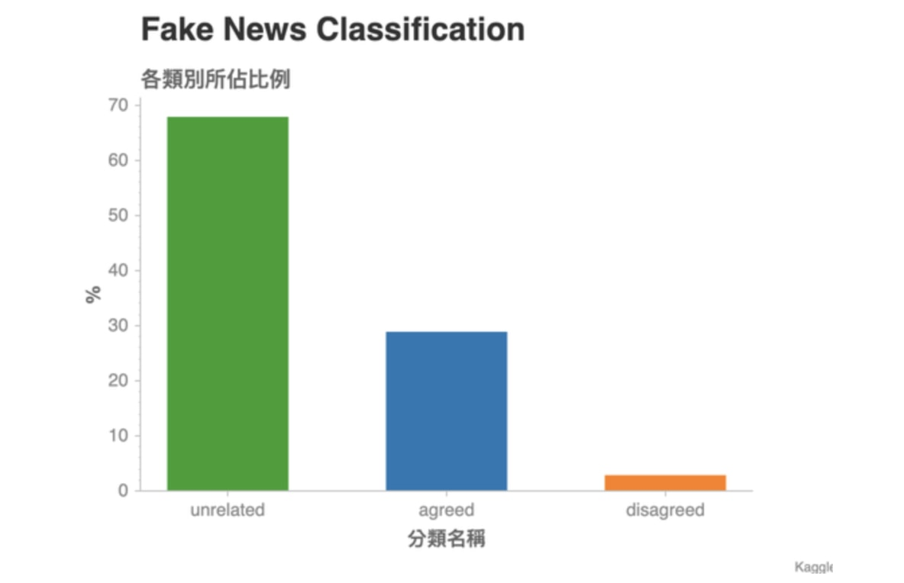
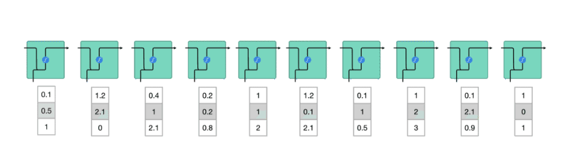
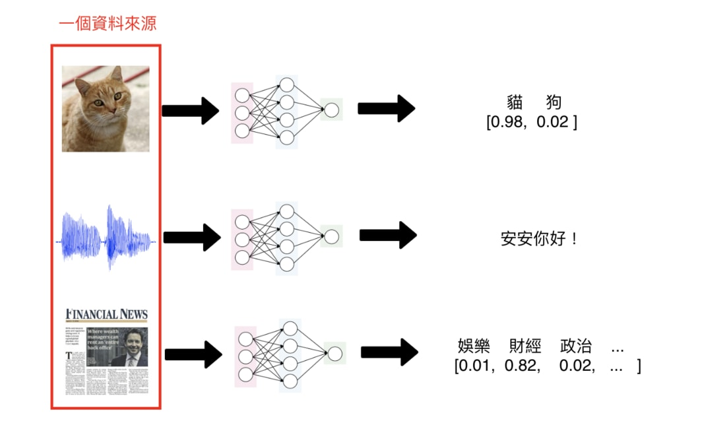
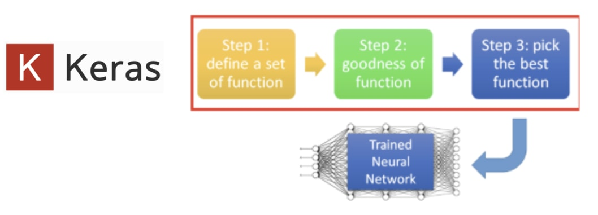
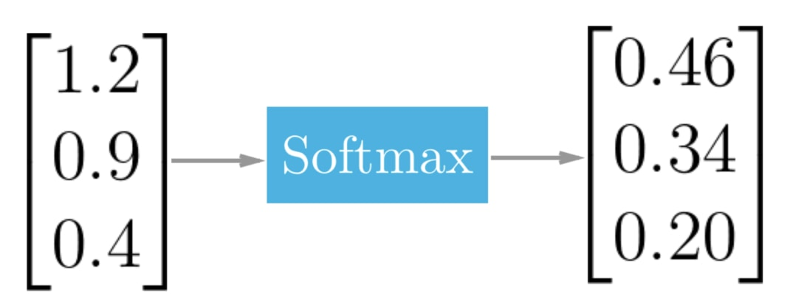
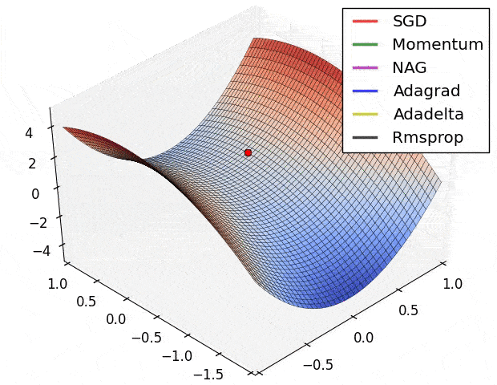
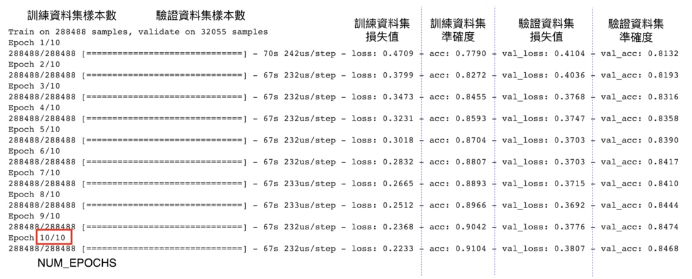

> 希望这篇文章能成为你前往自然语言处理世界的最佳桥梁。

自从[11月从比利时EMNLP](https://leemeng.tw/3-lessons-i-learnt-from-emnlp-2018-at-belgium.html)回来后，最近工作之余都在学习[自然语言处理](https://zh.wikipedia.org/wiki/自然语言处理)（Natural Language Processing,后简称为NLP）。

上上周阴错阳差地参加了一个[Kaggle](https://www.kaggle.com/)竞赛。在该比赛中，我实际应用到不少前阵子所学的NLP知识，也获得不少心得。


因此我想借此机会，在文中巨细靡遗地介绍自己在这次比赛运用以及学到的NLP概念，希望能帮助更多对人工智慧、[深度学习](https://zh.wikipedia.org/zh-tw/深度学习)或是NLP有兴趣但却不知如何开始的你，在阅读本故事之后能得到一些启发与方向，并展开自己的NLP之旅。


虽然不是必备，但有点程式经验会让你比较好理解本文的内容，因为在文中有不少[Python](https://www.python.org/)程式码；另外，如果你熟悉[深度学习（Deep Learning）](https://zh.wikipedia.org/zh-hant/深度学习)以及[神经网路（Neural Network）](https://zh.wikipedia.org/wiki/人工神经网络)，那你可以趁机复习一些以前学过的东西。

依据维基百科，NLP 的定义为：

> 自然语言处理（NLP）是计算机科学以及人工智慧的子领域，专注在如何让计算机处理并分析大量（人类的）自然语言数据。NLP 常见的挑战有语音辨识、自然语言理解、机器翻译以及自然语言的生成。

在这篇文章里头，我将描述如何利用最近学到的NLP知识以及深度学习框架[Keras](https://keras.io/)来教会神经网路如何辨别眼前的假新闻。


尽管此文的NLP任务是假新闻分类，你将可以把从此文学到的基础知识运用到如机器翻译、教机器写诗、语音辨识等大部分的NLP任务。我也会在文末附上[推荐的学习资源以及文章](https://leemeng.tw/shortest-path-to-the-nlp-world-a-gentle-guide-of-natural-language-processing-and-deep-learning-for-everyone.html#3-門推薦的線上課程)供你进一步探索。

如果你已经准备好展开一趟刺激的NLP 冒险之旅的话，就继续往下阅读吧！

## 本文章节

- [30 秒重要讯息](https://leemeng.tw/shortest-path-to-the-nlp-world-a-gentle-guide-of-natural-language-processing-and-deep-learning-for-everyone.html#30-秒重要訊息)
- [意料之外的Kaggle 竞赛](https://leemeng.tw/shortest-path-to-the-nlp-world-a-gentle-guide-of-natural-language-processing-and-deep-learning-for-everyone.html#意料之外的-Kaggle-競賽)
- [假新闻分类任务](https://leemeng.tw/shortest-path-to-the-nlp-world-a-gentle-guide-of-natural-language-processing-and-deep-learning-for-everyone.html#假新聞分類任務)
- [用直觉找出第一条底线](https://leemeng.tw/shortest-path-to-the-nlp-world-a-gentle-guide-of-natural-language-processing-and-deep-learning-for-everyone.html#用直覺找出第一條底線)
- [资料前处理：让机器能够处理文字](https://leemeng.tw/shortest-path-to-the-nlp-world-a-gentle-guide-of-natural-language-processing-and-deep-learning-for-everyone.html#資料前處理：讓機器能夠處理文字)
- [有记忆的循环神经网路](https://leemeng.tw/shortest-path-to-the-nlp-world-a-gentle-guide-of-natural-language-processing-and-deep-learning-for-everyone.html#有記憶的循環神經網路_1)
- [记忆力好的LSTM 细胞](https://leemeng.tw/shortest-path-to-the-nlp-world-a-gentle-guide-of-natural-language-processing-and-deep-learning-for-everyone.html#記憶力好的-LSTM-細胞)
- [词向量：将词汇表达成有意义的向量](https://leemeng.tw/shortest-path-to-the-nlp-world-a-gentle-guide-of-natural-language-processing-and-deep-learning-for-everyone.html#詞向量：將詞彙表達成有意義的向量)
- [一个神经网路，两个新闻标题](https://leemeng.tw/shortest-path-to-the-nlp-world-a-gentle-guide-of-natural-language-processing-and-deep-learning-for-everyone.html#一個神經網路，兩個新聞標題)
- [深度学习3 步骤](https://leemeng.tw/shortest-path-to-the-nlp-world-a-gentle-guide-of-natural-language-processing-and-deep-learning-for-everyone.html#深度學習-3-步驟)
- [进行预测并提交结果](https://leemeng.tw/shortest-path-to-the-nlp-world-a-gentle-guide-of-natural-language-processing-and-deep-learning-for-everyone.html#進行預測並提交結果_1)
- [我们是怎么走到这里的](https://leemeng.tw/shortest-path-to-the-nlp-world-a-gentle-guide-of-natural-language-processing-and-deep-learning-for-everyone.html#我們是怎麼走到這裡的)
- [3 门推荐的线上课程](https://leemeng.tw/shortest-path-to-the-nlp-world-a-gentle-guide-of-natural-language-processing-and-deep-learning-for-everyone.html#3-門推薦的線上課程)
- [结语：从掌握基础到运用巨人之力](https://leemeng.tw/shortest-path-to-the-nlp-world-a-gentle-guide-of-natural-language-processing-and-deep-learning-for-everyone.html#結語：從掌握基礎到運用巨人之力)

本文编排已将手机读者放在第一位，但我仍然建议你使用较大的萤幕阅读。

使用画面左侧的章节传送门能让你更轻松地在各章节之间跳转（目前手机不支援，抱歉）


## 30秒重要讯息

没错，光看上面的章节数，你应该了解无法在10 分钟内KO 这篇文章，但我相信这篇文章会是你学习NLP 基础的最短捷径之一。

针对那些时间宝贵的你，我在这边直接列出本文想传达的3 个重要讯息：

1. 深度学习发展神速，令人不知从何开始学习。但你总是要[从某个地方开始好好地学习基础](https://leemeng.tw/shortest-path-to-the-nlp-world-a-gentle-guide-of-natural-language-processing-and-deep-learning-for-everyone.html#3-門推薦的線上課程)
2. NLP 接下来的发展只会更加快速，就连一般人也能弄出厉害的语言处理模型
3. 站在巨人的肩膀之上，活用前人成果与经验能让你前进地更快，更有效率

这些陈述看似陈腔滥调，但希望好奇心能让你实际阅读本文，找出构成这些结论的蛛丝马迹。

让我们开始吧！

## 意料之外的Kaggle竞赛

[Kaggle](https://www.kaggle.com/)是一个资料科学家以及机器学习爱好者互相切磋的数据建模和数据分析竞赛平台。

本文提到的Kaggle竞赛是[WSDM - Fake News Classification](https://www.kaggle.com/c/fake-news-pair-classification-challenge)。

此竞赛的目的在于想办法自动找出假新闻以节省人工检查的成本。资料集则是由中国的手机新闻应用：[今日头条](https://www.toutiao.com/)的母公司[字节跳动](https://zh.wikipedia.org/wiki/字节跳动)所提出的。（知名的抖音也是由该公司的产品）

本文的Kaggle竞赛（[图片来源](https://www.kaggle.com/c/fake-news-pair-classification-challenge)）


而因为我所任职的[SmartNews](https://www.smartnews.com/en/)主打产品也是手机新闻应用（主要针对日本与美国用户），像是这种哪个企业又办了Kaggle竞赛、又开发什么新功能等等的消息都会在公司内部流动。

话虽如此，在我从同事得知这个为期一个月的竞赛时，事实上离截止时间只剩一个礼拜了！（傻眼）

今年10月底参加的EMNLP （[图片来源](https://leemeng.tw/3-lessons-i-learnt-from-emnlp-2018-at-belgium.html)）


但心念一转，想说从[EMNLP会议](https://leemeng.tw/3-lessons-i-learnt-from-emnlp-2018-at-belgium.html)回来后也学了一些不少NLP知识，不仿就趁着这个机会，试着在一周内兜出个模型来解决这个问题。

名符其实的「志在参加」。

## 假新闻分类任务

既然决定要参加了，当然得看看资料集长的什么样子。训练资料集（Training Set）约有32 万笔数据、测试资料集（Test Set）则约为8 万笔。而训练资料集一部份的内容如下所示：


要了解此资料集，让我们先专注在第一列（Row），大蒜与地沟油新闻的每一个栏位。

（部分读者可能会对简体中文表示意见，但请体谅我没有办法事先将此大量数据全部转为繁体）

第一栏位`title1_zh`代表的是「已知假新闻」 A的中文标题：

```
用大蒜鉴别地沟油的方法,怎么鉴别地沟油
```

而第二栏位`title2_zh`则是一笔新的新闻B的中文标题，我们还不知道它的真伪：

```
翻炒大蒜可鉴别地沟油
```

要判断第二栏中的新闻标题是否为真，我们可以把它跟已知的第一篇假新闻做比较，分为3 个类别：

- `unrelated`：B 跟A 没有关系
- `agreed`：B 同意A 的叙述
- `disagreed`：B 不同意A 的叙述

如果新闻B 同意假新闻A 的叙述的话，我们可以将B 也视为一个假新闻；而如果B 不同意假新闻A 的叙述的话，我们可以放心地将B 新闻释出给一般大众查看；如果B与A 无关的话，可以考虑再进一步处理B。（这处理不在本文讨论范畴内）

如果B 新闻「同意」假新闻A 的话，我们大可将B 新闻也视为假新闻，最后将其屏除


接着看到资料集（下图）第一列最右边的`label`栏位为`agreed`，代表B同意A的叙述，则我们可以判定B也是假新闻。


这就是一个简单的「假新闻分类问题」：给定一个成对的新闻标题A & B，在已知A 为假新闻的情况下，预测B 跟A 之间的关系。其关系可以分为3 个类别：

- unrelated
- agreed
- disagreed

顺带一提，上图同时包含了3 个类别的例子供你了解不同分类的实际情况。

第3、 4 栏位则为新闻标题的英文翻译。而因为该翻译为机器翻译，不一定能100% 正确反映本来中文新闻想表达的意思，因此接下来的文章会忽视这两个栏位，只使用简体中文的新闻标题来训练NLP 模型。

## 用直觉找出第一条底线

现在任务目标很明确了，我们就是要将有32 万笔数据的训练资料集（Training Set）交给我们的NLP 模型，让它「阅读」每一列里头的假新闻A 与新闻B 的标题并了解它们之间的关系（不相关、B 同意A、B 不同意A）。

理想上，在看过一大堆案例以后，我们的模型就能够「学会」一些法则，让它在被给定一组从来没看过的假新闻标题A 以及新闻标题B 的情况下，也能正确判断新闻A 与新闻B 的关系。

而所谓的「模型从来没看过的数据」，指的当然就是8 万笔的测试资料集（Test Set）了。

我们利用训练资料集教模型学习，并用测试资料集挑战模型（[图片来源](https://elitedatascience.com/model-training)）


这样的陈述是一个非常典型的[机器学习（Machine Learning, ML）](https://zh.wikipedia.org/wiki/机器学习)问题。我们当然希望不管使用什么样的模型，该模型都能够帮我们减少人工检查的成本，并同时最大化分类的准确度。

但在开始使用任何ML 方法之前，为了衡量我们的自动化模型能提供多少潜在价值，让我们先找出一个简单方法作为底线（Baseline）。



这张图显示了训练资料集（Training Set）里头各个分类所占的比例。是一个常见的Unbalanced Dataset：特定的分类占了数据的大半比例。

我们可以看到接近70 % 的「成对新闻」都是不相关的。这边的「成对新闻」指的是资料集里，每一行的假新闻标题A 以及对应的标题B 所组成的pairs。

现在假设测试资料集（Test Set）的数据分布跟训练资料集相差不远，且衡量一个分类模型的指标是准确度（Accuracy）：100 组成对新闻中，模型猜对几组。

这时候如果要你用一个简单法则来分类所有成对新闻，并同时最大化准确度，你会怎么做？


对没错，就是全部猜`unrelated`就对了！

事实上，此竞赛在Evaluation阶段使用[Weighted Categorization Accuracy](https://www.kaggle.com/c/fake-news-pair-classification-challenge#evaluation)，来稍微调降猜对`unrelated`的分数。毕竟（1）能正确判断出两个新闻是`unrelated`跟（2）能判断出新闻B `disagreed`假新闻A的价值是不一样的。（后者的价值比较高，因为比较稀有）

但使用[多数票决（Majority Votes）](https://en.wikipedia.org/wiki/Majority_rule)的简单方法还是能得到0.666的成绩（满分为1）：


不过当你前往该[Kaggle排行榜](https://www.kaggle.com/c/fake-news-pair-classification-challenge/leaderboard)的时候，却会发现不少人低于这个标准：


第一次参加Kaggle 的人可能会觉得这现象很奇怪。

但这是由于Kaggle 竞赛1 天只能提交2 次结果，因此通常不会有人浪费提交次数来上传「多数票决」的结果（尽管分数会上升，大家还是会想把仅仅2 次的上传机会用来测试自己的ML 模型的准确度）；另外也是因为不少人是上传1、2 次就放弃比赛了。

但如果你的ML 或深度学习模型怎样都无法超过一个简单法则的baseline 的话，或许最后上传该baseline 的结果也不失为提升排名的最后手段（笑）

> 找出Baseline，可以让我们判断手上训练出来的机器学习模型有多少潜在价值、值不值得再继续花费自己的研究时间与电脑计算能力。

现在我们知道，要保证做出来的模型有点价值，最少要超过baseline 才可以。以本文来说，就是多数票决法则得到的0.666 准确度。

（ baseline 的定义依照研究目的以及比较方法而有所不同）

## 资料前处理：让机器能够处理文字

要让电脑或是任何NLP 模型理解一篇新闻标题在说什么，我们不能将自己已经非常习惯的语言文字直接扔给电脑，而是要转换成它熟悉的形式：数字。


因此这章节就是介绍一系列的数据转换步骤，来将人类熟悉的语言如：

```
用大蒜鉴别地沟油的方法,怎么鉴别地沟油
```

转换成人脑不易理解，但很「机器友善」的数字序列（Sequence of Numbers）：

```
[ 217 , 1268 , 32 , 1178 , 25 , 489 , 116 ]      
```

如果你对此步骤已经非常熟悉，可以假设我们已经对数据做完必要的处理，直接跳到下一章的[有记忆的循环神经网路](https://leemeng.tw/shortest-path-to-the-nlp-world-a-gentle-guide-of-natural-language-processing-and-deep-learning-for-everyone.html#有記憶的循環神經網路_1)。

这章节的数据转换步骤包含：

- [文本分词（Text Segmentation）](https://leemeng.tw/shortest-path-to-the-nlp-world-a-gentle-guide-of-natural-language-processing-and-deep-learning-for-everyone.html#文本分詞)
- [建立字典并将文本转成数字序列](https://leemeng.tw/shortest-path-to-the-nlp-world-a-gentle-guide-of-natural-language-processing-and-deep-learning-for-everyone.html#建立字典並將文本轉成數字序列)
- [序列的Zero Padding](https://leemeng.tw/shortest-path-to-the-nlp-world-a-gentle-guide-of-natural-language-processing-and-deep-learning-for-everyone.html#序列的-Zero-Padding)
- [将正解做One-hot Encoding](https://leemeng.tw/shortest-path-to-the-nlp-world-a-gentle-guide-of-natural-language-processing-and-deep-learning-for-everyone.html#將正解做-One-hot-Encoding)

如果你现在不知道上述所有词汇的意思，别担心！

你接下来会看到文字数据在丢入机器学习/ 深度学习模型之前，通常需要经过什么转换步骤。搭配说明，我相信你可以轻易地理解以下每个步骤的逻辑。

在这之前，先让我们用[Pandas](https://pandas.pydata.org/)将训练资料集读取进来：

```python
import pandas as pd
train = pd.read_csv(
    TRAIN_CSV_PATH, index_col=0)
train.head(3)
```

|      | tid1 | tid2 |                                                   title1_zh |                                       title2_zh |                                         title1_en |                                         title2_en |     label |
| :--- | ---: | ---: | ----------------------------------------------------------: | ----------------------------------------------: | ------------------------------------------------: | ------------------------------------------------: | --------: |
| id   |      |      |                                                             |                                                 |                                                   |                                                   |           |
| 0    |    0 |    1 |      2017养老保险又新增两项，农村老人人人可申领，你领到了吗 |    警方辟谣“鸟巢大会每人领5万” 仍有老人坚持进京 | There are two new old-age insurance benefits f... | Police disprove "bird's nest congress each per... | unrelated |
| 3    |    2 |    3 | "你不来深圳，早晚你儿子也要来"，不出10年深圳人均GDP将超香港 | 深圳GDP首超香港？深圳统计局辟谣：只是差距在缩小 | "If you do not come to Shenzhen, sooner or lat... | Shenzhen's GDP outstrips Hong Kong? Shenzhen S... | unrelated |
| 1    |    2 |    4 | "你不来深圳，早晚你儿子也要来"，不出10年深圳人均GDP将超香港 |             GDP首超香港？深圳澄清：还差一点点…… | "If you do not come to Shenzhen, sooner or lat... | The GDP overtopped Hong Kong? Shenzhen clarifi... | unrelated |

跟我们在Kaggle 预览的数据一致。不过为了画面简洁，让我们只选取2 个中文新闻标题以及分类结果（Label）的栏位：

```python
cols = ['title1_zh', 
        'title2_zh', 
        'label']
train = train.loc[:, cols]
train.head(3)
```

|      |                                                   title1_zh |                                       title2_zh |     label |
| :--- | ----------------------------------------------------------: | ----------------------------------------------: | --------: |
| id   |                                                             |                                                 |           |
| 0    |      2017养老保险又新增两项，农村老人人人可申领，你领到了吗 |    警方辟谣“鸟巢大会每人领5万” 仍有老人坚持进京 | unrelated |
| 3    | "你不来深圳，早晚你儿子也要来"，不出10年深圳人均GDP将超香港 | 深圳GDP首超香港？深圳统计局辟谣：只是差距在缩小 | unrelated |
| 1    | "你不来深圳，早晚你儿子也要来"，不出10年深圳人均GDP将超香港 |             GDP首超香港？深圳澄清：还差一点点…… | unrelated |

有了必要的栏位以后，我们可以开始进行数据的前处理了。

### 文本分词

[文本分词（Text Segmentation）](https://en.wikipedia.org/wiki/Text_segmentation)是一个将一连串文字切割成多个有意义的单位的步骤。这单位可以是

- 一个中文汉字/ 英文字母（Character）
- 一个中文词汇/ 英文单字（Word）
- 一个中文句子/ 英文句子（Sentence）

依照不同的NLP 任务会有不同切割需求，但很常见的切法是以单字（Word）为单位，也就是Word Segmentation。


以英文来说，Word Segmentation 十分容易。通常只要依照空白分割，就能得到一个有意义的词汇列表了（在这边让我们先无视标点符号）：

```python
text = 'I am Meng Lee, a data scientist based in Tokyo.'
words = text.split(' ')
words
['I', 'am', 'Meng', 'Lee,', 'a', 'data', 'scientist', 'based', 'in', 'Tokyo.']
```

但很明显地，中文无法这样做。这时候我们将借助[Jieba](https://github.com/fxsjy/jieba)这个中文断词工具，来为一连串的文字做有意义的切割：

```python
import jieba.posseg as pseg

text = '我是李孟，在東京工作的數據科學家'
words = pseg.cut(text)
[word for word in words]
[pair('我', 'r'),
 pair('是', 'v'),
 pair('李孟', 'nr'),
 pair('，', 'x'),
 pair('在', 'p'),
 pair('東京', 'ns'),
 pair('工作', 'vn'),
 pair('的', 'uj'),
 pair('數據', 'n'),
 pair('科學家', 'n')]
```

如上所示，Jieba 将我们的中文文本切成有意义的词汇列表，并为每个词汇附上对应的词性（Flag）。

假设我们不需要标点符号，则只要将`flag == x`的词汇去除即可。

我们可以写一个很简单的Jieba断词函式，此函式能将输入的文本`text`断词，并回传除了标点符号以外的词汇列表：

```python
def jieba_tokenizer(text):
    words = pseg.cut(text)
    return ' '.join([
        word for word, flag in words if flag != 'x'])
```

我们可以利用Pandas的`apply`函式，将`jieba_tokenizer`套用到所有新闻标题A以及B之上，做文本分词：

```python
train['title1_tokenized'] = \
    train.loc[:, 'title1_zh'] \
         .apply(jieba_tokenizer)
train['title2_tokenized'] = \
    train.loc[:, 'title2_zh'] \
         .apply(jieba_tokenizer)
```

新闻标题A 的断词结果如下：

```python
train.iloc[:, [0, 3]].head()
```

|      |                                                   title1_zh |                                        title1_tokenized |
| :--- | ----------------------------------------------------------: | ------------------------------------------------------: |
| id   |                                                             |                                                         |
| 0    |      2017养老保险又新增两项，农村老人人人可申领，你领到了吗 |     2017 养老保险又新增两项农村老人人人可申领你领到了吗 |
| 3    | "你不来深圳，早晚你儿子也要来"，不出10年深圳人均GDP将超香港 | 你不来深圳早晚你儿子也要来不出10 年深圳人均GDP 将超香港 |
| 1    | "你不来深圳，早晚你儿子也要来"，不出10年深圳人均GDP将超香港 | 你不来深圳早晚你儿子也要来不出10 年深圳人均GDP 将超香港 |
| 2    | "你不来深圳，早晚你儿子也要来"，不出10年深圳人均GDP将超香港 | 你不来深圳早晚你儿子也要来不出10 年深圳人均GDP 将超香港 |
| 9    |                      "用大蒜鉴别地沟油的方法,怎么鉴别地沟油 |                    用大蒜鉴别地沟油的方法怎么鉴别地沟油 |

新闻标题B 的结果则为：

```python
train.iloc[:, [1, 4]].head()
```

|      |                                       title2_zh |                             title2_tokenized |
| :--- | ----------------------------------------------: | -------------------------------------------: |
| id   |                                                 |                                              |
| 0    |    警方辟谣“鸟巢大会每人领5万” 仍有老人坚持进京 |   警方辟谣鸟巢大会每人领5 万仍有老人坚持进京 |
| 3    | 深圳GDP首超香港？深圳统计局辟谣：只是差距在缩小 | 深圳GDP 首超香港深圳统计局辟谣只是差距在缩小 |
| 1    |             GDP首超香港？深圳澄清：还差一点点…… |               GDP 首超香港深圳澄清还差一点点 |
| 2    |  去年深圳GDP首超香港？深圳统计局辟谣：还差611亿 | 去年深圳GDP 首超香港深圳统计局辟谣还差611 亿 |
| 9    |    吃了30年食用油才知道，一片大蒜轻松鉴别地沟油 |  吃了30 年食用油才知道一片大蒜轻松鉴别地沟油 |

太棒了，将新闻标题切割成一个个有意义的词汇以后，我们就能进入下一个步骤了！

另外值得一提的是，不管最后是使用哪种切法，切完之后的每个文字片段在NLP 领域里头习惯上会被称之为Token。（如上例中的警方、GDP）

### 建立字典并将文本转成数字序列

当我们将完整的新闻标题切成一个个有意义的词汇（Token）以后，下一步就是将这些词汇转换成一个数字序列，方便电脑处理。

这些数字是所谓的索引（Index），分别对应到特定的词汇。


为了方便你理解这小节的概念，想像个极端的例子。假设我们现在就只有一个新闻标题：「狐狸被陌生人拍照」。

这时候要怎么将这个句子转成一个数字的序列呢？跟上一小节相同，我们首先会对此标题做断词，将句子分成多个有意义的词汇：

```python
text = '狐狸被陌生人拍照'
words = pseg.cut(text)
words = [w for w, f in words]
words
['狐狸', '被', '陌生人', '拍照']
```

有了词汇的列表以后，我们可以建立一个字典`word_index`。

该dict 里头将上面的4 个词汇当作键值（Key），每个键值对应的值（Value）则为不重复的数字：

```python
word_index = {
    word: idx  
    for idx, word in enumerate(words)
}
word_index
{'狐狸': 0, '被': 1, '陌生人': 2, '拍照': 3}
```

有了这个字典以后，我们就能把该句子转成一个数字序列：

```python
print(words)
print([word_index[w] for w in words])
['狐狸', '被', '陌生人', '拍照']
[0, 1, 2, 3]
```

简单明了，不是吗？

如果来了一个新的句子：「陌生人被狐狸拍照」，我们也能利用手上已有的字典`word_index`如法炮制：

```python
text = '陌生人被狐狸拍照'
words = pseg.cut(text)
words = [w for w, f in words]
print(words)
print([word_index[w] for w in words])
['陌生人', '被', '狐狸', '拍照']
[2, 1, 0, 3]
```

在这个简单的狐狸例子里头，`word_index`就是我们的字典；我们利用该字典，将1句话转成包含多个数字的序列，而每个数字实际上代表着一个Token。

同理，我们可以分4 个步骤将手上的新闻标题全部转为数字序列：

1. 将已被断词的新闻标题A 以及新闻标题B 全部倒在一起
2. 建立一个空字典
3. 查看所有新闻标题，里头每出现一个字典里头没有的词汇，就为该词汇指定一个字典里头还没出现的索引数字，并将该词汇放入字典
4. 利用建好的字典，将每个新闻标题里头包含的词汇转换成数字


这种文字前处理步骤因为出现频率实在太过频繁，Keras 有专门的文字前处理模组来提升我们的效率：

```python
import keras
MAX_NUM_WORDS = 10000
tokenizer = keras \
    .preprocessing \
    .text \
    .Tokenizer(num_words=MAX_NUM_WORDS)
```

Tokenizer顾名思义，即是将一段文字转换成一系列的词汇（Tokens），并为其建立字典。这边的`num_words=10000`代表我们限制字典只能包含10,000个词汇，一旦字典达到这个大小以后，剩余的新词汇都会被视为Unknown，以避免字典过于庞大。

如同上述的步骤1，我们得将新闻A 及新闻B 的标题全部聚集起来，为它们建立字典：

```python
corpus_x1 = train.title1_tokenized
corpus_x2 = train.title2_tokenized
corpus = pd.concat([
    corpus_x1, corpus_x2])
corpus.shape
(641086,)
```

因为训练集有大约32 万列（Row）的成对新闻（每一列包含2 笔新闻：A & B），因此将所有新闻放在一起的话，就有2 倍的大小。而这些文本的集合在习惯上被称作语料库（Text Corpus），代表着我们有的所有文本数据。

以下是我们语料库的一小部分：

```python
pd.DataFrame(corpus.iloc[:5],
             columns=['title'])
```

|      |                                                   title |
| :--- | ------------------------------------------------------: |
| id   |                                                         |
| 0    |     2017 养老保险又新增两项农村老人人人可申领你领到了吗 |
| 3    | 你不来深圳早晚你儿子也要来不出10 年深圳人均GDP 将超香港 |
| 1    | 你不来深圳早晚你儿子也要来不出10 年深圳人均GDP 将超香港 |
| 2    | 你不来深圳早晚你儿子也要来不出10 年深圳人均GDP 将超香港 |
| 9    |                    用大蒜鉴别地沟油的方法怎么鉴别地沟油 |

有了语料库以后，接下来就是呼叫`tokenizer`为我们查看所有文本，并建立一个字典（步骤2 & 3）：

```python
tokenizer.fit_on_texts(corpus)
```

以我们的语料库大小来说，这大约需时10秒钟。而等到`tokenizer`建好字典以后，我们可以进行上述第4个步骤，请`tokenizer`利用内部生成的字典分别将我们的新闻标题A与新闻B转换成数字序列：

```python
x1_train = tokenizer \
    .texts_to_sequences(corpus_x1)
x2_train = tokenizer \
    .texts_to_sequences(corpus_x2)
```

让我们看看结果：

```python
len(x1_train)
320543
x1_train[:1]
[[217, 1268, 32, 1178, 5967, 25, 489, 2877, 116, 5559, 4, 1850, 2, 13]]
```

`x1_train`为一个Python `list`，里头包含了每一笔假新闻标题A对应的数字序列。

让我们利用`tokenizer.index_word`来将索引数字对应回本来的词汇：

```python
for seq in x1_train[:1]:
    print([tokenizer.index_word[idx] for idx in seq])
['2017', '养老保险', '又', '新增', '两项', '农村', '老人', '人人', '可', '申领', '你', '领到', '了', '吗']
```

轻松写意，不是吗？

到此为止，我们已经将所有新闻标题转换成电脑容易处理的数字序列，进入下个步骤！

### 序列的Zero Padding 

虽然我们已经将每个新闻标题的文本转为一行行的数字序列，你会发现每篇标题的序列长度并不相同：

```python
for seq in x1_train[:10]:
    print(len(seq), seq[:5], ' ...')
14 [217, 1268, 32, 1178, 5967]  ...
19 [4, 10, 47, 678, 2558]  ...
19 [4, 10, 47, 678, 2558]  ...
19 [4, 10, 47, 678, 2558]  ...
9 [31, 320, 3372, 3062, 1]  ...
19 [4, 10, 47, 678, 2558]  ...
6 [7, 2221, 1, 2072, 7]  ...
19 [4, 10, 47, 678, 2558]  ...
14 [1281, 1211, 427, 3, 3244]  ...
9 [31, 320, 3372, 3062, 1]  ...
```

最长的序列甚至达到61 个词汇：

```python
max_seq_len = max([
    len(seq) for seq in x1_train])
max_seq_len
61
```

而为了方便之后的NLP模型处理（见[循环神经网路](https://leemeng.tw/shortest-path-to-the-nlp-world-a-gentle-guide-of-natural-language-processing-and-deep-learning-for-everyone.html#有記憶的循環神經網路)一章），一般会设定一个`MAX_SEQUENCE_LENGTH`来让所有序列的长度一致。

长度超过此数字的序列尾巴会被删掉；而针对原来长度不足的序列，我们则会在词汇前面补零。Keras一样有个方便函式`pad_sequences`来帮助我们完成这件工作：

```python
MAX_SEQUENCE_LENGTH = 20
x1_train = keras \
    .preprocessing \
    .sequence \
    .pad_sequences(x1_train, 
                   maxlen=MAX_SEQUENCE_LENGTH)

x2_train = keras \
    .preprocessing \
    .sequence \
    .pad_sequences(x2_train, 
                   maxlen=MAX_SEQUENCE_LENGTH)
```

一般来说`MAX_SEQUENCE_LENGTH`可以设定成最长序列的长度（此例中的61）。但这边为了让模型可以只看前20个词汇就做出判断以节省训练时间，我们先暂时使用20这个数字。

让我们看看经过Zero Padding 的第一篇假新闻标题A 变成什么样子：

```python
x1_train[0]
array([   0,    0,    0,    0,    0,    0,  217, 1268,   32, 1178, 5967,
         25,  489, 2877,  116, 5559,    4, 1850,    2,   13], dtype=int32)
```

你可以清楚看到，因为该新闻标题原本的序列长度并没有达到刚刚设定的`MAX_SEQUENCE_LENGTH`，因此在总长度为20的序列中，前面6个值被Keras补上0以说明该序列中的前6个词汇并不存在。

我们还可以发现，所有的新闻标题都被转成长度为20 的数字序列了：

```python
for seq in x1_train + x2_train:
    assert len(seq) == 20
    
print("所有新聞標題的序列長度皆為 20 !")
所有新聞標題的序列長度皆為 20 !
```

再看一次转换后的新闻标题：

```python
x1_train[:5]
array([[   0,    0,    0,    0,    0,    0,  217, 1268,   32, 1178, 5967,
          25,  489, 2877,  116, 5559,    4, 1850,    2,   13],
       [   0,    4,   10,   47,  678, 2558,    4,  166,   34,   17,   47,
        5150,   63,   15,  678, 4502, 3211,   23,  284, 1181],
       [   0,    4,   10,   47,  678, 2558,    4,  166,   34,   17,   47,
        5150,   63,   15,  678, 4502, 3211,   23,  284, 1181],
       [   0,    4,   10,   47,  678, 2558,    4,  166,   34,   17,   47,
        5150,   63,   15,  678, 4502, 3211,   23,  284, 1181],
       [   0,    0,    0,    0,    0,    0,    0,    0,    0,    0,    0,
          31,  320, 3372, 3062,    1,   95,   98, 3372, 3062]],
      dtype=int32)
```

在这边，可以看到前5 个新闻标题都已经各自被转换为长度为20 的数字序列，而序列里头的每个数字则对应到字典里头一个特定的Token，整整齐齐。


到此为止，我们已经将原本以自然语言呈现的新闻标题转换成机器容易理解的数字序列了。很神奇，不是吗？

喔不过，别忘了还有`label`这个文字栏位等着我们的处理。

### 将正解做One-hot Encoding 

到目前为止，我们已经将所有的新闻标题以数字型态表示，只剩分类栏位`label`要进行从文本到数字的转换了：

```python
train.label[:5]
id
0    unrelated
3    unrelated
1    unrelated
2    unrelated
9       agreed
Name: label, dtype: object
```

不过`label`的处理相对简单。跟新闻标题相同，我们一样需要一个字典将分类的文字转换成索引：

```python
import numpy as np 

# 定義每一個分類對應到的索引數字
label_to_index = {
    'unrelated': 0, 
    'agreed': 1, 
    'disagreed': 2
}

# 將分類標籤對應到剛定義的數字
y_train = train.label.apply(
    lambda x: label_to_index[x])

y_train = np.asarray(y_train) \
            .astype('float32')

y_train[:5]
array([0., 0., 0., 0., 1.], dtype=float32)
```

现在每个分类的文字标签都已经被转成对应的数字，接着让我们利用Keras做[One Hot Encoding](https://hackernoon.com/what-is-one-hot-encoding-why-and-when-do-you-have-to-use-it-e3c6186d008f)：

```python
y_train = keras \
    .utils \
    .to_categorical(y_train)

y_train[:5]
array([[1., 0., 0.],
       [1., 0., 0.],
       [1., 0., 0.],
       [1., 0., 0.],
       [0., 1., 0.]], dtype=float32)
```

上述矩阵的每一列即为1 个label，而你可以看到现在每个label 都从1 个数字变成一个3 维的向量（Vector）。

每1 维度则对应到1 个分类：

- `[1, 0, 0]` 代表label 为 `unrelated`
- `[0, 1, 0]` 代表label 为 `agreed`
- `[0, 0, 1]` 代表label 为 `disagreed`

用这样的方式表达label的好处是我们可以把分类结果想成机率分布。`[1, 0, 0]`就代表一组新闻标题A、B为`unrelated`的机率等于100 %。

One Hot Encoding 示意图


在[决定如何衡量模型的表现](https://leemeng.tw/shortest-path-to-the-nlp-world-a-gentle-guide-of-natural-language-processing-and-deep-learning-for-everyone.html#決定如何衡量模型的表現)一节我们会看到，给定一组新闻标题A、B，我们的模型会预测此成对标题属于每个分类的机率值，比方说`[0.7, 0.2, 0.1]`。而此预测结果代表模型认为这2个新闻标题的关系有70 %的机率为`unrelated`、20 %的机率是`agreed`而10 %为`disagreed`。

因此，如果正解也事先用同样的方式表达的话，会让我们比较好计算以下两者之间的差距：

- 正确的分类的机率分布（`[1, 0, 0]`）
- 模型预测出的机率分布（`[0.7, 0.2, 0.1]`）

在知道预测结果跟正确解答之间差距多少之后，深度学习模型就会自动修正学习方向，想尽办法拉近这个差距。

好，到此为止所有的数据都已经被我们转换成方便机器使用的格式了。最后，让我们将整个资料集拆成[训练资料集&验证资料集](https://en.wikipedia.org/wiki/Training,_validation,_and_test_sets)以方便之后测试模型的效能。

（别哀号，我保证这是最后的前处理步骤了！）

### 切割训练资料集&验证资料集

这部分很简单，我们只需决定要将整个训练资料集（Training Set）的多少比例切出来当作验证资料集（Validation Set）。此例中我们用10 %。

但为何要再把本来的训练资料集切成2 个部分呢？

一般来说，我们在训练时只会让模型看到训练资料集，并用模型没看过的验证资料集来测试该模型在真实世界的表现。（毕竟我们没有测试资料集的答案）

我们会反覆在Train / Valid Set上训练并测试模型，最后用Test Set一决生死（[图片来源](https://towardsdatascience.com/train-validation-and-test-sets-72cb40cba9e7)）


等到模型在验证资料集也表现得够好后，便在最终的测试资料集（Test Set）进行最后一次的预测并将该结果上传到Kaggle。

要了解为何我们需要验证资料集可以查看[这边的讨论](https://stats.stackexchange.com/questions/19048/what-is-the-difference-between-test-set-and-validation-set)。

简而言之，当你多次利用验证资料集的预测结果以修正模型，并让它在该资料集表现更好时，[过适（Overfitting）](https://zh.wikipedia.org/wiki/過適)的风险就已经产生了。

反覆利用验证资料集的结果来修正模型表现，事实上就等于让模型「偷看」到验证资料集本身的资讯了


尽管你没有直接让模型看到验证资料集（Validation Set）内的任何数据，你还是间接地泄漏了该资料集的重要资讯：你让模型知道怎样的参数设定会让它在该资料集表现比较好，亦或表现较差。

因此有一个完全跟模型训练过程独立的测试资料集（Test Set）就显得重要许多了。（这也是为何我到现在都还没有碰它的原因）

> 机器学习模型努力从夏令营（训练及验证资料集）学习技能，并在真实世界（测试资料集）展示其学习结果。

回归正题，要切训练资料集/验证资料集，[scikit-learn](https://scikit-learn.org/stable/documentation.html)中的`train_test_split`函式是一个不错的选择：

```python
from sklearn.model_selection \
    import train_test_split

VALIDATION_RATIO = 0.1
# 小彩蛋
RANDOM_STATE = 9527

x1_train, x1_val, \
x2_train, x2_val, \
y_train, y_val = \
    train_test_split(
        x1_train, x2_train, y_train, 
        test_size=VALIDATION_RATIO, 
        random_state=RANDOM_STATE
)
```

在这边，我们分别将新闻标题A `x1_train`、新闻标题B `x2_train`以及分类标签`y_train`都分成两个部分：训练部分&验证部分。

以假新闻A的标题`x1_train`为例，本来完整32万笔的`x1_train`会被分为包含90 %数据的训练资料集`x1_train`以及10 %的验证资料集`x1_val`。

```python
print("-" * 10)
print(f"x1_train: {x1_train.shape}")
print(f"x2_train: {x2_train.shape}")
print(f"y_train : {y_train.shape}")

print("-" * 10)
print(f"x1_val:   {x1_val.shape}")
print(f"x2_val:   {x2_val.shape}")
print(f"y_val :   {y_val.shape}")
print("-" * 10)
print("Test Set")
Training Set
----------
x1_train: (288488, 20)
x2_train: (288488, 20)
y_train : (288488, 3)
----------
x1_val:   (32055, 20)
x2_val:   (32055, 20)
y_val :   (32055, 3)
----------
Test Set
```

我们可以看到，切割后的训练资料集有288,488 笔资料。每一笔资料里头，成对新闻标题A & B 的长度皆为20 个Tokens，分类结果则有3 个；验证资料集的内容一模一样，仅差在资料笔数较少（32,055 笔）。

到此为此，资料前处理大功告成！

既然我们已经为机器准备好它们容易理解的数字序列资料，接着就让我们来看看要使用怎么样的NLP 模型来处理这些数据。

## 有记忆的循环神经网路

针对这次的Kaggle竞赛，我们将使用[循环神经网路（Recurrent Neural Network,后简称RNN）](https://zh.wikipedia.org/wiki/递归神经网络)来处理刚刚得到的序列数据。

RNN 是一种有「记忆力」的神经网路，其最为人所知的形式如下：


如同上图等号左侧所示，RNN跟一般深度学习中常见的[前馈神经网路（Feedforward Neural Network,后简称FFNN）](https://en.wikipedia.org/wiki/Feedforward_neural_network)最不一样的地方在于它有一个回圈（Loop）。

要了解这个回圈在RNN 里头怎么运作，现在让我们想像有一个输入序列X（Input Sequence）其长相如下：

```python
X = [ What, time, is, it, ? ]
```

不同于FFNN，RNN在第一个时间点`t0`并不会直接把整个序列X读入。反之，在第一个时间点`t0`，它只将该序列中的第一个元素`x0`读入中间的细胞A。细胞A则会针对`x0`做些处理以后，更新自己的「状态」并输出第一个结果`h0`。


在下个时间点`t1`，RNN如法炮制，读入序列X中的下一个元素`x1`，并利用刚刚处理完`x0`得到的细胞状态，处理`x1`并更新自己的状态（也被称为记忆），接着输出另个结果`h1`。

剩下的`xt`都会被以同样的方式处理。但不管输入的序列X有多长，RNN的本体从头到尾都是等号左边的样子：回圈代表细胞A利用「上」一个时间点（比方说`t1`）储存的状态，来处理当下的输入（比方说`x2`）。


但如果你将不同时间点（`t0`、`t1`...）的RNN以及它的输入一起截图，并把所有截图从左到右一字排开的话，就会长得像等号右边的形式。

将RNN以右边的形式表示的话，你可以很清楚地了解，当输入序列越长，向右展开的RNN也就越长。（模型也就需要训练更久时间，这也是为何我们在资料前处理时[设定了序列的最长长度](https://leemeng.tw/shortest-path-to-the-nlp-world-a-gentle-guide-of-natural-language-processing-and-deep-learning-for-everyone.html#序列的-Zero-Padding)）

为了确保你100 % 理解RNN，让我们假设刚刚的序列X 实际上是一个内容如下的英文问句：

```
X = [ What , time , is , it , ? ]     
```

而且RNN已经处理完前两个元素`What`和`time`了。

则接下来RNN 会这样处理剩下的句子：

RNN一次只读入并处理序列的「一个」元素（[图片来源](https://www.youtube.com/watch?time_continue=2&v=LHXXI4-IEns)）


现在你可以想像为何RNN 非常适合拿来处理像是自然语言这种序列数据了。

就像你现在阅读这段话一样，你是由左到右逐字在大脑里处理我现在写的文字，同时不断地更新你脑中的记忆状态。

每当下个词汇映入眼中，你脑中的处理都会跟以下两者相关：

- 前面所有已读的词汇
- 目前脑中的记忆状态

当然，实际人脑的阅读机制更为复杂，但RNN 抓到这个处理精髓，利用内在回圈以及细胞内的「记忆状态」来处理序列资料。

RNN 按照顺序，处理一连串词汇的机制跟我们理解自然语言的方式有许多相似之处


到此为止，你应该已经了解RNN 的基本运作方式了。现在你可能会问：「那我们该如何实作一个RNN 呢？」

好问题，以下是一个简化到不行的RNN 实现：

```python
state_t = 0
for input_t in input_sequence:
    output_t = f(input_t, state_t)
    state_t = output_t
```

在RNN每次读入任何新的序列数据前，细胞A中的记忆状态`state_t`都会被初始化为0。

接着在每个时间点`t`，RNN会重复以下步骤：

- 读入`input_sequence`序列中的一个新元素`input_t`
- 利用`f`函式将当前细胞的状态`state_t`以及输入`input_t`做些处理产生`output_t`
- 输出`output_t`并同时更新自己的状态`state_t`

不需要自己发明轮子，在Keras 里头只要2 行就可以建立一个RNN layer：

```python
from keras import layers
rnn = layers.SimpleRNN()
```

使用深度学习框架可以帮我们省下非常多的宝贵时间并避免可能的程式错误。

我们后面还会看到，一个完整的神经网路通常会分成好几层（layer）：每一层取得前一层的结果作为输入，进行特定的资料转换后再输出给下一层。

常见的神经网路形式。图中框内有回圈的就是RNN层（[图片来源](https://www.slideshare.net/microlife/from-neural-networks-to-deep-learning)）


好啦，相信你现在已经掌握基本RNN了。事实上，除了`SimpleRNN`以外，Keras里头还有其他更常被使用的Layer，现在就让我们看看一个知名的例子：长短期记忆。

## 记忆力好的LSTM细胞

让我们再看一次前面的简易RNN 实作：

```python
state_t = 0
# 細胞 A 會重複執行以下處理
for input_t in input_sequence:
    output_t = f(input_t, state_t)
    state_t = output_t
```

在了解RNN的基本运作方式以后，你会发现RNN真正的魔法，事实上藏在细胞A的`f`函式里头。

要如何将细胞A当下的记忆`state_t`与输入`input_t`结合，才能产生最有意义的输出`output_t`呢？

在`SimpleRNN`的细胞A里头，这个`f`的实作很简单。而这导致其记忆状态`state_t`没办法很好地「记住」前面处理过的序列元素，造成RNN在处理后来的元素时，就已经把前面重要的资讯给忘记了。


这就好像一个人在讲了好长一段话以后，忘了前面到底讲过些什么的情境。

[长短期记忆（Long Short-Term Memory,后简称LSTM）](https://zh.wikipedia.org/wiki/長短期記憶)就是被设计来解决RNN的这个问题。

如下图所示，你可以把LSTM 想成是RNN 中用来实现细胞A 内部处理逻辑的一个特定方法：

以抽象的层次来看，LSTM就是实现RNN中细胞A逻辑的一个方式（[图片来源](https://colah.github.io/posts/2015-08-Understanding-LSTMs/)）


基本上一个LSTM 细胞里头会有3 个闸门（Gates）来控制细胞在不同时间点的记忆状态：

- Forget Gate：决定细胞是否要遗忘目前的记忆状态
- Input Gate：决定目前输入有没有重要到值得处理
- Output Gate：决定更新后的记忆状态有多少要输出

透过这些闸门控管机制，LSTM 可以将很久以前的记忆状态储存下来，在需要的时候再次拿出来使用。值得一提的是，这些闸门的参数也都是神经网路自己训练出来的。

下图显示各个闸门所在的位置：

LSTM细胞顶端那条cell state正代表着细胞记忆的转换过程（[图片来源](https://towardsdatascience.com/illustrated-guide-to-lstms-and-gru-s-a-step-by-step-explanation-44e9eb85bf21)）


想像LSTM 细胞里头的记忆状态是一个包裹，上面那条直线就代表着一个输送带。

LSTM 可以把任意时间点的记忆状态（包裹）放上该输送带，然后在未来的某个时间点将其原封不动地取下来使用。


因为这样的机制，让LSTM 即使面对很长的序列数据也能有效处理，不遗忘以前的记忆。

因为效果卓越，LSTM非常广泛地被使用。事实上，当有人跟你说他用RNN做了什么NLP专案时，有9成机率他是使用LSTM或是[GRU（LSTM的改良版，只使用2个闸门）](https://en.wikipedia.org/wiki/Gated_recurrent_unit)来实作，而不是使用最简单的`SimpleRNN`。

因此，在这次Kaggle 竞赛中，我们的第一个模型也将使用LSTM。而在Keras 里头要使用LSTM 也是轻松写意：

```python
from keras import layers
lstm = layers.LSTM()
```

现在，既然我们已经有了在[资料前处理步骤](https://leemeng.tw/shortest-path-to-the-nlp-world-a-gentle-guide-of-natural-language-processing-and-deep-learning-for-everyone.html#資料前處理：讓機器能夠處理文字)被转换完成的序列数据，也决定好要使用LSTM作为我们的NLP模型，接着就让我们试着将这些数据读入LSTM吧！

## 词向量：将词汇表达成有意义的向量

在将序列数据塞入模型之前，让我们重新检视一下数据。比方说，以下是在训练资料集里头前5 笔的假新闻标题A：

```python
for i, seq in enumerate(x1_train[:5]):
    print(f"新聞標題 {i + 1}: ")
    print(seq)
    print()
新聞標題 1: 
[   0    0    0  185  300   72 4029   37    1  121  250   95   30  511
   92 2358   33 2565   19   55]

新聞標題 2: 
[   0    0    0    0    0    0    0    0    0    0    0    0    0 7149
   54  130 8454 3404 6172   66]

新聞標題 3: 
[   0    0    0    0    0    0    0    0    0    0    0    0    0    0
    0   87 6339   59 5236 2848]

新聞標題 4: 
[   0    0    0    0    0    0    0   59   18 1780    1   63   30 2526
 1017 1466   25   11  139   50]

新聞標題 5: 
[   0    0    0    0    0   25    9   24 1402   12  667   63   64  483
 9523  303 1402   18  332 3258]
```

你可以看到，每个新闻标题都被转成长度为20的数字序列。里头的每个数字都代表着一个词汇（`0`代表[Zero Padding](https://leemeng.tw/shortest-path-to-the-nlp-world-a-gentle-guide-of-natural-language-processing-and-deep-learning-for-everyone.html#序列的-Zero-Padding)）。

```python
x1_train.shape
(288488, 20)
```

而我们在训练资料集则总共有288,488 笔新闻标题，每笔标题如同刚刚所说的，是一个包含20 个数字的序列。

当然，我们可以用`tokenizer`里头的字典`index_word`还原文本看看：

```python
for i, seq in enumerate(x1_train[:5]):
    print(f"新聞標題 {i + 1}: ")
    print([tokenizer.index_word.get(idx, '') for idx in seq])
    print()
新聞標題 1: 
['', '', '', '皮肤', '白', '到', '逆', '天', '的', '范冰冰', '美白', '方法', '大', '揭秘', '做', '面膜', '个', '小动作', '就', '可以']

新聞標題 2: 
['', '', '', '', '', '', '', '', '', '', '', '', '', '张家口', '一个', '男子', '持', '猛', '踹', '孩子']

新聞標題 3: 
['', '', '', '', '', '', '', '', '', '', '', '', '', '', '', '种', '杂草', '农民', '年收入', '几十万']

新聞標題 4: 
['', '', '', '', '', '', '', '农民', '能', '享受', '的', '10', '大', '政府', '特别', '补助', '农村', '人', '得', '知道']

新聞標題 5: 
['', '', '', '', '', '农村', '这', '3', '类人', '有', '近', '10', '万', '宅基地', '补偿款', '还有', '类人', '能', '免费', '住房']
```

其他新闻标题像是：

- 训练资料集中的新闻标题 B `x2_train`
- 验证资料集中的新闻标题 A `x1_val`
- 验证资料集中的新闻标题 B `x2_val`

也都是以这样的数字序列形式被储存。

但事实上要让神经网路能够处理标题序列内的词汇，我们要将它们表示成向量（更精准地说，是[张量：Tensor](https://zh.wikipedia.org/wiki/張量)），而不是一个单纯数字。

如果我们能做到这件事情，则RNN 就能用以下的方式读入我们的资料：

注意：在每个时间点被塞入RNN的「词汇」不再是1个数字，而是一个N维向量（图中N为3） （[图片来源](https://towardsdatascience.com/illustrated-guide-to-lstms-and-gru-s-a-step-by-step-explanation-44e9eb85bf21)）


所以现在的问题变成：

「要怎么将一个词汇表示成一个N 维向量？」

其中一个方法是我们随便决定一个N，然后为语料库里头的每一个词汇都指派一个随机生成的N 维向量。

假设我们现在有5 个词汇：

- 野狼
- 老虎
- 狗
- 猫
- 喵咪

依照刚刚说的方法，我们可以设定N = 2，并为每个词汇随机分配一个2 维向量后将它们画在一个平面空间里头：


这些代表词汇的向量被称之为词向量，但是你可以想像这样的随机转换很没意义。

比方说上图，我们就无法理解：

- 为何「狗」是跟「老虎」而不是跟同为犬科的「野狼」比较接近？
- 为何「猫」的维度2 比「狗」高，但却比「野狼」低？
- 维度2 的值的大小到底代表什么意义？
- 「喵咪」怎么会在那里？

这是因为我们只是将词汇随机地转换到2 维空间，并没有让这些转换的结果（向量）反应出词汇本身的语意（Semantic）。

一个理想的转换应该是像底下这样：


在这个2 维空间里头，我们可以发现一个好的转换有2 个特性：

- 距离有意义：「喵咪」与意思相近的词汇「猫」距离接近，而与较不相关的「狗」距离较远
- 维度有意义：看看（狗, 猫）与（野狼, 老虎）这两对组合，可以发现我们能将维度1 解释为猫科VS 犬科；维度2 解释为宠物与野生动物


如果我们能把语料库（Corpus）里头的每个词汇都表示成一个像是这样有意义的词向量，神经网路就能帮我们找到潜藏在大量词汇中的语义关系，并进一步改善NLP 任务的精准度。

好消息是，大部分的情况我们并不需要自己手动设定每个词汇的词向量。我们可以随机初始化所有词向量（如前述的随机转换），并利用平常训练神经网路的[反向传播算法（Backpropagation）](https://zh.wikipedia.org/wiki/反向传播算法)，让神经网路自动学到一组适合当前NLP任务的词向量（如上张图的理想状态）。

反向传播让神经网路可以在训练过程中修正参数，持续减少预测错误的可能性（[图片来源](https://www.youtube.com/watch?v=Ilg3gGewQ5U)）


在NLP里头，这种将一个词汇或句子转换成一个实数词向量（Vectors of real numbers）的技术被称之为[词嵌入（Word Embedding）](https://zh.wikipedia.org/wiki/词嵌入)。

而在Keras里头，我们可以使用`Embedding`层来帮我们做到这件事情：

```python
from keras import layers
embedding_layer = layers.Embedding(
    MAX_NUM_WORDS, NUM_EMBEDDING_DIM)
```

`MAX_NUM_WORDS`是我们的字典大小（10,000个词汇）、`NUM_EMBEDDING_DIM`则是词向量的维度。常见的词向量维度有128、256或什至1,024。

`Embedding`层一次接收k个长度任意的数字序列，并输出k个长度相同的序列。输出的序列中，每个元素不再是数字，而是一个`NUM_EMBEDDING_DIM`维的词向量。

假如我们将第一笔（也就是k = 1）假新闻标题A丢入`Embedding`层，并设定`NUM_EMBEDDING_DIM`为3的话，原来的标题A：

```python
新聞標題:
[
	0,
	0,
	0,
	185,
	300,
	72,
	4029,
	37,
	1,
	121,
	250,
	95,
	30,
	511,
	92,
	2358,
	33,
	2565,
	19,
	55,

]
```

就会被转换成类似以下的形式：

```python
新聞標題:
[
	[0.212, 0.111, 0.666], 
	[0.212, 0.111, 0.666], 
	[0.212, 0.111, 0.666], 
	[0.528, 0.344, 0.452], 
	[0.163, 0.93, 0.58], 
	[0.527, 0.262, 0.246], 
	[0.077, 0.695, 0.776], 
	[0.624, 0.962, 0.96], 
	[0.456, 0.927, 0.404], 
	[0.353, 0.119, 0.108], 
	[0.805, 0.969, 0.725], 
	[0.379, 0.265, 0.473], 
	[0.436, 0.186, 0.738], 
	[0.923, 0.287, 0.967], 
	[0.477, 0.614, 0.838], 
	[0.089, 0.328, 0.993], 
	[0.887, 0.913, 0.885], 
	[0.604, 0.118, 0.646], 
	[0.907, 0.52, 0.437], 
	[0.443, 0.432, 0.498], 
]
```

序列里头的每个数字（即词汇）都被转换成一个3维的词向量，而相同数字则当然都会对应到同一个词向量（如前3个`0`所对应到的词向量）。

Keras的Embedding Layer让我们可以轻松地将词汇转换成适合神经网路的词向量（[图片来源](https://towardsdatascience.com/illustrated-guide-to-lstms-and-gru-s-a-step-by-step-explanation-44e9eb85bf21)）


有了这样的转换，我们就能将转换后的词向量丢入RNN / LSTM 里头，让模型逐步修正随机初始化的词向量，使得词向量里头的值越来越有意义。

有了两个新闻标题的词向量，接着让我们瞧瞧能够处理这些数据的神经网路架构吧！

## 一个神经网路，两个新闻标题

一般来说，多数你见过的神经网路只会接受一个资料来源：

- 输入一张图片，判断是狗还是猫
- 输入一个音讯，将其转成文字
- 输入一篇新闻，判断是娱乐还是运动新闻



单一输入的神经网路架构可以解决大部分的深度学习问题。但在这个Kaggle 竞赛里头，我们想要的是一个能够读入成对新闻标题，并判断两者之间关系的神经网路架构：

- 不相关（unrelated）
- 新闻B 同意A（agreed）
- 新闻B 不同意A（disagreed）

要怎么做到这件事情呢？

我们可以使用[孪生神经网路（Siamese Network）](https://www.coursera.org/lecture/convolutional-neural-networks/siamese-network-bjhmj)架构：

使用孪生神经网路架构来处理同类型的2 个新闻标题


这张图是本文最重要的一张图，但现在你只需关注红框的部分即可。剩余细节我会在后面的[定义神经网路的架构](https://leemeng.tw/shortest-path-to-the-nlp-world-a-gentle-guide-of-natural-language-processing-and-deep-learning-for-everyone.html#定義神經網路的架構)小节详述。

重复观察几次，我相信你就会知道何谓孪生神经网路架构：一部份的神经网路（红框部分）被重复用来处理多个不同的资料来源（在本篇中为2 篇不同的新闻标题）。

而会想这样做，是因为不管标题内容是新闻A 还是新闻B，其标题本身的语法& 语义结构大同小异。

> 神经网路说到底，就跟其他机器学习方法相同，都是对输入进行一连串有意义的数据转换步骤。神经网路将输入的数据转换成更适合解决当前任务的数据格式，并利用转换后的数据进行预测。

以这样的观点来看的话，我们并不需要两个不同的LSTM 来分别将新闻A 以及新闻B 的词向量做有意义的转换，而是只需要让标题A 与标题B 共享一个LSTM 即可。毕竟，标题A 跟标题B 的数据结构很像。

如果我们只写一个Python 函式就能处理2 个相同格式的输入的话，为何要写2 个函式呢？

孪生神经网路也是相同的概念。

Siamese 事实上代表暹罗猫。就像是这边的暹罗猫双胞胎一样，你可以想像孪生神经网路架构里头也有2 个一模一样的神经网路双胞胎


好了，在了解如何同时读入2 个资料来源后，就让我们实际用Keras 动手将此模型建出来吧！

## 深度学习3步骤

深度学习以及NLP 领域的学问博大精深，但一般来说，当你想要实际动手写出一个神经网路的时候，有3 个基本步骤可以follow：

用深度学习框架Keras来实作深度学习的基本3步骤（[图片来源](http://speech.ee.ntu.edu.tw/~tlkagk/courses/ML_2017_2/Lecture/keras.pdf)）


1. 定义神经网路的架构
2. 决定如何衡量模型的表现
3. 训练模型并挑选最好的结果

接下来你会看到，大约80 % 的程式码会花在实作第一个步骤。剩余2 个步骤在使用Keras 的情况下非常容易就能实现；但后面我们也会谈到，你将花80 % 的时间在最后一个步骤上面。

首先，先让我们进入第一步骤。

### 定义神经网路的架构

在实作之前，先让我们回顾一下前面段落看到的模型架构：

本文用来实现假新闻分类的神经网路架构


从左到右扫过一遍，你可以很清楚地发现我们需要以下5 个元素来完成这个模型：

- 两个新闻标题（两个长度为20 的数字序列）
- 一个词嵌入层：将数字序列转换为词向量序列
- 一个LSTM 层：读入前层的词向量并萃取标题语义
- 一个串接层：将两个新闻标题的处理结果（也是向量）串接成一个向量
- 一个全连接层：将前层的向量转换为3 个分类的预测机率

有些层我们已经在前面章节看过Keras的实现，比方说[词嵌入层](https://leemeng.tw/shortest-path-to-the-nlp-world-a-gentle-guide-of-natural-language-processing-and-deep-learning-for-everyone.html#詞向量：將詞彙表達成有意義的向量)以及[LSTM层](https://leemeng.tw/shortest-path-to-the-nlp-world-a-gentle-guide-of-natural-language-processing-and-deep-learning-for-everyone.html#記憶力好的-LSTM-細胞)。剩下的串接层以及全连结层在Keras也都有现成的模组可供使用。

另外值得一提的是，图上的每个层（Layer）以及向量右下的灰字都对应了底下Python 程式码里头的变数名称：

灰字代表程式码里头对应的变数名称


因此，如果等等你不了解底下某个特定的变数所代表的意义，可以回来利用这张架构图来厘清概念。

以下就是此模型的Keras 实作：

```python
# 基本參數設置，有幾個分類
NUM_CLASSES = 3

# 在語料庫裡有多少詞彙
MAX_NUM_WORDS = 10000

# 一個標題最長有幾個詞彙
MAX_SEQUENCE_LENGTH = 20

# 一個詞向量的維度
NUM_EMBEDDING_DIM = 256

# LSTM 輸出的向量維度
NUM_LSTM_UNITS = 128
# 建立孿生 LSTM 架構（Siamese LSTM）
from keras import Input
from keras.layers import Embedding, \
    LSTM, concatenate, Dense
from keras.models import Model

# 分別定義 2 個新聞標題 A & B 為模型輸入
# 兩個標題都是一個長度為 20 的數字序列
top_input = Input(
    shape=(MAX_SEQUENCE_LENGTH, ), 
    dtype='int32')
bm_input = Input(
    shape=(MAX_SEQUENCE_LENGTH, ), 
    dtype='int32')

# 詞嵌入層
# 經過詞嵌入層的轉換，兩個新聞標題都變成
# 一個詞向量的序列，而每個詞向量的維度
# 為 256
embedding_layer = Embedding(
    MAX_NUM_WORDS, NUM_EMBEDDING_DIM)
top_embedded = embedding_layer(
    top_input)
bm_embedded = embedding_layer(
    bm_input)

# LSTM 層
# 兩個新聞標題經過此層後
# 為一個 128 維度向量
shared_lstm = LSTM(NUM_LSTM_UNITS)
top_output = shared_lstm(top_embedded)
bm_output = shared_lstm(bm_embedded)

# 串接層將兩個新聞標題的結果串接單一向量
# 方便跟全連結層相連
merged = concatenate(
    [top_output, bm_output], 
    axis=-1)

# 全連接層搭配 Softmax Activation
# 可以回傳 3 個成對標題
# 屬於各類別的可能機率
dense =  Dense(
    units=NUM_CLASSES, 
    activation='softmax')
predictions = dense(merged)

# 我們的模型就是將數字序列的輸入，轉換
# 成 3 個分類的機率的所有步驟 / 層的總和
model = Model(
    inputs=[top_input, bm_input], 
    outputs=predictions)
```

这段程式码的确不短，但有将近一半是我写给你的注解。而且这段程式码的逻辑跟上面的架构图一模一样，只差架构图是从左到右、程式码是从上到下而已。

为了确保用Keras 定义出的模型架构跟预期相同，我们也可以将其画出来：

```python
from keras.utils import plot_model
plot_model(
    model, 
    to_file='model.png', 
    show_shapes=True, 
    show_layer_names=False, 
    rankdir='LR')
```


除了模型架构以外，我们还可以看到所有层的输入/输出张量（Tensor）的维度。在Keras里头，张量的第1个维度通常为样本数（比方说5则新闻标题），而`None`则代表可以指定任意值。

最重要的是，这个用Keras 定义出来的模型，跟我们之前想像中的孪生神经网路可以说是一模一样：


我没有骗你，对吧？

现在你应该发现，只要拥有前面几章学到的NLP 知识以及基础Python 程式能力，要建立一个像这样看似复杂的孪生LSTM（Siamese LSTM）神经网路其实也并没有那么困难。

事实上，使用Keras 建立深度学习模型这件事情感觉上就像是在玩叠叠乐一样，一层加上一层：

一位研究生利用Keras做深度学习的心得（[图片来源](https://youtu.be/Lx3l4lOrquw?t=277)）


### 全连接层

唯一没有在前面章节提到的是[全连接层（Fully Connected Layer）](https://leonardoaraujosantos.gitbooks.io/artificial-inteligence/content/fc_layer.html)以及其使用的[Softmax函式](https://zh.wikipedia.org/wiki/Softmax函数)。

全连接层顾名思义，代表该层的每个神经元（Neuron）都会跟前一层的所有神经元享有连结：

因为只需要预测3 个分类，本文的全连接层只有3 个神经元


而为了确认我们计算的参数量无误，还可以使用`model.summary()`来看每一层的参数量以及输出的张量（Tensor）长相：

```python
model.summary()
```


全连接层在最下面。而因为其与前一层「紧密」连接的缘故，它在Keras里头被称为`Dense`层。它也是最早出现、最简单的神经网路层之一。

`Param #`则纪录了每一层所包含的模型参数（Parameters）。在机器学习的过程中，这些参数都会不断地被调整，直到能让模型能做出很好的预测。词嵌入层有最多的参数，因为我们要为字典里头的每个词汇都建立一个256 维度的词向量，因此参数量为10,000 * 256。

这张表另外一个值得注意的地方是所有层的Output Shape的第一个维度都是`None`。而`None`代表着可以是任意的数字。

在Keras里头，第一个维度代表着样本数（#Samples），比方说前9,527笔新闻标题A的数字序列的`shape`应该要是`（9527, 20）`：

```python
x1_train[:9527].shape
(9527, 20)
```

嗯，结果跟我们想像的一样。

而之所以每层的样本数为`None`是因为Keras为了因应在不同场合会丢入不同数量的样本需求。比方说，在训练时你可能会一次丢32笔资料给模型训练，但在预测的时候一次只丢16笔资料。

### Softmax函式

Softmax 函式一般都会被用在整个神经网路的最后一层上面，比方说我们这次的全连接层。

Softmax 函式能将某层中的所有神经元里头的数字作正规化（Normalization）：将它们全部压缩到0 到1 之间的范围，并让它们的和等于1。

Softmax能将多个数字作正规化，让它们的值为1 （[图片来源](https://towardsdatascience.com/deep-learning-concepts-part-1-ea0b14b234c8)）


因为

1. 所有数值都位于0 到1 之间
2. 所有数值相加等于 1

这两个条件恰好是机率（Probability）的定义，Softmax 函式的运算结果可以让我们将每个神经元的值解释为对应分类（Class）的发生机率。

以我们的假新闻分类任务来说的话，每个值就各代表以下分类的发生机率：

- 不相关： 0.46
- 新闻B 同意新闻A：0.34
- 新闻B 不同意新闻B：0.20

如果现在是在做预测且我们只能选出一个分类当作答案的话，我们可以说这次的分类结果最有可能是「不相关」这个类别，因为其发生机率最高。

在定义好模型以后，我们就可以进入下个步骤：定义衡量模型好坏的指标。

### 决定如何衡量模型的表现

为了让机器自动「学习」，我们得给它一个[损失函数（Loss Function）](https://zh.wikipedia.org/wiki/损失函数)。

给定一个正确解答`y`以及模型预测的结果`y_head`，我们的模型透过损失函数就能自动计算出现在的预测结果跟正解的差距为多少。

透过损失函数的回馈，模型会尽全力修正参数，以期将此损失函数的值下降到最低（也就是让预测结果`y_head`跟正解`y`越来越接近）。

图中的抛物线即为损失函数J(w)。当参数w有不同值时，损失函数的值也有所不同。模型会持续修正参数w以期最小化损失函数（[图片来源](https://medium.com/data-science-group-iitr/loss-functions-and-optimization-algorithms-demystified-bb92daff331c)）


那你会问，在假新闻分类里头，我们应该使用什么损失函数呢？

我们在[将正解做One-hot Encoding](https://leemeng.tw/shortest-path-to-the-nlp-world-a-gentle-guide-of-natural-language-processing-and-deep-learning-for-everyone.html#將正解做-One-hot-Encoding)一节有稍微提到，我们会希望

- 正确的分类的机率分布P1（例：`[1, 0, 0]`）
- 模型预测出的机率分布P2（例：`[0.7, 0.2, 0.1]`）

这2个机率分布的「差距」越小越好。而能计算2个机率分布之间的差距的[交叉熵（Cross Entropy）](https://zh.wikipedia.org/wiki/交叉熵)就是这次的分类问题中最适合的损失函数。

交叉熵能帮我们计算两个机率分布的差距，适合作为分类问题的损失函数（[图片来源](https://youtu.be/tRsSi_sqXjI?t=44)）


在Keras 里头，我们可以这样定义模型的损失函数：

```python
model.compile(
    optimizer='rmsprop',
    loss='categorical_crossentropy',
    metrics=['accuracy'])
```

`categorical_crossentropy`即是我们刚刚所说的交叉熵，而`accuracy`则是准确度，会被我们用来在训练过程中了解模型的表现情况。

精准度的定义为：

```
#模型预测正确的样本数------------------- #总样本数
```

虽然有了交叉熵来当作我们模型的损失函数，但是实际上模型要如何更新里头的参数呢？我们需要一个[优化器（Optimizer）](https://keras-cn.readthedocs.io/en/latest/other/optimizers/)来做到这件事情。

不同优化器透过调整参数来降低损失函数的情形，就像是在想办法往溜滑梯的低处滑一样（[图片来源](https://stats.stackexchange.com/questions/357449/two-large-decreses-in-loss-function-with-adam-optimizer)）


虽然我们有很多种优化器，但它们基本上都是从[梯度下降法（Gradient Descent）](https://zh.wikipedia.org/wiki/梯度下降法)延伸而来。

在上图的不同位置，梯度下降法会重新计算每个参数对损失函数的梯度（斜率）。接着梯度下降法会利用该梯度来修正参数，使得使用新参数算出来的损失函数的值能够持续往下降。

不同优化器则有各自往下滑的秘方，比方说自动调整[Learning rate](https://towardsdatascience.com/understanding-learning-rates-and-how-it-improves-performance-in-deep-learning-d0d4059c1c10)。

现在就先让我们使用[RMSProp优化器](https://keras-cn.readthedocs.io/en/latest/other/optimizers/)。而在有了损失函数以及优化器以后，我们就可以正式开始训练模型了！

### 训练模型并挑选最好的结果

这步骤很直观，我们就是实际使用`model.fit`来训练刚刚定义出来的孪生LSTM模型：

```python
# 決定一次要放多少成對標題給模型訓練
BATCH_SIZE = 512

# 決定模型要看整個訓練資料集幾遍
NUM_EPOCHS = 10

# 實際訓練模型
history = model.fit(
    # 輸入是兩個長度為 20 的數字序列
    x=[x1_train, x2_train], 
    y=y_train,
    batch_size=BATCH_SIZE,
    epochs=NUM_EPOCHS,
    # 每個 epoch 完後計算驗證資料集
    # 上的 Loss 以及準確度
    validation_data=(
        [x1_val, x2_val], 
        y_val
    ),
    # 每個 epoch 隨機調整訓練資料集
    # 裡頭的數據以讓訓練過程更穩定
    shuffle=True
)
```

这边特别值得拿出来提的是以下两个参数：

- `BATCH_SIZE`
- `NUM_EPOCHS`

依照我们前面对损失函数（Loss Function）的说明，理论上模型是把训练资料集里头的32 万笔资料全部看完一遍之后，再更新一次参数以降低损失函数。

但是这样太旷日废时，训练可能要花很久才能完成。


实务上都是每次只放入几笔训练数据，让模型看完这些资料后就做一次参数的更新。而这个「几笔」，就是`BATCH_SIZE`。

依照`BATCH_SIZE`的大小，梯度下降（Gradient Descent,后称GD）可以概括为3个类别：

- GD（`BATCH_SIZE`=训练资料集大小，且这时不称为batch）
- Mini-batch GD（`BATCH_SIZE`通常为一个较小的2的倍数）
- SGD（`BATCH_SIZE`= 1）

想像损失函数是个越往里面值就越低的碗，梯度下降就是要想办法到达中心点（[图片来源](https://towardsdatascience.com/gradient-descent-algorithm-and-its-variants-10f652806a3)）


如上图所示，下方的GD 因为在每次更新参数前都会看完训练资料集里头所有的数据，因此它更新参数的方向是最可靠的。但要往前走一步就就得看完32 万笔数据，未免成本也太大。

另一个极端是上方的SGD：模型每看完1 个训练数据就尝试更新权重，而因为单一一笔训练数据并不能很好地代表整个训练资料集，前进的方向非常不稳定。

随机梯度下降（SGD）与Mini-batch梯度下降的比较（[图片来源](https://datascience-enthusiast.com/DL/Optimization_methods.html)）


因此我们常常采用的是中庸之道： Mini-batch GD的方式来训练模型，而这靠的是指定`model.fit`函式里头的`batch_size`。

`NUM_EPOCHS`则很容易理解：你希望模型不只将32万笔的训练数据都看过一遍，而是每一笔资料还要多看过好几次，以让模型确确实实地从它们身上学到东西。`NUM_EPOCHS`= 10的意思就代表模型会重复看整个训练资料集10次。

接着让我们看看Keras 的训练过程：

利用Keras 训练神经网路的过程


因为模型的目标就是要最小化损失函数（Loss Function），你可以观察到当模型看过越多训练资料集（Training Set）的数据以后，损失值（loss）就越低，分类的准确度（acc ）则越高。

这代表我们的模型越来越熟悉训练资料集里头的数据，因此在训练资料集里头的表现越来越好。

如果依照准确度以及损失值分别画图的话则会长这样：


很明显地，我们的神经网路有过适（Overfittng）的问题：尽管在训练资料集表现得非常好（准确度超过90 %、损失小于0.2），在从没看过的验证资料集的表现就相对逊色不少。且在第6个epoch之后验证资料集的准确度`val_acc`就没什么在上升，验证集的损失`val_loss`则已经逐渐上升。

这代表模型利用从训练资料集学到的模式（Pattern）还无法非常精准地预测没见过的事物。

用Keras 来实作深度学习的基本3 步骤


如同我们在[这章节一开头](https://leemeng.tw/shortest-path-to-the-nlp-world-a-gentle-guide-of-natural-language-processing-and-deep-learning-for-everyone.html#深度學習-3-步驟)所说的，虽然第3步骤：「训练模型并挑选最好的结果」的Keras实作非常简单（基本上就是`model.fit( ...)`），但实际上在一个机器学习/深度学习专案里头，你将会花80 %的时间在这个步骤里头调整参数，想办法找到一个最棒的模型。

尽管如此，我们现在最想知道的还是这个模型在真实世界（也就是测试资料集）到底能表现多好，因此先让我们试着拿这个简单模型来做预测吧！

## 进行预测并提交结果

就跟我们对训练/验证资料集做的[资料前处理](https://leemeng.tw/shortest-path-to-the-nlp-world-a-gentle-guide-of-natural-language-processing-and-deep-learning-for-everyone.html#資料前處理：讓機器能夠處理文字)一样，要对测试资料集（Test Set）做预测，我们得先将里头的文本数据通通转换成能够丢进模型的数字序列资料。

首先，让我们把测试资料集读取进来：

```python
import pandas as pd
test = pd.read_csv(
    TEST_CSV_PATH, index_col=0)
test.head(3)
```

|        |   tid1 |   tid2 |                                                   title1_zh |                                              title2_zh |                                         title1_en |                                         title2_en |
| :----- | -----: | -----: | ----------------------------------------------------------: | -----------------------------------------------------: | ------------------------------------------------: | ------------------------------------------------: |
| id     |        |        |                                                             |                                                        |                                                   |                                                   |
| 321187 | 167562 |  59521 | 萨拉赫人气爆棚!埃及总统大选未参选获百万选票现任总统压力山大 | 辟谣！里昂官方否认费基尔加盟利物浦，难道是价格没谈拢？ | egypt 's presidential election failed to win m... | Lyon! Lyon officials have denied that Felipe F... |
| 321190 | 167564 |  91315 |                      萨达姆被捕后告诫美国的一句话，发人深思 |       10大最让美国人相信的荒诞谣言，如蜥蜴人掌控着美国 | A message from Saddam Hussein after he was cap... | The Top 10 Americans believe that the Lizard M... |
| 321189 | 167563 | 167564 |  萨达姆此项计划没有此国破坏的话，美国还会对伊拉克发动战争吗 |                 萨达姆被捕后告诫美国的一句话，发人深思 | Will the United States wage war on Iraq withou... | A message from Saddam Hussein after he was cap... |

测试资料集跟训练资料集的唯一差别只在没有`label`栏位，因此我们只需要将当初在[资料前处理](https://leemeng.tw/shortest-path-to-the-nlp-world-a-gentle-guide-of-natural-language-processing-and-deep-learning-for-everyone.html#資料前處理：讓機器能夠處理文字)章节使用的步骤原封不动地套用在测试资料集即可。

你可以趁机复习一下有哪些步骤：

```python
# 以下步驟分別對新聞標題 A、B　進行
# 文本斷詞 / Word Segmentation
test['title1_tokenized'] = \
    test.loc[:, 'title1_zh'] \
        .apply(jieba_tokenizer)
test['title2_tokenized'] = \
    test.loc[:, 'title2_zh'] \
        .apply(jieba_tokenizer)

# 將詞彙序列轉為索引數字的序列
x1_test = tokenizer \
    .texts_to_sequences(
        test.title1_tokenized)
x2_test = tokenizer \
    .texts_to_sequences(
        test.title2_tokenized)

# 為數字序列加入 zero padding
x1_test = keras \
    .preprocessing \
    .sequence \
    .pad_sequences(
        x1_test, 
        maxlen=MAX_SEQUENCE_LENGTH)
x2_test = keras \
    .preprocessing \
    .sequence \
    .pad_sequences(
        x2_test, 
        maxlen=MAX_SEQUENCE_LENGTH)    

# 利用已訓練的模型做預測
predictions = model.predict(
    [x1_test, x2_test])
```

这些步骤现在对你来说应该都已经不再陌生。

让我们看一下从模型得到的预测结果长什么样子：

```python
predictions[:5]
```


跟我们之前讨论过的一样，模型针对每一笔成对新闻标题的输入，会回传给我们3 个分类的机率值。

现在，我们只要将机率值最大的类别当作答案，并将这个结果转回对应的文本标签即可上传到Kaggle：

```python
index_to_label = {v: k for k, v in label_to_index.items()}

test['Category'] = [index_to_label[idx] for idx in np.argmax(predictions, axis=1)]

submission = test \
    .loc[:, ['Category']] \
    .reset_index()

submission.columns = ['Id', 'Category']
submission.head()
```


得到上面的DataFrame 以后，我们可以将其储存成CSV 并上传到kaggle，而结果如下：

我们的NLP 模型第一次的结果


如果你还记得我们在[用直觉找出第一条底线](https://leemeng.tw/shortest-path-to-the-nlp-world-a-gentle-guide-of-natural-language-processing-and-deep-learning-for-everyone.html#用直覺找出第一條底線)的章节内容的话，就会知道这并不是应该多好的预测结果，但的确比多数票决好了一点点。

不过不需要操之过急，因为任何机器学习专案都是一个持续重复改善的回圈。在第一次预测就做出完美结果的情况很少，重点是持续改善。


在第一次提交结果以后，我们还可以做非常多事情来尝试改善模型效能：

- 改变字典词汇量、序列长度
- 改变词向量的维度
- 尝试[预先训练的词向量](https://ithelp.ithome.com.tw/articles/10194633)如[ELMo](https://zhuanlan.zhihu.com/p/38254332)、[GloVe](https://nlp.stanford.edu/projects/glove/)
- 调整LSTM 层的输出维度
- 使用不同优化器、调整Learning rate
- 改变神经网路架构如使用GRU 层
- ...

能改善准确度的方式不少，但因为牵涉范围太广，请容许我把它们留给你当做回家作业。

走到这里代表你已经完整地经历了一个NLP 专案所需要的大部分步骤。在下一节．让我们回顾一下在这趟旅程中你所学到的东西。

## 我们是怎么走到这里的

在这趟NLP 旅程里头，我们学会了不少东西。

现在的你应该已经了解：

- NLP 中常见的数据前处理以及实践方法
- 词向量以及词嵌入的基本概念
- 神经网路常见的元件如全连接层、简单RNN 以及LSTM
- 能读多个资料来源的孪生神经网路架构
- 如何用Keras 建构一个完整的神经网路
- 深度学习3 步骤：建模、定义衡量指标以及训练模型
- 梯度下降、优化器以及交叉熵等基本概念
- 如何利用已训练模型对新数据做预测

呼，这可真了不起，值得庆祝！


能阅读到这里，我相信你对深度学习以及NLP 领域是抱着不少兴趣的。而为了让你在阅读本文以后能够继续探索这个世界，在下一章节我则会介绍3 门非常推荐的线上课程。

最后，我则会在文末总结一下自己的心得。

现在，先看看有哪些课程吧！

## 3门推荐的线上课程

为了奠定NLP 的基础，这一个月我一边复习旧教材，一边看了不少教学文章以及线上课程。

截至目前，我认为有3 个CP 值十分高的课程值得推荐给你：

1. 台大电机系李宏毅教授的

   深度学习课程

   - 奠定理论基础

2. Coursera的

   Deep Learning专项课程

   - 理论70 % + 实作30 %

3. Deep Learning with Python

   - 注重程式实作

这边说的CP 值高（对，我知道你最爱CP 值）指的是能用最少的时间、精力以及金钱来确确实实地学好NLP 的理论及实作基础。

李宏毅教授的Youtube播放清单（[图片来源](https://www.youtube.com/channel/UC2ggjtuuWvxrHHHiaDH1dlQ/playlists)）


[李宏毅教授](http://www.ee.ntu.edu.tw/profile?id=1020908)的机器学习课程内行的都知道，大概是全世界最好、最完整的Deep Learning中文学习资源。李教授在课程中广征博引学术论文，但却同时非常浅显易懂。你可以在这边看到[教授所有的Youtube课程播放清单](https://www.youtube.com/channel/UC2ggjtuuWvxrHHHiaDH1dlQ/playlists)。

就我所知，教授在台大上课很注重实作，有不少作业需要完成，但因为线上只有影片可以查看，因此我将其分类为「奠定理论基础」。

Deep Learning Specialization （[图片来源](https://www.coursera.org/specializations/deep-learning)）


原Google Brain的[吴恩达教授](https://zh.wikipedia.org/wiki/吴恩达)的[Deep Learning专项课程](https://www.coursera.org/specializations/deep-learning)则是Coursera上最受欢迎的深度学习课程。跟我们这篇文章最相关的NLP技术则被涵盖在该专项课程的最后一堂课：[Sequence Models](https://www.coursera.org/learn/nlp-sequence-models)。

我在大约一年前完成包含[卷积神经网路CNN](https://www.coursera.org/learn/convolutional-neural-networks)的前四堂课，而因为课程上线已有一段时间，现在影片大都有简体或繁体中文的字幕，不太需要烦恼听不懂英文。


[Deep Learning with Python Video Edition](https://www.oreilly.com/library/view/deep-learning-with/9781617294433VE/)的作者[François Chollet](https://ai.google/research/people/105096)为软体工程师出身，设计出知名深度学习框架[Keras](https://keras.io/)，目前则在Google AI工作。

该书以Programmer 的角度出发，提供了利用Keras 实现各种NLP 任务的范例，十分适合在熟悉深度学习理论后想要实作的人阅读。

就算你不想花钱买书或是订阅[O'Relly Online](https://www.safaribooksonline.com/)，你也可以在他有5,000多颗星的Github Repo [deep-learning-with-python-notebooks](https://github.com/fchollet/deep-learning-with-python-notebooks)看到跟该课程相关的所有Jupyter Notebooks。


这些课程可以说是帮助我完成这篇文章以及Kaggle 竞赛的最大功臣，而我也希望能透过这篇文章的微薄之力让你知道他们的存在，并随着他们继续你从这里开始的NLP 探险。

当然，除了以上3堂课程，你还可以在[由浅入深的深度学习资源整理](https://leemeng.tw/deep-learning-resources.html)一文看到更多我整理的深度学习资源。你也可以直接前往[Github Repo](https://github.com/leemengtaiwan/deep-learning-resources)查看。

## 结语：从掌握基础到运用巨人之力

网路上多的是专业的NLP 教学文章或论文探讨，但平易近人的中文文章却少之又少。

在文章开头我说：

> 希望这篇文章能成为你前往自然语言处理世界的最佳桥梁。

这野心听起来很狂妄，但至少我已经尝试用最平易近人的词汇向你介绍这个NLP 世界的一丁点基础知识，而我也希望你真的学到了些什么、获得些启发。

现在深度学习以及NLP 领域实在发展太快，就算一个人有兴趣也常常不知从何开始学起。

事实上，NLP 的发展速度还在加快，而这既是好消息也是坏消息。

NLP 如果是辆冲往未来的火车的话，深度学习就是它的引擎，而我们的数据是它的燃料。另外，多数人还没有登上这台火车


这边说的NLP，其实更适合用人工智慧取代。

对还没掌握机器学习/深度学习/ NLP知识的人来说，这些技术只会离自己越来越远，最后远到只会在[新闻报导](https://buzzorange.com/techorange/2018/12/22/ai-breakthrough-in-2018/)或科幻小说上看到，尽管被这些技术驱动的庞大系统每天影响着他们的生活。


至于那些已经掌握这些知识的人，透过运用[如迁移学习等巨人之力](https://github.com/google-research/bert)，就连一般人也能做到以前凭自己力量做不到的事情。

比方说利用Google在今年11月公开的庞大[语言代表模型BERT](https://github.com/google-research/bert)，我不费吹灰之力就在本文的[Kaggle竞赛](https://www.kaggle.com/c/fake-news-pair-classification-challenge/leaderboard)达到85 %的正确率，距离第一名3 %，总排名前30 %。


我们之前设计的LSTM 模型则仅有67 % 准确度。

并不是说只要用新的语言代表模型就好，这篇学的东西都不重要。事实上正好相反：正是因为有了此篇的NLP基础知识，才让我得以顺利地运用该巨人之力。如果你有兴趣深入了解，可以接着阅读[进击的BERT：NLP界的巨人之力与迁移学习](https://leemeng.tw/attack_on_bert_transfer_learning_in_nlp.html)，用最直观的方式理解并实际运用这个巨人之力。

BERT是在NLP领域里家喻户晓的语言代表模型（[图片来源](https://leemeng.tw/attack_on_bert_transfer_learning_in_nlp.html)）


深度学习以及NLP 领域发展快速，但你总要从某个地方开始好好地学习基础，而且越快开始越好。

所以我留给你的最后一个问题就是：

> 你，打算什么时候出发？