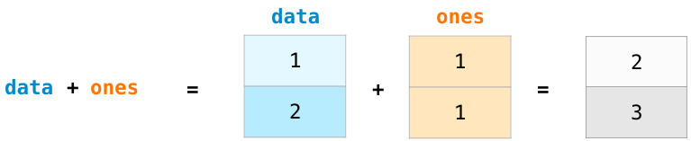
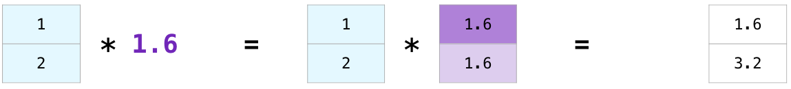
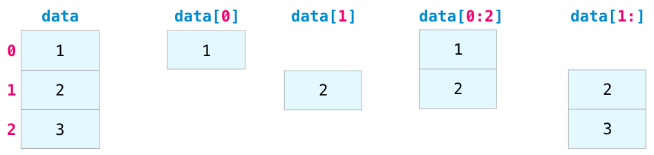
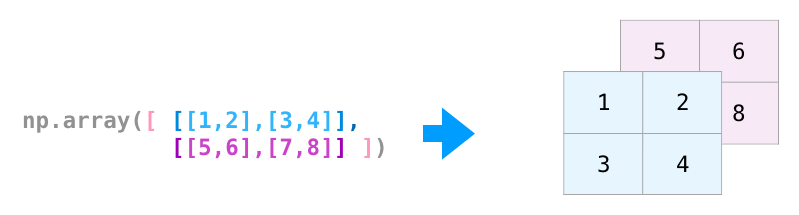

# NumPy和数据表示的视觉介绍


的[NumPy的](https://www.numpy.org/)包是数据分析，机器学习，并在蟒生态系统科学计算的主力。它极大地简化了向量和矩阵的处理和运算。某些python领先的软件包依赖NumPy作为其基础架构的基础部分（示例包括scikit-learn，SciPy，pandas和tensorflow）。除了对数字数据进行切片和切块的能力之外，精通numpy在处理和调试这些库中的高级用例时将为您提供优势。

在本文中，我们将研究使用NumPy的一些主要方法，以及在如何将它们用于机器学习模型之前，NumPy如何表示不同类型的数据（表格，图像，文本等）。

```
import numpy as np
```

## 创建数组

我们可以通过传递一个python列表并使用np.array（）来创建一个NumPy数组（又名威武的[ndarray](https://docs.scipy.org/doc/numpy/reference/arrays.ndarray.html)）。在这种情况下，python创建了我们可以在右侧看到的数组：


在很多情况下，我们希望NumPy为我们初始化数组的值。对于这些情况，NumPy提供了诸如ones（），zeros（）和random.random（）之类的方法。我们只是将要生成的元素数量传递给他们：


创建数组后，就可以开始以有趣的方式操作它们了。

## 数组算术

让我们创建两个NumPy数组来展示它们的用途。我们会打电话给他们`data`，并`ones`：


按位置将它们相加（即添加每行的值）就像键入`data + ones`以下内容一样简单：




当我开始学习这样的工具时，我发现令人耳目一新的是，这样的抽象使我不必在循环中编写这样的计算程序。这是一个很棒的抽象，它使您可以从更高层次考虑问题。

我们不仅可以这样做，而且：


在很多情况下，我们希望在数组和单个数字之间执行运算（我们也可以称其为向量和标量之间的运算）。假设，例如，我们的数组代表以英里为单位的距离，我们想将其转换为公里。我们只是说`data * 1.6`：




看看NumPy如何理解该运算意味着每个单元都应该发生乘法？这个概念称为*广播*，它非常有用。

## 索引编制

我们可以通过切片python列表的所有方式对NumPy数组进行索引和切片：



## 聚合

NumPy给我们带来的其他好处是聚合函数：


此外`min`，`max`和`sum`，你得到所有的伟人像`mean`，以获得平均，`prod`得到所有的元素相乘，结果`std`得到的标准偏差，和[其他很多的](https://jakevdp.github.io/PythonDataScienceHandbook/02.04-computation-on-arrays-aggregates.html)。

## 更多尺寸

我们看过的所有示例都在一维处理矢量。NumPy之美的一个关键部分是它能够将我们到目前为止所研究的一切应用到任意数量的维度。

### 创建矩阵

我们可以按照以下形状传递列表的python列表，以使NumPy创建一个表示它们的矩阵：

```
np.array([[1,2],[3,4]])
```


我们还可以使用上面提到的相同方法（`ones()`，`zeros()`和`random.random()`），只要给它们一个元组来描述要创建的矩阵的维数即可：


### 矩阵算术

`+-*/`如果两个矩阵的大小相同，我们可以使用算术运算符（）将矩阵相加和相乘。NumPy将其作为按位置操作：


仅当不同维度为一时（例如，矩阵只有一列或一行），我们才可以对不同大小的矩阵执行这些算术运算，在这种情况下，NumPy将其广播规则用于该运算：


### 点积

使用算术进行运算的一个关键区别是使用点积进行[矩阵乘法](https://www.mathsisfun.com/algebra/matrix-multiplying.html)的情况。NumPy为每个矩阵提供了`dot()`一种可用于对其他矩阵进行点积运算的方法：


我在该图的底部添加了矩阵尺寸，以强调两个矩阵在彼此面对的那一侧必须具有相同的尺寸。您可以将此操作形象化，如下所示：


### 矩阵索引

当我们处理矩阵时，索引和切片操作变得更加有用：


### 矩阵汇总

我们可以像汇总向量一样来汇总矩阵：


我们不仅可以汇总矩阵中的所有值，还可以使用`axis`参数汇总行或列中的值：


## 移调和重塑

处理矩阵时，通常需要旋转它们。当我们需要获取两个矩阵的点积并且需要对齐它们共享的维时，通常就是这种情况。NumPy数组具有一个方便的属性，`T`用于获取矩阵的转置：


在更高级的用例中，您可能会发现自己需要切换某个矩阵的尺寸。在机器学习应用程序中通常会出现这种情况，其中某个模型期望输入的某种形状不同于您的数据集。`reshape()`在这些情况下，NumPy的方法很有用。您只需为其传递矩阵所需的新尺寸即可。您可以为尺寸传递-1，而NumPy可以根据矩阵推断出正确的尺寸：


## 还有更多维度

NumPy可以执行我们在任何数量的维度中提到的所有事情。由于某种原因，其中央数据结构称为ndarray（N维数组）。



在很多方面，处理新维度只是在NumPy函数的参数中添加逗号：


注意：请记住，当您打印3维NumPy数组时，文本输出所显示的数组与此处显示的有所不同。NumPy打印n维数组的顺序是最后一个轴以最快的速度循环，而第一个轴是最慢的。这意味着`np.ones((4,3,2))`将被打印为：

```
array([[[1., 1.],
        [1., 1.],
        [1., 1.]],

       [[1., 1.],
        [1., 1.],
        [1., 1.]],

       [[1., 1.],
        [1., 1.],
        [1., 1.]],

       [[1., 1.],
        [1., 1.],
        [1., 1.]]])
```

## 实际使用

现在为回报。以下是NumPy将帮助您完成工作的一些示例。

### 公式

实施适用于矩阵和向量的数学公式是NumPy考虑的关键用例。这就是为什么NumPy是科学python社区的宠儿。例如，考虑均方误差公式，该公式对于解决回归问题的监督机器学习模型至关重要：


在NumPy中实现这一点很容易：


这样做的好处是，numpy的不关心，如果`predictions`与`labels`含有一个或一千值（只要他们都是相同的大小）。我们可以看一个示例，依次介绍该代码行中的四个操作：


预测向量和标记向量都包含三个值。这意味着n的值为3。进行减法后，最终得到的值如下所示：


然后我们可以对向量中的值求平方：


现在，我们对这些值求和：


这将导致该预测的误差值和模型质量的得分。

### 数据表示

考虑一下您需要处理和构建模型的所有数据类型（电子表格，图像，音频等）。因此，它们中的许多非常适合以n维数组表示：

#### 表格和电子表格

- 电子表格或值表是二维矩阵。电子表格中的每个工作表可以是其自己的变量。python中最流行的抽象是[pandas dataframe](https://jalammar.github.io/gentle-visual-intro-to-data-analysis-python-pandas/)，它实际上使用NumPy并在其之上构建。


#### 音频和时间序列

- 音频文件是一维样本数组。每个样本都是一个数字，代表一小部分音频信号。CD品质的音频每秒可能有44,100个样本，每个样本都是-32767和32768之间的整数。这意味着，如果您有10秒钟的CD品质的WAVE文件，则可以将其装入长度为10 * 44,100的NumPy数组中= 441,000个样本。要提取音频的第一秒吗？只需将文件加载到我们将调用的NumPy数组中`audio`，并获取`audio[:44100]`。

看一下音频文件的一部分：


时间序列数据（例如，股票价格随时间的变化）也是如此。

#### 图片

- 图像是大小（高x宽）像素的矩阵。
  - 如果图像是黑白（又称灰度），则每个像素可以用一个数字表示（通常在0（黑色）到255（白色）之间）。是否要裁剪图像左上角10 x 10像素的部分？只要告诉NumPy帮您`image[:10,:10]`。

看一下图像文件的一部分：


- 如果图像是彩色的，则每个像素由三个数字表示-红色，绿色和蓝色每个的值。在这种情况下，我们需要一个三维空间（因为每个单元格只能包含一个数字）。因此，彩色图像由尺寸为（高度x宽度x 3）的ndarray表示。

  

#### 语言

如果我们要处理文本，则故事会有所不同。文本的数字表示形式需要建立词汇表（模型知道的所有唯一词的清单）和[嵌入步骤](https://jalammar.github.io/illustrated-word2vec/)。让我们看一下用古老的精神用数字表示这个（翻译的）报价的步骤：

“在我之前的吟游诗人有没有留下任何主题？”

模型需要先查看大量文字，然后才能用数字表示这位武士诗人的焦虑之词。我们可以继续让它处理一个[小的数据集](http://mattmahoney.net/dc/textdata.html)并使用它来构建词汇表（由71,290个单词组成）：


然后可以将该句子分解为标记的数组（基于通用规则的单词或单词部分）：


然后，我们在词汇表中将每个单词替换为其ID：


这些ID仍然不能为模型提供太多信息。因此，在将单词序列提供给模型之前，需要将标记/单词替换为其嵌入（在这种情况下为50维[word2vec嵌入](https://jalammar.github.io/illustrated-word2vec/)）：


您可以看到此NumPy数组的尺寸为[embedding_dimension x sequence_length]。在实践中，这将是另一种方式，但是我以这种方式呈现它以实现视觉一致性。出于性能原因，深度学习模型倾向于保留批次大小的第一维（因为如果并行训练多个示例，则可以更快地训练模型）。这是显而易见的情况，其中`reshape()`变得超级有用。例如，像[BERT](https://jalammar.github.io/illustrated-bert/)这样的模型会期望其输入的形状为：[batch_size，sequence_length，embedding_size]。


现在这是一个数字量，模型可以处理它并执行有用的操作。我将其他行留空，但其中将填充其他示例以供模型训练（或预测）。

（事实证明，在我们的榜样中，[诗人的话语](https://en.wikisource.org/wiki/The_Poem_of_Antara)比其他引发他的焦虑的[诗人的话](https://en.wikisource.org/wiki/The_Poem_of_Antara)更是永生不朽。[安塔拉的](https://en.wikipedia.org/wiki/Antarah_ibn_Shaddad)英勇和语言[统治力](https://en.wikipedia.org/wiki/Antarah_ibn_Shaddad)生了他父亲的奴隶，[这](https://en.wikipedia.org/wiki/Antarah_ibn_Shaddad)使他获得了自由，获得了他的神话般的地位。这首诗是伊斯兰前阿拉伯半岛[的天房](https://en.wikipedia.org/wiki/Mu'allaqat)中[停下](https://en.wikipedia.org/wiki/Mu'allaqat)来的[七首诗](https://en.wikipedia.org/wiki/Mu'allaqat)之一）。