# 图解GPT-2（可视化变压器语言模型）

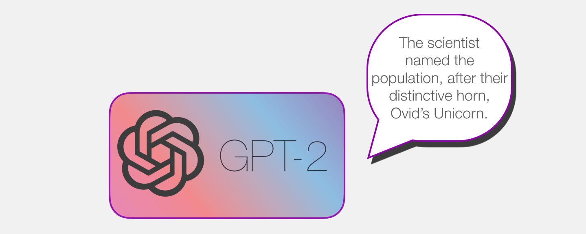

今年，我们看到了机器学习的令人眼花application乱的应用。[OpenAI GPT-2](https://openai.com/blog/better-language-models/)表现出令人印象深刻的能力，能够撰写连贯而充满激情的文章，这超出了我们预期的当前语言模型所能产生的能力。GPT-2并不是特别新颖的架构，它的架构与仅解码器的变压器非常相似。但是，GPT2是一个非常庞大的基于变压器的语言模型，在大量数据集上进行了训练。在本文中，我们将研究使模型能够产生结果的体系结构。我们将深入了解其自我注意层。然后，我们将探讨语言建模之外的仅解码器转换器的应用。

我的目标也是在我的早期文章[《插图的变压器》的基础上](https://jalammar.github.io/illustrated-transformer/)补充更多的视觉效果，以[说明变压器](https://jalammar.github.io/illustrated-transformer/)的内部工作原理以及自原始论文以来它们是如何发展的。我的希望是，随着它们内部工作的不断发展，这种可视化语言有望使以后基于Transformer的模型的解释更加容易。

**内容**

- [第1部分：GPT2和语言建模](https://jalammar.github.io/illustrated-gpt2/#part-1-got-and-language-modeling)
  - 什么是语言模型
  - 语言建模变压器
  - 与BERT的区别
  - 变压器座的演变
  - 脑外科速成班：深入研究GPT-2
  - 深入了解
  - 第一部分结束：GPT-2，女士们，先生们：
- [第2部分：图解的自我注意](https://jalammar.github.io/illustrated-gpt2/#part-2-illustrated-self-attention)
  - 自我注意（无遮罩）
  - 1-创建查询，键和值向量
  - 2分
  - 3-总和
  - 插图蒙面的自我注意
  - GPT-2蒙面的自我注意
  - 超越语言建模
  - 你做到了！
- [第3部分：超越语言建模](https://jalammar.github.io/illustrated-gpt2/#part-3-beyond-language-modeling)
  - 机器翻译
  - 总结
  - 转移学习
  - 音乐产生

## 第1部分：GPT2和语言建模[＃](https://jalammar.github.io/illustrated-gpt2/#part-1-got-and-language-modeling)

那么语言模型到底是什么？

### 什么是语言模型

在[Illustrated Word2vec中](https://jalammar.github.io/illustrated-word2vec/)，我们研究了语言模型是什么-基本上是一种机器学习模型，能够查看句子的一部分并预测下一个单词。最著名的语言模型是智能手机键盘，可根据您当前输入的内容提示下一个单词。

从这个意义上讲，我们可以说GPT-2本质上是键盘应用程序的下一个单词预测功能，但是它比您的手机具有更大，更复杂的功能。GPT-2在称为WebText的庞大40GB数据集上进行了训练，作为研究工作的一部分，OpenAI研究人员从互联网上进行了爬网。为了比较存储空间，我使用的键盘应用程序SwiftKey占用了78MB的空间。经过训练的GPT-2的最小变体，占用500MB的存储空间来存储其所有参数。最大的GPT-2变体是其大小的13倍，因此可能会占用超过6.5 GB的存储空间。

试验GPT-2的一种好方法是使用[AllenAI GPT-2 Explorer](https://gpt2.apps.allenai.org/?text=Joel is)。它使用GPT-2显示下一个单词的十个可能的预测（以及它们的概率得分）。您可以选择一个单词，然后查看下一个预测列表以继续撰写段落。

### 语言建模变压器

正如我们在《[图解变压器》中](https://jalammar.github.io/illustrated-transformer/)所看到的那样，原始变压器模型由编码器和解码器组成-每个模型都是我们可以称为变压器块的堆栈。该架构之所以合适，是因为该模型解决了机器翻译问题，而编码器/解码器架构在过去一直是成功的问题。

在随后的许多研究工作中，该架构放弃了编码器或解码器，并仅使用一堆变压器块-尽可能实际地堆叠它们，为它们提供大量的训练文本，并在其中投入大量计算他们（训练这些语言模型中的数十万美元，对于[AlphaStar来说](https://deepmind.com/blog/alphastar-mastering-real-time-strategy-game-starcraft-ii/)可能是数百万[美元](https://deepmind.com/blog/alphastar-mastering-real-time-strategy-game-starcraft-ii/)）。

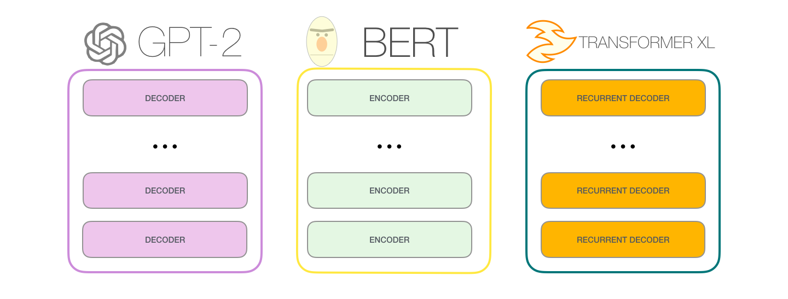

我们可以将这些块堆叠多高？事实证明，这是不同GPT2模型尺寸之间的主要区别因素之一：

### 与BERT的区别

> **机器人**
> 的**第一定律**机器人不得伤害人类，也可以通过无为而造成伤害。

GPT-2使用变压器解码器模块构建。另一方面，BERT使用变压器编码器模块。我们将在以下部分中检查差异。但是两者之间的主要区别在于，GPT2与传统语言模型一样，一次输出一个令牌。例如，让我们提示受过良好训练的GPT-2朗诵机器人技术的第一定律：

这些模型的实际工作方式是，在生成每个令牌之后，将该令牌添加到输入序列中。这个新序列将成为下一步模型的输入。这是一个称为“自回归”的想法。这是[使RNN变得不合理有效](https://karpathy.github.io/2015/05/21/rnn-effectiveness/)的想法之一。

GPT2和某些更高版本的模型（例如TransformerXL和XLNet）本质上是自动回归的。BERT不是。这是一个权衡。在失去自回归的过程中，BERT获得了在单词的两边合并上下文以获得更好结果的能力。XLNet带来了自回归，同时找到了在两侧合并上下文的另一种方法。

### 变压器座的演变

的[初始变压器纸张](https://arxiv.org/abs/1706.03762)引入两种类型的变压器块组成：

#### 编码器块

首先是编码器块：

原始变压器纸上的编码器块可以接受输入，直到达到某个最大序列长度（例如512个令牌）为止。如果输入序列短于此限制也可以，我们可以填充其余序列。

#### 解码器块

其次，解码器块与编码器块的体系结构差异很小，这是一层，可以使它注意编码器的特定段：

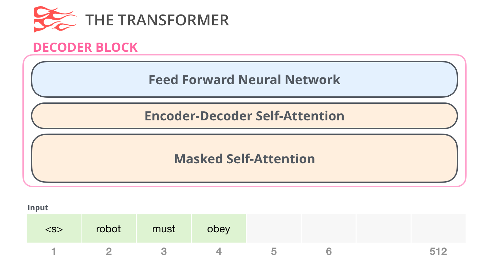

自我注意层的主要区别在于，它掩盖了将来的令牌–并不是通过像BERT一样将单词更改为[mask]而是通过干扰自我注意计算来阻止来自令牌右侧的令牌的信息。正在计算位置。

例如，如果我们要突出显示位置＃4的路径，我们可以看到它只允许出席当前和之前的令牌：

重要的是要清楚自我注意力（BERT的用途）和掩盖的自我注意力（GPT-2的用途）之间的区别。正常的自我注意区域允许位置在其右侧的令牌处达到峰值。蒙面的自我注意阻止了这种情况的发生：

#### 仅解码器块

在原始论文之后，[通过总结长序列来生成维基百科](https://arxiv.org/pdf/1801.10198.pdf)提出了转换器模块的另一种安排，该安排能够进行语言建模。该模型丢弃了Transformer编码器。因此，我们将该模型称为“ Transformer-Decoder”。这种早期的基于变压器的语言模型由六个变压器解码器块的堆栈组成：

解码器块相同。我已经扩展了第一个，因此您可以看到它的自我注意层是masked变体。请注意，该模型现在可以在特定段中寻址多达4,000个令牌-从原始转换器中的512个大规模升级。

这些块与原始解码器块非常相似，除了它们消除了第二个自我注意层。在[具有更深层次的自我注意的字符级语言建模中，](https://arxiv.org/pdf/1808.04444.pdf)研究了一种类似的体系结构，以创建一种可以一次预测一个字母/字符的语言模型。

OpenAI GPT-2模型使用这些仅用于解码器的块。

### 脑外科速成班：深入研究GPT-2

> 往里看，你会看到，这些话在我的大脑深处切入。雷声燃烧，迅速燃烧，言语刀使我发疯，发疯。〜**[布吉](https://en.wikipedia.org/wiki/Budgie_(band))**

让我们将经过培训的GPT-2放在我们的手术台上，看看它是如何工作的。

GPT-2可以处理1024个令牌。每个令牌沿其自己的路径流经所有解码器块。

运行训练有素的GPT-2的最简单方法是允许其自行漫游（在技术上称为*生成无条件样本*）–或者，我们可以提示它谈论某个主题（也称为生成*交互式有条件**样本*）*样本*）。在漫无目的的情况下，我们可以简单地将其传递给起始令牌并使其开始生成单词（经过训练的模型将`<|endoftext|>`其用作起始令牌。让我们将其称为``）。

该模型只有一个输入令牌，因此该路径将是唯一活动的令牌。令牌在所有层中依次进行处理，然后沿着该路径生成向量。该向量可以根据模型的词汇评分（模型知道的所有单词，在GPT-2的情况下为50,000个单词）。在这种情况下，我们选择概率最高的令牌“ the”。但是我们当然可以把事情弄混了–您知道如何继续在键盘应用程序中单击建议的单词，有时它会陷入重复循环，唯一的出路就是单击第二或第三个建议的单词。在这里也可能发生同样的情况。GPT-2有一个名为top-k的参数，我们可以使用该参数让模型考虑对除顶层单词以外的单词进行采样（top-k = 1时就是这种情况）。

在下一步中，我们将第一步的输出添加到输入序列中，并让模型进行下一个预测：

请注意，第二条路径是此计算中唯一活动的路径。GPT-2的每一层都保留了自己对第一个令牌的解释，并将在处理第二个令牌时使用它（我们将在以下有关自注意的部分中对此进行更详细的介绍）。GPT-2不会根据第二个令牌重新解释第一个令牌。

### 深入了解

#### 输入编码

让我们看看更多细节，以更紧密地了解该模型。让我们从输入开始。就像我们之前讨论过的其他NLP模型一样，该模型会在输入词的嵌入矩阵中查找输入词的嵌入-这是经过训练的模型的组成部分之一。

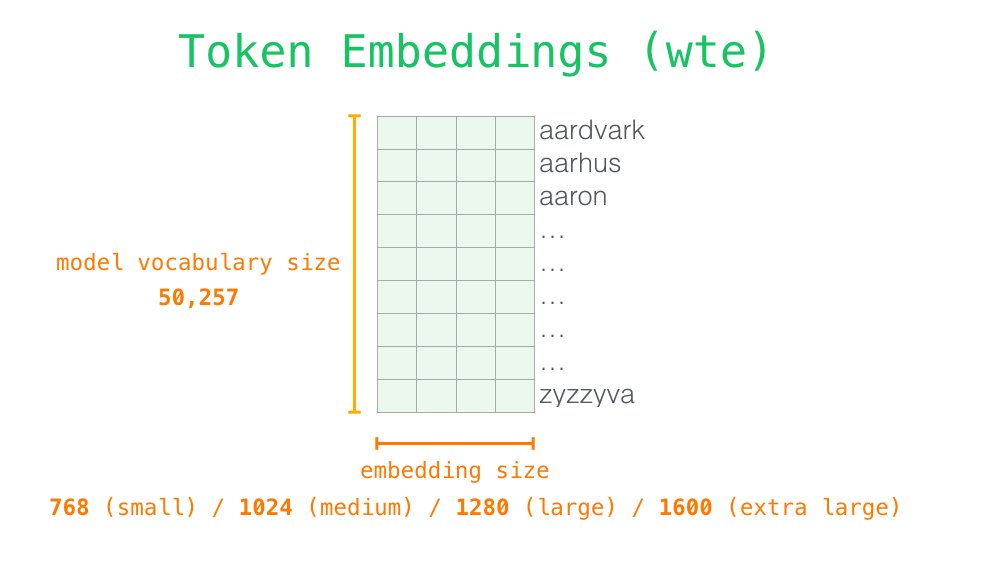
每行是一个单词嵌入：代表一个单词并捕获其某些含义的数字列表。该列表的大小在不同的GPT2型号大小中有所不同。最小的模型使用每个单词/令牌768的嵌入大小。

因此，在开始时，我们会``在嵌入矩阵中查找开始令牌的嵌入。在将其交给模型中的第一个块之前，我们需要合并位置编码-一个信号，该信号指示转换器块中序列中单词的顺序。训练模型的一部分是一个矩阵，其中包含输入中1024个位置中每个位置的位置编码矢量。

到此为止，我们已经介绍了输入单词在交给第一个转换器块之前是如何处理的。我们还知道构成训练有素的GPT-2的两个权重矩阵。

将单词发送到第一个转换器块意味着查找其嵌入并将位置＃1的位置编码向量相加。

#### 堆栈之旅

现在，第一个块可以通过以下方式处理令牌：首先将令牌传递给自我注意过程，然后将其传递给其神经网络层。一旦第一个转换器模块处理了令牌，它就将其结果向量发送到堆栈中，以供下一个模块处理。每个块的过程相同，但是每个块在自注意力和神经网络子层中都有自己的权重。

#### 自我注意回顾

语言在很大程度上取决于上下文。例如，看第二定律：

> **机器人第二定律**
> 机器人必须遵守人类所赋予的命令**，**除非**该命令**与**第一定律**冲突。

我在句子中强调了三个位置，这些位置是指其他单词。如果不结合它们所指的上下文，就无法理解或处理这些词。当模型处理此句子时，它必须能够知道：

- **它**指的是机器人
- **此类命令**是指法律的较早部分，即“人类赋予的命令”
- **第一定律**是指整个第一定律

这就是自我注意的事情。它使模型对相关单词和关联单词的理解得以增强，这些单词在处理某个单词（通过神经网络传递该单词）之前会解释该单词的上下文。它通过为片段中每个单词的相关性分配分数并将它们的向量表示相加来实现。

例如，最上面的自我关注层在处理单词“ it”时会注意“机器人”。它将传递到其神经网络的向量是三个单词中每个单词的向量总和乘以它们的分数。

#### 自我注意过程

沿着片段中每个标记的路径处理自注意力。重要组成部分是三个向量：

- 查询：查询是当前单词的表示形式，用于对所有其他单词（使用其键）进行评分。我们只关心当前正在处理的令牌的查询。
- 关键字：关键字向量类似于该段中所有单词的标签。它们是我们在搜索相关单词时要匹配的对象。
- 值：值向量是实际的单词表示形式，一旦我们对每个单词的相关性进行了评分，这些就是我们加起来代表当前单词的值。

粗略的类比是将其视为在文件柜中进行搜索。该查询就像您正在研究的主题的便笺一样。按键类似于机柜内文件夹的标签。当您将标签与便签进行匹配时，我们将取出该文件夹的内容，这些内容就是值向量。除了您不仅要查找一个值，还要从文件夹的混合中寻找混合的值。

将查询向量乘以每个关键向量会为每个文件夹产生一个分数（技术上：点乘积后跟softmax）。

我们将每个值乘以其分数，然后求和-得出自我关注的结果。

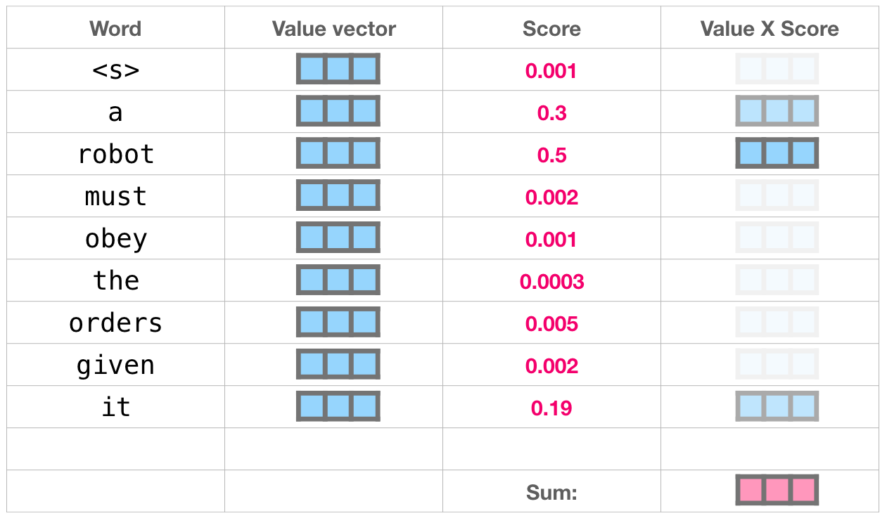

值向量的这种加权混合产生了一个向量，该向量将其“注意力”投入单词的50％，单词的`robot`30％和单词的`a`19％`it`。在文章的后面，我们将更深入地关注自我注意力。但是首先，让我们继续我们的旅程，朝着模型的输出迈进。

#### 模型输出

当模型中的顶部块产生其输出矢量（其自身的自注意结果以及其自身的神经网络的结果）时，该模型会将其乘以嵌入矩阵。

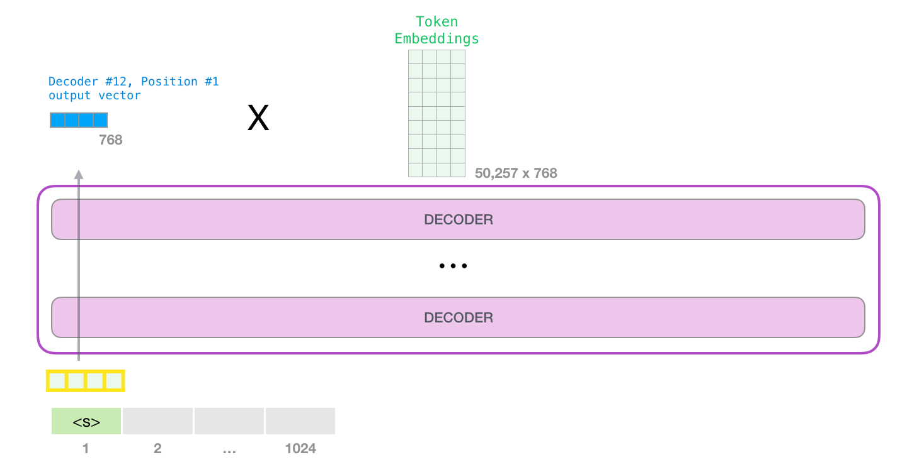

回想一下，嵌入矩阵中的每一行都对应于单词在模型词汇表中的嵌入。乘法结果被解释为模型词汇表中每个单词的分数。

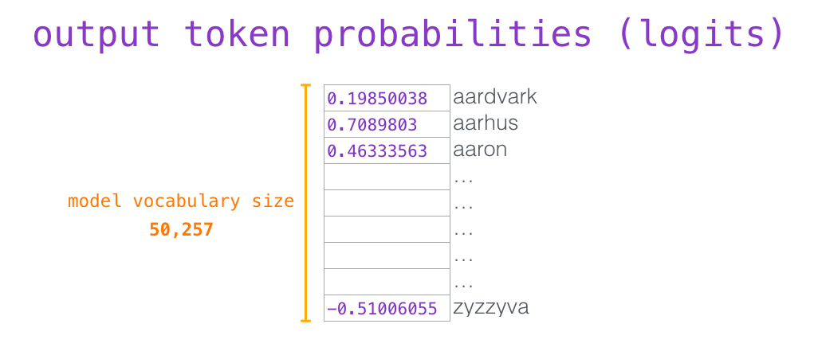

我们可以简单地选择得分最高的令牌（top_k = 1）。但是，如果模型也考虑其他单词，则可以获得更好的结果。因此，更好的策略是使用分数作为选择该单词的概率从整个列表中抽取一个单词（因此，得分较高的单词被选择的可能性更高）。一个中间立场是将top_k设置为40，并让模型考虑得分最高的40个单词。

这样，模型完成了迭代，从而输出了一个单词。该模型将继续迭代，直到生成整个上下文（1024个令牌）或直到生成序列结束令牌为止。

### 第一部分结束：GPT-2，女士们，先生们：

我们终于得到它了。GPT2的工作原理不完整。如果您想确切地了解自我关注层内部会发生什么，那么下面的奖金部分适合您。我创建它的目的是引入更多的视觉语言来描述自我注意力，以使描述以后的变压器模型更容易检查和描述（看着您，TransformerXL和XLNet）。

我想在这篇文章中注意一些过分的简化：

- 我交替使用“单词”和“令牌”。但实际上，GPT2使用字节对编码在其词汇表中创建令牌。这意味着标记通常是单词的一部分。
- 我们展示的示例以其推断/评估模式运行GPT2。这就是为什么它一次只处理一个单词。在训练时，将针对较长的文本序列并同时处理多个令牌来训练模型。同样在训练时，该模型将处理较大的批次大小（512），而不是评估使用的批次大小。
- 我自由旋转/转置矢量以更好地管理图像中的空间。在实施时，必须更加精确。
- 变压器使用大量的层归一化，这很重要。我们在Illustrated Transformer中注意到了其中一些，但是在这篇文章中，我们更多地关注了自我注意。
- 有时候，我需要显示更多的框来表示向量。我将其表示为“放大”。例如：

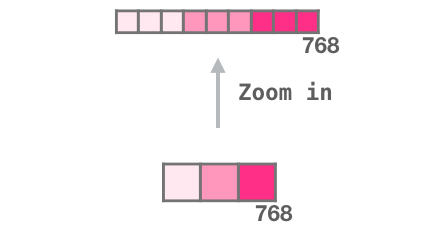

## 第2部分：图解的自我注意[＃](https://jalammar.github.io/illustrated-gpt2/#part-2-illustrated-self-attention)

在文章的前面，我们显示了此图像，以展示在处理单词的图层中应用的自我注意`it`：

在本节中，我们将详细介绍如何完成此操作。请注意，我们将以某种方式来尝试理解各个单词的含义。这就是为什么我们将显示许多单个向量的原因。实际实现是通过将巨型矩阵相乘完成的。但我想着重于直觉上这里在单词层面上会发生什么。

### 自我注意（无遮罩）

让我们先来看一下在编码器块中计算出的原始自我注意力。让我们看一个玩具变压器块，一次只能处理四个令牌。

通过三个主要步骤进行自我注意：

1. 为每个路径创建查询，键和值向量。
2. 对于每个输入令牌，使用其查询向量对所有其他键向量进行评分
3. 将值向量乘以它们的相关分数后，求和。

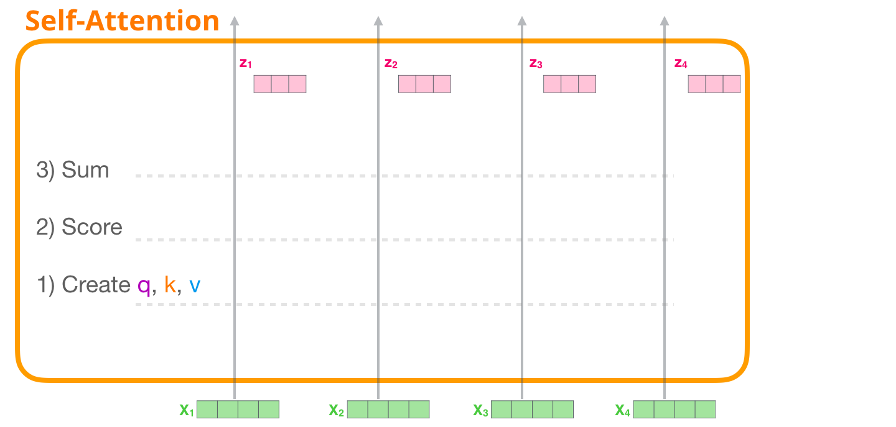

### 1-创建查询，键和值向量

让我们关注第一个路径。我们将查询它，并与所有键进行比较。这会为每个键产生一个分数。自我关注的第一步是为每个令牌路径计算三个向量（现在让我们忽略关注头）：

### 2分

现在我们有了向量，我们仅将查询和键向量用于步骤2。由于我们专注于第一个令牌，因此我们将其查询乘以所有其他关键向量，从而得出四个令牌中每个令牌的得分。

### 3-总和

现在我们可以将分数乘以值向量。将它们加总后，具有高分的值将构成结果向量的很大一部分。

分数越低，显示值向量的透明度越高。这表示乘以小数会稀释向量的值。

如果对每个路径执行相同的操作，则最终得到一个向量，该向量表示每个令牌，其中包含该令牌的适当上下文。然后将这些呈现给转换器块中的下一个子层（前馈神经网络）：

### 插图蒙面的自我注意

既然我们已经了解了转换器的自我注意步骤，那么让我们继续来看掩盖的自我注意。蒙面的自我注意与自我注意相同，除了进行步骤2时。假设模型只有两个标记作为输入，并且我们正在观察第二个标记。在这种情况下，最后两个标记被屏蔽。因此，模型会影响计分步骤。它基本上总是将未来标记记为0，因此模型无法达到未来单词的峰值：

此屏蔽通常实现为称为注意屏蔽的矩阵。考虑四个单词的序列（例如，“机器人必须服从命令”）。在语言建模方案中，此序列分为四个步骤-每个单词一个（假设每个单词现在都是一个标记）。由于这些模型是成批工作的，因此我们可以假设此玩具模型的批处理大小为4，它将以一个批处理整个序列（包括四个步骤）。

以矩阵形式，我们通过将查询矩阵乘以键矩阵来计算分数。让我们将其可视化如下，除了单词以外，在该单元格中将有与该单词关联的查询（或键）向量：

乘法之后，我们拍打注意力面具三角形。它将我们要掩盖的像元设置为-infinity或非常大的负数（例如GPT2中的-10亿）：

然后，在每一行上应用softmax会产生用于自我关注的实际分数：

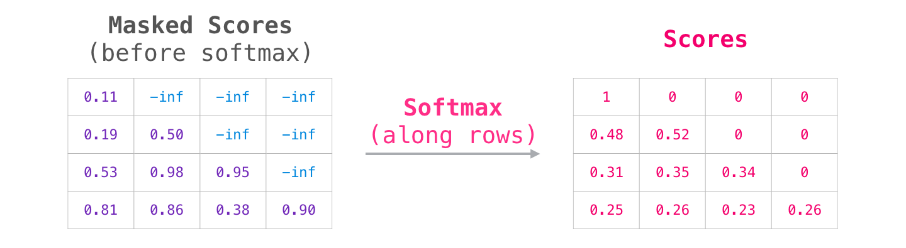

该分数表的含义如下：

- 当模型处理数据集中的第一个示例（第1行）时，该示例仅包含一个单词（“机器人”），其注意力100％将集中在该单词上。
- 当模型处理数据集中的第二个示例（第2行）时，该示例包含单词（“机器人必须”），当模型处理单词“必须”时，其48％的注意力将集中在“机器人”上，而52其注意力的百分比将放在“必须”上。
- 等等

### GPT-2蒙面的自我注意

让我们更详细地了解GPT-2的掩盖注意。

#### 评估时间：一次处理一个令牌

我们可以使GPT-2的运行完全像蒙面的自我注意工作一样。但是在评估过程中，当我们的模型在每次迭代后仅添加一个新单词时，对于已经处理过的令牌，沿着较早的路径重新计算自我注意力将是低效的。

在这种情况下，我们处理第一个令牌（暂时忽略``）。

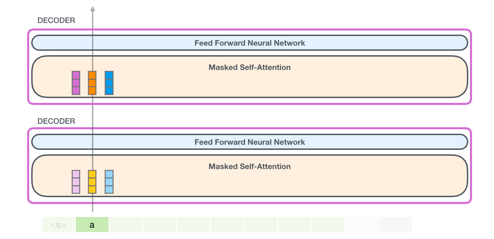

GPT-2保留`a`令牌的键和值向量。每个自我注意层都保留该令牌的相应键和值向量：

现在，在下一次迭代中，当模型处理word时`robot`，它不需要为`a`令牌生成查询，键和值查询。它只是重复使用从第一次迭代中保存的内容：

#### GPT-2自我注意：1-创建查询，键和值

假设模型正在处理单词`it`。如果我们在说底部块，那么该令牌的输入将是`it`插槽9的位置编码+的嵌入：

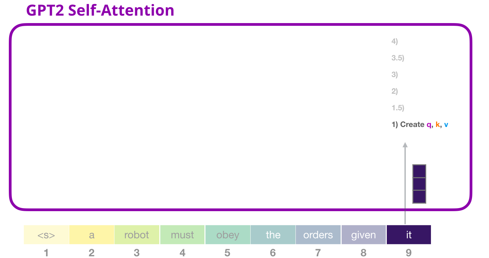

变压器中的每个块都有自己的权重（在后面的文章中进行了分解）。我们遇到的第一个是用于创建查询，键和值的权重矩阵。

自注意力将其输入乘以其权重矩阵（并添加一个偏差矢量，此处未显示）。

乘法产生一个向量，该向量基本上是该单词的查询，键和值向量的串联`it`。

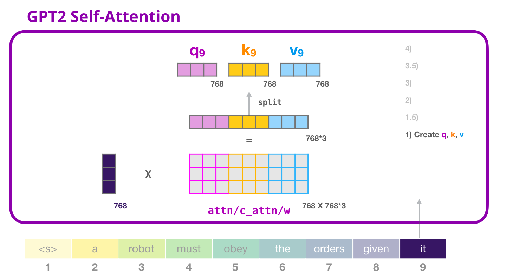
将输入向量与注意权重向量相乘（并向后添加偏差向量）会得出此令牌的键，值和查询向量。

#### GPT-2自我注意：1.5-分散为注意力

在前面的示例中，我们忽略了“多头”部分而直接进入了自我注意。现在阐明该概念将很有用。对Q，K，V向量的不同部分进行多次自我注意。“分散”注意头只是将长矢量重塑为矩阵。小型GPT2具有12个关注头，因此将是重塑矩阵的第一维：

在前面的示例中，我们研究了一个关注头内部发生的情况。想到多个关注头的一种方法是这样的（如果我们仅可视化十二个关注头中的三个）：

#### GPT-2自我注意：2-得分

现在，我们可以进行评分-知道我们只关注一个关注头（并且所有其他关注者都在进行类似操作）：

现在，可以根据其他令牌的所有键（在先前迭代中在关注头1中计算出）对令牌进行评分：

#### GPT-2自我注意：3和

正如我们之前看到的，我们现在将每个值乘以其分数，然后将其求和，从而产生注意力第一点的自我注意结果：

#### GPT-2自我注意：3.5-合并注意头

我们处理各种关注头的方式是，我们首先将它们连接成一个向量：

但是向量还没有准备好发送到下一个子层。我们首先需要将科学怪人的隐藏状态怪兽变成同质的表示。

#### GPT-2自我注意：4-投射

我们将让模型学习如何最佳地将级联的自我注意结果映射到前馈神经网络可以处理的向量中。这是我们的第二个大权重矩阵，它将关注头的结果投影到自我注意子层的输出向量中：

这样，我们产生了可以发送到下一层的向量：

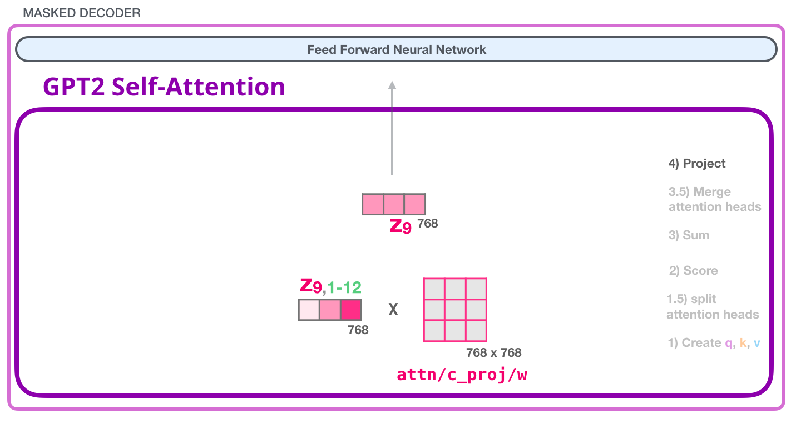

#### GPT-2全连接神经网络：第1层

完全连接的神经网络是自关注在其表示中包含适当上下文之后，块处理其输入令牌的位置。它由两层组成。第一层是模型大小的四倍（由于GPT2小为768，因此该网络将具有768 * 4 = 3072个单位）。为什么要四次？这就是原始变压器所使用的尺寸（模型尺寸为512，模型中的第1层为2048）。这似乎为变压器模型提供了足够的表示能力，可以处理到目前为止已经交给他们的任务。

（未显示：偏差向量）

#### GPT-2全连接神经网络：第2层-投影到模型尺寸

第二层将第一层的结果投影回模型维度（对于小型GPT2为768）。乘法的结果是该令牌的转换器块的结果。

（未显示：偏差向量）

### 你做它！

这是我们将要介绍的最详细的变压器模块版本！现在，您几乎掌握了转换器语言模型内部发生的一切情况。回顾一下，我们勇敢的输入向量遇到以下权重矩阵：

每个块都有它们自己的一组权重。另一方面，该模型只有一个令牌嵌入矩阵和一个位置编码矩阵：

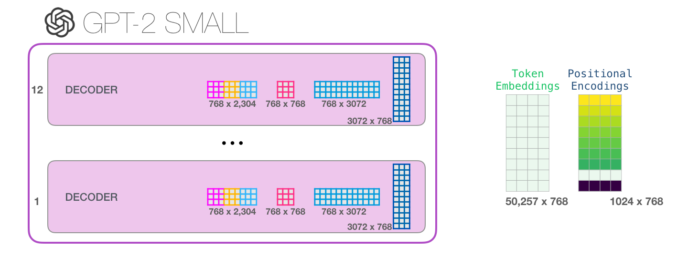

如果您想查看模型的所有参数，则在这里进行了统计：

由于某种原因，它们总共增加了124M个参数，而不是117M个。我不确定为什么，但这就是已发布代码中的多少（如果我错了，请纠正我）。

## 第3部分：超越语言模型[＃](https://jalammar.github.io/illustrated-gpt2/#part-3-beyond-language-modeling)

仅限解码器的转换器不断展现出语言建模之外的希望。它已显示出成功的许多应用程序，可以通过与上述类似的视觉效果来描述。让我们通过查看其中一些应用程序来结束这篇文章

### 机器翻译

不需要编码器进行翻译。只能通过解码器的转换器可以解决相同的任务：

### 总结

这是第一个仅解码器的变压器经过培训的任务。即，它被训练为阅读维基百科的文章（目录前没有开篇），并对其进行了总结。文章的实际开头部分用作培训数据中的标签：

本文针对维基百科的文章对模型进行了训练，因此经过训练的模型能够总结文章：

### 转移学习

在[使用单个预训练的变压器进行示例高效文本摘要中](https://arxiv.org/abs/1905.08836)，仅解码器专用的变压器首先在语言建模上经过预训练，然后进行微调以进行摘要。事实证明，在有限的数据设置中，与预训练的编码器/解码器变压器相比，可以获得更好的结果。

GPT2论文还显示了在语言建模上对模型进行预训练后的汇总结果。

### 音乐产生

该[音乐变压器](https://magenta.tensorflow.org/music-transformer)使用仅解码器，变压器生成具有表现力的时机和力度的音乐。“音乐建模”就像语言建模一样–只是让模型以无人监督的方式学习音乐，然后让其对输出进行采样（之前称为“随机”）。

您可能对这种情况下的音乐表示方式感到好奇。请记住，可以通过字符，单词或作为单词一部分的标记的矢量表示来完成语言建模。伴随着音乐表演（现在让我们考虑一下钢琴），我们不仅要代表音符，还要代表力度-一种衡量钢琴键被按下的力度的度量。

表演只是这些单向矢量的一系列。MIDI文件可以转换为这种格式。本文具有以下示例输入序列：

此输入序列的一键矢量表示如下所示：

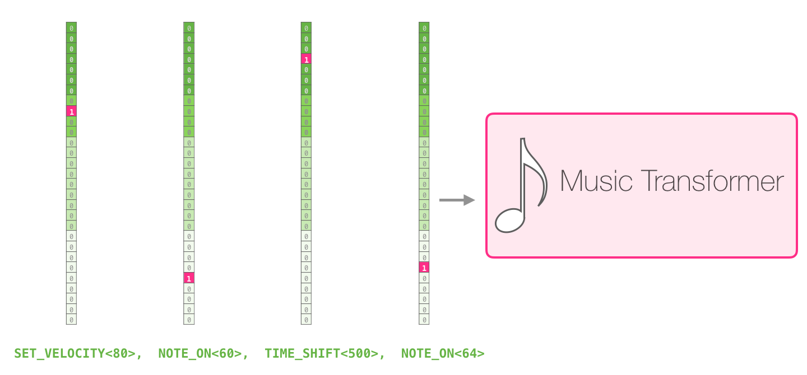

我喜欢纸上的视觉效果，展现了《变形金刚》中的自我关注。我在这里添加了一些注释：

“图8：该片段具有重复的三角形轮廓。查询是在后一个峰值中进行的，它涉及该峰值之前所有的高音，一直到该片段的开始。” ...“ [[]该图显示了一个查询（所有注意事项的来源）和之前要注意的记忆（突出显示了收到更多softmax概率的注意事项）。注意事项的颜色分别对应不同的标题宽度乘以softmax概率的权重。”

如果您不清楚音符的表示形式，[请观看此视频](https://www.youtube.com/watch?v=ipzR9bhei_o)。

## 结论

这结束了我们进入GPT2的旅程，并探索了其父模型（仅解码器的变压器）。我希望您从这篇文章中脱颖而出，对自我注意有一个更好的理解，并且对您更多地了解变压器内部发生的事情感到更加自在。

## 资源资源

- 该[GPT2实现](https://github.com/openai/gpt-2)从OpenAI
- 除了GPT2，还可以从[Hugging Face](https://huggingface.co/)中[检出pytorch-transformers](https://github.com/huggingface/pytorch-transformers)库，该库还实现了BERT，Transformer-XL，XLNet和其他前沿的变压器模型。

## 致谢