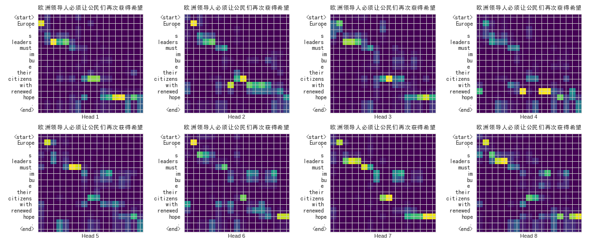
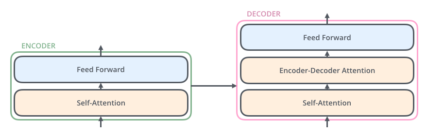

> 那时，全世界的语言都一样。人们说：『来吧，我们要建一座塔，塔顶通天，为了扬我们的名，免得我们被分散到世界各地。』耶和华说：『看哪！他们成为一样的人民、用同样的语言。如今既盖起塔来，以后就没有他们无法完成的事情了。我们下去！在那里变乱他们的口音，使他们的言语彼此不通。』
> ─ 《创世记》第十一章

这是圣经中著名的[巴别塔](https://zh.wikipedia.org/wiki/巴別塔)桥段，用来解释为何当今世上有那么多种语言。当年的上帝或许过于杞人忧天，但近年多亏了[深度学习](https://zh.wikipedia.org/zh-hant/深度学习)，[机器翻译](https://zh.wikipedia.org/wiki/机器翻译)的快速发展让人不禁觉得，或许巴别塔很快就不再只是虚幻传说了。

<video autoplay="" loop="" muted="" playsinline="" poster="https://leemeng.tw/images/transformer/google-translate.jpg" style="box-sizing: inherit; display: block; max-width: 100%; height: auto; margin: auto; width: 880px; mix-blend-mode: initial;"></video>

以往被视为非常困难的中-> 英翻译如今在深度学习的加持下也有不错的水准


机器翻译的研究之所以如此重要且迷人，是因为它将有机会让未来任何人都不受语言的限制，获得世界上任何他或她想要的资讯与知识。

在这篇文章的前半部分，我们会先花点时间来回顾[神经机器翻译](https://en.wikipedia.org/wiki/Neural_machine_translation)里头的一些重要概念。接着在具备这些概念以及[其他背景知识](https://leemeng.tw/neural-machine-translation-with-transformer-and-tensorflow2.html#師傅引進門，修行在個人)的前提之下，利用最新的[TensorFlow 2](https://www.tensorflow.org/)来实作一个可以将英文句子翻译成中文的神经网路架构：[Transformer](https://www.tensorflow.org/beta/tutorials/text/transformer)。

利用Transformer将法文句子翻译成英文（[图片来源](http://jalammar.github.io/illustrated-transformer/)）


这是一个非常简化的示意图。Transformer实际上是一种基于自注意力机制的[Seq2Seq模型](https://youtu.be/ZjfjPzXw6og?t=3208)，近年在[图像描述](https://paperswithcode.com/task/image-captioning)、[聊天机器人](https://zh.wikipedia.org/wiki/聊天機器人)、[语音辨识](https://zh.wikipedia.org/zh-hant/语音识别)以及机器翻译等各大领域大发异彩。但因为其相对复杂，到现在还是有种现象：

> 了解Transformer 相关技术的人已经用了好一阵子且用得很开心，不知道的人还是不知道。

当然这并不仅限于Transformer，因为深度学习牵涉的研究范围实在太广了。透过这篇文章，我希望能帮助你开始了解神经机器翻译以及Transformer 的相关知识。

当我们完成实作并训练出一个Transformer以后，除了可以英翻中以外，我们还能清楚地了解其是如何利用强大的[注意力机制](https://www.youtube.com/watch?v=jd9DtlR90ak&feature=youtu.be)（我们在[Encoder-Decoder模型+注意力机制](https://leemeng.tw/neural-machine-translation-with-transformer-and-tensorflow2.html#Encoder-Decoder-模型-+-注意力機制)一节会仔细探讨此概念）来做到精准且自然的翻译。

Transformer 在将英文句子翻译成中文时会「关注」需要注意的英文词汇来生成对应的中文字词


除了翻译出来的中文正确无误以外，从上图你可以发现很有趣的现象。

给定左侧的英文，Transformer 在生成其对应的中文翻译时都会给每个英文词汇不同的「注意程度」。小方格越亮则代表模型在生成某中文字时放越多的注意力在左侧对应的英文词汇上。

仔细看你会发现这个已经训练好的Transformer 在翻译：

- 「必」、「须」时会关注「must」
- 「希」、「望」时会关注「hope」
- 「公」、「民」时会关注「citizens」

乍看之下好像稀松平常，但事实上我们在训练模型时并不会告诉它这些词汇之间的对应关系或是任何语言学的知识。我们就只是喂给它多组相同意思的中英句子，并让它自己学会怎么做翻译。

> 好黑魔法，不学吗？

在英翻中的情境下，神经网路要做的事情就是读入左侧的英文句子，接着生成右侧的中文句子（繁中对英文的翻译资料集稀少，此文将以简体为例）

训练资料是多组相同语义的成对中英句子（当然仍需前处理）


## 一些你需先具备的基础知识

我在文中会尽量言简意赅地介绍所有你需要了解的深度学习概念，并附上相关连结供你参考。但就像在[天龙八部](https://leemeng.tw/how-to-generate-interesting-text-with-tensorflow2-and-tensorflow-js.html)或是众多武侠小说都有提过的重要准则：

> 武功修习有先后顺序，勿求一步登天。

尽管在[2017年就已被提出](https://papers.nips.cc/paper/7181-attention-is-all-you-need.pdf)，本文即将探讨并实作的[Transformer](https://papers.nips.cc/paper/7181-attention-is-all-you-need.pdf)仍算是相当进阶的神经网路架构。因此具备以下的基础知识能帮助你更顺利地理解本文内容：

- 一点点[卷积神经网路](https://demo.leemeng.tw/)的概念
- 清楚理解[循环神经网路](https://leemeng.tw/shortest-path-to-the-nlp-world-a-gentle-guide-of-natural-language-processing-and-deep-learning-for-everyone.html)的运算方式
- 基本的[自然语言处理](http://research.sinica.edu.tw/nlp-natural-language-processing-chinese-knowledge-information/)知识
- 基本的[线性代数](https://youtu.be/uUrt8xgdMbs?list=PLJV_el3uVTsNmr39gwbyV-0KjULUsN7fW)如矩阵相乘运算

中研院这篇文章清楚地说明了自然语言处理在中文上的研究与应用（图片来源：[研之有物](http://research.sinica.edu.tw/nlp-natural-language-processing-chinese-knowledge-information/)）

希望这样的要求没把你吓跑，因为事实上你大约需要好几倍的相关知识来成功实作Transformer。[尽管在实作前你会看到一些额外要求](https://leemeng.tw/neural-machine-translation-with-transformer-and-tensorflow2.html#師傅引進門，修行在個人)，本文的前半部分还是相当平易近人的，还请放心阅读。

当你想要深入了解某些细节的时候，可以参考这节附上的连结或是文内说明概念时附上的图片来源。

> 想更深入了解文中讲述的各种概念，点击相关的「图片来源」就对了。

前言很长，但好戏才在后头。如果你已经准备好进入神经机器翻译的世界的话，现在就让我们正式开始这趟旅程吧！

## 机器翻译近代史

鉴往知来。了解一点机器翻译的历史以及Transformer 是怎么跑出来的会对实作很有帮助。

机器翻译（**M** achine **T** ranslation）本身的概念[最早可追溯到17世纪](https://zh.wikipedia.org/zh-tw/机器翻译#歷史)。自从那开始，人们尝试并研究了各式各样的方法，写了一大堆规则、搜集了数以万计的翻译结果来尝试自动化翻译。随着时代演进，我们有了：

- 基于规则的机器翻译RBMT
- 基于范例的机器翻译EBMT
- 统计机器翻译SMT
- 近年的神经机器翻译NMT

近代机器翻译发展简史（[图片来源](https://www.freecodecamp.org/news/a-history-of-machine-translation-from-the-cold-war-to-deep-learning-f1d335ce8b5/)）


很多远古时代的东西我们不会讨论，而NMT 当然是本文的重点。不过在那之前让我们非常简短地看一下SMT。

### 统计机器翻译：基于短语的翻译

机器翻译的历史很长，但一直要到21世纪初期[统计机器翻译（**S** tatistical **M** achine **T** ranslation，简称SMT）](https://zh.wikipedia.org/wiki/统计机器翻译)技术成熟以后，机器翻译的品质才稍微使人满意。其中最知名的例子当属[Google在2006年发布的SMT翻译系统](https://ai.googleblog.com/2006/04/statistical-machine-translation-live.html)。

不限于Google，当时不少最先进的SMT系统都采用了[基于短语的机器翻译（Phrase-Based MT）](https://en.wikipedia.org/wiki/Statistical_machine_translation#Phrase-based_translation)演算法。PBMT最大的特色是先将来源语言（Source Language）的句子切成短语或是词汇，接着大致上独立地将这些词汇翻译成目标语言（Target Language）。

基于短语的SMT（Phrase-Based SMT） （[图片来源](https://www.freecodecamp.org/news/a-history-of-machine-translation-from-the-cold-war-to-deep-learning-f1d335ce8b5/)）


PBMT的翻译结果相较于早年基于规则（Rule-Based）的手法已经进步很多，但仍然需要大量的[平行语料](https://zh.wikipedia.org/wiki/平行语料)、对齐语料来取得较好的结果。且因为是以短语为单位在做翻译，这些短语拼凑出来的句子仍然不够自然。

如果你跟我一样有用过早年的Google 翻译，应该还能隐约记得当年那些充斥着「机械感」的翻译结果。

（如果你有当年Google 翻译结果的截图的话欢迎提供）

### 神经机器翻译：Encoder-Decoder模型

顾名思义，神经机器翻译NMT即代表使用[类神经网路（Neural Network）](https://zh.wikipedia.org/wiki/人工神经网络)来做机器翻译。

不管是英文、法文还是中文，一个自然语言的句子基本上可以被视为一个有时间顺序的序列数据（Sequence Data）。而[我们曾提过RNN很适合用来处理有时间关系的序列数据](https://leemeng.tw/shortest-path-to-the-nlp-world-a-gentle-guide-of-natural-language-processing-and-deep-learning-for-everyone.html#有記憶的循環神經網路_1)。给定一个向量序列，RNN就是回传一个一样长度的向量序列作为输出。


RNN很适合拿来处理具有时间顺序的序列数据（下方的词在丢入RNN前会被转成词向量） （[图片来源](https://leemeng.tw/shortest-path-to-the-nlp-world-a-gentle-guide-of-natural-language-processing-and-deep-learning-for-everyone.html#有記憶的循環神經網路_1)）


当我们把来源语言以及目标语言的句子都视为一个独立的序列以后，机器翻译事实上就是一个[序列生成（Sequence Generation）](https://youtu.be/ZjfjPzXw6og)任务：对一个输入序列（来源语言）做些有意义的转换与处理以后，输出一个新的序列（目标语言）。

而在深度学习时代，我们一般会使用以RNN为基础的[Encoder-Decoder架构（又被称作Sequence to Sequence / Seq2Seq模型）](https://youtu.be/ZjfjPzXw6og?t=3208)来做序列生成：

<video autoplay="" loop="" muted="" playsinline="" poster="https://leemeng.tw/images/transformer/seq2seq-animate.jpg" style="box-sizing: inherit; display: block; max-width: 100%; height: auto; margin: auto; width: 880px; mix-blend-mode: initial;"></video>

一个以RNN为基础的Encoder-Decoder / Seq2Seq模型将法文翻译成英文的步骤（[图片来源](https://jalammar.github.io/visualizing-neural-machine-translation-mechanics-of-seq2seq-models-with-attention/)）


Seq2Seq模型里头Encoder跟Decoder是各自独立的RNN。Encoder把输入的句子做处理后所得到的隐状态向量（图中的`Hidden State#3`）交给Decoder来生成目标语言。

你可以想像两个语义相同的法英句子虽然使用的语言、语顺不一样，但因为它们有相同的语义，Encoder在将整个**法文**句子浓缩成一个嵌入空间（Embedding Space）中的向量后，Decoder能利用隐含在该向量中的语义资讯来重新生成具有相同意涵的**英文**句子。

这样的模型就像是在模拟人类做翻译的[两个主要过程](https://zh.wikipedia.org/zh-tw/机器翻译#翻譯流程)：

- （Encoder）解译来源文字的文意
- （Decoder）重新编译该文意至目标语言

当然人类在做翻译时有更多步骤、也会考虑更多东西，但Seq2Seq 模型的表现已经很不错了。

有些人阅读到这里可能会问：

> 如果我们利用Seq2Seq 模型将多种语言的句子都转换到某个嵌入空间里头，该空间会长成什么样子呢？是相同语言的句子靠得比较近，还是不同语言但拥有同语义的句子会靠得比较近呢？

这是一个很好的研究问题。

而如果我们试着把这个问题图像化，则结果可能长得像这样：

大哉问：神经网路将句子转换完所形成的向量空间比较靠近左边还是右边？（[图片来源](https://youtu.be/ulLx2iPTIcs?list=PLtBw6njQRU-rwp5__7C0oIVt26ZgjG9NI&t=1035)）


图中的点代表不同句子，不同颜色则代表不同语言。如果结果是左边，代表神经网路并没有创出一个「语义」空间，而只是把不同语言都投射到该嵌入空间里头的不同位置，接着才在该空间里进行不同语言之间的转换（中转英、英转法etc.）。

我们比较想要的是右边的情况：无关语言，只要句子的语义接近，彼此的距离就相近的语义空间。

而[Google在2016年的研究结果](https://aclweb.org/anthology/Q17-1024)发现，在此空间里头语言相异但拥有同语义的句子之间的距离`d1`，要比同语言但不同语义的句子之间的距离`d2`要小得多（即 `d1 << d2`）。

换句话说，在此空间中同语义的句子会靠得比较近，我们实际得到的空间比较像右边。

而如果我们将这些句子做[t-SNE](https://distill.pub/2016/misread-tsne/)，甚至可以得到这样的结果：

<video autoplay="" loop="" muted="" playsinline="" poster="https://leemeng.tw/images/transformer/gnmt-multilingual.jpg" style="box-sizing: inherit; display: block; max-width: 100%; height: auto; margin: auto; width: 880px; mix-blend-mode: initial;"></video>

在Seq2Seq模型创造出来的「语义」空间里头，不同语言但同语义的句子彼此相当接近（[图片来源](https://projector.tensorflow.org/)）


此研究告诉我们，只要对自然语言做正确的转换，就能将语言相异但同语义的句子都转换成彼此距离相近的语义向量，并以此做出好的翻译。

以下是我随意挑选出来的一组句子，它们在该空间里的距离相近：

```
英文：From low - cost pharmacy brand moisturizers to high - priced cosmetics brand moisturizers , competition is fierce .

日文：低価格の薬品ブランドの保湿剤から高価な百货店の化妆品ブランドのためには, 竞争が激しい
 
韩文：싸 구 려 백 화 점 화 장 품 브 랜 드 moisturizers 에 저 렴 한 약 국 브 랜 드 moisturizers 에 서 , 경 쟁 이 큰 있 습 니 다
   
```

这些句子都代表着类似的意思：「从低价的保湿剂到高价的化妆品牌，竞争都十分激烈」。

如果你想进一步了解这个视觉化结果，可以阅读[Google Brain的详细解说](https://youtu.be/ulLx2iPTIcs?list=PLtBw6njQRU-rwp5__7C0oIVt26ZgjG9NI&t=789)或是上[Embedding Projector](https://projector.tensorflow.org/)自己试看看。

另外值得注意的是，机器翻译本身是一种[有条件的序列生成任务（Conditional Sequence Generation）](https://youtu.be/ZjfjPzXw6og?t=2816)：给定一个特定的输入句子（文字序列），依此条件输出另外一个句子（文字序列）。这跟在[让AI写点金庸](https://leemeng.tw/how-to-generate-interesting-text-with-tensorflow2-and-tensorflow-js.html)一文中会随机生成天龙八部文章的[语言模型（Language Model）](https://zh.wikipedia.org/wiki/語言模型)是有所差异的：

<video autoplay="" loop="" muted="" playsinline="" poster="https://leemeng.tw/images/transformer/lstm-sequence-generation.jpg" style="box-sizing: inherit; display: block; max-width: 100%; height: auto; margin: auto; width: 880px; mix-blend-mode: initial;"></video>

随机序列生成的例子：一个以LSTM实作的简单语言模型（[图片来源](https://leemeng.tw/how-to-generate-interesting-text-with-tensorflow2-and-tensorflow-js.html)）


一般来说，语言模型可以在不给定任何输入的情况下生成非常随机的文字序列；但针对机器翻译这种有条件的序列生成任务，我们通常希望给定相同输入，输出的结果越稳定越好（或是每次都一模一样）。

我们在[实作的时候](https://leemeng.tw/neural-machine-translation-with-transformer-and-tensorflow2.html#TODO)会看到怎么达成这件事情。

### Encoder-Decoder模型+注意力机制

好啦，你现在应该已经了解如何使用Seq2Seq 模型来做NMT 了，不过现在让我们再次复习其运作方式。这次我们把用RNN 实作的Encoder / Decoder 在每个时间点做的事情从左到右一字排开：

<video autoplay="" loop="" muted="" playsinline="" poster="https://leemeng.tw/images/transformer/seq2seq-unrolled-no-attention.jpg" style="box-sizing: inherit; display: block; max-width: 100%; height: auto; margin: auto; width: 880px; mix-blend-mode: initial;"></video>

以RNN为基础的Seq2Seq模型做NMT的流程（[图片来源](https://jalammar.github.io/visualizing-neural-machine-translation-mechanics-of-seq2seq-models-with-attention/)）


基本款的Seq2Seq 模型表现得不错，但其实有可以改善的地方。你有看出来了吗？上图的输入句子只有3 个词汇，但如果我们想输入一个很长的句子呢？

我们前面曾提过Seq2Seq模型里的一个重要假设是Encoder能把输入句子的语义/文本脉络全都压缩成**一个**固定维度的语义向量。之后Decoder只要利用该向量里头的资讯就能重新生成具有相同意义，但不同语言的句子。

但你可以想像当我们只有一个向量的时候，是不太可能把一个很长的句子的所有资讯打包起来的。

这时候怎么办呢？

> 与其只把Encoder 处理完句子产生的最后「一个」向量交给Decoder 并要求其从中萃取整句资讯，不如将Encoder 在处理每个词汇后所生成的「所有」输出向量都交给Decoder，让Decoder自己决定在生成新序列的时候要把「注意」放在Encoder 的哪些输出向量上面。

这事实上就是[注意力机制（Attention Mechanism）](https://www.youtube.com/watch?v=jd9DtlR90ak&feature=youtu.be)的中心思想：提供更多资讯给Decoder，并透过类似资料库存取的概念，令其自行学会该怎么提取资讯。两篇核心论文分别在[2014年9月](https://arxiv.org/abs/1409.0473)及[2015年8月](https://arxiv.org/abs/1508.04025)释出，概念不难但威力十分强大。

以下就是将注意力机制加到Seq2Seq 模型后的结果：

<video autoplay="" loop="" muted="" playsinline="" poster="https://leemeng.tw/images/transformer/seq2seq-unrolled-with-attention.jpg" style="box-sizing: inherit; display: block; max-width: 100%; height: auto; margin: auto; width: 880px; mix-blend-mode: initial;"></video>

注意力机制让Decoder在生成新序列时能查看Encoder里所有可能有用的隐状态向量（[图片来源](https://jalammar.github.io/visualizing-neural-machine-translation-mechanics-of-seq2seq-models-with-attention/)）


你可以拉回去跟没有注意力机制的Seq2Seq 模型比较一下差异。

现在你会看到Encoder把处理完每个词汇所产生的向量都交给Decoder了。且透过注意力机制，Decoder在生成新序列的每个元素时都能**动态地**考虑自己要看哪些Encoder的向量（还有决定从中该撷取多少资讯），因此这种运用注意力机制的Seq2Seq架构又被称作[动态的条件序列生成（Dynamic Conditional Generation）](https://youtu.be/ZjfjPzXw6og?t=3528)。

<video autoplay="" loop="" muted="" playsinline="" poster="https://leemeng.tw/images/transformer/seq2seq_detail.jpg" style="box-sizing: inherit; display: block; max-width: 100%; height: auto; margin: auto; width: 880px; mix-blend-mode: initial;"></video>

法翻英时，Decoder在生成每个英文词汇时都在Encoder的每个输出向量上放不同的注意程度（[图片来源](https://jalammar.github.io/visualizing-neural-machine-translation-mechanics-of-seq2seq-models-with-attention/)）


实际构想并证明其有效的研究者们十分厉害，且其概念也挺符合人类直觉的，对吧？

为了方便读者理解，上面动画实际上隐藏了一些细节：

- 呈现算好的注意程度而不是计算过程
- Encoder / 跟Decoder 的实际架构

既然是深度学习，Encoder / Decoder一般来说都是由多个[LSTM](http://colah.github.io/posts/2015-08-Understanding-LSTMs/) / [GRU](https://en.wikipedia.org/wiki/Gated_recurrent_unit)等RNN Layers所叠起来的。而注意力机制在这种情境下实际的运作方式如下：

英翻法情境下，Decoder在第一个时间点进行的注意力机制（[图片来源](https://github.com/tensorflow/nmt#background-on-the-attention-mechanism)）


左右两边分别是Encoder 与Decoder ，纵轴则是多层的神经网路区块/ 层。

虽然上张动画是法翻英（这边是英翻法），但该动画也是以一样的概念将图中的注意权重（attention weights ）视觉化出来（注意权重和为1）。

现在让我们看一下注意力机制实际的计算步骤。在Decoder 的每个时间点，我们都会进行注意力机制以让Decoder 从Encoder 取得语境资讯：

1. 拿Decoder当下的红色隐状态向量`ht`跟Encoder所有蓝色隐状态向量`hs`做比较，利用`score`函式计算出`ht`对每个`hs`的注意程度
2. 以此注意程度为权重，**加权平均**所有Encoder隐状态`hs`以取得上下文向量`context vector`
3. 将此上下文向量与Decoder隐状态结合成一个注意向量`attention vector`并作为该时间的输出
4. 该注意向量会作为Decoder 下个时间点的输入

定义`score`函式的方式不少，现在就先让我们假设有这么一个函式。

至此为止，你应该已经能够看懂注意力机制的计算公式：

注意力机制前3步骤的数学式子（[图片来源](https://github.com/tensorflow/nmt#background-on-the-attention-mechanism)）


而之所以称为注意权重（attention weights），是因为注意力机制可以被视为是一个学习来源语言和目标语言**每一个单词之间关系**的小型神经网路，而这些权重是该神经网路的参数。

我们在[后面的章节](https://leemeng.tw/neural-machine-translation-with-transformer-and-tensorflow2.html#TODO)会实际看到，在训练还没开始前，这些权重都是随机且无意义的。是透过训练，神经网路才知道该为这些权重赋予什么值。

你也会发现我在文中提及多次的「注意程度」就是这里的「注意权重」，而前者是一种拟人化的说法。你可以想像这些权重值让当下的Decoder 晓得该放多少关注在Encoder 个别的隐状态身上，并依此从它们身上取得上下文资讯（步骤2）。

> 而事实上神经网路并没有意识，因此也不会有感知层次上的「注意」。它学到的是让注意力机制产生最好结果的「参数权重」，而不是我们人类想像的「注意程度」。只有人类可以赋予神经网路里头的计算意义。

有点扯远了，毕竟这里应该没有人文学系的读者。

让我们拉回注意力机制。

将此机制加入Seq2Seq模型后，NMT系统的翻译水准再次起飞。Google在2016年推出的[Google Neural Machine Translation system（GNMT）](https://ai.googleblog.com/2016/09/a-neural-network-for-machine.html)是一个知名的案例。除了注意力机制以外，GNMT [在Encoder跟Decoder都采用了多达8层的LSTM神经网路](https://arxiv.org/abs/1609.08144)，让更多人见识到深度学习的威力。

跟Google 10 年前推出的PBMT 系统比起来，翻译错误率平均下降了60 %。

<video autoplay="" loop="" muted="" playsinline="" poster="https://leemeng.tw/images/transformer/nmt-model-fast.jpg" style="box-sizing: inherit; display: block; max-width: 100%; height: auto; margin: auto; width: 880px; mix-blend-mode: initial;"></video>

利用注意力机制的GNMT让Decoder在生成「Knowledge」时能放注意力在Encoder处理完「知」与「识」的两个输出向量e0 & e1 （[图片来源](https://ai.googleblog.com/2016/09/a-neural-network-for-machine.html)）


上图为GNMT 做中翻英的过程。Encoder 跟Decoder 之间的线条代表注意力（Attention），线条越粗代表下面的Decoder 在生成某英文字时越关注上方的某些中文字。模型自己学会在翻译时该看来源句子中的哪些资讯，很聪明，不是吗？

因为其卓越的翻译品质，在GNMT 推出的那段时间，搭配注意力机制的Seq2Seq 模型基本上就是拿来做NMT 系统的不二人选。

NMT、PBMT以及人类在中英翻译时的结果比较（[图片来源](https://ai.googleblog.com/2016/09/a-neural-network-for-machine.html)）


话说当年Google导入GNMT时释出了8个语言之间的对应翻译，[涵盖了约1/3的世界人口以及超过35 %的Google翻译查询](https://blog.google/products/translate/found-translation-more-accurate-fluent-sentences-google-translate/)，是机器翻译发展的一个重要里程碑。

### Transformer：Seq2Seq模型+自注意力机制

好酒沉瓮底，万众瞩目的时刻来了。

标题已经破梗。你已经知道我们将探讨本文主角Transformer，且理论上越后面出来的BOSS 越强。

但你现在可能在想：

> Seq2Seq 模型搭配注意力机制感觉已经很猛了，难道还有什么可以改善的吗？

答案是肯定的Yes。

不过这次问题不是出在Encoder跟Decoder中间交换的资讯不够，也不是Seq2Seq架构本身有什么问题，问题是出在我们是用**RNN**来实作Encoder以及Decoder。

[循环神经网路RNN](http://colah.github.io/posts/2015-09-NN-Types-FP/)时常被拿来处理序列数据，但其运作方式存在着一个困扰研究者已久的问题：无法有效地平行运算。以一个有4个元素的输入序列为例：

```
[ a1 , a2 , a3 , a4 ]
```

要获得最后一个时间点的输出向量`b4`得把整个输入序列跑过一遍才行：

自注意层可以做到跟双向RNN一样的事情，还可以平行运算（[图片来源](https://www.youtube.com/watch?v=ugWDIIOHtPA)）


[Google在2017年6月的一篇论文：Attention Is All You Need](https://arxiv.org/abs/1706.03762)里参考了注意力机制，提出了**自**注意力机制（Self-Attention mechanism）。这个机制不只跟RNN一样可以处理序列数据，还可以平行运算。

以刚刚的输入序列`a[]`为例：

```
[ a1 , a2 , a3 , a4 ]
```

一个自注意层（Self-Attention Layer）可以利用矩阵运算在等同于RNN的一个时间点内就回传所有`bi`，且每个`bi`都包含了整个输入序列的资讯。相比之下，RNN得经过4个时间点依序看过`[a1, a2, a3, a4]`以后才能取得序列中最后一个元素的输出`b4`。

虽然我们还没讲到实际的运作过程，但在给定一个输入序列的情境下，自注意力机制的基本精神就是：

> 在建立序列中每个元素的repr. 时，同时去「注意」并撷取同个序列中其他元素的语义资讯。接着将这些语义资讯合并成上下文资讯并当作自己的repr. 回传。

repr.为[representation](https://dictionary.cambridge.org/zht/詞典/英語-漢語-繁體/representation)缩写，在本文的机器翻译情境里头，其意味着可以用来描述某个词汇、句子意涵的多维实数张量。

虽然我们一直强调自注意力机制的平行能力，如果你还记得我们在[上一节](https://leemeng.tw/neural-machine-translation-with-transformer-and-tensorflow2.html#Encoder-Decoder-模型-+-注意力機制)讲述的注意力机制，就会发现在Seq2Seq架构里头自注意力机制跟注意力机制讲的根本是同样一件事情：

- 注意力机制让Decoder 在生成输出元素的repr. 时关注Encoder 的输出序列，从中获得上下文资讯
- 自注意力机制让Encoder 在生成输入元素的repr. 时关注自己序列中的其他元素，从中获得上下文资讯
- 自注意力机制让Decoder 在生成输出元素的repr. 时关注自己序列中的其他元素，从中获得上下文资讯

我们发现一个非常重要的模式：

> 注意力机制跟自注意力机制都是让序列q 关注序列k 来将上下文资讯v 汇总到序列q 的repr. 里头，只是使用的序列不同。

这也是为何[在后面实作时我们只需要一个注意函式](https://leemeng.tw/neural-machine-translation-with-transformer-and-tensorflow2.html#Scaled-dot-product-attention：一種注意函式)就好了。总之透过新设计的自注意力机制以及原有的注意力机制，[Attention Is All You Need论文](https://arxiv.org/abs/1706.03762)作者们打造了一个完全不需使用RNN的Seq2Seq模型：Transformer。以下是Transformer中非常简化的Encoder-Decoder版本，让我们找找哪边用到了（自）注意力机制：

在Transformer里头共有3个地方用到（自）注意力机制（[图片来源](http://jalammar.github.io/illustrated-transformer/)）


在Transformer 里头，Decoder 利用注意力机制关注Encoder 的输出序列（Encoder-Decoder Attention），而Encoder 跟Decoder 各自利用自注意力机制关注自己处理的序列（Self-Attention）。无法平行运算的RNN 完全消失，名符其实的Attention is all you need.

以下则是Transformer 实际上将英文句子翻译到法文的过程：

<video autoplay="" loop="" muted="" playsinline="" poster="https://leemeng.tw/images/transformer/transformer-nmt-encode-decode.jpg" style="box-sizing: inherit; display: block; max-width: 100%; height: auto; margin: auto; width: 880px; mix-blend-mode: initial;"></video>

用Transformer将英文句子翻译到法文的例子（[图片来源](https://ai.googleblog.com/2017/08/transformer-novel-neural-network.html)）


以Transformer 实作的NMT 系统基本上可以分为6 个步骤：

1. Encoder 为输入序列里的每个词汇产生初始的repr. （即词向量），以空圈表示
2. 利用自注意力机制将序列中所有词汇的语义资讯各自汇总成每个词汇的repr.，以实圈表示
3. Encoder 重复N 次自注意力机制，让每个词汇的repr. 彼此持续修正以完整纳入上下文语义
4. Decoder 在生成每个法文字时也运用了自注意力机制，关注自己之前已生成的元素，将其语义也纳入之后生成的元素
5. 在自注意力机制后，Decoder 接着利用注意力机制关注Encoder 的所有输出并将其资讯纳入当前生成元素的repr.
6. Decoder 重复步骤4, 5 以让当前元素完整包含整体语义

上面动画的N 为3，代表着Encoder 与Decoder 的层数。这是一个可以依照任务调整的超参数。

如果你看懂这张图的资讯流动，就等于了解Transformer的核心精神了，恭喜！如果仍然有不明了的地方，可以搭配我上面的说明多看几遍动画或是直接阅读[Google AI部落格的原文介绍](https://ai.googleblog.com/2017/08/transformer-novel-neural-network.html)。

Transformer释出时与其他模型在英德翻译资料集上的比较（[图片来源](https://ai.googleblog.com/2017/08/transformer-novel-neural-network.html)）


自注意力机制解开了RNN加在GPU上的拘束器。作者们用了8个[NVIDIA P100 GPU](https://www.nvidia.com.tw/object/tesla-p100-tw.html)，花了3天半训练了一个Transformer，而该模型在[WMT 2014](http://statmt.org/wmt14/) 英法/英德翻译都取得了最高水准的成绩。

跟其他模型相比，这训练时间跟其创造的优异成绩在当时可以说是逆天的存在。自此「大注意时代」展开，该论文至今超过1800 次引用，所有研究领域都被自注意力机制相关的论文洗了一波。


没能赶上开心洗论文的最佳时机也别伤心难过，对我们来说仍然有个十分重要的讯息：

> 多数以RNN 做过的研究，都可以用自注意力机制来取代；多数用Seq2Seq 架构实现过的应用，也都可以用Transformer 来替换。模型训练速度更快，结果可能更好。

这也是我决定写这篇文章的理由之一。虽然本文是以机器翻译的角度来介绍Transformer，但事实上只要是能用RNN 或Seq2Seq 模型进行的研究领域，你都会看到已经有大量跟（自）注意力机制或是Transformer 有关的论文了：

- 文本摘要（Text Summarization）
- 图像描述（Image Captioning）
- 阅读理解（Reading Comprehension）
- 语音辨识（Voice Recognition）
- 语言模型（Language Model）
- 聊天机器人（Chat Bot）
- 其他任何可以用RNN 的潜在应用

知名的BERT 与GPT-2 都是Transformer 的延伸


当然不是每个人都喜欢或需要看论文。如果你只是想要应用Transformer也没问题。我在[进击的BERT：NLP界的巨人之力与迁移学习](https://leemeng.tw/attack_on_bert_transfer_learning_in_nlp.html)一文详细说明你可以如何用Transformer-based的语言代表模型进行迁移学习（transfer learning），轻松利用前人智慧来完成手上的NLP任务；[OpenAI的GPT](https://openai.com/blog/better-language-models/)则是非常厉害的语言模型，能产生非常顺畅的文章。你可以参考我的GPT-2文章：[直观理解GPT-2语言模型并生成金庸武侠小说](https://leemeng.tw/gpt2-language-model-generate-chinese-jing-yong-novels.html)。

这些都是Transformer的应用。想了解更多，我推荐李宏毅教授最近[讲解ELMO、BERT以及GPT的YouTube影片](https://www.youtube.com/watch?v=UYPa347-DdE)，十分通俗易懂：

<iframe allow="accelerometer; 
                            autoplay; encrypted-media; gyroscope; picture-in-picture" allowfullscreen="" class="resp-iframe" frameborder="0" src="https://www.youtube-nocookie.com/embed/UYPa347-DdE" style="box-sizing: inherit; position: absolute; top: 0px; left: 0px; width: 880px; height: 495px; border: 0px;"></iframe>

李宏毅教授讲解目前NLP 领域的最新研究是如何让机器读懂文字的


如果你接下来想往深度学习领域发展（尤其是自然语言处理这块），了解（自）注意力机制以及Transformer 的运作方式几乎可以说是必经之路。就算没打算自己手刻Transformer，你现在应该也稍微能够体会现代的神经网路到底在在对自然语言做些什么了。

至此本文的上半部分结束。在下半段我们将实作一个能进行英翻中的Transformer。等等会说明一项要你完成的事情，不过现在先离开位置喝点东西、让眼睛跟脑袋休息一下吧！


## 师傅引进门，修行在个人

你回来了吗？还是等不及待地想继续往下阅读？

接下来我们会进入实际的程式实作。但跟前半段相比难度呈指数型上升，因此我只推荐符合以下条件的读者阅读：

- 想透过实作Transformer 来彻底了解其内部运作原理的人
- 愿意先花1 小时了解Transformer 的细节概念与理论的人

你马上就会知道1 个小时代表什么意思。如果你觉得这听起来很ok，那可以继续阅读。


在[机器翻译近代史](https://leemeng.tw/neural-machine-translation-with-transformer-and-tensorflow2.html#機器翻譯近代史)一章我们已经花了不少篇幅讲解了许多在实作Transformer时会有帮助的重要概念，其中包含：

- [Seq2Seq 模型的运作原理](https://leemeng.tw/neural-machine-translation-with-transformer-and-tensorflow2.html#神經機器翻譯：Encoder-Decoder-模型)
- [注意力机制的概念与计算过程](https://leemeng.tw/neural-machine-translation-with-transformer-and-tensorflow2.html#Encoder-Decoder-模型-+-注意力機制)
- [自注意力机制与Transformer 的精神](https://leemeng.tw/neural-machine-translation-with-transformer-and-tensorflow2.html#Transformer：Seq2Seq-模型-+-自注意力機制)

坏消息是，深度学习里头理论跟实作的差异常常是很大的。尽管这些背景知识对理解Transformer的精神非常有帮助，对从来没有用过[RNN实现文本生成](https://leemeng.tw/how-to-generate-interesting-text-with-tensorflow2-and-tensorflow-js.html)或是以[Seq2Seq模型+注意力机制实现过NMT](https://www.tensorflow.org/alpha/tutorials/text/nmt_with_attention)的人来说，要在第一次就正确实现Transformer仍是一个巨大的挑战。

就算不说理论跟实作的差异，让我们看看[TensorFlow官方释出的最新Transformer教学](https://www.tensorflow.org/alpha/tutorials/text/transformer)里头有多少内容：

<video autoplay="" loop="" muted="" playsinline="" poster="https://leemeng.tw/images/transformer/tf-tutorial-oveview.jpg" style="box-sizing: inherit; display: block; max-width: 100%; height: auto; margin: auto; width: 880px;"></video>

TensorFlow 官方的Transformer 教学


上面是我用这辈子最快的速度卷动该页面再加速后的结果，可以看出内容还真不少。尽管中文化很重要，我在这篇文章里不会帮你把其中的叙述翻成中文（毕竟你的英文可能比我好）

反之，我将利用TensorFlow官方的程式码，以最适合「初心者」理解的实作顺序来讲述Transformer的重要技术细节及概念。在阅读本文之后，你将有能力自行理解TensorFlow官方教学以及其他网路上的实作（比方说HarvardNLP以[Pytorch](https://pytorch.org/)实现的[The Annotated Transformer](http://nlp.seas.harvard.edu//2018/04/03/attention.html#additional-components-bpe-search-averaging)）。

但在实作前有件事情要请你完成：观看个YouTube 影片。

<iframe allow="accelerometer; 
                            autoplay; encrypted-media; gyroscope; picture-in-picture" allowfullscreen="" class="resp-iframe" frameborder="0" src="https://www.youtube-nocookie.com/embed/ugWDIIOHtPA" style="box-sizing: inherit; position: absolute; top: 0px; left: 0px; width: 880px; height: 495px; border: 0px;"></iframe>

教授讲解self-attention 计算方式及Transformer 的运作原理，强力推荐


现在阅读此文的读者真的很幸福。

李宏毅教授前阵子才在[他2019年的台大机器学习课程](http://speech.ee.ntu.edu.tw/~tlkagk/courses_ML19.html)发布了[Transformer的教学影片](https://www.youtube.com/watch?v=ugWDIIOHtPA)，而这可以说是世界上最好的中文教学影片。如果你真的想要深入理解Transformer，在实作前至少把上面的影片看完吧！你可以少走很多弯路。

实作时我会尽量重述关键概念，但如果有先看影片你会比较容易理解我在碎碎念什么。如果看完影片你的小宇宙开始发光发热，也可以先读读[Transformer的原始论文](https://arxiv.org/abs/1706.03762)，跟很多学术论文比起来相当好读，真心不骗。

重申一次，除非你已经了解基本注意力机制的运算以及Transformer 的整体架构，否则我不建议继续阅读。


## 11个重要Transformer概念回顾

怎么样？你应该已经从教授的课程中学到不少重要概念了吧？我不知道你还记得多少，但让我非常简单地帮你复习一下。

1. 自注意层（Self-Attention Layer）跟RNN 一样，输入是一个序列，输出一个序列。但是该层可以平行计算，且输出序列中的每个向量都已经看了整个序列的资讯。
2. 自注意层将输入序列`I`里头的每个位置的向量`i`透过3个线性转换分别变成3个向量：`q`、`k`和`v`，并将每个位置的`q`拿去跟序列中其他位置的`k`做匹配，算出匹配程度后利用softmax层取得介于0到1之间的权重值，并以此权重跟每个位置的`v`作加权平均，最后取得该位置的输出向量`o`。全部位置的输出向量可以同时平行计算，最后输出序列`O`。
3. 计算匹配程度（注意）的方法不只一种，只要能吃进2 个向量并吐出一个数值即可。但在Transformer 论文原文是将2 向量做dot product 算匹配程度。
4. 我们可以透过大量矩阵运算以及GPU 将概念2 提到的注意力机制的计算全部平行化，加快训练效率（也是本文实作的重点）。
5. 多头注意力机制（Multi-head Attention）是将输入序列中的每个位置的`q`、`k`和`v`切割成多个`qi`、`ki`和`vi`再分别各自进行注意力机制。各自处理完以后把所有结果串接并视情况降维。这样的好处是能让各个head各司其职，学会关注序列中不同位置在不同representaton spaces的资讯。
6. 自注意力机制这样的计算的好处是「天涯若比邻」：序列中每个位置都可以在O(1) 的距离内关注任一其他位置的资讯，运算效率较双向RNN 优秀。
7. 自注意层可以取代Seq2Seq 模型里头以RNN 为基础的Encoder / Decoder，而实际上全部替换掉后就（大致上）是Transformer。
8. 自注意力机制预设没有「先后顺序」的概念，而这也是为何其可以快速平行运算的原因。在进行如机器翻译等序列生成任务时，我们需要额外加入位置编码（Positioning Encoding）来加入顺序资讯。而在Transformer 原论文中此值为手设而非训练出来的模型权重。
9. Transformer 是一个Seq2Seq 模型，自然包含了Encoder / Decoder，而Encoder 及Decoder 可以包含多层结构相同的blocks，里头每层都会有multi-head attention 以及Feed Forward Network。
10. 在每个Encoder / Decoder block 里头，我们还会使用残差连结（Residual Connection）以及Layer Normalization。这些能帮助模型稳定训练。
11. Decoder 在关注Encoder 输出时会需要遮罩（mask）来避免看到未来资讯。我们后面会看到，事实上还会需要其他遮罩。

这些应该是你在看完影片后学到的东西。如果你想要快速复习，这里则是[教授课程的PDF档](https://bit.ly/2QT4loG)。

另外你之后也可以随时透过左侧导览的图片icon 来快速回顾Transformer 的整体架构以及教授添加的注解。我相信在实作的时候它可以帮得上点忙：

<video autoplay="" loop="" muted="" playsinline="" poster="https://leemeng.tw/images/transformer/transformer-left-nav.jpg" style="box-sizing: inherit; display: block; max-width: 100%; height: auto; margin: auto; width: 880px;"></video>


有了这些背景知识以后，在理解程式码时会轻松许多。你也可以一边执行[TensorFlow官方的Colab笔记本](https://colab.research.google.com/github/tensorflow/docs/blob/master/site/en/r2/tutorials/text/transformer.ipynb)一边参考底下实作。

好戏登场！

## 安装函式库并设置环境

在这边我们引进一些常用的[Python](https://www.python.org/)函式库，这应该不需要特别说明。

```python
import os
import time
import numpy as np
import matplotlib as mpl
import matplotlib.pyplot as plt
from pprint import pprint
from IPython.display import clear_output
```

比较值得注意的是我们将以[最新的TensorFlow 2 Beta版本](https://pypi.org/project/tf-nightly-2.0-preview/)来实作本文的Transformer。另外也会透过[TensorFlow Datasets](https://www.tensorflow.org/datasets)来使用前人帮我们准备好的英中翻译资料集：

```python
!pip install tensorflow-gpu==2.0.0-beta0
clear_output()

import tensorflow as tf
import tensorflow_datasets as tfds
print(tf.__version__)
```

另外为了避免TensorFlow吐给我们太多不必要的资讯，在此文中我也将改变logging等级。[在TensorFlow 2里头因为`tf.logging`被deprecated](https://www.tensorflow.org/alpha/guide/effective_tf2#api_cleanup)，我们可以直接用`logging` 模组来做到这件事情：

```python
import logging
logging.basicConfig(level="error")

np.set_printoptions(suppress=True)
```

我们同时也让numpy 不要显示科学记号。这样可以让我们之后在做一些Tensor 运算的时候版面能干净一点。

接着定义一些之后在储存档案时会用到的路径变数：

```python
output_dir = "nmt"
en_vocab_file = os.path.join(output_dir, "en_vocab")
zh_vocab_file = os.path.join(output_dir, "zh_vocab")
checkpoint_path = os.path.join(output_dir, "checkpoints")
log_dir = os.path.join(output_dir, 'logs')
download_dir = "tensorflow-datasets/downloads"

if not os.path.exists(output_dir):
  os.makedirs(output_dir)
  
```

## 建立输入管道

现行的GPU以及TPU能透过平行运算帮我们显著地缩短训练一个step所需的时间。而为了让平行计算能发挥最佳性能，我们需要最佳化[输入管道（Input pipeline）](https://www.tensorflow.org/guide/performance/datasets?hl=zh_cn)，以在当前训练步骤完成之前就准备好下一个时间点GPU要用的数据。

而我们将透过[tf.data API](https://www.tensorflow.org/versions/r2.0/api_docs/python/tf/data)以及前面导入的[TensorFlow Datasets](https://www.tensorflow.org/datasets)来建置高效的输入管道，并将[机器翻译竞赛WMT 2019](http://www.statmt.org/wmt19/)的中英资料集准备好。

### 下载并准备资料集

首先看看`tfds`里头WMT 2019的中英翻译有哪些资料来源：

```python
tmp_builder = tfds.builder("wmt19_translate/zh-en")
pprint(tmp_builder.subsets)
                       
{NamedSplit('train'): ['newscommentary_v14',
                       'wikititles_v1',
                       'uncorpus_v1',
                       'casia2015',
                       'casict2011',
                       'casict2015',
                       'datum2015',
                       'datum2017',
                       'neu2017'],
 NamedSplit('validation'): ['newstest2018']}                       
                       
```

可以看到在WMT 2019 里中英对照的数据来源还算不少。其中几个很好猜到其性质：

- 联合国数据：`uncorpus_v1`
- 维基百科标题：`wikititles_v1`
- 新闻评论：`newscommentary_v14`

虽然大量数据对训练神经网路很有帮助，本文为了节省训练Transformer 所需的时间，在这里我们就只选择一个资料来源当作资料集。至于要选哪个资料来源呢？

联合国的数据非常庞大，而维基百科标题通常内容很短，[新闻评论](http://www.casmacat.eu/corpus/news-commentary.html)感觉是一个相对适合的选择。我们可以在设定档`config`里头指定新闻评论这个资料来源并请TensorFlow Datasets下载：

```python
config = tfds.translate.wmt.WmtConfig(
  version=tfds.core.Version('0.0.3', experiments={tfds.core.Experiment.S3: False}),
  language_pair=("zh", "en"),
  subsets={
    tfds.Split.TRAIN: ["newscommentary_v14"]
  }
)
builder = tfds.builder("wmt_translate", config=config)
builder.download_and_prepare(download_dir=download_dir)
clear_output()
```

<video autoplay="" loop="" muted="" playsinline="" poster="https://leemeng.tw/images/transformer/tfds-demo.jpg" style="box-sizing: inherit; display: block; max-width: 100%; height: auto; margin: auto; width: 880px; mix-blend-mode: initial;"></video>


上面的指令约需2分钟完成，而在过程中`tfds`帮我们完成不少工作：

- 下载包含原始数据的压缩档
- 解压缩得到CSV 档案
- 逐行读取该CSV 里头所有中英句子
- 将不符合格式的row 自动过滤
- Shuffle 数据
- 将原数据转换成[TFRecord数据](https://www.tensorflow.org/alpha/guide/data#consuming_tfrecord_data)以加速读取

多花点时间把相关[API文件](https://www.tensorflow.org/datasets/datasets#wmt19_translate)看熟，你就能把清理、准备数据的时间花在建构模型以及跑实验上面。

### 切割资料集

虽然我们只下载了一个新闻评论的数据集，里头还是有超过30万笔的中英平行句子。为了减少训练所需的时间，让我们使用`tfds.Split`定义一个将此数据集切成多个部分的`split`：

```python
train_perc = 20
val_prec = 1
drop_prec = 100 - train_perc - val_prec

split = tfds.Split.TRAIN.subsplit([train_perc, val_prec, drop_prec])
split
(NamedSplit('train')(tfds.percent[0:20]),
 NamedSplit('train')(tfds.percent[20:21]),
 NamedSplit('train')(tfds.percent[21:100]))
```

这个`split`请`tfds`将刚刚处理好的新闻评论资料集再进一步切成3个部分，数据量分布如下：

- Split 1：20% 数据
- Split 2：1% 数据
- Split 3：79% 数据

我们将前两个splits 拿来当作训练以及验证集，剩余的部分（第3 个split）舍弃不用：

```python
examples = builder . as_dataset ( split = split , as_supervised = True ) train_examples , val_examples , _ = examples print ( train_examples ) print ( val_examples )   
    
<_OptionsDataset shapes: ((), ()), types: (tf.string, tf.string)>
<_OptionsDataset shapes: ((), ()), types: (tf.string, tf.string)>
```

你可以在[这边](https://github.com/tensorflow/datasets/blob/master/docs/splits.md)找到更多跟`split`相关的用法。

这时候`train_examples`跟`val_examples`都已经是[tf.data.Dataset](https://www.tensorflow.org/versions/r2.0/api_docs/python/tf/data/Dataset)。我们在[前处理数据](https://leemeng.tw/neural-machine-translation-with-transformer-and-tensorflow2.html#前處理數據)一节会看到这些数据在被丢入神经网路前需要经过什么转换，不过现在先让我们简单读几笔数据出来看看：

```python
for en, zh in train_examples.take(3):
  print(en)
  print(zh)
  print('-' * 10)
tf.Tensor(b'Making Do With More', shape=(), dtype=string)
tf.Tensor(b'\xe5\xa4\x9a\xe5\x8a\xb3\xe5\xba\x94\xe5\xa4\x9a\xe5\xbe\x97', shape=(), dtype=string)
----------
tf.Tensor(b'If the Putins, Erdo\xc4\x9fans, and Orb\xc3\xa1ns of the world want to continue to benefit economically from the open international system, they cannot simply make up their own rules.', shape=(), dtype=string)
tf.Tensor(b'\xe5\xa6\x82\xe6\x9e\x9c\xe6\x99\xae\xe4\xba\xac\xe3\x80\x81\xe5\x9f\x83\xe5\xb0\x94\xe5\xa4\x9a\xe5\xae\x89\xe5\x92\x8c\xe6\xac\xa7\xe5\xb0\x94\xe7\x8f\xad\xe5\xb8\x8c\xe6\x9c\x9b\xe7\xbb\xa7\xe7\xbb\xad\xe4\xba\xab\xe6\x9c\x89\xe5\xbc\x80\xe6\x94\xbe\xe5\x9b\xbd\xe9\x99\x85\xe4\xbd\x93\xe7\xb3\xbb\xe6\x8f\x90\xe4\xbe\x9b\xe7\x9a\x84\xe7\xbb\x8f\xe6\xb5\x8e\xe5\x88\xa9\xe7\x9b\x8a\xef\xbc\x8c\xe5\xb0\xb1\xe4\xb8\x8d\xe8\x83\xbd\xe7\xae\x80\xe5\x8d\x95\xe5\x9c\xb0\xe5\x88\xb6\xe5\xae\x9a\xe8\x87\xaa\xe5\xb7\xb1\xe7\x9a\x84\xe8\xa7\x84\xe5\x88\x99\xe3\x80\x82', shape=(), dtype=string)
----------
tf.Tensor(b'This ceiling can be raised only in a deep depression or other exceptional circumstances, allowing for counter-cyclical policy so long as it is agreed that the additional deficit is cyclical, rather than structural.', shape=(), dtype=string)
tf.Tensor(b'\xe5\x8f\xaa\xe6\x9c\x89\xe5\x9c\xa8\xe5\x8f\x91\xe7\x94\x9f\xe6\xb7\xb1\xe5\xba\xa6\xe8\x90\xa7\xe6\x9d\xa1\xe6\x88\x96\xe5\x85\xb6\xe4\xbb\x96\xe5\x8f\x8d\xe5\xb8\xb8\xe4\xba\x8b\xe4\xbb\xb6\xe6\x97\xb6\xef\xbc\x8c\xe8\xbf\x99\xe4\xb8\x80\xe4\xb8\x8a\xe9\x99\x90\xe6\x89\x8d\xe8\x83\xbd\xe5\x81\x9a\xe5\x87\xba\xe8\xb0\x83\xe6\x95\xb4\xef\xbc\x8c\xe4\xbb\xa5\xe4\xbe\xbf\xe8\xae\xa9\xe5\x8f\x8d\xe5\x91\xa8\xe6\x9c\x9f\xe6\x94\xbf\xe7\xad\x96\xe5\xae\x9e\xe6\x96\xbd\xe8\xb6\xb3\xe5\xa4\x9f\xe7\x9a\x84\xe9\x95\xbf\xe5\xba\xa6\xef\xbc\x8c\xe4\xbd\xbf\xe4\xba\xba\xe4\xbb\xac\xe4\xb8\x80\xe8\x87\xb4\xe8\xae\xa4\xe4\xb8\xba\xe5\xa2\x9e\xe5\x8a\xa0\xe7\x9a\x84\xe8\xb5\xa4\xe5\xad\x97\xe6\x98\xaf\xe5\x91\xa8\xe6\x9c\x9f\xe6\x80\xa7\xe7\x9a\x84\xef\xbc\x8c\xe8\x80\x8c\xe4\xb8\x8d\xe6\x98\xaf\xe7\xbb\x93\xe6\x9e\x84\xe6\x80\xa7\xe7\x9a\x84\xe3\x80\x82', shape=(), dtype=string)
----------
```

跟预期一样，每一个例子（每一次的`take`）都包含了2个以unicode呈现的`tf.Tensor`。它们有一样的语义，只是一个是英文，一个是中文。

让我们将这些Tensors实际储存的字串利用`numpy()`取出并解码看看：

```python
sample_examples = []
num_samples = 10

for en_t, zh_t in train_examples.take(num_samples):
  en = en_t.numpy().decode("utf-8")
  zh = zh_t.numpy().decode("utf-8")
  
  print(en)
  print(zh)
  print('-' * 10)
  
  # 之後用來簡單評估模型的訓練情況
  sample_examples.append((en, zh))
Making Do With More
多劳应多得
----------
If the Putins, Erdoğans, and Orbáns of the world want to continue to benefit economically from the open international system, they cannot simply make up their own rules.
如果普京、埃尔多安和欧尔班希望继续享有开放国际体系提供的经济利益，就不能简单地制定自己的规则。
----------
This ceiling can be raised only in a deep depression or other exceptional circumstances, allowing for counter-cyclical policy so long as it is agreed that the additional deficit is cyclical, rather than structural.
只有在发生深度萧条或其他反常事件时，这一上限才能做出调整，以便让反周期政策实施足够的长度，使人们一致认为增加的赤字是周期性的，而不是结构性的。
----------
Fascist and communist regimes of the past, which followed a similar instrumentalist approach to democracy, come to mind here.
在此我们想起了过去的法西斯主义和共产主义。 它们都相似地将民主作为实现其目的的工具。
----------
This phase culminated with the collapse of communism in 1989, but the chance to overcome the Continent’s historical divisions now required a redefinition of the European project.
这种状态随着1989年共产主义崩溃而达至巅峰，但是克服欧洲大陆历史性分裂的机遇现在需要重新定义欧洲计划。
----------
The eurozone’s collapse (and, for all practical purposes, that of the EU itself) forces a major realignment of European politics.
欧元区的瓦解强迫欧洲政治进行一次重大改组。
----------
With energy and enthusiasm, Burden turned that operation into a thriving health (not health-care) agency that covers three cities and about 300,000 people on the western edge of Los Angeles.
在能量与激情的推动下，波顿将BCHD打造成了欣欣向荣的健康（而非医疗）机构，其服务范围覆盖了洛杉矶西侧三座城市的30万人。
----------
The result could be a world of fragmented blocs – an outcome that would undermine not only global prosperity, but also cooperation on shared challenges.
其结果可能是一个四分五裂的世界 — — 这一结果不但会破坏全球繁荣，也会破坏面对共同挑战的合作。
----------
Among the questions being asked by NGOs, the UN, and national donors is how to prevent the recurrence of past mistakes.
现在NGO们、联合国和捐助国们问得最多的一个问题就是如何避免再犯过去的错误。
----------
Managing the rise of NCDs will require long-term thinking, and government leaders will have to make investments that might pay off only after they are no longer in office.
管理NCD的增加需要长期思维，政府领导人必须进行要在他们离任多年后才能收回成本的投资。
----------
```

想像一下没有对应的中文，要阅读这些英文得花多少时间。你可以试着消化其中几句中文与其对应的英文句子，并比较一下所需要的时间差异。

虽然只是随意列出的10 个中英句子，你应该跟我一样也能感受到机器翻译研究的重要以及其能带给我们的价值。

### 建立中文与英文字典

就跟大多数NLP专案相同，有了原始的中英句子以后我们得分别为其建立字典来将每个词汇转成索引（Index）。`tfds.features.text`底下的`SubwordTextEncoder`提供非常方便的API让我们扫过整个训练资料集并建立字典。

首先为英文语料建立字典：

```python
%%time
try:
  subword_encoder_en = tfds.features.text.SubwordTextEncoder.load_from_file(en_vocab_file)
  print(f"載入已建立的字典： {en_vocab_file}")
except:
  print("沒有已建立的字典，從頭建立。")
  subword_encoder_en = tfds.features.text.SubwordTextEncoder.build_from_corpus(
      (en.numpy() for en, _ in train_examples), 
      target_vocab_size=2**13) # 有需要可以調整字典大小
  
  # 將字典檔案存下以方便下次 warmstart
  subword_encoder_en.save_to_file(en_vocab_file)
  

print(f"字典大小：{subword_encoder_en.vocab_size}")
print(f"前 10 個 subwords：{subword_encoder_en.subwords[:10]}")
print()
載入已建立的字典： /content/gdrive/My Drive/nmt/en_vocab
字典大小：8135
前 10 個 subwords：[', ', 'the_', 'of_', 'to_', 'and_', 's_', 'in_', 'a_', 'that_', 'is_']

CPU times: user 41 ms, sys: 7.43 ms, total: 48.4 ms
Wall time: 391 ms
```

如果你的语料库（corpus）不小，要扫过整个资料集并建立一个字典得花不少时间。因此实务上我们会先使用`load_from_file`函式尝试读取之前已经建好的字典档案，失败才`build_from_corpus`。

这招很基本，但在你需要重复处理巨大语料库时非常重要。

`subword_encoder_en`则是利用[GNMT当初推出的wordpieces](https://arxiv.org/pdf/1609.08144.pdf)来进行断词，而简单来说其产生的子词（subword）介于这两者之间：

- 用英文字母分隔的断词（character-delimited）
- 用空白分隔的断词（word-delimited）

在扫过所有英文句子以后，`subword_encoder_en`建立一个有8135个子词的字典。我们可以用该字典来帮我们将一个英文句子转成对应的索引序列（index sequence）：

```python
sample_string = 'Taiwan is beautiful.'
indices = subword_encoder_en.encode(sample_string)
indices
[2700, 7911, 10, 2942, 7457, 1163, 7925]
```

这样的索引序列你应该已经见怪不怪了。我们在[以前的NLP入门文章](https://leemeng.tw/shortest-path-to-the-nlp-world-a-gentle-guide-of-natural-language-processing-and-deep-learning-for-everyone.html)也使用`tf.keras`里头的`Tokenizer`做过类似的事情。

接着让我们将这些索引还原，看看它们的长相：

```python
print("{0:10}{1:6}".format("Index", "Subword"))
print("-" * 15)
for idx in indices:
  subword = subword_encoder_en.decode([idx])
  print('{0:5}{1:6}'.format(idx, ' ' * 5 + subword))
Index     Subword
---------------
 2700     Taiwan
 7911      
   10     is 
 2942     bea
 7457     uti
 1163     ful
 7925     .
```

当subword tokenizer遇到从没出现过在字典里的词汇，会将该词拆成多个子词（subwords）。比方说上面句中的`beautiful`就被拆成`bea uti ful`。这也是为何这种断词方法比较不怕没有出现过在字典里的字（out-of-vocabulary words）。

另外别在意我为了对齐写的`print`语法。重点是我们可以用`subword_encoder_en`的`decode`函式再度将索引数字转回其对应的子词。编码与解码是2个完全可逆（invertable）的操作：

```python
sample_string = 'Taiwan is beautiful.'
indices = subword_encoder_en.encode(sample_string)
decoded_string = subword_encoder_en.decode(indices)
assert decoded_string == sample_string
pprint((sample_string, decoded_string))
('Taiwan is beautiful.', 'Taiwan is beautiful.')
```

酷！接着让我们如法炮制，为中文也建立一个字典：

```python
%%time
try:
  subword_encoder_zh = tfds.features.text.SubwordTextEncoder.load_from_file(zh_vocab_file)
  print(f"載入已建立的字典： {zh_vocab_file}")
except:
  print("沒有已建立的字典，從頭建立。")
  subword_encoder_zh = tfds.features.text.SubwordTextEncoder.build_from_corpus(
      (zh.numpy() for _, zh in train_examples), 
      target_vocab_size=2**13, # 有需要可以調整字典大小
      max_subword_length=1) # 每一個中文字就是字典裡的一個單位
  
  # 將字典檔案存下以方便下次 warmstart 
  subword_encoder_zh.save_to_file(zh_vocab_file)

print(f"字典大小：{subword_encoder_zh.vocab_size}")
print(f"前 10 個 subwords：{subword_encoder_zh.subwords[:10]}")
print()
載入已建立的字典： /content/gdrive/My Drive/nmt/zh_vocab
字典大小：4201
前 10 個 subwords：['的', '，', '。', '国', '在', '是', '一', '和', '不', '这']

CPU times: user 27.6 ms, sys: 121 µs, total: 27.7 ms
Wall time: 337 ms
```

在使用`build_from_corpus`函式扫过整个中文资料集时，我们将`max_subword_length`参数设置为1。这样可以让每个汉字都会被视为字典里头的一个单位。毕竟跟英文的abc字母不同，一个汉字代表的意思可多得多了。而且如果使用n-gram的话可能的词汇组合太多，在小数据集的情况非常容易遇到不存在字典里头的字。

另外所有汉字也就大约4000 ~ 5000 个可能，作为一个分类问题（classification problem）还是可以接受的。

让我们挑个中文句子来测试看看：

```python
sample_string = sample_examples[0][1]
indices = subword_encoder_zh.encode(sample_string)
print(sample_string)
print(indices)
多劳应多得
[48, 557, 116, 48, 81]
```

好的，我们把中英文断词及字典的部分都搞定了。现在给定一个例子（example，在这边以及后文指的都是一组包含同语义的中英平行句子），我们都能将其转换成对应的索引序列了：

```python
en = "The eurozone’s collapse forces a major realignment of European politics."
zh = "欧元区的瓦解强迫欧洲政治进行一次重大改组。"

# 將文字轉成為 subword indices
en_indices = subword_encoder_en.encode(en)
zh_indices = subword_encoder_zh.encode(zh)

print("[英中原文]（轉換前）")
print(en)
print(zh)
print()
print('-' * 20)
print()
print("[英中序列]（轉換後）")
print(en_indices)
print(zh_indices)
[英中原文]（轉換前）
The eurozone’s collapse forces a major realignment of European politics.
欧元区的瓦解强迫欧洲政治进行一次重大改组。

--------------------

[英中序列]（轉換後）
[17, 965, 11, 6, 1707, 676, 8, 211, 2712, 6683, 249, 3, 85, 1447, 7925]
[45, 206, 171, 1, 847, 197, 236, 604, 45, 90, 17, 130, 102, 36, 7, 284, 80, 18, 212, 265, 3]
```

接着让我们针对这些索引序列（index sequence）做一些前处理。

### 前处理数据

在处理序列数据时我们时常会在一个序列的前后各加入一个特殊的token，以标记该序列的开始与完结，而它们常有许多不同的称呼：

- 开始token、**B** egin **o** f **S** entence、BOS、``
- 结束token、**E** nd **o** f **S** entence、EOS、``

这边我们定义了一个将被`tf.data.Dataset`使用的`encode`函式，它的输入是一笔包含2个`string`Tensors的例子，输出则是2个包含BOS / EOS的索引序列：

```python
def encode(en_t, zh_t):
  # 因為字典的索引從 0 開始，
  # 我們可以使用 subword_encoder_en.vocab_size 這個值作為 BOS 的索引值
  # 用 subword_encoder_en.vocab_size + 1 作為 EOS 的索引值
  en_indices = [subword_encoder_en.vocab_size] + subword_encoder_en.encode(
      en_t.numpy()) + [subword_encoder_en.vocab_size + 1]
  # 同理，不過是使用中文字典的最後一個索引 + 1
  zh_indices = [subword_encoder_zh.vocab_size] + subword_encoder_zh.encode(
      zh_t.numpy()) + [subword_encoder_zh.vocab_size + 1]
  
  return en_indices, zh_indices
```

因为`tf.data.Dataset`里头都是在操作Tensors（而非Python字串），所以这个`encode`函式预期的输入也是TensorFlow里的[Eager Tensors](https://www.tensorflow.org/guide/eager)。但只要我们使用`numpy()`将Tensor里的实际字串取出以后，做的事情就跟上一节完全相同。

让我们从训练集里随意取一组中英的Tensors 来看看这个函式的实际输出：

```python
en_t, zh_t = next(iter(train_examples))
en_indices, zh_indices = encode(en_t, zh_t)
print('英文 BOS 的 index：', subword_encoder_en.vocab_size)
print('英文 EOS 的 index：', subword_encoder_en.vocab_size + 1)
print('中文 BOS 的 index：', subword_encoder_zh.vocab_size)
print('中文 EOS 的 index：', subword_encoder_zh.vocab_size + 1)

print('\n輸入為 2 個 Tensors：')
pprint((en_t, zh_t))
print('-' * 15)
print('輸出為 2 個索引序列：')
pprint((en_indices, zh_indices))
英文 BOS 的 index： 8135
英文 EOS 的 index： 8136
中文 BOS 的 index： 4201
中文 EOS 的 index： 4202

輸入為 2 個 Tensors：
(<tf.Tensor: id=306, shape=(), dtype=string, numpy=b'Making Do With More'>,
 <tf.Tensor: id=307, shape=(), dtype=string, numpy=b'\xe5\xa4\x9a\xe5\x8a\xb3\xe5\xba\x94\xe5\xa4\x9a\xe5\xbe\x97'>)
---------------
輸出為 2 個索引序列：
([8135, 4682, 19, 717, 7911, 298, 2701, 7980, 8136],
 [4201, 48, 557, 116, 48, 81, 4202])
```

你可以看到不管是英文还是中文的索引序列，前面都加了一个代表BOS 的索引（分别为8135 与4201），最后一个索引则代表EOS（分别为8136 与4202）

但如果我们将`encode`函式直接套用到整个训练资料集时会产生以下的错误讯息：

```python
train_dataset = train_examples.map(encode)
```


这是因为目前`tf.data.Dataset.map`函式里头的计算是在[计算图模式（Graph mode）](https://www.tensorflow.org/guide/graphs)下执行，所以里头的Tensors并不会有[Eager Execution](https://www.tensorflow.org/alpha/guide/eager)下才有的`numpy`属性。

解法是使用[tf.py_function](https://www.tensorflow.org/versions/r2.0/api_docs/python/tf/py_function)将我们刚刚定义的`encode`函式包成一个以eager模式执行的TensorFlow Op：

```python
def tf_encode(en_t, zh_t):
  # 在 `tf_encode` 函式裡頭的 `en_t` 與 `zh_t` 都不是 Eager Tensors
  # 要到 `tf.py_funtion` 裡頭才是
  # 另外因為索引都是整數，所以使用 `tf.int64`
  return tf.py_function(encode, [en_t, zh_t], [tf.int64, tf.int64])

# `tmp_dataset` 為說明用資料集，說明完所有重要的 func，
# 我們會從頭建立一個正式的 `train_dataset`
tmp_dataset = train_examples.map(tf_encode)
en_indices, zh_indices = next(iter(tmp_dataset))
print(en_indices)
print(zh_indices)

W0616 23:46:10.571188 140648854296320 backprop.py:842] The dtype of the watched tensor must be floating (e.g. tf.float32), got tf.string
W0616 23:46:10.573221 140648854296320 backprop.py:842] The dtype of the watched tensor must be floating (e.g. tf.float32), 
```

有点tricky但任务完成！注意在套用`map`函式以后，`tmp_dataset`的输出已经是两个索引序列，而非原文字串。

为了让Transformer快点完成训练，让我们将长度超过40个tokens的序列都去掉吧！我们在底下定义了一个布林（boolean）函式，其输入为一个包含两个英中序列`en, zh`的例子，并在只有这2个序列的长度都小于40的时候回传真值（True）：

```python
MAX_LENGTH = 40

def filter_max_length(en, zh, max_length=MAX_LENGTH):
  # en, zh 分別代表英文與中文的索引序列
  return tf.logical_and(tf.size(en) <= max_length,
                        tf.size(zh) <= max_length)

# tf.data.Dataset.filter(func) 只會回傳 func 為真的例子
tmp_dataset = tmp_dataset.filter(filter_max_length)
```

简单检查是否有序列超过我们指定的长度，顺便计算过滤掉过长序列后剩余的训练集笔数：

```python
# 因為我們數據量小可以這樣 count
num_examples = 0
for en_indices, zh_indices in train_dataset:
  cond1 = len(en_indices) <= MAX_LENGTH
  cond2 = len(zh_indices) <= MAX_LENGTH
  assert cond1 and cond2
  num_examples += 1

print(f"所有英文與中文序列長度都不超過 {MAX_LENGTH} 個 tokens")
print(f"訓練資料集裡總共有 {num_examples} 筆數據")
```

过滤掉较长句子后还有接近3 万笔的训练例子，看来不用担心数据太少。

最后值得注意的是每个例子里的索引序列长度不一，这在建立batch时可能会发生问题。不过别担心，轮到`padded_batch`函式出场了：

```python
BATCH_SIZE = 64
# 將 batch 裡的所有序列都 pad 到同樣長度
tmp_dataset = tmp_dataset.padded_batch(BATCH_SIZE, padded_shapes=([-1], [-1]))
en_batch, zh_batch = next(iter(tmp_dataset))
print("英文索引序列的 batch")
print(en_batch)
print('-' * 20)
print("中文索引序列的 batch")
print(zh_batch)
W0616 23:46:10.753194 140648845903616 backprop.py:842] The dtype of the watched tensor must be floating (e.g. tf.float32), got tf.string
W0616 23:46:10.760091 140648845903616 backprop.py:842] The dtype of the watched tensor must be floating (e.g. tf.float32), got tf.string
W0616 23:46:10.768630 140648845903616 backprop.py:842] The dtype of the watched tensor must be floating (e.g. tf.float32), g
      
英文索引序列的 batch
tf.Tensor(
[[8135 4682   19 ...    0    0    0]
 [8135   17  965 ... 8136    0    0]
 [8135 6602    2 ...    0    0    0]
 ...
 [8135 1097  270 ...    0    0    0]
 [8135 1713   70 ...    0    0    0]
 [8135 2731 4553 ...    0    0    0]], shape=(64, 34), dtype=int64)
--------------------
中文索引序列的 batch
tf.Tensor(
[[4201   48  557 ...    0    0    0]
 [4201   45  206 ...    0    0    0]
 [4201   58    5 ...  683    3 4202]
 ...
 [4201   29  120 ...    0    0    0]
 [4201  297  161 ...    0    0    0]
 [4201  279  149 ... 4202    0    0]], shape=(64, 40), dtype=int64)
```

`padded_batch` 函式能帮我们将每个batch 里头的序列都补0 到跟当下batch 里头最长的序列一样长。

比方说英文batch 里最长的序列为34；而中文batch 里最长的序列则长达40 个tokens，刚好是我们前面设定过的序列长度上限。

好啦，现在让我们从头建立训练集与验证集，顺便看看这些中英句子是如何被转换成它们的最终形态的：

```python
MAX_LENGTH = 40
BATCH_SIZE = 128
BUFFER_SIZE = 15000

# 訓練集
train_dataset = (train_examples  # 輸出：(英文句子, 中文句子)
                 .map(tf_encode) # 輸出：(英文索引序列, 中文索引序列)
                 .filter(filter_max_length) # 同上，且序列長度都不超過 40
                 .cache() # 加快讀取數據
                 .shuffle(BUFFER_SIZE) # 將例子洗牌確保隨機性
                 .padded_batch(BATCH_SIZE, # 將 batch 裡的序列都 pad 到一樣長度
                               padded_shapes=([-1], [-1]))
                 .prefetch(tf.data.experimental.AUTOTUNE)) # 加速
# 驗證集
val_dataset = (val_examples
               .map(tf_encode)
               .filter(filter_max_length)
               .padded_batch(BATCH_SIZE, 
                             padded_shapes=([-1], [-1])))
```

建构训练资料集时我们还添加了些没提过的函式。它们的用途大都是用来提高输入效率，并不会影响到输出格式。如果你想深入了解这些函式的运作方式，可以参考[tf.data的官方教学](https://www.tensorflow.org/guide/performance/datasets?hl=zh_cn)。

现在让我们看看最后建立出来的资料集长什么样子：

```python
en_batch, zh_batch = next(iter(train_dataset))
print("英文索引序列的 batch")
print(en_batch)
print('-' * 20)
print("中文索引序列的 batch")
print(zh_batch)
英文索引序列的 batch
tf.Tensor(
[[8135  222    1 ...    0    0    0]
 [8135 3812  162 ...    0    0    0]
 [8135 6267  838 ...    0    0    0]
 ...
 [8135   17 1042 ...    0    0    0]
 [8135 7877 1165 ...    0    0    0]
 [8135 6414 7911 ...    0    0    0]], shape=(128, 40), dtype=int64)
--------------------
中文索引序列的 batch
tf.Tensor(
[[4201  109   54 ...    3 4202    0]
 [4201   30    4 ...    0    0    0]
 [4201  402    4 ...    0    0    0]
 ...
 [4201  626  515 ...    0    0    0]
 [4201   49  249 ...    0    0    0]
 [4201  905  209 ...    0    0    0]], shape=(128, 40), dtype=int64)
```

嘿！我们建立了一个可供训练的输入管道（Input pipeline）！

你会发现训练集：

- 一次回传大小为128 的2 个batch，分别包含128 个英文、中文的索引序列
- 序列开头皆为BOS，英文的BOS 索引是8135；中文的BOS 索引则为4201
- 两语言batch 里的序列都被「拉长」到我们先前定义的最长序列长度：40

验证集也是相同的输出形式。

现在你应该可以想像我们在每个训练步骤会拿出来的数据长什么样子了：2 个shape 为(batch_size, seq_len) 的Tensors，而里头的每一个索引数字都代表着一个中/ 英文子词（或是BOS / EOS）。

在这一节我们建立了一个通用资料集。「通用」代表不限于Transformer，你也能用[一般搭配注意力机制的Seq2Seq模型](https://www.tensorflow.org/beta/tutorials/text/nmt_with_attention)来处理这个资料集并做中英翻译。

但从下节开始让我们把这个数据集先摆一边，将注意力全部放到Transformer 身上并逐一实作其架构里头的各个元件。

## 理解Transformer之旅：跟着多维向量去冒险

在实作Transformer 及注意力机制这种高度平行运算的模型时，你将需要一点「空间想像力」，能够想像最高高达4 维的向量是怎么在Transformer 的各个元件被处理与转换的。

如果你跟我一样脑袋并不是那么灵光的话，这可不是一件简单的事情。不过别担心，从这节开始我会把Transfomer （主要针对注意力机制）里头的矩阵运算过程视觉化（visualize）出来，让你在这个多维空间里头也能悠游自在。

Welcome to matrix, 准备进入多维空间


就好像一般你在写程式时会追踪某些变数在函式里头的变化，一个直观理解Transformer 的方法是将几个句子丢入其中，并观察Transformer 对它们做了些什么转换。

首先让我们建立两个要拿来持续追踪的中英平行句子：

```python
demo_examples = [
    ("It is important.", "这很重要。"),
    ("The numbers speak for themselves.", "数字证明了一切。"),
]
pprint(demo_examples)
[('It is important.', '这很重要。'),
 ('The numbers speak for themselves.', '数字证明了一切。')]
```

接着利用[之前建立资料集的方法](https://leemeng.tw/neural-machine-translation-with-transformer-and-tensorflow2.html#建立輸入管道)将这2组中英句子做些前处理并以Tensor的方式读出：

```python
batch_size = 2
demo_examples = tf.data.Dataset.from_tensor_slices((
    [en for en, _ in demo_examples], [zh for _, zh in demo_examples]
))

# 將兩個句子透過之前定義的字典轉換成子詞的序列（sequence of subwords）
# 並添加 padding token: <pad> 來確保 batch 裡的句子有一樣長度
demo_dataset = demo_examples.map(tf_encode)\
  .padded_batch(batch_size, padded_shapes=([-1], [-1]))

# 取出這個 demo dataset 裡唯一一個 batch
inp, tar = next(iter(demo_dataset))
print('inp:', inp)
print('' * 10)
print('tar:', tar)
inp: tf.Tensor(
[[8135  105   10 1304 7925 8136    0    0]
 [8135   17 3905 6013   12 2572 7925 8136]], shape=(2, 8), dtype=int64)

tar: tf.Tensor(
[[4201   10  241   80   27    3 4202    0    0    0]
 [4201  162  467  421  189   14    7  553    3 4202]], shape=(2, 10), dtype=int64)
```

上节建立的数据集尸骨未寒，你应该还记得`inp` shape里头第一个维度的`2`代表着这个batch有2个句子，而第二维度的`8`则代表着句子的长度（单位：子词）；`tar`则为中文子词序列（subword sequence），不过因为中文我们以汉字为单位作断词，长度一般会比对应的英文句子来的长（shape中的`10`）。

2 维矩阵还很容易想像，但我担心等到你进入3 维空间后就会想放弃人生了。所以还是先让我们用人类比较容易理解的方式来呈现这些数据。

### 视觉化原始句子

如果我们把这2 个batch 用你比较熟悉的方式呈现的话会长这样：

<video controls="" muted="" playsinline="" poster="https://leemeng.tw/images/transformer/inp_tar.jpg" style="box-sizing: inherit; display: block; max-width: 100%; height: auto; margin: auto; width: 880px;"></video>


这样清楚多了不是吗？现在点击播放键，将索引序列还原成原始的子词序列。

你可以清楚地看到每个**原始**句子前后都有``与``。而为了让同个batch里头的序列长度相同，我们在较短的序列后面也补上足够的0，代表着``。

这个视觉化非常简单，但十分强大。我现在要你记住一些本文会使用的惯例：

- 不管[张量（Tensor）](https://zh.wikipedia.org/wiki/張量)变几维，其第一个维度`shape[0]`永远代表`batch_size`，也就代表着句子的数目
- 不同句子我们用不同颜色表示，方便你之后对照这些句子在转换前后的差异
- x轴（横轴）代表张量的最后一个维度`shape[-1]`，以上例来说分别为`8`和`10`
- x, y轴上的标签分别代表倒数两个维度`shape[-2]`及`shape[-1]`其所代表的物理含义，如图中的**句子**与**子词**
- 图中张量的`name`会对应到程式码里头定义的变数名称，方便你对照并理解实作逻辑。我也会秀出张量的shape帮助你想像该向量在多维空间的长相。一个简单的例子是：`(batch_size, tar_seq_len)`

这些准则与资讯现在看似多余，但我保证你很快就会需要它们。

### 视觉化3维词嵌入张量

在将索引序列丢入神经网路之前，我们一般会做[词嵌入（word embedding）](https://zh.wikipedia.org/wiki/词嵌入)，将一个维度为字典大小的高维离散空间「嵌入」到低维的连续空间里头。

让我们为英文与中文分别建立一个词嵌入层并实际对`inp`及`tar`做转换：

```python
# + 2 是因為我們額外加了 <start> 以及 <end> tokens
vocab_size_en = subword_encoder_en.vocab_size + 2
vocab_size_zh = subword_encoder_zh.vocab_size + 2

# 為了方便 demo, 將詞彙轉換到一個 4 維的詞嵌入空間
d_model = 4
embedding_layer_en = tf.keras.layers.Embedding(vocab_size_en, d_model)
embedding_layer_zh = tf.keras.layers.Embedding(vocab_size_zh, d_model)

emb_inp = embedding_layer_en(inp)
emb_tar = embedding_layer_zh(tar)
emb_inp, emb_tar
emb_inp: tf.Tensor(
[[[ 0.00695511 -0.03370368 -0.03656032 -0.03336458]
  [-0.02707888 -0.03917687 -0.01213828  0.00909697]
  [ 0.0355427   0.04111305  0.00751223 -0.01974255]
  [ 0.02443342 -0.03273199  0.01267544  0.03127003]
  [-0.04879753 -0.00119017 -0.00157104  0.01117355]
  [-0.02148524 -0.03413673  0.00708324  0.0121879 ]
  [-0.00680635  0.02136201 -0.02036932 -0.04211974]
  [-0.00680635  0.02136201 -0.02036932 -0.04211974]]

 [[ 0.00695511 -0.03370368 -0.03656032 -0.03336458]
  [-0.0325227  -0.03433502 -0.01849879  0.01439226]
  [ 0.00144588 -0.00377025 -0.00798036 -0.04099905]
  [ 0.04524285  0.02524642 -0.00924555 -0.01368124]
  [-0.0159062   0.01108797 -0.0177028  -0.0435766 ]
  [ 0.00240784 -0.04652226  0.01821991 -0.04349295]
  [-0.04879753 -0.00119017 -0.00157104  0.01117355]
  [-0.02148524 -0.03413673  0.00708324  0.0121879 ]]], shape=(2, 8, 4), dtype=float32)
--------------------
emb_tar: tf.Tensor(
[[[-0.0441955  -0.01026772  0.03740635  0.02017349]
  [ 0.02129837 -0.00746276  0.03881821 -0.01586295]
  [-0.01179456  0.02825376  0.00738146  0.02963744]
  [ 0.01171205  0.04350302 -0.01190796  0.02526634]
  [ 0.03814722 -0.03364048 -0.03744673  0.04369817]
  [ 0.0280853   0.01269842  0.04268574 -0.04069148]
  [ 0.04029209 -0.00619308 -0.04934603  0.02242902]
  [-0.00285894  0.02392108 -0.03126474  0.01345349]
  [-0.00285894  0.02392108 -0.03126474  0.01345349]
  [-0.00285894  0.02392108 -0.03126474  0.01345349]]

 [[-0.0441955  -0.01026772  0.03740635  0.02017349]
  [-0.00359621 -0.01380367 -0.02875998 -0.03855735]
  [ 0.04516688 -0.04480755 -0.03278694 -0.0093614 ]
  [ 0.04131394 -0.04065727 -0.04330624 -0.03341667]
  [ 0.03572228 -0.04500845  0.0470326   0.03095007]
  [-0.03566641 -0.03730996 -0.00597564 -0.03933349]
  [ 0.01850356  0.03993076  0.02729526 -0.04848848]
  [-0.02294568 -0.02494572 -0.0136737  -0.04278342]
  [ 0.0280853   0.01269842  0.04268574 -0.04069148]
  [ 0.04029209 -0.00619308 -0.04934603  0.02242902]]], shape=(2, 10, 4), dtype=float32)
```

注意你的词嵌入层的随机初始值会跟我不同，结果可能会有一点差异。

但重点是你能在脑海中理解这两个3 维张量吗？花了几秒钟？我相信在座不乏各路高手，而且事实上在这一行混久了，你也必须能直觉地理解这个表示方式。

但如果有更好的呈现方式帮助我们理解数据，何乐而不为呢？让我们再次视觉化这两个3 维词嵌入张量：

<video controls="" muted="" playsinline="" poster="https://leemeng.tw/images/transformer/emb_inp_tar.jpeg" style="box-sizing: inherit; display: block; max-width: 100%; height: auto; margin: auto; width: 880px;"></video>


依照前面提过的准则，张量中第一个维度的`2`代表着句子数`batch_size`。在3维空间里头，我会将不同句子画在z轴上，也就是你现在把脸贴近/远离萤幕这个维度。你同时也能用不同颜色来区分句子。

紧跟着句子的下一个维度则一样是本来的子词（subword）。只是现在每个子词都已从一个索引数字被转换成一个4 维的词嵌入向量，因此每个子词都以y 轴来表示。最后一维则代表着词嵌入空间的维度，一样以x 轴来表示。

现在再次点击播放键。

在学会怎么解读这个3维词嵌入张量以后，你就能明白为何`emb_tar`第一个中文句子里头的倒数3行（row)都长得一样了：

```python
print("tar[0]:", tar[0][-3:])
print("-" * 20)
print("emb_tar[0]:", emb_tar[0][-3:])
tar[0]: tf.Tensor([0 0 0], shape=(3,), dtype=int64)
--------------------
emb_tar[0]: tf.Tensor(
[[-0.00285894  0.02392108 -0.03126474  0.01345349]
 [-0.00285894  0.02392108 -0.03126474  0.01345349]
 [-0.00285894  0.02392108 -0.03126474  0.01345349]], shape=(3, 4), dtype=float32)
```

它们都是``token（以`0`表示），理当有一样的词嵌入向量。

不同颜色也让我们可以很直观地理解一个句子是怎么从一个1维向量被转换到2维的。你后面就会发现，你将需要能够非常直觉地理解像是`emb_tar`这种3维张量里头每个维度所代表的意义。

### 遮罩：Transformer的秘密配方

我们在前面并没有仔细谈过遮罩（masking）的概念，但事实上它可以说是在实作Transformer 时最重要却也最容易被搞砸的一环。它让Transformer 在进行自注意力机制（Self-Attention Mechanism）时不至于偷看到不该看的。

在Transformer 里头有两种masks：

- padding mask
- look ahead mask

padding mask是让Transformer用来识别序列实际的内容到哪里。此遮罩负责的就是将序列中被补0的地方（也就是``）的位置盖住，让Transformer可以避免「关注」到这些位置。

look ahead mask 人如其名，是用来确保Decoder 在进行自注意力机制时每个子词只会「往前看」：关注（包含）自己之前的字词，不会不小心关注「未来」Decoder 产生的子词。我们后面还会看到look ahead mask 的详细介绍，但不管是哪一种遮罩向量，那些值为1 的位置就是遮罩存在的地方。

因为padding mask 的概念相对简单，让我们先看这种遮罩：

```python
def create_padding_mask(seq):
  # padding mask 的工作就是把索引序列中為 0 的位置設為 1
  mask = tf.cast(tf.equal(seq, 0), tf.float32)
  return mask[:, tf.newaxis, tf.newaxis, :] #　broadcasting

inp_mask = create_padding_mask(inp)
inp_mask
<tf.Tensor: id=193029, shape=(2, 1, 1, 8), dtype=float32, numpy=
array([[[[0., 0., 0., 0., 0., 0., 1., 1.]]],


       [[[0., 0., 0., 0., 0., 0., 0., 0.]]]], dtype=float32)>
```

登登！我们的第一个4维张量！不过别紧张，我们在中间加了2个新维度是为了之后可以做[broadcasting](https://www.numpy.org/devdocs/user/theory.broadcasting.html)，现在可以忽视。喔！不过如果这是你第一次听到broadcasting，我强烈建议你现在就阅读[numpy官方的简短教学](https://www.numpy.org/devdocs/user/theory.broadcasting.html)了解其概念。我们后面也会看到实际的broadcasting例子。

回到我们的`inp_mask`遮罩。现在我们可以先将额外的维度去掉以方便跟`inp`作比较：

```python
print("inp:", inp)
print("-" * 20)
print("tf.squeeze(inp_mask):", tf.squeeze(inp_mask))
inp: tf.Tensor(
[[8135  105   10 1304 7925 8136    0    0]
 [8135   17 3905 6013   12 2572 7925 8136]], shape=(2, 8), dtype=int64)
--------------------
tf.squeeze(inp_mask): tf.Tensor(
[[0. 0. 0. 0. 0. 0. 1. 1.]
 [0. 0. 0. 0. 0. 0. 0. 0.]], shape=(2, 8), dtype=float32)
```

你可以看到`inp_mask`将`inp`里头为`0`的对应位置设为1凸显出来，这样之后其他函式就知道要把哪边「遮住」。让我们看看被降到2维的`inp_mask`是怎么被套用在`inp`身上的：

<video controls="" muted="" playsinline="" poster="https://leemeng.tw/images/transformer/padding_mask.jpg" style="box-sizing: inherit; display: block; max-width: 100%; height: auto; margin: auto; width: 880px;"></video>


很好懂，不是吗？但这只是小暖身，等到之后要将遮罩broadcast 到3、4 维张量的时候你可能会黑人问号，所以最好做点心理准备（笑

至于另外一种遮罩look ahead mask，等我们说明完下节的注意函式以后你会比较容易理解它的作用，所以先卖个关子。现在让我们进入Tranformer 最核心的部分：注意力机制。

### Scaled dot product attention：一种注意函式

我们在文中以及教授的影片已经多次看到，所谓的注意力机制（或称注意函式，attention function）概念上就是拿一个查询（query）去跟一组key-values 做运算，最后产生一个输出。只是我们会利用矩阵运算同时让多个查询跟一组key-values 做运算，最大化计算效率。

而不管是查询（query）、键值（keys）还是值（values）或是输出，全部都是向量（vectors）。该输出是values的加权平均，而每个value获得的权重则是由当初value对应的key跟query计算匹配程度所得来的。（[论文原文](https://arxiv.org/pdf/1706.03762.pdf)称此计算匹配程度的函式为compatibility function）

将此运算以图表示的话则会长得像这样：

左右两边大致上讲的是一样的事情，不过右侧省略Scale 以及Mask 步骤，而左侧则假设我们已经拿到经过线性转换的Q, K, V


我们是第一次秀出论文里头的图片（左），但右边你应该不陌生才对。

Scaled dot product attention跟以往multiplicative attention一样是先将维度相同的Q跟K做[点积](https://zh.wikipedia.org/wiki/点积)：将对应维度的值两两相乘后相加得到单一数值，接着把这些数值除以一个scaling factor `sqrt(dk)`，然后再丢入[softmax函式](https://www.youtube.com/watch?v=mlaLLQofmR8)得到相加为1的注意权重（attention weights）。

最后以此权重对V 作加权平均得到输出结果。

除以scaling factor的目的是为了让点积出来的值不会因为Q以及K的维度`dk`太大而跟着太大（舌头打结）。因为太大的点积值丢入softmax函式有可能使得其梯度变得极小，导致训练结果不理想。

Softmax 函式让某个Q 与多个K 之间的匹配值和为 1


说完概念，让我们看看Transformer论文中的这个注意函式怎么运作吧！首先我们得先准备这个函式的输入Q, K, V才行。我们在[Multi-head attention](https://leemeng.tw/neural-machine-translation-with-transformer-and-tensorflow2.html#Multi-head-attention：你看你的，我看我的)一节会看到，在进行scaled dot product attention时会需要先将Q、K以及V分别做一次线性转换，但现在让我们先忽略这部分。

这边我们可以拿已经被转换成词嵌入空间的英文张量`emb_inp`来充当左图中的Q以及K，让它自己跟自己做匹配。V则让我随机产生一个binary张量（里头只有1或0）来当作每个K所对应的值，方便我们直观解读scaled dot product attention的输出结果：

```python
# 設定一個 seed 確保我們每次都拿到一樣的隨機結果
tf.random.set_seed(9527)

# 自注意力機制：查詢 `q` 跟鍵值 `k` 都是 `emb_inp`
q = emb_inp
k = emb_inp
# 簡單產生一個跟 `emb_inp` 同樣 shape 的 binary vector
v = tf.cast(tf.math.greater(tf.random.uniform(shape=emb_inp.shape), 0.5), tf.float32)
v
<tf.Tensor: id=193043, shape=(2, 8, 4), dtype=float32, numpy=
array([[[1., 0., 0., 0.],
        [0., 1., 0., 1.],
        [0., 0., 0., 1.],
        [1., 0., 1., 0.],
        [1., 0., 1., 0.],
        [0., 1., 0., 1.],
        [0., 0., 1., 0.],
        [0., 1., 0., 1.]],

       [[1., 0., 1., 1.],
        [1., 0., 1., 0.],
        [1., 0., 0., 0.],
        [1., 0., 1., 0.],
        [0., 1., 0., 1.],
        [1., 1., 1., 1.],
        [0., 0., 0., 0.],
        [0., 0., 1., 0.]]], dtype=float32)>
```

好啦，我想你现在应该能快速地解读3 维张量了，但还是让我鸡婆点，将现在的Q, K, V 都画出来让你参考：


注意颜色。虽然我们将拿Q跟K来做匹配，这个匹配只会发生在同个句子（同个颜色）底下（即`shape[1:]`）。在深度学习世界，我们会为了最大化GPU的运算效率而一次将64个、128个或是更多个`batch_size`的句子丢入模型。习惯batch维度的存在是非常实际的。

接着让我们看看scaled dot product attention在TensorFlow里是[怎么被实作](https://www.tensorflow.org/beta/tutorials/text/transformer?authuser=1#scaled_dot_product_attention)的：

```python
def scaled_dot_product_attention(q, k, v, mask):
  """Calculate the attention weights.
  q, k, v must have matching leading dimensions.
  k, v must have matching penultimate dimension, i.e.: seq_len_k = seq_len_v.
  The mask has different shapes depending on its type(padding or look ahead) 
  but it must be broadcastable for addition.
  
  Args:
    q: query shape == (..., seq_len_q, depth)
    k: key shape == (..., seq_len_k, depth)
    v: value shape == (..., seq_len_v, depth_v)
    mask: Float tensor with shape broadcastable 
          to (..., seq_len_q, seq_len_k). Defaults to None.
    
  Returns:
    output, attention_weights
  """
  # 將 `q`、 `k` 做點積再 scale
  matmul_qk = tf.matmul(q, k, transpose_b=True)  # (..., seq_len_q, seq_len_k)
  
  dk = tf.cast(tf.shape(k)[-1], tf.float32)  # 取得 seq_k 的序列長度
  scaled_attention_logits = matmul_qk / tf.math.sqrt(dk)  # scale by sqrt(dk)

  # 將遮罩「加」到被丟入 softmax 前的 logits
  if mask is not None:
    scaled_attention_logits += (mask * -1e9)

  # 取 softmax 是為了得到總和為 1 的比例之後對 `v` 做加權平均
  attention_weights = tf.nn.softmax(scaled_attention_logits, axis=-1)  # (..., seq_len_q, seq_len_k)
  
  # 以注意權重對 v 做加權平均（weighted average）
  output = tf.matmul(attention_weights, v)  # (..., seq_len_q, depth_v)

  return output, attention_weights
```

别被吓到了。除了遮罩的运算部分我们还没解释，这Python 函式事实上就是用TensorFlow API 来实现刚刚才说的注意力机制逻辑罢了：

1. 将`q`和`k`做点积得到`matmul_qk`
2. 将`matmul_qk`除以scaling factor`sqrt(dk)`
3. 有遮罩的话在丢入softmax **前**套用
4. 通过softmax 取得加总为1 的注意权重
5. 以该权重加权平均`v`作为输出结果
6. 回传输出结果以及注意权重

扣掉注解事实上也就只有8行代码（当然有很多实作细节）。现在先让我们实际将`q`, `k`, `v`输入此函式看看得到的结果。假设没有遮罩的存在：

```python
mask = None
output, attention_weights = scaled_dot_product_attention(q, k, v, mask)
print("output:", output)
print("-" * 20)
print("attention_weights:", attention_weights)
output: tf.Tensor(
[[[0.37502408 0.37503672 0.37488326 0.49993956]
  [0.37513658 0.37514552 0.37500778 0.49994028]
  [0.37483314 0.37482613 0.3749625  0.50006175]
  [0.37516367 0.37501514 0.3750258  0.49997073]
  [0.37503195 0.3751256  0.3750621  0.49998796]
  [0.37512696 0.37512186 0.37502852 0.49996266]
  [0.3748441  0.3749599  0.37492597 0.50001484]
  [0.3748441  0.3749599  0.37492597 0.50001484]]

 [[0.62516296 0.2500847  0.6250717  0.37522966]
  [0.62490153 0.24994145 0.62504375 0.37497035]
  [0.62509674 0.2501282  0.6249581  0.37518966]
  [0.62518024 0.25003165 0.6250133  0.37507355]
  [0.6250232  0.25011832 0.62486345 0.37516582]
  [0.6251376  0.25018096 0.625095   0.37525034]
  [0.62478966 0.24995528 0.6248975  0.37490302]
  [0.62492853 0.24997747 0.62507135 0.37497336]]], shape=(2, 8, 4), dtype=float32)
--------------------
attention_weights: tf.Tensor(
[[[0.12517719 0.12502946 0.12490283 0.12493535 0.12491155 0.12497091
   0.12503636 0.12503636]
  [0.12505189 0.12512855 0.12479477 0.1250193  0.12506542 0.12509388
   0.12492308 0.12492308]
  [0.12497574 0.12484524 0.1252356  0.12496044 0.12489695 0.1248758
   0.12510511 0.12510511]
  [0.12500346 0.12506503 0.1249556  0.12519364 0.12496658 0.12508455
   0.12486558 0.12486558]
  [0.12494988 0.12508136 0.12486238 0.12493681 0.12514524 0.12506418
   0.12498005 0.12498005]
  [0.12500885 0.12510943 0.12484082 0.12505434 0.12506378 0.12510203
   0.12491038 0.12491038]
  [0.1250592  0.12492351 0.12505497 0.12482036 0.12496454 0.12489527
   0.12514108 0.12514108]
  [0.1250592  0.12492351 0.12505497 0.12482036 0.12496454 0.12489527
   0.12514108 0.12514108]]

 [[0.12514497 0.1249882  0.12503006 0.12493392 0.1250188  0.12506588
   0.1248794  0.12493874]
  [0.1250289  0.12513264 0.12493595 0.12481083 0.12494826 0.12499319
   0.12507208 0.12507817]
  [0.12506142 0.12492662 0.12505917 0.12498691 0.12506557 0.12506266
   0.12491715 0.12492047]
  [0.12504192 0.12487808 0.1250636  0.12521076 0.12504579 0.12498584
   0.12487733 0.12489669]
  [0.12504749 0.12493626 0.12506288 0.12496644 0.12510824 0.12501009
   0.12496544 0.12490314]
  [0.12506938 0.12495602 0.1250348  0.12488137 0.12498492 0.12519602
   0.12488527 0.12499221]
  [0.12494776 0.12509981 0.1249542  0.12483776 0.12500516 0.12495013
   0.12514311 0.12506206]
  [0.12499588 0.12509465 0.12494626 0.12484587 0.1249316  0.12504588
   0.12505081 0.12508905]]], shape=(2, 8, 8), dtype=float32)
```

`scaled_dot_product_attention` 函式输出两个张量：

- `output` 代表注意力机制的结果
- `attention_weights`代表句子`q`里头每个子词对句子`k`里头的每个子词的注意权重

而因为你知道目前的`q`跟`k`都代表同个张量`emb_inp`，因此`attention_weights`事实上就代表了`emb_inp`里头每个英文序列中的子词对其他位置的子词的注意权重。你可以再次参考之前Transformer是如何做encoding的动画。

`output`则是句子里头每个位置的子词将`attention_weights`当作权重，从其他位置的子词对应的资讯`v`里头抽取有用讯息后汇总出来的结果。你可以想像`ouput`里头的每个子词都获得了一个包含自己以及周遭子词语义资讯的新representation。而因为现在每个字词的注意权重都相同，最后得到的每个repr.都长得一样。

下面则是我们实作的注意函式的所有输入与输出张量。透过多次的矩阵运算，注意力机制能让查询Q 跟键值K 做匹配，再依据此匹配程度将值V 做加权平均获得新的representation。

<video controls="" muted="" playsinline="" poster="https://leemeng.tw/images/transformer/scaled_dot_product_attention.jpg" style="box-sizing: inherit; display: block; max-width: 100%; height: auto; margin: auto; width: 880px;"></video>

Scaled dot product attention 的实际运算过程


别只听我碎碎念，自己点击播放键来了解背后到底发生什么事情吧！

动画里包含许多细节，但只要有矩阵运算的基本概念，你应该已经能够直观且正确地理解注意函式是怎么运作的了。在真实世界里我们当然会用更长的序列、更大的`batch_size`来处理数据，但上面呈现的是程式码的实际结果，而非示意图而已。这是注意力机制真正的「所见即所得」。

一般来说注意函式的输出`output`张量维度会跟`q`张量相同（假设图上的`depth_v`等于`depth`）。此张量也被称作「注意张量」，你可以将其解读为`q`在关注`k`并从`v`得到上下文讯息后的所获得的新representation。而注意权重`attention_weights`则是`q`里头每个句子的每个子词对其他位置的子词的关注程度。

PS一般注意函式只需输出注意张量。而我们在这边将注意权重`attention_weights`也输出是为了方便之后观察Transformer在训练的时候将「注意力」放在哪里。

### 直观理解遮罩在注意函式中的效果

刚刚为了让你消化注意函式里头最重要的核心逻辑，我刻意忽略了遮罩（masking）的存在。现在让我们重新把`scaled_dot_product_attention`里头跟遮罩相关的程式码拿出来瞧瞧：

```python
...

# 將 `q`、 `k` 做點積再 scale
scaled_attention_logits = matmul_qk / tf.math.sqrt(dk)

# 將遮罩「加」到被丟入 softmax 前的 logits
if mask is not None:
  scaled_attention_logits += (mask * -1e9)

# 取 softmax 是為了得到總和為 1 的比例做加權平均
attention_weights = tf.nn.softmax(scaled_attention_logits, axis=-1)

...
```

如果你刚刚有仔细看上面的动画的话（17秒之后），应该能想像`scaled_attention_logits`的shape为（batch_size, seq_len_q, seq_len_k）。其最后一个维度代表某个序列`q`里的某个子词与序列`k`的**每个**子词的匹配程度，但加总不为1。而为了之后跟与`k`对应的`v`做加权平均，我们针对最后一个维度做softmax运算使其和为1，也就是上图`axis=-1`的部分：

<video controls="" muted="" playsinline="" poster="https://leemeng.tw/images/transformer/softmax.jpg" style="box-sizing: inherit; display: block; max-width: 100%; height: auto; margin: auto; width: 880px;"></video>

对最后一维做softmax。模型还没经过训练所以「注意力」非常平均


如果序列`k`里头的每个子词`sub_k`都是实际存在的中文字或英文词汇，这运算当然没问题。我们会希望序列`q`里头的每个子词`sub_q`都能从每个`sub_k`获得它所需要的语义资讯。

但李组长眉头一皱，发现案情并不单纯。

回想一下，我们的`q`跟`k`都是从`emb_inp`来的。`emb_inp`代表着英文句子的词嵌入张量，而里头的第一个句子应该是有``token的。啊哈！谁会想要放注意力在没有实际语义的家伙上呢？

```python
...

if mask is not None:
  scaled_attention_logits += (mask * -1e9) # 是 -1e9 不是 1e-9

attention_weights = tf.nn.softmax(scaled_attention_logits, axis=-1)

...
```

因此在注意函式里头，我们将遮罩乘上一个接近**负**无穷大的`-1e9`，并把它加到进入softmax **前**的logits上面。这样可以让这些被加上**极大负值**的位置变得无关紧要，在经过softmax以后的值趋近于0。这效果等同于序列`q`中的某个子词`sub_q`完全没放注意力在这些被遮罩盖住的子词`sub_k`之上（此例中`sub_k`指是的``）。

（动脑时间：为何遮罩要放在softmax 之前而不能放之后？）

听我说那么多不如看实际的运算结果。让我们再次为英文句子`inp`产生对应的padding mask：

```python
def create_padding_mask(seq):
  # padding mask 的工作就是把索引序列中為 0 的位置設為 1
  mask = tf.cast(tf.equal(seq, 0), tf.float32)
  return mask[:, tf.newaxis, tf.newaxis, :] #　broadcasting

print("inp:", inp)
inp_mask = create_padding_mask(inp)
print("-" * 20)
print("inp_mask:", inp_mask)
inp: tf.Tensor(
[[8135  105   10 1304 7925 8136    0    0]
 [8135   17 3905 6013   12 2572 7925 8136]], shape=(2, 8), dtype=int64)
--------------------
inp_mask: tf.Tensor(
[[[[0. 0. 0. 0. 0. 0. 1. 1.]]]


 [[[0. 0. 0. 0. 0. 0. 0. 0.]]]], shape=(2, 1, 1, 8), dtype=float32)
```

很明显地，**第一个**英文序列的最后2个位置是不具任何语义的``（图中为`0`的部分）。而这也是为何我们需要将遮罩`inp_mask`输入到注意函式，避免序列中的子词关注到这2个家伙的原因。

我们这次把`inp_mask`降到3维，并且将其跟刚刚的`q`、`k`和`v`一起丢进注意函式里头，看看注意权重有什么变化：

```python
# 這次讓我們將 padding mask 放入注意函式並觀察
# 注意權重的變化
mask = tf.squeeze(inp_mask, axis=1) # (batch_size, 1, seq_len_q)
_, attention_weights = scaled_dot_product_attention(q, k, v, mask)
print("attention_weights:", attention_weights)
attention_weights: tf.Tensor(
[[[0.16691911 0.1667221  0.16655324 0.16659662 0.1665649  0.16664404
   0.         0.        ]
  [0.16670164 0.16680385 0.1663589  0.16665822 0.16671969 0.16675764
   0.         0.        ]
  [0.16668104 0.16650699 0.16702762 0.16666064 0.16657597 0.16654775
   0.         0.        ]
  [0.16661155 0.16669361 0.16654776 0.16686502 0.16656238 0.16671962
   0.         0.        ]
  [0.16659099 0.16676629 0.16647433 0.16657357 0.16685146 0.16674338
   0.         0.        ]
  [0.16663864 0.16677272 0.16641466 0.16669929 0.16671185 0.16676286
   0.         0.        ]
  [0.16680835 0.16662736 0.1668027  0.16648975 0.16668208 0.1665897
   0.         0.        ]
  [0.16680835 0.16662736 0.1668027  0.16648975 0.16668208 0.1665897
   0.         0.        ]]

 [[0.12514497 0.1249882  0.12503006 0.12493392 0.1250188  0.12506588
   0.1248794  0.12493874]
  [0.1250289  0.12513264 0.12493595 0.12481083 0.12494826 0.12499319
   0.12507208 0.12507817]
  [0.12506142 0.12492662 0.12505917 0.12498691 0.12506557 0.12506266
   0.12491715 0.12492047]
  [0.12504192 0.12487808 0.1250636  0.12521076 0.12504579 0.12498584
   0.12487733 0.12489669]
  [0.12504749 0.12493626 0.12506288 0.12496644 0.12510824 0.12501009
   0.12496544 0.12490314]
  [0.12506938 0.12495602 0.1250348  0.12488137 0.12498492 0.12519602
   0.12488527 0.12499221]
  [0.12494776 0.12509981 0.1249542  0.12483776 0.12500516 0.12495013
   0.12514311 0.12506206]
  [0.12499588 0.12509465 0.12494626 0.12484587 0.1249316  0.12504588
   0.12505081 0.12508905]]], shape=(2, 8, 8), dtype=float32)
```

加了padding mask 后，第一个句子里头的每个子词针对倒数两个字词的「注意权重」的值都变成0 了。上句话非常饶舌，但我相信已经是非常精准的说法了。让我把这句话翻译成numpy 的slice 语法：

```python
# 事實上也不完全是上句話的翻譯，
# 因為我們在第一個維度還是把兩個句子都拿出來方便你比較
attention_weights[:, :, -2:]
<tf.Tensor: id=193086, shape=(2, 8, 2), dtype=float32, numpy=
array([[[0.        , 0.        ],
        [0.        , 0.        ],
        [0.        , 0.        ],
        [0.        , 0.        ],
        [0.        , 0.        ],
        [0.        , 0.        ],
        [0.        , 0.        ],
        [0.        , 0.        ]],

       [[0.1248794 , 0.12493874],
        [0.12507208, 0.12507817],
        [0.12491715, 0.12492047],
        [0.12487733, 0.12489669],
        [0.12496544, 0.12490314],
        [0.12488527, 0.12499221],
        [0.12514311, 0.12506206],
        [0.12505081, 0.12508905]]], dtype=float32)>
```

第一个英文句子的最后2个位置因为是``所以被遮罩「盖住」而没有权重值（上方2维阵列）；第二个句子的序列（下方2维阵列）则因为最后2个位置仍是正常的英文子词，因此都有被其他子词关注。

如果听完我的碎碎念你还是无法理解以上结果，或是不确定有遮罩的注意函式到底怎么运作，就实际看看其中的计算过程吧！

<video controls="" muted="" playsinline="" poster="https://leemeng.tw/images/transformer/padding_mask_in_attn_func.jpg" style="box-sizing: inherit; display: block; max-width: 100%; height: auto; margin: auto; width: 880px;"></video>

将padding mask 应用到自注意力机制运算（q = k）


一张图胜过千言万语。在padding mask的帮助下，注意函式输出的新序列`output`里头的每个子词都只从序列`k`（也就是序列`q`自己）的前6个实际子词而非``来获得语义资讯（最后一张图的黑框部分）。

再次提醒，因为我们输入注意函式的`q`跟`k`都是同样的英文词嵌入张量`emb_inp`，事实上这边做的就是让英文句子里头的每个子词都去关注同句子中其他位置的子词的资讯，并从中获得上下文语义，而这就是所谓的自注意力机制（self-attention）：序列关注自己。

当序列`q`换成Decoder的输出序列而序列`k`变成Encoder的输出序列时，我们就变成在计算一般Seq2Seq模型中的注意力机制。这点观察非常重要，且[我们在前面就已经提过了](https://leemeng.tw/neural-machine-translation-with-transformer-and-tensorflow2.html#Transformer：Seq2Seq-模型-+-自注意力機制)。

打铁趁热，让我们看看前面提过的另一种遮罩look ahead mask：

```python
# 建立一個 2 維矩陣，維度為 (size, size)，
# 其遮罩為一個右上角的三角形
def create_look_ahead_mask(size):
  mask = 1 - tf.linalg.band_part(tf.ones((size, size)), -1, 0)
  return mask  # (seq_len, seq_len)

seq_len = emb_tar.shape[1] # 注意這次我們用中文的詞嵌入張量 `emb_tar`
look_ahead_mask = create_look_ahead_mask(seq_len)
print("emb_tar:", emb_tar)
print("-" * 20)
print("look_ahead_mask", look_ahead_mask)
emb_tar: tf.Tensor(
[[[-0.0441955  -0.01026772  0.03740635  0.02017349]
  [ 0.02129837 -0.00746276  0.03881821 -0.01586295]
  [-0.01179456  0.02825376  0.00738146  0.02963744]
  [ 0.01171205  0.04350302 -0.01190796  0.02526634]
  [ 0.03814722 -0.03364048 -0.03744673  0.04369817]
  [ 0.0280853   0.01269842  0.04268574 -0.04069148]
  [ 0.04029209 -0.00619308 -0.04934603  0.02242902]
  [-0.00285894  0.02392108 -0.03126474  0.01345349]
  [-0.00285894  0.02392108 -0.03126474  0.01345349]
  [-0.00285894  0.02392108 -0.03126474  0.01345349]]

 [[-0.0441955  -0.01026772  0.03740635  0.02017349]
  [-0.00359621 -0.01380367 -0.02875998 -0.03855735]
  [ 0.04516688 -0.04480755 -0.03278694 -0.0093614 ]
  [ 0.04131394 -0.04065727 -0.04330624 -0.03341667]
  [ 0.03572228 -0.04500845  0.0470326   0.03095007]
  [-0.03566641 -0.03730996 -0.00597564 -0.03933349]
  [ 0.01850356  0.03993076  0.02729526 -0.04848848]
  [-0.02294568 -0.02494572 -0.0136737  -0.04278342]
  [ 0.0280853   0.01269842  0.04268574 -0.04069148]
  [ 0.04029209 -0.00619308 -0.04934603  0.02242902]]], shape=(2, 10, 4), dtype=float32)
--------------------
look_ahead_mask tf.Tensor(
[[0. 1. 1. 1. 1. 1. 1. 1. 1. 1.]
 [0. 0. 1. 1. 1. 1. 1. 1. 1. 1.]
 [0. 0. 0. 1. 1. 1. 1. 1. 1. 1.]
 [0. 0. 0. 0. 1. 1. 1. 1. 1. 1.]
 [0. 0. 0. 0. 0. 1. 1. 1. 1. 1.]
 [0. 0. 0. 0. 0. 0. 1. 1. 1. 1.]
 [0. 0. 0. 0. 0. 0. 0. 1. 1. 1.]
 [0. 0. 0. 0. 0. 0. 0. 0. 1. 1.]
 [0. 0. 0. 0. 0. 0. 0. 0. 0. 1.]
 [0. 0. 0. 0. 0. 0. 0. 0. 0. 0.]], shape=(10, 10), dtype=float32)
```

我们已经知道demo用的中文（目标语言）的序列长度为`10`，而look ahead遮罩就是产生一个2维矩阵，其两个维度都跟中文的词嵌入张量`emb_tar`的倒数第2个维度（序列长度）一样，且里头是一个倒三角形（1的部分）。

我们[前面曾经说过](https://leemeng.tw/neural-machine-translation-with-transformer-and-tensorflow2.html#遮罩：Transformer-的祕密配方) `look_ahead_mask`是用来确保Decoder在进行自注意力机制时输出序列里头的每个子词只会关注到自己之前（左边）的字词，不会不小心关注到未来（右边）理论上还没被Decoder生成的子词。

运用从padding mask学到的概念，想像一下如果把这个倒三角的遮罩跟之前一样套用到进入softmax **之前**的`scaled_attention_logits`，输出序列`output`里头的每个子词的repr.会有什么性质？

温馨小提醒：`scaled_attention_logits`里头的每一row纪录了某个特定子词对其他子词的注意权重。

```python
# 讓我們用目標語言（中文）的 batch
# 來模擬 Decoder 處理的情況
temp_q = temp_k = emb_tar
temp_v = tf.cast(tf.math.greater(
    tf.random.uniform(shape=emb_tar.shape), 0.5), tf.float32)

# 將 look_ahead_mask 放入注意函式
_, attention_weights = scaled_dot_product_attention(
    temp_q, temp_k, temp_v, look_ahead_mask)

print("attention_weights:", attention_weights)
attention_weights: tf.Tensor(
[[[1.         0.         0.         0.         0.         0.
   0.         0.         0.         0.        ]
  [0.49974996 0.50025004 0.         0.         0.         0.
   0.         0.         0.         0.        ]
  [0.33338806 0.33309633 0.3335156  0.         0.         0.
   0.         0.         0.         0.        ]
  [0.24980238 0.2497976  0.25013384 0.25026616 0.         0.
   0.         0.         0.         0.        ]
  [0.19975185 0.19982941 0.19989952 0.199991   0.20052823 0.
   0.         0.         0.         0.        ]
  [0.16658378 0.16686733 0.16656147 0.16657883 0.1664059  0.16700274
   0.         0.         0.         0.        ]
  [0.14259693 0.1427213  0.14279391 0.1429158  0.14314583 0.14267854
   0.14314772 0.         0.         0.        ]
  [0.12491751 0.12487698 0.12503591 0.12508857 0.12503389 0.12487747
   0.12507991 0.12508978 0.         0.        ]
  [0.11102892 0.1109929  0.11113416 0.11118097 0.11113235 0.11099333
   0.11117328 0.11118205 0.11118205 0.        ]
  [0.09991965 0.09988723 0.10001437 0.10005648 0.10001273 0.09988762
   0.10004956 0.10005745 0.10005745 0.10005745]]

 [[1.         0.         0.         0.         0.         0.
   0.         0.         0.         0.        ]
  [0.4994912  0.5005088  0.         0.         0.         0.
   0.         0.         0.         0.        ]
  [0.33261845 0.33340293 0.3339786  0.         0.         0.
   0.         0.         0.         0.        ]
  [0.24919374 0.25002357 0.25033304 0.25044966 0.         0.
   0.         0.         0.         0.        ]
  [0.19997214 0.19964042 0.20002526 0.19986893 0.20049322 0.
   0.         0.         0.         0.        ]
  [0.16662474 0.16674054 0.16659829 0.16668092 0.16645522 0.16690029
   0.         0.         0.         0.        ]
  [0.14276491 0.14288287 0.14274995 0.14281946 0.1427529  0.14282054
   0.14320944 0.         0.         0.        ]
  [0.12491003 0.1250709  0.12497466 0.12504703 0.12481265 0.1251362
   0.12493407 0.12511446 0.         0.        ]
  [0.11102156 0.11105824 0.11103692 0.11106326 0.11112017 0.11104742
   0.11128615 0.11106552 0.11130078 0.        ]
  [0.09983386 0.10001399 0.10016464 0.10015456 0.09999382 0.09989963
   0.0998925  0.09993652 0.099891   0.10021948]]], shape=(2, 10, 10), dtype=float32)
```

答案呼之欲出，套用look ahead mask的结果就是让序列`q`里的每个字词只关注包含自己左侧的子词，在自己之后的位置的字词都不看。比方说两个中文句子的第一个字词都只关注自己：

```python
attention_weights[:, 0, :]
<tf.Tensor: id=193126, shape=(2, 10), dtype=float32, numpy=
array([[1., 0., 0., 0., 0., 0., 0., 0., 0., 0.],
       [1., 0., 0., 0., 0., 0., 0., 0., 0., 0.]], dtype=float32)>
```

注意到了吗？两个句子的第一个子词因为自己前面已经没有其他子词，所以将全部的注意力`1`都放在自己身上。让我们看看第二个子词：

```python
attention_weights[:, 1, :]
<tf.Tensor: id=193131, shape=(2, 10), dtype=float32, numpy=
array([[0.49974996, 0.50025004, 0.        , 0.        , 0.        ,
        0.        , 0.        , 0.        , 0.        , 0.        ],
       [0.4994912 , 0.5005088 , 0.        , 0.        , 0.        ,
        0.        , 0.        , 0.        , 0.        , 0.        ]],
      dtype=float32)>
```

两个句子的第2 个子词因为只能看到序列中的第一个子词以及自己，因此前两个位置的注意权重加总即为1，后面位置的权重皆为0。而现在2 个值都接近0.5 是因为我们还没开始训练，Transformer 还不知道该把注意力放在哪里。

就跟一般的[Seq2Seq模型](https://leemeng.tw/neural-machine-translation-with-transformer-and-tensorflow2.html#神經機器翻譯：Encoder-Decoder-模型)相同，Transformer里头的Decoder在生成输出序列时也是一次产生一个子词。因此跟输入的英文句子不同，中文句子里头的每个子词都是在不同时间点产生的。所以理论上Decoder在时间点`t - 1`（或者说是位置`t - 1`）已经生成的子词`subword_t_minus_1`在生成的时候是不可能能够关注到下个时间点`t`（位置`t`）所生成的子词`subword_t`的，尽管它们在Transformer里头同时被做矩阵运算。

一个位置的子词不能去关注未来会在自己之后生成的子词，而这就像是[祖父悖论](https://zh.wikipedia.org/wiki/祖父悖論)一样有趣。

实际上look ahead mask 让Decoder 在生成第1 个子词时只看自己；在生成第2 个子词时关注前1 个子词与自己； 在生成第3 个子词时关注前两个已经生成的子词以及自己，以此类推。透过look ahead mask，你可以想像Transformer 既可以平行运算，又可以像是RNN 一样，在生成子词时从前面已生成的子词获得必要的语义资讯。

挺酷的，不是吗？

<video controls="" muted="" playsinline="" poster="https://leemeng.tw/images/transformer/look_ahead_mask_in_attn_func.jpg" style="box-sizing: inherit; display: block; max-width: 100%; height: auto; margin: auto; width: 880px;"></video>

look ahead mask 让每个子词都只关注序列中自己与之前的位置

在实际做矩阵运算的时候我们当然还是会让注意权重为0的位置跟对应的`v`相乘，但是上图的黑框才是实际会对最后的`output`值造成影响的权重与`v`。

我们在这节了解Transformer 架构里头的两种遮罩以及它们的作用：

- padding mask：遮住``token不让所有子词关注
- look ahead mask：遮住Decoder 未来生成的子词不让之前的子词关注

你现在应该能够想像遮罩在注意力机制里头显得有多么重要了：它让注意函式进行高效率的矩阵平行运算的时候不需担心会关注到不该关注的位置，一次获得序列中所有位置的子词各自应有的注意权重以及新的reprsentation。

如果Transformer是[变形金刚](https://zh.wikipedia.org/wiki/变形金刚)的话，注意力机制跟遮罩就是[火种源](https://www.easyatm.com.tw/wiki/火種源)了。


### Multi-head attention：你看你的，我看我的

有好好听教授讲解Transformer 的话，你应该还记得所谓的多头注意（multi-head attention）概念。如果你到现在还没看课程影片或者想复习一下，我把multi-head attention 的开始跟结束时间都设置好了，你只需观看大约1 分半左右的影片：

<iframe allow="accelerometer; 
                            autoplay; encrypted-media; gyroscope; picture-in-picture" allowfullscreen="" class="resp-iframe" frameborder="0" src="https://www.youtube-nocookie.com/embed/ugWDIIOHtPA?start=1526&amp;end=1676" style="box-sizing: inherit; position: absolute; top: 0px; left: 0px; width: 880px; height: 495px; border: 0px;"></iframe>

李宏毅教授讲解multi-head attention 的概念


复习完了吗？mutli-head attention的概念本身并不难，用比较正式的说法就是将Q、K以及V这三个张量先**个别**转换到*d_model*维空间，再将其拆成多个比较低维的*depth*维度N次以后，将这些产生的小q、小k以及小v分别丢入前面的注意函式得到N个结果。接着将这N个heads的结果串接起来，最后通过一个线性转换就能得到multi-head attention的输出

而为何要那么「搞刚」把本来`d_model`维的空间投影到多个维度较小的子空间（subspace）以后才各自进行注意力机制呢？这是因为这给予模型更大的弹性，让它可以同时关注不同位置的子词在不同子空间下的representation，而不只是本来`d_model`维度下的一个representation。

我们在文章最开头看过的英翻中就是一个活生生的mutli-head attention 例子：


在经过[前面2节注意函式](https://leemeng.tw/neural-machine-translation-with-transformer-and-tensorflow2.html#Scaled-dot-product-attention：一種注意函式)的洗礼之后，你应该已经能够看出这里每张小图都是一个注意权重（为了方便渲染我做了transpose）。而事实上每张小图都是multi-head attention里头某一个head的结果，总共是8个heads。

你会发现每个head 在Transformer 生成同样的中文字时关注的英文子词有所差异：

- Head 4 在生成「们」与「再」时特别关注「renewed」
- Head 5 在生成「必」与「须」时特别关注「must」
- Head 6 & 8 在生成「希」与「望」时特别关注「hope」

透过这样同时关注多个不同子空间里头的子词的representation，Transformer 最终可以生成更好的结果。

话是这么说，但程式码该怎么写呢？


为了要实现multi-head attention，得先能把一个head变成多个heads。而这实际上就是把一个`d_model`维度的向量「折」成`num_heads`个`depth`维向量，使得：

```
num_heads * depth = d_model
```

让我们实作一个可以做到这件事情的函式，并将英文词嵌入张量`emb_inp`实际丢进去看看：

```python
def split_heads(x, d_model, num_heads):
  # x.shape: (batch_size, seq_len, d_model)
  batch_size = tf.shape(x)[0]
  
  # 我們要確保維度 `d_model` 可以被平分成 `num_heads` 個 `depth` 維度
  assert d_model % num_heads == 0
  depth = d_model // num_heads  # 這是分成多頭以後每個向量的維度 
  
  # 將最後一個 d_model 維度分成 num_heads 個 depth 維度。
  # 最後一個維度變成兩個維度，張量 x 從 3 維到 4 維
  # (batch_size, seq_len, num_heads, depth)
  reshaped_x = tf.reshape(x, shape=(batch_size, -1, num_heads, depth))
  
  # 將 head 的維度拉前使得最後兩個維度為子詞以及其對應的 depth 向量
  # (batch_size, num_heads, seq_len, depth)
  output = tf.transpose(reshaped_x, perm=[0, 2, 1, 3])
  
  return output

# 我們的 `emb_inp` 裡頭的子詞本來就是 4 維的詞嵌入向量
d_model = 4
# 將 4 維詞嵌入向量分為 2 個 head 的 2 維矩陣
num_heads = 2
x = emb_inp

output = split_heads(x, d_model, num_heads)  
print("x:", x)
print("output:", output)
x: tf.Tensor(
[[[ 0.00695511 -0.03370368 -0.03656032 -0.03336458]
  [-0.02707888 -0.03917687 -0.01213828  0.00909697]
  [ 0.0355427   0.04111305  0.00751223 -0.01974255]
  [ 0.02443342 -0.03273199  0.01267544  0.03127003]
  [-0.04879753 -0.00119017 -0.00157104  0.01117355]
  [-0.02148524 -0.03413673  0.00708324  0.0121879 ]
  [-0.00680635  0.02136201 -0.02036932 -0.04211974]
  [-0.00680635  0.02136201 -0.02036932 -0.04211974]]

 [[ 0.00695511 -0.03370368 -0.03656032 -0.03336458]
  [-0.0325227  -0.03433502 -0.01849879  0.01439226]
  [ 0.00144588 -0.00377025 -0.00798036 -0.04099905]
  [ 0.04524285  0.02524642 -0.00924555 -0.01368124]
  [-0.0159062   0.01108797 -0.0177028  -0.0435766 ]
  [ 0.00240784 -0.04652226  0.01821991 -0.04349295]
  [-0.04879753 -0.00119017 -0.00157104  0.01117355]
  [-0.02148524 -0.03413673  0.00708324  0.0121879 ]]], shape=(2, 8, 4), dtype=float32)
output: tf.Tensor(
[[[[ 0.00695511 -0.03370368]
   [-0.02707888 -0.03917687]
   [ 0.0355427   0.04111305]
   [ 0.02443342 -0.03273199]
   [-0.04879753 -0.00119017]
   [-0.02148524 -0.03413673]
   [-0.00680635  0.02136201]
   [-0.00680635  0.02136201]]

  [[-0.03656032 -0.03336458]
   [-0.01213828  0.00909697]
   [ 0.00751223 -0.01974255]
   [ 0.01267544  0.03127003]
   [-0.00157104  0.01117355]
   [ 0.00708324  0.0121879 ]
   [-0.02036932 -0.04211974]
   [-0.02036932 -0.04211974]]]


 [[[ 0.00695511 -0.03370368]
   [-0.0325227  -0.03433502]
   [ 0.00144588 -0.00377025]
   [ 0.04524285  0.02524642]
   [-0.0159062   0.01108797]
   [ 0.00240784 -0.04652226]
   [-0.04879753 -0.00119017]
   [-0.02148524 -0.03413673]]

  [[-0.03656032 -0.03336458]
   [-0.01849879  0.01439226]
   [-0.00798036 -0.04099905]
   [-0.00924555 -0.01368124]
   [-0.0177028  -0.0435766 ]
   [ 0.01821991 -0.04349295]
   [-0.00157104  0.01117355]
   [ 0.00708324  0.0121879 ]]]], shape=(2, 2, 8, 2), dtype=float32)
```

观察`output`与`emb_inp`之间的关系，你会发现3维词嵌入张量`emb_inp`已经被转换成一个4维张量了，且最后一个维度`shape[-1] = 4`被拆成两半。

不过如果你不熟TensorFlow API或是矩阵运算，或许无法马上理解head的维度在哪里、还有不同heads之间有什么差异。为了帮助你直观理解`split_heads`函式，我将运算过程中产生的张量都视觉化出来给你瞧瞧：

<video controls="" muted="" playsinline="" poster="https://leemeng.tw/images/transformer/split_heads.jpg" style="box-sizing: inherit; display: block; max-width: 100%; height: auto; margin: auto; width: 880px;"></video>

split_heads 函式将3 维张量转换为multi-head 的4 维张量过程


观察`split_heads`的输入输出，你会发现序列里每个子词原来为`d_model`维的reprsentation被拆成多个相同但较短的`depth`维度。而每个head的2维矩阵事实上仍然代表原来的序列，只是里头子词的repr.维度降低了。

透过动画，你现在应该已经能够了解要产生multi-head就是将输入张量中本来是`d_model`的最后一个维度平均地「折」成想要的head数，进而产生一个新的head维度。一个句子里头的子词现在不只会有一个`d_model`的repr.，而是会有`num_heads`个`depth`维度的representation。

接下来只要把3维的Q、K以及V用`split_heads`拆成多个heads的4维张量，利用broadcasting就能以之前定义的[Scaled dot product attention](https://leemeng.tw/neural-machine-translation-with-transformer-and-tensorflow2.html#Scaled-dot-product-attention：一種注意函式)来为每个句子里头的每个head平行计算注意结果了，超有效率！

在明白如何产生multi-head 的4 维张量以后，multi-head attention 的实现就比较容易理解了：

```python
# 實作一個執行多頭注意力機制的 keras layer
# 在初始的時候指定輸出維度 `d_model` & `num_heads，
# 在呼叫的時候輸入 `v`, `k`, `q` 以及 `mask`
# 輸出跟 scaled_dot_product_attention 函式一樣有兩個：
# output.shape            == (batch_size, seq_len_q, d_model)
# attention_weights.shape == (batch_size, num_heads, seq_len_q, seq_len_k)
class MultiHeadAttention(tf.keras.layers.Layer):
  # 在初始的時候建立一些必要參數
  def __init__(self, d_model, num_heads):
    super(MultiHeadAttention, self).__init__()
    self.num_heads = num_heads # 指定要將 `d_model` 拆成幾個 heads
    self.d_model = d_model # 在 split_heads 之前的基底維度
    
    assert d_model % self.num_heads == 0  # 前面看過，要確保可以平分
    
    self.depth = d_model // self.num_heads  # 每個 head 裡子詞的新的 repr. 維度
    
    self.wq = tf.keras.layers.Dense(d_model)  # 分別給 q, k, v 的 3 個線性轉換 
    self.wk = tf.keras.layers.Dense(d_model)  # 注意我們並沒有指定 activation func
    self.wv = tf.keras.layers.Dense(d_model)
    
    self.dense = tf.keras.layers.Dense(d_model)  # 多 heads 串接後通過的線性轉換
  
  # 這跟我們前面看過的函式有 87% 相似
  def split_heads(self, x, batch_size):
    """Split the last dimension into (num_heads, depth).
    Transpose the result such that the shape is (batch_size, num_heads, seq_len, depth)
    """
    x = tf.reshape(x, (batch_size, -1, self.num_heads, self.depth))
    return tf.transpose(x, perm=[0, 2, 1, 3])
  
  # multi-head attention 的實際執行流程，注意參數順序（這邊跟論文以及 TensorFlow 官方教學一致）
  def call(self, v, k, q, mask):
    batch_size = tf.shape(q)[0]
    
    # 將輸入的 q, k, v 都各自做一次線性轉換到 `d_model` 維空間
    q = self.wq(q)  # (batch_size, seq_len, d_model)
    k = self.wk(k)  # (batch_size, seq_len, d_model)
    v = self.wv(v)  # (batch_size, seq_len, d_model)
    
    # 前面看過的，將最後一個 `d_model` 維度分成 `num_heads` 個 `depth` 維度
    q = self.split_heads(q, batch_size)  # (batch_size, num_heads, seq_len_q, depth)
    k = self.split_heads(k, batch_size)  # (batch_size, num_heads, seq_len_k, depth)
    v = self.split_heads(v, batch_size)  # (batch_size, num_heads, seq_len_v, depth)
    
    # 利用 broadcasting 讓每個句子的每個 head 的 qi, ki, vi 都各自進行注意力機制
    # 輸出會多一個 head 維度
    scaled_attention, attention_weights = scaled_dot_product_attention(
        q, k, v, mask)
    # scaled_attention.shape == (batch_size, num_heads, seq_len_q, depth)
    # attention_weights.shape == (batch_size, num_heads, seq_len_q, seq_len_k)
    
    # 跟我們在 `split_heads` 函式做的事情剛好相反，先做 transpose 再做 reshape
    # 將 `num_heads` 個 `depth` 維度串接回原來的 `d_model` 維度
    scaled_attention = tf.transpose(scaled_attention, perm=[0, 2, 1, 3])
    # (batch_size, seq_len_q, num_heads, depth)
    concat_attention = tf.reshape(scaled_attention, 
                                  (batch_size, -1, self.d_model)) 
    # (batch_size, seq_len_q, d_model)

    # 通過最後一個線性轉換
    output = self.dense(concat_attention)  # (batch_size, seq_len_q, d_model)
        
    return output, attention_weights
```

是的，就算你有自己实作过keras layer，multi-head attention layer 也不算短的实作。如果这是你第一次碰到客制化的keras layer，别打退堂鼓，你可以多看几次我写给你的注解，或是参考等等下方的动画来加深对multi-head attention 的理解。

`split_heads`函式我们在前面就已经看过了，你应该还有印象。`call`函式则定义了这个multi-head attention layer实际的计算流程，而这流程跟我在本节开头讲的可以说是有87%相似：

> 将Q、K 以及V 这三个张量先个别转换到d_model 维空间，再将其拆成多个比较低维的depth 维度N 次以后，将这些产生的小q、小k 以及小v 分别丢入前面的注意函式得到N 个结果。接着将这N 个heads 的结果串接起来，最后通过一个线性转换就能得到multi-head attention 的输出

差别只在于实际上我们是利用矩阵运算以及broadcasting 让GPU 一次计算整个batch 里所有句子的所有head 的注意结果。

定义了一个新layer当然要实际试试。现在让我们初始一个multi-head attention layer并将英文词嵌入向量`emb_inp`输入进去看看：

```python
# emb_inp.shape == (batch_size, seq_len, d_model)
#               == (2, 8, 4)
assert d_model == emb_inp.shape[-1]  == 4
num_heads = 2

print(f"d_model: {d_model}")
print(f"num_heads: {num_heads}\n")

# 初始化一個 multi-head attention layer
mha = MultiHeadAttention(d_model, num_heads)

# 簡單將 v, k, q 都設置為 `emb_inp`
# 順便看看 padding mask 的作用。
# 別忘記，第一個英文序列的最後兩個 tokens 是 <pad>
v = k = q = emb_inp
padding_mask = create_padding_mask(inp)
print("q.shape:", q.shape)
print("k.shape:", k.shape)
print("v.shape:", v.shape)
print("padding_mask.shape:", padding_mask.shape)

output, attention_weights = mha(v, k, q, mask)
print("output.shape:", output.shape)
print("attention_weights.shape:", attention_weights.shape)

print("\noutput:", output)
d_model: 4
num_heads: 2

q.shape: (2, 8, 4)
k.shape: (2, 8, 4)
v.shape: (2, 8, 4)
padding_mask.shape: (2, 1, 1, 8)
output.shape: (2, 8, 4)
attention_weights.shape: (2, 2, 8, 8)

output: tf.Tensor(
[[[ 0.00862424  0.00463534  0.00123856  0.01982255]
  [ 0.00860434  0.00464583  0.00125165  0.01984711]
  [ 0.00863869  0.00461318  0.00122942  0.01981261]
  [ 0.00858585  0.00465442  0.00125683  0.0198578 ]
  [ 0.0086211   0.00462923  0.0012448   0.01983759]
  [ 0.00860078  0.00464716  0.00125472  0.01985404]
  [ 0.00865074  0.00461071  0.00122681  0.01980557]
  [ 0.00865074  0.00461071  0.00122681  0.01980557]]

 [[-0.00233657  0.02963993  0.01171194  0.03959805]
  [-0.00234752  0.02964369  0.01171828  0.03960991]
  [-0.00232748  0.02962957  0.01170804  0.03959192]
  [-0.00233163  0.02963142  0.0117076   0.03959151]
  [-0.00231678  0.02962143  0.01170276  0.03957902]
  [-0.00234718  0.02964409  0.01171941  0.03961902]
  [-0.00233476  0.029631    0.01171241  0.03959794]
  [-0.00235306  0.02964601  0.01172148  0.03961948]]], shape=(2, 8, 4), dtype=float32)
```

你现在应该明白为何[我们当初要在padding mask加入两个新维度了](https://leemeng.tw/neural-machine-translation-with-transformer-and-tensorflow2.html#遮罩：Transformer-的祕密配方)：一个是用来遮住同个句子但是不同head的注意权重，一个则是用来broadcast到2维注意权重的（详见[直观理解遮罩](https://leemeng.tw/neural-machine-translation-with-transformer-and-tensorflow2.html#直觀理解遮罩在注意函式中的效果)一节）。

没意外的话你也已经能够解读mutli-head attention 的输出了：

- `output`：序列中每个子词的新repr. 都包含同序列其他位置的资讯
- `attention_weights`：包含每个head的每个序列`q`中的字词对序列`k`的注意权重

如果你还无法想像每个计算步骤，让我们看看multi-head attention是怎么将输入的`q`、`k`以及`v`转换成最后的`output`的：

<video controls="" muted="" playsinline="" poster="https://leemeng.tw/images/transformer/multi-head-attention.jpg" style="box-sizing: inherit; display: block; max-width: 100%; height: auto; margin: auto; width: 880px;"></video>

Multi-head attention 完整计算过程


这应该是你这辈子第一次也可能是唯一一次有机会看到multi-head 注意力机制是怎么处理4 维张量的。

细节不少，我建议将动画跟程式码比较一下，确保你能想像每一个步骤产生的张量以及其物理意义。到此为止，我们已经把Transformer 里最困难的multi-head attention 的概念以及运算都看过一遍了。

如果你脑袋还是一团乱，只要记得最后一个画面：在`q`、`k`以及`v`的最后一维已经是`d_model`的情况下，multi-head attention跟scaled dot product attention一样，就是吐出一个完全一样维度的张量`output`。

multi-head attention的输出张量`output`里头每个句子的每个字词的repr.维度`d_model`虽然跟函式的输入张量相同，但实际上已经是从同个序列中**不同位置且不同空间**中的repr.取得语义资讯的结果。

要确保自己真的掌握了multi-head attention 的精神，你可以试着向旁边的朋友（如果他/ 她愿意听的话）解释一下整个流程。


喔对了，不用担心我们做multi-head 以后计算量会大增。因为head 的数目虽然变多了，每个子空间的维度也下降了。跟single-head attention 使用的计算量是差不多的。

## 打造Transformer：叠叠乐时间

[以前我们曾提到](https://leemeng.tw/deep-learning-resources.html)深度学习模型就是一层层的几何运算过程。Transformer也不例外，刚才实作的mutli-head attention layer就是一个最明显的例子。而它正好是Transformer里头最重要的一层运算。

在这节我们会把Transformer 里头除了注意力机制的其他运算通通实作成一个个的layers，并将它们全部「叠」起来。

你可以点击下方的影片来了解接下来的实作顺序：

<video controls="" muted="" playsinline="" poster="https://leemeng.tw/images/transformer/steps-to-build-transformer.jpg" style="box-sizing: inherit; display: block; max-width: 100%; height: auto; margin: auto; width: 880px;"></video>

一步步打造Transformer


如果这是你第一次看到Transformer的架构图...代表你没认真上教授的课，等等别忘记[去前面领补课号码牌](https://leemeng.tw/neural-machine-translation-with-transformer-and-tensorflow2.html#師傅引進門，修行在個人_1)。

影片中左侧就是我们接下来会依序实作的layers。[Transformer是一种使用自注意力机制的Seq2Seq模型](https://leemeng.tw/neural-machine-translation-with-transformer-and-tensorflow2.html#Transformer：Seq2Seq-模型-+-自注意力機制)，里头包含了两个重要角色，分别为Encoder与Decoder：

- 最初输入的英文序列会通过Encoder中N个Encoder layers并被转换成一个**相同长度**的序列。每个layer都会为自己的输入序列里头的子词产生**新的** repr.，然后交给下一个layer。
- Decoder在生成（预测）下一个中文子词时会一边观察Encoder输出序列里**所有**英文子词的repr.，一边观察自己前面已经生成的中文子词。

值得一提的是，N = 1 （Encoder / Decoder layer 数目= 1）时就是最阳春版的Transformer。但在深度学习领域里头我们常常想对原始数据做多层的转换，因此会将N 设为影片最后出现的2 层或是Transformer 论文中的6 层Encoder / Decoder layers。

Encoder 里头的Encoder layer 里又分两个sub-layers，而Decoder 底下的Decoder layer 则包含3 个sub-layers。真的是layer layer 相扣。将这些layers 的阶层关系简单列出来大概就长这样（位置Encoding 等实作时解释）：

- Transformer
  - Encoder
    - 输入Embedding
    - 位置Encoding
    - N 个Encoder layers
      - sub-layer 1: Encoder 自注意力机制
      - sub-layer 2: Feed Forward
  - Decoder
    - 输出Embedding
    - 位置Encoding
    - N 个Decoder layers
      - sub-layer 1: Decoder 自注意力机制
      - sub-layer 2: Decoder-Encoder 注意力机制
      - sub-layer 3: Feed Forward
  - Final Dense Layer

不过就像影片中显示的一样，实作的时候我们倾向从下往上叠上去。毕竟地基打得好，楼才盖得高，对吧？

### Position-wise Feed-Forward Networks 

如同影片中所看到的， Encoder layer跟Decoder layer里头都各自有一个Feed Forward的元件。此元件构造简单，不用像前面的multi-head attention建立[客制化的keras layer](https://www.tensorflow.org/beta/tutorials/eager/custom_layers)，只需要写一个Python函式让它在被呼叫的时候回传一个**新的** [tf.keras.Sequential模型](https://www.tensorflow.org/beta/tutorials/quickstart/beginner)给我们即可：

```python
# 建立 Transformer 裡 Encoder / Decoder layer 都有使用到的 Feed Forward 元件
def point_wise_feed_forward_network(d_model, dff):
  
  # 此 FFN 對輸入做兩個線性轉換，中間加了一個 ReLU activation func
  return tf.keras.Sequential([
      tf.keras.layers.Dense(dff, activation='relu'),  # (batch_size, seq_len, dff)
      tf.keras.layers.Dense(d_model)  # (batch_size, seq_len, d_model)
  ])
```

此函式在每次被呼叫的时候都会回传一组新的全连接前馈神经网路（Fully-connected **F** eed **F** orward **N** etwork，FFN），其输入张量与输出张量的最后一个维度皆为`d_model`，而在FFN中间层的维度则为`dff`。一般会让`dff`大于`d_model`，让FFN从输入的`d_model`维度里头撷取些有用的资讯。在论文中`d_model`为512，`dff`则为4倍的2048。两个都是可以调整的超参数。

让我们建立一个FFN 试试：

```python
batch_size = 64
seq_len = 10
d_model = 512
dff = 2048

x = tf.random.uniform((batch_size, seq_len, d_model))
ffn = point_wise_feed_forward_network(d_model, dff)
out = ffn(x)
print("x.shape:", x.shape)
print("out.shape:", out.shape)
x.shape: (64, 10, 512)
out.shape: (64, 10, 512)
```

在输入张量的最后一维已经是`d_model`的情况，FFN的输出张量基本上会跟输入一模一样：

- 输入：（batch_size, seq_len, d_model）
- 输出：（batch_size, seq_len, d_model）

FFN输出/输入张量的shape相同很容易理解。比较没那么明显的是这个FFN事实上对序列中的所有位置做的线性转换都是一样的。我们可以假想一个2维的`duumy_sentence`，里头有5个以4维向量表示的子词：

```python
d_model = 4 # FFN 的輸入輸出張量的最後一維皆為 `d_model`
dff = 6

# 建立一個小 FFN
small_ffn = point_wise_feed_forward_network(d_model, dff)
# 懂子詞梗的站出來
dummy_sentence = tf.constant([[5, 5, 6, 6], 
                              [5, 5, 6, 6], 
                              [9, 5, 2, 7], 
                              [9, 5, 2, 7],
                              [9, 5, 2, 7]], dtype=tf.float32)
small_ffn(dummy_sentence)
<tf.Tensor: id=193585, shape=(5, 4), dtype=float32, numpy=
array([[ 2.8674245, -2.174698 , -1.3073452, -6.4233937],
       [ 2.8674245, -2.174698 , -1.3073452, -6.4233937],
       [ 3.650207 , -0.973258 , -2.4126565, -6.5094995],
       [ 3.650207 , -0.973258 , -2.4126565, -6.5094995],
       [ 3.650207 , -0.973258 , -2.4126565, -6.5094995]], dtype=float32)>
```

你会发现同一个子词不会因为**位置的改变**而造成FFN的输出结果产生差异。但因为我们实际上会有多个Encoder / Decoder layers，而每个layers都会有不同参数的FFN，因此每个layer里头的FFN做的转换都会有所不同。

值得一提的是，尽管对所有位置的子词都做一样的转换，这个转换是独立进行的，因此被称作Position-wise Feed-Forward Networks。

### Encoder layer：Encoder小弟

有了**M** ulti- **H** ead **A** ttention（MHA）以及**F** eed- **F** orward **N** etwork（FFN），我们事实上已经可以实作第一个Encoder layer了。让我们复习一下这layer里头有什么重要元件：

<video controls="" muted="" playsinline="" poster="https://leemeng.tw/images/transformer/encoder-layer.jpg" style="box-sizing: inherit; display: block; max-width: 100%; height: auto; margin: auto; width: 880px;"></video>

Encoder layer 里的重要元件


我想上面的动画已经很清楚了。一个Encoder layer里头会有两个sub-layers，分别为MHA以及FFN。在Add & Norm步骤里头，每个sub-layer会有一个[残差连结（residual connection）](https://www.cv-foundation.org/openaccess/content_cvpr_2016/papers/He_Deep_Residual_Learning_CVPR_2016_paper.pdf)来帮助减缓梯度消失（Gradient Vanishing）的问题。接着两个sub-layers都会针对最后一维`d_model`做[layer normalization](https://arxiv.org/abs/1607.06450)，将batch里头每个子词的输出独立做转换，使其平均与标准差分别靠近0和1之后输出。

另外在将sub-layer的输出与其输入相加之前，我们还会做点regularization，对该sub-layer的输出使用[dropout](http://jmlr.org/papers/volume15/srivastava14a.old/srivastava14a.pdf)。

总结一下。如果输入是`x`，最后输出写作`out`的话，则每个sub-layer的处理逻辑如下：

```python
sub_layer_out = Sublayer(x)
sub_layer_out = Dropout(sub_layer_out)
out = LayerNorm(x + sub_layer_out)
```

`Sublayer`则可以是MHA 或是FFN。现在让我们看看Encoder layer 的实作：

```python
# Encoder 裡頭會有 N 個 EncoderLayers，而每個 EncoderLayer 裡又有兩個 sub-layers: MHA & FFN
class EncoderLayer(tf.keras.layers.Layer):
  # Transformer 論文內預設 dropout rate 為 0.1
  def __init__(self, d_model, num_heads, dff, rate=0.1):
    super(EncoderLayer, self).__init__()

    self.mha = MultiHeadAttention(d_model, num_heads)
    self.ffn = point_wise_feed_forward_network(d_model, dff)

    # layer norm 很常在 RNN-based 的模型被使用。一個 sub-layer 一個 layer norm
    self.layernorm1 = tf.keras.layers.LayerNormalization(epsilon=1e-6)
    self.layernorm2 = tf.keras.layers.LayerNormalization(epsilon=1e-6)
    
    # 一樣，一個 sub-layer 一個 dropout layer
    self.dropout1 = tf.keras.layers.Dropout(rate)
    self.dropout2 = tf.keras.layers.Dropout(rate)
    
  # 需要丟入 `training` 參數是因為 dropout 在訓練以及測試的行為有所不同
  def call(self, x, training, mask):
    # 除了 `attn`，其他張量的 shape 皆為 (batch_size, input_seq_len, d_model)
    # attn.shape == (batch_size, num_heads, input_seq_len, input_seq_len)
    
    # sub-layer 1: MHA
    # Encoder 利用注意機制關注自己當前的序列，因此 v, k, q 全部都是自己
    # 另外別忘了我們還需要 padding mask 來遮住輸入序列中的 <pad> token
    attn_output, attn = self.mha(x, x, x, mask)  
    attn_output = self.dropout1(attn_output, training=training) 
    out1 = self.layernorm1(x + attn_output)  
    
    # sub-layer 2: FFN
    ffn_output = self.ffn(out1) 
    ffn_output = self.dropout2(ffn_output, training=training)  # 記得 training
    out2 = self.layernorm2(out1 + ffn_output)
    
    return out2
```

跟当初MHA layer 的实作比起来轻松多了，对吧？

基本上Encoder layer里头就是两个架构一模一样的sub-layer，只差在一个是MHA，一个是FFN。另外为了方便residual connection的计算，所有sub-layers的**输出**维度都是`d_model`。而sub-layer内部产生的维度当然就随我们开心啦！我们可以为FFN设置不同的`dff`值，也能设定不同的`num_heads`来改变MHA内部每个head里头的维度。

论文里头的`d_model`为512，而我们demo用的英文词嵌入张量的`d_model`维度则为4：

```python
# 之後可以調的超參數。這邊為了 demo 設小一點
d_model = 4
num_heads = 2
dff = 8

# 新建一個使用上述參數的 Encoder Layer
enc_layer = EncoderLayer(d_model, num_heads, dff)
padding_mask = create_padding_mask(inp)  # 建立一個當前輸入 batch 使用的 padding mask
enc_out = enc_layer(emb_inp, training=False, mask=padding_mask)  # (batch_size, seq_len, d_model)

print("inp:", inp)
print("-" * 20)
print("padding_mask:", padding_mask)
print("-" * 20)
print("emb_inp:", emb_inp)
print("-" * 20)
print("enc_out:", enc_out)
assert emb_inp.shape == enc_out.shape
inp: tf.Tensor(
[[8135  105   10 1304 7925 8136    0    0]
 [8135   17 3905 6013   12 2572 7925 8136]], shape=(2, 8), dtype=int64)
--------------------
padding_mask: tf.Tensor(
[[[[0. 0. 0. 0. 0. 0. 1. 1.]]]


 [[[0. 0. 0. 0. 0. 0. 0. 0.]]]], shape=(2, 1, 1, 8), dtype=float32)
--------------------
emb_inp: tf.Tensor(
[[[ 0.00695511 -0.03370368 -0.03656032 -0.03336458]
  [-0.02707888 -0.03917687 -0.01213828  0.00909697]
  [ 0.0355427   0.04111305  0.00751223 -0.01974255]
  [ 0.02443342 -0.03273199  0.01267544  0.03127003]
  [-0.04879753 -0.00119017 -0.00157104  0.01117355]
  [-0.02148524 -0.03413673  0.00708324  0.0121879 ]
  [-0.00680635  0.02136201 -0.02036932 -0.04211974]
  [-0.00680635  0.02136201 -0.02036932 -0.04211974]]

 [[ 0.00695511 -0.03370368 -0.03656032 -0.03336458]
  [-0.0325227  -0.03433502 -0.01849879  0.01439226]
  [ 0.00144588 -0.00377025 -0.00798036 -0.04099905]
  [ 0.04524285  0.02524642 -0.00924555 -0.01368124]
  [-0.0159062   0.01108797 -0.0177028  -0.0435766 ]
  [ 0.00240784 -0.04652226  0.01821991 -0.04349295]
  [-0.04879753 -0.00119017 -0.00157104  0.01117355]
  [-0.02148524 -0.03413673  0.00708324  0.0121879 ]]], shape=(2, 8, 4), dtype=float32)
--------------------
enc_out: tf.Tensor(
[[[ 1.2521563   0.3273945  -1.5237452  -0.0558054 ]
  [-1.0591918  -0.42765176 -0.14816867  1.6350121 ]
  [ 0.299005    1.3632457  -1.4101827  -0.252068  ]
  [ 0.7023785  -1.479373   -0.32433346  1.1013279 ]
  [-1.6220697   1.0153029   0.02592759  0.5808392 ]
  [-1.0757908  -0.7200314   0.30136684  1.4944555 ]
  [-0.22072682  1.5675467  -1.215218   -0.1316019 ]
  [-0.22072682  1.5675467  -1.215218   -0.1316019 ]]

 [[ 1.475371    0.30539253 -1.1591307  -0.6216327 ]
  [-1.4569639   0.00421676  0.08528362  1.3674635 ]
  [ 0.61611307  1.3085197  -0.79488575 -1.1297472 ]
  [ 0.80156547  0.9995991  -1.5072922  -0.29387245]
  [-0.11611538  1.6353902  -1.0406278  -0.47864679]
  [ 0.9602699  -0.3459822   0.8696089  -1.4838965 ]
  [-1.6676238   0.9936579   0.2892594   0.38470644]
  [-1.2698565  -0.67637944  1.1073651   0.8388707 ]]], shape=(2, 8, 4), dtype=float32)
```

在本来的输入维度即为`d_model`的情况下，Encoder layer就是给我们一个一模一样shape的张量。当然，实际上内部透过MHA以及FFN sub-layer的转换，每个子词的repr.都大幅改变了。

有了Encoder layer，接着让我们看看Decoder layer 的实作。

### Decoder layer：Decoder小弟

一个Decoder layer 里头有3 个sub-layers：

1. Decoder layer自身的**Masked** MHA 1
2. Decoder layer 关注Encoder 输出序列的MHA 2
3. FFN

你也可以看一下影片来回顾它们所在的位置：

<video controls="" muted="" playsinline="" poster="https://leemeng.tw/images/transformer/decoder-layer.jpg" style="box-sizing: inherit; display: block; max-width: 100%; height: auto; margin: auto; width: 880px;"></video>

Decoder layer 中的sub-layers


跟实作Encoder layer 时一样，每个sub-layer 的逻辑同下：

```python
sub_layer_out = Sublayer(x)
sub_layer_out = Dropout(sub_layer_out)
out = LayerNorm(x + sub_layer_out)
```

Decoder layer用MHA 1来关注输出序列，查询Q、键值K以及值V都是自己。而之所以有个masked是因为（中文）输出序列除了跟（英文）输入序列一样需要padding mask以外，还需要look ahead mask来避免Decoder layer关注到未来的子词。look ahead mask在[前面章节](https://leemeng.tw/neural-machine-translation-with-transformer-and-tensorflow2.html#直觀理解遮罩在注意函式中的效果)已经有详细说明了。

MHA1 处理完的输出序列会成为MHA 2 的Q，而K 与V 则使用Encoder 的输出序列。这个运算的概念是让一个Decoder layer 在生成新的中文子词时先参考先前已经产生的中文字，并为当下要生成的子词产生一个包含前文语义的repr. 。接着将此repr. 拿去跟Encoder 那边的英文序列做匹配，看当下字词的repr. 有多好并予以修正。

用简单点的说法就是Decoder 在生成中文字词时除了参考已经生成的中文字以外，也会去关注Encoder 输出的英文子词（的repr.）。

```python
# Decoder 裡頭會有 N 個 DecoderLayer，
# 而 DecoderLayer 又有三個 sub-layers: 自注意的 MHA, 關注 Encoder 輸出的 MHA & FFN
class DecoderLayer(tf.keras.layers.Layer):
  def __init__(self, d_model, num_heads, dff, rate=0.1):
    super(DecoderLayer, self).__init__()

    # 3 個 sub-layers 的主角們
    self.mha1 = MultiHeadAttention(d_model, num_heads)
    self.mha2 = MultiHeadAttention(d_model, num_heads)
    self.ffn = point_wise_feed_forward_network(d_model, dff)
 
    # 定義每個 sub-layer 用的 LayerNorm
    self.layernorm1 = tf.keras.layers.LayerNormalization(epsilon=1e-6)
    self.layernorm2 = tf.keras.layers.LayerNormalization(epsilon=1e-6)
    self.layernorm3 = tf.keras.layers.LayerNormalization(epsilon=1e-6)
    
    # 定義每個 sub-layer 用的 Dropout
    self.dropout1 = tf.keras.layers.Dropout(rate)
    self.dropout2 = tf.keras.layers.Dropout(rate)
    self.dropout3 = tf.keras.layers.Dropout(rate)
    
    
  def call(self, x, enc_output, training, 
           combined_mask, inp_padding_mask):
    # 所有 sub-layers 的主要輸出皆為 (batch_size, target_seq_len, d_model)
    # enc_output 為 Encoder 輸出序列，shape 為 (batch_size, input_seq_len, d_model)
    # attn_weights_block_1 則為 (batch_size, num_heads, target_seq_len, target_seq_len)
    # attn_weights_block_2 則為 (batch_size, num_heads, target_seq_len, input_seq_len)

    # sub-layer 1: Decoder layer 自己對輸出序列做注意力。
    # 我們同時需要 look ahead mask 以及輸出序列的 padding mask 
    # 來避免前面已生成的子詞關注到未來的子詞以及 <pad>
    attn1, attn_weights_block1 = self.mha1(x, x, x, combined_mask)
    attn1 = self.dropout1(attn1, training=training)
    out1 = self.layernorm1(attn1 + x)
    
    # sub-layer 2: Decoder layer 關注 Encoder 的最後輸出
    # 記得我們一樣需要對 Encoder 的輸出套用 padding mask 避免關注到 <pad>
    attn2, attn_weights_block2 = self.mha2(
        enc_output, enc_output, out1, inp_padding_mask)  # (batch_size, target_seq_len, d_model)
    attn2 = self.dropout2(attn2, training=training)
    out2 = self.layernorm2(attn2 + out1)  # (batch_size, target_seq_len, d_model)
    
    # sub-layer 3: FFN 部分跟 Encoder layer 完全一樣
    ffn_output = self.ffn(out2)  # (batch_size, target_seq_len, d_model)

    ffn_output = self.dropout3(ffn_output, training=training)
    out3 = self.layernorm3(ffn_output + out2)  # (batch_size, target_seq_len, d_model)
    
    # 除了主要輸出 `out3` 以外，輸出 multi-head 注意權重方便之後理解模型內部狀況
    return out3, attn_weights_block1, attn_weights_block2
```

Decoder layer 的实作跟Encoder layer 大同小异，不过还是有几点细节特别需要注意：

- 在做Masked MHA（MHA 1）的时候我们需要同时套用两种遮罩：**输出**序列的padding mask以及look ahead mask。因此Decoder layer预期的遮罩是两者结合的`combined_mask`
- MHA 1因为是Decoder layer关注自己，multi-head attention的参数`v`、`k`以及`q`都是`x`
- MHA 2是Decoder layer关注Encoder输出序列，因此，multi-head attention的参数`v`、`k`为`enc_output`，`q`则为MHA 1 sub-layer的结果`out1`

产生`comined_mask`也很简单，我们只要把两个遮罩取大的即可：

```python
tar_padding_mask = create_padding_mask(tar)
look_ahead_mask = create_look_ahead_mask(tar.shape[-1])
combined_mask = tf.maximum(tar_padding_mask, look_ahead_mask)

print("tar:", tar)
print("-" * 20)
print("tar_padding_mask:", tar_padding_mask)
print("-" * 20)
print("look_ahead_mask:", look_ahead_mask)
print("-" * 20)
print("combined_mask:", combined_mask)
tar: tf.Tensor(
[[4201   10  241   80   27    3 4202    0    0    0]
 [4201  162  467  421  189   14    7  553    3 4202]], shape=(2, 10), dtype=int64)
--------------------
tar_padding_mask: tf.Tensor(
[[[[0. 0. 0. 0. 0. 0. 0. 1. 1. 1.]]]


 [[[0. 0. 0. 0. 0. 0. 0. 0. 0. 0.]]]], shape=(2, 1, 1, 10), dtype=float32)
--------------------
look_ahead_mask: tf.Tensor(
[[0. 1. 1. 1. 1. 1. 1. 1. 1. 1.]
 [0. 0. 1. 1. 1. 1. 1. 1. 1. 1.]
 [0. 0. 0. 1. 1. 1. 1. 1. 1. 1.]
 [0. 0. 0. 0. 1. 1. 1. 1. 1. 1.]
 [0. 0. 0. 0. 0. 1. 1. 1. 1. 1.]
 [0. 0. 0. 0. 0. 0. 1. 1. 1. 1.]
 [0. 0. 0. 0. 0. 0. 0. 1. 1. 1.]
 [0. 0. 0. 0. 0. 0. 0. 0. 1. 1.]
 [0. 0. 0. 0. 0. 0. 0. 0. 0. 1.]
 [0. 0. 0. 0. 0. 0. 0. 0. 0. 0.]], shape=(10, 10), dtype=float32)
--------------------
combined_mask: tf.Tensor(
[[[[0. 1. 1. 1. 1. 1. 1. 1. 1. 1.]
   [0. 0. 1. 1. 1. 1. 1. 1. 1. 1.]
   [0. 0. 0. 1. 1. 1. 1. 1. 1. 1.]
   [0. 0. 0. 0. 1. 1. 1. 1. 1. 1.]
   [0. 0. 0. 0. 0. 1. 1. 1. 1. 1.]
   [0. 0. 0. 0. 0. 0. 1. 1. 1. 1.]
   [0. 0. 0. 0. 0. 0. 0. 1. 1. 1.]
   [0. 0. 0. 0. 0. 0. 0. 1. 1. 1.]
   [0. 0. 0. 0. 0. 0. 0. 1. 1. 1.]
   [0. 0. 0. 0. 0. 0. 0. 1. 1. 1.]]]


 [[[0. 1. 1. 1. 1. 1. 1. 1. 1. 1.]
   [0. 0. 1. 1. 1. 1. 1. 1. 1. 1.]
   [0. 0. 0. 1. 1. 1. 1. 1. 1. 1.]
   [0. 0. 0. 0. 1. 1. 1. 1. 1. 1.]
   [0. 0. 0. 0. 0. 1. 1. 1. 1. 1.]
   [0. 0. 0. 0. 0. 0. 1. 1. 1. 1.]
   [0. 0. 0. 0. 0. 0. 0. 1. 1. 1.]
   [0. 0. 0. 0. 0. 0. 0. 0. 1. 1.]
   [0. 0. 0. 0. 0. 0. 0. 0. 0. 1.]
   [0. 0. 0. 0. 0. 0. 0. 0. 0. 0.]]]], shape=(2, 1, 10, 10), dtype=float32)
```

注意`combined_mask`的shape以及里头遮罩所在的位置。利用broadcasting我们将`combined_mask`的shape也扩充到4维：

```python
(batch_size, num_heads, seq_len_tar, seq_len_tar)
= (2, 1, 10, 10)
```

这方便之后multi-head attention的计算。另外因为我们demo的中文batch里头的第一个句子有``，`combined_mask`除了look ahead的效果以外还加了padding mask。

因为刚刚实作的是Decoder layer，这次让我们把中文（目标语言）的词嵌入张量以及相关的遮罩丢进去看看：

```python
# 超參數
d_model = 4
num_heads = 2
dff = 8
dec_layer = DecoderLayer(d_model, num_heads, dff)

# 來源、目標語言的序列都需要 padding mask
inp_padding_mask = create_padding_mask(inp)
tar_padding_mask = create_padding_mask(tar)

# masked MHA 用的遮罩，把 padding 跟未來子詞都蓋住
look_ahead_mask = create_look_ahead_mask(tar.shape[-1])
combined_mask = tf.maximum(tar_padding_mask, look_ahead_mask)

# 實際初始一個 decoder layer 並做 3 個 sub-layers 的計算
dec_out, dec_self_attn_weights, dec_enc_attn_weights = dec_layer(
    emb_tar, enc_out, False, combined_mask, inp_padding_mask)

print("emb_tar:", emb_tar)
print("-" * 20)
print("enc_out:", enc_out)
print("-" * 20)
print("dec_out:", dec_out)
assert emb_tar.shape == dec_out.shape
print("-" * 20)
print("dec_self_attn_weights.shape:", dec_self_attn_weights.shape)
print("dec_enc_attn_weights:", dec_enc_attn_weights.shape)
emb_tar: tf.Tensor(
[[[-0.0441955  -0.01026772  0.03740635  0.02017349]
  [ 0.02129837 -0.00746276  0.03881821 -0.01586295]
  [-0.01179456  0.02825376  0.00738146  0.02963744]
  [ 0.01171205  0.04350302 -0.01190796  0.02526634]
  [ 0.03814722 -0.03364048 -0.03744673  0.04369817]
  [ 0.0280853   0.01269842  0.04268574 -0.04069148]
  [ 0.04029209 -0.00619308 -0.04934603  0.02242902]
  [-0.00285894  0.02392108 -0.03126474  0.01345349]
  [-0.00285894  0.02392108 -0.03126474  0.01345349]
  [-0.00285894  0.02392108 -0.03126474  0.01345349]]

 [[-0.0441955  -0.01026772  0.03740635  0.02017349]
  [-0.00359621 -0.01380367 -0.02875998 -0.03855735]
  [ 0.04516688 -0.04480755 -0.03278694 -0.0093614 ]
  [ 0.04131394 -0.04065727 -0.04330624 -0.03341667]
  [ 0.03572228 -0.04500845  0.0470326   0.03095007]
  [-0.03566641 -0.03730996 -0.00597564 -0.03933349]
  [ 0.01850356  0.03993076  0.02729526 -0.04848848]
  [-0.02294568 -0.02494572 -0.0136737  -0.04278342]
  [ 0.0280853   0.01269842  0.04268574 -0.04069148]
  [ 0.04029209 -0.00619308 -0.04934603  0.02242902]]], shape=(2, 10, 4), dtype=float32)
--------------------
enc_out: tf.Tensor(
[[[ 1.2521563   0.3273945  -1.5237452  -0.0558054 ]
  [-1.0591918  -0.42765176 -0.14816867  1.6350121 ]
  [ 0.299005    1.3632457  -1.4101827  -0.252068  ]
  [ 0.7023785  -1.479373   -0.32433346  1.1013279 ]
  [-1.6220697   1.0153029   0.02592759  0.5808392 ]
  [-1.0757908  -0.7200314   0.30136684  1.4944555 ]
  [-0.22072682  1.5675467  -1.215218   -0.1316019 ]
  [-0.22072682  1.5675467  -1.215218   -0.1316019 ]]

 [[ 1.475371    0.30539253 -1.1591307  -0.6216327 ]
  [-1.4569639   0.00421676  0.08528362  1.3674635 ]
  [ 0.61611307  1.3085197  -0.79488575 -1.1297472 ]
  [ 0.80156547  0.9995991  -1.5072922  -0.29387245]
  [-0.11611538  1.6353902  -1.0406278  -0.47864679]
  [ 0.9602699  -0.3459822   0.8696089  -1.4838965 ]
  [-1.6676238   0.9936579   0.2892594   0.38470644]
  [-1.2698565  -0.67637944  1.1073651   0.8388707 ]]], shape=(2, 8, 4), dtype=float32)
--------------------
dec_out: tf.Tensor(
[[[-0.4073423  -1.3681166   0.4482983   1.3271605 ]
  [ 0.9023904  -1.6660724   0.1386456   0.6250363 ]
  [-0.68705463  0.04485544 -0.9672582   1.6094574 ]
  [ 0.40446007  0.7378753  -1.7199682   0.5776328 ]
  [ 0.66626793 -0.7429294  -1.1866593   1.2633208 ]
  [ 1.3847514   0.0595071  -0.00241444 -1.441844  ]
  [ 0.77179515 -0.15832207 -1.5698854   0.9564123 ]
  [ 0.19740774  0.9835156  -1.6620107   0.4810872 ]
  [ 0.19740774  0.9835156  -1.6620107   0.4810872 ]
  [ 0.19740774  0.9835156  -1.6620107   0.4810872 ]]

 [[-0.35176337 -1.3861214   0.39734656  1.3405383 ]
  [ 1.0155624   0.28156188 -1.6605129   0.36338854]
  [ 0.9295503  -0.96635836 -1.0307404   1.0675484 ]
  [ 1.2389433  -0.7855455  -1.1608163   0.70741844]
  [ 0.11645091 -1.565496    0.23167732  1.2173678 ]
  [-0.44791234 -1.3678643   1.2819183   0.53385824]
  [-0.05676413  0.90384555  0.7641177  -1.611199  ]
  [-0.4362856  -1.3157362   1.397403    0.35461882]
  [ 0.21431251 -0.8140781   1.5471766  -0.94741106]
  [ 0.4220932  -0.4875322  -1.3055642   1.3710032 ]]], shape=(2, 10, 4), dtype=float32)
--------------------
dec_self_attn_weights.shape: (2, 2, 10, 10)
dec_enc_attn_weights: (2, 2, 10, 8)
```

跟Encoder layer相同，Decoder layer输出张量的最后一维也是`d_model`。而`dec_self_attn_weights`则代表着Decoder layer的自注意权重，因此最后两个维度皆为中文序列的长度`10`；而`dec_enc_attn_weights`因为Encoder输出序列的长度为`8`，最后一维即为`8`。

都读到这里了，判断每一维的物理意义对你来说应该是小菜一碟了。

### Positional encoding：神奇数字

透过多层的自注意力层，Transformer在处理序列时里头所有子词都是「天涯若比邻」：想要关注序列中**任何**位置的资讯只要O(1)就能办到。这让Transformer能很好地model序列中长距离的依赖关系（long-range dependencise）。但反过来说Transformer则无法model序列中字词的顺序关系，所以我们得额外加入一些「位置资讯」给Transformer。

这个资讯被称作位置编码（Positional Encoding），实作上是直接加到最一开始的英文/中文词嵌入向量（word embedding）里头。其直观的想法是想办法让被加入位置编码的word embedding在`d_model`维度的空间里头不只会因为**语义相近**而靠近，也会因为**位置靠近**而在该空间里头靠近。

论文里头使用的位置编码的公式如下：


嗯... 第一次看到这函式的人会黑人问号是很正常。

[论文里头提到](https://arxiv.org/pdf/1706.03762.pdf)他们之所以这样设计位置编码（**P** ositional **E** ncoding, PE）是因为这个函数有个很好的特性：给定任一位置`pos`的位置编码`PE(pos)`，跟它距离`k`个单位的位置`pos + k`的位置编码`PE(pos + k)`可以表示为`PE(pos)`的一个线性函数（linear function）。

因此透过在word embedding 里加入这样的资讯，作者们认为可以帮助Transformer 学会model 序列中的子词的相对位置关系。

> 子曰：「由！诲女知之乎？知之为知之，不知为不知，是知也。」
> ─ 《论语为政篇》

就算我们无法自己想出论文里头的位置编码公式，还是可以直接把[TensorFlow官方](https://www.tensorflow.org/beta/tutorials/text/transformer#positional_encoding)的实作搬过来使用：

```python
# 以下直接參考 TensorFlow 官方 tutorial 
def get_angles(pos, i, d_model):
  angle_rates = 1 / np.power(10000, (2 * (i//2)) / np.float32(d_model))
  return pos * angle_rates

def positional_encoding(position, d_model):
  angle_rads = get_angles(np.arange(position)[:, np.newaxis],
                          np.arange(d_model)[np.newaxis, :],
                          d_model)
  
  # apply sin to even indices in the array; 2i
  sines = np.sin(angle_rads[:, 0::2])
  
  # apply cos to odd indices in the array; 2i+1
  cosines = np.cos(angle_rads[:, 1::2])
  
  pos_encoding = np.concatenate([sines, cosines], axis=-1)
  
  pos_encoding = pos_encoding[np.newaxis, ...]
    
  return tf.cast(pos_encoding, dtype=tf.float32)


seq_len = 50
d_model = 512

pos_encoding = positional_encoding(seq_len, d_model)
pos_encoding
<tf.Tensor: id=194541, shape=(1, 50, 512), dtype=float32, numpy=
array([[[ 0.        ,  0.        ,  0.        , ...,  1.        ,
          1.        ,  1.        ],
        [ 0.84147096,  0.8218562 ,  0.8019618 , ...,  1.        ,
          1.        ,  1.        ],
        [ 0.9092974 ,  0.9364147 ,  0.95814437, ...,  1.        ,
          1.        ,  1.        ],
        ...,
        [ 0.12357312,  0.97718984, -0.24295525, ...,  0.9999863 ,
          0.99998724,  0.99998814],
        [-0.76825464,  0.7312359 ,  0.63279754, ...,  0.9999857 ,
          0.9999867 ,  0.9999876 ],
        [-0.95375264, -0.14402692,  0.99899054, ...,  0.9999851 ,
          0.9999861 ,  0.9999871 ]]], dtype=float32)>
```

一路看下来你应该也可以猜到位置编码的每一维意义了：

- 第1 维代表batch_size，之后可以broadcasting
- 第2 维是序列长度，我们会为每个在输入/ 输出序列里头的子词都加入位置编码
- 第3 维跟词嵌入向量同维度

因为是要跟词嵌入向量相加，位置编码的维度也得是`d_model`。我们也可以把位置编码画出感受一下：

```python
plt.pcolormesh(pos_encoding[0], cmap='RdBu')
plt.xlabel('d_model')
plt.xlim((0, 512))
plt.ylabel('Position')
plt.colorbar()
plt.show()
```


这图你应该在很多教学文章以及教授的影片里都看过了。就跟我们前面看过的各种2维矩阵相同，x轴代表着跟词嵌入向量相同的维度`d_model`，y轴则代表序列中的每个位置。之后我们会看输入/输出序列有多少个子词，就加入几个位置编码。

关于位置编码我们现在只需要知道这些就够了，但如果你想知道更多相关的数学计算，可以参考[这个笔记本](https://github.com/tensorflow/examples/blob/master/community/en/position_encoding.ipynb)。

### Encoder 

Encoder 里头主要包含了3 个元件：

- 输入的词嵌入层
- 位置编码
- N 个Encoder layers

大部分的工作都交给Encoder layer 小弟做了，因此Encoder 的实作很单纯：

```python
class Encoder(tf.keras.layers.Layer):
  # Encoder 的初始參數除了本來就要給 EncoderLayer 的參數還多了：
  # - num_layers: 決定要有幾個 EncoderLayers, 前面影片中的 `N`
  # - input_vocab_size: 用來把索引轉成詞嵌入向量
  def __init__(self, num_layers, d_model, num_heads, dff, input_vocab_size, 
               rate=0.1):
    super(Encoder, self).__init__()

    self.d_model = d_model
    
    self.embedding = tf.keras.layers.Embedding(input_vocab_size, d_model)
    self.pos_encoding = positional_encoding(input_vocab_size, self.d_model)
    
    # 建立 `num_layers` 個 EncoderLayers
    self.enc_layers = [EncoderLayer(d_model, num_heads, dff, rate) 
                       for _ in range(num_layers)]

    self.dropout = tf.keras.layers.Dropout(rate)
        
  def call(self, x, training, mask):
    # 輸入的 x.shape == (batch_size, input_seq_len)
    # 以下各 layer 的輸出皆為 (batch_size, input_seq_len, d_model)
    input_seq_len = tf.shape(x)[1]
    
    # 將 2 維的索引序列轉成 3 維的詞嵌入張量，並依照論文乘上 sqrt(d_model)
    # 再加上對應長度的位置編碼
    x = self.embedding(x)
    x *= tf.math.sqrt(tf.cast(self.d_model, tf.float32))
    x += self.pos_encoding[:, :input_seq_len, :]

    # 對 embedding 跟位置編碼的總合做 regularization
    # 這在 Decoder 也會做
    x = self.dropout(x, training=training)
    
    # 通過 N 個 EncoderLayer 做編碼
    for i, enc_layer in enumerate(self.enc_layers):
      x = enc_layer(x, training, mask)
      # 以下只是用來 demo EncoderLayer outputs
      #print('-' * 20)
      #print(f"EncoderLayer {i + 1}'s output:", x)
      
    
    return x 
```

比较值得注意的是我们依照论文将word embedding乘上`sqrt(d_model)`，并在embedding跟位置编码相加以后通过dropout层来达到regularization的效果。

现在我们可以直接将索引序列`inp`丢入Encoder：

```python
# 超參數
num_layers = 2 # 2 層的 Encoder
d_model = 4
num_heads = 2
dff = 8
input_vocab_size = subword_encoder_en.vocab_size + 2 # 記得加上 <start>, <end>

# 初始化一個 Encoder
encoder = Encoder(num_layers, d_model, num_heads, dff, input_vocab_size)

# 將 2 維的索引序列丟入 Encoder 做編碼
enc_out = encoder(inp, training=False, mask=None)
print("inp:", inp)
print("-" * 20)
print("enc_out:", enc_out)
inp: tf.Tensor(
[[8135  105   10 1304 7925 8136    0    0]
 [8135   17 3905 6013   12 2572 7925 8136]], shape=(2, 8), dtype=int64)
--------------------
enc_out: tf.Tensor(
[[[-0.80654097 -0.5846039  -0.31439844  1.7055433 ]
  [-0.46891153 -0.57408124 -0.6840381   1.727031  ]
  [-0.319709   -0.17782518 -1.1191479   1.616682  ]
  [-0.49274105  0.26990706 -1.2412689   1.4641027 ]
  [-0.88477194  0.16279429 -0.8493918   1.5713693 ]
  [-0.96625364 -0.25279218 -0.4533522   1.6723981 ]
  [-0.8476429  -0.5615218  -0.28872433  1.6978891 ]
  [-0.61957765 -0.5919263  -0.51938564  1.7308894 ]]

 [[-0.8083886  -0.56457365 -0.33460823  1.7075704 ]
  [-0.50152016 -0.5214133  -0.7037289   1.7266623 ]
  [-0.34244898 -0.11313835 -1.1444559   1.6000432 ]
  [-0.5072439   0.21401608 -1.2050328   1.4982607 ]
  [-0.88611245  0.26368466 -0.9036027   1.5260304 ]
  [-0.96629447 -0.21083635 -0.49055386  1.6676848 ]
  [-0.86832803 -0.5383212  -0.28836083  1.6950101 ]
  [-0.6246328  -0.57586765 -0.5305909   1.7310913 ]]], shape=(2, 8, 4), dtype=float32)
```

注意因为Encoder已经包含了词嵌入层，因此我们不用再像呼叫[Encoder layer](https://leemeng.tw/neural-machine-translation-with-transformer-and-tensorflow2.html#Encoder-的小弟)时一样还得自己先做word embedding。现在的输入及输出张量为：

- 输入：（batch_size, seq_len）
- 输出：（batch_size, seq_len, d_model）

有了Encoder，我们之后就可以直接把2维的索引序列`inp`丢入Encoder，让它帮我们把里头所有的英文序列做一连串的转换。

### Decoder 

Decoder layer 本来就只跟Encoder layer 差在一个MHA，而这逻辑被包起来以后呼叫它的Decoder 做的事情就跟Encoder 基本上没有两样了。

在Decoder 里头我们只需要建立一个专门给中文用的词嵌入层以及位置编码即可。我们在呼叫每个Decoder layer 的时候也顺便把其注意权重存下来，方便我们了解模型训练完后是怎么做翻译的。

以下则是实作：

```python
class Decoder(tf.keras.layers.Layer):
  # 初始參數跟 Encoder 只差在用 `target_vocab_size` 而非 `inp_vocab_size`
  def __init__(self, num_layers, d_model, num_heads, dff, target_vocab_size, 
               rate=0.1):
    super(Decoder, self).__init__()

    self.d_model = d_model
    
    # 為中文（目標語言）建立詞嵌入層
    self.embedding = tf.keras.layers.Embedding(target_vocab_size, d_model)
    self.pos_encoding = positional_encoding(target_vocab_size, self.d_model)
    
    self.dec_layers = [DecoderLayer(d_model, num_heads, dff, rate) 
                       for _ in range(num_layers)]
    self.dropout = tf.keras.layers.Dropout(rate)
  
  # 呼叫時的參數跟 DecoderLayer 一模一樣
  def call(self, x, enc_output, training, 
           combined_mask, inp_padding_mask):
    
    tar_seq_len = tf.shape(x)[1]
    attention_weights = {}  # 用來存放每個 Decoder layer 的注意權重
    
    # 這邊跟 Encoder 做的事情完全一樣
    x = self.embedding(x)  # (batch_size, tar_seq_len, d_model)
    x *= tf.math.sqrt(tf.cast(self.d_model, tf.float32))
    x += self.pos_encoding[:, :tar_seq_len, :]
    x = self.dropout(x, training=training)

    
    for i, dec_layer in enumerate(self.dec_layers):
      x, block1, block2 = dec_layer(x, enc_output, training,
                                    combined_mask, inp_padding_mask)
      
      # 將從每個 Decoder layer 取得的注意權重全部存下來回傳，方便我們觀察
      attention_weights['decoder_layer{}_block1'.format(i + 1)] = block1
      attention_weights['decoder_layer{}_block2'.format(i + 1)] = block2
    
    # x.shape == (batch_size, tar_seq_len, d_model)
    return x, attention_weights
```

接着让我们初始并呼叫一个Decoder 看看：

```python
# 超參數
num_layers = 2 # 2 層的 Decoder
d_model = 4
num_heads = 2
dff = 8
target_vocab_size = subword_encoder_zh.vocab_size + 2 # 記得加上 <start>, <end>

# 遮罩
inp_padding_mask = create_padding_mask(inp)
tar_padding_mask = create_padding_mask(tar)
look_ahead_mask = create_look_ahead_mask(tar.shape[1])
combined_mask = tf.math.maximum(tar_padding_mask, look_ahead_mask)

# 初始化一個 Decoder
decoder = Decoder(num_layers, d_model, num_heads, dff, target_vocab_size)

# 將 2 維的索引序列以及遮罩丟入 Decoder
print("tar:", tar)
print("-" * 20)
print("combined_mask:", combined_mask)
print("-" * 20)
print("enc_out:", enc_out)
print("-" * 20)
print("inp_padding_mask:", inp_padding_mask)
print("-" * 20)
dec_out, attn = decoder(tar, enc_out, training=False, 
                        combined_mask=combined_mask,
                        inp_padding_mask=inp_padding_mask)
print("dec_out:", dec_out)
print("-" * 20)
for block_name, attn_weights in attn.items():
  print(f"{block_name}.shape: {attn_weights.shape}")
tar: tf.Tensor(
[[4201   10  241   80   27    3 4202    0    0    0]
 [4201  162  467  421  189   14    7  553    3 4202]], shape=(2, 10), dtype=int64)
--------------------
combined_mask: tf.Tensor(
[[[[0. 1. 1. 1. 1. 1. 1. 1. 1. 1.]
   [0. 0. 1. 1. 1. 1. 1. 1. 1. 1.]
   [0. 0. 0. 1. 1. 1. 1. 1. 1. 1.]
   [0. 0. 0. 0. 1. 1. 1. 1. 1. 1.]
   [0. 0. 0. 0. 0. 1. 1. 1. 1. 1.]
   [0. 0. 0. 0. 0. 0. 1. 1. 1. 1.]
   [0. 0. 0. 0. 0. 0. 0. 1. 1. 1.]
   [0. 0. 0. 0. 0. 0. 0. 1. 1. 1.]
   [0. 0. 0. 0. 0. 0. 0. 1. 1. 1.]
   [0. 0. 0. 0. 0. 0. 0. 1. 1. 1.]]]


 [[[0. 1. 1. 1. 1. 1. 1. 1. 1. 1.]
   [0. 0. 1. 1. 1. 1. 1. 1. 1. 1.]
   [0. 0. 0. 1. 1. 1. 1. 1. 1. 1.]
   [0. 0. 0. 0. 1. 1. 1. 1. 1. 1.]
   [0. 0. 0. 0. 0. 1. 1. 1. 1. 1.]
   [0. 0. 0. 0. 0. 0. 1. 1. 1. 1.]
   [0. 0. 0. 0. 0. 0. 0. 1. 1. 1.]
   [0. 0. 0. 0. 0. 0. 0. 0. 1. 1.]
   [0. 0. 0. 0. 0. 0. 0. 0. 0. 1.]
   [0. 0. 0. 0. 0. 0. 0. 0. 0. 0.]]]], shape=(2, 1, 10, 10), dtype=float32)
--------------------
enc_out: tf.Tensor(
[[[-0.80654097 -0.5846039  -0.31439844  1.7055433 ]
  [-0.46891153 -0.57408124 -0.6840381   1.727031  ]
  [-0.319709   -0.17782518 -1.1191479   1.616682  ]
  [-0.49274105  0.26990706 -1.2412689   1.4641027 ]
  [-0.88477194  0.16279429 -0.8493918   1.5713693 ]
  [-0.96625364 -0.25279218 -0.4533522   1.6723981 ]
  [-0.8476429  -0.5615218  -0.28872433  1.6978891 ]
  [-0.61957765 -0.5919263  -0.51938564  1.7308894 ]]

 [[-0.8083886  -0.56457365 -0.33460823  1.7075704 ]
  [-0.50152016 -0.5214133  -0.7037289   1.7266623 ]
  [-0.34244898 -0.11313835 -1.1444559   1.6000432 ]
  [-0.5072439   0.21401608 -1.2050328   1.4982607 ]
  [-0.88611245  0.26368466 -0.9036027   1.5260304 ]
  [-0.96629447 -0.21083635 -0.49055386  1.6676848 ]
  [-0.86832803 -0.5383212  -0.28836083  1.6950101 ]
  [-0.6246328  -0.57586765 -0.5305909   1.7310913 ]]], shape=(2, 8, 4), dtype=float32)
--------------------
inp_padding_mask: tf.Tensor(
[[[[0. 0. 0. 0. 0. 0. 1. 1.]]]


 [[[0. 0. 0. 0. 0. 0. 0. 0.]]]], shape=(2, 1, 1, 8), dtype=float32)
--------------------
dec_out: tf.Tensor(
[[[-0.5437632  -1.055963    1.6090912  -0.0093651 ]
  [-0.35729456 -1.2363737   1.5295789   0.06408926]
  [ 0.35950443 -1.4217519   1.3327445  -0.27049693]
  [ 0.00910451 -1.3681054   1.4556323  -0.09663116]
  [-0.39842203 -1.0891637   1.6237149  -0.13612938]
  [-0.41910946 -1.0254465   1.6521797  -0.20762381]
  [-0.36797434 -1.036104    1.6521349  -0.2480565 ]
  [-0.19375193 -1.1218892   1.6165614  -0.30092025]
  [ 0.40127647 -1.3597702   1.3540744  -0.39558053]
  [ 0.17590097 -1.419068    1.3905344  -0.14736754]]

 [[-0.54991776 -1.0509207   1.6102997  -0.00946123]
  [-0.3790077  -1.2450974   1.514628    0.10947719]
  [ 0.1746773  -1.3877552   1.415193   -0.20211506]
  [-0.03870562 -1.3375971   1.4825788  -0.10627584]
  [-0.43508232 -1.067575    1.6293938  -0.12673649]
  [-0.41048303 -1.0317237   1.6503688  -0.20816201]
  [-0.3626595  -1.0360833   1.652463   -0.25372016]
  [-0.24817836 -1.1092765   1.6238651  -0.26641032]
  [ 0.1850568  -1.3670969   1.4271388  -0.2450987 ]
  [ 0.09142628 -1.3988855   1.4218552  -0.11439597]]], shape=(2, 10, 4), dtype=float32)
--------------------
decoder_layer1_block1.shape: (2, 2, 10, 10)
decoder_layer1_block2.shape: (2, 2, 10, 8)
decoder_layer2_block1.shape: (2, 2, 10, 10)
decoder_layer2_block2.shape: (2, 2, 10, 8)
```

麻雀虽小，五脏俱全。虽然我们是使用demo 数据，但基本上这就是你在呼叫Decoder 时需要做的所有事情：

- 初始时给它中文（目标语言）的字典大小、其他超参数
- 输入中文batch 的索引序列
- 也要输入两个遮罩以及Encoder 输出 `enc_out`

Decoder 的输出你现在应该都可以很轻松地解读才是。基本上跟Decoder layer 一模一样，只差在我们额外输出一个Python dict，里头存放所有Decoder layers 的注意权重。

### 第一个Transformer 

没错，终于到了这个时刻。在实作Transformer 之前先点击影片来简单回顾一下我们在这一章实作了什么些玩意儿：

<video controls="" muted="" playsinline="" poster="https://leemeng.tw/images/transformer/transformer-imple.jpg" style="box-sizing: inherit; display: block; max-width: 100%; height: auto; margin: auto; width: 880px;"></video>

Transformer 本身只有3 个layers


在我们前面已经将大大小小的layers 一一实作并组装起来以后，真正的Transformer 模型只需要3 个元件：

1. Encoder
2. Decoder
3. Final linear layer

马上让我们看看Transformer 的实作：

```python
# Transformer 之上已經沒有其他 layers 了，我們使用 tf.keras.Model 建立一個模型
class Transformer(tf.keras.Model):
  # 初始參數包含 Encoder & Decoder 都需要超參數以及中英字典數目
  def __init__(self, num_layers, d_model, num_heads, dff, input_vocab_size, 
               target_vocab_size, rate=0.1):
    super(Transformer, self).__init__()

    self.encoder = Encoder(num_layers, d_model, num_heads, dff, 
                           input_vocab_size, rate)

    self.decoder = Decoder(num_layers, d_model, num_heads, dff, 
                           target_vocab_size, rate)
    # 這個 FFN 輸出跟中文字典一樣大的 logits 數，等通過 softmax 就代表每個中文字的出現機率
    self.final_layer = tf.keras.layers.Dense(target_vocab_size)
  
  # enc_padding_mask 跟 dec_padding_mask 都是英文序列的 padding mask，
  # 只是一個給 Encoder layer 的 MHA 用，一個是給 Decoder layer 的 MHA 2 使用
  def call(self, inp, tar, training, enc_padding_mask, 
           combined_mask, dec_padding_mask):

    enc_output = self.encoder(inp, training, enc_padding_mask)  # (batch_size, inp_seq_len, d_model)
    
    # dec_output.shape == (batch_size, tar_seq_len, d_model)
    dec_output, attention_weights = self.decoder(
        tar, enc_output, training, combined_mask, dec_padding_mask)
    
    # 將 Decoder 輸出通過最後一個 linear layer
    final_output = self.final_layer(dec_output)  # (batch_size, tar_seq_len, target_vocab_size)
    
    return final_output, attention_weights
```

扣掉注解，Transformer 的实作本身非常简短。

被输入Transformer的多个2维英文张量`inp`会一路通过**Encoder**里头的词嵌入层，位置编码以及N个Encoder layers后被转换成Encoder输出`enc_output`，接着对应的中文序列`tar`则会在**Decoder**里头走过相似的旅程并在每一层的Decoder layer利用MHA 2关注Encoder的输出`enc_output`，最后被Decoder输出。

而Decoder的输出`dec_output`则会通过**Final linear layer**，被转成进入Softmax前的logits `final_output`，其logit的数目则跟中文字典里的子词数相同。

因为Transformer把Decoder也包起来了，现在我们连Encoder输出`enc_output`也不用管，只要把英文（来源）以及中文（目标）的索引序列batch丢入Transformer，它就会输出最后一维为中文字典大小的张量。第2维是输出序列，里头每一个位置的向量就代表着该位置的中文字的机率分布（事实上通过softmax才是，但这边先这样说方便你理解）：

- 输入：
  - 英文序列：（batch_size, inp_seq_len）
  - 中文序列：（batch_size, tar_seq_len）
- 输出：
  - 生成序列：（batch_size, tar_seq_len, target_vocab_size）
  - 注意权重的dict

让我们马上建一个Transformer，并假设我们已经准备好用demo 数据来训练它做英翻中：

```python
# 超參數
num_layers = 1
d_model = 4
num_heads = 2
dff = 8

# + 2 是為了 <start> & <end> token
input_vocab_size = subword_encoder_en.vocab_size + 2
output_vocab_size = subword_encoder_zh.vocab_size + 2

# 重點中的重點。訓練時用前一個字來預測下一個中文字
tar_inp = tar[:, :-1]
tar_real = tar[:, 1:]

# 來源 / 目標語言用的遮罩。注意 `comined_mask` 已經將目標語言的兩種遮罩合而為一
inp_padding_mask = create_padding_mask(inp)
tar_padding_mask = create_padding_mask(tar_inp)
look_ahead_mask = create_look_ahead_mask(tar_inp.shape[1])
combined_mask = tf.math.maximum(tar_padding_mask, look_ahead_mask)

# 初始化我們的第一個 transformer
transformer = Transformer(num_layers, d_model, num_heads, dff, 
                          input_vocab_size, output_vocab_size)

# 將英文、中文序列丟入取得 Transformer 預測下個中文字的結果
predictions, attn_weights = transformer(inp, tar_inp, False, inp_padding_mask, 
                                        combined_mask, inp_padding_mask)

print("tar:", tar)
print("-" * 20)
print("tar_inp:", tar_inp)
print("-" * 20)
print("tar_real:", tar_real)
print("-" * 20)
print("predictions:", predictions)
tar: tf.Tensor(
[[4201   10  241   80   27    3 4202    0    0    0]
 [4201  162  467  421  189   14    7  553    3 4202]], shape=(2, 10), dtype=int64)
--------------------
tar_inp: tf.Tensor(
[[4201   10  241   80   27    3 4202    0    0]
 [4201  162  467  421  189   14    7  553    3]], shape=(2, 9), dtype=int64)
--------------------
tar_real: tf.Tensor(
[[  10  241   80   27    3 4202    0    0    0]
 [ 162  467  421  189   14    7  553    3 4202]], shape=(2, 9), dtype=int64)
--------------------
predictions: tf.Tensor(
[[[ 0.00929452 -0.01123782  0.05421777 ... -0.01170466  0.00628542
   -0.07576236]
  [ 0.03640017 -0.01885041  0.05113849 ... -0.02349908  0.01716622
   -0.06729948]
  [ 0.05617092 -0.02265774  0.04667147 ... -0.02913139  0.0241506
   -0.05331099]
  ...
  [ 0.00905135 -0.01058669  0.05486142 ... -0.01039154  0.0058039
   -0.07445519]
  [ 0.02215609 -0.01478041  0.05375389 ... -0.0170105   0.01135763
   -0.07241639]
  [ 0.0478656  -0.02148081  0.04837158 ... -0.02759764  0.02148173
   -0.06043392]]

 [[ 0.00996658 -0.01115559  0.05453676 ... -0.0114185   0.00637141
   -0.07500792]
  [ 0.03897631 -0.01930442  0.0508956  ... -0.02409907  0.01803425
   -0.0656432 ]
  [ 0.05387272 -0.02244362  0.04702405 ... -0.02893805  0.02348556
   -0.05554678]
  ...
  [ 0.01048942 -0.01085559  0.05502523 ... -0.01070841  0.0062833
   -0.07385261]
  [ 0.02370835 -0.01504852  0.05381611 ... -0.01732858  0.01186723
   -0.07158875]
  [ 0.04920105 -0.02166032  0.0481827  ... -0.02781233  0.02190085
   -0.05933255]]], shape=(2, 9, 4203), dtype=float32)
```

有了前面的各种layers，建立一个Transformer 并不难。但要输入什么数据就是一门大学问了：

```python
...

tar_inp = tar[:, :-1]
tar_real = tar[:, 1:]

predictions, attn_weights = transformer(inp, tar_inp, False, ...)

...
```

为何是丢少了尾巴一个字的`tar_inp`序列进去Transformer，而不是直接丢`tar`呢？

别忘记我们才刚初始一个Transformer，里头所有layers的权重都是随机的，你可不能指望它真的会什么「黑魔法」来帮你翻译。我们得先训练才行。但训练时如果你把整个正确的中文序列`tar`都进去给Transformer看，你期待它产生什么？一首新的中文诗吗？

如果你曾经实作过序列生成模型或是看过[我之前的语言模型文章](https://leemeng.tw/how-to-generate-interesting-text-with-tensorflow2-and-tensorflow-js.html)，就会知道在序列生成任务里头，模型获得的正确答案是输入序列往左位移一个位置的结果。

这样讲很抽象，让我们看个影片了解序列生成是怎么运作的：

<video controls="" muted="" playsinline="" poster="https://leemeng.tw/images/transformer/how-sequence-generation-work.jpg" style="box-sizing: inherit; display: block; max-width: 100%; height: auto; margin: auto; width: 880px;"></video>

了解序列生成以及如何训练一个生成模型


你现在应该明白Transformer在训练的时候并不是吃整个中文序列，而是吃一个去掉尾巴的序列`tar_inp`，然后试着去预测「左移」一个字以后的序列`tar_real`。同样概念当然也可以运用到以RNN或是CNN-based的模型上面。

从影片中你也可以发现给定`tar_inp`序列中的任一位置，其对应位置的`tar_real`就是下个时间点模型应该要预测的中文字。

序列生成任务可以被视为是一个分类任务（Classification），而每一个中文字都是一个分类。而Transformer 就是要去产生一个中文字的机率分布，想办法跟正解越接近越好。

跟用已训练的Transformer做**预测**时不同，在**训练**时为了稳定模型表现，我们并不会将Transformer的输出再度丢回去当做其输入（人形蜈蚣？），而是像影片中所示，给它左移一个位置后的序列`tar_real`当作正解让它去最小化error。

这种无视模型预测结果，而将正确解答丢入的训练方法一般被称作[teacher forcing](https://machinelearningmastery.com/teacher-forcing-for-recurrent-neural-networks/)。你也可以参考教授的[Sequence-to-sequence Learning教学](https://youtu.be/ZjfjPzXw6og?t=1952)。

## 定义损失函数与指标

因为被视为是一个分类任务，我们可以使用cross entropy 来计算序列生成任务中实际的中文字跟模型预测的中文字分布（distribution）相差有多远。

这边简单定义一个损失函式：

```python
loss_object = tf.keras.losses.SparseCategoricalCrossentropy(
    from_logits=True, reduction='none')

# 假設我們要解的是一個 binary classifcation， 0 跟 1 個代表一個 label
real = tf.constant([1, 1, 0], shape=(1, 3), dtype=tf.float32)
pred = tf.constant([[0, 1], [0, 1], [0, 1]], dtype=tf.float32)
loss_object(real, pred)
<tf.Tensor: id=197487, shape=(3,), dtype=float32, numpy=array([0.31326166, 0.31326166, 1.3132616 ], dtype=float32)>
```

如果你曾做过分类问题，应该能看出预测序列`pred`里头的第3个预测结果出错因此entropy值上升。损失函数`loss_object`做的事情就是比较2个序列并计算cross entropy：

- `real`：一个包含N 个正确labels 的序列
- `pred`：一个包含N 个维度为label 数的logit 序列

我们在这边将`reduction`参数设为`none`，请`loss_object`不要把每个位置的error加总。而这是因为我们之后要自己把``token出现的位置的损失舍弃不计。

而将`from_logits`参数设为`True`是因为从Transformer得到的预测还没有经过softmax，因此加总还不等于1：

```python
print("predictions:", predictions)
print("-" * 20)
print(tf.reduce_sum(predictions, axis=-1))
predictions: tf.Tensor(
[[[ 0.00929452 -0.01123782  0.05421777 ... -0.01170466  0.00628542
   -0.07576236]
  [ 0.03640017 -0.01885041  0.05113849 ... -0.02349908  0.01716622
   -0.06729948]
  [ 0.05617092 -0.02265774  0.04667147 ... -0.02913139  0.0241506
   -0.05331099]
  ...
  [ 0.00905135 -0.01058669  0.05486142 ... -0.01039154  0.0058039
   -0.07445519]
  [ 0.02215609 -0.01478041  0.05375389 ... -0.0170105   0.01135763
   -0.07241639]
  [ 0.0478656  -0.02148081  0.04837158 ... -0.02759764  0.02148173
   -0.06043392]]

 [[ 0.00996658 -0.01115559  0.05453676 ... -0.0114185   0.00637141
   -0.07500792]
  [ 0.03897631 -0.01930442  0.0508956  ... -0.02409907  0.01803425
   -0.0656432 ]
  [ 0.05387272 -0.02244362  0.04702405 ... -0.02893805  0.02348556
   -0.05554678]
  ...
  [ 0.01048942 -0.01085559  0.05502523 ... -0.01070841  0.0062833
   -0.07385261]
  [ 0.02370835 -0.01504852  0.05381611 ... -0.01732858  0.01186723
   -0.07158875]
  [ 0.04920105 -0.02166032  0.0481827  ... -0.02781233  0.02190085
   -0.05933255]]], shape=(2, 9, 4203), dtype=float32)
--------------------
tf.Tensor(
[[1.4971986 3.1899047 4.1454954 3.7353938 2.869739  1.8605256 1.3746347
  2.2779167 3.8190796]
 [1.4881071 3.303587  4.0757227 3.7524652 2.836317  1.9132937 1.4376438
  2.3432927 3.8689976]], shape=(2, 9), dtype=float32)
```

有了`loss_object`实际算cross entropy以后，我们需要另外一个函式来建立遮罩并加总序列里头不包含` token 位置的损失：

```python
def loss_function(real, pred):
  # 這次的 mask 將序列中不等於 0 的位置視為 1，其餘為 0 
  mask = tf.math.logical_not(tf.math.equal(real, 0))
  # 照樣計算所有位置的 cross entropy 但不加總
  loss_ = loss_object(real, pred)
  mask = tf.cast(mask, dtype=loss_.dtype)
  loss_ *= mask  # 只計算非 <pad> 位置的損失 
  
  return tf.reduce_mean(loss_)
```

我另外再定义两个[tf.keras.metrics](https://www.tensorflow.org/versions/r2.0/api_docs/python/tf/keras/metrics)，方便之后使用[TensorBoard](https://www.tensorflow.org/guide/summaries_and_tensorboard?hl=zh-cn)来追踪模型performance：

```python
train_loss = tf.keras.metrics.Mean(name='train_loss')
train_accuracy = tf.keras.metrics.SparseCategoricalAccuracy(
    name='train_accuracy')
```

## 设置超参数

前面实作了那么多layers，你应该还记得有哪些是你自己可以调整的超参数吧？

让我帮你全部列出来：

- `num_layers` 决定Transfomer 里头要有几个Encoder / Decoder layers
- `d_model` 决定我们子词的representation space 维度
- `num_heads` 要做几头的自注意力运算
- `dff` 决定FFN 的中间维度
- `dropout_rate` 预设0.1，一般用预设值即可
- `input_vocab_size`：输入语言（英文）的字典大小
- `target_vocab_size`：输出语言（中文）的字典大小

论文里头最基本的Transformer 配置为：

- `num_layers=6`
- `d_model=512`
- `dff=2048`

有大量数据以及大的Transformer，你可以在很多机器学习任务都达到不错的成绩。为了不要让训练时间太长，在这篇文章里头我会把Transformer 里头的超参数设小一点：

```python
d_model = 128
dff = 512
num_heads = 8

input_vocab_size = subword_encoder_en.vocab_size + 2
target_vocab_size = subword_encoder_zh.vocab_size + 2
dropout_rate = 0.1  # 預設值

print("input_vocab_size:", input_vocab_size)
print("target_vocab_size:", target_vocab_size)
input_vocab_size: 8137
target_vocab_size: 4203
```

4 层Encoder / Decoder layers 不算贪心，小巫见大巫（笑

## 设置Optimizer 

我们在这边跟[论文](https://arxiv.org/pdf/1706.03762.pdf)一致，使用[Adam optimizer](https://leemeng.tw/optimization-6be9a291375c)以及自定义的learning rate scheduler：


这schedule让训练过程的前`warmup_steps`的learning rate线性增加，在那之后则跟步骤数`step_num`的反平方根成比例下降。不用担心你没有完全理解这公式，我们一样可以直接使用[TensorFlow官方教学的实作](https://www.tensorflow.org/beta/tutorials/text/transformer?authuser=1#optimizer)：

```python
class CustomSchedule(tf.keras.optimizers.schedules.LearningRateSchedule):
  # 論文預設 `warmup_steps` = 4000
  def __init__(self, d_model, warmup_steps=4000):
    super(CustomSchedule, self).__init__()
    
    self.d_model = d_model
    self.d_model = tf.cast(self.d_model, tf.float32)

    self.warmup_steps = warmup_steps
    
  def __call__(self, step):
    arg1 = tf.math.rsqrt(step)
    arg2 = step * (self.warmup_steps ** -1.5)
    
    return tf.math.rsqrt(self.d_model) * tf.math.minimum(arg1, arg2)
  
# 將客製化 learning rate schdeule 丟入 Adam opt.
# Adam opt. 的參數都跟論文相同
learning_rate = CustomSchedule(d_model)
optimizer = tf.keras.optimizers.Adam(learning_rate, beta_1=0.9, beta_2=0.98, 
                                     epsilon=1e-9)
```

我们可以观察看看这个schedule 是怎么随着训练步骤而改变learning rate 的：

```python
d_models = [128, 256, 512]
warmup_steps = [1000 * i for i in range(1, 4)]

schedules = []
labels = []
colors = ["blue", "red", "black"]
for d in d_models:
  schedules += [CustomSchedule(d, s) for s in warmup_steps]
  labels += [f"d_model: {d}, warm: {s}" for s in warmup_steps]

for i, (schedule, label) in enumerate(zip(schedules, labels)):
  plt.plot(schedule(tf.range(10000, dtype=tf.float32)), 
           label=label, color=colors[i // 3])

plt.legend()

plt.ylabel("Learning Rate")
plt.xlabel("Train Step")
```

不同d_model 以及warmup_steps 的learning rate 变化


你可以明显地看到所有schedules都先经过`warmup_steps`个步骤直线提升learning rate，接着逐渐平滑下降。另外我们也会给比较高维的`d_model`维度比较小的learning rate。

## 实际训练以及定时存档

好啦，什么都准备齐全了，让我们开始训练Transformer 吧！记得使用前面已经定义好的超参数来初始化一个全新的Transformer：

```python
transformer = Transformer(num_layers, d_model, num_heads, dff,
                          input_vocab_size, target_vocab_size, dropout_rate)

print(f"""這個 Transformer 有 {num_layers} 層 Encoder / Decoder layers
d_model: {d_model}
num_heads: {num_heads}
dff: {dff}
input_vocab_size: {input_vocab_size}
target_vocab_size: {target_vocab_size}
dropout_rate: {dropout_rate}

""")
這個 Transformer 有 4 層 Encoder / Decoder layers
d_model: 128
num_heads: 8
dff: 512
input_vocab_size: 8137
target_vocab_size: 4203
dropout_rate: 0.1
```

打游戏时你会记得要定期存档以防任何意外发生，训练深度学习模型也是同样道理。设置[checkpoint](https://www.tensorflow.org/beta/guide/checkpoints)来定期储存/读取模型及optimizer是必备的。

我们在底下会定义一个checkpoint 路径，此路径包含了各种超参数的资讯，方便之后比较不同实验的结果并载入已训练的进度。我们也需要一个checkpoint manager 来做所有跟存读模型有关的杂事，并只保留最新5 个checkpoints 以避免占用太多空间：

```python
# 方便比較不同實驗/ 不同超參數設定的結果
run_id = f"{num_layers}layers_{d_model}d_{num_heads}heads_{dff}dff_{train_perc}train_perc"
checkpoint_path = os.path.join(checkpoint_path, run_id)
log_dir = os.path.join(log_dir, run_id)

# tf.train.Checkpoint 可以幫我們把想要存下來的東西整合起來，方便儲存與讀取
# 一般來說你會想存下模型以及 optimizer 的狀態
ckpt = tf.train.Checkpoint(transformer=transformer,
                           optimizer=optimizer)

# ckpt_manager 會去 checkpoint_path 看有沒有符合 ckpt 裡頭定義的東西
# 存檔的時候只保留最近 5 次 checkpoints，其他自動刪除
ckpt_manager = tf.train.CheckpointManager(ckpt, checkpoint_path, max_to_keep=5)

# 如果在 checkpoint 路徑上有發現檔案就讀進來
if ckpt_manager.latest_checkpoint:
  ckpt.restore(ckpt_manager.latest_checkpoint)
  
  # 用來確認之前訓練多少 epochs 了
  last_epoch = int(ckpt_manager.latest_checkpoint.split("-")[-1])
  print(f'已讀取最新的 checkpoint，模型已訓練 {last_epoch} epochs。')
else:
  last_epoch = 0
  print("沒找到 checkpoint，從頭訓練。")
```


我知道你在想什么。

「诶！？ 你不当场训练吗？」「直接载入已训练的模型太狗了吧！」

拜托，我都训练N 遍了，每次都重新训练也太没意义了。而且你能想像为了写一个章节我就得重新训练一个Transformer 来demo 吗？这样太没效率了。比起每次重新训练模型，这才是你在真实世界中应该做的事情：尽可能回复之前的训练进度来节省时间。

不过放心，我仍会秀出完整的训练程式码让你可以执行第一次的训练。当你想要依照本文训练自己的Transformer 时会感谢有checkpoint manager 的存在。现在假设我们还没有checkpoints。

在实际训练Transformer 之前还需要定义一个简单函式来产生所有的遮罩：

```python
# 為 Transformer 的 Encoder / Decoder 準備遮罩
def create_masks(inp, tar):
  # 英文句子的 padding mask，要交給 Encoder layer 自注意力機制用的
  enc_padding_mask = create_padding_mask(inp)
  
  # 同樣也是英文句子的 padding mask，但是是要交給 Decoder layer 的 MHA 2 
  # 關注 Encoder 輸出序列用的
  dec_padding_mask = create_padding_mask(inp)
  
  # Decoder layer 的 MHA1 在做自注意力機制用的
  # `combined_mask` 是中文句子的 padding mask 跟 look ahead mask 的疊加
  look_ahead_mask = create_look_ahead_mask(tf.shape(tar)[1])
  dec_target_padding_mask = create_padding_mask(tar)
  combined_mask = tf.maximum(dec_target_padding_mask, look_ahead_mask)
  
  return enc_padding_mask, combined_mask, dec_padding_mask
```

如果没有本文前面针对遮罩的详细说明，很多第一次实作的人得花不少时间来确实地掌握这些遮罩的用途。不过对现在的你来说应该也是小菜一碟。

一个数据集包含多个batch，而每次拿一个batch来训练的步骤就称作`train_step`。为了让程式码更简洁以及容易优化，我们会定义Transformer在一次训练步骤（处理一个batch）所需要做的所有事情。

不限于Transformer，一般来说`train_step`函式里会有几个重要步骤：

1. 对训练数据做些必要的前处理
2. 将数据丢入模型，取得预测结果
3. 用预测结果跟正确解答计算loss
4. 取出梯度并利用optimizer 做梯度下降

有了这个概念以后看看程式码：

```python
@tf.function  # 讓 TensorFlow 幫我們將 eager code 優化並加快運算
def train_step(inp, tar):
  # 前面說過的，用去尾的原始序列去預測下一個字的序列
  tar_inp = tar[:, :-1]
  tar_real = tar[:, 1:]
  
  # 建立 3 個遮罩
  enc_padding_mask, combined_mask, dec_padding_mask = create_masks(inp, tar_inp)
  
  # 紀錄 Transformer 的所有運算過程以方便之後做梯度下降
  with tf.GradientTape() as tape:
    # 注意是丟入 `tar_inp` 而非 `tar`。記得將 `training` 參數設定為 True
    predictions, _ = transformer(inp, tar_inp, 
                                 True, 
                                 enc_padding_mask, 
                                 combined_mask, 
                                 dec_padding_mask)
    # 跟影片中顯示的相同，計算左移一個字的序列跟模型預測分佈之間的差異，當作 loss
    loss = loss_function(tar_real, predictions)

  # 取出梯度並呼叫前面定義的 Adam optimizer 幫我們更新 Transformer 裡頭可訓練的參數
  gradients = tape.gradient(loss, transformer.trainable_variables)    
  optimizer.apply_gradients(zip(gradients, transformer.trainable_variables))
  
  # 將 loss 以及訓練 acc 記錄到 TensorBoard 上，非必要
  train_loss(loss)
  train_accuracy(tar_real, predictions)
```

如果你曾经以TensorFlow 2实作过稍微复杂一点的模型，应该就知道 `train_step`函式的写法非常固定：

- 对输入数据做些前处理（本文中的遮罩、将输出序列左移当成正解etc.）
- 利用`tf.GradientTape`轻松记录数据被模型做的所有转换并计算loss
- 将梯度取出并让optimzier 对可被训练的权重做梯度下降（上升）

你完全可以用一模一样的方式将任何复杂模型的处理过程包在`train_step`函式，这样可以让我们之后在iterate数据集时非常轻松。而且最重要的是可以用[tf.function](https://www.tensorflow.org/beta/tutorials/eager/tf_function)来提高此函式里头运算的速度。你可以点击连结来了解更多。

处理一个batch的`train_step`函式也有了，就只差写个for loop将数据集跑个几遍了。我之前的模型虽然训练了50个epochs，但事实上大概30 epochs翻译的结果就差不多稳定了。所以让我们将`EPOCHS`设定为30：

```python
# 定義我們要看幾遍數據集
EPOCHS = 30
print(f"此超參數組合的 Transformer 已經訓練 {last_epoch} epochs。")
print(f"剩餘 epochs：{min(0, last_epoch - EPOCHS)}")


# 用來寫資訊到 TensorBoard，非必要但十分推薦
summary_writer = tf.summary.create_file_writer(log_dir)

# 比對設定的 `EPOCHS` 以及已訓練的 `last_epoch` 來決定還要訓練多少 epochs
for epoch in range(last_epoch, EPOCHS):
  start = time.time()
  
  # 重置紀錄 TensorBoard 的 metrics
  train_loss.reset_states()
  train_accuracy.reset_states()
  
  # 一個 epoch 就是把我們定義的訓練資料集一個一個 batch 拿出來處理，直到看完整個數據集 
  for (step_idx, (inp, tar)) in enumerate(train_dataset):
    
    # 每次 step 就是將數據丟入 Transformer，讓它生預測結果並計算梯度最小化 loss
    train_step(inp, tar)  

  # 每個 epoch 完成就存一次檔    
  if (epoch + 1) % 1 == 0:
    ckpt_save_path = ckpt_manager.save()
    print ('Saving checkpoint for epoch {} at {}'.format(epoch+1,
                                                         ckpt_save_path))
    
  # 將 loss 以及 accuracy 寫到 TensorBoard 上
  with summary_writer.as_default():
    tf.summary.scalar("train_loss", train_loss.result(), step=epoch + 1)
    tf.summary.scalar("train_acc", train_accuracy.result(), step=epoch + 1)
  
  print('Epoch {} Loss {:.4f} Accuracy {:.4f}'.format(epoch + 1, 
                                                train_loss.result(), 
                                                train_accuracy.result()))
  print('Time taken for 1 epoch: {} secs\n'.format(time.time() - start))
```

如讯息所示，当指定的`EPOCHS`「落后」于之前的训练进度我们就不再训练了。但如果是第一次训练或是训练到指定`EPOCHS`的一部分，我们都会从正确的地方开始训练并存档，不会浪费到训练时间或计算资源。

这边的逻辑也很简单，在每个epoch 都：

- （非必要）重置写到TensorBoard 的metrics 的值
- 将整个数据集的batch取出，交给`train_step`函式处理
- （非必要）存checkpoints
- （非必要）将当前epoch 结果写到TensorBoard
- （非必要）在标准输出显示当前epoch 结果

是的，如果你真的只是想要训练个模型，什么其他事情都不想考虑的话那你可以：

```python
# 87 分，不能再高了。
for epoch in range(EPOCHS):
  for inp, tar in train_dataset:
    train_step(inp, tar)
```


嗯... 话是这么说，但我仍然建议你至少要记得存档并将训练过程显示出来。我知道你会好奇训练一个这样的Transformer 要多久时间，让我把之前训练的一些log 显示出来给你瞧瞧：

```python
Saving checkpoint for epoch 1 at nmt/checkpoints/4layers_128d_8heads_512dff_20train_perc/ckpt-1
Epoch 1 Loss 5.2072 Accuracy 0.0179
Time taken for 1 epoch: 206.54558181762695 secs

Saving checkpoint for epoch 2 at nmt/checkpoints/4layers_128d_8heads_512dff_20train_perc/ckpt-2
Epoch 2 Loss 4.2652 Accuracy 0.0560
Time taken for 1 epoch: 68.48831677436829 secs

Saving checkpoint for epoch 3 at nmt/checkpoints/4layers_128d_8heads_512dff_20train_perc/ckpt-3
Epoch 3 Loss 3.7987 Accuracy 0.0910
Time taken for 1 epoch: 68.41022562980652 secs


...


Saving checkpoint for epoch 29 at nmt/checkpoints/4layers_128d_8heads_512dff_20train_perc/ckpt-29
Epoch 29 Loss 1.2693 Accuracy 0.3929
Time taken for 1 epoch: 69.18679404258728 secs

Saving checkpoint for epoch 30 at nmt/checkpoints/4layers_128d_8heads_512dff_20train_perc/ckpt-30
Epoch 30 Loss 1.2426 Accuracy 0.3965
Time taken for 1 epoch: 68.7313539981842 secs
```

事实上我们定义的4 层Transformer 大约每70 秒就可以看完一遍有3 万笔训练例子的数据集，而且你从上面的loss 以及accuracy 可以看出来Transformer 至少在训练集里头进步地挺快的。

而就我自己的观察大约经过30 个epochs 翻译结果就很稳定了。所以你大约只需半个小时就能有一个非常简单，有点水准的英翻中Transformer（在至少有个一般GPU 的情况）。

但跟看上面的log比起来，我个人还是比较推荐使用TensorBoard。在TensorFlow 2里头，你甚至能直接在[Jupyter Notebook或是Colab](https://www.tensorflow.org/tensorboard/r2/get_started#using_tensorboard_with_other_methods)里头开启它：

```python
%load_ext tensorboard
%tensorboard --logdir {your_log_dir}
```


使用TensorBoard 可以让你轻松比较不同超参数的训练结果


透过TensorBoard，你能非常清楚地比较不同实验以及不同点子的效果，知道什么work什么不work，进而修正之后尝试的方向。如果只是简单写个`print`，那你永远只会看到最新一次训练过程的log，然后忘记之前到底发生过什么事。

## 实际进行英翻中

有了已经训练一阵子的Transformer，当然得拿它来实际做做翻译。

跟训练的时候不同，在做预测时我们不需做teacher forcing来稳定Transformer的训练过程。反之，我们将Transformer在每个时间点生成的中文索引加到之前已经生成的序列尾巴，并以此新序列作为其下一次的输入。这是因为Transformer事实上是一个[自回归模型（Auto-regressive model）](https://zh.wikipedia.org/wiki/自迴歸模型)：依据自己生成的结果预测下次输出。

利用Transformer 进行翻译（预测）的逻辑如下：

- 将输入的英文句子利用Subword Tokenizer转换成子词索引序列（还记得`inp`吧？）

- 在该英文索引序列前后加上代表英文BOS / EOS 的tokens

- 在Transformer输出序列长度达到

  ```
  MAX_LENGTH
  ```

  之前重复以下步骤：

  - 为目前已经生成的中文索引序列产生新的遮罩
  - 将刚刚的英文序列、当前的中文序列以及各种遮罩放入Transformer
  - 将Transformer 输出序列的最后一个位置的向量取出，并取argmax 取得新的预测中文索引
  - 将此索引加到目前的中文索引序列里头作为Transformer 到此为止的输出结果
  - 如果新生成的中文索引为``则代表中文翻译已全部生成完毕，直接回传

- 将最后得到的中文索引序列回传作为翻译结果

是的，一个时间点生成一个中文字，而在第一个时间点因为Transformer还没有任何输出，我们会丢中文字的``token进去。你可能会想：

> 为何每次翻译开头都是start token，Transformer 还能产生不一样且正确的结果？

答案也很简单，因为Decoder 可以透过「关注」 Encoder 处理完不同英文句子的输出来获得语义资讯，了解它在当下该生成什么中文字作为第一个输出。

现在让我们定义一个`evaluate`函式实现上述逻辑。此函式的输入是一个完全没有经过处理的英文句子（以字串表示），输出则是一个索引序列，里头的每个索引就代表着Transformer预测的中文字。

让我们实际看看`evaluate`函式：

```python
# 給定一個英文句子，輸出預測的中文索引數字序列以及注意權重 dict
def evaluate(inp_sentence):
  
  # 準備英文句子前後會加上的 <start>, <end>
  start_token = [subword_encoder_en.vocab_size]
  end_token = [subword_encoder_en.vocab_size + 1]
  
  # inp_sentence 是字串，我們用 Subword Tokenizer 將其變成子詞的索引序列
  # 並在前後加上 BOS / EOS
  inp_sentence = start_token + subword_encoder_en.encode(inp_sentence) + end_token
  encoder_input = tf.expand_dims(inp_sentence, 0)
  
  # 跟我們在影片裡看到的一樣，Decoder 在第一個時間點吃進去的輸入
  # 是一個只包含一個中文 <start> token 的序列
  decoder_input = [subword_encoder_zh.vocab_size]
  output = tf.expand_dims(decoder_input, 0)  # 增加 batch 維度
  
  # auto-regressive，一次生成一個中文字並將預測加到輸入再度餵進 Transformer
  for i in range(MAX_LENGTH):
    # 每多一個生成的字就得產生新的遮罩
    enc_padding_mask, combined_mask, dec_padding_mask = create_masks(
        encoder_input, output)
  
    # predictions.shape == (batch_size, seq_len, vocab_size)
    predictions, attention_weights = transformer(encoder_input, 
                                                 output,
                                                 False,
                                                 enc_padding_mask,
                                                 combined_mask,
                                                 dec_padding_mask)
    

    # 將序列中最後一個 distribution 取出，並將裡頭值最大的當作模型最新的預測字
    predictions = predictions[: , -1:, :]  # (batch_size, 1, vocab_size)

    predicted_id = tf.cast(tf.argmax(predictions, axis=-1), tf.int32)
    
    # 遇到 <end> token 就停止回傳，代表模型已經產生完結果
    if tf.equal(predicted_id, subword_encoder_zh.vocab_size + 1):
      return tf.squeeze(output, axis=0), attention_weights
    
    #將 Transformer 新預測的中文索引加到輸出序列中，讓 Decoder 可以在產生
    # 下個中文字的時候關注到最新的 `predicted_id`
    output = tf.concat([output, predicted_id], axis=-1)

  # 將 batch 的維度去掉後回傳預測的中文索引序列
  return tf.squeeze(output, axis=0), attention_weights
```

我知道这章节程式码很多很长，但搭配注解后你会发现它们实际上都不难，而且这也是你看这篇文章的主要目的：实际了解Transformer 是怎么做英中翻译的。你不想只是纸上谈兵，对吧？

有了`evaluate`函式，要透过Transformer做翻译非常容易：

```python
# 要被翻譯的英文句子
sentence = "China, India, and others have enjoyed continuing economic growth."

# 取得預測的中文索引序列
predicted_seq, _ = evaluate(sentence)

# 過濾掉 <start> & <end> tokens 並用中文的 subword tokenizer 幫我們將索引序列還原回中文句子
target_vocab_size = subword_encoder_zh.vocab_size
predicted_seq_without_bos_eos = [idx for idx in predicted_seq if idx < target_vocab_size]
predicted_sentence = subword_encoder_zh.decode(predicted_seq_without_bos_eos)

print("sentence:", sentence)
print("-" * 20)
print("predicted_seq:", predicted_seq)
print("-" * 20)
print("predicted_sentence:", predicted_sentence)
sentence: China, India, and others have enjoyed continuing economic growth.
--------------------
predicted_seq: tf.Tensor(
[4201   16    4   37  386  101    8   34   32    4   33  110  956  186
   14   22   52  107   84    1  104  292   49  218    3], shape=(25,), dtype=int32)
--------------------
predicted_sentence: 中国、印度和其他国家都享受了经济增长的持续发展。
```

考虑到这个Transformer 不算巨大（约400 万个参数），且模型训练时用的数据集不大的情况下，我们达到相当不错的结果，你说是吧？在这个例子里头该翻的词汇都翻了出来，句子本身也还算自然。

```python
transformer.summary()
Model: "transformer_1"
_________________________________________________________________
Layer (type)                 Output Shape              Param #   
=================================================================
encoder_2 (Encoder)          multiple                  1834624   
_________________________________________________________________
decoder_2 (Decoder)          multiple                  1596288   
_________________________________________________________________
dense_137 (Dense)            multiple                  542187    
=================================================================
Total params: 3,973,099
Trainable params: 3,973,099
Non-trainable params: 0
_________________________________________________________________
```

## 视觉化注意权重

除了其运算高度平行以及表现不错以外，Transformer 另外一个优点在于我们可以透过视觉化注意权重（attention weights）来了解模型实际在生成序列的时候放「注意力」在哪里。别忘记我们当初在Decoder layers 做完multi-head attention 之后都将注意权重输出。现在正是它们派上用场的时候了。

先让我们看看有什么注意权重可以拿来视觉化：

```python
predicted_seq, attention_weights = evaluate(sentence)

# 在這邊我們自動選擇最後一個 Decoder layer 的 MHA 2，也就是 Decoder 關注 Encoder 的 MHA
layer_name = f"decoder_layer{num_layers}_block2"

print("sentence:", sentence)
print("-" * 20)
print("predicted_seq:", predicted_seq)
print("-" * 20)
print("attention_weights.keys():")
for layer_name, attn in attention_weights.items():
  print(f"{layer_name}.shape: {attn.shape}")
print("-" * 20)
print("layer_name:", layer_name)

sentence: China, India, and others have enjoyed continuing economic growth.
--------------------
predicted_seq: tf.Tensor(
[4201   16    4   37  386  101    8   34   32    4   33  110  956  186
   14   22   52  107   84    1  104  292   49  218    3], shape=(25,), dtype=int32)
--------------------
attention_weights.keys():
decoder_layer1_block1.shape: (1, 8, 25, 25)
decoder_layer1_block2.shape: (1, 8, 25, 15)
decoder_layer2_block1.shape: (1, 8, 25, 25)
decoder_layer2_block2.shape: (1, 8, 25, 15)
decoder_layer3_block1.shape: (1, 8, 25, 25)
decoder_layer3_block2.shape: (1, 8, 25, 15)
decoder_layer4_block1.shape: (1, 8, 25, 25)
decoder_layer4_block2.shape: (1, 8, 25, 15)
--------------------
layer_name: decoder_layer4_block2
```

`block1`代表是Decoder layer自己关注自己的MHA 1，因此倒数两个维度都跟中文序列长度相同；`block2`则是Decoder layer用来关注Encoder输出的MHA 2 ，在这边我们选择最后一个Decoder layer的MHA 2来看Transformer在生成中文序列时关注在英文句子的那些位置。

但首先，我们得要有一个绘图的函式才行：

```python
import matplotlib as mpl
# 你可能會需要自行下載一個中文字體檔案以讓 matplotlib 正確顯示中文
zhfont = mpl.font_manager.FontProperties(fname='/usr/share/fonts/SimHei/simhei.ttf')
plt.style.use("seaborn-whitegrid")

# 這個函式將英 -> 中翻譯的注意權重視覺化（注意：我們將注意權重 transpose 以最佳化渲染結果
def plot_attention_weights(attention_weights, sentence, predicted_seq, layer_name, max_len_tar=None):
    
  fig = plt.figure(figsize=(17, 7))
  
  sentence = subword_encoder_en.encode(sentence)
  
  # 只顯示中文序列前 `max_len_tar` 個字以避免畫面太過壅擠
  if max_len_tar:
    predicted_seq = predicted_seq[:max_len_tar]
  else:
    max_len_tar = len(predicted_seq)
  
  # 將某一個特定 Decoder layer 裡頭的 MHA 1 或 MHA2 的注意權重拿出來並去掉 batch 維度
  attention_weights = tf.squeeze(attention_weights[layer_name], axis=0)  
  # (num_heads, tar_seq_len, inp_seq_len)
  
  # 將每個 head 的注意權重畫出
  for head in range(attention_weights.shape[0]):
    ax = fig.add_subplot(2, 4, head + 1)

    # [注意]我為了將長度不短的英文子詞顯示在 y 軸，將注意權重做了 transpose
    attn_map = np.transpose(attention_weights[head][:max_len_tar, :])
    ax.matshow(attn_map, cmap='viridis')  # (inp_seq_len, tar_seq_len)
    
    fontdict = {"fontproperties": zhfont}
    
    ax.set_xticks(range(max(max_len_tar, len(predicted_seq))))
    ax.set_xlim(-0.5, max_len_tar -1.5)
    
    ax.set_yticks(range(len(sentence) + 2))
    ax.set_xticklabels([subword_encoder_zh.decode([i]) for i in predicted_seq 
                        if i < subword_encoder_zh.vocab_size], 
                       fontdict=fontdict, fontsize=18)    
    
    ax.set_yticklabels(
        ['<start>'] + [subword_encoder_en.decode([i]) for i in sentence] + ['<end>'], 
        fontdict=fontdict)
    
    ax.set_xlabel('Head {}'.format(head + 1))
    ax.tick_params(axis="x", labelsize=12)
    ax.tick_params(axis="y", labelsize=12)
  
  plt.tight_layout()
  plt.show()
  plt.close(fig)
```

这个函式不难，且里头不少是调整图片的细节设定因此我将它留给你自行参考。

比较值得注意的是因为我们在这篇文章是做英文（来源）到中文（目标）的翻译，注意权重的shape 为：

```python
(batch_size, num_heads, zh_seq_len, en_seq_len)
```

如果你直接把注意权重绘出的话y 轴就会是每个中文字，而x 轴则会是每个英文子词。而英文子词绘在x 轴太占空间，我将每个注意权重都做transpose 并呈现结果，这点你得注意一下。

让我们马上画出刚刚翻译的注意权重看看：

```python
plot_attention_weights(attention_weights, sentence, 
                       predicted_seq, layer_name, max_len_tar=18)
```

![img](data:image/png;base64,iVBORw0KGgoAAAANSUhEUgAABMUAAAHvCAYAAABUoWiWAAAABHNCSVQICAgIfAhkiAAAAAlwSFlz%0AAAALEgAACxIB0t1+/AAAADl0RVh0U29mdHdhcmUAbWF0cGxvdGxpYiB2ZXJzaW9uIDMuMC4zLCBo%0AdHRwOi8vbWF0cGxvdGxpYi5vcmcvnQurowAAIABJREFUeJzs3XlAVNXfBvBnhs0NUtTc0FxSTEst%0AF3JFVMQlV9zBPZc0NFwSBCt/imKSpqaZWpmmuSSp5Zr76xIS5b6kJqm44A6obDPz/mGO0pxzYcYR%0A5jLP55/yfOd7z5mBeebOZeZejcFgMICIiIiIiIiIiMiOaPN6AURERERERERERLmNB8WIiIiIiIiI%0AiMju8KAYERERERERERHZHR4UIyIiIiIiIiIiu8ODYkREREREREREZHd4UOwFmTRpEn744Ye8XoaJ%0AlJQUrF+/Hjdu3LB4G1evXsXhw4dzfPvMzExcu3bNrDk++eQTLF++3PjvH3/8EREREdLbHz16FKGh%0AoVnG3n77bbPmtMRnn32G9evXZ3u7R48eoVu3bgAAvV6PR48emTXPvn378NNPP2V7O51Oh+TkZFy5%0AcgXHjh3D7t27sXLlSkybNg2DBw9GcnKyWfMquXTpEu7evWu17eVUamoqduzYAQD4+++/8fXXX+f6%0AGvIr5tZTzK38mVtA3mQXc+vFsdXcAp4/u5hbT+VWbgE5yy7mFj0vW80u5pb1MLfUk1uOL3JR9szB%0AwQFOTk7Z3m7OnDnYsmULSpYsKaxnZGRAp9Nh7dq1z7WeHTt2YM6cOUhNTUXlypVRsGBBZGRkYPHi%0AxcbbDB06FO3bt892W9euXcNnn32G1atXZ1nns/d3xYoVOHPmDC5fvox79+7h9ddfx9SpU7Pddnp6%0AOhwdHeHo6IiCBQsaxzUaDQwGA/R6PXQ6nclju3PnTri7u2cZe+mll4RzPM9jPm/evCxP7uPHj2P3%0A7t04duyYcczDwwODBg3Kcp+0Wi0cHR2RmpqKXbt2YfPmzWjRogUOHjxovH+TJk2Cm5sb7t+/j8WL%0AF8PJyQla7ePj1vHx8Thx4gSuXLkCADAYDACAUaNGGedZuXIlFi1ahOLFi6NkyZIoXrw4SpQogZde%0AeglVq1aFl5cXUlNT4erqauxZunQpVq5ciSJFiggfi4cPHyIwMBCBgYEmtYULF6J06dIYNWoUoqKi%0AsGfPHjg7O0Ov18NgMGDZsmUmP4Njx47hwYMHaNiwoXFs06ZNOHjwoOKLWYsWLbBt2zY4OTnByckJ%0A27dvR5MmTbBt2zY4OztL+8g8zC3m1rP3KT/mFmB+djG3bJut5RZgvexibr3Y3AJgUXYxt8gacpJd%0AzK2smFvMLRFr5BYPir0gjo6Oxl/S7G43dOhQdOjQAVqtFg4ODsZaeno67t+/n+UNhKXu3r2LFi1a%0AIDg42Di2cuVKtGrVCkFBQZg3b5706PD169fRvXt3VKtWLcu6Bw8eDAB48OABqlatiilTphjrLVq0%0AQNu2bTF69GgsXrwYJUuWxIYNGzBz5ky8/PLLAIDExETs378/y1wzZ87EqVOncPnyZezfvx8bNmwA%0AANy8eRMPHz7EqVOnULduXYwdO9bYk5mZiejoaCxfvhx//fUXfv31V4wcORIajcZ4m0ePHhnD83ke%0A8y1btmDatGkoUaKEsH716lXMnTs3S9gtWbIEMTExuHDhAgYOHIhHjx4hKioKq1atQpMmTVC9enVM%0AnDjRGHQuLi5o0KABnJ2djfehQYMG6NGjh3GbBoMBOp0uy9x9+vTB66+/jtOnT6Nnz56YPXs2atas%0AidatW2P48OHo2LGjScAHBgaif//+WR4rALhw4QI++ugjeHh4wNvb2+R+3rx5E2fOnMHkyZNx+fJl%0AjBs3DuPGjQMATJgwwRiy/3Xq1ClMnjwZY8aMwY0bN+Dk5IT79+9jy5YtxvufmpqKoKCgLC9ezs7O%0AcHJywpYtWzBv3jwUL14c7dq1Q+HCheHm5oZly5Zh7969wp8J5Rxzi7n1RH7MLcCy7GJu2TZbyy3A%0A8uxibj2VG7kFWJZdzC3mljXkJLuYW8wt5lbu5BYPilnJpk2b8L///Q/lypUD8Dggdu3ahe+//x4A%0AcPHiRcyfPx+NGjXK0vfkSPaKFSuwd+9e3Lp1C+np6fDw8EB6ejpmzZoFR8fn/zE9+4T+79xKtwEA%0ArVaLChUqYNq0aTh69Ci2b9+ODz74AADQr18/fPvtt1mOwhoMBrz88ssmIeLs7Ax/f39j2Pr5+ZnM%0AFRYWBgCIiIjAa6+9hq5duwIAoqOjcfr0aWP9WZs3b8bNmzdRqVIlHDt2DH///bdxHYsWLcLPP/+M%0ADh06YOjQoVnutyWPuaurK8qWLYsPP/wQGRkZWf5i8eDBAyxatAj16tXL8lgMGzYMQ4cORd++fdGs%0AWTM4OzujYsWKcHJyQpkyZXD79m00b97c2FOgQAE0a9YMa9euxZdffmn8nXoiMTERXbp0wfDhw03W%0A5+Hhgc8++ww9e/ZEq1atcPnyZRw+fBi3b99G69atTW7/3/uZkpKChQsXYvfu3Zg4cSIaN24sfBym%0AT5+ODz/8EElJSejRowfWrFmD8uXLY+3atdi0aRN+/vlnYV+vXr3w4MEDVKhQAd9//z2uX7+OQoUK%0AoUSJEtiwYQM6d+6MihUrIiMjAwBw584dJCYmIiMjA2fOnMHdu3fRqFEjNGjQAKtXr8bQoUORmJiI%0A+fPnC+cjZcwt5pY95RZgWXYxt2yLrecWYHl2Mbeeyo3cAizPLuYWmcuS7GJuZcXceoy5Zf3c4kEx%0AK3FycoKPjw8iIyMBmD5Z+/btq/gR2QEDBmDAgAGIjo7GrVu3jE/MmzdvWm2N69atw//93//hwYMH%0AmDBhQo77DAYDtFotjh8/jsOHDyM+Pt74Xd0nH/MsU6YMypQpA+DxXxoGDhwIBwcHnDx5EoMHDzYe%0AdX/Wf486/9eiRYuM342+efMmmjZtanKbzMxMfPXVVyhcuDCAx0/WM2fOYMCAAcYnUtOmTYXhZclj%0A/uSjwIsWLcLixYuxc+dOfPPNN3B1dUVycjL++OMP4wsB8Pi7zJMmTYKTkxNu3LiBn376CWXLlsWO%0AHTtQs2ZNAMCuXbvg7+8vnK969epo1apVlrHY2FjhX5Y+/PBDnD17FgDQqVMn4/j169dRoEAB+Pv7%0Aw93dHd9++630/n399deIj49HdHQ0XFxchLc5f/48tm/fjoSEBNy8eRPDhg1D6dKl8cUXX2D79u2Y%0APXs2hg0bhoEDB6J3795Zevfu3YuBAwdCq9XC19cX27Ztw549e/DJJ59g4sSJCAoKyvJx6MTERMTE%0AxCA1NRUxMTFISUlB4cKFjR9DTkxM5Mf5nwNzi7llL7kFWJ5dzC3boobcAizLLubWU7mdW0DOs4u5%0ARZZ4nuxibplibj3G3LJObvGgmJXk5KP7Sk/uX375BatWrcL9+/eRnp6OgwcPonz58lb7SCyALEff%0AAeT4++cZGRlwdHREq1atULRoUWzevBnbtm0D8Pi7xAMHDsxye3d3d2zYsAG7du3Ce++9h9mzZ6NK%0AlSrYunWrWett1qyZ8TvFhw4dMn43+lmxsbF46623EBsbiyVLlmD9+vVwd3fHrFmz0KdPHwQGBuLL%0AL78U/nwsecz/+OMP7Nq1CwcPHkSXLl1w9+5dXLhwAR4eHnj//fdRvXp1NGnSxPjXjypVqmDlypU4%0AevQopkyZgsWLF6NYsWIAgBkzZgAA/vrrLxQoUCDLPHq9Hm+//TbKli1r8nvToUMHlC9f3mRtV65c%0AwZIlS6Tfgc/MzETLli2l9w0AChYsiFq1aikG3auvvorVq1fj1KlT2LVrF3r06IEOHTqgWrVq+P77%0A7+Hm5obq1atj6NChqFOnDl577TUAjz8+vXbtWsydOxcrVqxAgQIF4Ofnh7Vr16Jjx44YN25clqAD%0AHgd99erV8cMPP6B///6Ijo7GF198gXLlyuHs2bNITk6Gi4vLc52A3Z4xt55ibuXv3AIsyy7mlu1R%0AQ24BlmUXc+up3MotwPzsYm6RJZ4nu5hbpphbzC1r5hYPilmJXq/H7t27jUf7r1+/jp07d2b5SKyS%0Ad955B++8847xaPS9e/fQr1+/F7ZeUXDIPHjwAK6urrh79y5+//1343fEAaBVq1aIi4tD3bp1s/Rk%0AZGRgwYIF8PDwwOzZs9G4cWPjkzynnv0et1arNTkXDQA0bNgQ9erVQ4cOHTBw4EB4eXnhu+++M37P%0A+O7du7h27Rreeustk15LHvO9e/fCw8MDc+bMwezZs9GmTRt88MEHcHd3R5kyZfDJJ59kuX16ejq+%0A++47LFmyBNWqVcOoUaOQkJCA8ePHG2/z5Oj3ihUrjPf37NmzCA8Ph5OTU5agS0hIwI0bN1C0aFHE%0AxMRkmatXr164ffs2evfuDScnJ+ORcb1ejzfffBOTJ082WZ+lMjIysGLFCixduhR6vR6hoaFwcnLC%0A6dOnATz+/XryF7AnChcujC+++AIXLlzAb7/9hr179+L8+fN444030KFDB2zYsAELFy6Em5sbwsPD%0AUaVKFZN5u3btiipVqiA1NTXLeNmyZa1yv+wNc4u5ZU+5BZifXcwt26O23AJynl3MradyK7cA87OL%0AuUWWeJ7sYm6ZYm4xt/7reXKLB8WsRKfTKX4kdtiwYcbvv4qkp6dn+cisl5cXrl69avIdYeDxlRkK%0AFCiQ5YSGOXXx4kVERUWhQ4cOWdZ+//596S/MtWvXUK5cOdy9exezZ88GABQqVMi4btHlXz/99FM0%0AbtwYf/zxB0aPHo0vvvgCbdq0UVzb7t278c0338DZ2RlXrlxBoUKFcO7cOQCPvzP88OFD/P3330hL%0AS8PIkSONfx148rj993vumZmZiI2NxRtvvIF33nnHZD5zHvMnmjZtip9//hkbNmzAuHHjsGnTJqSl%0ApWHSpEmYNm0aEhISsvQfOnQIMTExKF26tPHSwfPmzcsyb5UqVfD6669j//79xpMVVqlSBT/++KMx%0A5G7duoWIiAiULVsW3bp1Q7169ZCRkZHlBaFjx44AHl+WuE+fPlizZg2cnZ3Ru3dv+Pn5QaPRwMfH%0AR/FnkFPTpk3D9evXMWjQIBQsWBDdu3fHH3/8gVu3buHixYvw8vJChQoVhC8yV65cQcWKFVGsWDGc%0AOHECGo0GnTp1QmJiIvr3748KFSqgVKlSJn3JycnQ6/WYMGEC+vfvbxw/ceIESpYsmeXjyJQzzK2s%0AmFuP5dfcAizPLuaW7VBLbgHmZxdz66ncyq0n4+ZkF3OLuWWJ58ku5hZzi7n1YnOLB8Ws5K233kKl%0ASpWk9TFjxqB06dIm40+OwoeGhuLevXvG8ZiYGKSnp2PEiBEmR+pr1KiBKVOmQKPR5PiI7oULF7B9%0A+3Zs3boVw4YNQ6tWrYwh9emnn2LPnj0m53964sSJEyhfvjwqV66Ms2fPYvjw4QgICED58uWxePFi%0Ak9A9efIkzp8/j8WLF2PgwIEoWrQo5syZg61btxq/qw48Dptn+fj4GJ+MKSkpWLduHQIDA+Hg4ICf%0AfvoJtWvXRuXKlXN0fwFgyJAhxpMGTp48Gd26dUPNmjUtesyfOHLkCLy8vNCqVSvMmTMHffr0QeHC%0AhXH79m0EBQVhxIgRmDVrlvHotbe3N7y9vdGwYUP07dsXwOMj+E++Jw48vuKJVqvFtWvXAABJSUnG%0A79c/8fDhQyQmJqJixYqYO3cugMdH4EeMGIEWLVpkWWPRokXRo0cPfPTRRyhVqhTKly+veCJESyxf%0Avtzko7OdO3fGwYMHsXHjRunvZUZGBsLCwrBx40ZUrFgR69atM/6F4PLly6hSpUqWoDt+/Diio6Nx%0A48YNjBw5EuHh4XB0dMTmzZuNt7l9+zbatm1r1ftnL5hbTzG38n9uAZZlF3PLtth6bgGWZxdz66nc%0AyC3g+bKLuUXmsCS7mFtPMbeYWy8yt3hQzEpKlSqV5YeUmZmZ5Qnj6ekp7HvyF4HPPvtMWL958yYy%0AMzOzjDk6OiIsLAwdO3bE5cuXhedp+a9mzZohIyMDwcHBxu/jPpl7/PjxCA0NFfYZDAZs3rw5y1Ub%0Axo4dixEjRqBYsWJYsGCBSU/NmjXx9ddfC7+f3bdvXwwbNsw4r8ixY8cQFhYGPz8/6PV6ODg4wMXF%0ABQMHDsSgQYOyHP19dp3A40uy3r17FzqdDj179gTw+CSP+/fvN16Bw5LHHHj88dKCBQti6dKl8PT0%0AxIwZM3D79m0sXboUrVq1Qu3atXHr1i0MGDAAGzZsyHKp2P/+BUCv10Ov1wMABg0ahJdffhlBQUEA%0AADc3N5Pv8B85cgTff/89oqKihGt+Vnp6OqpWrYoFCxbgwYMHmD59Om7duiW9PDDw+C9AR48exenT%0Ap7MEsUhycjIOHz6My5cv4+zZsyhTpkyOz2mwc+dO1KxZ0/jY/PnnnwgICDDW//ud+OTkZBQqVAi/%0A/PJLlr+sPHksgcdX83lyJRkyD3PrKeZW/s4twPLsYm7ZFlvPLcCy7GJuPZVbuQU8X3Yxt8gclmQX%0Ac8sUc4u59ew81sotHhR7QR48eKD48f0ndDpdlqtn/FdGRobwO9LOzs5YtmyZ9GR5/+Xl5QUvL68s%0AY0+e0EqX8j1y5AiKFy+Ol156CZ999hkSExNx7tw5vPHGG7h58yaGDBmCN954AyVLlsT7779v/GV9%0AEnQZGRnGef77sdiZM2eazHf+/HmEhYUhIiICtWrVMo63a9cO9erVQ3BwMOrWrYvXX3/d5L6kp6fj%0A1VdfRYkSJdCjRw9jAGq1WnTu3Nn4QmTpY67VaqHRaDB9+nRUqVIFKSkpCA4ORrdu3VC7dm0Aj7/L%0A3K5dO5MTIsbHx2f5C8Crr75q/AvIypUrFU8KfOHCBcycOTPbEFq6dClWrFiB9PR0NGzYEHPmzIGb%0AmxvWr1+P7777zvhx1CdXRnmWg4MDZs2aBY1GI7wk77N0Oh2WLVuG+vXro3PnzqhatSpat26NIkWK%0AIDU1FcnJyejatSvS0tIwduxY418nnlwB5smL1ddff43ixYtL38AAQKNGjbJcmhp4/PN58lgCj/8C%0A4Ovrq7hmyhnmFnPrWfkptwDLsou5ZftsLbcAy7KLufVUXuUWkLPsYm6RNeQku5hbWTG3xJhbT1ma%0AWxqDOWcuJqt78OABHBwchFeVsBXJyckoUqQIoqOjUaVKFdSoUcN4cr5bt27hxIkTcHBwEF4K1xbZ%0AymOekpICZ2fnbC8Vm56ejuPHj+PNN99UvHJNUlISHj58KPzayBNpaWnZXjHkRcnMzMSGDRvg4+OD%0AS5cuYcqUKfjyyy/x8ssvAwBCQkLg4+MDPz+/PFkfERERERER2RceFCMiIiIiIiIiIrsj/9gJERER%0AERERERFRPsWDYkREREREREREZHd4UIyIiIiIiIiIiOwOD4oREREREREREZHd4UExIiIiIiIiIiKy%0AOzwoRkREREREREREdscxrxeQH8TFxeX1EojoX3Xr1s3rJagCc4vItjC7ssfcIrItzK3sMbeIbIso%0At3hQzEpCG80Sjk8/OEZY01YqL91WxIruCAtYKy7euSfv2zIEYW0Xm4zrFHoiY8YjxGumtG6tHsU+%0AvU7eExuCkPqR5s1jQU+2fVoHcY/SY5Gb98uS9Rn08rkOT0BIgxmSPoP565PNY+WfVWRsiNnbsmdh%0AgT8KxyO+7yasaR48km5r6k99Ed5lubiokz8Xpm4cgPCOS03GM2/clPYo/V47vOQmHI/YPgxhrb8S%0AL+9+kvlzWfn5rdSncXGR9kzfH4zQJrOFNUNaWq6sz+IejUbco5Q/GvkH3C3JO8W5ZPNk12NBRjK7%0Ack722Mt+LlqF58+0//sAE5t+LqzpJc8fpblkP3tA+efv4PmqtE+Wx7q/LuTa+hzLe0j7pkYHIrzr%0A9ybjmQnX5HNZsO+k5tzSFikinWvarpGY2GK+sGZITxeOK+W+tkhh6VwRW4cirM0iYU13+45wnLll%0AHUqPobAm2a839kmeQw5KP/+dIxDWcoHJuC5JYR9I4edvyb6JbL8ku7ks6lF4DK29b+dQ9CXheMSv%0A7yHM90thTXfvvkVzWdQjyS3A+q8XlvRoHOWHpKYfGofQhlHCmiEz0+y5ZLllc1+fNBgMSFN4wrxo%0AqampeTY3EakTc4uI1IjZRURqw9wiImuzqYNiBoMB//vf/3DgwIE8mf/69et4//33kZycnCfzE5H6%0AMLeISI2YXUSkNswtInoRbOagmMFgwOTJk/H666+jRYsWirf19PS0ypwtWrTAlStXjP8uXbo0goOD%0AERwczLAjomwxt4hIjZhdRKQ2zC0ielFs4qDYk6P+derUgb+/f56upWbNmhg7dizGjh3LsCMiKeYW%0AEakRs4uI1Ia5RUQvksZgUDiLWi54ctS/bt266NChg3F8/vz5WLlyJQAgKCgIvXr1wowZMxAdHY17%0A9+6haNGiKFq0KLZt2wYAWLNmDebPn4/MzEz0798fQ4cOBQCEhISgVq1aOH78OOLi4rB9+3YsW7YM%0A8+fPR1JSElxdXaHRaLB7924UKlTIOP/Zs2cxa9YsREVFwdXVVfE+8KoiRLYjN66ExNwiImtjdmWf%0AXcwtItvC3GJuEamNKLfy/KDYtm3bsHfvXkybNs04du/ePTRt2hQHDhxAWloaPv74YyxY8PRqGZ6e%0Anjh79qzx32lpaejfvz8+//xzuLq6omXLltixYweKFCmCkJAQ/Pbbbxg5ciR8fX1RtGhRY1+LFi2w%0AbNkyeHiIr6qzfv16nDhxAuHh4Yr3IS4ujleffJ4+Xn0yb9aXT68+mRs7aPklt3j1yX+Xx6tPPtf6%0ALO7h1Sez1Jhd2WdXXFwcrz75L159MmdsIbfy89UnmVs5zC1efRIArz75LF598pnl5fLVJ0W5ledf%0An/Tz80OJEiWwfPnTN1Nubm6oWLEiZsyYgd9//x1RUeIH4gkXFxfMnDkTGzduxJgxY5CUlIR7954e%0ACGrWrBm6d++eJeSyExcXh507d2Ls2LHm3ykiyteYW0SkRswuIlIb5hYRvWh5flAMAMaMGYM7d+5g%0AyZIlAACtVosff/wRfn5++P3339GlSxekS/5aAgCXL19GYGAg3N3dERYWhtKlS2ep16lTx6z1/Pbb%0Ab/juu+8QFRWFggULmn+HiCjfY24RkRoxu4hIbZhbRPQi2cRBMQAYPXo00tPTMX/+fFy8eBEBAQF4%0A6623EBwcjMTERNy///QjhkWLFsXly5eRkZGBpKQknDx5EmXKlEGXLl1w+vRpXLsm/8j2s4oWLYor%0AV65Ar9fj7t27AIB9+/Zh5cqViIqKgovCx0KJiJhbRKRGzC4iUhvmFhG9KDZzUAwARowYAScnJ5w6%0AdQpvv/02fH194evri8DAQJQsWdJ4u/Hjx6N3795o0qQJ/vrrLzRq1AgA0LhxY+zcuRMVKlRAfHx8%0AtvONHj0aoaGh8PLywoEDB5CQkIDo6GhERUXB2dn5Rd1NIspHmFtEpEbMLiJSG+YWEb0I8rOa5ZGh%0AQ4dCr9ejffv2GDdunPA23bp1Q7du3bKMrVq1SnjbyEj5SeC8vb2xe/fuLGOzZs2CVmv+scIbP1Y2%0Aq1ZqivJDr3cTfxQ3uXYJxb77PqYna3U9n6LYo6ldXThuOHpGsU+4LQflE0OK6gaFkxraDIWT0ivW%0AcovSY2jp45u31+BQFbXmVmLTkmbVtOLzWRrdbFVBOO6+QvnKS7pbpif41RYsoNgjq2vc5Cc0ltb+%0A/euvVB5nlOxky9nWFU6sKq3l5vNeaS5ZzZDNz8KSn5Ul9zmf5KMas2vG378Jxw23xDV3hwzptm7f%0A+ABf/bVDWBtWvbXiOrSCr0w98q6p2JPWtr5wvNC5W4p9ShcrMYfSyYyV6konzZfWs9s3soV9J0tY%0AkFv65GTFTWZXF04lOWG5TuFE5oD8hPpqosbc2nb1iHD8zwRxrfmJztluM22r6UXbXFrHK/aITqrv%0AsLusYo+snj65tHD8icyGpnnosOcPxR6R5J5vW1R/6Zfjin2i/UiNRxnFHtlFUXRnz0t7lE6on2uy%0A22fJ430a2Qnzc1q3Bpv6pNgTlry5yw9zE5F6MbeISI2YXUSkNswtIrImPquJiIiIiIiIiMju8KAY%0AERERERERERHZHVUeFDt16hTat2+Pxo0bY/bs2YiJiUHfvn2lt9+0aROmTJmSiyskIsqKuUVEasPc%0AIiI1YnYRkTlUd1AsMzMTo0aNwqhRo7B7924cPHgQGRnyk6gCQPv27TFp0qRcWiERUVbMLSJSG+YW%0AEakRs4uIzKW6g2J//PEHXFxc4OfnB2dnZ/j6+mLOnDl5vSwiIinmFhGpDXOLiNSI2UVE5lLdQbG/%0A/voLlStXNv67a9eu6NmzJ4DHl9StX78+AgICkJqaarxNdHQ0QkJCsmzH09MTv/zyC5o2bYqWLVvi%0A3LlzAIA///wT77zzDho2bIhRo0YhMxcuAUpE+Rtzi4jUhrlFRGrE7CIic2kMBoMhrxdhjgULFuCf%0Af/7BjBkzjGMxMTF49913MXbsWPTp0wf+/v4ICgpC69atATwOusOHDyMyMtLY4+npiQ4dOmD69OmY%0AMmUKnJ2dER4ejokTJ8LX1xfNmzfHu+++i379+sHb21txTXFxcS/mzhKR2erWrZvXSzDB3CKi7Nha%0AdjG3iCg7tpZbgO1lF3OLyLaIcssxD9bxXBwdHZGenm789+HDh5GYmAh3d3f0798fGo0GNWrUQEpK%0ASrbbev/99+Hk5ITatWsjNjYWABAaGorNmzfjww8/xJEjR9C+ffscrWvQ1fXC8W/KdhbWSk2RP/TT%0Av3wHoe/9IqwlVyos7fviQx+8/+luk3HX8/LHYvqiDggd+rOwZjh6RjgeGTMeIV4zhTWNg4N8roNj%0AENpoluk8GemCW/87V2wIQupHSuvW6sm2T6MR9xyegJAGM4Q1KBxvzq379UIeizzuUeqLjA0R3Drv%0A2WpuDflqr3B88TBvYU2r8MfQr0Z6Y9h88fbcV8h3CGW5oHF2kvZM2xOEic3nCWvaEu7C8ak/BiC8%0A2wphLfOfy9K5bOH3WpY/QDYZZEkPc+uF9GTXZ4vZZau5pSnRRThuuPWTsObuID+X0O0bv6B4qXeE%0AtWHVW0v7pu0dhYnec03GH3nmD1IIAAAgAElEQVTXlPbM/l9LBH+0U1grdO6WtC/ih54I673aZFx3%0AIV7aI3uOK+6jHRqH0IZRwppBr5ALsn1Cg97s9T3uE89lj7lg63PZYm4Btpldb5brJRz/M2GVsNb8%0ARGfF7c0u1gvBd1eZjLu0jpf2yH6WDrvLSnsiivRDWMoyYS19cmlp38yZrTF+/HbTufb8Yfb6knu+%0ALe2ZP645RkbtEdZe+uW4tE+2H6nxKCPtifi+G8ICfxTWdGfPC8dt5blqC3PZyvpkuaW6g2IVKlTA%0Atm3bjP/+7bffsG/fPnh4eEDz7xsHjcIbiP9u69nb6/V69OzZE+3atUO/fv2g1aru26VEZIOYW0Sk%0ANswtIlIjZhcRmUt1z+QmTZogISEB+/fvR0pKCrZs2YKgoCCLQum/Pffu3cOlS5fQr18/FCxYEAcO%0AHLDWsonIjjG3iEhtmFtEpEbMLiIyl+o+KVakSBEsWrQIkyZNwq1bt9CjRw8UKFDAKtt2d3dHly5d%0A0KpVK1StWhWvv/464uPjrbJtIrJfzC0iUhvmFhGpEbOLiMyluoNiAFCrVi1s2LAhy5iXl5fx/589%0ASSLw+KojXbt2zTJ29uxZYX3KlCmYMmWKtZdMRHaOuUVEasPcIiI1YnYRkTlUeVDMFrl+4yYuhItr%0ADreuK27P4VaScPxhA8k8T+olTU+iWmSd+IT5j3WQnlAfep28TVLL7lKmBp3CNm2Z0kVa1XUBVyIj%0ApRPni2rux8W5lF39yph6in2iermZMYo9+kep4sKde/IeSU3j5Kw4l6iudIEQq8suY2T1HJ4zhUhN%0AQqo1FY5PPyiuGTLlJ9qPPAwMeUW8vbRtLyuu49F607qL3+/yhv+1hMtWcV2nUf5al+7vSyZjDu7F%0AFHtEdd3tO4o9hkyFFwUlSvuL0sm470T2w69sHeF4ZKy4VqhEsvIGtwCF+pje5sKUhopt8YJ6RZ9D%0A8oZYQOdzVVhydLmtMFNrOB46aTKqKSy/YBwAaAV119W/yRvGNZfW9Vr5hUUAyX6k5IT5T8hOqA+l%0AuWQ1S3KTXhjVnVOMiIiIiIiIiIjoefGgGBERERERERER2R0eFCMiIiIiIiIiIrvDg2JERERERERE%0ARGR3eFCMiIiIiIiIiIjsDg+KERERERERERGR3dEYDLwm8vOKi4vL6yUQ0b/q1q2b10tQBeYWkW1h%0AdmWPuUVkW5hb2WNuEdkWUW455sE68qXRU3cJx+eEtxDWXI9el25r6to+CO++Uli72s5D2vfNwGYY%0A9O0+k/GXF8ZIeyJjxiPEa6a4qNeJe2JDEFI/UtyjdTB/Lsk82c5lxZ78Ope9rS8yNsTsbdmzYfP3%0ACse/GuktrLkfT5Jua/rCDggd/rOwdqXVS9K+5d2aoe+PprlVbqZluaUtXEg4Pm3XSExsMV9YM6Sm%0ASeeafnAMQhvNMu3JSJevz1aedxqNuOfwBIQ0mCHuUfg7mVpzwRZ6sutjduWc6PkIKDxXMzOk21J6%0ALqRte0XaN7tYLwTfXWUy7uL3j0VzQSP/4oYs7xyKyXM1YutQhLVZZDKuu31HPo8dPu/yukftczG3%0Ack7pMRTVHEoUV9xexJYhCGu72GT8wuhq0p5VbbzRa6vpvl3FSYekPUo/f42Li7Rv+v5ghDaZbdrj%0AKD/0MG1PECY2n2cyrn/wwKL15ep7UslclrzPznYuK/bk5ly2sj5ZbvHrk0REREREREREZHd4UIyI%0AiIiIiIiIiOyOXR8U8/LyQnq6/CswRES2hrlFRGrD3CIiNWJ2EdkHuz4o1q1bNzg7O+f1MoiIcoy5%0ARURqw9wiIjVidhHZB7s+0b6Pj4/VtuX6+xWzaqmeZRS3l1q5pHC81KLD8qaBzYT1+E8aKM71j6R+%0A5t0vheN/JgDbrh4R1vzKvak4Fwx65ToRKbJmbpXce1VcGCmuGRyU/46ivf9QOF7u01Pypm7NUO5T%0A05O8Xh/dUHGu66O8hOOFr8sz5n77msJx19Xyk/oD4hN1a5yUd5JldYNOfmJVAMKTtWq04hPmG+uS%0AE9caMjPlTbzwNOUia+ZWZuPXzao5X72vuD2HqpWF4y6tL8ibYgGX1vEmw97HHsl70gDvo+KMXPJ/%0AzRVWCJybV89krOr7CvuDAHR37pqM3RjVSLFHVi/z9VHFPm3hwop1c3qUTqpNOSC5wEq2db4mCFkr%0Au7SurubVlF6/FW6jdNJ8tPEW1tPa1VecRlbXZPOWLs2nlsmY89ZYxR7R89+huLtij6yudBElANAW%0ALGDak6bcY9H+lsIJ9cl22PUnxerVM93JICKyZcwtIlIb5hYRqRGzi8g+2PVBMSIiIiIiIiIisk88%0AKEZERERERERERHZHtQfFQkJC8MMPP5jV07dvX8TEPD13zOLFi7F48WJrL42ISIrZRURqw9wiIrVh%0AbhFRTtn1ifaHDBmS10sgIjIbs4uI1Ia5RURqw9wisg+q/aQYERERERERERGRpTQGgzqvwRsSEoLa%0AtWujd+/eiI6OxoEDBwAAe/fuRcOGDTF37lxoNBrMmzcPP/zwA6pWrYr79+8jNDQUXl5eAIB58+YB%0AAIKCgozbXbNmDebPn4/MzEz0798fQ4cOzXYtcXFxL+AeEpEl6tatm9dLUGQr2cXcIrIttpxdzC0i%0AEmFuMbeI1EaUW/nm65Pbt2/HrFmz8Mknn8DPzw+nTp1CZmYmoqOjsWnTJvzzzz/o1auX4jbS0tIQ%0AHR2N1atXw9XVFS1btkSfPn1QpEiRbOcP77xMOD51fT9hLdWzjHRbUTN8MW7Cr8Ka076j0r7ph8Yh%0AtGGUyXj8R/WlPT+09UbvLXuFtTPvfikc/zNhFd4sJ34s/cq9KZ0r8vAEhDSYYVpQOC4bGRuCkPqR%0A0rq1evLrXPa2vsjYELO3ldfyMrvCe4jPtTF1TW9hzeAg/3BxxA89EdZ7tbCmuxAv7ZPlwvXRDaU9%0ASwOaYcCKfcJa4et64fj8sc0x8rM9wprr6hjhuNL6NI5O0p7pB8cgtNEsYc2g08nnihmPEK+ZpnNp%0ANfK5JLkPAIbMTPE8dpYLttCTXZ/asisvc2v8+O3C8ZkzWwtrzlfvS7cVsaI7wgLWCmu6vy5I+2Q/%0AS+9jj6Q9bdMmY4vLx8Lakv9rLu1b18AH/od3m4xXff+wfH2S3LoRJM/Vb/s2w8Dl4lwt87V833Pa%0AniBMbD5PWje3R//ggXDcHnPBoh6N/PVCuh8OSPfFmVtZWZpbE1vMF45P2zVSWNMo7G8BQMSv7yHM%0A1/R9mu6ePO9kP8u0dvL3ibMnt0TwxzuFNY14dwsAMGtKS4yZZNrnvDXW7PU5FHeX9kRsHYqwNouE%0ANUNqmrRPlkGGNHlPftzfys25bGV9stzKNwfFatasCV9fXwBA5cqVkZKSgtOnT8Pb2xvFihVDsWLF%0A4OnpqbgNFxcXzJw5Exs3bkRcXBySkpJw7969HB0UIyKyBLOLiNSGuUVEasPcIiKZfHNOsQoVKhj/%0AX/PMX0m0Wq3w/0UuX76MwMBAuLu7IywsDKVLl7b+QomInsHsIiK1YW4Rkdowt4hIJt8cFBOF2Btv%0AvIF9+/bh/v37OHHiBM6cOaO4jZMnT6JMmTLo0qULTp8+jWvXrr2o5RIRAWB2EZH6MLeISG2YW0Qk%0Ak28OionUrVsX7du3R5s2bRAREYFXX31V8faNGjUCADRu3Bg7d+5EhQoVEB8fnwsrJSJ6itlFRGrD%0A3CIitWFuERGg4nOKRUY+PXla165d0bVrV+O/ly9fbvz/4OBgBAcHC7fx7JVEAMDNzQ2rVq2y8kqJ%0AiJ5idhGR2jC3iEhtmFtElFOqPShma3SJt8yqubykfEJGl+vJwvGUd95S7HsoqFeOOilvaOstrft9%0AVEc4HhkL+JUV1xw9yiquz7GcaT3zSoJij1UpXJVHqa50pTmNk7Nw3JCZYdlaFK7GSWRNeoXcEtU0%0AFZSf33ASv6Sktamn2Caql1uqkFsBzeR1R8nL2tjmKLrjnLhWooTi+hwEdd3Nm4o9hox0xbqUXnB1%0ASgdxxhhpxB/6lmWTUs3idRPlEoc9f0gqrYU1XTav+7pzfwvHbwQ1UuwT1fd7n5bevu12YL+3OEOr%0A6+R92OmD6qGm9fvdGiiuL0VQLzX3oLyhbzNpXa91UJxL/yhVMCi/0i4gv8okPafs9iG5j5kn9Mni%0A93WymmPpUtluU1OggMnYubnVFXvOzfUyGav6we/yhskt4bJVnLmOZZTXWOi46fu7f0KUczVBUC8X%0AqZBbAHS37wjHHdzcFPs0Dqa5ppdcRfIJ2VUmtYUKSXtkNf0j+dWKAfB9Yi7L11+fJCIiIiIiIiIi%0AEuFBMSIiIiIiIiIisjs8KEZERERERERERHaHB8WIiIiIiIiIiMju8KAYERERERERERHZHR4UIyIi%0AIiIiIiIiu6MxGHhdz+cVFxeX10sgon/VrVs3r5egCswtItvC7Moec4vItjC3ssfcIrItotxyzIN1%0A5EuhjWYJx6cfHCOsaatWlG4r4ruuCOsfLaylVCsq7ZsT1gKjI3aZjBfZdUY+184RCGu5QFjTJSUJ%0AxyNjQxBSP1JYc/QoJ51r6k99Ed5lucl45pUEaY/SXBb1aDTyvsMTENJghrjN0Uk4Lvv5AoAhM8Oi%0AuSA5Tm31x8LKfbawvsjYELO3Zc8mNp8nHJ+2J0hY01QoK91WxDJ/hPVbJ6w9rCjPrdn/a4ngj3aa%0AjBc69Jd8rl/fQ5jvl+Kio/hlLWLLEIS1XSzu0cg/NB2xeTDC2n1tMq67eVPaY+3fa42Ts7RHKYMs%0A6TFkpJu9PiW2kAu20JNdH7Mr55QeQ2HNwtf9G+83lPZ9268ZBi7bZzJe9vvT0p6I7cMQ1vorcVGn%0Ak/dJ9tPu+70m7fniQx+8/+luk/Eia2OkPYq/11oHeV/MeIR4zTQt6OX3yVaed3ndo/a5mFs5Z25u%0AOZYupbi9qT8PRHiHb03GT0+sKO1Z19AH/odMc6HqB79Le6TPbwCOZeRrnLq+H8I7LzMZ/6evfH3L%0A/Zuh7zrTXC0XeVC+PoXfTwc3N2mfLFdl732zm0tbqJBwfNreUZjoPVdY0z96JJ8rl94nWtqXH3OL%0AX58kIiIiIiIiIiK7Y9cHxby8vJCeLv+rOBGRrWFuEZHaMLeISI2YXUT2wa4PinXr1g3OzvKvpRAR%0A2RrmFhGpDXOLiNSI2UVkH+z6oJiPj09eL4GIyCzMLSJSG+YWEakRs4vIPtj1ifbr1atntW0pnZxY%0AWNPplTcoqSudNB9hLYR1fdXyilNJ63EnFftEHtSSn4hbVi9w85Zij8bFRThuyMiUN0lOCutYqqTi%0AXNmd2FLEoYS7cFx3565in0bylydDWprZayD7YdXcypQ/h0Q17SPl302NpO6Qrpx3onrGG5UVe2R1%0A53NXpT0ayUn44wdWUZzrn3ermox5TJefaN/atC+5WlQ3lJXnneY1yeN79qLiXNI8Zm6RAmvmlrlk%0Ar7XZ1ZVOmo9+zYR1QzZfs5LVNQULKPbB2fRiP1d9lXNVVK9xWHl/0PEVcV1/87Zin7aAaS5oXpFf%0AeAkAHF4zzVUAMFySZ7i2cGFxQeFCBQCgLSB+fPWpqYp9qqRwYQnFuuTk3fYuL7PLEp4hx+XFvT7C%0AuqaI5Hn1LwdJ/dFrZRT7RPWH5ZWfq6K6bN8t23q5bN7TierJyco9sueP0vNO2pPNZ5NkdYPyY0iW%0AsetPihERERERERERkX3iQTEiIiIiIiIiIrI7PCj2r5CQEERHR+f1MoiIcoy5RURqw9wiIrVhbhHl%0AbzwoRkREREREREREdocHxYiIiIiIiIiIyO7kq4NiX3zxBZo0aYJmzZph/fr1AICYmBj07dsXkZGR%0AqF+/PgICApD679VmVq9ejcaNG6N79+5ISEjIy6UTkZ1ibhGR2jC3iEhtmFtEJKMxGPLHNXivXr2K%0AkJAQLFiwACkpKfD398eBAwcQExODd999F2PHjkWfPn3g7++PoKAg1KpVCx07dsS6detgMBjQqVMn%0ATJo0CV27djV77ri4uBdwj4jIEnXr1s3rJeQYc4uInlBLdjG3iOgJ5lb2mFtEtkWUW455sI4XomzZ%0AsggLC8PSpUtx+PBh3Lp1y1hzd3dH//79odFoUKNGDaSkpODEiROoXbs2ypcvDwBo2LDhc80fUj9S%0AOB4ZGyKsOXi+Kt1WxPfdEBb4o7h4LVHet3MEwlouMBnXVy0v7Zm+sANCh/8srBniTgrHZfcJANLa%0A1ZfONXtySwR/vNNkvMDOY/L17Q9GaJPZ4vVlZIrXFzMeIV4zhTXHUiWlc03dOADhHZdK6+b26O7c%0AlfYp3q+0NOG40uMuY0lPbs5l7fVFxoaYva28lNe5JfsdlP1+OpQpJd3W1LV9EN59pbCWWkX+vIuK%0A9MW4kF9NxrXpemnPp7P88OGYbcKa87mr4vX9PBDhHb4V1uIHVpHO9X3XZgiM3mcy7jH9oLTH2r/X%0ADiWKS3sitgxBWNvFwpqhrPhxn/Z1Z0wcvF7cc/aidC7mluU92fWpKbvyOrfM3d/SuLhIt6X0O60t%0AVEjaF7F9GMJaf2UybkhPl/ZM2xOEic3nCWuaggXkc0me46enVZb2RL/ZEl3/NN3fqhFxXdoz9ccA%0AhHdbIazpb96W9k3bOwoTveeajGteKSftiVjmj7B+64Q1wyVxhis9ftDp5Ov7vw8wsennwpr+308E%0A/Zet5IJFPRqNvO/wBIQ0mCEuSj4jwdzKm9xyLC3f3wLk+zT6pGRpj/S56ig/HCB7bwkAqQ2qSvs+%0Am+6LsaGm+3bxXeRzrWvgA//Du03Gq42WH1ScfmgcQhtGCWvaqpWkfbIM0p05L+1Rev7IXi+Uckv/%0ASJw/gPJ7WejFeWczGWTFnhcxlyy38s3XJ3///XcEBQWhYsWKmDkz6y+Rh4cHNP++SDz5r8FggFb7%0A9O4/+/9ERLmBuUVEasPcIiK1YW4RkZJ88ww/evQoatSogXbt2mHr1q1ZaqIgq1GjBo4cOYJr164h%0AISEBhw4dyq2lEhEBYG4Rkfowt4hIbZhbRKQk3xwU8/Pzw4ULF9C0aVMkJCSgUKFCuHhR/jWQcuXK%0AYdSoUfD398eIESNQrVq1XFwtERFzi4jUh7lFRGrD3CIiJfnmnGIeHh74+een58aaOHEiAKBSpUrw%0A8vIyjkdGPv1+aUBAAAICAnJvkUREz2BuEZHaMLeISG2YW0SkJN8cFFMbQwEni+qGhw8V+/SCenrx%0Agoo9srqTwsk6ZSfyzCjioDiXqL7nYoz09n8mAFsl9SOSEzsbbgEzLohPgp1kkJ9wF7cHYMKBrcLS%0AjBYd5X0uzuJxhRO/5qhO9ILJLlYhqxmclF8yZHWn/ScUunyF9cRBbynOdft18Ymp05rKT5ofP0hc%0A89ghPzEtugIeO03r264ekbb8maBcN7fP89v3FPsuBIv/gl1l1llpjyZBfNEWvcKJwgHlE4kT2SQL%0AX4t1d+UXy5HVNU6S/YF/GdIzhOPpb1dX7EurXdFkrMaUa/KGaHH99BTlk3efnvyyuJBUVrHvbOQb%0AJmMGV/nrCwCc/tBNOF59jsL+cdVXhMP6Y/KsAwC95HHPjzSOyu8vZHVDBrPdpihcfEPpNvrrNxRb%0ARO8THYq7K88j2bdLK6a8TyiqVxujsG+030dY120roziPrH7zocL7WAA3PjWtf1pDfvE33AE+PC+u%0Az6xRT9pmyJRkoeSE+Tmum0PpPb2sLrn4xguhVT5+IK1b8THKN1+fJCIiIiIiIiIiyikeFCMiIiIi%0AIiIiIrvDg2JERERERERERGR3VHdQ7MqVK2jRokVeL4OIKMeYW0SkNswtIlIb5hYRWcLmD4p5enrm%0A9RKIiMzC3CIitWFuEZHaMLeIyBps/qAYERERERERERGRtdnEQbENGzagRYsW8PHxQXR0NABgxowZ%0A8PLyAgB4eXnBz88vS8+3336Lt99+Gx06dMDNmzcBAMeOHUOXLl3QuHFjTJo0CYZ/LyU6b948zJkz%0AB59++im8vLyQ/u8l5Xft2oVWrVrBy8sL4eHhxtsTEWWHuUVEasPcIiK1YW4R0YumMeTxM/zChQsY%0AMGAAVq1aBa1Wi169emHRokXGj8N6enri7NmzxttfuXIFbdq0QWBgIMaNG4fhw4ejcePGCAgIwDvv%0AvIO5c+fi1VdfxbvvvouAgAD4+vpi3rx5WLNmDfr06YOePXvC3d0dANChQweMGzcODRs2xMcff4zh%0Aw4fjlVdeMfs+xMXFWefBIKLnVrdu3Rc+B3OLiKztRWcXc4uIrI25lT3mFpFtEeWWYx6sI4uDBw/C%0Ax8cH5cqVAwD4+vriwIED2X5HfPTo0XB0dEStWrWQkpKCixcvIiEhAYMHDwYAZGRk4Pz58/D19QUA%0AVKtWDe+9916WbdSrVw/ffPMNbty4gQ8++AClSpWy+H6E1I8UjkfGhghr2tqvSbc1bUknTHx3g7Bm%0AOHlO2jf90DiENowyGU9vUUfa81lEK4wN2yGsOf0qDvHIwxMQ0mCGsJbS3Us61xfjm+P9mXtMxg98%0AvlDa82fCKrxZrpewdiQtTThuuPUTNCW6CGtJBhfpXK63VyG5uHiuGS06Csenru2D8O4rhTXdlavS%0AuWQ/KwAwZGYKx2W/S0os6cnNuay9vsjYELO3ZYl8k1teM4XjkTHjhTWHKvKdwYiVPRDWZ42wpr+U%0AIO2bvj8YoU1mm4wnDnpL2vP1IG8M/mavsJZWTCMc/75LMwT+tE9Y89iRLJ0rcn57hIzcZDK+bf1y%0AaY9SbimR9Xl++57g1o+tau2NXtvFj0WVWWeF4xFbhyKszSJhTXfnrnQupeyH5O9rtpALttCTXV9u%0AZFe+yS0z97c0jvJdXUteixXncnKWz3VwDEIbzRLWMpq9Ie2LivTFuJBfTcYL/HVD2jM1OhDhXb83%0AGT89Rf64r6vpC/+TpvMAAJLkj+G6hj7wP7TbZNzgKn/8ol/3RdcT4rmqz3kkHJ+2uCMmDtkorOmP%0AibMOkL+ePW7UiXtsJBcs6bH0d9CQkW72XMytnDM3txwrKR98m7qmN8J7/GAynnnxH2mPbC6H4u7S%0AHqX9hfstqkr7vvjQB+9/apoLrhuPSHtk+4O6zS9Lez51C8CHSSuEtTsPC0r7lpTuinevR5tur8Y6%0AaY/7nRW44x4grM2sUU84LrtPAGCQvI8FXkAGacT7xoDCvp3C56asvj6tg7zPyhkuy608Pyj2XxqN%0AJtuPp5YoUQIFCxY03h4ADAYDKlSogC1btgAAHj16BJ3u6QNVp47pgaGPP/4YR44cQUxMDPz9/fHd%0Ad9+hSpUq1rorRGQnmFtEpDbMLSJSG+YWEb0IeX5OsUaNGmHPnj24evUqbty4gV9//RVNmjQx1osW%0ALYrLly8jIyMDSUlJAACt1nTZlStXxqNHjxATEwOdTodx48YZv3cu4+fnh6JFi2LIkCGoVKkSzpw5%0AY907R0T5EnOLiNSGuUVEasPcIqLckOefFKtSpQrGjh2LwMBAGAwGjBo1KstHYsePH4/evXsjIyMD%0A8+fPR+nSpYXbcXZ2xueff46PP/4YiYmJaNKkCXr1Uv76yujRozFo0CA8ePAAb775Jpo3b27Nu0ZE%0A+RRzi4jUhrlFRGrD3CKi3JDnB8UAoFOnTujUqZOw1q1bN3Tr1i3L2K5du4z/HxQUZPz/OnXqYMMG%0A03NxPXubZ7Vr1w7t2rWzZMlEZOeYW0SkNswtIlIb5hYRvWg2cVDMHmmu3rKs7iI/UTwAaAR1px1/%0AyhsiWsnrSt/Zl9QyXeQn8pPV/crKLwQQGatQl5w0MPIwMKHy28KatlAh6VzT9gDT32gsrCUM95D2%0AXfYX10ocLSntAYD05rWF4y77T0p7tAUKCMeVTggsO8mwUg/ZB62zk1k1/cVLituT1bWursrrEDwv%0AS351WN4wyFu5LtKlGTwiY4SlND/5Sf0BIK246fPO4txSIOt7tZL8oh1oDby6RFIvKD/JrEZSc3yl%0AiOIaHV8pLxzXX0+U9shyS5+eIZ9IctJVjVb5NUaadzrxyVgfN0m2qVE4w4TCSWFlJ36lvJHda501%0AXwtlJyvPru5yNF6xT1TXl1bex9C/ZPpc9hxxWt6w11da177kJu/bCLw23fTk3gbXwvKeFcBr0+8J%0ASxd7yU9mHt+xqHC8cN0G8rkA3B4orr+88by0x6Gk+PHV35VfjMSi/AEUT4Jtbo9DOfEnpbKrZ8Yr%0Av75T7lI6Yb45t8kJ3e07FtVdf1K4quaHPsK60oVPgKfngHuWtuVleUOsvF7KTSG3dgKlAq6bDH+a%0AJL/oSWQs8GkVcT3dT96X1lxcK3hE+TnnUEp8gQHdDfn+llppnLL5vZDUDWnW29/K83OKERERERER%0AERER5TYeFCMiIiIiIiIiIrujuoNiMTEx6Nu3b14vg4gox5hbRKQ2zC0iUhvmFhFZQnUHxYiIiIiI%0AiIiIiJ4XD4oREREREREREZHdUe1BscjISNSvXx8BAQFITU0FAKxZswbe3t5o3LgxFi1aBACIjY3F%0A4MGDjX1Tp07F6tWrAQB79+5Fu3bt0KRJE8ybNy/37wQR2RXmFhGpDXOLiNSGuUVE5tAYDAZDXi/C%0AHDExMXj33XcxduxY9OnTB/7+/ggKCoK3tzf69++Pzz//HK6urmjZsiV27NiBQoUKoVWrVti8eTMK%0AFCiAtm3bYsWKFQCAHj16YPny5ShatCj8/f0RFRWFGjVqmL2muDiFS9ISUa6qW7duXi/BBHOLiLJj%0Aa9nF3CKi7DC3ssfcIrItotxyzIN1PDd3d3f0798fGo0GNWrUQEpKClxcXDBz5kxs3LgRcXFxSEpK%0Awr1791CkSBE0a9YMMTExqFSpEl5++WW4u7tj165duHHjBrp16wYASE9Px7lz5ywKOwAIqR8pHI+M%0ADRHWHEqWlG4rYvNghLX7WlgzPHwo7Zu2JwgTm5v+JUP/KFXaExkzHiFeM8VFvU7cI7lPAHCvb0Pp%0AXAtHeWP43L0m40WXHxoLf4YAACAASURBVJKvT2EuaDTinsMTENJghrCmLVRIOpfs8QOAhOG1hePf%0A9WqG/qv2CWsljqZJ5/psui/Ghv4qrLnsPyle3/99gIlNPxfWDJmZwvHph8YhtGGUWT1ANo97Hvco%0A9UXGhpi9rdxii7kl+32S/a4p/c4o/a5pXV2lfRHbhyGs9Vcm47r7SdIexdyyoCfN7y1p3+z/tUTw%0ARztNxl22xMrnsvLvtWOlV6Q9U9f0RniPH8TFDPHPa+pPfRHeZbm4x9FBPtfaPgjvvlJY019PFI4r%0A5ZY+PUM4rvSz0mjFuQ9kk3c6yeuZwusFNOIP02f7+2fBa6etZpct5pa5+1tKrP1ctbTHoURxaV/E%0AliEIa7vYZNxQWr4fOe3bzpg4cL1p4e9L8p69ozDRe66wpn3JTdo3deMAhHdcaro+18LSnogV3REW%0AsFZYu9irlHB8ZYdm6POzeH+rcIL87/uLh3tjyELTfU8AeHnjefH6FPbD9XfvCsctyR8gmwyyoMfx%0AlfLSPqUMz4wX/24wt2wvtyzts3aPxlF+GEH2fFDqke0v6FMV3scq5aqbPLcido5AWMsFJuO6JIV9%0AT4W50v3qCcdnTW2FMeE7hLWCR+R5HPHLIIS9842wprsh3t+y5D0zoJAnCp+bsvrvkouLtG/6/mCE%0ANpktrBnSxO+1LcktVR4U8/DwgObfH+6T/16+fBmBgYEICgpCWFgYBgwYYLy9n58ffv31V1y6dAmt%0AW7cGABgMBnh5eWHJkiUAgJSUFGi1qv02KRHZOOYWEakNc4uI1Ia5RUTmUuWzWxRKJ0+eRJkyZdCl%0ASxecPn0a165dM9YaNGiAEydOYP/+/cawq1OnDk6dOoXz588jLS0NAwYMwKFD8k8sERE9D+YWEakN%0Ac4uI1Ia5RUTmUuVBMZFGjRoBABo3boydO3eiQoUKiI+PBwA4ODjA09MTDx8+RMl/v7ZYvHhxRERE%0AYOTIkfDx8UG9evXQsmXLvFo+Edkh5hYRqQ1zi4jUhrlFREpU9/VJLy8veHl5Gf8dGfn0+6KrVq2S%0A9k2ZMsVkzMfHBz4+PtZdIBHRfzC3iEhtmFtEpDbMLSKyhOoOiuUXutt3LKtLTuBrLD94YP5istmm%0AOUrsvyovjhLX5afuzobShVMlNaWLDijVne/J55LVSnwSrziXrB5VQXxCxts3PsBXf4lr3js+kM5z%0AdlEd4bjn0COK65OdDFPphLHSEzlKTlgNANDKT+ytcVCoOTnLt0k5opecoFJWU/p5KM6jcIEQaT27%0AXLIktyQ9heLvKbaJ6tZLzezpX5KfsFqpfm+6/Od7Z3EB4Xh41U3yie72wYgd24Wlz//xlbZlbhKf%0AEDwxuYi053p0NeG4y09F5esDcCegvnC8+NH70h5t7deE44aT4pNwA8rPBYMVX1PJPujuKGeQqO4g%0AuVDFE5pLgv2xwspZopHUDenpin2i+sOq8hO+P667i9egsGsnq7066KzCTN7S+qopu4TjfyYMxuaj%0A4oshVd/fVzpT/Epxljj/Jr/YDABcCxZfpMrxkfzBuDn8beG4W7zyXvWD18QXMnD557K8SeEk3WS/%0AFN8PyOrZ7EcalN7b2bBHJeWHVGS18uuV35OWkNSP3BDnDABcWy+ulZwnv9AcAGS2ML3glONu5feJ%0ASu/fzO3RvFZFsU1WNxw5Zf4aJPLN1yeJiIiIiIiIiIhyigfFiIiIiIiIiIjI7tjVQbHFixdj8eLF%0Aeb0MIqIcY24Rkdowt4hIbZhbRPbLrs4pNmTIkLxeAhGRWZhbRKQ2zC0iUhvmFpH9sqtPihERERER%0AEREREQEqPii2bt06+Pr6omnTplizZg1iYmLQt29fREZGon79+ggICEBqatarNsybNw/z5s0z/nv/%0A/v3w8/ND06ZNsXDhQuNY375Prywzbdo0LFmyJHfuFBHla8wtIlIb5hYRqQ1zi4jMoTGo8Nqn586d%0AQ3BwMFauXInMzEx06tQJoaGhmDBhAsaOHYs+ffrA398fQUFBaN26tbHvSdAFBQXh7t27aN++PZYs%0AWYJy5cohMDAQ48aNQ6NGjdCsWTNs3rwZxYoVg6+vL7755huULy+/tHRcXNwLv89ElDN169bN6yUI%0AMbeISIktZhdzi4iUMLeYW0RqI8otVZ5T7LfffsOVK1fQtm1bAEBqair+/vtvuLu7o3///tBoNKhR%0AowZSUlKk2/jzzz/x2muvoUaNGgAAf39/7Nu3D97e3mjevDl2796NWrVqwc3NTTHongipHykcj4wN%0AEde0DtJtRcaMR4jXTHFRr5P3yeZSYO0ex0qvSPumrumN8B4/mIxnXvwn19Zn6eN+e2AD4fji4d4Y%0AsnCvsFZ54F/SuUJdhmB6mvhknlEVNojXcOMXFC/1jrDmveMD4Xj0G63Q9fgOYc1z6BHp+qYfGofQ%0AhlHCmkEn/h2MPDwBIQ1miDeoEX8oVfF3HYDGQfzzmn5wDEIbzRKO2yqbzC3Jz0v2s5T9PADl3xko%0A9e0PRmiT2SbjhrQ0aY+1c8HhtarSvohl/gjrt85kXHf6nFXXp9SnrVND2jNtcUdMHLJRWLs3XfwY%0ALijRHSNurRXWwqtuks5V9u5SXC02QFj7/B9f4finbgH4MGmFsJaYXEQ4vrRcJwxIEOegy09Fpev7%0A6n1vDPtCnMfFj94Xjis9foaT54Xjsvwx9mWkC8eVfi8iY0Ok28tLNplb5u5vKbD2c9XiHgv2TRyK%0AFJb2ROwcgbCWC0wLLi7yns2DEdbua3FRYd8zYutQhLVZZDL+8O0q0p7Zn7RE8Cc7hbXEt5yE4ys6%0ANkPAxn3CWq02Z6RzTXAeihnppusDgFWVdgnH/0xYhTfL9RLWqu/vKxz/oVJ79L4ozk/n31yl6/uu%0AdzP0/0F8vxwfiT+38PUgbwz+Rpx1bvGZ0rlm/68lgj8SP+4uW38Xjivt20UeniCdKy/l99yytM/q%0APRqNvE+2H+nsLO2x9v6gg5ubtE+WkbqkJIvmuh/4tnD8y9HN8d6cPcJatZGnpHMFO47A7ExBhgM4%0AcqOccPy7cp3QX7LvVHJeIelcUZG+GBfyq8m44275+8Ts3r+Z26Ot5SntU9pP0x8RP4aW7G+p8qCY%0AwWBAp06dMHnyZABAUlISjhw5gkOHDkHz7xNUo/BEVdouALRu3Rpr167FrVu30KZNG+stnIjsFnOL%0AiNSGuUVEasPcIiJzqfKcYl5eXti7dy9u3LiBpKQkdO7cGRcvXoRWm/O78+abb+LMmTM4c+YMkpKS%0A8NNPP8Hb2xsA0LhxYxw7dgxbtmxh2BGRVTC3iEhtmFtEpDbMLSIylyo/Kebp6YmRI0eiV69eyMjI%0AwKBBg1C9enXs2CH+mtiznvxloFixYpgxYwZGjx6Nhw8fIiAgwBh2zs7OePvtt/H333/n6COxRETZ%0AYW4Rkdowt4hIbZhbRGQuVR4UA4Du3buje/fuWca8vLyM/x8Z+fR7pDdv3kTJkiVx6dIlvPXWW8bx%0AJk2aYNu2bSbbTk9PR6VKlVCtWrUXsHIislfMLSJSG+YWEakNc4uIzKHag2LmmDRpEv744w9Ur14d%0AHTp0yPb23bt3R2ZmJpYvX54LqyMiMsXcIiK1YW4Rkdowt4jILg6KLVy40Kzbb9ggvnIDZS8z/tJz%0A1V84hSsoKdVL/nBUfPvh3tJa8gq9fJ7/A5JbPRCWhupaCMenHwSGVhHXapS4Ip5nI1AjTFzTK1wB%0ABpBfIcaQKr8KjOwqkzAoPBb/z96dBkRZ9W0Av2bYXAnXXNB8MkNFW1waQZREcckNUUwF10pNQ8UV%0ARZ/cWEzUzKVyKcO1UlxySXPDHU0tU8PMtFcUQQ0FF2Bg5v3gwyjNOTcwDjAD1+9Lef5z7nNmhrm4%0A5zBzH4Wayka8C9WTmlVeEjHPCiO3lHaTFNX0mfJdrRTrufVT2FmoMCjtJJmXekHT/37FpLpjZ8nj%0AHgs4dr4mLH2mbyAdJ+Ik8Fk9cd2u0iNxp12A3bvimrNs87yNgPNo8a5g+rLKGV751F1xIfGOtI/q%0A+i1xwU5+iqRSqMl2nywJeL5lGpVa+aLforrSLmnSei4XF8+6I36d2NasodhPVbq0UVvpfb/JO0xv%0AK63XOSw5N+nWGnUWnheW7kWkycc6Btx7W5wnHSHeWTz8GNDxJXGtmncp8TgzgGqrxDWdvfLvQKe/%0AxPVSSfLfjZV/FedqZjn5eRMAqLPEO1pKz99yqxUDzC0T6SU/Swr13M73zHk+mPVA/D4rr/X8qHgi%0AUVwYLa8lbZCcNwHAcSCplbheXfeHuE8sUN1XXLN5ubZ8LAAOf/9j1KYz4fcSAOh1ufxcCDvl/2fp%0AySQU5pjPzTSKd8oREREREREREREJcFGMiIiIiIiIiIhKHC6K/U///v0RGxtb1NMgIsoz5hYRWRvm%0AFhFZG+YWUfHGRTEiIiIiIiIiIipxuChGREREREREREQlTolYFNu0aRO8vb3RqlUrfPfdd4b2RYsW%0Awd3dHQMHDkRqamoRzpCIKCfmFhFZG+YWEVkb5hYRqfT63PbAtG6XL19GUFAQ1q1bh8zMTHTv3h2b%0AN2/GjRs3MGbMGERHR+Pvv/9Gnz598M0330Cj0eR7jNOnTxfAzInIFE2bNi3qKTw35hZRyWPt2cXc%0AIip5mFu5Y24RWRZRbtkWwTwK1YkTJxAfH49OnToBANLS0nD16lVcuHABnp6eqFChAipUqAAXF5fn%0AGie4eYSwPeJUsLimtpEeKyJ2AoI1c8VFXZa8n2wsBWbvo1LJ+52chOC35hgXFNZlC+s+5dZPXaaM%0AsD0sZhSmeH4mPqBOJx0r7PAYTGn1qbCmzxL3Cz82FpPd5wtrNpUrCttnbxuEqd1Wiad3P0U+P4X7%0ApUtLF7Yr/tzqxfdJ+jPxP2oHB/H8JI9f2OEx0mNZk8LKrclukcL28OPjhTV9Zqb0WAXxuivqPpYy%0AlkryOgCA8CNBmOyxQFjTa8XPlymvVUD59WpTSZxBobs+QEin5cKaqqw4V2dv9MfUXmvF0ytbWjq/%0A0G98ETIwWlxMvCPu8+NQhHRcJh7rcZqwXTH3AegePRK2K/1cRJwKlh7PWljs+ZYCS8kFla38dNys%0AeWzKORoA25o1pP1mb+6PqT1WG7Xr7tyV9lE6B1LZ2wvbQ/eNQEjbpcKaTvJaBZTPnUzpk+b9urB9%0AwYy2CPp4n3h+9vLHfWGIF0aH7hfWSiWJz7fmLOyESaN3CWuZ5eykY80LbYdxIXuFNbu9Z4XtSr8v%0AImInSMeyFtaYW6b2s+aMNKmPKe+1TXyfbfPKf4TtoevfRUjfb4U13bXr0rFkuQ8Aep34fbPSa9Xm%0A5drSsWRzLMz5qRu/Kh0rbEV3THl/q7CmOxcnHkvh91nEyUnC9mK/KKbX69G9e3fMmDEDAJCSkgIH%0ABwdcuHABavXTb48++/9EREWJuUVE1oa5RUTWhrlFREAJuKaYRqNBTEwMEhMTkZKSAh8fH1y9ehWN%0AGzfGoUOHcP/+fZw/fx5xceKVRiKiwsbcIiJrw9wiImvD3CIioAR8UszFxQUjR45Enz59oNVqMWTI%0AENSvXx8A0LlzZ3Ts2BF16tTBK6+8UsQzJSJ6grlFRNaGuUVE1oa5RURACVgUAwA/Pz/4+fkZtQcF%0ABSEoKKgIZkREpIy5RUTWhrlFRNaGuUVEJWJRrFAoXLxUWFO4kF+e6pYqt81MzbnZaX4f8+cYX/f4%0Acb5rKhv5BR4B+UVyZReZBQCVnfgl++g1Z2kfWS3lJfnFWAEgKUB8MdkKl8UXfgWALE9xH9vD56R9%0AlB4nVe2aJtUob2QXw8ytRoVLKROU6rIL7SsfLJerKkjqj956WdpFVtPZyTM89Y3qwvabHsq5+sfg%0ASsJ2h+TK0j5/D6svbH9pi/ji/ACgqiPPXMRdkdcULvxLJZfSRfPzUs/7QKadoyldNF9Wl20alFtd%0Any4/x9DJamqF80GFutrpBXmXik7CdrsUrbSPrJZeWTnDZZJdxJuRKNUqxIk3+shmmyqeo1qy8Ulu%0ANSJLldv7MFFdb+r7b3uF91SSWlbLxoqHlNUTm8k3HEoIEu+OminvAgC41sf4nKtf79/lHdIBjzMP%0AhKWb6eLsBIC6seLH4tRSeR8AuNNEXK98Sb4RlWyzNunt83VrIiIiIiIiIiKiYoCLYkRERERERERE%0AVOJYxKLY6dOn8eGHH5rlWD169EBCQoJZjkVEJMPcIiJrw9wiImvD3CKiglaoi2JeXl6Ij483am/a%0AtCk+//xzs4yxefNmVK8uvhYJEVF+MbeIyNowt4jI2jC3iKioWMQnxYiIiIiIiIiIiApTroti27Zt%0Ag5eXF9zd3bFixQpD+9atW+Hl5YU2bdogOjoaABAbG4v+/fsjIiICzZs3h7+/P9LS0hAVFQWNRoOE%0AhAT4+vpCo9Hg0aOnu6Nk93uWl5cXNm7cCG9vb7i7uyM2NhYA0L9/f8P/x8fHw8vLy6jfs39lWLRo%0AEcLDw/Hee++hWbNmmD17tqH29ddfw93dHQEBARg+fDgWLFiQ5weOiCwXc4uIrA1zi4isDXOLiIoD%0AlV4v35/5ypUreO+997B+/Xo4ODigW7duWL16NXQ6HQYNGoQNGzZArVajT58+WLZsGe7du4f3338f%0A48aNQ79+/dCzZ08EBgaiffv2AJ4EUVRUFJydc25lHhsbi8WLF2P16tWGNi8vL9SqVQtLly7FmjVr%0AcPbsWXzxxRfo378/PvroI2g0GsTHx2PAgAHYv39/jn7PjrFo0SKsWrUKK1euRNWqVdG+fXscOXIE%0Atra28PDwwKFDh/Dll1/Czs4OY8aMMelBPH36tEn9iMj8nJycmFt5wNwishw3btzA/PnzmVu5YG4R%0AWQ7mVt4wt4gsS9OmTY3abJU6HDt2DJ6enobvXsfExECtVmPNmjVo06YNatasCQDw9vbG0aNH4erq%0AiooVK2LgwIFQqVRo2LAhHjx4YPKEhw4dirJly+L111/HkSNHjOoK63k5vP3223jjjTcAAFWqVMGD%0ABw9QuXJl2NjYIDMzE1lZWVCrn++bpMFvzRG2R5ycJK4pzD3iVDCCm0fkew6m9CusPgUylkol7iN7%0AzAHTH3cTxlLZ2EjHCj8+HpPdIsX97O2F7WExozDF8zNhLa1VQ2H7/NntMHbqXmEt5SU76fxWfOCJ%0A95fHCGsVLqcL2+d+0h4TJu4R1mwPnxO2Kz0OAKB++SVhe+haP4T4fy9sZ27lXbBmrrA9InaCuKbL%0Akh7LYnLBjH0sZSx1+fLSPmH7R2KK1xJhTffwkbBd+vzmNj+FfukdmwjbF8xoi6CP94nnZyfO1YVT%0AvTB69n5h7aaHPFe/f9sTfgfFueWQLB5rTY/WCNh8SFh7acsdYXvoN74IGRgtnUdW3BVhu9Lj12bm%0Aa8ytPJK9tizhtWrNYyn1UZcqJe0XdngMprT61Khdn6WT9gk/NhaT3eeLi2rxazX8SBAme+T/kzpK%0A/dROLwjbQ7cPQUiXr4Q1bb0awvZPFnTExKAfhbX0yuLzOgBYGOKF0aHivHtcQZx3y0Z4YuhSyTla%0AnDj3AWDOZ50wadQuYc3m/F/CdqXfMZ6TXmFu5ZE5c8vUfiUtt1R28tedLIP02gyTxrJp+KqwXel8%0AQVulrHSsTyI7YOL43cJaYrPSwvZv+rTGwA3i85lMcRcAwNrureG/1bhfv97iXAKAzunTscNhurB2%0AM91J2P4BxmA5jH9XAMCppW9Kx1LKu8rrzwrbZb+XsmsiiotiQM5AOX78OGrUMP5loFKpDLdzdnaG%0A6n8LCCrJQkJe1a5dW/E4iYmJ+TrOs8dSqVRo1KgRevXqhRo1auDTT8UPHBFZH+YWEVkb5hYRWRvm%0AFhEVB4rL3i1atEBMTAwSEhKQkpKCmTNn4vHjx3B3d8fBgwdx8+ZNJCYm4qeffoKHh8eTAyqspDs5%0AOSE+Ph46nQ7Jycm5Tk4UcmXLlsXNmzeh1+tzfIxWiWhO586dQ+nSpbFv3z6sWbMGlStXztOxiMiy%0AMbeIyNq4uroyt4jIqjC3iKi4UFwUq1evHoKCguDv748uXbqgX79+cHV1Rd26dTFu3DgEBASgT58+%0AGDVqFFxcXHIdbPTo0Zg8eTI0Gg2OHj1q0oQHDhyIpUuXYsiQIWjWrJlJxwCeBPmlS5fQokULtGnT%0ABqNGjXquj/ASkWVgbhGRtXF2dmZuEZFVYW4RUXGR69cnfXx84OPjY9TevXt3dO/ePUebRqOBRqMx%0A/DsiIuf3bj09PXHgwAGjY/27H4AcF0V8tu7m5oaffvrJUPv3biTP9gOAwMBAYf2rr77C+++/D39/%0Af6Snp2PQoEE4ceIE2rVrZzQ/IrIuzC0isjbMLSKyNswtIioOcl0UK67c3NwQEhKCJUuWQKVS4a23%0A3kKLFi1MP6DSxRzzeKFHyh+bShXzXcu6c9eksdRlyuS7pnv4UPGY+szMfLUDgO6R+AKqpY78LunR%0ATlr7u299xfklu4svNvn2sF8kk2uP1yPFtUlVDwvbb9waj6ir4osnAoB/v4+kNe2LjtJacWXu3FJJ%0ALmgsq+n1uVz/Q3Z9EGZg0VDYGEGxZsIxHXaeEt9+Rlt5TWaqF0pvPSks1dstv+A3Dnui3jTxRVfT%0A3m4s7tMDqHpGKyyp0uQX3FWq2ZSTXzxXqVZcmf18iwqdSmGzD1ldd/u2Yh+lC1pL+6SLN/oxtV9W%0AYpK0j6ymvi07j+wI9bHfhJVySq/7EC+U2x8nLJUvX07cZwRQdc/f8mMqsPs/8fOif1H+9UCVQq24%0AYm4VA3r5Zh95queD7g/xRhVKNfVF+fs9oAPUMeLzmeqyt019WqP6vGPCUmZb490WDboD1Y8bZ2TM%0AYTdpl86RQEyguK4tJ1lemg5cnC4+F6ty7R/5/EYAVU6K66oa1aTd1Ao1kRK7KNagQQNER8t3jyIi%0AsjTMLSKyNswtIrI2zC2ikuX59pclIiIiIiIiIiKyQlwUIyIiIiIiIiKiEqfELIrt2LEDs2bNKupp%0AEBHlGXOLiKwNc4uIrA1zi6hkKzHXFOvcuTM6d+5c1NMgIsoz5hYRWRvmFhFZG+YWUclWYj4pRkRE%0ARERERERElE2l1+v15j7opk2b8MUXXyAtLQ2BgYHo3bs3AGDbtm349NNPkZaWhiFDhuD9998HAGzd%0AuhULFy6EXq9HYGAgfH19ERsbi8WLF8PV1RWbNm3Cq6++ipUrV6JUqVI4cuQIZs2ahUePHsHf3x/D%0Ahw9HcHAw7t27h/Pnz6N79+7YuXMnPDw8DB+FjY6OxsmTJxEREWGY54ULFzB16lTcvHkTHh4eCA8P%0Ah729fb7v7+nTp83wqBGROTRtqrDtsALmFhEVJVOyi7lFREWJuZU75haRZRHlltm/Pnn58mV8/fXX%0A2LRpEzIzM9G9e3d4eXnh/v37mD9/PtavXw8HBwd069YNbdu2hU6nQ2RkJDZs2AC1Wo0+ffrA1dUV%0AAPDLL7+gbdu2OHr0KHr27IlDhw6hefPmmDhxIlasWIGaNWsiICAADRo0AABUq1YNLVu2xHfffYcl%0AS5YgMDBQOk+tVotRo0Zh5syZaN68OUaOHIktW7YYgjm/gptHCNsjTgVLazKm9CnMsSxlfjaVKwnb%0AQ3d9gJBOy4W1rDt3TRpLXbassD3sYCCmvL1IWNM9fGjSWIU1v0tL6kvH2uTqjZ4XfhLWejQ+K2wP%0A0E3EGvUnwtqkqoeF7Tdu/YCa1bpK5+Hf7yNh+yfzO2Di2N3CdlOU1Nya7BYpbA8/Pl5Y02dlSY8V%0AcXISgt+aIy4q/O2lpOWWKf3U5ctL+4TtH4kpXkuENV1qaqHMrzD7qEuVkvYLOzwGU1p9Kqylvd1Y%0A2D5/VluMnbZPWCvzx21h++xv+2Dquxuk89Df+UfYHrpvBELaLpXW8quk5lZJOt8qzLEUz7eqVJH2%0AC935HkLeWWnUnnVb/PopiPmZu59iH7WNuE/sBARr5gprNuXE52iAci6oypcTts/eMgBTfaKkx5RR%0A6qcv7SCe3/p3EdL3W2ktv5hbOVnMz7UZ+xTmWEp9VLbyZQ7peW5mplnHko3zPGOZ0iezrXzxOjLC%0AG+ODjd/zqTN10j6fRHbAxPHG78MAQFtO/FgsmN4WQdMl51vXUqRjha7qgZBBm4U11eN0YbvSedrs%0Ab/sI282+KHbixAnEx8ejU6dOAIC0tDRcvXoVcXFx8PT0RPXq1QEAMTExUKvVWLNmDdq0aYOaNWsC%0AALy9vXH06FG4urqiYsWKGDhwIFQqFRo2bIgHDx7g7NmzaNCgARo2bAgAhhAEgMaNGxtu6+joCKUP%0Awf3111+wt7dHy5YtAQBffvmluR8KIrISzC0isjbMLSKyNswtIrJEZl8U0+v16N69O2bMmAEASElJ%0AgYODA+Li4nKEz/Hjx1GjRg2j/iqVynA7Z2dnqFQqQ7vSmM/eRum2on4AcOXKFdy5cwdubm556ktE%0AxQdzi4isDXOLiKwNc4uILJHZL7Sv0WgQExODxMREpKSkwMfHB1evXkWLFi0QExODhIQEpKSkYObM%0AmXj8+DHc3d1x8OBB3Lx5E4mJifjpp5/g4eHxZHJq4+m9+eabiIuLQ1xcHFJSUrB582Z4enrme57/%0A+c9/kJGRgaNHjyIrKwtLlizBpUuXnvv+E5H1YW4RkbVhbhGRtWFuEZElMvsnxVxcXDBy5Ej06dMH%0AWq0WQ4YMQf36T65dFBQUBH9/f2RmZmLIkCGG74SPGzcOAQEB0Ov1GDVqFFxcXBAbGys8foUKFTBn%0AzhyMHj3acAFFT09P7Nq1K1/ztLe3x8KFCzFt2jQkJibC09MT/fr1e747T0RWiblFRNaGuUVE1oa5%0ARUSWyOyLYgDg5+cHPz8/o3YfHx/4+PgYtXfv3h3du3fP0abRaKDRaAz/fnY3EA8PD+zenfPibs/W%0AfX19AQD79+/P0Zbdnq1x48bYsmVLXu4SERVzzC0isjbMLSKyNswtIrI0BbIoViJJdqOR1nTyXdwo%0Ab7L+uWdSzbTBKP16XQAAIABJREFUFJ4vpVohUdrpUlarN+QX+QFjvaX185BciyEWON9cXBto31bY%0AHnYYGFhPXAOAW+vFu4oAwK2x8hrljdJuksKawkVp81QnkyjtoKRUV9nJt46X1fTajLxPrAjo0pVf%0A97J66b/lvxNktftL5VeYUKp933CnsP1W4gisPC+vEVmqrLviHVXzWi9WlM7fJbWsFPnOakp11aNH%0A8j6JScJ2pR3tACDzxk1he4fzkjk+fhfttvwqrRERABuFdQBZLZfXqjnZHlB4zwdvcV0v330S6AD1%0AIfExS8nu7/S2KLX7rLCkerGqwliA6p54N/VhBw+KO9zrg2G790hrIma/phgREREREREREZGl46IY%0AERERERERERGVOFwU+xcXF5eingIRUb4wt4jIGjG7iMjaMLeIip8SvSjm5eWF+Pj4op4GEVGeMbeI%0AyBoxu4jI2jC3iEqGEr0oRkREREREREREJZNF7z65Y8cOhIeHo3Llynj55Zdhb/9kt6zXXnsNv/32%0AG06fPo09e57sLHDkyBHMmjULjx49gr+/P4YPH46RI0eiT58++Pnnn3Ht2jVMnDgR77//Pvr27Ysl%0AS5YgJSUFvr6+UKlUOHDgAMqUKQMA2L59O+bMmQN7e3t88cUXqFevXpE9BkRkXZhbRGSNmF1EZG2Y%0AW0RkDiq9Xq8v6knIuLu7Y/Xq1YiNjcXZs2cxd+5cBAcH48SJExg5ciS8vb3h5OSE5ORkdO7cGStW%0ArEDNmjUREBCA8ePH4/z583B0dMSFCxeg1+vRtWtXbN68GfPmzQPw5COxUVFRcHZ2Nozp4uKCrl27%0AIjw8HLNmzYK9vT2mTp2qOM/Tp08X6ONARHnXtGnTIh2fuUVEpmB25Z5dzC0iy8LcYm4RWRtRbln0%0AJ8UcHByQmZmJrKwsZGVlGdpbt24NPz8/w7/Pnj2LBg0aoGHDhgCAnj174tChQ2jVqhUOHToErVYL%0Ae3t7XL58Ga6urrmO+9FHH8HOzg6vv/46Tp06lae5BmvmCtsjYieIa7os47bsPqeCEdw8Ik/jPm+/%0AwupTIGOpbcR9ZI85YPLjri5VStgedngMprT6VDxUWppJYxVaH8njB+TyGJrQR21vJ2xXevwAIH79%0Ay8L2KOduGBC/Tdhe1Kwqt96aI2yPODlJXFP4G4rF5IIZ+1jKWDYVKkj7hO4ZhpD2XwprugcPhe3h%0Ax8Zisvt8YU2vzcj3/JSYvY9KJe8n+7kFYFP/FWF7aFRPhAzYJKylLBD/vlhUqTcC734nncf3DaOE%0A7bcSt6Pai12ktaJmLdkl+9mwhNeqNY9l9vMFM5/nWvXjZ2I/la34bVr48fGY7BYprOkzM00aq8P5%0AFGF7m8dhOFB6irRW1Epibpnaz1J+rgurj+z1A8hfQ6a+flQODuJxjgRhsscCYU2fnm7SWCb1MSXD%0A9Tp5H4XzLZWNeCyl3LJ5sap0rNlbBmCqj/i8atjBg8L2Wve+wnWnIdKaiEVfU8zV1RWjRo1CdHQ0%0ARo4caWh/4403cu2r1+vRsGFD/PHHH7CxsUHNmjVx8OBBQxgqqV27NgBApXDyTUQkwtwiImvE7CIi%0Aa8PcIiJzsNhFsZs3byI+Ph47duzA5s2bUbduXelt33zzTcTFxSEuLg4pKSnYvHkzPD09UbVqVVy7%0Adg21atVCnTp1EBsbmyPonJycEB8fD51Oh+TkZEO7Wm2xDwsRWTDmFhFZI2YXEVkb5hYRmYvFvqKr%0AV68OAPDw8EDr1q3x3nvvISEhQXjbChUqYM6cORg9ejQ6d+6MTp06wdPTEwDQsGFD1KlTB3Xq1IGz%0AszMcHR0N/UaPHo3JkydDo9Hg6NGjBX+niKhYY24RkTVidhGRtWFuEZG5WOw1xfbs2YOWLVtiwoQJ%0AyMzMxIQJE7Bnzx5ERIi/K+vh4YHdu3cbtS9btszw/3v37s1R8/T0xIEDB3K0Xbp0yfD/vr6+8PX1%0AfZ67QUQlCHOLiKwRs4uIrA1zi4jMxWIXxRo3bozVq1fD3d0dANCgQQN06tSpiGelQOGCosJabt9B%0Al9Utd7PQwpffx/w5KF14UalWWGwqVcx3TZ+hVTymumwZcb/Hj6V9VGrxz61O4WKSSjXnvn+JC4cl%0AtcPSQxUKa8stla14AwRZTZ+p/DPD3CoYSq85pbrS85Xrc1kIlC6CK6sp9QEAteRit/q/b0j7yGrl%0AfSQXmT0MlPe5KT3eoDQPYXvEKWBQbXmtKFlbdlHhsq3+Yr7rmQmJygeVXPhZdpFmAFDZ2QvblTYI%0AMTeljU9kNZWTo7A9m+1/XhIXFN4r2NR2FrbrHMXnbtnUb4ivl7Wv431he5vNwL6ODaS1osTcIiW5%0AvT8z5/s3tdML+a5lJSaZbfzc2JQrm+96Vop48w0Dybm9Ke+Z9WVLKw8lqS9tIM6z8OPKNRGLXRSr%0AUaMG1qxZU9TTICLKM+YWEVkjZhcRWRvmFhGZi8VeU4yIiIiIiIiIiKigcFGMiIiIiIiIiIhKHC6K%0AERERERERERFRicNFMSIiIiIiIiIiKnG4KEZERERERERERCWOSq+X7KdJeXb69OmingIR/U/Tpk2L%0AegpWgblFZFmYXbljbhFZFuZW7phbRJZFlFu2RTCPYim4eYSwPeJUsLimUkmPFXFyEoLfmiMuKqxh%0ASsdSUFh9CnOsgpifylb8Ugk/Ph6T3SKFNX1mplnnqNTHplJFYXvoj0MR0nGZeH4ZWulYYftHYorX%0AEnG/x4+F7YqPRVaWsF3xZx2A2sFBPL/DYzCl1afCdsq7ye7zhe3hx8YKa/pM+c8Mc6vgxlKXKiXt%0AI3stAIAuPV08joU8V6bkqqwPoPxYQC3+YHxYzChM8fxM3Eeny/84AHRpacJ2pcci4lSw9HiUU77P%0AtxRYcy4UZh/bmjWk/WZvGYCpPlFG7ZkJifKxYicgWDNXWFPZ2AjbZb+XAECvzZCPZe7zrQoVhO2h%0Ae4YhpP2XwprKyVE61uzv+mJq7/XiouS9wuxv+2DquxuENZ1jGelYYcu7YcoH24Q19Z374rE298fU%0AHqulNcobc+aWqf1KWm4V5lg2L1YVtoduH4KQLl8Ja1mJSYU3P0d5BoXuG4GQtkuN55eSUnjze7Wu%0AfH5r/RDi/72wpvvrb2G70nlk+PHxwnZ+fZKIiIiIiIiIiEocLooREREREREREVGJw0UxAY1Gg4wM%0A+UexiYgsDXOLiKwNc4uIrA1zi6j44TXFBGJjY4t6CkRE+cLcIiJrw9wiImvD3CIqfvhJMSIiIiIi%0AIiIiKnH4STGikkqyI2Rudb1OvjudUs0UeoWd8JRqRMWKZOfEPNeLEX2WeEfIXOtKWZJbFgoPx/yh%0AEkRhx/Q81YsTvUIGyWqZuWSMrG6jkO2S3XFNppRpzDuyRqbkVjH9Wc/tnKWoz2lU6cpfR86tbg4l%0A50yaiIiIiIiIiIjof6x+UUyv1yM9Pd0sx8rMzOSFE4moUDC7iMjaMLeIyNowt4goN1a9KKbX6zFz%0A5kwcPXr0uY4THByM6OhoxMXFYcKECQw7IipQzC4isjbMLSKyNswtIsoLq10U0+v1mDFjBho1agQv%0ALy+zHLNRo0bo2bMnw46ICgyzi4isDXOLiKwNc4uI8soqF8WyV/3feOMN9OzZ06zHbt26NXr37o2J%0AEycy7IjIrJhdRGRtmFtEZG2YW0SUH1a3KJa96t+kSRP4+PgY2jdt2gRvb2+0atUK3333HQAgNjYW%0A/fv3R0REBJo3bw5/f3+kpaUBAL799lu0bNkSfn5+uHHjRo4xWrZsiXfffZdhR0Rmw+wiImvD3CIi%0Aa8PcIqL8UumLeg/OfNq9ezdiYmIQFhZmaLt8+TKCgoKwbt06ZGZmonv37ti8eTOuXLmC999/H+PG%0AjUO/fv3Qs2dPBAYG4rXXXkO3bt2wadMm6PV6dO/eHdOmTYOvr2+OsRYvXoyyZcti8ODBinM6ffp0%0AgdxXIsq/pk2bFvUUhCwtu5hbRJbFErOLuUVESphbzC0iayPKLdsimMdz6dChAy5cuIDVq1ejf//+%0AAIATJ04gPj4enTp1AgCkpaXh6tWrAICKFSti4MCBUKlUaNiwIR48eIDz58/j9ddfR61atQAAbm5u%0ARuPs2bMHN2/exKxZs/I0r+DmEcL2iFPB4ppKJT1WxMlJCH5rjriosIYpHUtBYfUpzLEKYn4qW/FL%0AJfz4eEx2ixTW9JmZZp2jUh+bShWF7aE/DkVIx2Xi+T1Ok44VFjMKUzw/E9Z0aeIdfCJiJyBYM1d8%0AQL1O3EfpZx2Ayt5e2B5+JAiTPRYI2y2VJWbXZPf5wvbwY2OFNX2mVnos5lbBjaUuU0baR/G1+vix%0AeBwLea5MyVWo5B9wl/3cAgDU4t+5sixRklsfvWSXM6XHIuJUcL7mUFgsMbfyfb6lwJpzoTD72DrX%0AlPabvbk/pvZYbdSeefOWfCyF8wWVjY2wXen1rdfKP6lj9vMtpxeE7aE/fYgQ78+FNVX58tKxZkcH%0AYKrvGnHRRpx3s7/vh6l+64Q1nVM56Vhhy7thygfbhDX17XvisbYMwFSfKGnNEhX33DK1X0nLLZPe%0Aa5t4DmTzYlVhe+j2IQjp8pWwlpWYZNJYpvRRK2RQ2P6RmOK1xKhdl5paaPOzfamWtN/sjf6Y2mut%0AsJZ1I0HYrnQeGX58vLDd6r4+CQBjx47FP//8gxUrVgCAYQX/6NGjOHr0KA4cOIDXXnsNAODs7AzV%0A/14U2f/V6/VQq5/e9Wf/HwB++OEHHD58GLNnz4aN5JczEVF+MbuIyNowt4jI2jC3iCg/rHJRDABG%0Ajx6NjIwMLFmyBBqNBjExMUhMTERKSgp8fHwMq///DjEAaNiwIX755RckJCTgxo0bOH78uKG2adMm%0A/Pzzz5g5c6awLxHR82B2EZG1YW4RkbVhbhFRXln1K3nEiBGws7PDn3/+iZEjR6JPnz545513EBAQ%0AgPr160v71axZE6NGjULPnj0xYsQIvPrqqwCAM2fO4OLFi5g+fbrhLwVERObG7CIia8PcIiJrw9wi%0AorywumuK/dvQoUOh0+mgVqvh5+eXo6bRaKDRaAz/joh4+j1Wf39/+Pv757i9Xq9HkyZNCnbCRERg%0AdhGR9WFuEZG1YW4RUW6sbvdJS8RdRYgshyXuhGSJmFtEloXZlTvmFpFlYW7ljrlFZFlEucVFMSIi%0AIiIiIiIiKnGs+ppiREREREREREREpuCiGBERERERERERlThcFCMiIiIiIiIiohKHi2Jk1VxcXHDr%0A1q0cbdHR0Rg0aJDZxrh16xZcXFyENb1ejxUrVsDV1RU///yz2cYkouKrqHPr9OnT8PPzQ6dOneDr%0A64tTp06ZbVwiKr6KOrtOnjwJPz8/dOzYET169GB2EVGuijq3ssXFxcHV1RWxsbFmG5fMx7aoJ0Bk%0AzT7++GPodDpUrFixqKdCRJSrjIwMjBgxAgsXLkSLFi0QExODsWPH4vDhw0U9NSIiqbS0NAQGBmLl%0AypVo1KgR9u7dizFjxuDIkSNQqVRFPT0iIimdTofp06ejcuXKRT0VkuAnxahY0+v1WLx4MTp06IA2%0Abdpg9uzZyMrKAgD89ddf6Nu3Lzp16gRvb29s377d0G/jxo1o06YNunbtim3btkmP36NHD8yePRt2%0AdnYFfl+IqGQoyNzSarWYNWsWWrRoAeDJttRJSUlISUkp+DtGRMVaQWdXaGgoGjVqBABwc3PDnTt3%0AmF1E9FwK+r0iAKxfvx7169dH7dq1C/S+kOm4KEbF2tatW/Hjjz9i48aN+Omnn3D9+nWsX78eAPDJ%0AJ5+gTZs22LVrF8LCwhASEgKtVov79+8jNDQUK1aswA8//ICkpCTp8d98883CuitEVEIUZG6VLVsW%0A7du3N/z70KFDqFOnDhwdHQvlvhFR8VWQ2VW+fHm0a9cOwJM3sRs3bkSzZs3wwgsvFNr9I6Lip6Df%0AK96+fRtRUVEYO3ZsYd0lMgG/PklWr3///rCxsTH8+8GDB3jllVcAAAcOHEDPnj1Rvnx5AICfnx+i%0AoqIQEBCApUuXQq/XA3jyaYn09HTcvn0bf/75J1566SXUrVsXAODj44PVq1cX8r0iouLMEnIrLi4O%0AYWFhmDdvXkHcRSIqhoo6u3788UfMmjUL5cuXx+LFiwvqbhJRMVKUuRUWFoaRI0fyj48WjotiZPVW%0Ar16NatWqGf4dHR1t+BhramoqVq5ciW+//RYAkJWVZbj+1+HDh/H5558jOTkZKpUKer0eOp0O9+/f%0ANwQjAP4VkojMrqhz68yZMxgzZgxCQ0Oh0WjMffeIqJgq6uzq2LEjOnbsiOPHj2PAgAHYunUrqlSp%0AYu67SUTFSFHl1uHDh3Hv3j1069atoO4amQkXxahYq1q1Kry8vBAQEJCjXavVYsyYMfj000/h6emJ%0AjIwMvPbaawAAR0dHpKamGm77zz//FOqciahkK+jciouLw+jRo7FgwQI0a9asYO4EEZU4BZldCQkJ%0AuHDhguErlG5ubqhWrRp+/fVXQxsRUX4VZG799NNPuHjxIlq2bAkAuH//PgIDAzFlyhT4+PgU0D0i%0AU/CaYlSstW3bFlu3bsXjx48BABs2bMDmzZvx+PFjPHr0yHDB1m+++QZ2dnZ49OgRGjdujKtXr+La%0AtWsAgM2bNxfV9ImoBCrI3NLr9QgODsbHH3/MBTEiMquCzC6tVovg4GBcvnwZAHDt2jX8/fffhq9A%0AERGZoiBza+bMmYiNjcXRo0dx9OhRvPnmm1i0aBEXxCwQPylGxVq7du1w+fJl9OjRAwBQu3ZthIaG%0AwtHREe+//z58fHxQqVIlfPjhh2jXrh2GDx+O7du3Y9KkSRg8eDDKli0LPz8/6fG7dOmCzMxMJCYm%0AYsKECXBwcMAnn3xi+EsCEVF+FWRu/fLLL7h06RIiIyMRGRlpaJ83bx5cXV0L5f4RUfFUkNlVu3Zt%0AzJo1C2PHjoVWq4VKpUJISAjq1KlTiPeQiIqbgn6vSNZBpc++ehwREREREREREVEJwa9PEhERERER%0AERFRicNFMSIiIiIiIiIiKnG4KEZERERERERERCUOF8WIiIiIiIiIiKjE4aIYERERERERERGVOFwU%0AIyIiIiIiIiKiEoeLYkREREREREREVOJwUYyIiIiIiIiIiEocLooREREREREREVGJw0UxIiIiIiIi%0AIiIqcbgoRkREREREREREJQ4XxYiIiIiIiIiIqMThohgREREREREREZU4XBQrINOmTcP69euLehpG%0AHjx4gC1btiAxMdHkY9y8eRMnT57M8+0zMzORkJCQrzGmT5+O1atXG/69ceNGhIaGSm//66+/YvLk%0AyTnaWrRoka8xTTFv3jxs2bIl19s9fvwYvXr1AgDodDo8fvw4X+McOnQImzdvzvV2WVlZSE1NRXx8%0APM6dO4cDBw5g3bp1CAsLw3vvvYfU1NR8javk//7v/5CcnGy24+VVWloa9u7dCwD466+/sHLlykKf%0AQ3HF3HqKuVU8cwsomuxibhUcS80t4Pmzi7n1VGHlFpC37GJu0fOy1OxibpkPc8t6csu2ICdVktnY%0A2MDOzi7X2y1cuBC7du1ClSpVhHWtVousrCx8//33zzWfvXv3YuHChUhLS8PLL7+M0qVLQ6vVYvny%0A5YbbDB06FJ07d871WAkJCZg3bx6+/fbbHPN89v6uXbsWcXFxuH79Ou7du4dGjRph9uzZuR47IyMD%0Atra2sLW1RenSpQ3tKpUKer0eOp0OWVlZRo/tvn37ULFixRxtL7zwgnCM53nMFy1alOPF/dtvv+HA%0AgQM4d+6coc3Z2RlDhgzJcZ/UajVsbW2RlpaG/fv3Y+fOnfDy8sKxY8cM92/atGlwdHTE/fv3sXz5%0ActjZ2UGtfrJufe3aNZw/fx7x8fEAAL1eDwAYNWqUYZx169Zh2bJlqFSpEqpUqYJKlSqhcuXKeOGF%0AF1CvXj1oNBqkpaWhfPnyhj6rVq3CunXrUK5cOeFj8ejRIwQEBCAgIMCo9sUXX6BatWoYNWoUIiMj%0AcfDgQdjb20On00Gv1yMqKsroOTh37hwePnwINzc3Q9uOHTtw7NgxxV9mXl5e2L17N+zs7GBnZ4c9%0Ae/bAw8MDu3fvhr29vbQf5Q9zi7n17H0qjrkF5D+7mFuWzdJyCzBfdjG3Cja3AJiUXcwtMoe8ZBdz%0AKyfmFnNLxBy5xUWxAmJra2v4Ic3tdkOHDkXXrl2hVqthY2NjqGVkZOD+/fs53kCYKjk5GV5eXggK%0ACjK0rVu3Du3atUNgYCAWLVokXR2+desW/Pz88Oqrr+aY93vvvQcAePjwIerVq4dZs2YZ6l5eXujU%0AqRNGjx6N5cuXo0qVKti6dSvmzp2LqlWrAgCSkpJw5MiRHGPNnTsXFy9exPXr13HkyBFs3boVAHD7%0A9m08evQIFy9eRNOmTTFu3DhDn8zMTERHR2P16tX4448/8NNPP2HkyJFQqVSG2zx+/NgQns/zmO/a%0AtQthYWGoXLmysH7z5k189tlnOcJuxYoViI2NxZUrVzB48GA8fvwYkZGR2LBhAzw8PFC/fn1MmTLF%0AEHQODg546623YG9vb7gPb731Fnr37m04pl6vR1ZWVo6x+/Xrh0aNGuH333/Hu+++iwULFsDV1RXt%0A27fH8OHD0a1bN6OADwgIwMCBA3M8VgBw5coV/Pe//4WzszM8PT2N7uft27cRFxeHGTNm4Pr16xg/%0AfjzGjx8PAJg0aZIhZP/t4sWLmDFjBsaOHYvExETY2dnh/v372LVrl+H+p6WlITAwMMcvL3t7e9jZ%0A2WHXrl1YtGgRKlWqhHfeeQdly5aFo6MjoqKiEBMTI3xOKO+YW8ytbMUxtwDTsou5ZdksLbcA07OL%0AufVUYeQWYFp2MbeYW+aQl+xibjG3mFuFk1tcFDOTHTt2YObMmahZsyaAJwGxf/9+rFmzBgBw9epV%0ALFmyBO7u7jn6Za9kr127FjExMbhz5w4yMjLg7OyMjIwMzJ8/H7a2z/80PfuC/vfYSrcBALVajdq1%0AayMsLAy//vor9uzZgzFjxgAABgwYgK+//jrHKqxer0fVqlWNQsTe3h49e/Y0hG2HDh2MxgoJCQEA%0AhIaGokGDBvD19QUAREdH4/fffzfUn7Vz507cvn0b//nPf3Du3Dn89ddfhnksW7YMP/zwA7p27Yqh%0AQ4fmuN+mPObly5dHjRo1MHHiRGi12hx/sXj48CGWLVuGZs2a5Xgshg0bhqFDh6J///5o3bo17O3t%0AUadOHdjZ2aF69eq4e/cu3n77bUOfUqVKoXXr1vj+++/x+eefG36msiUlJaFHjx4YPny40fycnZ0x%0Ab948vPvuu2jXrh2uX7+OkydP4u7du2jfvr3R7f99Px88eIAvvvgCBw4cwJQpU9CyZUvh4xAeHo6J%0AEyciJSUFvXv3xnfffYdatWrh+++/x44dO/DDDz8I+/Xp0wcPHz5E7dq1sWbNGty6dQtlypRB5cqV%0AsXXrVvj4+KBOnTrQarUAgH/++QdJSUnQarWIi4tDcnIy3N3d8dZbb+Hbb7/F0KFDkZSUhCVLlgjH%0AI2XMLeZWScotwLTsYm5ZFkvPLcD07GJuPVUYuQWYnl3MLcovU7KLuZUTc+sJ5pb5c4uLYmZiZ2eH%0ANm3aICIiAoDxi7V///6KH5EdNGgQBg0ahOjoaNy5c8fwwrx9+7bZ5rhp0yYcPnwYDx8+xKRJk/Lc%0AT6/XQ61W47fffsPJkydx7do1w3d1sz/mWb16dVSvXh3Ak780DB48GDY2Nrhw4QLee+89w6r7s/69%0A6vxvy5YtM3w3+vbt22jVqpXRbTIzM/Hll1+ibNmyAJ68WOPi4jBo0CDDC6lVq1bC8DLlMc/+KPCy%0AZcuwfPly7Nu3D1999RXKly+P1NRUnDlzxvCLAHjyXeZp06bBzs4OiYmJ2Lx5M2rUqIG9e/fC1dUV%0AALB//3707NlTOF79+vXRrl27HG2nTp0S/mVp4sSJuHTpEgCge/fuhvZbt26hVKlS6NmzJypWrIiv%0Av/5aev9WrlyJa9euITo6Gg4ODsLb/Pnnn9izZw9u3LiB27dvY9iwYahWrRoWL16MPXv2YMGCBRg2%0AbBgGDx6Mvn375ugbExODwYMHQ61Ww9vbG7t378bBgwcxffp0TJkyBYGBgTk+Dp2UlITY2FikpaUh%0ANjYWDx48QNmyZQ0fQ05KSuLH+Z8Dc4u5VVJyCzA9u5hblsUacgswLbuYW08Vdm4Bec8u5haZ4nmy%0Ai7lljLn1BHPLPLnFRTEzyctH95Ve3Nu3b8eGDRtw//59ZGRk4NixY6hVq5bZPhILIMfqO4A8f/9c%0Aq9XC1tYW7dq1g5OTE3bu3Indu3cDePJd4sGDB+e4fcWKFbF161bs378fH374IRYsWIC6devixx9/%0AzNd8W7dubfhO8fHjxw3fjX7WqVOn0KRJE5w6dQorVqzAli1bULFiRcyfPx/9+vVDQEAAPv/8c+Hz%0AY8pjfubMGezfvx/Hjh1Djx49kJycjCtXrsDZ2RkfffQR6tevDw8PD8NfP+rWrYt169bh119/xaxZ%0As7B8+XJUqFABADBnzhwAwB9//IFSpUrlGEen06FFixaoUaOG0c9N165dUatWLaO5xcfHY8WKFdLv%0AwGdmZqJt27bS+wYApUuXxmuvvaYYdK+88gq+/fZbXLx4Efv370fv3r3RtWtXvPrqq1izZg0cHR1R%0Av359DB06FG+88QYaNGgA4MnHp7///nt89tlnWLt2LUqVKoUOHTrg+++/R7du3TB+/PgcQQc8Cfr6%0A9etj/fr1GDhwIKKjo7F48WLUrFkTly5dQmpqKhwcHJ7rAuwlGXPrKeZW8c4twLTsYm5ZHmvILcC0%0A7GJuPVVYuQXkP7uYW2SK58ku5pYx5hZzy5y5xUUxM9HpdDhw4IBhtf/WrVvYt29fjo/EKunSpQu6%0AdOliWI2+d+8eBgwYUGDzFQWHzMOHD1G+fHkkJyfj559/NnxHHADatWuH06dPo2nTpjn6aLVaLF26%0AFM7OzliorvLSAAAgAElEQVSwYAFatmxpeJHn1bPf41ar1UbXogEANzc3NGvWDF27dsXgwYOh0Wjw%0AzTffGL5nnJycjISEBDRp0sSorymPeUxMDJydnbFw4UIsWLAAHTt2xJgxY1CxYkVUr14d06dPz3H7%0AjIwMfPPNN1ixYgVeffVVjBo1Cjdu3MCECRMMt8le/V67dq3h/l66dAlTp06FnZ1djqC7ceMGEhMT%0A4eTkhNjY2Bxj9enTB3fv3kXfvn1hZ2dnWBnX6XR48803MWPGDKP5mUqr1WLt2rVYtWoVdDodJk+e%0ADDs7O/z+++8Anvx8Zf8FLFvZsmWxePFiXLlyBSdOnEBMTAz+/PNPNG7cGF27dsXWrVvxxRdfwNHR%0AEVOnTkXdunWNxvX19UXdunWRlpaWo71GjRpmuV8lDXOLuVWScgvIf3YxtyyPteUWkPfsYm49VVi5%0ABeQ/u5hbZIrnyS7mljHmFnPr354nt7goZiZZWVmKH4kdNmyY4fuvIhkZGTk+MqvRaHDz5k2j7wgD%0AT3ZmKFWqVI4LGubV1atXERkZia5du+aY+/3796U/MAkJCahZsyaSk5OxYMECAECZMmUM8xZt//rJ%0AJ5+gZcuWOHPmDEaPHo3FixejY8eOinM7cOAAvvrqK9jb2yM+Ph5lypTB5cuXATz5zvCjR4/w119/%0AIT09HSNHjjT8dSD7cfv399wzMzNx6tQpNG7cGF26dDEaLz+PebZWrVrhhx9+wNatWzF+/Hjs2LED%0A6enpmDZtGsLCwnDjxo0c/Y8fP47Y2FhUq1bNsHXwokWLcoxbt25dNGrUCEeOHDFcrLBu3brYuHGj%0AIeTu3LmD0NBQ1KhRA7169UKzZs2g1Wpz/ELo1q0bgCfbEvfr1w/fffcd7O3t0bdvX3To0AEqlQpt%0A2rRRfA7yKiwsDLdu3cKQIUNQunRp+Pn54cyZM7hz5w6uXr0KjUaD2rVrC3/JxMfHo06dOqhQoQLO%0Anz8PlUqF7t27IykpCQMHDkTt2rXx4osvGvVLTU2FTqfDpEmTMHDgQEP7+fPnUaVKlRwfR6a8YW7l%0AxNx6orjmFmB6djG3LIe15BaQ/+xibj1VWLmV3Z6f7GJuMbdM8TzZxdxibjG3Cja3uChmJk2aNMF/%0A/vMfaX3s2LGoVq2aUXv2KvzkyZNx7949Q3tsbCwyMjIwYsQIo5X6hg0bYtasWVCpVHle0b1y5Qr2%0A7NmDH3/8EcOGDUO7du0MIfXJJ5/g4MGDRtd/ynb+/HnUqlULL7/8Mi5duoThw4fD398ftWrVwvLl%0Ay41C98KFC/jzzz+xfPlyDB48GE5OTli4cCF+/PFHw3fVgSdh86w2bdoYXowPHjzApk2bEBAQABsb%0AG2zevBmvv/46Xn755TzdXwD44IMPDBcNnDFjBnr16gVXV1eTHvNsv/zyCzQaDdq1a4eFCxeiX79+%0AKFu2LO7evYvAwECMGDEC8+fPN6xee3p6wtPTE25ubujfvz+AJyv42d8TB57seKJWq5GQkAAASElJ%0AMXy/PtujR4+QlJSEOnXq4LPPPgPwZAV+xIgR8PLyyjFHJycn9O7dG//973/x4osvolatWooXQjTF%0A6tWrjT466+Pjg2PHjmHbtm3Sn0utVouQkBBs27YNderUwaZNmwx/Ibh+/Trq1q2bI+h+++03REdH%0AIzExESNHjsTUqVNha2uLnTt3Gm5z9+5ddOrUyaz3r6Rgbj3F3Cr+uQWYll3MLcti6bkFmJ5dzK2n%0ACiO3gOfLLuYW5Ycp2cXceoq5xdwqyNziopiZvPjiizmepMzMzBwvGBcXF2G/7L8IzJs3T1i/ffs2%0AMjMzc7TZ2toiJCQE3bp1w/Xr14XXafm31q1bQ6vVIigoyPB93OyxJ0yYgMmTJwv76fV67Ny5M8eu%0ADePGjcOIESNQoUIFLF261KiPq6srVq5cKfx+dv/+/TFs2DDDuCLnzp1DSEgIOnToAJ1OBxsbGzg4%0AOGDw4MEYMmRIjtXfZ+cJPNmSNTk5GVlZWXj33XcBPLnI45EjRww7cJjymANPPl5aunRprFq1Ci4u%0ALpgzZw7u3r2LVatWoV27dnj99ddx584dDBo0CFu3bs2xVey//wKg0+mg0+kAAEOGDEHVqlURGBgI%0AAHB0dDT6Dv8vv/yCNWvWIDIyUjjnZ2VkZKBevXpYunQpHj58iPDwcNy5c0e6PTDw5C9Av/76K37/%0A/fccQSySmpqKkydP4vr167h06RKqV6+e52sa7Nu3D66urobH5uzZs/D39zfU//2d+NTUVJQpUwbb%0At2/P8ZeV7McSeLKbT/ZOMpQ/zK2nmFvFO7cA07OLuWVZLD23ANOyi7n1VGHlFvB82cXcovwwJbuY%0AW8aYW8ytZ8cxV25xUayAPHz4UPHj+9mysrJy7J7xb1qtVvgdaXt7e0RFRUkvlvdvGo0GGo0mR1v2%0AC1ppK99ffvkFlSpVwgsvvIB58+YhKSkJly9fRuPGjXH79m188MEHaNy4MapUqYKPPvrI8MOaHXRa%0ArdYwzr8/Fjt37lyj8f7880+EhIQgNDQUr732mqH9nXfeQbNmzRAUFISmTZuiUaNGRvclIyMDr7zy%0ACipXrozevXsbAlCtVsPHx8fwi8jUx1ytVkOlUiE8PBx169bFgwcPEBQUhF69euH1118H8OS7zO+8%0A847RBRGvXbuW4y8Ar7zyiuEvIOvWrVO8KPCVK1cwd+7cXENo1apVWLt2LTIyMuDm5oaFCxfC0dER%0AW7ZswTfffGP4OGr2zijPsrGxwfz586FSqYRb8j4rKysLUVFRaN68OXx8fFCvXj20b98e5cqVQ1pa%0AGlJTU+Hr64v09HSMGzfO8NeJ7B1gsn9ZrVy5EpUqVZK+gQEAd3f3HFtTA0+en+zHEnjyFwBvb2/F%0AOVPeMLeYW88qTrkFmJZdzC3LZ2m5BZiWXcytp4oqt4C8ZRdzi8whL9nF3MqJuSXG3HrK1NxS6fNz%0A5WIiIiIiIiIiIqJiIPe9YYmIiIiIiIiIiIoZLooREREREREREVGJw0UxIiIiIiIiIiIqcbgoRkRE%0AREREREREJQ4XxYiIiIiIiIiIqMThohgREREREREREZU4tkU9geLg9OnTRT0FIvqfpk2bFvUUrAJz%0Ai8iyMLtyx9wisizMrdwxt4gsiyi3uChmJlN9ooTts7cMENb0qQ+kxwrdNwIhbZcKa6oXHKX9ZkcH%0AYKrvGuOxHj2Sj/XjUIR0XCat57eP/qF8rLDDYzCl1adG7arSpeVj7RmGkPZfiseq9aJ4nJU+mPLe%0AFnGfS1elY4UfCcJkjwXifunpwvaIU8EIbh4hPaaMKf0Kq09hjmXu+UWcCs73sUqykAGbhO2hUT2F%0AtawX5K/ViEXvIDhwp7CmfpAh7Rf2tQ+mDDZ+veovm/ZaVdnYiMeJGYUpnp+JD6jTyecnyS1dWpq0%0Aj7l/rlUODtI+irmlzRSPEzsBwZq54gPqsvI9PyWKfdTi50pxfkpjKfXTi5/jiJOTEPzWHGFNZWsn%0AbA8/NhaT3edL56HXin/elR4LZlfeiV6PgMI5Rrmy0mOF7voAIZ2WC2sqO/HzDwCztw3C1G6rjNoz%0AE25J+yg9/+qy8jmGHQzElLcXGbXrHj40aSyT+qhU8n6y15Beb9JY6lKlhO2y5xcwfx5bwvmMyX1M%0Aea4A6fPF3DIP2fmH7NxEp/DeDZA/L/cDWkj7fD76bXy48KBRe6W98vOt2T8MxtSuXwtr+nT5uZ3s%0A/ZvS/ZKdz8jegwHKP5/3BrhJ+30R6Inhi2KM2p2ijps0lk2FCsJ2pfexWcnJJo0le40rns9Izo0B%0AIPz4eEx2izRq12eKzyFznZ8JfUw+zzXh/bkstyzu65N6vR7pCj/8BS1N4RcrEZEIc4uIrBGzi4is%0ADXOLiMzNohbF9Ho9Zs6ciaNHjxbJ+Ldu3cJHH32E1NTUIhmfiKwPc4uIrBGzi4isDXOLiAqCxSyK%0A6fV6zJgxA40aNYKXl5fibV1cXMwyppeXF+Lj4w3/rlatGoKCghAUFMSwI6JcMbeIyBoxu4jI2jC3%0AiKigWMSiWPaq/xtvvIGePXsW6VxcXV0xbtw4jBs3jmFHRFLMLSKyRswuIrI2zC0iKkhFviiWverf%0ApEkT+Pj4GNqXLFmCli1bomXLltiwYQMAYM6cOdBoNAAAjUaDDh06GG7/3XffwdPTEy1btsSyZU8v%0AAh8cHIx169Zh8uTJaN++PQAgKioKGo0GCQkJ8PX1hUajwaNnLvzXoEEDjBs3DuPHj2fYEZER5hYR%0AWSNmFxFZG+YWERU0lV6vsD1MIdi9ezdiYmIQFhZmaLt37x5atWqFo0ePIj09HR9//DGWLn26G6OL%0AiwsuXbpk+Hd6ejoGDhyITz/9FOXLl0fbtm2xd+9elCtXDsHBwThx4gRGjhwJb29vODk5Gfp5eXkh%0AKioKzs7Owrlt2bIF58+fx9SpUxXvA7faJbIchbE9OHOLiMyN2ZV7djG3iCwLc4u5RWRtRLllWwTz%0AyKFDhw64cOECVq9ejf79+wMAHB0dUadOHcyZMwceHh6IjDTeJvRZDg4OmDt3LrZt24bTp08jJSUF%0A9+7dQ7ly5QAArVu3hp+fX77mdfr0aezbtw+ffPJJnm4/1SdK2D57ywBhTZ/6QHqs0H0jENJ2qbCm%0AesFR2m92dACm+q4xHkth+9vQH4cipOMyaT2/ffQP5WNJt0svXVo+lsJWtvpaL4rHWemDKe9tEfe5%0AJN922NxbviopcVuEm7GPUr/C2h68uORWyIBNwvbQqJ7CWtYL8tdqxKJ3EBy4U1hTP5Bv2x32tQ+m%0ADDZ+veovm/ZalW07Ldv2HACg08nnJ8ktncLuU+b+uTZ5q2qteDvtiNgJCNbMFR9Ql5Xv+SlR7KMW%0AP1eK81MaS6mfXvwcK25hbmsnbA8/NhaT3edL56HXin/eTdki3NyKQ3aJXo+AwjlGubLSY4Xu+gAh%0AnZYLayo78fMPALO3DcLUbquM2jMTbkn7KD3/6rLyOYYdDMSUtxcZtesePjRpLJP6qFTyfrLXkMLf%0A3BUfi1KlhO2y5xcwfx5bwvmMyX1Mea4A6fPF3JLLV25Jzj9k5yY6hfdugPx5uR/QQtrn89Fv48OF%0AB43aK+2Vn2/N/mEwpnb9WljTp8vP7WTv35Tul+x8RvYeDFD++bw3wE3a74tATwxfFGPU7hR13KSx%0AbCpUELYrvY/NSk42aSzZa1zxfEZybgwA4cfHY7Kb8etHnyk+h8x1fib0Mfk814T357LcKvKvTwLA%0A2LFj8c8//2DFihUAALVajY0bN6JDhw74+eef0aNHD2RkyF94169fR0BAACpWrIiQkBBUq1YtR/2N%0AN97I13xOnDiBb775BpGRkSitsGBDRCUXc4uIrBGzi4isDXOLiAqSRSyKAcDo0aORkZGBJUuW4OrV%0Aq/D390eTJk0QFBSEpKQk3L9/33BbJycnXL9+HVqtFikpKbhw4QKqV6+OHj164Pfff0dCQkKexnRy%0AckJ8fDx0Oh2S/7dae+jQIaxbtw6RkZFwUFi1JCJibhGRNWJ2EZG1YW4RUUGxmEUxABgxYgTs7Oxw%0A8eJFtGjRAt7e3vD29kZAQACqVKliuN2ECRPQt29feHh44I8//oC7uzsAoGXLlti3bx9q166Na9eu%0A5Tre6NGjMXnyZGg0Ghw9ehQ3btxAdHQ0IiMjYW9vX1B3k4iKEeYWEVkjZhcRWRvmFhEVhCK/pti/%0ADR06FDqdDp07d8b48eOFt+nVqxd69eqVoy1715F/i4iQf9/V09MTBw4cyNE2f/58qNUWtVZIRBaO%0AuUVE1ojZRUTWhrlFROZmcYtiAIo0aEwe207hoRTUHm8SX5Avt7p9+/9T7JcZf8OozUbh4vwAgCzx%0AhZUfeLpIuzzweEXYXnrrScWhRBdDVSlcyA8AdJKtjvXn5Bco1J2LE7bLLoSYTV2mjLA9S+Eij0SA%0AdeaW3k5+4U1R7aqP/GLQSvWXp4lfj4axLv1l3CbJJUNdchF5tcJFtVWlxRdwzrr7j+JYShdxLgxK%0AF5nNS11I4YL6hUZpDqbOz5R+kgtMyy6Yn1vN2lhbdt3ZWDtfNe3uyorHu9lXfK7z4qJjiv1EF9VX%0AuliwUl33WDljcqsXJ0p5W9RZbBUUNjjIU91KWFtuPejYOF+1N6ecUT6gHnD52XgzkEvNTsj7jH4b%0AL6wxrmfZKi8HZN25K2y3qSbe8Cybqqzxeyq9wsXlAcn5jGRTntzqTqsVHotAT3FdYaMKpbrSRfOV%0AaiZReg3Lzmdyea+dW72gFch5bj5xmZuIiIiIiIiIiEocLooREREREREREVGJY5WLYhcvXkTnzp3R%0AsmVLLFiwALGxsejfv7/09jt27MCsWbMKcYZERDkxt4jI2jC3iMgaMbuIKD+sblEsMzMTo0aNwqhR%0Ao3DgwAEcO3YMWq1WsU/nzp0xbdq0QpohEVFOzC0isjbMLSKyRswuIsovq1sUO3PmDBwcHNChQwfY%0A29vD29sbCxcuLOppERFJMbeIyNowt4jIGjG7iCi/rG5R7I8//sDLL79s+Levry/effddAE+21G3e%0AvDn8/f2R9swONdHR0QgODs5xHBcXF2zfvh2tWrVC27ZtcfnyZQDA2bNn0aVLF7i5uWHU/7N37wFR%0AVvn/wN/PgIDXvJfXNDNKt7JFHUUUwfCSmRc0Tbzlpa0MldQcwH59S5Ex3bTILmo3bcts06wtS9PE%0ANEMjq9VNc9VK1PCSSohcZ35/VKQ753OGwRHmYd6vf7Y9Hz7POcDMm2ceZ54zZQqKK3k3BiIyP+YW%0AEZkNc4uIzIjZRUSeMpxOc+3N+9xzz+HHH3/E/PnzS8cyMjIwceJETJ8+HSNHjkRsbCzi4+PRu3dv%0AAL8F3c6dO2G320t7QkNDMWDAAKSmpmLOnDkICgrC7NmzkZSUhJiYGPTs2RMTJ07EmDFjEBkZqV1T%0AZmbmlflmichjYWFhlb0EF8wtInLH17KLuUVE7vhabgG+l13MLSLfosqtwEpYx2UJDAxEYWFh6f/f%0AuXMnTpw4gfr162Ps2LEwDAPt2rVDbm6u22M99NBDqFatGm699Vbs2rULAJCYmIgPP/wQjzzyCL7+%0A+mv079+/TOuaPewN5fjct0cqa3nLDPFYT9W9Bw+ffVNZC+r9k9hn3zkLts7zXcYDrqoj9qRsfADJ%0AMc8ra7mRocrxp2dHY+rczcpa9XU75fXtssHWye4ybgTKD8PUHTOQ2HWhsuYU/mVGmgcAAurVE+dK%0A2fA3JPd+UVkrOXPG47l0ytNXUT0VOZe312ffZVN8deXz1dxKmvCucnzeS4OUtYMj5efPW70iMXxT%0AurJ23aPyCWHq5w8jMfwpl3FnSYnYY8+YCZt1gbIWUO8q5XjKR/chue9SZa3k9C/yXD7wuPaFnoqc%0Ayx/X54vZ5au5dV/2GuX40quHKGtFHzcUj/XKmB64d8VWZe3qtM/FPvF8JjhY7EndloDEiEXKmrNI%0AfqeJmHcOTUZ6+3FtyOes0rknNP/m7ivPu8ruMftcvphbgG9m15TUT5XjzyRGKWu3JX2lPd69zul4%0Axfi7y/j+jvK907z9OizgmqvFvrlrR2P24JUu48VZRz1eHywBco/mfBBOh9wn5ZaGtkfIO195rvrC%0AXL6yPim3THdRrGXLlvj4449L//8XX3yBrVu3onnz5jB+/6NtaP54/++xLv56h8OB4cOH44477sCY%0AMWNgsZju06VE5IOYW0RkNswtIjIjZhcRecp0z+SIiAgcPXoU27ZtQ25uLtavX4/4+PhyhdL/9pw9%0AexY//fQTxowZg+rVq2P79u3eWjYR+THmFhGZDXOLiMyI2UVEnjLdO8Vq1aqFpUuX4tFHH8WpU6dw%0A9913IyQkxCvHrl+/PgYPHozbb78dbdu2xV/+8hf88MMPXjk2Efkv5hYRmQ1zi4jMiNlFRJ4y3UUx%0AALjllluwbt26S8asVmvpf198k0Tgt11HhgwZcsnY/v37lfU5c+Zgzpw53l4yEfk55hYRmQ1zi4jM%0AiNlFRJ4w3ccniYiIiIiIiIiILpcp3ynmi44Mae5Rrdmgb+SDbQFCBp1SlnIHddauI09Rr/3pPm2P%0ApNbWA0IlWqyVaHYIAaDcQUTaRdJtXXeTTKEm7SJZ1jpRVXJouLybpKp2/csn5IP1kuvfPXerdh37%0AFfUbp+7V9lhC1Lu8OXLPiz1SLaCOvEOvVC/JydH2ENGV0WiW8Lf/VXXNOPuDfLAxPdBsjVDX7KwG%0AAIGKevHP2doeZ0GBuuDupt+aXdQqhGYnyTLVifzc2evl10eqmm4XSQDALvXX5A2xKr5YX6+18T/a%0AHqN6deW4s05NbZ+qHtCwgbZHVS85dVrbI+3Ea3HzkVmLYrdgR36+fi5mXZXFd4oREREREREREZHf%0A4UUxIiIiIiIiIiLyO7woRkREREREREREfocXxYiIiIiIiIiIyO/wohgREREREREREfkdXhQjIiIi%0AIiIiIiK/Yzid3Fv0cmVmZlb2Eojod2FhYZW9BFNgbhH5FmaXe8wtIt/C3HKPuUXkW1S5FVgJ66iS%0Axr65VTn+2j09lLVmL34jHmvelngk9UxT1nJ7/0XseyYpClPmfeoyXvvTfWJPysYHkBzzvLpoqN9I%0AmLLhb0ju/aKyVnIuR5zLnjETNusC14KjRO7ZZYOtk11Yn6Hu2TkLts7z1T2aa8DaubzYU5Fz+dv6%0A7LtsHh/Ln43YkK4cX9U7Ullr89oJ8Vgp/xiG5Li3lbXvZtYX+9Z06IUhX29yGb9x6l6xZ176FCRF%0APqOsOUvUeZK6LQGJEYuUNUtwsDhXyqYHkdzrOZfxkhxN1vnZ884XeipyriuxPmZX2SWPW6scT3l1%0AsLJmnP1VPNbcd8dg9qAV6qKQJQAw9/17MXvAKy7jxT9niz3lOZ8BNOc0PJ/xqbl8fX1XYi7mVtmN%0AeVv9OnHFsB7KWtMnP9ceT/q95A2xij3PJEZhSqrr68RaG/8j9szbPBlJ0UuUNaNFE7Ev5bUhSB67%0AxrVw4rTcs34SkvstcxkvOSX36B6flpAQsW/eZ9OQ1H2xy7gjP79cc3mzp6rO5Svrk3KLH58kIiIi%0AIiIiIiK/49cXxaxWKwoLCyt7GUREZcbcIiKzYW4RkRkxu4j8g19fFBs6dCiCgoIqexlERGXG3CIi%0As2FuEZEZMbuI/INfXxSLioqq7CUQEXmEuUVEZsPcIiIzYnYR+Qe/vtF+x44dvXasgnryDU9VNd0N%0A83X1Gmsz5KakKGX9WHy4dq5jo9srx/Oayd/Tf2fdqBxvbduhnUt1U/1fh3fRtkj1Ou98KfYYAQHK%0AcUvb1tq5Am5qqxwv+e6Ato+oongzt9osEG6u2jtSWXO0bq49nqOm+qamN0zaJTft6qWsW5o11c5l%0AqVdXOX72JfnGqr+ua6Ycr9X3kHYu3U31PWVobuov1Z0FBV6bnzxgUf8dcVvTbB7jr7yZW0aefCNk%0AVe1Ce32WSPVqG+RzDEB9U/3vl3bS9kj1G9oc1/bhE0V29crS9ygEtr62XHVHnRraPsutN7n2/Pt7%0A/WKk5xCfP+RDvJVdTbcIG34MU9eKerufV/U1NdZoXicmRinr+X30c+WHhyrHj0ZW0/b9d1QDl7HW%0ASfpcUN1UPyD0em2PVHdmuclV1WtFzaYn2rpm4xMyB79+pxgREREREREREfknXhQjIiIiIiIiIiK/%0AY9qLYjabDW+++aZHPaNHj0ZGxp9vG122bBmWLVvm7aUREYmYXURkNswtIjIb5hYRlZVf31Ns0qRJ%0Alb0EIiKPMbuIyGyYW0RkNswtIv9g2neKERERERERERERlVeVeKfYmjVrsH37dgBAeno6unbtimee%0AeQaGYSAtLQ1vvvkm2rZti19/vXR3j7S0NABAfHx86djq1auxZMkSFBcXY+zYsbjvvvsq7hshIr/C%0A7CIis2FuEZHZMLeISMdwOs25h6jNZsOtt96Ke+65B2vWrMFjjz2Gp556Cl26dEGfPn2wbNkyFBcX%0AY9q0aVizZg1+/PFHjBgxAq+99hqsVisA16ArKCjA2LFjsXjxYtSuXRu9evXCJ598glq1amnXkpmZ%0AeWW/WSIqs7CwsMpegpavZBdzi8i3+HJ2MbeISIW5xdwiMhtVblWJd4oBQPv27RETEwMAuO6665Cb%0Am4vvvvsOkZGRqFevHurVq4fQ0FDtMYKDg7FgwQK89957yMzMRE5ODs6ePev2ohgAjPgoXTm+qm+k%0Astb4K4d4rGeSojBl3qfKWo21GcpxALDvssHWye4ynh0fLva8MqYH7l2xVVnLa6a+XvpWr0gM36T+%0Aflvbdni8vl+HdxF7lszoickLtyhrdd75UjmeumMGErsuVNYsbVuLc6WsiEXymHeUtZLvDijHpe/J%0AnfL0VVRPRc7l7fXZd9k8PlZlq8zsSo55XjmesvEBZc3Rurl4rNSlA5B43/vKmnP3XrFP+l0GNmsq%0A9sx9dwxmD1qhrJ19KUQ5/myDu/HQ6dXKWq2+hzxen46uxwgOFvtStyUgMWKRy7izoKDC1uftPlOv%0AzxKg7smYCZt1gXxQR4nHc5ktuyozt2bfrb5x9tzV9yhrF9o2Eo/195TbMT35E2Wt2gb1OQYg/y6/%0AX9pJ7FlzWy8M2b1JWbuhzXF5rjqjYMt53bXQK8vj9QW2vlbskX5+AOCoU0Psm7d8IJImrnPt+ff3%0A8vp0z6FyPH90/C63KnAu5lbZc8s2+QPluH1Jf2WtqK58rgDI2VWe3Crs01HseWru7Xh4tjojj0ZW%0AE/veionE8I2urxVbJ3n+OjEg9HqxJ+X1oUge9U9lzZkl5+q8LfFI6pnmMu7Iy5PXt3MWbJ3nq4vC%0Ae4x85bnqC3P5yvqk3Koy9xRr2bJl6X8bhlH63xaLRfnfKkeOHMGoUaNQv359JCcn45prrvH+QomI%0ALsLsIiKzYW4Rkdkwt4hIUmUuiqlC7Oabb8bWrVtx7tw57NmzB/v27dMeY+/evWjSpAkGDx6M7777%0ADoHfcqwAACAASURBVMePy1eYiYi8gdlFRGbD3CIis2FuEZGkylwUUwkLC0P//v3Rt29fpKSk4Prr%0A5bdfAkB4+G8fM+zWrRs2bdqEli1b4ocffqiAlRIR/YnZRURmw9wiIrNhbhERYOJ7itntf35OdMiQ%0AIRgyZEjp/1+5cmXpfyckJCAhIUF5jIt3EgGAOnXqYNWqVV5eKRHRn5hdRGQ2zC0iMhvmFhGVVZV+%0ApxgREREREREREZGKad8p5muus3+rLvSNVNdK1LvrAACSolBr/TfK0sFVt2jXcVhRb7FM3rkMABr8%0AR11v9m62uqEX0HbJEWWpKPxW7VxORf2qdV/LDTN6ynXNLm7SDm8l++Vd5nR13Y5xUs1ZWKidCxfd%0A5PPSRvUOJkReZ2j+XURRM77/QX84oX5hQGdtX76iHnS2SNtTeN3VyvE6scKOZ1uAOrHqTCvp1kE7%0Al1NRN7Zrckt3LDe54DY3PCFljK7G/PmTsAue2xpdUSVHjnpUCwlU7yJaWj/8i3L8xKSu2r7TivoN%0Af/tCbtjZCzf8Tb0znBGgWeMOwOjzs+t4tSDt+gxFvfjwj9oesa7LEgyE41v9fZiUnMIu7MKur9oa%0An4/k4wK+/8mz2tlz+gOm3K7cafL0RDe5pag33qLIl4tUP3haOX7dL5odN2OA69bmugznDdSfD15Q%0A1Ku/n6ntKTlwWDluqa7ejVzL3TmQULeEyHNJNYdmZ3EAbnLXwx6e27nFd4oREREREREREZHf4UUx%0AIiIiIiIiIiLyO7woRkREREREREREfocXxYiIiIiIiIiIyO/wohgREREREREREfkdw+nkdgSXKzNT%0AvysGEVWcsLCwyl6CKTC3iHwLs8s95haRb2FuucfcIvItqtwKrIR1VElJPdOU4/O2xKtrJfL20fM+%0Am4ak7ouVtYOv3iD2vdXmDgw/+KHLeItl1cSehfYYzLBtVNZCvs9Wjs9dMwqzh7yurBW1aCDONf/p%0Afpg1db3LeMBX+8Ue3c8Cwhbm4s8cgONCvjiXPWMmbNYFyppRTf1USd2WgMSIRcqas7BQnmvnLNg6%0Az1cXhevU9l022DrZxWN6q6ci5/L2+uy7bB4fy58l935ROZ6y4W/Kmu4xrXve5UW3F/sW/79oTHti%0As8t40NkisefJp/rgkYc/VtYCv/re4/WVdGgrzjV/cV/MmvaRy7ix/WuxR/u41myxLeaC5t+uyjNX%0AefLH7VyV3FORc12J9TG7yi6x60LleOqOGcqapXVL8Vgpb9yN5JGrlbUTPa8W+5bdF4lJS9Ndxhss%0A/0Ls0T3vDOF8BpC/Lxjyhz1SP38YieFPuYw7izTnJd7OLQ1tj/B96c7R4JDPqc2cC74+F3Or7JJj%0AnleOp2x8QFkrOXtOezzp93J6YlexZ9nfIjHpRdfcarzlZ7En5c3hSL7nLWXNUa+W2Jf6XH8kPviB%0Ay3he0+piz9OzozF1ruv5YPX35YuKulywVA8R+6RzQsf58/JcmueCJUQ9l+51rKOgQJ7L27nKc7tL%0Aair8+CQREREREREREfkdXhQjIiIiIiIiIiK/49cXxaxWKwo1HwciIvI1zC0iMhvmFhGZEbOLyD/4%0A9UWxoUOHIigoqLKXQURUZswtIjIb5hYRmRGzi8g/+PVFsaioqMpeAhGRR5hbRGQ2zC0iMiNmF5F/%0A8OvdJzt27Oi1Y+l2q1DVpF0q3Gk78xe5uEZdPxHTQnvMnGvV/wISdLqO2ONoINTkzS3EuqODvKOm%0Arm7590E3k7kqiby1XHXDIX9jJV3aKcct6bv1i9HsBEIk8Wpu/fqrRzWnZtdcAHDk5SnHa2zaIzf9%0Av2hl/ciUDtq5jndT72DU4ittm9KvLfV5rKpflaH/82kEquvS+B8swcEuY87i4vLNpfnXbUt19c9P%0At8Oobi53ayT/5s3c0j3WVDXnzyf1xxPqZ25qrO07c5Pr3/DGjRtpewKEuuOXs9o+1Y6Miw5sEb88%0A/+TDyvq067rr57God8E0LPLuk4B698zyZB0AGCHqcQAIqKPe7c5ZpM8fS82aynHduTsR4L3sKsnJ%0A9aym2fFV9zWN3vhG/vq/RSrr2aP1r42ye12jHL96c7a2z3LW9fkVVLOatifonOtzOfDa5toeqe44%0ApXnNDAAWxXuDhAx0V3dqXtNJNd2uw7q6u3NxU3L3eJfqXnwt7dfvFCMiIiIiIiIiIv/Ei2JERERE%0AREREROR3eFHsdzabDWvWrKnsZRARlRlzi4jMhrlFRGbD3CKq2nhRjIiIiIiIiIiI/A4vihERERER%0AERERkd+pUhfFnn32WURERKBHjx549913AQAZGRkYPXo07HY7OnXqhLi4OOTn5wMA3nrrLXTr1g3D%0Ahg3D0aNHK3PpROSnmFtEZDbMLSIyG+YWEUkMp24PURM5duwYbDYbnnvuOeTm5iI2Nhbbt29HRkYG%0AJk6ciOnTp2PkyJGIjY1FfHw8brnlFtx1111455134HQ6MXDgQDz66KMYMmSIx3NnZmZege+IiMoj%0ALCysspdQZswtIvqDWbKLuUVEf2BuucfcIvItqtwKrIR1XBFNmzZFcnIyXn31VezcuROnTp0qrdWv%0AXx9jx46FYRho164dcnNzsWfPHtx6661o0aIFAKBr166XNb+tk105bt9lU9YsISHiseZ9Ng1J3Rcr%0Aa5ZGDcW+uWtGYfaQ113GT8S0EHuWPhCJ+55PV9YafnVOvb5ldyFp0nvKWkn1auJc85/ph1lT1ruM%0AG5rrsva0O2CL/1BZs/z7oHp9W+KR1DNNWSvqHCrOteDJ3pj5yAZlzXCo1/jkwj54ZMbH6vWl7xbn%0Akh4XOhXVU5FzeXt99l02j49VmSo7txK7LlSOp+6Yoaw5S0rEY9l3zoKt83xlzVK9utg3L30KkiKf%0AcRk/MqWD2LMytgdGv7NVWWuR9o16Hk0unL3rZnGu5x7uiQef2uIyftXbX4o90s8PAIxA+c+ulP3O%0A4uLyzRUUpJ5H+JkDgLOwsFxzSWv0hVzwhR53fWbKrsrOLY/Pt2rXFo81b/NkJEUvUda+f7y92PfP%0A7j0x9LMtLuOh8w+JPSn/Go/kO19W1hy/nBX7Uj9/GInhT7mMLzrgOv8f8k++h5BGd7mMT7uuu9hj%0Az5gJm3WBsmZYDHl9Qi6UJ+sAwAgJVo6nbHwAyTHPK2vOIjkjddnvOH9eOe4rueDrczG3yk56bonP%0AO6dDezzpnKs851snRt8q9iyfGImJy9WvE6/enC32pbxxN5JHrnYZL2xWV+xZsKA3Zs50fR0W/ONp%0AsWfu6nsw++43lTXHqV/EPin7HefzxB5tRlZT513qtgQkRixSH1BzTq093xL6dOfh0L3W9oVzJ0P+%0AG1Oe76s8uVVlPj755ZdfIj4+Hq1atcKCBZc+YJs3bw7j9x/2H//rdDphsfz57V/830REFYG5RURm%0Aw9wiIrNhbhGRTpV5hn/zzTdo164d7rjjDnz00UeX1FRB1q5dO3z99dc4fvw4jh49ih07dlTUUomI%0AADC3iMh8mFtEZDbMLSLSqTIXxfr06YODBw+ie/fuOHr0KGrUqIHDhw+LX9+sWTNMmTIFsbGxePDB%0AB3HDDTdU4GqJiJhbRGQ+zC0iMhvmFhHpVJl7ijVv3hzvv/9+6f9PSkoCALRu3RpWq7V03G7/8/Ol%0AcXFxiIuLq7hFEhFdhLlFRGbD3CIis2FuEZFOlbkoZjaO37f79bTuOJKl7StW1Bus+FlueCASDVbs%0AUpZ025I693yvHJduSP+bfjAy9riMnh/cUdMDnG+mvmlk9cC2Yk/xberasXB5gwNdvfmn6puxAoBR%0ApL8ZJgGwBJSv5pBvQknm4cgv8LjeYI9842TEaupt5I1FpFqtY/r1qeqvHNoifv3P2TPE+jeFDeSJ%0AzgBT97hu0PFMt0jt+iwN6ivHs+KuF3uO3q/eyKDJ4gztXE5txhNVAE//nrRupj+eUL9+hvrcCACQ%0A0VNZP/aQVfHFF9WHq5+Tjb65oO0rCXe96X9CqObm99uAhNAol/HJ+/8tT3IWmLz/O2Vpxc/h2vXV%0A+tT15tn3NVHfnBsAcAZI2KPekW/R0GFim7OV8LvcJ29wAEB7Q+sqR/f80NV5vnVl6W6cr6hJG+W4%0A+xpHnnyjeKneePsZuWGiXHcc/kk/l6IedEa9iVtpfc+PLmNXrdO/zrrq9Rzl+NlJTbR9RgvX+sef%0AuG4O8IfdR4GPs9S51ffazvJEwnmTbhOlstTVTSY9RzPcfHhRqju9l1tV5uOTREREREREREREZcWL%0AYkRERERERERE5HdMd1EsKysL0dHRlb0MIqIyY24Rkdkwt4jIbJhbRFQePn9RLDQ0tLKXQETkEeYW%0AEZkNc4uIzIa5RUTe4PMXxYiIiIiIiIiIiLzNJy6KrVu3DtHR0YiKisKaNWsAAPPnzy/dItdqtaJP%0Anz6X9Lzyyivo0qULBgwYgJMnTwIAvv32WwwePBjdunXDo48+CufvOzCkpaXh6aefxpNPPgmr1YrC%0AwkIAwObNm3H77bfDarVi9uzZpV9PROQOc4uIzIa5RURmw9wioivNcFbyM/zgwYMYN24cVq1aBYvF%0AghEjRmDp0qWlb4cNDQ3F/v37S78+KysLffv2xahRozBjxgzcf//96NatG+Li4nDnnXfimWeewfXX%0AX4+JEyciLi4OMTExSEtLw+rVqzFy5EgMHz4c9ev/tn39gAEDMGPGDHTt2hWPPfYY7r//flx77bUe%0Afw+ZmertWYmo4oWFhV3xOZhbRORtVzq7mFtE5G3MLfeYW0S+RZVbgZWwjkt8/vnniIqKQrNmzQAA%0AMTEx2L59u9vPiE+dOhWBgYG45ZZbkJubi8OHD+Po0aOYMGECAKCoqAj//e9/ERMTAwC44YYb8MAD%0AD1xyjI4dO+Lll19GdnY2pk2bhquvvrrc34etk105bt9lE2uS8vTo+oxA+decumMGErsu9GgeXY/T%0AIV9jtWfMhM26wGX8/OCOYk+aLQrx9k+VterZBcrxJxf1xSMJHylrRyNriHP9Y1APxL27VVlr/ul5%0A5fj8p/th1tT1yprx+TfiXBX1uPD2Y6ncPZYAdY/wmCjlKPFoLvsum9t1ekNVyS3peSw9x50l6t8H%0AANh3zoKt83x10ZDflCw9BvLvkE+0Fz8WjWmPb1bWavyUoxyf99IgJE14V1krrlddnOvJhX3wyIyP%0AXcZXrEwTe37O/heuufpOZe2bwgZi39VnXkN2vbEu4890ixR7Uv41Hsl3vqysZcVdrxx/7Z4eGPum%0AOuuaLM4Q59I+Xz18rur4TG55scddX0VkV1XJLekxKD0+LX9pKx5LlwuOPQfEPmmu7IesYs8ro3vg%0A3pXq512jby6IfVIGBXzxH7EndVsCEiMWuYw/uOffYk+Lsy/jSN3xytqKn8PFvuSQiUjJX+4yfl+T%0AdLGn0ZmVOFlvtLK2aOgw5fi8ZXchadJ76gPuOyTONe+zaUjqvlhZc+TnK8d9JRfK1SOcbwHez3Dm%0AVtlJ50fSuZMRFKQ9nvQcdxaoXxsB8u/S8pcbxZ55rwxC0r3qjHTu+6+8PuE80lL3KrEnZf0kJPdb%0A5jJed51D7JkZ9DcsKHxRWTs7qZE812tDkDx2jcv4h5+sFnt2H12F25qNUNb6XttZOZ76+cNIDH9K%0AWXMWFYpzmTqDytPjA7lV6RfF/pdhGG7fntqwYUNUr1699OsBwOl0omXLlli//rcLFBcuXEDJRS/g%0AOnTo4HKcxx57DF9//TUyMjIQGxuL1157DW3atPHWt0JEfoK5RURmw9wiIrNhbhHRlVDp9xQLDw/H%0Ali1bcOzYMWRnZ2Pjxo2IiIgordetWxdHjhxBUVERcnJ+eweAxeK67Ouuuw4XLlxARkYGSkpKMGPG%0AjNLPnUv69OmDunXrYtKkSWjdujX27dvn3W+OiKok5hYRmQ1zi4jMhrlFRBWh0t8p1qZNG0yfPh2j%0ARo2C0+nElClTLnlL7MyZM3HPPfegqKgIS5YswTXXXKM8TlBQEBYvXozHHnsMJ06cQEREBEaMUL/F%0A8Q9Tp07F+PHjcf78edx2223o2bOnN781IqqimFtEZDbMLSIyG+YWEVWESr8oBgADBw7EwIEDlbWh%0AQ4di6NChl4xt3vznvWTi4+NL/7tDhw5Yt26dyzEu/pqL3XHHHbjjjjvKs2Qi8nPMLSIyG+YWEZkN%0Ac4uIrrRK//gkERERERERERFRRfOJd4pR2VlCQjyuu7shJQLUOz44C+VdMaRd6A4ulHdeAoCDCzq5%0AjIU+e1zbc9VXPyvH81s3FHscQervqdXaU/JEg+R6UX1510qnxVCOWzrdLM8FwBDqzi/3aJrUcxnC%0A7xCQdx91FhfL83iZIfyM3NWc8oYzVBncZYlQNwLlxyegfvzWSP9O0xEt1h3n88QuaTe5on5/1a6v%0AqJbrc+jetr3Er0/dJtcN4TkMAPM+A57+y20u48Udm+rX11ZdDzkt/76kmm7XT129xmY5tyw11Pnp%0AuCDvuCdlndvHoDdpdkPS1oTdkMg7PP174vxO3plQV7cEVdP2qepXp+2QG0b3EOtGoG6uPgj4fK9r%0AT4D+37VVWfPcTe3Er0/dIdct9eSfOT4E8oa41hcXdBVbUjYBi/+qrp8cLu9Od7KTuta46Fp5fQCM%0ANkL9O3n3PPE57uPPb93zQ1fn+daVpdtNUlXT7SKp+5rAVi21Paq68+Qv2h5DqDs0O5ID6teKP03U%0A7xqqqjt7fSU3fAac6aU+lzBqndbOhROu9T5NXTdc+IN9l1w/NqOj2Hd0qrpW0DFXu7zDq25Rjl/1%0AcU2x55d71bna4PVM7VxGNcVjsLhI2yOep5WjJ6BOLW2bVC85e87zNQj4TjEiIiIiIiIiIvI7vChG%0ARERERERERER+x3QXxTIyMjB69OjKXgYRUZkxt4jIbJhbRGQ2zC0iKg/TXRQjIiIiIiIiIiK6XLwo%0ARkREREREREREfse0F8Xsdjs6deqEuLg45OfnAwBWr16NyMhIdOvWDUuXLgUA7Nq1CxMmTCjtmzt3%0ALt566y0AQHp6Ou644w5EREQgLS2t4r8JIvIrzC0iMhvmFhGZDXOLiDxhOJ0Vub/55cvIyMDEiRMx%0Affp0jBw5ErGxsYiPj0dkZCTGjh2LxYsXo3bt2ujVqxc++eQT1KhRA7fffjs+/PBDhISEoF+/fvjH%0AP/4BALj77ruxcuVK1K1bF7GxsVi4cCHatZO3q5ZkZuq3OSWiihMWFlbZS3DB3CIid3wtu5hbROQO%0Ac8s95haRb1HlVmAlrOOy1a9fH2PHjoVhGGjXrh1yc3MRHByMBQsW4L333kNmZiZycnJw9uxZ1KpV%0ACz169EBGRgZat26Nxo0bo379+ti8eTOys7MxdOhQAEBhYSEOHDhQrrADAFsnu3Lcvssm1iS6HktI%0AiNg377NpSOq+2GVcd90zdVsCEiMWKWvOwkL1+nbOgq3zfGXt4EKrONfbPXpi2NYtLuOhzx4Xe+au%0Avgez735TWctv3VA5vnB+DGbM2qisBf/8qzhXymtDkDx2jbJWVL+GcvzJRX3xSMJHylpAQYk4V+pz%0A/ZH44AfKmvPLPcpx3c/dCAhQz7NjBhK7LlTPU1wsrs/bj1sjUB01uvXp1ijNZd9lK8NKK4cv5pb0%0As5d+L+V9zBjVgsS+1M8fRmL4U649IcFiz7zNk5EUvURZc5zPU68vYyZs1gXKWkG/v4pzLfq/Xkj4%0Av00u4yGffCv26HLVMAyxT8rw4o43ij26DDrXprpy/MWHIvG3Z9OVteqn5dxa/Fg0pj2+WVmrsVmd%0AW/PSpyAp8hllzXHhgnJcl3XQ/D3zdm7Bos5V3WMJAOBQ/wx1c/lqdlWF3IIhfyhCyh8AMALkPum5%0A6igoEHu0f8MDq3m8xvKsT5fhur/Hlnr1xL6UDycg+Y6XXAuan0XKpgeR3Os5Ze3E8PbK8WX3RWLS%0AUnVuNf78F3muVwcjedxaZa3ku/8qx7XP8XI8v3Uq6nwLKN85IXPLS7klnBNI5wtOzfMHkH8vga1a%0Aij1z3x6J2cPecJ3rQr7Yk/Kv8Ui+82VlreTESXl9Qt4dndVV7FkZ2wOj39nqMt5i8Vdij5R1AGDU%0Aqin2payfhOR+y1zGS06dFnt0z4VjM8KV4yuG98CYt1y/JwAo6JgrzvVWmzsw/OCHytpVH6u/r6UP%0ARuK+59QZ2eB1+cKs9DfGWVwk9mjP08rRE3BVHbEvZeMDSI55XlkrOXtOPVc5csuUF8WaN29e+sLi%0Aj/89cuQIRo0ahfj4eCQnJ2PcuHGlX9+nTx9s3LgRP/30E3r37g3gtwtFVqsVy5cvBwDk5ubCYjHt%0Ap0mJyMcxt4jIbJhbRGQ2zC0i8pQpn92qUNq7dy+aNGmCwYMH47vvvsPx43+++6hz587Ys2cPtm3b%0AVhp2HTp0wH/+8x/897//RUFBAcaNG4cdO3ZU2PdARP6FuUVEZsPcIiKzYW4RkadMeVFMJTz8t7ct%0AduvWDZs2bULLli3xww8/AAACAgIQGhqKvLw8NGrUCADQoEEDpKSkYPLkyYiKikLHjh3Rq1evylo+%0AEfkh5hYRmQ1zi4jMhrlFRDqm+/ik1WqF1frnfavs9j8/L7pq1Sqxb86cOS5jUVFRiIqK8u4CiYj+%0AB3OLiMyGuUVEZsPcIqLyMN1FMX+nu4lrWeoq0g31dTc0lmrXrzov9/RQ15058s3vdfWgE+qbSP9W%0AE9ZxLFs7l1Q/Itz4FQCOxKhvwj904GfyPEX90XHZ18pS7QDhhpf5QPS36psyfnDsL+JUeR+0UI7X%0AHKz/WVhqqL8v8fEC+QavAQ0biD26WvHPbn5fdFl0N11W1jQ3idfVnUXyY0aq627wCQCOXPkGpfJE%0ADuVwje3fa5p6KeslbrJWukmu083PUJXhP94pZ52u3jRd/v3WOKGunZyo3qjgD6fuVWfrnXOEvmLg%0Alu3q2prvOojzHPrHrcrxNovkjQAAwOh0s3LcckZ+vARc31o4mPy7CmhzrVgrOXBIrNHl8zi33B1P%0AyCenPoLgyJdvTi1Ppj53cpd3qrrTzbdarvPBEvXzy5GTo59LUZc2ACqdS/hdBf0qn3tKtZPzNeer%0AmrpldWex5+woda36SfkHX9Cvk3K85n75huQAEHhdK3UhT70ZCQAEXnO1cryo9TXauRyd1Oezxo5v%0AtH10eXTnzrqap4p/POJx3VJdf47h/LUc51uCFkv+LRdjeyjr7nJdrDdtpO9T1TU32tepcULOIKkW%0AskHeCAAPAFcJ9dMd1eeyutrZG/W7xB6c61pv+5r+ZxFwU1t1oUj+fUnnWxeuq6+d64JVPVfQBs3O%0Aru5es/yPKvPxSSIiIiIiIiIiorLiRTEiIiIiIiIiIvI7fnVRbNmyZVi2bFllL4OIqMyYW0RkNswt%0AIjIb5haR//Kre4pNmjSpspdAROQR5hYRmQ1zi4jMhrlF5L/86p1iREREREREREREgIkvir3zzjuI%0AiYlB9+7dsXr1amRkZGD06NGw2+3o1KkT4uLikP8/OwOlpaUhLS2t9P9v27YNffr0Qffu3fHCCy+U%0Ajo0ePbr0a+bNm4fly5dXzDdFRFUac4uIzIa5RURmw9wiIk8YTqewP7QPO3DgABISEvDGG2+guLgY%0AAwcORGJiImbNmoXp06dj5MiRiI2NRXx8PHr37l3a90fQxcfH48yZM+jfvz+WL1+OZs2aYdSoUZgx%0AYwbCw8PRo0cPfPjhh6hXrx5iYmLw8ssvo0WLFuJ6MjM124ESUYUKC9NvO1xZmFtEpOOL2cXcIiId%0A5hZzi8hsVLllynuKffHFF8jKykK/fv0AAPn5+Th06BDq16+PsWPHwjAMtGvXDrm5ueIxdu/ejZtu%0Augnt2rUDAMTGxmLr1q2IjIxEz5498emnn+KWW25BnTp1tEH3B1snu3Lcvssm1iTaHsOQ+3bOgq3z%0AfM/m0vUI10t16zM63SzOlfpcfyQ++IHLuOXQUbEn5aP7kNx3qXp5TRorx+e9MghJ976rXl/WcXmu%0AjQ8gOeZ5Ze1QQnvl+Jt39MA9H25V1oYO/EycK7YoGe9US1HWagfkK8d758/BhpBHlbUPjv1FOf50%0A/eGY+stbylrNwdni+ualT0FS5DPKmrOwUDmeumMGErsuVNYCGjZQjs99/17MHvCKuI7in9VrlB6D%0A9l028ViVrUrkVnnzR/NvL16fqxw9AVfVEfukXCg5e06ey8sZfji1i9jzVq9IDN+Urqw1TS9Wji96%0AohcS/t8mZe3kxDxxrtdbDsCon95X1u68bq9yfESxDasC1T+LNd91UI6vbtsXdx/4SFlrs6hEXJ/0%0ANwYALGfUz6uUN4cj+R51Rkq/q5Q37kbyyNXiOkoOHFKO6x4XvppdVSK3NMrTc0Xmqshzu3L0GEFB%0AYl/qtgQkRixy7QkIEHt05xjn7rpFOb5kek9M/vsWZa1o1C/iXEuvHoL7stcoa5bV6nOTF+IjcX+a%0AOlern/Q8V2vuPymub+5bIzB7+Cp1Me+Cukdz7lTU+hpxrvnP9MOsKeuVNWPHN8px5paXckt4bonP%0AOzfvWfHmuZOlenWxR/dcdVxQPz61c9WqJc+1eTKSope4jDs18+heexjtrpfnemkQkia4vlZ0fLtP%0A7NE9F86O6aoc12WJQ3MVZukDkbjveXXf6TCHcvydzlGI3fmpshaQK384cHV0JO7e7DpX29dOiz0p%0Arw1B8lh1rqJInZG6c6cL19UX53pq7u14ePYnylrQBvUFZ93fM/vOWcpxU14UczqdGDhwIB5//HEA%0AQE5ODr7++mvs2LEDxu9hYGhCQXdcAOjduzfefvttnDp1Cn379vXewonIbzG3iMhsmFtEZDbMLSLy%0AlCnvKWa1WpGeno7s7Gzk5ORg0KBBOHz4MCyWsn87t912G/bt24d9+/YhJycHa9euRWRkJACgW7du%0A+Pbbb7F+/XqGHRF5BXOLiMyGuUVEZsPcIiJPmfKdYqGhoZg8eTJGjBiBoqIijB8/HjfeeCM+6atJ%0AUQAAIABJREFU+UT91rqL/fEvA/Xq1cP8+fMxdepU5OXlIS4urjTsgoKC0KVLFxw6dKhMb4klInKH%0AuUVEZsPcIiKzYW4RkadMeVEMAIYNG4Zhw4ZdMma1Wkv/227/8zO/J0+eRKNGjfDTTz/hr3/9a+l4%0AREQEPv74Y5djFxYWonXr1rjhhhuuwMqJyF8xt4jIbJhbRGQ2zC0i8oRpL4p54tFHH8VXX32FG2+8%0AEQMGDHD79cOGDUNxcTFWrlxZAasjInLF3CIis2FuEZHZMLeIyC8uir3wwgseff26deuu0Eq8wM1u%0AJG7r3uqRDpX5H021v7LuDAnWH/OCejdG46S825BUc+YX6OcS6tf+3w51wx09xFpmak1xntjPgMwu%0AQt1SWzncOx3YYm2krNWur94REmuB2hPUNWf1EHF9AGBIdc2OUoawg42zqEjs0dX8WUXkllFN3lFM%0AVXMWV+DvqgKzruRcjrbNXf1Ku37RQbnYK1KsO345q+55ohdCPlHvNNZyazV5ri1AyzE/KEvfOmso%0Ax0ekA992U9duuOpn9TzvATdMF2pucivg9K/qQoGQkQCMC8LfhWDN86NEvfuTv6uQ8y3dDbJVNS+e%0A4/iUCsxIaddpXd3pZn5Hnnqn27qbhLyb3lOsOd8VnvcA8BnQcOhP6j7nj+qe+EjUe+srZclSW9o9%0Arxdq7FLvPOsQdpEsrf98Qr0+YRc3ACg5fUY5HujmnCrw+yPq42m7qrYKOd/SnTsras5i+XfvbQ43%0Ar43EuuHmHm2KukOz46dYd5Ml0s8q4KRwDvQ7i6Je3r/sDTceVhfiI8VayS/q5zAA4IFINPiHOoMa%0AvSdk0Poo3PjYf5UlZ1P160cAQDRw/T8Ua8k+Jffo6prcknpq6HoA1NivzkhvPktMeaN9IiIiIiIi%0AIiKiy8GLYr8bPXo0MjIyKnsZRERlxtwiIrNhbhGR2TC3iKo2XhQjIiIiIiIiIiK/w4tiRERERERE%0ARETkd/ziotg777yDmJgYdO/eHatXry4dT0tLQ3h4OMaOHYtff9XcpJOIqIIxt4jIbJhbRGQ2zC0i%0AMpzutocxuQMHDiAhIQFvvPEGiouLMXDgQKxduxZHjx7FtGnTsGbNGvz4448YMWIEXnvtNVitVo/n%0AyMzMvAIrJ6LyCAsLq+wlXDbmFpH/MXt2MbeI/A9zyz3mFpFvUeVWYCWso0J98cUXyMrKQr9+/QAA%0A+fn5OHz4MPbu3YvIyEjUq1cP9erVQ2ho6GXNY+tkV47bd9nEmqQ8PRU5l7bHIm85bM+YCZt1gWtL%0ASLDYMy99CpIin1HWDGFb7JR/jUfynS8ra85zOfJcn01DUvfFypqjQL0dsX3nLNg6z1fWLMGa70sz%0AFyzqN3DqfhaW+vWU43PXjsbswSuVNecFeYvwlI/uQ3Lfpeq+QvV23/M2T0ZS9BJlzQiq5vE8AFBy%0A+hfluPQYtO+yiccyk4rKrcTwp5TjqZ8/rKw5i+Wt3nXPBd122j6RW4Yh90nfV3m/p3LMFdBY3kpb%0Al3eOX9TbkUu/X0B+rgLAvC3xSOqZpi4KPw9tbl1VRzk+971xmH3Xq+p5qoeI65v71gjMHr5KXSwo%0AVPe8OwazB61Q9wQHeT4PgOJDPyjHdY+LqpBdFXa+JeSM15+rGqbOIB9fX0Ajdd6lfDgByXe8pKw5%0ANe/i0Z1vSe8LSN2WgMSIRcqaRTr3XD8Jyf2WqefJk8+3dBnpLCpWr0+T4ZY66vUB+nMuT8+3/qiZ%0AXYWdb3VdqBxP3TFDWXMWq3/3fxB/L+V5rhryB8ek127uiH1Oh+frK2eWBDa5RuyTzjOKj//s1bl0%0A5zMlv5wR5/J6BjWVzyPnvTQISRPedRk3jp4Qe7Sv34TcStn0IJJ7PaesGfXrinPNfXskZg97Q1kr%0A/vGIclz3msS+c5ZyvMpfFHM6nRg4cCAef/xxAEBOTg6Cg4Oxd+9eWC66+GARLkQQEVU05hYRmQ1z%0Ai4jMhrlFRIAf3FPMarUiPT0d2dnZyMnJwaBBg3D48GHcfPPN2Lp1K86dO4c9e/Zg3759lb1UIiIA%0AzC0iMh/mFhGZDXOLiAA/eKdYaGgoJk+ejBEjRqCoqAjjx4/HjTfeCADo378/+vbti1atWuH666+v%0A5JUSEf2GuUVEZsPcIiKzYW4REeAHF8UAYNiwYRg2bJjLeEJCAhISEiphRUREeswtIjIb5hYRmQ1z%0Ai4iq/McniYiIiIiIiIiI/pdfvFOsQmh2+1DWNDtp+B2HvBOJru78NVdskWrOEv1c7uqeMISd1dzV%0A829tKfYURLRTjhfWlnf9PGdtrhx/eqGwixwAnLoPc778SFlaejJSbGu5Sb3jyJF7m8pzXSPviAJh%0ANyTyjoCG9T2qFWef1B9Q2sHIWeLJsi6Pp1lc0dxlv6reQN6VR1d3npB/X9JOorrHBABY6tRWjpc0%0AbSDPdVNr5Xhuk5piT26YOgcLHtRnwuln1ac1LevIu9PVfEu9u/B377USe34aKmda0wU/ijWfeAyS%0A7ylPLlRVmt3pxNoNrfTHFOrn5ss7Kp97V33uFBwg/z3Le0Odj0WOq+S1AchZo9657sQv8nnkwdfU%0A54OObHmHXgDYP/sG5fj1CV9o++jyGIHyS25Vzd3uk6JyZYmb1z7S887dXI5ynPt5Meucbl5fuqt7%0AQreTpFTTPSZ0dSM4WO4RagUN5fMtAChU1EsW6l/H5r2prmefU+cgABx+6VrleINVNbRznQtrohyv%0A+dNRuUmzq6oK3ylGRERERERERER+hxfFiIiIiIiIiIjI7/jERbHMzEw88MADXjnW4MGDcfz4ca8c%0Ai4hIwtwiIrNhbhGR2TC3iOhKq9CLYtHR0cjKynIZDwsLw/PPP++VOdauXYsmTdSfOyUi8hRzi4jM%0AhrlFRGbD3CKiyuIT7xQjIiIiIiIiIiKqSG4vir333nuIjo5GeHg4li9fXjq+bt06REdHIyoqCmvW%0ArAEAZGRkYPTo0bDb7ejUqRPi4uKQn5+PFStWwGq14vjx4xgyZAisVivy8vJKj/VH38Wio6Pxz3/+%0AEzExMQgPD0dGRgYAYPTo0aX/nZWVhejoaJe+i/+VIS0tDampqZgwYQI6duyIuXPnltZeeeUVhIeH%0AY9SoUbj//vuxaNGiMv/giMh3MbeIyGyYW0RkNswtIqoKDKdT3vv04MGDmDBhAt58800EBwfjrrvu%0AwsqVK+FwODBu3DisWrUKFosFI0aMwNKlS3H27FlMnDgR06dPx8iRIxEbG4v4+Hj07t0bwG9BtGLF%0ACjRvfuk2xxkZGXj22WexcuXK0rHo6Gi0aNECzz33HF5//XXs3r0bL7zwAkaPHo2HHnoIVqsVWVlZ%0AGDNmDDZv3nxJ38VzpKWl4dVXX8VLL72Exo0bo3fv3ti2bRsCAwMRERGBrVu34sUXX0S1atUwbdq0%0Acv0QMzMzy9VHRN5Xt25d5lYZMLeIfMfRo0fx1FNPMbfcYG4R+Q7mVtkwt4h8S1hYmMtYoK7h888/%0AR2RkZOlnr9PT02GxWPD6668jKioKzZo1AwDExMRg+/btaN++PerXr4+xY8fCMAy0a9cOubm55V7w%0Afffdh5o1a+LWW2/Ftm3bXOqa63mX6NmzJzp06AAAaNSoEXJzc9GwYUMEBASguLgYJSUlsFgu75Ok%0Ats7zleP2nbPUNc3a7btssHWye7yG8vR5vccSIPdlzITNusC1Jaia2DPvs2lI6r5YmEv9O5uXPgVJ%0Akc8oa86iYnGu1M8fRmL4U+q+4iLluPj7BRDQuJE4V8q/xiP5zpeVtfxbWyrH/55yO6Ynf6KsFdZW%0A/9zTbFGIt3+qrD29ME1cn+XUGjgaDlHWlp6MVI7fb0zFC86nlbUj96q/p5RXByN53FpxHSV79yvH%0ApcegfZeNueWB2Xe9qhyf+944Za04+6R4LOn5DQBwlMh93s4gw1D3aJ6r2rl8IMMD2t0g9qS8NgTJ%0AY9coayXfHVDPo/lZBF5ztTiX9LgAgJKmDZTjqS8MQOL97ytrF5rUVI4vfiwa0x7frKwVPPiLuL7n%0AGw3FAyf/qay1rHNGOZ4YPAmpBcuUte/eC1WOrxjWA2Pe3iquo+mCHcpx3c89ak4H5lYZ+dP5VkXO%0AVZ5cBbz/cw9oqM6SlPWTkNxP/Vx1NpXPt+a9NAhJE95V1s7OV5/bPddwGB489bayFhyg/nu2qN4I%0AJJxZpawVOeTH/LMN7sZDp1crayd+qaMcX922L+4+8JGy5sgOEef6Z0RPDN22RVm7PuEL5bjudxU1%0A9zbmVhlJr2Wk1zmO/Hzt8bz6HC/P8xvwerZ6uyfg6sZin/Q6rCT7RLnmMoKDleOp2xKQGKF+h6ER%0AKF+GmbclHkk91a/TLHWvUo7PfXcMZg9aoazlh8r30Vs4PwYzZm10GS+xnRZ7dHmXfa62cvyNVv0x%0A8ocPlLUGq2qIc+ley9Zc+6VyXPeaxJ4xUzmuvSgGXBooO3bsQNOmTV2+xjCM0q9r3rw5jN+fXIbm%0ASVYWLVu21B4nOzvbo+NcfCzDMPCXv/wFQ4cORdOmTbF4sXDhhYhMh7lFRGbD3CIis2FuEVFVoL3s%0A3aVLF6Snp+P48ePIycnBE088gQsXLiA8PBxbtmzBsWPHkJ2djY0bNyIiIuK3A2qupNetWxdZWVlw%0AOBw4c0b9r7YXU4VczZo1cezYMTidzkveRqujWtO3336L6tWrY9OmTXj99dfRsGHDMh2LiHwbc4uI%0AzKZ9+/bMLSIyFeYWEVUV2otibdu2RUJCAuLi4nDnnXdi5MiRaN++Pdq0aYPp06dj1KhRGDFiBKZM%0AmYLQUPXHDC42depUJCYmwmq1Yvv27eVa8NixY/Hcc89h/Pjx6NixY7mOAfwW5Pv370eXLl0QFRWF%0AKVOmXNZbeInINzC3iMhsmjdvztwiIlNhbhFRVeH245ODBg3CoEGDXMYHDhyIgQMHXjJmtVphtVpL%0A/7/dfunnbiMjI/Hpp66fCf3fPgCX3BTx4nrXrl2xceOfn3v9391ILu4DgPj4eGX95ZdfxsSJExEX%0AF4eCggKMGzcOX3zxBW6//XaX9RGRuTC3iMhsmFtEZDbMLSKqCtxeFKuqunbtiuTkZCxZsgSGYaBz%0A587o0qVL+Q+ou5ljGW/0WCVobqgt1R2FbloK1TdCtdSUb8qHAPWN5535Bdq5nCXC+svx+9XdrFFX%0Ar7ZB6Eu5HdU2qG8oKG5VYItCzXcylKXk9yLEtaV+DiTfoK5b2rZQN70GHBmnrh3rpb5xLgAci5Zr%0AzU7LN/3W3RC8qvJ2bhX/LN9vQ1UzgoK0xzOqqf+kOAvc5EJlc5fR3sxwzWYkUt156Cdti1gvR24V%0AH/9ZO5dYF/sGwJm5V1mpLtyYFo9Fo/rGb5SlGp9qTlu2APWGHVeWckOEuT4CcgeqfxYNO6n/9mAY%0A0PBboQbAUqtWuWpVlbdzyxD+vks1Z7G8wQ6VUQVmZMkp+ebOYk3TAwCOb/cpx+v0Exp2AXX6HVTX%0ApAzPAIL7HlGWqnW/RV7cQqBGqvrG2Q2aC7k1DWjwgfqG+g22HZXnigBuXKyuO4WbdwNAgKZWVXk7%0At6TXMu5qFaIiz4EqkPNczmXVPZqrQH59KdV0PQDgOH/eo3EAKD56TDkenHdBO1fw7kMuY8YkzfnK%0AP4Gak9Tn9q2uEh7PLwGt5qhrxpHv5blsUaizWV0vcTrkPl1NwW8vit10001Ys0a9YxcRkS9ibhGR%0A2TC3iMhsmFtE/uXy9pclIiIiIiIiIiIyIb+5KPbBBx9gzpw5lb0MIqIyY24Rkdkwt4jIbJhbRP7N%0Abz4+2b9/f/Tv37+yl0FEVGbMLSIyG+YWEZkNc4vIv/nNO8WIiIiIiIiIiIj+cEUuir3zzjuIiYlB%0A9+7dsXr16tLx9957D9HR0QgPD8fy5ctLx9etW4fo6GhERUWV3tQwIyMDo0ePht1uR6dOnRAXF4f8%0A/HwAwLZt29CnTx90794dL7zwAgDAZrPh/vvvR0REBBYsWICoqCg8+uijpXOsWbMGNpvtknXu3bsX%0AgwcPhtVqxfTp01FY6GYbRCKqsphbRGQ2zC0iMhvmFhH5GsPp9O4+qwcOHEBCQgLeeOMNFBcXY+DA%0AgVi7di3OnTuHCRMm4M0330RwcDDuuusurFy5Eg6HA+PGjcOqVatgsVgwYsQILF26FGfPnsXEiRMx%0Affp0jBw5ErGxsYiPj0enTp3Qv39/LF++HM2aNcOoUaMwY8YMrF+/HiEhIWjTpg1Wr16N+fPnIz4+%0AHps2bQLwW9jt3LkTdrsdAFBUVIS+ffviiSeeQKdOnTB58mTExMTg7rvv9vh7zszM9OaPkIguQ1hY%0AmMc9zC0iqmyeZhdzi4gqG3PLPeYWkW9R5ZbX7yn2xRdfICsrC/369QMA5Ofn4/Dhw9i3bx8iIyPR%0ApEkTAEB6ejosFgtef/11REVFoVmzZgCAmJgYbN++He3bt0f9+vUxduxYGIaBdu3aITc3F7t378ZN%0AN92Edu3aAQBiY2OxdetWAMDNN99c+rV16tSB7nrfoUOHEBQUhG7dugEAXnzxxcv6vm2d7Mpx+y6b%0AWJOUp6ci5/L6+iwBck/GTNisC5Q1S80ayvF5mycjKXqJsuY4n1euueAoUfeY+HdlVAsS+1I/fxiJ%0A4U8pa5a2rZTjKa8NQfJY9fbVx3o1VI6/MqYH7l2xVVxHs7cPKsfnvn8vZg94RTleHn6bW53nK8ft%0AO2cpa0aQ5jGzLQGJEYuUNWdBgdjn9eeCYah7hO/ptwXKP3Ovr68ceWcJqib2zPtsGpK6L1bWHL//%0Aq7lH69PwegYFByvHdY8lI1A+bZm3JR5JPdPUfSHquVI+ug/JfZcqaxc6tVGOPzWnFx5+dJO4jpDt%0A+9Tr0/xtmrd5sng8ib/mVmLXhcrx1B0zlDVncbF4LF95LvjCXFxfGXuEDNedQzq63yLO9eTCPnhk%0AxsfK2q/N1bn1/LSeeGDxFmWtwbaj4lxz/xmH2UP/oaw5z+Uox1M2PoDkmOfFmqf8Nbekx4b4uBFe%0Ad5T2+dvzrhw9lpAQsU86d5LOm67E+rzdp+sJqFdP7EvZ8Dck93Z9fBt1aok9uixxXFVTOT7vpUFI%0AmvCusmYcyfZ4fQBQcvasclx3zm/fOUs57vWLYk6nEwMHDsTjjz8OAMjJyUFwcDD27dt3Sfjs2LED%0ATZs2dek3DKP065o3bw7j9xc4hvBC5485L/4a3deq+gDg4MGDOHXqFLp27VqmXiKqOphbRGQ2zC0i%0AMhvmFhH5Iq/fU8xqtSI9PR3Z2dnIycnBoEGDcPjwYXTp0gXp6ek4fvw4cnJy8MQTT+DChQsIDw/H%0Ali1bcOzYMWRnZ2Pjxo2IiIj4bXEW1+Xddttt2LdvH/bt24ecnBysXbsWkZGRHq+zdevWKCwsxPbt%0A21FSUoIlS5Zg//79l/39E5H5MLeIyGyYW0RkNswtIvJFXn+nWGhoKCZPnowRI0agqKgI48ePx403%0A3ggASEhIQFxcHIqLizF+/Hi0b98eADB9+nSMGjUKTqcTU6ZMQWhoKDIyMpTHr1evHubPn4+pU6ci%0ALy8PcXFxiIyMxPr16z1aZ1BQEJ5++mk8+uijyM7ORmRkJEaOHHl53zwRmRJzi4jMhrlFRGbD3CIi%0AX+T1i2IAMGzYMAwbNsxlfNCgQRg0aJDL+MCBAzFw4MBLxqxWK6xWa+n//+PGhwAQERGBjz++9PP3%0AF9eHDBkCANi8efMlY3+M/+Hmm2/Gu++qP9tKRP6FuUVEZsPcIiKzYW4Rka/x+scniYiIiIiIiIiI%0AfN0VeaeYX9LdtFFV0+x44m+MAHk3Nm29qEhu0tXKwVK7tsc13U6XvzUK35ebHWe8xukoV93Ik3dm%0AkWo1f5a/J13tg6/UOzLtPnqvsrb7aPl2n/RbhubfRRQ13S6SZalXCF22+kLuunt+K+qOfH2Pbrck%0AX6Z7vEg1d48xx/nz6oI0DqDk9C/K8aAN59QNc3ohaMNX4vGePqzeUff8icl4es9HYo3KxumQn8e6%0AGpFX6DJcqFnSd2sO2EesXyW9tpjWE1e9of74YImbc+qSo8eV40sPbVGOn85+AC98+4FYo7IxLPLr%0ARFXN3Sk6ueco1L8WdFevSkrOnPG87qan+Mcj6oJml3XHngPK8cCrG2nnknYQX3B4h3K85KS+psJ3%0AihERERERERERkd/hRbH/ERoaWtlLICLyCHOLiMyI2UVEZsPcIqp6/PqiWHR0NLKysip7GUREZcbc%0AIiIzYnYRkdkwt4j8g19fFCMiIiIiIiIiIv/k0zfa/+CDD5CamoqGDRviuuuuQ1BQEADglltuwb//%0A/W9kZmZiw4YNAIBt27Zhzpw5yMvLQ1xcHO6//35MnjwZI0aMwJdffokffvgBjzzyCCZOnIh77rkH%0AS5YsQU5ODoYMGQLDMPDpp5+iRo0aAIB//etfmD9/PoKCgvDCCy+gbdu2lfYzICJzYW4RkRkxu4jI%0AbJhbROQNhtPpC9txqYWHh2PlypXIyMjA7t27sWDBAthsNnzxxReYPHkyYmJiULduXZw5cwb9+/fH%0A8uXL0axZM4waNQozZszAnj17UKdOHezduxdOpxMDBgzA2rVr8fe//x3Ab2+JXbFiBZo3b146Z2ho%0AKAYMGIDU1FTMmTMHQUFBmD17tnadmZmZV/TnQERlFxYWVqnzM7eIqDyYXe6zi7lF5FuYW8wtIrNR%0A5ZZPv1MsODgYxcXFKCkpQUnJn9sc9+jRA8OGDSv9/7t378ZNN92Edu3aAQBiY2OxdetWdO/eHVu3%0AbkVRURGCgoJw4MABtG/f3u28Dz30EKpVq4Zbb70Vu3btKtNabZ3nK8ftO2epa5prkfZdNtg62cs0%0A7+X2VVSPrs+oFiT2pH7+MBLDn1LWjAD1p3/nfTYNSd0XK2u67XftGTNhsy5Q1iw1a6jn2jwZSdFL%0A1HOdzyvXXNKW3t7+XRmB8tM/dccMJHZdqKwFNG+qHJ/79kjMHvaGsna2UxPl+LOPROGhJz8V17H9%0A6ReV47uPrsJtzUYoxyubqXJLeAyKj0/NVvT+lltmnovrK2OPsK24Nr8BpB3eqhw/f+J91Gw8QKxV%0ANrNklz/lVkXOxfVVfI/bPsNQ90ivLQAYAercAvTndksPbVGOn87+FxpcfadYq2xmyS3p5y79TpzF%0AxdrjmfpxXVE9wt9woOL+Xvj6z++KzFWOc6fAqxuJc819bxxm3/Wqspa6413leMnJdxHQaJBYU/Hp%0Ae4q1b98eU6ZMwZo1azB58uTS8Q4dOrjtdTqdaNeuHb7//nsEBASgWbNm2LJlS2kY6rRs2RIAYAh/%0AjIiIJMwtIjIjZhcRmQ1zi4i8wWcvih07dgxZWVn44IMPsHbtWrRp00b82ttuuw379u3Dvn37kJOT%0Ag7Vr1yIyMhKNGzfGDz/8gBYtWqBVq1bIyMi4JOjq1q2LrKwsOBwOnDlzpnTcYvHZHwsR+TDmFhGZ%0AEbOLiMyGuUVE3uKzz+gmTX77uFVERAR69OiBCRMm4Pjx48qvrVevHubPn4+pU6eif//+6NevHyIj%0AIwEA7dq1Q6tWrdCqVSs0b94cderUKe2bOnUqEhMTYbVasX379iv/TRFRlcbcIiIzYnYRkdkwt4jI%0AW3z2nmIbNmxAt27dMHPmTBQXF2PmzJnYsGED7Hb151cjIiLw8ccfu4wvXbq09L8/+eSTS2qRkZH4%0A9NNL72e0f//+0v8eMmQIhgwZcjnfBhH5EeYWEZkRs4uIzIa5RUTe4rPvFLv55pvxzTffIDw8HD16%0A9EBOTg769etX2csiIhIxt4jIjJhdRGQ2zC0i8haffadY06ZN8frrr1f2MsrO0FxfVNWc8u4Wfsfi%0A5iaVQt2i2alCqjmOHCvzsi7p+/XXctX0B/XeY0C3g6eupj+o+jFdcjxbbJFqdXfKu63W3Sn/Tvo0%0AVd8o1b5LXbOXbdPFK8ZsuWUJCfao5sgvcHNAYacfLz7WTc/dTXkVdSOwmr5FeI47SzQ/dx/4XVlq%0A1vS45tTsIAyUL++knoAG9cSewMYNxVp86x7KcXuGvlaZzJRdhuacQVVzOq7kavxEOXJLt8u6jiUk%0AxOOao8DN3yZp/eVYY3nOt7RZDIh5rH2sC7tMBjRT7/btrj7p2u7KcftOfa0ymSm3nA75saarUfkF%0A1LvK43rJ6V/KN1eD+h7XSs6c0x9UygXNDrNSBlnq19VOFXB1Y5cxZ94FbY+ldm31GjQZLv0sHA30%0A65Pqs9r3Uo7P26KvqfjsO8WIiIiIiIiIiIiuFF4UIyIiIiIiIiIiv8OLYkRERERERERE5Hd4UYyI%0AiIiIiIiIiPwOL4oREREREREREZHf4UUxIiIiIiIiIiLyO4bTWc49k6lUZmZmZS+BiH4XFhZW2Usw%0ABeYWkW9hdrnH3CLyLcwt95hbRL5FlVuBlbCOKslmXaAct2fMVNccJeKx7LtssHWye7yG8vRVVI+u%0AzwgOFntStyUgMWKRshZwTWPl+Nx/xmH20H8oa8VHjsnrk35XgPj78pXflVEtSDme+vnDSAx/yuP1%0AafsshrrHy78rACj+8YhyXPpZ2HfZxGORq6TIZ5Tj89KnKGuO/ALxWOV5/gDmza1y9xjq5w8A2HfO%0Agq3zfNeWwGpij+656iwRcstHfleWmjWV4/O2xCOpZ5qy5iwsEucqT97pegIa1FOOz33/Xswe8Ip4%0AzOITp5Tjup+7PWOmm5XSHxK7LlSOp+6Yoaw5i4vFY/lMLvjAXN7OLWj+zV2bCyEhyvF5n01DUvfF%0AypqjQPO3SVqfZo3ePt+SshjQ54IhnW8Jj3UACGjWRJxLe378U5Z6fZqfn33nLHEuupQ3XycCPpIL%0A/7+9+w+qulzwOP45Bw27Knr1WjmZNdoIY4iltVRGBuqIzJYkYRi45l77gaVWVHKlppIfl1s7W7Nj%0AOrOL7RbbD0vgmmaS7SIRmXtLs8nGBg0bpaC6OgL+COF89w+Xc5f8fr/AgcM533Per5nlcy8DAAAM%0AkklEQVQmeR6f7/M853Q+PTzne84TBH3ZtYkYPcqyXeGO+5WX/K8XlHf89Xi/9mXVjyR1nDhp3Zdd%0ALkREmJbbZZB71EjLvgq3/aPy/v6VC8qN02cs2xT990Nak/Sy+fgsMrxw+++Vl7LRtM64dLR1X/+e%0AqjVL/2xeWW/+e6LdOrJo1wrTcj4+CQAAAAAAgLDDphgAAAAAAADCDptiJuLj49XW1hboYQBAj5Fb%0AAJyG3ALgNOQWEHr4TjETe/bsCfQQAKBXyC0ATkNuAXAacgsIPdwpBgAAAAAAgLDDnWIIOJfNqUa2%0A9R7rk41s60KR4fGtzpdr2h2IY3XCUrtNI7s6AKHL5nQ6y7ru8syXvLNoY3RYX8uuzi95jNDWzTrI%0AtN7u9eNkbpv3663qunss+vOx8uX17WNuGR7rx8KwWufanNDbo3ogVPiSq75ym58IaVvn83rGpi8r%0A3f1ebFZvc2qubb3NacBWdS6P/WNhVW/4so604Pg7xQzD0C92D34vtLe38xlxAAOC7ALgNOQWAKch%0AtwB0x9GbYoZhaO3ataqtre3TdXJzc1VeXq6DBw/qiSeeIOwA+BXZBcBpyC0ATkNuAegJx26KGYah%0A5557TrGxsUpKSuqXa8bGxiotLY2wA+A3ZBcApyG3ADgNuQWgpxy5Kda563/ttdcqLS2tX6996623%0AauHChXryyScJOwD9iuwC4DTkFgCnIbcA9IbjNsU6d/2nTZum1NRUb3lZWZnmzJmjhIQEvf3225LO%0AH5m7ePFiFRcX64YbblBmZqbOnj0rSdq0aZNmzJih9PR0NTQ0dOljxowZuvvuuwk7AP2G7ALgNOQW%0AAKchtwD0lsuw/dr+4FNZWanq6moVFRV5y+rq6vToo4/qjTfeUHt7u+bPn6+KigodPnxYy5YtU05O%0Aju655x6lpaVpxYoViouL0x133KGysjIZhqH58+fr6aef1oIFC7r0tW7dOg0dOlRLly61HdPnn3/u%0Al7kC6L3p06cHegimgi27yC0guARjdpFbAOyQW+QW4DRmuTUoAOPok7lz5+rAgQMqLS3V4sWLJUmf%0Afvqpjh07pnnz5kmSzp49q/r6eknSqFGjtGTJErlcLk2ePFmtra366quvNHXqVF1xxRWSpJtuuumC%0Afj744AN9//33ys/P79G4cuNfMC0v3vOEeZ3H+pjT4r/kKveG4h7129d2A9XGrp17yBDLNkU1j2hN%0Awkumde4xvzMtLyjP0lML/tO0rr3hB+vxWT1XkuXzFSzPlWuQ+Uv5j7sf1x9u+qdej8+XdnZtIi69%0AxLS84M//oKdSX7O8ZnvD96blVo9F8V9yezDSwAjG7Foz819My4uqV5rWec5an97ky+tHcm5u+dzG%0A5gjw4v9Zrdy/+9OFTQYNtmzzx08e0x9u/mfTOsPiuOxgea7cv/mNabnVf3+SZNi8I9/fueX+7W9N%0Aywu3/155KRstr9nx88+m5VbPb2ddMArG3LJ6vqyeS6O93fJaTs4Fu+PmnTw+X3LBc/q0T3350saX%0A9ZZVFkv2uSCX+Qd67DJ80KVjLPsqePdePXXHf5jWtTc29Xp85FbPc6s/f0+UwnDt5EObiN+NtmxX%0A+P59ypv3bxeUd/z8V9/6GmP+urNbL1itFST7153VmtBuPegeOcKyL6sxGqdOWbaxy2OrjCz8r+XK%0Am7Xe/ILjLrMe36sLlLek3LTOOHKs1+Mrql5pWu64j09K0mOPPabjx4+rpKREkrw7+LW1taqtrVVV%0AVZXi4uIkSePGjZPr//5n3vlvwzDkdv9t6v//z5K0detW1dTUqKCgQBEREQMxJQBhgOwC4DTkFgCn%0AIbcA9IYjN8UkadWqVWpra9PLL7+s+Ph4VVdXq6mpSc3NzUpNTfXu/v86xCRp8uTJ+uKLL/TDDz+o%0AoaFBu3fv9taVlZXps88+09q1a03bAkBfkF0AnIbcAuA05BaAnnL0K3n58uUaPHiwDh06pIceekgZ%0AGRlKSUlRVlaWYmJiLNtdfvnlWrlypdLS0rR8+XJNmjRJkrR37159/fXXevbZZ73vFABAfyO7ADgN%0AuQXAacgtAD3huO8U+7X7779fHo9Hbrdb6enpXeri4+MVHx/v/bm4+G+fA87MzFRmZmaXv28YhqZN%0Am+bfAQOAyC4AzkNuAXAacgtAdxx9p1in/rp1lR1/AAOJ7ALgNOQWAKchtwDYcRmGzfEw6BGO2gWC%0ARzAeDx6MyC0guJBd3SO3gOBCbnWP3AKCi1lusSkGAAAAAACAsBMSH58EAAAAAAAAeoNNMQAAAAAA%0AAIQdNsXgaNHR0WpsbOxSVl5ernvvvbff+mhsbFR0dLRl/8nJyd5/lixZ0m/9AghNgc6t1tZWrVq1%0ASrfddpuSk5NVWVnZb/0CCF2BzK59+/Z1WW8lJyfrmmuu0TfffNNvfQMIPYFec+3atUvz589XcnKy%0AMjIy9OWXX/Zbv+g/gwI9AMDpduzYEeghAECPFRcXa8yYMaqqqlJ9fb2eeeYZzZo1S4MGsSQAEJyu%0Au+66Luut/fv3Kz8/X5MmTQrgqADAWnNzs3JycvT6668rJiZGH330kVasWKHq6upADw2/wp1iCGmG%0AYWjdunWaO3euEhMTVVBQoI6ODknSt99+q0WLFmnevHmaM2eOtm3b5m23efNmJSYm6vbbb9e7774b%0AqOEDCEP+zK22tja99957ys7Olsvl0oQJE1RaWsqGGIA+G8g1V2FhoXJzc+VyufwyFwDhwZ+5dfTo%0AUV188cWKiYmRJN14441qbGxUc3Oz/yeGXmFTDCFty5Yt2rFjhzZv3qydO3fq6NGjevPNNyVJzz//%0AvBITE/X++++rqKhIeXl5OnfunE6ePKnCwkKVlJRo69at+vHHH237ePzxx5WSkqLMzEzt3bt3IKYF%0AIIT5M7eOHDmiyMhIlZeXKyUlRXfddZc++eSTgZwegBA1EGsu6fzHkSIjI3X99df7e0oAQpw/c2vi%0AxIlyu93avXu3JKmyslKxsbGKiooasPmhZ3hrGI63ePFiRUREeH9ubW3V1VdfLUmqqqpSWlqahg8f%0ALklKT0/Xa6+9pqysLK1fv16GYUiSpk+frl9++UU//fSTDh06pCuvvFITJ06UJKWmpqq0tNS074UL%0AFyozM1MxMTHavn27srOztXPnTsIOgK1A5VZzc7NaWloUGRmp7du3q6amRitXrtSHH36okSNH+nva%0AABwukGuuTiUlJVq2bJk/pgcgBAUqt4YMGaL8/Hw98MADGjJkiDwej0pKSvw9XfiATTE4XmlpqS67%0A7DLvz+Xl5d7bWFtaWrRx40Zt2rRJktTR0aFRo0ZJkmpqarRhwwadOHFCLpdLhmHI4/Ho5MmT3mCU%0ApBEjRlj2nZ+f7/1zSkqKNmzYoH379mnmzJn9OkcAoSVQuTV8+HB1dHRo0aJFkqSEhASNHTtW+/fv%0AJ7cAdCuQay7p/Bda19XVKSEhob+nBiBEBSq3mpqalJeXp3feeUfR0dHas2ePHn74YVVWVmro0KH+%0Ami58wKYYQtoll1yipKQkZWVldSk/d+6cHnnkEb300kuaOXOm2traFBcXJ0mKiopSS0uL9+8eP37c%0A9NqnTp1SU1OTJkyY4C3r6Ojgu3kA9Ik/c2vs2LGSzudX551hERERcrv5NgUAfePP7Oq0a9cu3Xzz%0AzV3u+gAAX/kzt/bt26dx48Z5T6aMj4+X2+3W4cOHvddCcGAVjJA2a9YsbdmyRWfOnJEkvfXWW6qo%0AqNCZM2d0+vRpxcbGSpJeffVVDR48WKdPn9aUKVNUX1+vI0eOSJIqKipMr93Y2KiMjAx99913kqSP%0AP/5YJ06c0NSpU/0/MQAhy5+5FRUVpVtuuUWvvPKKpPMnuDU0NGjKlCn+nxiAkObP7Op08OBB70eW%0AAKCv/JlbV111lQ4dOqRjx45Jkg4cOKCWlhaNHz/e/xNDr3BLC0La7NmzVVdXpzvvvFOSNH78eBUW%0AFioqKkrLli1TamqqRo8erezsbM2ePVsPPvigtm3bptWrV2vp0qUaOnSo0tPTTa89ceJErVmzRtnZ%0A2fJ4PBoxYoTWr1+vYcOGDeQUAYQYf+aWdP7UttWrVyspKUnDhg3Tiy++yPeJAegzf2eXdP4Nyc6T%0A3ACgr/yZWzExMcrJydF9990nj8ejiy66SC+88AJrriDkMjq/PQ4AAAAAAAAIE3x8EgAAAAAAAGGH%0ATTEAAAAAAACEHTbFAAAAAAAAEHbYFAMAAAAAAEDYYVMMAAAAAAAAYYdNMQAAAAAAAIQdNsUAAAAA%0AAAAQdtgUAwAAAAAAQNhhUwwAAAAAAABh538BV+7UE2tVRNEAAAAASUVORK5CYII=)


很美，不是吗？

如果你还记得，我在本文开头就曾经秀过这张图甚至开玩笑地跟你说：

> 好黑魔法，不学吗？

我不知道你当初跟现在的感受，但我相信在你阅读完本文，尤其是对自注意机制以及Transformer 有了深刻理解之后，这之间的感受肯定是有不少差异的。

尽管其运算机制十分错综复杂，阅读本文后Transformer 对你来说不再是黑魔法，也不再是遥不可及的存在。如果你现在觉得「Transformer 也不过就这样嘛！」那就达成我写这篇文章的目的了。

自注意力机制以及Transformer 在推出之后就被非常广泛地使用并改进，但在我自己开始接触相关知识以后一直没有发现完整的繁中教学，因此写了这篇当初的我殷殷期盼的文章，也希望能帮助到更多人学习。

在进入结语之前，让我们看看文中的Transformer 是怎么逐渐学会做好翻译的：


Transformer 在训练过程中逐渐学会关注在对的位置


## 在你离开之前

> 这篇是当初在学习Transformer 的我希望有人分享给自己的文章。

我相信人类之所以强大是因为集体知识：我们能透过书籍、影片以及语言将一个人脑中的知识与思想共享给其他人，让宝贵的知识能够「scale」，在更多人的脑袋中发光发热，创造更多价值。

我希望你有从本文中学到一点东西，并帮助我将本文的这些知识「scale」，把文章分享给更多有兴趣的人，并利用所学应用在一些你一直想要完成的任务上面。

以Transformer为基础的语言代表模型BERT （[图片来源](https://leemeng.tw/attack_on_bert_transfer_learning_in_nlp.html)）


如果你想要了解更多Transformer的相关应用，我推荐接着阅读[进击的BERT：NLP界的巨人之力与迁移学习](https://leemeng.tw/attack_on_bert_transfer_learning_in_nlp.html)，了解现在NLP领域里头知名的语言代表模型BERT。

最后一点提醒，就算Transformer 比古早时代的方法好再多终究也只是个工具，其最大价值不会超过于被你拿来应用的问题之上。就好像现在已有不少超越基本Transformer 的翻译方法，但我们仍然持续在追寻更好的机器翻译系统。