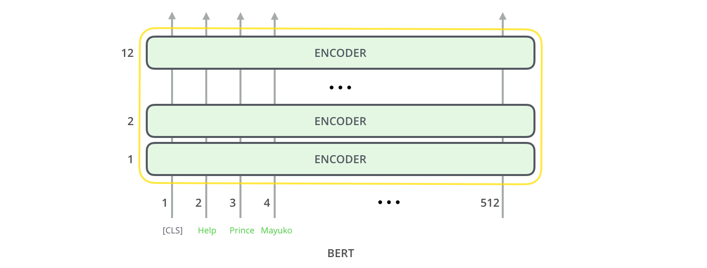
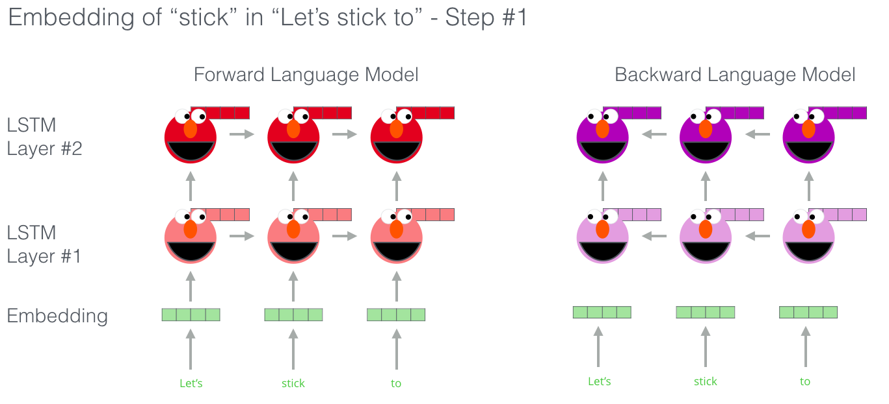

# 插图的BERT，ELMo和co。（NLP如何破解转移学习）

2018年是机器学习模型处理文本（或更准确地说是自然语言处理或NLP）的转折点。我们对如何最好地以最佳方式捕获基本含义和关系的方式来表达单词和句子的概念理解正在迅速发展。此外，NLP社区已经提出了令人难以置信的强大组件，您可以在自己的模型和管道中自由下载和使用这些组件（这被称为[NLP的ImageNet时刻](http://ruder.io/nlp-imagenet/)，指的是几年前类似的发展如何促进了Computer Vision中机器学习的发展。任务）。

（ULM-FiT与Cookie Monster无关。但是我什么都没想到。）

人在这个发展的最新里程碑是[发布](https://ai.googleblog.com/2018/11/open-sourcing-bert-state-of-art-pre.html)的[BERT](https://github.com/google-research/bert)，事件[描述](https://twitter.com/lmthang/status/1050543868041555969)为标志着NLP一个新时代的开始。BERT是一个模型，该模型打破了多个关于模型如何处理基于语言的任务的记录。在描述该模型的论文发布后不久，该团队还开源了该模型的代码，并提供了已经在大量数据集上进行了预训练的模型下载版本。这是一项重要的发展，因为它使任何构建涉及语言处理的机器学习模型的人都可以使用此强大的功能作为随时可用的组件，从而节省了从培训语言处理模型上来的时间，精力，知识和资源。刮。

BERT开发的两个步骤。您可以下载在步骤1中经过预训练的模型（在未注释的数据上进行训练），而不必担心在步骤2中对其进行微调。[ 书本图标[来源](https://commons.wikimedia.org/wiki/File:Documents_icon_-_noun_project_5020.svg) ]。

BERT建立在最近在NLP社区中兴起的许多聪明的想法之上-包括但不限于[半监督序列学习](https://arxiv.org/abs/1511.01432)（由[Andrew Dai](https://twitter.com/iamandrewdai)和[Quoc Le](https://twitter.com/quocleix)[撰写](https://arxiv.org/abs/1802.05365) ），[ELMo ](https://arxiv.org/abs/1802.05365)（由[Matthew Peters](https://twitter.com/mattthemathman)和[AI2](https://allenai.org/)和[UW CSE](https://www.engr.washington.edu/about/bldgs/cse)），[ULMFiT ](https://arxiv.org/abs/1801.06146)（由fast.ai创始人[Jeremy Howard](https://twitter.com/jeremyphoward)和[Sebastian Ruder](https://twitter.com/seb_ruder)[撰写](https://s3-us-west-2.amazonaws.com/openai-assets/research-covers/language-unsupervised/language_understanding_paper.pdf) ），[OpenAI转换器](https://s3-us-west-2.amazonaws.com/openai-assets/research-covers/language-unsupervised/language_understanding_paper.pdf)（由OpenAI研究人员[Radford](https://twitter.com/alecrad)，[Narasimhan](https://twitter.com/karthik_r_n)，[Salimans](https://twitter.com/timsalimans)和[Sutskever撰写](https://twitter.com/ilyasut)）和变压器（[Vaswani等](https://arxiv.org/pdf/1706.03762.pdf)）。

您需要了解许多概念，以正确地围绕BERT是什么。因此，让我们从研究模型本身涉及的概念开始，先研究一下使用BERT的方法。

## 示例：句子分类

使用BERT的最直接的方法是使用它对单个文本进行分类。该模型如下所示：

要训练这样的模型，您主要必须训练分类器，并且在训练阶段对BERT模型进行的更改最少。此训练过程称为“微调”，其根源是[半监督序列学习](https://arxiv.org/abs/1511.01432)和ULMFiT。

对于不熟悉该主题的人们，由于我们正在谈论分类器，因此我们属于机器学习的监督学习领域。这意味着我们需要一个标记数据集来训练这样的模型。对于此垃圾邮件分类器示例，标记的数据集将是电子邮件列表和标签（每封邮件为“垃圾邮件”或“非垃圾邮件”）。

这种用例的其他示例包括：

- 情绪分析
  - 输入：电影/产品评论。输出：评论是正面还是负面？
  - 数据集示例：[SST](https://nlp.stanford.edu/sentiment/)
- 事实核查
  - 输入：句子。输出：“要求”或“不要求”
  - 更具野心/未来派的例子：
    - 输入：索赔句。输出：“ True”或“ False”
  - [Full Fact](https://fullfact.org/)是一个为公众利益建立自动事实检查工具的组织。他们的一部分流程是分类器，可读取新闻文章并检测声明（将文本分类为“声明”或“不声明”），稍后可以进行事实检查（希望现在是人类，以后是ML）。
  - 视频：[用于自动事实检查的句子嵌入-Lev Konstantinovskiy](https://www.youtube.com/watch?v=ddf0lgPCoSo)。

## 模型架构

现在您已经有了一个有关如何使用BERT的示例用例，下面让我们仔细看看它的工作方式。

本文介绍了BERT的两种模型尺寸：

- BERT BASE –与OpenAI Transformer大小可比，以比较性能
- BERT LARGE –一个荒谬的巨大模型，达到了本文报道的最新结果

BERT基本上是训练有素的Transformer Encoder堆栈。这是指导您阅读我较早的文章[《图解变压器》](https://jalammar.github.io/illustrated-transformer/)的好时机，该文章解释了变压器模型-BERT的基本概念以及我们接下来将讨论的概念。

两种BERT型号都具有大量的编码器层（本文将其称为“变压器块”）-基本版本为十二层，大型版本为二十四层。与初始论文中Transformer的参考实现中的默认配置相比，这些设备还具有更大的前馈网络（分别为768和1024个隐藏单元）和更多关注头（分别为12和16）（6个编码器层，512个隐藏单元，和8个关注头）。

### 模型输入

为第一个输入令牌提供特殊的[CLS]令牌，其原因将在以后变得显而易见。CLS在这里代表分类。

就像变压器的香草编码器一样，BERT接受一系列单词作为输入，这些单词一直在堆栈中向上流动。每一层都进行自我关注，并将其结果通过前馈网络传递，然后将其传递给下一个编码器。

在架构方面，到目前为止，这与Transformer相同（除了大小，这只是我们可以设置的配置）。首先，在输出端我们开始看到事情如何分歧。

### 模型输出

每个位置输出一个大小为*hidden_size*（在BERT Base中为768）的向量。对于上面看过的句子分类示例，我们仅关注第一个位置的输出（将特殊的[CLS]令牌传递给了该位置）。

该向量现在可以用作我们选择的分类器的输入。本文仅通过使用单层神经网络作为分类器就取得了很好的效果。

如果您有更多标签（例如，如果您是一个使用“垃圾邮件”，“非垃圾邮件”，“社交”和“促销”标记电子邮件的电子邮件服务），则只需调整分类器网络，使其具有更多的输出神经元然后通过softmax。

## 与卷积网平行

对于那些具有计算机视觉背景的人来说，这种向量传递应该使人联想到像VGGNet这样的网络的卷积部分与网络末端的完全连接的分类部分之间发生的事情。

## 嵌入的新时代

这些新的发展带来了单词编码的新转变。到目前为止，单词嵌入一直是领先的NLP模型如何处理语言的主要力量。诸如Word2Vec和Glove之类的方法已被广泛用于此类任务。让我们回顾一下如何使用它们，然后再指出现在发生的变化。

### 词嵌入回顾

对于要由机器学习模型处理的单词，它们需要某种形式的数字表示形式，模型可以在计算中使用它们。Word2Vec表明，我们可以使用向量（数字列表）来正确表示单词，从而捕获*语义*或含义相关的关系（例如，分辨单词是相似还是相反，或者说一对单词如“斯德哥尔摩”和“瑞典”之间的关系与“开罗”和“埃及”之间的关系相同，以及句法或基于语法的关系（例如，“ had”和“ has”之间的关系是与“是”和“是”之间的相同）。

该领域很快意识到，使用在大量文本数据上经过预训练的嵌入，而不是在通常是小型数据集的模型旁边对它们进行训练，是一个好主意。因此，可以下载通过使用Word2Vec或GloVe进行预训练而生成的单词及其嵌入列表。这是GloVe嵌入“ stick”一词的示例（嵌入向量大小为200）

GloVe词嵌入“ stick”一词-一个200个浮点数的向量（四舍五入到两位小数）。它持续了200个值。

由于这些数字很大且充满数字，因此我在帖子中的图中使用以下基本形状来显示矢量：

### ELMo：上下文很重要

如果我们使用的是GloVe表示形式，则“ stick”一词将由此向量无条件表示，即上下文是什么。NLP研究人员说：“等等” （[Peters等，2017](https://arxiv.org/abs/1705.00108)；[McCann等，2017](https://arxiv.org/abs/1708.00107)；[Peters等，2018，ELMo论文](https://arxiv.org/pdf/1802.05365.pdf)），“ *棒* ”一词有多个含义取决于使用位置。为什么不基于它所使用的上下文对其进行嵌入，以捕获该上下文中的词义以及其他上下文信息呢？” 因此，*语境化的*词嵌入诞生了。

上下文化单词嵌入可以根据单词在句子上下文中的含义为单词提供不同的嵌入。另外，[RIP罗宾·威廉姆斯](https://www.youtube.com/watch?v=OwwdgsN9wF8)

ELMo不会为每个单词使用固定的嵌入，而是在为其分配每个单词之前先查看整个句子。它使用在特定任务上受过训练的双向LSTM，能够创建这些嵌入。

ELMo在NLP的背景下朝着预训练迈出了重要的一步。ELMo LSTM将以我们的数据集语言在庞大的数据集上进行训练，然后我们可以将其用作其他需要处理语言的模型的组成部分。

ELMo的秘密是什么？

ELMo受过训练以预测单词序列中的下一个单词，从而获得了对语言的理解-这项任务称为“ *语言建模”*。之所以方便，是因为我们拥有大量的文本数据，而这种模型无需标签就可以从中学习。

ELMo的预培训过程中的一个步骤：输入“让我们坚持”，预测下一个最可能出现的单词- *语言建模*任务。在大型数据集上进行训练后，模型开始采用语言模式。在此示例中，不太可能准确猜出下一个单词。更为现实的是，在诸如“ hang”这样的单词之后，它将给诸如“ out”（拼写为“ hangout”）之类的单词赋予比“ camera”更高的概率。

我们可以看到每个展开的LSTM步骤的隐藏状态从ELMo的头部后面逐渐达到峰值。在完成此预训练之后，这些将在嵌入过程中派上用场。

实际上，ELMo向前走了一步，并训练了双向LSTM，因此其语言模型不仅具有下一个单词的含义，而且还具有前一个单词的含义。

ELMo上的精彩 [幻灯片](https://www.slideshare.net/shuntaroy/a-review-of-deep-contextualized-word-representations-peters-2018)

ELMo通过以某种方式将隐藏状态（和初始嵌入）分组在一起（并置后进行加权求和）来进行上下文化的嵌入。

## ULM-FiT：掌握NLP中的转移学习

ULM-FiT引入了一些方法，可以有效地利用模型在预训练期间学到的很多知识-不仅是嵌入，而且是上下文化的嵌入。ULM-FiT引入了一种语言模型和一种过程，可以针对各种任务有效地微调该语言模型。

NLP最终有可能像Computer Vision一样可以进行迁移学习。

## 变形金刚：超越LSTM

Transformer论文和代码的发布以及在诸如机器翻译之类的任务上获得的结果开始使一些业内人士认为它们是LSTM的替代品。事实是，与LSTM相比，Transformers更好地处理了长期依赖性。

变压器的编码器/解码器结构使其非常适合机器翻译。但是，如何将其用于句子分类？您将如何使用它来预训练可以针对其他任务进行微调的语言模型（*下游*任务是该领域称为那些利用预训练模型或组件的监督学习任务）。

## OpenAI Transformer：预训练用于语言建模的Transformer解码器

事实证明，对于NLP任务，我们不需要整个Transformer就可以采用迁移学习和可微调的语言模型。我们可以只使用变压器的解码器。解码器是一个不错的选择，因为它是语言建模（预测下一个单词）的自然选择，因为它是为掩盖将来的标记而构建的，这是一个逐字生成翻译时的宝贵功能。

OpenAI Transformer由Transformer的解码器堆栈组成

该模型堆叠了十二个解码器层。由于此设置中没有编码器，因此这些解码器层将没有香草变压器解码器层具有的编码器-解码器注意子层。但是，它仍将具有自我注意层（被屏蔽，因此在将来的令牌中不会达到峰值）。

通过这种结构，我们可以继续在相同的语言建模任务上训练模型：使用海量（未标记）数据集预测下一个单词。只是，扔掉7,000本书的文字并让它学习！书籍非常适合执行此类任务，因为即使模型之间被大量文本分隔开，书籍也可以使模型学习关联相关信息，例如在使用推文或文章进行培训时，您不会得到这些信息。

现在已经准备好训练OpenAI变形金刚，以预测由7,000本书组成的数据集中的下一个单词。

## 将学习转移到下游任务

既然已经对OpenAI转换器进行了预训练，并且已经对其层进行了调整以合理地处理语言，我们就可以开始将其用于下游任务。让我们首先看一下句子分类（将电子邮件分类为“垃圾邮件”或“非垃圾邮件”）：

如何使用预训练的OpenAI转换器进行句子分类

OpenAI论文概述了许多输入转换，以处理不同类型任务的输入。本文中的下图显示了执行不同任务的模型和输入转换的结构。

那不是很聪明吗？

## BERT：从解码器到编码器

openAI转换器为我们提供了基于Transformer的可微调的预训练模型。但是，从LSTM到变形金刚的过渡中缺少一些东西。ELMo的语言模型是双向的，但是openAI转换器仅训练向前的语言模型。我们是否可以建立一个基于变压器的模型，其语言模型既向前又向后看（在技术术语中，“取决于左右上下文”）？

R级的BERT说：“拿着我的啤酒”。

### 屏蔽语言模型

BERT说：“我们将使用变压器编码器。”

厄尼回答说：“这是疯狂的事情，每个人都知道双向条件将使每个单词都可以在多层上下文中间接看到自己。”

“我们将使用口罩”，BERT自信地说。

BERT的聪明的语言建模任务掩盖了输入中15％的单词，并要求模型预测丢失的单词。

找到正确的任务来训练Transformer编码器堆栈是BERT解决的一个复杂障碍，它采用了早期文献中的“掩盖语言模型”概念（在这里称为Cloze任务）。

除了掩盖15％的输入外，BERT还进行了一些混合，以改进模型稍后进行微调的方式。有时，它会用另一个单词随机替换一个单词，并要求模型预测该位置的正确单词。

### 两句任务

如果您回顾一下OpenAI转换器为处理不同任务而进行的输入转换，您会注意到某些任务要求模型对两个句子说一些聪明的东西（例如，它们仅仅是彼此的释义版本？给定维基百科条目）作为输入，以及关于该条目的问题作为另一输入，我们可以回答该问题吗？）。

为了使BERT更好地处理多个句子之间的关系，预训练过程包括一项附加任务：给定两个句子（A和B），B可能是跟在A后面的句子吗？

对第二个任务BERT进行预训练的是两句分类任务。由于BERT实际上使用WordPieces作为令牌而不是单词，因此该图形中的令牌化过于简单---因此某些单词被分解为较小的块。

### 任务特定模型

BERT论文展示了多种将BERT用于不同任务的方法。

### BERT用于特征提取

微调方法不是使用BERT的唯一方法。就像ELMo一样，您可以使用经过预训练的BERT创建上下文化的词嵌入。然后，您可以将这些嵌入内容馈送到您的现有模型中-该过程显示了在不影响诸如命名实体识别之类的任务的情况下对BERT进行微调的结果。

哪个向量最适合作为上下文嵌入？我认为这取决于任务。本文研究了六个选择（与经过微调的模型相比，得分为96.4）：

## 带BERT出去兜风

尝试BERT的最好方法是通过在Google Colab上托管的[带有Cloud TPU](https://colab.research.google.com/github/tensorflow/tpu/blob/master/tools/colab/bert_finetuning_with_cloud_tpus.ipynb)笔记本的[BERT](https://colab.research.google.com/github/tensorflow/tpu/blob/master/tools/colab/bert_finetuning_with_cloud_tpus.ipynb) FineTuning。如果您以前从未使用过Cloud TPU，那么这也是尝试它们的一个很好的起点，而且BERT代码也可以在TPU，CPU和GPU上使用。

下一步是查看[BERT repo](https://github.com/google-research/bert)中的代码：

- 该模型是在[modelling.py](https://github.com/google-research/bert/blob/master/modeling.py)（`class BertModel`）中构建的，与香草Transformer编码器几乎相同。
- [run_classifier.py](https://github.com/google-research/bert/blob/master/run_classifier.py)是微调过程的一个示例。它还为监督模型构造了分类层。如果要构造自己的分类器，请`create_model()`在该文件中签出方法。
- 有几种预训练的模型可供下载。它们涵盖BERT Base和BERT Large，以及英语，中文等语言，以及涵盖Wikipedia训练的102种语言的多语言模型。
- BERT不会将单词视为标记。而是查看WordPieces。[tokenization.py](https://github.com/google-research/bert/blob/master/tokenization.py)是分词器，可以将您的单词转换为适合BERT的wordPieces。

您还可以签出[BERT](https://github.com/huggingface/pytorch-pretrained-BERT)的[PyTorch实现](https://github.com/huggingface/pytorch-pretrained-BERT)。该[AllenNLP](https://github.com/allenai/allennlp)库使用此实现[允许使用的嵌入BERT](https://github.com/allenai/allennlp/pull/2067)与任何模型。