# 首次使用BERT的视觉指南


在过去的几年中，用于处理语言的机器学习模型的进展迅速加快。这一进展已经离开了研究实验室，并开始为一些领先的数字产品提供动力。一个很好的例子就是[最近宣布的BERT模型如何成为Google搜索背后的主要力量](https://www.blog.google/products/search/search-language-understanding-bert/)。Google认为这一步骤（或在搜索中应用自然语言理解的进步）代表着“过去五年中最大的飞跃，也是搜索历史上最大的飞跃之一”。

这篇文章是有关如何使用BERT的变体对句子进行分类的简单教程。这是一个足够基本的示例，但是作为一个高级入门足以展示其中涉及的一些关键概念。

除了这篇文章，我还准备了一个笔记本。您可以[在笔记本上](https://github.com/jalammar/jalammar.github.io/blob/master/notebooks/bert/A_Visual_Notebook_to_Using_BERT_for_the_First_Time.ipynb)看到它[，](https://github.com/jalammar/jalammar.github.io/blob/master/notebooks/bert/A_Visual_Notebook_to_Using_BERT_for_the_First_Time.ipynb)或[在colab上运行它](https://colab.research.google.com/github/jalammar/jalammar.github.io/blob/master/notebooks/bert/A_Visual_Notebook_to_Using_BERT_for_the_First_Time.ipynb)。

## 数据集：SST2

在此示例中，我们将使用的数据集为[SST2](https://nlp.stanford.edu/sentiment/index.html)，其中包含电影评论中的句子，每个句子标记为正（值为1）或负（值为0）：

|                             句子                             | 标签 |
| :----------------------------------------------------------: | :--: |
| 一部激动人心的，有趣的，最后传达出对美与野兽和1930年代恐怖片的重新想象 | 1个  |
|       显然是从任何给定的日间肥皂的切割室地板重新组装的       |  0   |
|                   他们认为听众不会坐以待ci                   |  0   |
| 这是关于爱情，记忆，历史以及艺术与商业之间战争的视觉上令人惊叹的反省 | 1个  |
| 乔纳森·帕克（Jonathan Parker）的剧作应该是所有现代办公室失范电影的结尾 | 1个  |

## 型号：句子情感分类

我们的目标是创建一个接受句子的模型（就像我们数据集中的句子一样）并产生1（指示句子带有正面情绪）或0（指示句子带有负面情绪）。我们可以认为它看起来像这样：

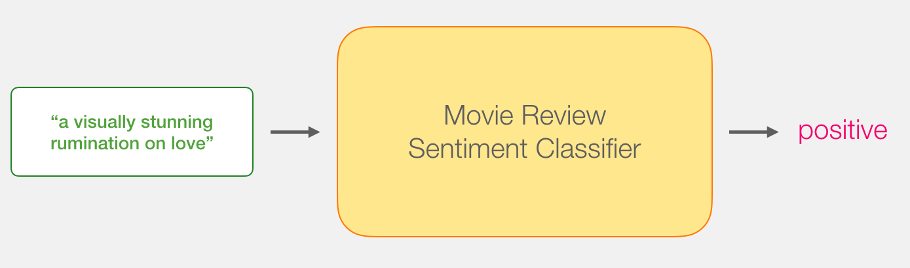

在引擎盖下，模型实际上由两个模型组成。

- [DistilBERT](https://medium.com/huggingface/distilbert-8cf3380435b5) 处理该句子，并将从中提取的一些信息传递给下一个模型。DistilBERT是由[HuggingFace](https://huggingface.co/)团队开发和开源的BERT的较小版本。它是BERT的一个更轻，更快的版本，与它的性能大致相当。
- 下一个模型是scikit learning的基本Logistic回归模型，它将吸收DistilBERT的处理结果，并将句子分类为正数或负数（分别为1或0）。

我们在两个模型之间传递的数据是大小为768的向量。我们可以将此向量视为对可用于分类的句子的嵌入。

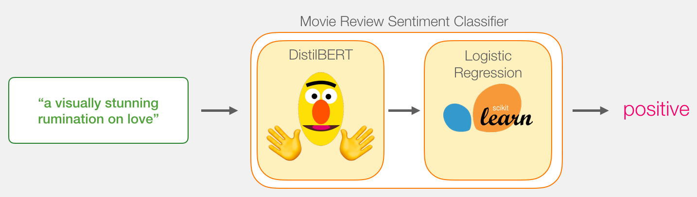

如果您已阅读我的上[一篇](https://jalammar.github.io/illustrated-bert/)文章[Illustrated BERT](https://jalammar.github.io/illustrated-bert/)，则此向量是第一个位置的结果（该位置接收[CLS]令牌作为输入）。

## 模型训练

虽然我们将使用两个模型，但我们只会训练逻辑回归模型。对于DistillBERT，我们将使用已经预先训练并掌握英语的模型。但是，这种模型都没有经过训练，没有经过微调来进行句子分类。但是，我们从训练BERT的总体目标中获得了一些句子分类功能。对于第一个位置的BERT输出（与[CLS]令牌相关联），情况尤其如此。我认为这是由于BERT的第二个训练对象–下一个句子的分类。该目标似乎训练了模型以将句子范围的含义封装到第一位置的输出。该[变压器](https://github.com/huggingface/transformers)库为我们提供了DistilBERT的实施以及模型的预训练版本。

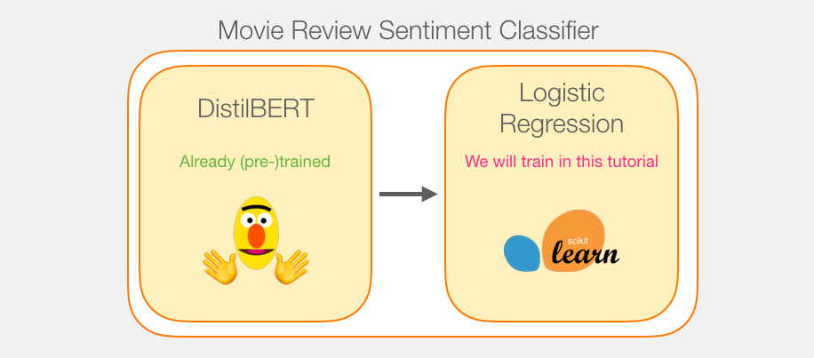

## 教程概述

所以这是本教程的游戏计划。我们将首先使用经过训练的distilBERT生成2,000个句子的句子嵌入。


此步骤之后，我们将不再触摸distilBERT。这一切都是Scikit从这里学到的。我们在此数据集上进行常规的训练/测试拆分：

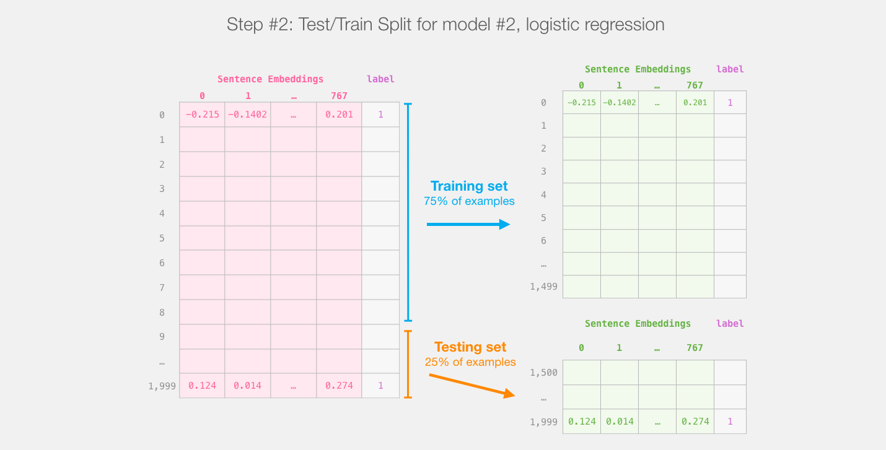
针对distilBert（模型1）的输出进行训练/测试拆分，将创建我们将训练并评估（模型2）的逻辑回归的数据集。请注意，实际上，sklearn的训练/测试拆分在进行拆分之前会先对示例进行洗牌，而不仅仅是将示例的前75％出现在数据集中。

然后，在训练集上训练逻辑回归模型：


## 如何计算单个预测

在深入研究代码并解释如何训练模型之前，我们先来看一个训练后的模型如何计算其预测。

让我们尝试对句子“对爱的视觉上惊人的反省”进行分类。第一步是使用BERT令牌生成器首先将单词拆分为令牌。然后，我们添加句子分类所需的特殊标记（这些标记位于第一个位置的[CLS]，位于句子结尾的[SEP]）。

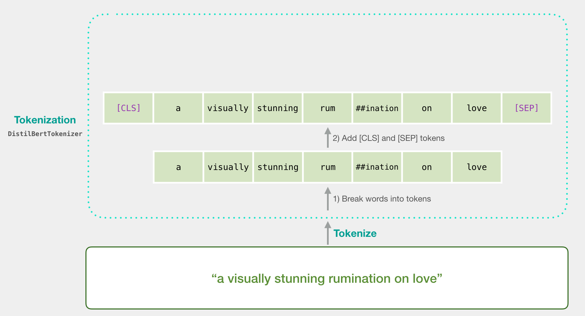

令牌化程序执行的第三步是用嵌入表中的令牌替换每个令牌，这是我们通过训练模型获得的组件。阅读有关单词嵌入的背景[的插图Word2vec](https://jalammar.github.io/illustrated-word2vec/)。

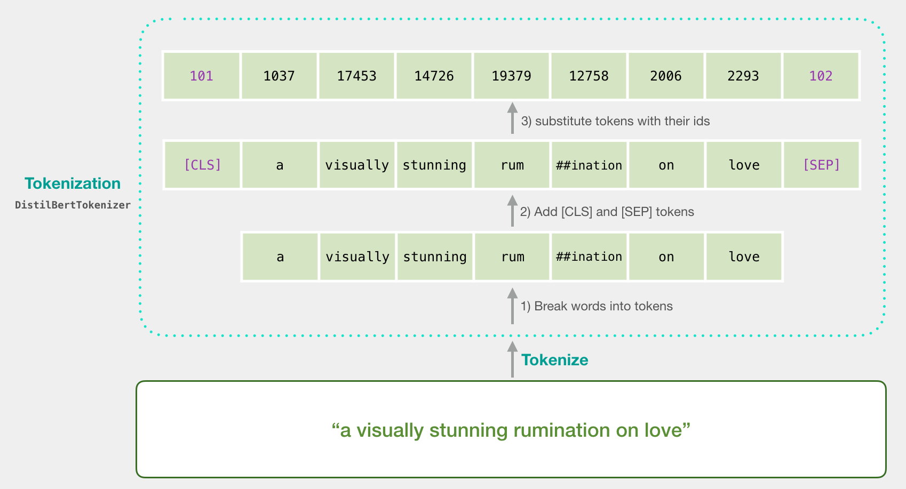

请注意，令牌生成器在一行代码中完成所有这些步骤：

```
tokenizer.encode("a visually stunning rumination on love", add_special_tokens=True)
```

现在，我们的输入句子是传递给DistilBERT的适当形状。

如果您已阅读[Illustrated BERT](https://jalammar.github.io/illustrated-bert/)，则此步骤也可以通过以下方式可视化：

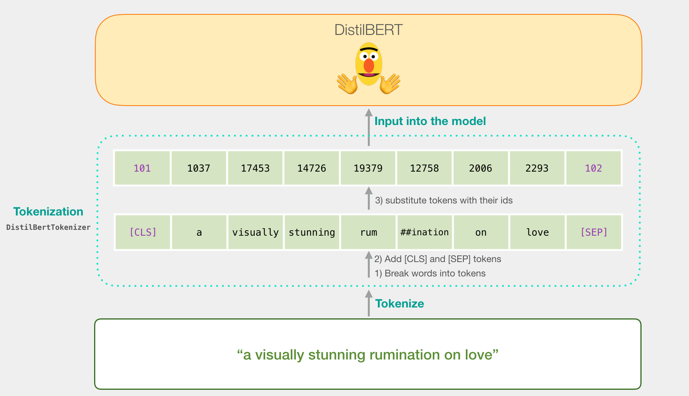

## 流经DistilBERT

[像BERT一样，](https://jalammar.github.io/illustrated-bert/)通过DistilBERT传递输入向量。输出将是每个输入令牌的向量。每个向量由768个数字（浮点数）组成。


因为这是一个句子分类任务，所以我们将忽略除第一个向量（与[CLS]令牌相关联的向量）以外的所有内容。我们传递的一个向量作为逻辑回归模型的输入。

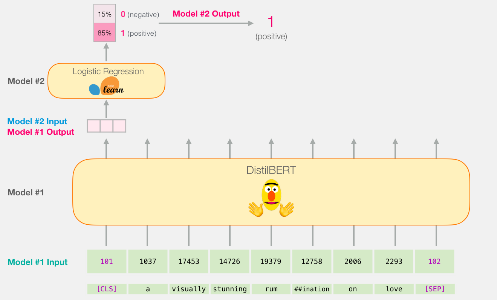

从这里开始，逻辑回归模型的工作就是根据从训练阶段中学到的向量对该向量进行分类。我们可以认为预测计算如下所示：

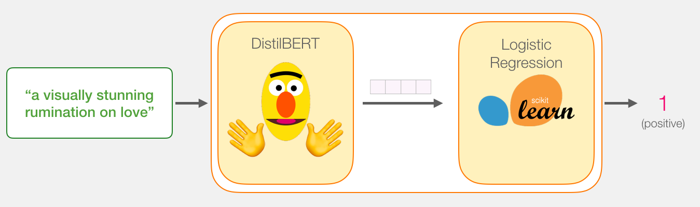

我们将在下一部分中讨论培训内容以及整个过程的代码。

## 代码

在本节中，我们将重点介绍用于训练此句子分类模型的代码。包含所有这些代码的笔记本可以在[colab](https://colab.research.google.com/github/jalammar/jalammar.github.io/blob/master/notebooks/bert/A_Visual_Notebook_to_Using_BERT_for_the_First_Time.ipynb)和[github](https://github.com/jalammar/jalammar.github.io/blob/master/notebooks/bert/A_Visual_Notebook_to_Using_BERT_for_the_First_Time.ipynb)上[找到](https://colab.research.google.com/github/jalammar/jalammar.github.io/blob/master/notebooks/bert/A_Visual_Notebook_to_Using_BERT_for_the_First_Time.ipynb)。

让我们从导入交易工具开始

```
import numpy as np
import pandas as pd
import torch
import transformers as ppb # pytorch transformers
from sklearn.linear_model import LogisticRegression
from sklearn.model_selection import cross_val_score
from sklearn.model_selection import train_test_split
```

该数据集[可以](https://github.com/clairett/pytorch-sentiment-classification/)在github上以文件形式使用，因此我们直接将其导入到pandas数据框中

```
df = pd.read_csv('https://github.com/clairett/pytorch-sentiment-classification/raw/master/data/SST2/train.tsv', delimiter='\t', header=None)
```

我们可以使用df.head（）查看数据帧的前五行，以查看数据的外观。

```
df.head()
```

哪个输出：

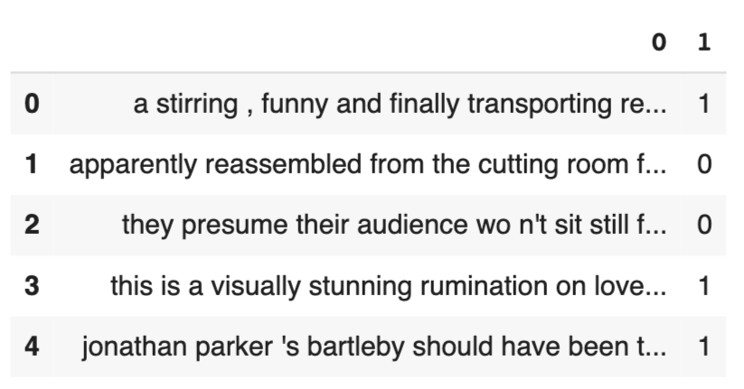

### 导入预训练的DistilBERT模型和令牌生成器

```
model_class, tokenizer_class, pretrained_weights = (ppb.DistilBertModel, ppb.DistilBertTokenizer, 'distilbert-base-uncased')

## Want BERT instead of distilBERT? Uncomment the following line:
#model_class, tokenizer_class, pretrained_weights = (ppb.BertModel, ppb.BertTokenizer, 'bert-base-uncased')

# Load pretrained model/tokenizer
tokenizer = tokenizer_class.from_pretrained(pretrained_weights)
model = model_class.from_pretrained(pretrained_weights)
```

现在，我们可以标记数据集。请注意，这里的操作与上面的示例有些不同。上面的示例仅标记和处理了一个句子。在这里，我们将分批标记和处理所有句子（笔记本出于资源考虑只处理一小部分示例，假设有2000个示例）。

### 代币化

```
tokenized = df[0].apply((lambda x: tokenizer.encode(x, add_special_tokens=True)))
```

这会将每个句子变成id列表。

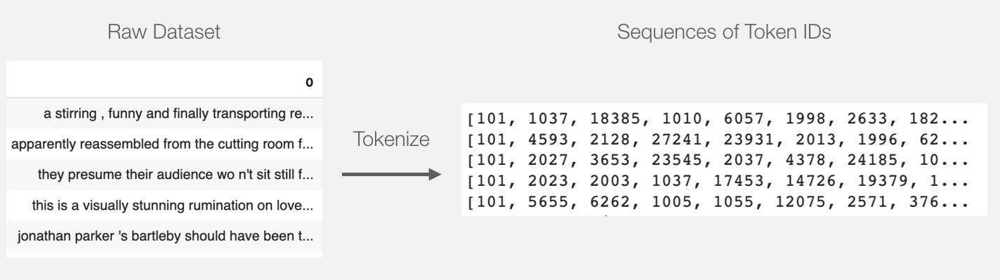

数据集当前是列表的列表（或pandas Series / DataFrame）。在DistilBERT将此作为输入处理之前，我们需要通过填充标记ID为0的较短句子填充所有向量，使其大小相同。填充步骤可以参考笔记本，它是基本的python字符串和数组操作。

填充后，我们有一个矩阵/张量准备好传递给BERT：

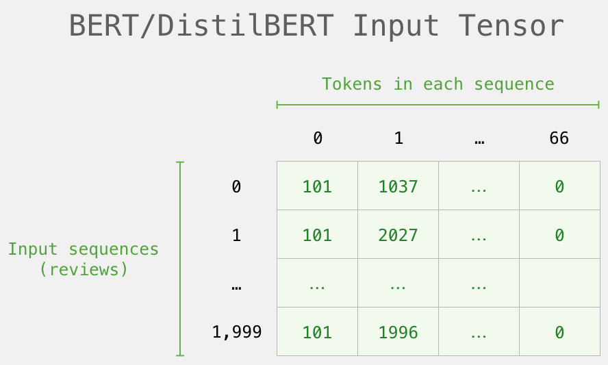

### 使用DistilBERT处理

现在，我们从填充的令牌矩阵中创建一个输入张量，并将其发送到DistilBERT

```
input_ids = torch.tensor(np.array(padded))

with torch.no_grad():
    last_hidden_states = model(input_ids)
```

运行此步骤后，`last_hidden_states`保留DistilBERT的输出。它是一个具有形状的元组（示例数，序列中的最大令牌数，DistilBERT模型中的隐藏单元数）。在我们的例子中，这将是2000（因为我们仅将自己限制为2000个示例），66（这是2000个示例中最长序列中的令牌数量），768（DistilBERT模型中的隐藏单位数量）。

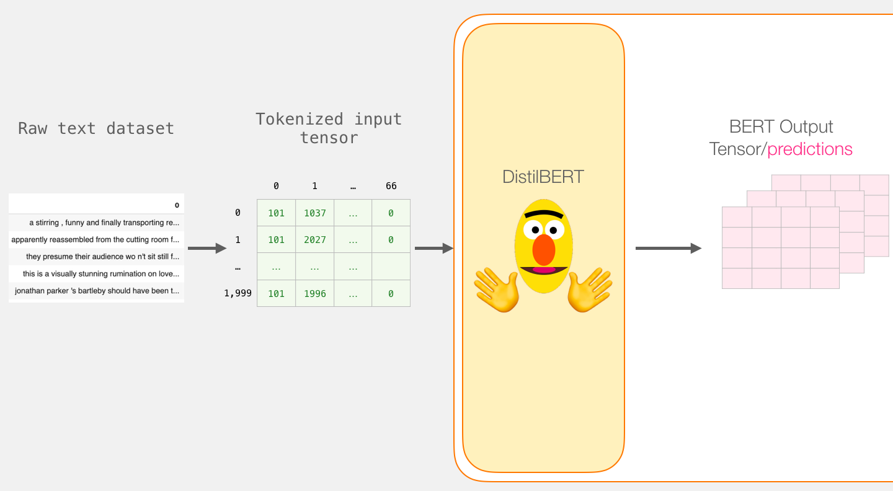

### 打开BERT输出张量的包装

让我们解压缩此3-d输出张量。我们首先可以检查其尺寸：

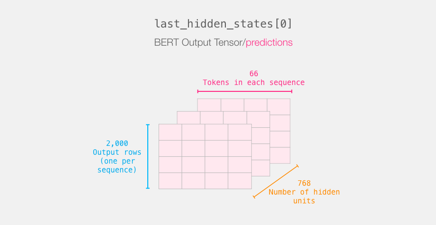

### 重述句子的旅程

每行都与数据集中的一个句子相关联。回顾一下第一句话的处理路径，我们可以将其看起来像这样：

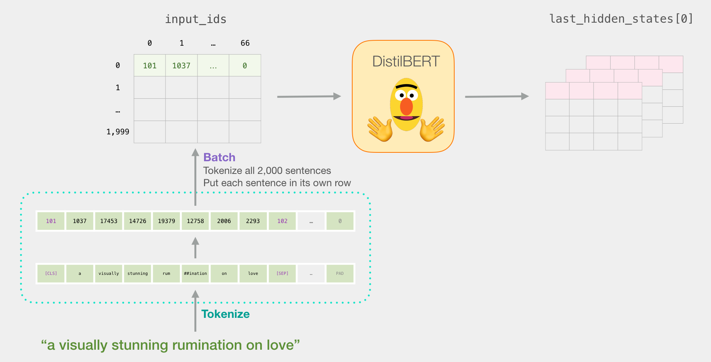

### 切片重要部分

对于句子分类，我们仅对[CLS]令牌的BERT输出感兴趣，因此我们选择该多维数据集的这一部分并丢弃其他所有内容。


这是我们如何对该3d张量进行切片以获得我们感兴趣的2d张量的方法：

```
 # Slice the output for the first position for all the sequences, take all hidden unit outputs
features = last_hidden_states[0][:,0,:].numpy()
```

现在`features`是一个二维numpy数组，其中包含我们数据集中所有句子的句子嵌入。

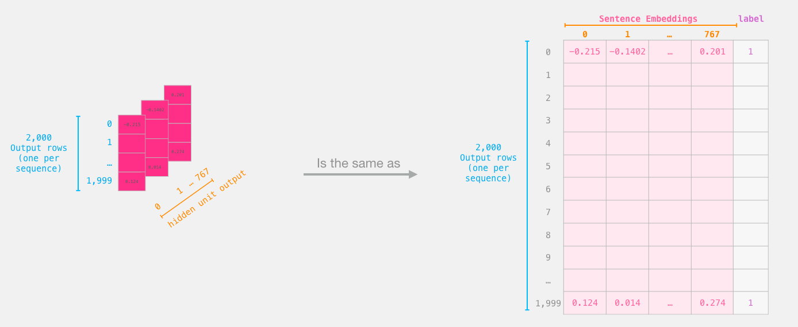
我们从BERT的输出切出的张量

## Logistic回归数据集

现在我们有了BERT的输出，我们已经组装了训练逻辑回归模型所需的数据集。768列是要素，而我们只是从初始数据集中获得的标签。

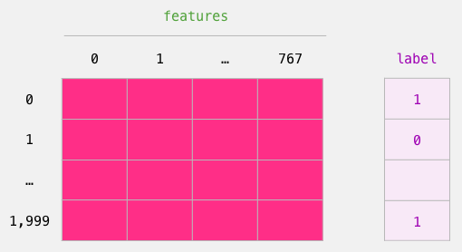
我们用来训练Logistic回归的标记数据集。这些特征是我们在上图中切出的[CLS]令牌（位置0）的BERT输出向量。每行对应于我们数据集中的一个句子，每列对应于Bert / DistilBERT模型顶部变换器块中前馈神经网络的隐藏单元的输出。

在完成传统的机器学习训练/测试拆分之后，我们可以声明我们的逻辑回归模型并针对数据集进行训练。

```
labels = df[1]
train_features, test_features, train_labels, test_labels = train_test_split(features, labels)
```

将数据集分为训练/测试集：


接下来，我们在训练集上训练Logistic回归模型。

```
lr_clf = LogisticRegression()
lr_clf.fit(train_features, train_labels)
```

现在已经对模型进行了训练，我们可以根据测试集对其评分：

```
lr_clf.score(test_features, test_labels)
```

这表明该模型可实现约81％的精度。

## 得分基准

作为参考，该数据集的最高准确性得分目前为**96.8**。可以对DistilBERT进行培训以提高其在此任务上的分数-一种称为微调的过程，该过程可更新BERT的权重，以使其在句子分类中达到更好的性能（我们可以将其称为*下游任务*）。经过微调的DistilBERT可以达到**90.7**的准确度。完整大小的BERT模型达到**94.9**。