> 这是一篇BERT 科普文，带你直观理解并实际运用现在NLP 领域的巨人之力。

如果你还有印象，在[自然语言处理（NLP）与深度学习入门指南](https://leemeng.tw/shortest-path-to-the-nlp-world-a-gentle-guide-of-natural-language-processing-and-deep-learning-for-everyone.html)里我使用了LSTM以及Google的语言代表模型[BERT](https://github.com/google-research/bert)来分类中文假新闻。而最后因为BERT本身的强大，我不费吹灰之力就在[该Kaggle竞赛](https://www.kaggle.com/c/fake-news-pair-classification-challenge/leaderboard)达到85 %的正确率，距离第一名3 %，总排名前30 %。


当初我是使用[TensorFlow官方释出的BERT](https://github.com/google-research/bert)进行fine tuning，但使用方式并不是那么直觉。最近适逢[PyTorch Hub](https://pytorch.org/hub)上架[BERT](https://pytorch.org/hub/huggingface_pytorch-pretrained-bert_bert/)，李宏毅教授的[机器学习课程](http://speech.ee.ntu.edu.tw/~tlkagk/courses_ML19.html)也推出了[BERT的教学影片](https://www.youtube.com/watch?v=UYPa347-DdE)，我认为现在正是你了解并**实际运用** BERT的最佳时机！

这篇文章会简单介绍BERT并展示如何使用BERT做[迁移学习（Transfer Learning）](https://docs.google.com/presentation/d/1DJI1yX4U5IgApGwavt0AmOCLWwso7ou1Un93sMuAWmA/edit?usp=sharing)。我在文末也会提供一些有趣的研究及应用，让你可以进一步探索变化快速的NLP世界。

如果你完全不熟NLP或是压根子没听过什么是BERT，我强力建议你之后找时间（或是现在！）观看李宏毅教授说明[ELMo](https://allennlp.org/elmo)、BERT以及[GPT](https://github.com/openai/gpt-2)等模型的影片，浅显易懂：

<iframe allow="accelerometer; 
                            autoplay; encrypted-media; gyroscope; picture-in-picture" allowfullscreen="" class="resp-iframe" frameborder="0" src="https://www.youtube-nocookie.com/embed/UYPa347-DdE" style="box-sizing: inherit; position: absolute; top: 0px; left: 0px; width: 880px; height: 495px; border: 0px;"></iframe>

李宏毅教授讲解目前NLP 领域的最新研究是如何让机器读懂文字的（我超爱这截图）


我接下来会花点篇幅阐述BERT的基础概念。如果你已经十分熟悉BERT而且迫不及待想要马上将BERT应用到自己的NLP任务上面，可以直接跳到[用BERT fine tune下游任务](https://leemeng.tw/attack_on_bert_transfer_learning_in_nlp.html#用-BERT-fine-tune-下游任務)一节。

## BERT：理解上下文的语言代表模型

一个简单的convention，等等文中会穿插使用的：

- 代表
- representation
- repr.
- repr. 向量

指的都是一个可以用来**代表**某词汇（在某个语境下）的多维连续向量（continuous vector）。

现在在NLP圈混的，应该没有人会说自己不晓得Transformer的[经典论文Attention Is All You Need](https://arxiv.org/abs/1706.03762)以及其知名的[自注意力机制（Self-attention mechanism）](https://leemeng.tw/neural-machine-translation-with-transformer-and-tensorflow2.html#Encoder-Decoder-模型-+-注意力機制)。[BERT](https://arxiv.org/abs/1810.04805)全名为**B** idirectional **E** ncoder **R** epresentations from **T** ransformers，是Google以无监督的方式利用大量无标注文本「炼成」的**语言代表模型**，其架构为Transformer中的Encoder。

我在[浅谈神经机器翻译&用Transformer英翻中](https://leemeng.tw/neural-machine-translation-with-transformer-and-tensorflow2.html)一文已经巨细靡遗地解说过所有Transformer的相关概念，这边就不再赘述。

BERT其实就是Transformer中的Encoder，只是有很多层（[图片来源](https://youtu.be/UYPa347-DdE?list=PLJV_el3uVTsOK_ZK5L0Iv_EQoL1JefRL4)）


BERT是传统语言模型的一种变形，而[语言模型（**L** anguage **M** odel, LM）](https://youtu.be/iWea12EAu6U)做的事情就是在给定一些词汇的前提下，去估计下一个词汇出现的机率分布。在[让AI给我们写点金庸](https://leemeng.tw/how-to-generate-interesting-text-with-tensorflow2-and-tensorflow-js.html)里的LSTM也是一个语言模型，只是跟BERT差了很多个数量级。

给定前t 个在字典里的词汇，语言模型要去估计第t + 1 个词汇的机率分布 P


为何会想要训练一个LM？因为有种种好处：

- 好处1：无监督数据无限大。不像[ImageNet](http://www.image-net.org/)还要找人标注数据，要训练LM的话网路上所有文本都是你潜在的资料集（BERT预训练使用的数据集共有33 **亿**个字，其中包含维基百科及[BooksCorpus](https://arxiv.org/abs/1506.06724)）
- 好处2：厉害的LM能够学会语法结构、解读语义甚至[指代消解](http://ckip.iis.sinica.edu.tw/project/coreference/)。透过特征撷取或是fine-tuning能更有效率地训练下游任务并提升其表现
- 好处3：减少处理不同NLP 任务所需的architecture engineering 成本

一般人很容易理解前两点的好处，但事实上第三点的影响也十分深远。以往为了解决不同的NLP 任务，我们会为该任务设计一个最适合的神经网路架构并做训练。以下是一些简单例子：

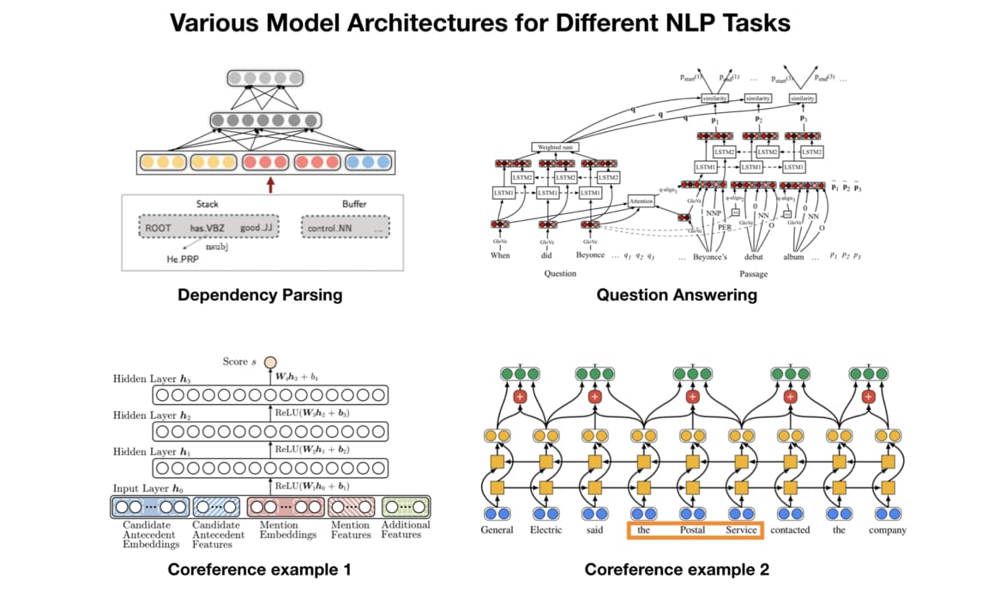一般会依照不同NLP 任务的性质为其贴身打造特定的模型架构


在这篇文章里头我不会一一介绍上述模型的运作原理，在这边只是想让你了解不同的NLP 任务通常需要不同的模型，而设计这些模型并测试其performance 是非常耗费成本的（人力、时间、计算资源）。

> 如果有一个能直接处理各式NLP 任务的通用架构该有多好？

随着时代演进，不少人很自然地有了这样子的想法，而BERT就是其中一个将此概念付诸实践的例子。[BERT论文](https://arxiv.org/pdf/1810.04805.pdf)的作者们使用Transfomer Encoder、大量文本以及两个预训练目标，事先训练好一个可以套用到多个NLP任务的BERT模型，再以此为基础fine tune多个下游任务。

这就是近来NLP领域非常流行的**两阶段**迁移学习：

- 先以LM Pretraining 的方式预先训练出一个对自然语言有一定「理解」的通用模型
- 再将该模型拿来做特征撷取或是fine tune 下游的（监督式）任务

两阶段迁移学习在BERT 下的应用：使用预先训练好的BERT 对下游任务做fine tuning


上面这个示意图最重要的概念是预训练步骤跟fine-tuning步骤所用的BERT是**一模一样**的。当你学会使用BERT就能用同个架构训练多种NLP任务，大大减少自己设计模型的architecture engineering成本，投资报酬率高到爆炸。

坏消息是，天下没有白吃的午餐。

要训练好一个有1.1亿参数的12层**BERT-BASE**得用16个[TPU chips](https://cloudplatform.googleblog.com/2018/06/Cloud-TPU-now-offers-preemptible-pricing-and-global-availability.html)跑上整整4天，[花费500镁](https://medium.com/syncedreview/the-staggering-cost-of-training-sota-ai-models-e329e80fa82)；24层的**BERT-LARGE**则有3.4亿个参数，得用64个TPU chips（约7000镁）训练。喔对，别忘了多次实验得把这些成本乘上几倍。[最近也有NLP研究者呼吁大家把训练好的模型开源释出](https://twitter.com/arnicas/status/1147426600180494337?s=20)以减少重复训练对环境造成的影响。

好消息是，BERT作者们有开源释出训练好的模型，只要使用[TensorFlow](https://github.com/google-research/bert)或是[PyTorch](https://github.com/huggingface/pytorch-pretrained-BERT)将已训练好的BERT载入，就能省去预训练步骤的所有昂贵成本。好BERT不用吗？

虽然一般来说我们只需要用训练好的BERT 做fine-tuning，稍微了解预训练步骤的内容能让你直观地理解它在做些什么。

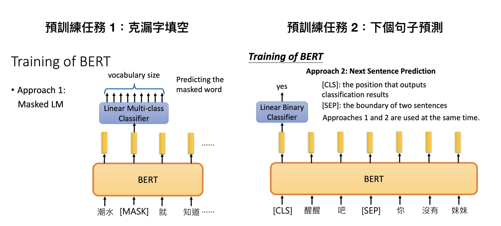BERT在预训练时需要完成的两个任务（[图片来源](https://youtu.be/UYPa347-DdE?list=PLJV_el3uVTsOK_ZK5L0Iv_EQoL1JefRL4)）


Google在预训练BERT时让它**同时**进行两个任务：

- 克漏字填空（[1953年被提出的Cloze task](https://journals.sagepub.com/doi/abs/10.1177/107769905303000401)，学术点的说法是**M** asked **L** anguage **M** odel, MLM）
- 判断第2个句子在原始文本中是否跟第1个句子相接（**N** ext **S** entence **P** rediction, NSP）

对上通天文下知地理的乡民们来说，要完成这两个任务简单到爆。只要稍微看一下**前后文**就能知道左边克漏字任务的`[MASK]`里头该填`退了`；而`醒醒吧`后面接`你沒有妹妹`也十分合情合理。

让我们马上载入[PyTorch Hub](https://pytorch.org/hub)上的[BERT模型](https://pytorch.org/hub/huggingface_pytorch-pretrained-bert_bert/)体验看看。首先我们需要安装一些简单的函式库：

（2019/10/07更新：因应HuggingFace团队最近将GitHub专案大翻新并更名成[transformers](https://github.com/huggingface/transformers)，本文已直接`import`该repo并使用新的方法调用BERT。底下的程式码将不再使用该团队在PyTorch Hub上host的模型。感谢网友Hsien提醒）

```
%% bash
pip install transformers tqdm boto3 requests regex - q
```

接着载入中文BERT 使用的tokenizer：

```python
import torch
from transformers import BertTokenizer
from IPython.display import clear_output

PRETRAINED_MODEL_NAME = "bert-base-chinese"  # 指定繁簡中文 BERT-BASE 預訓練模型

# 取得此預訓練模型所使用的 tokenizer
tokenizer = BertTokenizer.from_pretrained(PRETRAINED_MODEL_NAME)

clear_output()
print("PyTorch 版本：", torch.__version__)
```

为了让你直观了解BERT运作，本文使用包含繁体与简体中文的预训练模型。你可以在[Hugging Face团队的repo](https://github.com/huggingface/transformers/blob/master/hubconf.py)里看到所有可从PyTorch Hub载入的BERT预训练模型。截至目前为止有以下模型可供使用：

- bert-base-chinese
- bert-base-uncased
- bert-base-cased
- bert-base-german-cased
- bert-base-multilingual-uncased
- bert-base-multilingual-cased
- bert-large-cased
- bert-large-uncased
- bert-large-uncased-whole-word-masking
- bert-large-cased-whole-word-masking

这些模型的参数都已经被训练完成，而主要差别在于：

- 预训练步骤时用的文本语言
- 有无分大小写
- 层数的不同
- 预训练时遮住wordpieces 或是整个word

除了本文使用的中文BERT以外，常被拿来应用与研究的是英文的`bert-base-cased`模型。

现在让我们看看tokenizer 里头的字典资讯：

```python
vocab = tokenizer.vocab
print("字典大小：", len(vocab))
```

如上所示，中文BERT 的字典大小约有2.1 万个tokens。没记错的话，英文BERT 的字典则大约是3 万tokens 左右。我们可以瞧瞧中文BERT 字典里头纪录的一些tokens 以及其对应的索引：

```python
import random
random_tokens = random.sample(list(vocab), 10)
random_ids = [vocab[t] for t in random_tokens]

print("{0:20}{1:15}".format("token", "index"))
print("-" * 25)
for t, id in zip(random_tokens, random_ids):
    print("{0:15}{1:10}".format(t, id))
    
token               index          
-------------------------
##int                9824
孤                    2109
##肆                 18544
##既                 16245
min                  9573
##琮                 17486
coco                 8770
恚                    2611
privacy              8677
##炯                 17210
```

BERT使用当初[Google NMT](https://ai.googleblog.com/2016/09/a-neural-network-for-machine.html)提出的[WordPiece Tokenization](https://arxiv.org/abs/1609.08144)，将本来的words拆成更小粒度的wordpieces，有效处理[不在字典里头的词汇](https://en.wiktionary.org/wiki/OOV)。中文的话大致上就像是character-level tokenization，而有`##`前缀的tokens即为wordpieces。

以词汇`fragment`来说，其可以被拆成`frag`与`##ment`两个pieces，而一个word也可以独自形成一个wordpiece。wordpieces可以由搜集大量文本并找出其中常见的pattern取得。

另外有趣的是ㄅㄆㄇㄈ也有被收录：

```python
indices = list(range(647, 657))
some_pairs = [(t, idx) for t, idx in vocab.items() if idx in indices]
for pair in some_pairs:
    print(pair)
    
('ㄅ', 647)
('ㄆ', 648)
('ㄇ', 649)
('ㄉ', 650)
('ㄋ', 651)
('ㄌ', 652)
('ㄍ', 653)
('ㄎ', 654)
('ㄏ', 655)
('ㄒ', 656)
```

让我们利用中文BERT 的tokenizer 将一个中文句子断词看看：

```python
text = "[CLS] 等到潮水 [MASK] 了，就知道誰沒穿褲子。"
tokens = tokenizer.tokenize(text)
ids = tokenizer.convert_tokens_to_ids(tokens)

print(text)
print(tokens[:10], '...')
print(ids[:10], '...')
```

除了一般的wordpieces 以外，BERT 里头有5 个特殊tokens 各司其职：

- `[CLS]`：在做分类任务时其最后一层的repr. 会被视为整个输入序列的repr.
- `[SEP]`：有两个句子的文本会被串接成一个输入序列，并在两句之间插入这个token 以做区隔
- `[UNK]`：没出现在BERT 字典里头的字会被这个token 取代
- `[PAD]`：zero padding 遮罩，将长度不一的输入序列补齐方便做batch 运算
- `[MASK]`：未知遮罩，仅在预训练阶段会用到

如上例所示，`[CLS]`一般会被放在输入序列的最前面，而zero padding在之前的[Transformer文章里已经有非常详细的介绍](https://leemeng.tw/neural-machine-translation-with-transformer-and-tensorflow2.html#直觀理解遮罩在注意函式中的效果)。`[MASK]`token一般在fine-tuning或是feature extraction时不会用到，这边只是为了展示预训练阶段的克漏字任务才使用的。

现在马上让我们看看给定上面有`[MASK]`的句子，BERT会填入什么字：

```python
"""
這段程式碼載入已經訓練好的 masked 語言模型並對有 [MASK] 的句子做預測
"""
from transformers import BertForMaskedLM

# 除了 tokens 以外我們還需要辨別句子的 segment ids
tokens_tensor = torch.tensor([ids])  # (1, seq_len)
segments_tensors = torch.zeros_like(tokens_tensor)  # (1, seq_len)
maskedLM_model = BertForMaskedLM.from_pretrained(PRETRAINED_MODEL_NAME)
clear_output()

# 使用 masked LM 估計 [MASK] 位置所代表的實際 token 
maskedLM_model.eval()
with torch.no_grad():
    outputs = maskedLM_model(tokens_tensor, segments_tensors)
    predictions = outputs[0]
    # (1, seq_len, num_hidden_units)
del maskedLM_model

# 將 [MASK] 位置的機率分佈取 top k 最有可能的 tokens 出來
masked_index = 5
k = 3
probs, indices = torch.topk(torch.softmax(predictions[0, masked_index], -1), k)
predicted_tokens = tokenizer.convert_ids_to_tokens(indices.tolist())

# 顯示 top k 可能的字。一般我們就是取 top 1 當作預測值
print("輸入 tokens ：", tokens[:10], '...')
print('-' * 50)
for i, (t, p) in enumerate(zip(predicted_tokens, probs), 1):
    tokens[masked_index] = t
    print("Top {} ({:2}%)：{}".format(i, int(p.item() * 100), tokens[:10]), '...')
    
輸入 tokens ： ['[CLS]', '等', '到', '潮', '水', '[MASK]', '了', '，', '就', '知'] ...
--------------------------------------------------
Top 1 (67%)：['[CLS]', '等', '到', '潮', '水', '來', '了', '，', '就', '知'] ...
Top 2 (25%)：['[CLS]', '等', '到', '潮', '水', '濕', '了', '，', '就', '知'] ...
Top 3 ( 2%)：['[CLS]', '等', '到', '潮', '水', '過', '了', '，', '就', '知'] ...
```

Google在训练中文BERT铁定没看[批踢踢](https://term.ptt.cc/)，还无法预测出我们最想要的那个`退`字。而最接近的`過`的出现机率只有2%，但我会说以语言代表模型以及自然语言理解的角度来看这结果已经不差了。BERT透过关注`潮`与`水`这两个字，从2万多个wordpieces的可能性中选出`來`作为这个情境下`[MASK]`token的预测值，也还算说的过去。

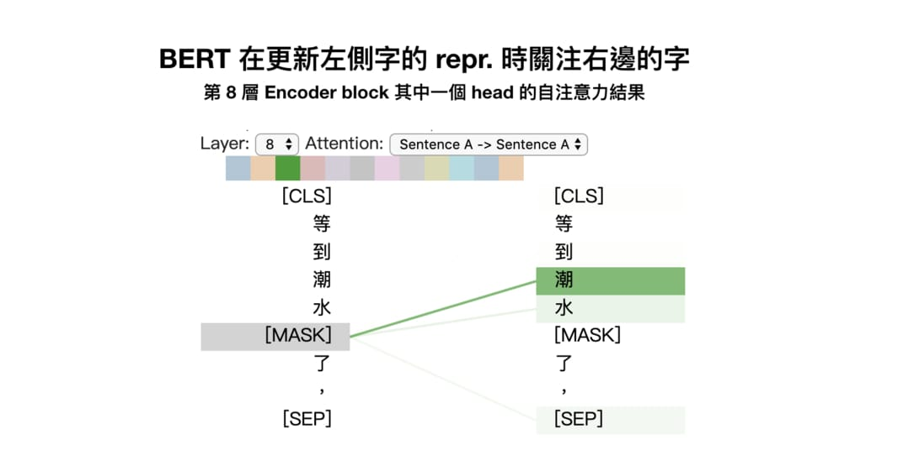

这是[BertViz](https://github.com/jessevig/bertviz)视觉化BERT注意力的结果，我等等会列出安装步骤让你自己玩玩。值得一提的是，以上是第8层Encoder block中[Multi-head attention](https://leemeng.tw/neural-machine-translation-with-transformer-and-tensorflow2.html#Multi-head-attention：你看你的，我看我的)里头某一个head的自注意力结果。并不是每个head都会关注在一样的位置。透过multi-head自注意力机制，BERT可以让不同heads在不同的representation subspaces里学会关注不同位置的不同repr.。

学会填克漏字让BERT更好地model每个词汇在不同语境下该有的repr.，而NSP任务则能帮助BERT model两个句子之间的关系，这在[问答系统QA](https://zh.wikipedia.org/wiki/問答系統)、[自然语言推论NLI](http://nlpprogress.com/english/natural_language_inference.html)或是后面我们会看到的[假新闻分类任务](https://leemeng.tw/attack_on_bert_transfer_learning_in_nlp.html#用-BERT-fine-tune-下游任務)都很有帮助。

这样的word repr.就是近年十分盛行的[contextual word representation](https://youtu.be/S-CspeZ8FHc)概念。跟以往没有蕴含上下文资讯的[Word2Vec、GloVe](https://youtu.be/8rXD5-xhemo)等无语境的词嵌入向量有很大的差异。用稍微学术一点的说法就是：

> Contextual word repr. 让同word type 的word token 在不同语境下有不同的表示方式；而传统的词向量无论上下文，都会让同type 的word token 的repr. 相同。

直觉上contextual word representation 比较能反映人类语言的真实情况，毕竟同个词汇的含义在不同情境下相异是再正常不过的事情。在不同语境下给同个词汇相同的word repr. 这件事情在近年的NLP 领域里头显得越来越不合理。

为了让你加深印象，让我再举个具体的例子：

```
情境 1：

胖虎叫大雄去買漫畫，回來慢了就打他。

情境 2：

妹妹說胖虎是「胖子」，他聽了很不開心。
```

很明显地，在这两个情境里头「他」所代表的语义以及指称的对象皆不同。如果仍使用没蕴含上下文/ 语境资讯的词向量，机器就会很难正确地「解读」这两个句子所蕴含的语义了。

现在让我们跟随[这个Colab笔记本](https://colab.research.google.com/drive/1g2nhY9vZG-PLC3w3dcHGqwsHBAXnD9EY)安装BERT的视觉化工具[BertViz](https://github.com/jessevig/bertviz)，看看BERT会怎么处理这两个情境：

```python
# 安裝 BertViz
import sys
!test -d bertviz_repo || git clone https://github.com/jessevig/bertviz bertviz_repo
if not 'bertviz_repo' in sys.path:
  sys.path += ['bertviz_repo']

# import packages
from bertviz.pytorch_transformers_attn import BertModel, BertTokenizer
from bertviz.head_view import show

# 在 jupyter notebook 裡頭顯示 visualzation 的 helper
def call_html():
  import IPython
  display(IPython.core.display.HTML('''
        <script src="/static/components/requirejs/require.js"></script>
        <script>
          requirejs.config({
            paths: {
              base: '/static/base',
              "d3": "https://cdnjs.cloudflare.com/ajax/libs/d3/3.5.8/d3.min",
              jquery: '//ajax.googleapis.com/ajax/libs/jquery/2.0.0/jquery.min',
            },
          });
        </script>
        '''))

clear_output()
```

Setup 以后就能非常轻松地将BERT 内部的注意力机制视觉化出来：

```python
# 記得我們是使用中文 BERT
model_type = 'bert'
bert_version = 'bert-base-chinese'

bertviz_model = BertModel.from_pretrained(bert_version)
bertviz_tokenizer = BertTokenizer.from_pretrained(bert_version)

# 情境 1 的句子
sentence_a = "胖虎叫大雄去買漫畫，"
sentence_b = "回來慢了就打他。"
call_html()
show(bertviz_model, model_type, bertviz_tokenizer, sentence_a, sentence_b)

# 注意：執行這段程式碼以後只會顯示下圖左側的結果。
# 為了方便你比較，我把情境 2 的結果也同時附上
```

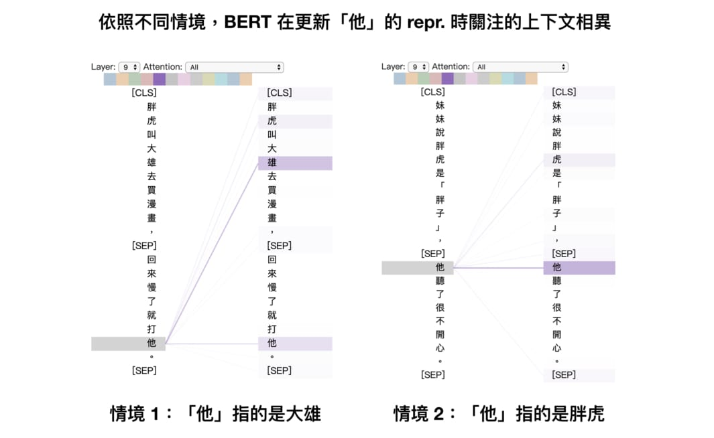

这是BERT 里第9 层Encoder block 其中一个head 的注意力结果。

图中的线条代表该head在更新「他」（左侧）的repr.时关注其他词汇（右侧）的注意力程度。越粗代表关注权重（attention weights）越高。很明显地这个head具有一定的[指代消解（Coreference Resolution）](https://youtu.be/i19m4GzBhfc)能力，能正确地关注「他」所指代的对象。

要处理指代消解需要对自然语言有不少理解，而BERT 在没有标注数据的情况下透过自注意力机制、深度双向语言模型以及「阅读」大量文本达到这样的水准，是一件令人雀跃的事情。

当然BERT并不是第一个尝试产生contextual word repr.的语言模型。在它之前最知名的例子有刚刚提到的[ELMo](https://allennlp.org/elmo)以及[GPT](https://github.com/openai/gpt-2)：

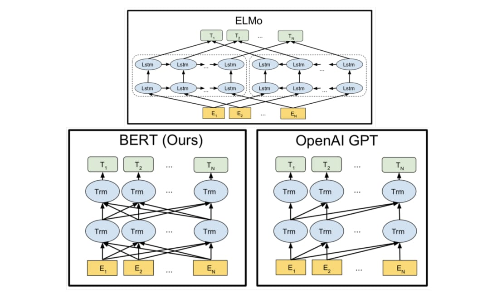ELMo、GPT 以及BERT 都透过训练语言模型来获得contextual word representation


ELMo利用独立训练的双向两层LSTM做语言模型并将中间得到的隐状态向量串接当作每个词汇的contextual word repr.；GPT则是使用Transformer的Decoder来训练一个中规中矩，从左到右的**单向**语言模型。你可以参考我另一篇文章：[直观理解GPT-2语言模型并生成金庸武侠小说](https://leemeng.tw/gpt2-language-model-generate-chinese-jing-yong-novels.html)来深入了解GPT与GPT-2。

BERT跟它们的差异在于利用MLM（即克漏字）的概念及Transformer Encoder的架构，摆脱以往语言模型只能从单个方向（由左到右或由右到左）估计下个词汇出现机率的窘境，训练出一个**双向**的语言代表模型。这使得BERT输出的每个token的repr. `Tn`都同时蕴含了前后文资讯，真正的**双向** representation。

跟以往模型相比，BERT能更好地处理自然语言，在著名的问答任务[SQuAD2.0](https://rajpurkar.github.io/SQuAD-explorer/)也有卓越表现：

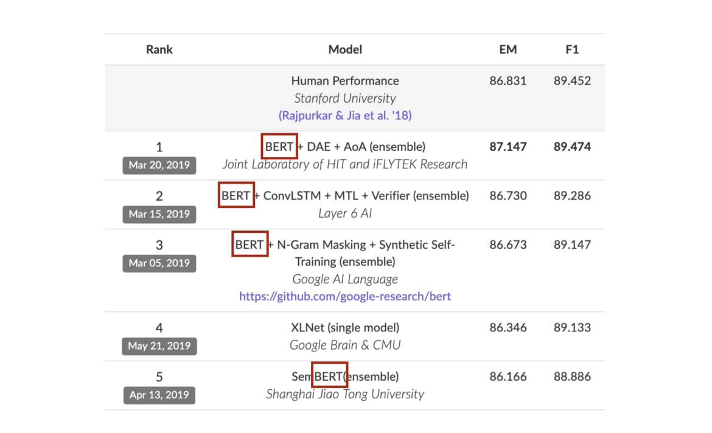SQuAD 2.0 目前排行榜的前5 名有4 个有使用BERT


我想我又犯了解说癖，这些东西你可能在看这篇文章之前就全懂了。但希望这些对BERT 的high level 介绍能帮助更多人直觉地理解BERT 的强大之处以及为何值得学习它。

假如你仍然似懂非懂，只需记得：

> BERT 是一个强大的语言代表模型，给它一段文本序列，它能回传一段相同长度且蕴含上下文资讯的word repr. 序列，对下游的NLP 任务很有帮助。

有了这样的概念以后，我们接下来要做的事情很简单，就是将自己感兴趣的NLP 任务的文本丢入BERT ，为文本里头的每个token 取得有语境的word repr.，并以此repr. 进一步fine tune 当前任务，取得更好的结果。

## 用BERT fine tune下游任务

我们在[给所有人的NLP入门指南](https://leemeng.tw/shortest-path-to-the-nlp-world-a-gentle-guide-of-natural-language-processing-and-deep-learning-for-everyone.html)碰过的[假新闻分类任务](https://www.kaggle.com/c/fake-news-pair-classification-challenge/submissions)将会是本文拿BERT来做fine-tuning的例子。选择这个任务的最主要理由是因为中文数据容易理解，另外网路上针对两个句子做分类的例子也较少。

就算你对假新闻分类没兴趣也建议继续阅读。因为本节谈到的所有概念完全可以被套用到其他语言的文本以及不同的NLP 任务之上。因此我希望接下来你能一边阅读一边想像如何用同样的方式把BERT 拿来处理你自己感兴趣的NLP 任务。

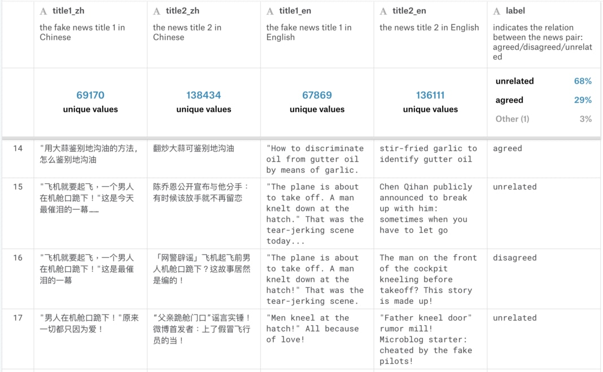给定假新闻title1，判断另一新闻title2跟title1的关系（同意、反对或无关） （[图片来源](https://leemeng.tw/shortest-path-to-the-nlp-world-a-gentle-guide-of-natural-language-processing-and-deep-learning-for-everyone.html)）


fine tune BERT 来解决新的下游任务有5 个简单步骤：

1. [准备原始文本数据](https://leemeng.tw/attack_on_bert_transfer_learning_in_nlp.html#1.-準備原始文本數據)
2. [将原始文本转换成BERT 相容的输入格式](https://leemeng.tw/attack_on_bert_transfer_learning_in_nlp.html#2.-將原始文本轉換成-BERT-相容的輸入格式)
3. [在BERT 之上加入新layer 成下游任务模型](https://leemeng.tw/attack_on_bert_transfer_learning_in_nlp.html#3.-在-BERT-之上加入新-layer-成下游任務模型)
4. [训练该下游任务模型](https://leemeng.tw/attack_on_bert_transfer_learning_in_nlp.html#4.-訓練該下游任務模型)
5. [对新样本做推论](https://leemeng.tw/attack_on_bert_transfer_learning_in_nlp.html#5.-對新樣本做推論)

对，就是那么直觉。而且你应该已经看出步骤1、4 及5 都跟训练一般模型所需的步骤无太大差异。跟BERT 最相关的细节事实上是步骤2 跟3：

- 如何将原始数据转换成**BERT相容**的输入格式？
- 如何在BERT 之上建立layer(s) 以符合下游任务需求？

事不宜迟，让我们马上以假新闻分类任务为例回答这些问题。[我在之前的文章已经说明过](https://leemeng.tw/shortest-path-to-the-nlp-world-a-gentle-guide-of-natural-language-processing-and-deep-learning-for-everyone.html)，这个任务的输入是两个句子，输出是3个类别机率的多类别分类任务（multi-class classification task），跟NLP领域里常见的[自然语言推论（Natural Language Inference ）](https://paperswithcode.com/task/natural-language-inference/latest)具有相同性质。

### 1.准备原始文本数据

为了最大化再现性（reproducibility）以及帮助有兴趣的读者深入研究，我会列出所有的程式码，你只要复制贴上就能完整重现文中所有结果并生成能提交到Kaggle 竞赛的预测档案。你当然也可以选择直接阅读，不一定要下载数据。

因为Kaggle网站本身的限制，我无法直接提供数据载点。如果你想要跟着本文练习以BERT fine tune一个假新闻的分类模型，可以先[前往该Kaggle竞赛下载资料集](https://www.kaggle.com/c/fake-news-pair-classification-challenge/data)。下载完数据你的资料夹里应该会有两个压缩档，分别代表训练集和测试集：

```python
import glob
glob.glob("*.csv.zip")
['train.csv.zip', 'test.csv.zip']
```

接着就是我实际处理训练资料集的程式码。再次申明，你只需稍微浏览注解并感受一下处理逻辑即可，no pressure。

因为竞赛早就结束，我们不必花费时间冲高分数。比起冲高准确度，让我们做点有趣的事情：从32 万笔训练数据里头随机抽样1 % 来让BERT 学怎么分类假新闻。

我们可以看看BERT 本身的语言理解能力对只有少量标注数据的任务有什么帮助：

```python
"""
前處理原始的訓練數據集。
你不需了解細節，只需要看註解了解邏輯或是輸出的數據格式即可
"""
import os
import pandas as pd

# 解壓縮從 Kaggle 競賽下載的訓練壓縮檔案
os.system("unzip train.csv.zip")

# 簡單的數據清理，去除空白標題的 examples
df_train = pd.read_csv("train.csv")
empty_title = ((df_train['title2_zh'].isnull()) \
               | (df_train['title1_zh'].isnull()) \
               | (df_train['title2_zh'] == '') \
               | (df_train['title2_zh'] == '0'))
df_train = df_train[~empty_title]

# 剔除過長的樣本以避免 BERT 無法將整個輸入序列放入記憶體不多的 GPU
MAX_LENGTH = 30
df_train = df_train[~(df_train.title1_zh.apply(lambda x : len(x)) > MAX_LENGTH)]
df_train = df_train[~(df_train.title2_zh.apply(lambda x : len(x)) > MAX_LENGTH)]

# 只用 1% 訓練數據看看 BERT 對少量標註數據有多少幫助
SAMPLE_FRAC = 0.01
df_train = df_train.sample(frac=SAMPLE_FRAC, random_state=9527)

# 去除不必要的欄位並重新命名兩標題的欄位名
df_train = df_train.reset_index()
df_train = df_train.loc[:, ['title1_zh', 'title2_zh', 'label']]
df_train.columns = ['text_a', 'text_b', 'label']

# idempotence, 將處理結果另存成 tsv 供 PyTorch 使用
df_train.to_csv("train.tsv", sep="\t", index=False)

print("訓練樣本數：", len(df_train))
df_train.head()
```

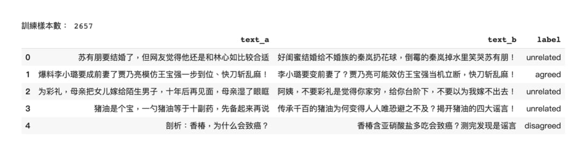

事情变得更有趣了。因为我们在抽样1 %的数据后还将过长的样本去除，实际上会被拿来训练的样本数只有2,657笔，占不到参赛时可以用的训练数据的1 %，是非常少量的数据。另外如果你想学习[Pandas](https://pandas.pydata.org/)，之后可以参考[资料科学家的pandas实战手册：掌握40个实用数据技巧](https://leemeng.tw/practical-pandas-tutorial-for-aspiring-data-scientists.html)。

我们也可以看到`unrelated`的样本占了68 %，因此我们用BERT训练出来的分类器最少最少要超过多数决的68 % baseline才行：

```python
df_train.label.value_counts() / len(df_train)
unrelated    0.679338
agreed       0.294317
disagreed    0.026346
Name: label, dtype: float64
```

接着我也对最后要预测的测试集做些非常基本的前处理，方便之后提交符合竞赛要求的格式。你也不需了解所有细节，只要知道我们最后要预测8 万笔样本：

```python
os.system("unzip test.csv.zip")
df_test = pd.read_csv("test.csv")
df_test = df_test.loc[:, ["title1_zh", "title2_zh", "id"]]
df_test.columns = ["text_a", "text_b", "Id"]
df_test.to_csv("test.tsv", sep="\t", index=False)

print("預測樣本數：", len(df_test))
df_test.head()
```

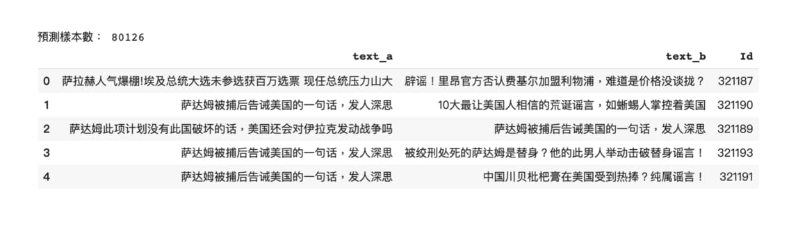

```python
ratio = len(df_test) / len(df_train)
print("測試集樣本數 / 訓練集樣本數 = {:.1f} 倍".format(ratio))
測試集樣本數 / 訓練集樣本數 = 30.2 倍
```

因为测试集的样本数是迷你训练集的30 倍之多，后面你会看到推论反而需要花费较久的时间，模型本身一下就训练完了。

### 2.将原始文本转换成BERT相容的输入格式

处理完原始数据以后，最关键的就是了解如何让BERT 读取这些数据以做训练和推论。这时候我们需要了解BERT 的输入编码格式。

这步骤是本文的精华所在。你将看到网路上绝大多数BERT文章都不会提及（或者是说明不清）的所有实务细节。以下是[原论文](https://arxiv.org/pdf/1810.04805.pdf)里头展示的成对句子编码示意图：

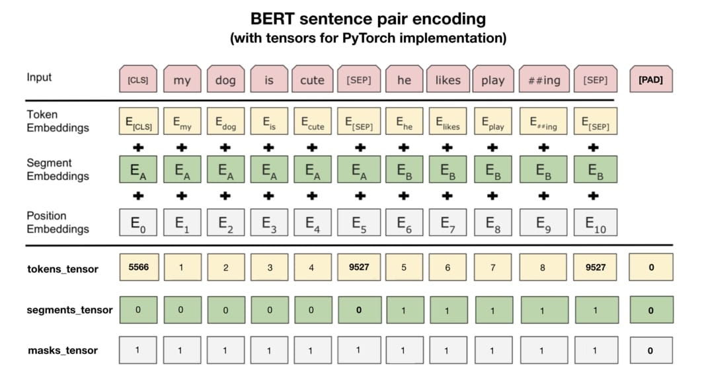加入PyTorch 使用细节的BERT 成对句子编码示意图


第二条分隔线**之上**的内容是论文里展示的例子。图中的每个Token Embedding都对应到前面提过的一个wordpiece，而Segment Embeddings则代表不同句子的位置，是学出来的。Positional Embeddings则跟其他Transformer架构中出现的位置编码同出一辙。

实际运用PyTorch的BERT时最重要的则是在第二条分隔线**之下**的资讯。我们需要将原始文本转换成 **3种id tensors**：

- `tokens_tensor`：代表识别每个token 的索引值，用tokenizer 转换即可
- `segments_tensor`：用来识别句子界限。第一句为0，第二句则为1。另外注意句子间的`[SEP]`为0
- `masks_tensor`：用来界定自注意力机制范围。1 让BERT 关注该位置，0 则代表是padding 不需关注

论文里的例子并没有说明`[PAD]`token，但实务上每个batch里头的输入序列长短不一，为了让GPU平行运算我们需要将batch里的每个输入序列都补上zero padding以保证它们长度一致。另外`masks_tensor`以及`segments_tensor`在`[PAD]`对应位置的值也都是0，切记切记。

有了这些背景知识以后，要实作一个`Dataset`并将原始文本转换成BERT相容的格式就变得十分容易了：

```python
"""
實作一個可以用來讀取訓練 / 測試集的 Dataset，這是你需要徹底了解的部分。
此 Dataset 每次將 tsv 裡的一筆成對句子轉換成 BERT 相容的格式，並回傳 3 個 tensors：
- tokens_tensor：兩個句子合併後的索引序列，包含 [CLS] 與 [SEP]
- segments_tensor：可以用來識別兩個句子界限的 binary tensor
- label_tensor：將分類標籤轉換成類別索引的 tensor, 如果是測試集則回傳 None
"""
from torch.utils.data import Dataset
 
    
class FakeNewsDataset(Dataset):
    # 讀取前處理後的 tsv 檔並初始化一些參數
    def __init__(self, mode, tokenizer):
        assert mode in ["train", "test"]  # 一般訓練你會需要 dev set
        self.mode = mode
        # 大數據你會需要用 iterator=True
        self.df = pd.read_csv(mode + ".tsv", sep="\t").fillna("")
        self.len = len(self.df)
        self.label_map = {'agreed': 0, 'disagreed': 1, 'unrelated': 2}
        self.tokenizer = tokenizer  # 我們將使用 BERT tokenizer
    
    # 定義回傳一筆訓練 / 測試數據的函式
    def __getitem__(self, idx):
        if self.mode == "test":
            text_a, text_b = self.df.iloc[idx, :2].values
            label_tensor = None
        else:
            text_a, text_b, label = self.df.iloc[idx, :].values
            # 將 label 文字也轉換成索引方便轉換成 tensor
            label_id = self.label_map[label]
            label_tensor = torch.tensor(label_id)
            
        # 建立第一個句子的 BERT tokens 並加入分隔符號 [SEP]
        word_pieces = ["[CLS]"]
        tokens_a = self.tokenizer.tokenize(text_a)
        word_pieces += tokens_a + ["[SEP]"]
        len_a = len(word_pieces)
        
        # 第二個句子的 BERT tokens
        tokens_b = self.tokenizer.tokenize(text_b)
        word_pieces += tokens_b + ["[SEP]"]
        len_b = len(word_pieces) - len_a
        
        # 將整個 token 序列轉換成索引序列
        ids = self.tokenizer.convert_tokens_to_ids(word_pieces)
        tokens_tensor = torch.tensor(ids)
        
        # 將第一句包含 [SEP] 的 token 位置設為 0，其他為 1 表示第二句
        segments_tensor = torch.tensor([0] * len_a + [1] * len_b, 
                                        dtype=torch.long)
        
        return (tokens_tensor, segments_tensor, label_tensor)
    
    def __len__(self):
        return self.len
    
    
# 初始化一個專門讀取訓練樣本的 Dataset，使用中文 BERT 斷詞
trainset = FakeNewsDataset("train", tokenizer=tokenizer)
```

这段程式码不难，我也很想硬掰些台词撑撑场面，但该说的重点都写成注解给你看了。如果你想要把自己手上的文本转换成BERT看得懂的东西，那彻底理解这个`Dataset`的实作逻辑就非常重要了。

现在让我们看看第一个训练样本转换前后的格式差异：

```python
# 選擇第一個樣本
sample_idx = 0

# 將原始文本拿出做比較
text_a, text_b, label = trainset.df.iloc[sample_idx].values

# 利用剛剛建立的 Dataset 取出轉換後的 id tensors
tokens_tensor, segments_tensor, label_tensor = trainset[sample_idx]

# 將 tokens_tensor 還原成文本
tokens = tokenizer.convert_ids_to_tokens(tokens_tensor.tolist())
combined_text = "".join(tokens)

# 渲染前後差異，毫無反應就是個 print。可以直接看輸出結果
print(f"""[原始文本]
句子 1：{text_a}
句子 2：{text_b}
分類  ：{label}

--------------------

[Dataset 回傳的 tensors]
tokens_tensor  ：{tokens_tensor}

segments_tensor：{segments_tensor}

label_tensor   ：{label_tensor}

--------------------

[還原 tokens_tensors]
{combined_text}
""")
[原始文本]
句子 1：苏有朋要结婚了，但网友觉得他还是和林心如比较合适
句子 2：好闺蜜结婚给不婚族的秦岚扔花球，倒霉的秦岚掉水里笑哭苏有朋！
分類  ：unrelated

--------------------

[Dataset 回傳的 tensors]
tokens_tensor  ：tensor([ 101, 5722, 3300, 3301, 6206, 5310, 2042,  749, 8024,  852, 5381, 1351,
        6230, 2533,  800, 6820, 3221, 1469, 3360, 2552, 1963, 3683, 6772, 1394,
        6844,  102, 1962, 7318, 6057, 5310, 2042, 5314,  679, 2042, 3184, 4638,
        4912, 2269, 2803, 5709, 4413, 8024,  948, 7450, 4638, 4912, 2269, 2957,
        3717, 7027, 5010, 1526, 5722, 3300, 3301, 8013,  102])

segments_tensor：tensor([0, 0, 0, 0, 0, 0, 0, 0, 0, 0, 0, 0, 0, 0, 0, 0, 0, 0, 0, 0, 0, 0, 0, 0,
        0, 0, 1, 1, 1, 1, 1, 1, 1, 1, 1, 1, 1, 1, 1, 1, 1, 1, 1, 1, 1, 1, 1, 1,
        1, 1, 1, 1, 1, 1, 1, 1, 1])

label_tensor   ：2

--------------------

[還原 tokens_tensors]
[CLS]苏有朋要结婚了，但网友觉得他还是和林心如比较合适[SEP]好闺蜜结婚给不婚族的秦岚扔花球，倒霉的秦岚掉水里笑哭苏有朋！[SEP]
```

好啦，我很鸡婆地帮你把处理前后的差异都列了出来，你现在应该了解我们定义的`trainset`回传的tensors跟原始文本之间的关系了吧！如果你之后想要一行行解析上面我定义的这个`Dataset`，强烈建议安装在Github上已经得到超过1万星的[PySnooper](https://github.com/cool-RR/PySnooper)：

```
!pip install pysnooper -q
import pysnooper

class FakeNewsDataset(Dataset):
        ...
    @pysnooper.snoop()  # 加入以了解所有轉換過程
    def __getitem__(self, idx):
        ...
```

加上`@pysnooper.snoop()`、重新定义`FakeNewsDataset`、初始化一个新的`trainset`并将第一个样本取出即可看到这样的logging讯息：

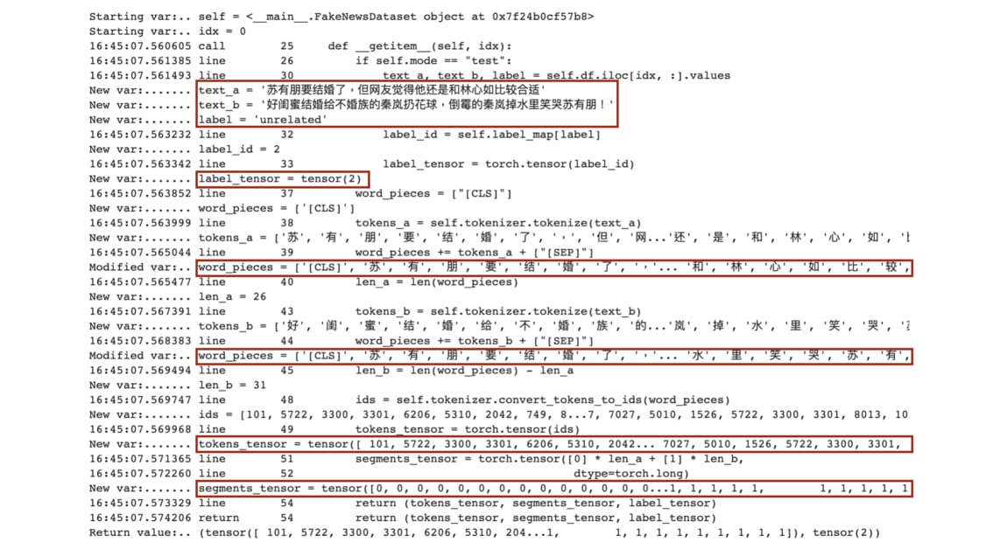使用PySnooper 让你轻松了解怎么将原始文本变得「 BERT 相容」


有了`Dataset`以后，我们还需要一个`DataLoader`来回传成一个个的mini-batch。毕竟我们不可能一次把整个数据集塞入GPU，对吧？

痾... 你刚刚应该没有打算这么做吧？

除了上面的`FakeNewsDataset`实作以外，以下的程式码是你在想将BERT应用到自己的NLP任务时会需要彻底搞懂的部分：

```python
"""
實作可以一次回傳一個 mini-batch 的 DataLoader
這個 DataLoader 吃我們上面定義的 `FakeNewsDataset`，
回傳訓練 BERT 時會需要的 4 個 tensors：
- tokens_tensors  : (batch_size, max_seq_len_in_batch)
- segments_tensors: (batch_size, max_seq_len_in_batch)
- masks_tensors   : (batch_size, max_seq_len_in_batch)
- label_ids       : (batch_size)
"""

from torch.utils.data import DataLoader
from torch.nn.utils.rnn import pad_sequence

# 這個函式的輸入 `samples` 是一個 list，裡頭的每個 element 都是
# 剛剛定義的 `FakeNewsDataset` 回傳的一個樣本，每個樣本都包含 3 tensors：
# - tokens_tensor
# - segments_tensor
# - label_tensor
# 它會對前兩個 tensors 作 zero padding，並產生前面說明過的 masks_tensors
def create_mini_batch(samples):
    tokens_tensors = [s[0] for s in samples]
    segments_tensors = [s[1] for s in samples]
    
    # 訓練集有 labels
    if samples[0][2] is not None:
        label_ids = torch.stack([s[2] for s in samples])
    else:
        label_ids = None
    
    # zero pad 到同一序列長度
    tokens_tensors = pad_sequence(tokens_tensors, 
                                  batch_first=True)
    segments_tensors = pad_sequence(segments_tensors, 
                                    batch_first=True)
    
    # attention masks，將 tokens_tensors 裡頭不為 zero padding
    # 的位置設為 1 讓 BERT 只關注這些位置的 tokens
    masks_tensors = torch.zeros(tokens_tensors.shape, 
                                dtype=torch.long)
    masks_tensors = masks_tensors.masked_fill(
        tokens_tensors != 0, 1)
    
    return tokens_tensors, segments_tensors, masks_tensors, label_ids


# 初始化一個每次回傳 64 個訓練樣本的 DataLoader
# 利用 `collate_fn` 將 list of samples 合併成一個 mini-batch 是關鍵
BATCH_SIZE = 64
trainloader = DataLoader(trainset, batch_size=BATCH_SIZE, 
                         collate_fn=create_mini_batch)
```

加上注解，我相信这应该是你在整个网路上能看到最平易近人的实作了。这段程式码是你要实际将mini-batch 丢入BERT 做训练以及预测的关键，务必搞清楚每一行在做些什么。

有了可以回传mini-batch的`DataLoader`后，让我们马上拿出一个batch看看：

```python
data = next(iter(trainloader))

tokens_tensors, segments_tensors, \
    masks_tensors, label_ids = data

print(f"""
tokens_tensors.shape   = {tokens_tensors.shape} 
{tokens_tensors}
------------------------
segments_tensors.shape = {segments_tensors.shape}
{segments_tensors}
------------------------
masks_tensors.shape    = {masks_tensors.shape}
{masks_tensors}
------------------------
label_ids.shape        = {label_ids.shape}
{label_ids}
""")
tokens_tensors.shape   = torch.Size([64, 63]) 
tensor([[ 101, 5722, 3300,  ...,    0,    0,    0],
        [ 101, 4255, 3160,  ..., 8013,  102,    0],
        [ 101,  711, 2506,  ..., 8013,  102,    0],
        ...,
        [ 101,  671, 2157,  ...,    0,    0,    0],
        [ 101, 1380,  677,  ...,    0,    0,    0],
        [ 101, 2458, 1853,  ...,    0,    0,    0]])
------------------------
segments_tensors.shape = torch.Size([64, 63])
tensor([[0, 0, 0,  ..., 0, 0, 0],
        [0, 0, 0,  ..., 1, 1, 0],
        [0, 0, 0,  ..., 1, 1, 0],
        ...,
        [0, 0, 0,  ..., 0, 0, 0],
        [0, 0, 0,  ..., 0, 0, 0],
        [0, 0, 0,  ..., 0, 0, 0]])
------------------------
masks_tensors.shape    = torch.Size([64, 63])
tensor([[1, 1, 1,  ..., 0, 0, 0],
        [1, 1, 1,  ..., 1, 1, 0],
        [1, 1, 1,  ..., 1, 1, 0],
        ...,
        [1, 1, 1,  ..., 0, 0, 0],
        [1, 1, 1,  ..., 0, 0, 0],
        [1, 1, 1,  ..., 0, 0, 0]])
------------------------
label_ids.shape        = torch.Size([64])
tensor([2, 0, 2, 2, 1, 2, 0, 2, 2, 0, 0, 2, 2, 2, 2, 2, 2, 2, 2, 2, 2, 0, 2, 2,
        2, 2, 2, 2, 0, 2, 2, 2, 2, 1, 2, 0, 2, 0, 2, 2, 2, 2, 2, 0, 2, 2, 2, 0,
        0, 2, 0, 2, 2, 0, 2, 2, 0, 2, 2, 0, 0, 2, 0, 0])
```

建立BERT用的mini-batch时最需要注意的就是zero padding的存在了。你可以发现除了`lable_ids`以外，其他3个tensors的每个样本的最后大都为0，这是因为每个样本的tokens序列基本上长度都会不同，需要补padding。

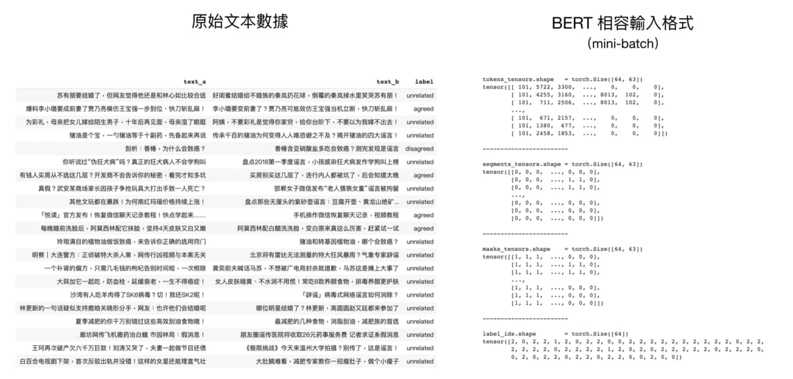

到此为止我们已经成功地将原始文本转换成BERT 相容的输入格式了。这节是本篇文章最重要，也最需要花点时间咀嚼的内容。在有这些tensors 的前提下，要在BERT 之上训练我们自己的下游任务完全是一块蛋糕。

### 3.在BERT之上加入新layer成下游任务模型

我从[李宏毅教授讲解BERT的投影片](http://speech.ee.ntu.edu.tw/~tlkagk/courses_ML19.html)中撷取出[原论文](https://arxiv.org/pdf/1810.04805.pdf)提到的4种fine-tuning BERT情境，并整合了一些有用资讯：

在4种NLP任务上fine-tuning BERT的例子（[图片来源](https://www.youtube.com/watch?v=UYPa347-DdE)）


资讯量不少，但我假设你在[前面教授的BERT影片](https://youtu.be/UYPa347-DdE)或是其他地方已经看过类似的图。

首先，我们前面一直提到的fine-tuning BERT指的是在**预训练完**的BERT之上加入新的线性分类器（Linear Classifier），并利用下游任务的目标函式**从头**训练分类器并**微调** BERT的参数。这样做的目的是让整个模型（BERT + Linear Classifier）能一起最大化当前下游任务的目标。

图中红色小字则是该任务类型常被拿来比较的资料集，比方说[MNLI](https://www.nyu.edu/projects/bowman/multinli/)及[SQuAD v1.1](https://rajpurkar.github.io/SQuAD-explorer/explore/1.1/dev/)。

不过现在对我们来说最重要的是图中的蓝色字体。多亏了[HuggingFace团队](https://pytorch.org/hub/huggingface_pytorch-pretrained-bert_bert/)，要用PyTorch fine-tuing BERT是件非常容易的事情。每个蓝色字体都对应到一个可以处理下游任务的**模型**，而这边说的模型指的是**已训练的BERT + Linear Classifier**。

按图索骥，因为假新闻分类是一个成对句子分类任务，自然就对应到上图的左下角。`FINETUNE_TASK`则为bertForSequenceClassification：

```python
# 載入一個可以做中文多分類任務的模型，n_class = 3
from transformers import BertForSequenceClassification

PRETRAINED_MODEL_NAME = "bert-base-chinese"
NUM_LABELS = 3

model = BertForSequenceClassification.from_pretrained(
    PRETRAINED_MODEL_NAME, num_labels=NUM_LABELS)

clear_output()

# high-level 顯示此模型裡的 modules
print("""
name            module
----------------------""")
for name, module in model.named_children():
    if name == "bert":
        for n, _ in module.named_children():
            print(f"{name}:{n}")
    else:
        print("{:15} {}".format(name, module))
name            module
----------------------
bert:embeddings
bert:encoder
bert:pooler
dropout         Dropout(p=0.1, inplace=False)
classifier      Linear(in_features=768, out_features=3, bias=True)
```

没错，一行程式码就初始化了一个可以用BERT做文本多分类的模型`model`。我也列出了`model`里头最high level的模组，资料流则从上到下，通过：

- BERT处理各种`embeddings`的模组
- 在[神经机器翻译](https://leemeng.tw/neural-machine-translation-with-transformer-and-tensorflow2.html)就已经看过的Transformer Encoder
- 一个pool `[CLS]`token在所有层的repr.的[BertPooler](https://github.com/huggingface/pytorch-pretrained-BERT/blob/a6f2511811f08c24184f8162f226f252cb6ceaa4/pytorch_pretrained_bert/modeling.py#L494)
- Dropout 层
- 回传3 个类别logits 的线性分类器 `classifier`

而`classifer`就只是将从BERT那边拿到的`[CLS]`token的repr.做一个线性转换而已，非常简单。我也将我们实际使用的分类模型`BertForSequenceClassification`实作简化一下供你参考：

```python
class BertForSequenceClassification(BertPreTrainedModel):
    def __init__(self, config, num_labels=2, ...):
        super(BertForSequenceClassification, self).__init__(config)
        self.num_labels = num_labels
        self.bert = BertModel(config, ...)  # 載入預訓練 BERT
        self.dropout = nn.Dropout(config.hidden_dropout_prob)
        # 簡單 linear 層
        self.classifier = nn.Linear(config.hidden_size, num_labels)
          ...

    def forward(self, input_ids, token_type_ids=None, attention_mask=None, labels=None, ...):
        # BERT 輸入就是 tokens, segments, masks
        outputs = self.bert(input_ids, token_type_ids, attention_mask, ...)
        ...
        pooled_output = self.dropout(pooled_output)
        # 線性分類器將 dropout 後的 BERT repr. 轉成類別 logits
        logits = self.classifier(pooled_output)

        # 輸入有 labels 的話直接計算 Cross Entropy 回傳，方便！
        if labels is not None:
            loss_fct = CrossEntropyLoss()
            loss = loss_fct(logits.view(-1, self.num_labels), labels.view(-1))
            return loss
        # 有要求回傳注意矩陣的話回傳
        elif self.output_attentions:
            return all_attentions, logits
        # 回傳各類別的 logits
        return logits
```

这样应该清楚多了吧！我们的分类模型`model`也就只是在BERT之上加入dropout以及简单的linear classifier，最后输出用来预测类别的logits。这就是两阶段迁移学习强大的地方：你不用再自己依照不同NLP任务从零设计非常复杂的模型，只需要站在巨人肩膀上，然后再做一点点事情就好了。

你也可以看到整个分类模型`model`预设的隐状态维度为768。如果你想要更改BERT的超参数，可以透过给一个`config`dict来设定。以下则是分类模型`model`预设的参数设定：

```python
model.config
{
  "attention_probs_dropout_prob": 0.1,
  "directionality": "bidi",
  "finetuning_task": null,
  "hidden_act": "gelu",
  "hidden_dropout_prob": 0.1,
  "hidden_size": 768,
  "initializer_range": 0.02,
  "intermediate_size": 3072,
  "layer_norm_eps": 1e-12,
  "max_position_embeddings": 512,
  "num_attention_heads": 12,
  "num_hidden_layers": 12,
  "num_labels": 3,
  "output_attentions": false,
  "output_hidden_states": false,
  "output_past": true,
  "pooler_fc_size": 768,
  "pooler_num_attention_heads": 12,
  "pooler_num_fc_layers": 3,
  "pooler_size_per_head": 128,
  "pooler_type": "first_token_transform",
  "pruned_heads": {},
  "torchscript": false,
  "type_vocab_size": 2,
  "use_bfloat16": false,
  "vocab_size": 21128
}
```

Dropout、LayerNorm、全连接层数以及mutli-head attentions的`num_attention_heads`等超参数我们也都已经在之前的Transformer文章看过了，这边就不再赘述。

目前[PyTorch Hub](https://pytorch.org/hub/huggingface_pytorch-pretrained-bert_bert/)上有8种模型以及一个tokenizer可供使用，依照用途可以分为：

- 基本款：
  - bertModel
  - **bertTokenizer**
- 预训练阶段
  - **bertForMaskedLM**
  - bertForNextSentencePrediction
  - bertForPreTraining
- Fine-tuning 阶段
  - **bertForSequenceClassification**
  - bertForTokenClassification
  - bertForQuestionAnswering
  - bertForMultipleChoice

粗体是本文用到的模型。如果你想要完全DIY自己的模型，可以载入纯`bertModel`并参考上面看到的`BertForSequenceClassification`的实作。当然建议尽量不要重造轮子。如果只是想要了解其背后实作逻辑，可以参考[pytorch-transformers](https://github.com/huggingface/pytorch-transformers)。

有了`model`以及我们在前一节建立的`trainloader`，让我们写一个简单函式测试现在`model`在训练集上的分类准确率：

```python
"""
定義一個可以針對特定 DataLoader 取得模型預測結果以及分類準確度的函式
之後也可以用來生成上傳到 Kaggle 競賽的預測結果

2019/11/22 更新：在將 `tokens`、`segments_tensors` 等 tensors
丟入模型時，強力建議指定每個 tensor 對應的參數名稱，以避免 HuggingFace
更新 repo 程式碼並改變參數順序時影響到我們的結果。
"""

def get_predictions(model, dataloader, compute_acc=False):
    predictions = None
    correct = 0
    total = 0
      
    with torch.no_grad():
        # 遍巡整個資料集
        for data in dataloader:
            # 將所有 tensors 移到 GPU 上
            if next(model.parameters()).is_cuda:
                data = [t.to("cuda:0") for t in data if t is not None]
            
            
            # 別忘記前 3 個 tensors 分別為 tokens, segments 以及 masks
            # 且強烈建議在將這些 tensors 丟入 `model` 時指定對應的參數名稱
            tokens_tensors, segments_tensors, masks_tensors = data[:3]
            outputs = model(input_ids=tokens_tensors, 
                            token_type_ids=segments_tensors, 
                            attention_mask=masks_tensors)
            
            logits = outputs[0]
            _, pred = torch.max(logits.data, 1)
            
            # 用來計算訓練集的分類準確率
            if compute_acc:
                labels = data[3]
                total += labels.size(0)
                correct += (pred == labels).sum().item()
                
            # 將當前 batch 記錄下來
            if predictions is None:
                predictions = pred
            else:
                predictions = torch.cat((predictions, pred))
    
    if compute_acc:
        acc = correct / total
        return predictions, acc
    return predictions
    
# 讓模型跑在 GPU 上並取得訓練集的分類準確率
device = torch.device("cuda:0" if torch.cuda.is_available() else "cpu")
print("device:", device)
model = model.to(device)
_, acc = get_predictions(model, trainloader, compute_acc=True)
print("classification acc:", acc)
device: cuda:0
classification acc: 0.6789612344749718
```

毫不意外，模型里新加的线性分类器才刚刚被初始化，整个分类模型的表现低于68 % 的baseline 是非常正常的。因为模型是随机初始化的，你的执行结果可能跟我有点差距，但应该不会超过68 %。

另外我们也可以算算整个分类模型以及里头的简单分类器有多少参数：

```python
def get_learnable_params(module):
    return [p for p in module.parameters() if p.requires_grad]
     
model_params = get_learnable_params(model)
clf_params = get_learnable_params(model.classifier)

print(f"""
整個分類模型的參數量：{sum(p.numel() for p in model_params)}
線性分類器的參數量：{sum(p.numel() for p in clf_params)}
""")
整個分類模型的參數量：102269955
線性分類器的參數量：2307
```

新增的classifier 的参数量在BERT 面前可说是沧海一粟。而因为分类模型大多数的参数都是从已训练的BERT 来的，实际上我们需要从头训练的参数量非常之少，这也是迁移学习的好处。

当然，一次forward 所需的时间也不少就是了。

### 4.训练该下游任务模型

接下来没有什么新玩意了，除了需要记得我们前面定义的batch数据格式以外，训练分类模型`model`就跟一般你使用PyTorch训练模型做的事情相同。

为了避免失焦，训练程式码我只保留核心部分：

```python
%%time

# 訓練模式
model.train()

# 使用 Adam Optim 更新整個分類模型的參數
optimizer = torch.optim.Adam(model.parameters(), lr=1e-5)


EPOCHS = 6  # 幸運數字
for epoch in range(EPOCHS):
    
    running_loss = 0.0
    for data in trainloader:
        
        tokens_tensors, segments_tensors, \
        masks_tensors, labels = [t.to(device) for t in data]

        # 將參數梯度歸零
        optimizer.zero_grad()
        
        # forward pass
        outputs = model(input_ids=tokens_tensors, 
                        token_type_ids=segments_tensors, 
                        attention_mask=masks_tensors, 
                        labels=labels)

        loss = outputs[0]
        # backward
        loss.backward()
        optimizer.step()


        # 紀錄當前 batch loss
        running_loss += loss.item()
        
    # 計算分類準確率
    _, acc = get_predictions(model, trainloader, compute_acc=True)

    print('[epoch %d] loss: %.3f, acc: %.3f' %
          (epoch + 1, running_loss, acc))
    
[epoch 1] loss: 26.525, acc: 0.803
[epoch 2] loss: 18.461, acc: 0.880
[epoch 3] loss: 13.736, acc: 0.913
[epoch 4] loss: 11.585, acc: 0.894
[epoch 5] loss: 9.245, acc: 0.955
[epoch 6] loss: 5.995, acc: 0.975
CPU times: user 4min 51s, sys: 3min 3s, total: 7min 54s
Wall time: 7min 56s
```

哇呜！我们成功地Fine-tune BERT 了！

尽管拥有1 亿参数的分类模型十分巨大，多亏了小训练集的助攻（？），几个epochs 的训练过程大概在几分钟内就结束了。从准确率看得出我们的分类模型在非常小量的训练集的表现已经十分不错，接着让我们看看这个模型在真实世界，也就是Kaggle 竞赛上的测试集能得到怎么样的成绩。

### 5.对新样本做推论

这边我们要做的事情很单纯，就只是用训练过后的分类模型`model`为测试集里的每个样本产生预测分类。执行完以下程式码，我们就能得到一个能直接缴交到Kaggle竞赛的csv档案：

```python
%%time
# 建立測試集。這邊我們可以用跟訓練時不同的 batch_size，看你 GPU 多大
testset = FakeNewsDataset("test", tokenizer=tokenizer)
testloader = DataLoader(testset, batch_size=256, 
                        collate_fn=create_mini_batch)

# 用分類模型預測測試集
predictions = get_predictions(model, testloader)

# 用來將預測的 label id 轉回 label 文字
index_map = {v: k for k, v in testset.label_map.items()}

# 生成 Kaggle 繳交檔案
df = pd.DataFrame({"Category": predictions.tolist()})
df['Category'] = df.Category.apply(lambda x: index_map[x])
df_pred = pd.concat([testset.df.loc[:, ["Id"]], 
                          df.loc[:, 'Category']], axis=1)
df_pred.to_csv('bert_1_prec_training_samples.csv', index=False)
df_pred.head()
CPU times: user 7min 24s, sys: 4min 39s, total: 12min 4s
Wall time: 12min 4s

```

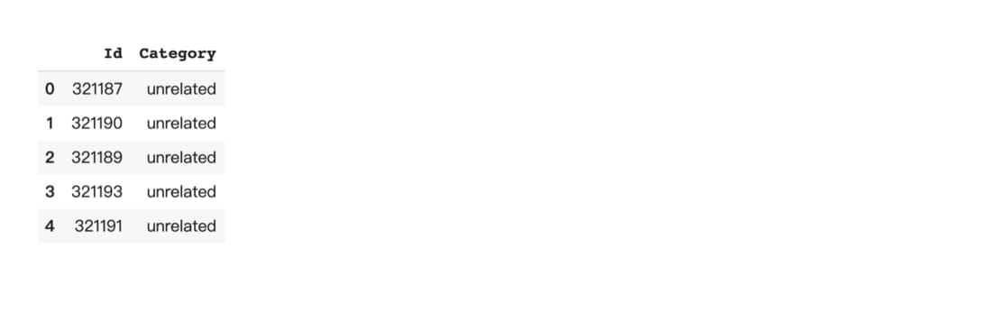

```python
!ls bert*.csv
bert_1_prec_training_samples.csv
```

我们前面就说过测试集是训练集的30 倍，因此光是做推论就得花不少时间。废话不多说，让我将生成的预测结果上传到Kaggle 网站，看看会得到怎么样的结果：

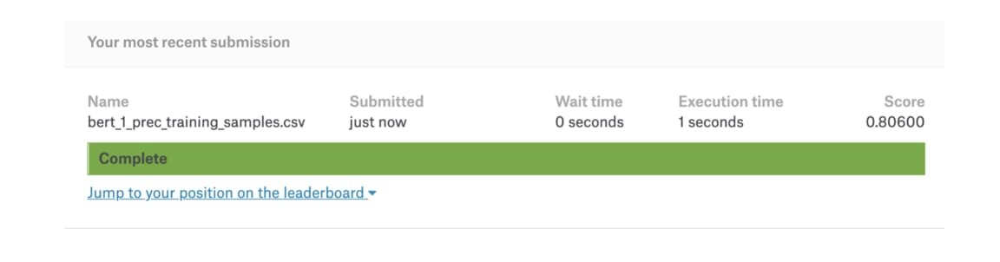在不到1 % 的数据Fine-tuing BERT 可以达到80 % 测试准确率


测试集是训练集的30 倍大，overfitting 完全是可预期的。不过跟我们一开始多数决的68 % baseline 相比，以BERT fine tune 的分类模型在测试集达到80 %，整整上升了12 %。虽然这篇文章的重点一直都不在最大化这个假新闻分类任务的准确率，还是别忘了我们只用了不到原来竞赛1 % 的数据以及不到5 分钟的时间就达到这样的结果。

让我们忘了准确率，看看BERT本身在fine tuning之前与之后的差异。以下程式码列出模型成功预测`disagreed`类别的一些例子：

```python
predictions = get_predictions(model, trainloader)
df = pd.DataFrame({"predicted": predictions.tolist()})
df['predicted'] = df.predicted.apply(lambda x: index_map[x])
df1 = pd.concat([trainset.df, df.loc[:, 'predicted']], axis=1)
disagreed_tp = ((df1.label == 'disagreed') & \
                (df1.label == df1.predicted) & \
                (df1.text_a.apply(lambda x: True if len(x) < 10 else False)))
df1[disagreed_tp].head()
```


其实用肉眼看看这些例子，以你对自然语言的理解应该能猜出要能正确判断`text_b`是反对`text_a`，首先要先关注「谣」、「假」等代表反对意义的词汇，接着再看看两个句子间有没有含义相反的词汇。

让我们从中随意选取一个例子，看看fine tuned后的BERT能不能关注到该关注的位置。再次出动[BertViz](https://github.com/jessevig/bertviz)来视觉化BERT的注意权重：

```python
# 觀察訓練過後的 model 在處理假新聞分類任務時關注的位置
# 去掉 `state_dict` 即可觀看原始 BERT 結果
bert_version = 'bert-base-chinese'
bertviz_model = BertModel.from_pretrained(bert_version, 
                                          state_dict=model.bert.state_dict())

sentence_a = "烟王褚时健去世"
sentence_b = "辟谣：一代烟王褚时健安好！"

call_html()
show(bertviz_model, model_type, bertviz_tokenizer, sentence_a, sentence_b)
# 這段程式碼會顯示下圖中右邊的結果
```

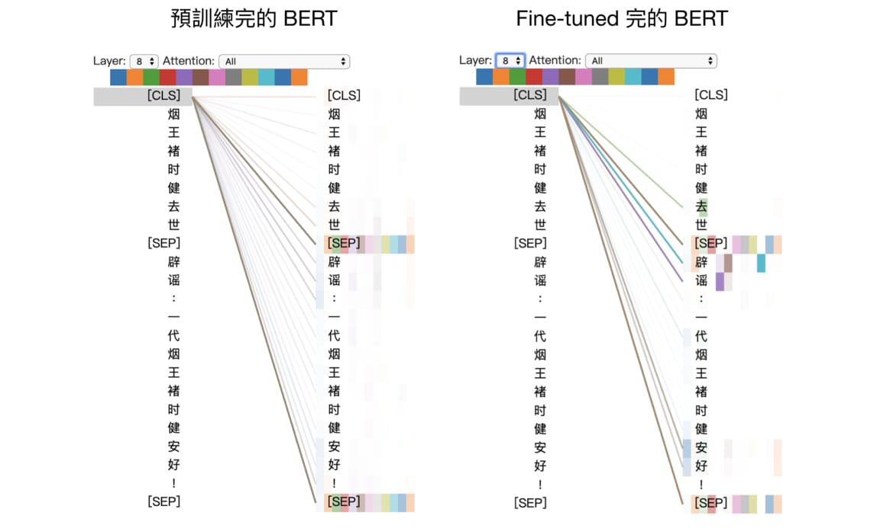

我们说过在BERT里头，第一个`[CLS]`的repr.代表着整个输入序列的repr.。

左边是一般预训练完的BERT。如果你还记得BERT的其中一个预训练任务NSP的话，就会了解这时的`[CLS]`所包含的资讯大多是要用来预测第二句本来是否接在第一句后面。以第8层Encoder block而言，你会发现大多数的heads在更新`[CLS]`时只关注两句间的`[SEP]`。

有趣的是在看过一些假新闻分类数据以后（右图），这层的一些heads在更新`[CLS]`的repr.时会开始关注跟下游任务目标相关的特定词汇：

- 辟谣
- 去世
- 安好

在fine tune一阵子之后，这层Encoder block学会关注两句之间「冲突」的位置，并将这些资讯更新到`[CLS]`里头。有了这些资讯，之后的Linear Classifier可以将其转换成更好的分类预测。考虑到我们只给BERT看不到1 %的数据，这样的结果不差。如果有时间fine tune整个训练集，我们能得到更好的成果。

好啦，到此为止你应该已经能直观地理解BERT并开始fine tuning自己的下游任务了。如果你要做的是如[SQuAD问答](https://github.com/huggingface/pytorch-pretrained-BERT#squad)等常见的任务，甚至可以用[pytorch-transformers](https://github.com/huggingface/pytorch-transformers)准备好的Python脚本一键完成训练与推论：

```python
# 腳本模式的好處是可以透過改變參數快速進行各種實驗。
# 壞處是黑盒子效應，不過對閱讀完本文的你應該不是個問題。
# 選擇適合自己的方式 fine-tuning BERT 吧！
export SQUAD_DIR=/path/to/SQUAD

python run_squad.py \
  --bert_model bert-base-uncased \
  --do_train \
  --do_predict \
  --do_lower_case \
  --train_file $SQUAD_DIR/train-v1.1.json \
  --predict_file $SQUAD_DIR/dev-v1.1.json \
  --train_batch_size 12 \
  --learning_rate 3e-5 \
  --num_train_epochs 2.0 \
  --max_seq_length 384 \
  --doc_stride 128 \
  --output_dir /tmp/debug_squad/
```

用脚本的好处是你不需要知道所有实作细节，只要调整自己感兴趣的参数就好。我在[用CartoonGAN与TensorFlow 2生成新海诚动画](http://localhost:8000/generate-anime-using-cartoongan-and-tensorflow2.html)一文也采用同样方式，提供读者一键生成卡通图片的Python脚本。

当然，你也可以先试着一步步执行本文列出的程式码，复习并巩固学到的东西。最后，让我们做点简单的总结。

## 结语

一路过来，你现在应该已经能够：

- 直观理解BERT 内部自注意力机制的物理意义
- 向其他人清楚解释何谓BERT 以及其运作的原理
- 了解contextual word repr. 及两阶段迁移学习
- 将文本数据转换成BERT 相容的输入格式
- 依据下游任务fine tuning BERT 并进行推论

恭喜！你现在已经具备能够进一步探索最新NLP 研究与应用的能力了。

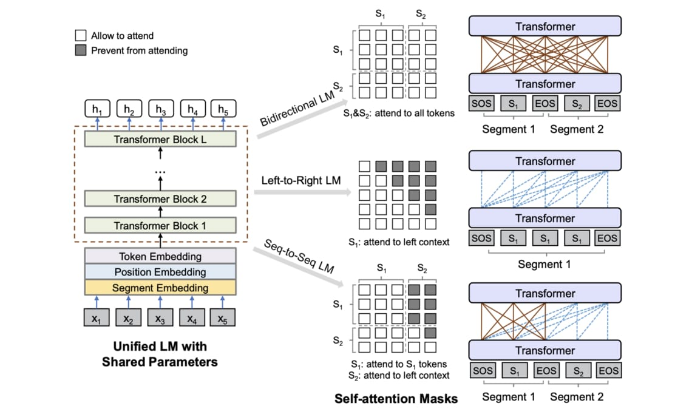UniLM用3种语言模型作为预训练目标，可以fine tune自然语言生成任务，是值得期待的研究（[图片来源](https://arxiv.org/abs/1905.03197)）


我还有不少东西想跟你分享，但因为时间有限，在这边就简单地条列出来：

- BERT的Encoder架构很适合做[自然语言理解NLU](http://web.stanford.edu/class/cs224u/)任务，但如文章摘要等[自然语言生成NLG](https://youtu.be/4uG1NMKNWCU)的任务就不太okay。[BertSum](https://github.com/nlpyang/BertSum)则是一篇利用BERT做萃取式摘要并在[CNN/Dailymail取得SOTA](https://paperswithcode.com/sota/document-summarization-on-cnn-daily-mail)的研究，适合想要在BERT之上开发自己模型的人参考作法
- [UniLM](https://arxiv.org/abs/1905.03197)透过「玩弄」注意力遮罩使得其可以在预训练阶段同时训练3种语言模型，让fine tune NLG任务不再是梦想。如果你了解[之前Transformer文章](https://leemeng.tw/neural-machine-translation-with-transformer-and-tensorflow2.html)里说明的遮罩概念，几秒钟就能直观理解上面的UniLM架构
- 最近新的NLP王者非[XLNet](https://arxiv.org/abs/1906.08237)莫属。其表现打败BERT自然不需多言，但[训练该模型所需的花费](https://medium.com/syncedreview/the-staggering-cost-of-training-sota-ai-models-e329e80fa82)令人不禁思考这样的大公司游戏是否就是我们要的未来
- 有些人认为BERT不够通用，因为Fine-tuning时还要依照不同下游任务加入新的Linear Classifier。有些人提倡使用Multitask Learning想办法弄出更通用的模型，而[decaNLP](https://decanlp.com/)是一个知名例子。
- PyTorch的BERT虽然使用上十分直觉，如果没有强大的GPU还是很难在实务上使用。你可以尝试特征撷取或是freeze BERT。另外如果你是以个人身份进行研究，但又希望能最小化成本并加快模型训练效率，我会推荐花点时间学会[在Colab上使用TensorFlow Hub及TPU训练模型](https://colab.sandbox.google.com/github/google-research/bert/blob/master/predicting_movie_reviews_with_bert_on_tf_hub.ipynb)

其他的碎念留待下次吧。

当时在撰写[进入NLP世界的最佳桥梁](https://leemeng.tw/shortest-path-to-the-nlp-world-a-gentle-guide-of-natural-language-processing-and-deep-learning-for-everyone.html)一文时我希望能用点微薄之力搭起一座小桥，帮助更多人平顺地进入NLP世界。作为该篇文章的延伸，这次我希望已经在NLP世界闯荡的你能够进一步掌握突破城墙的巨人之力，前往更远的地方。