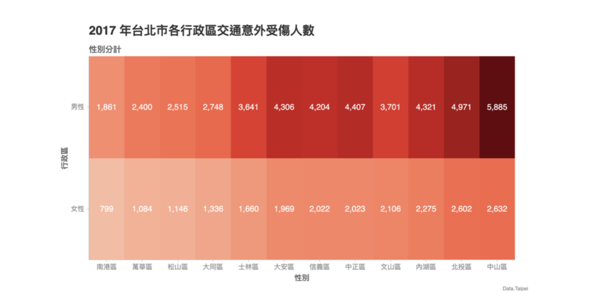
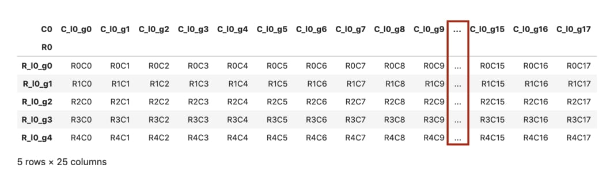
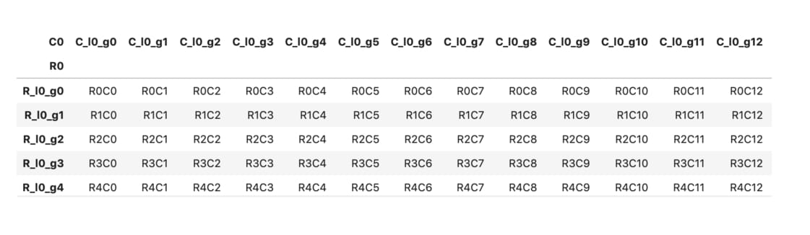
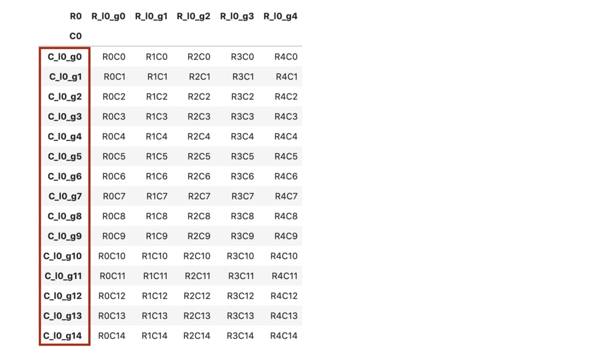
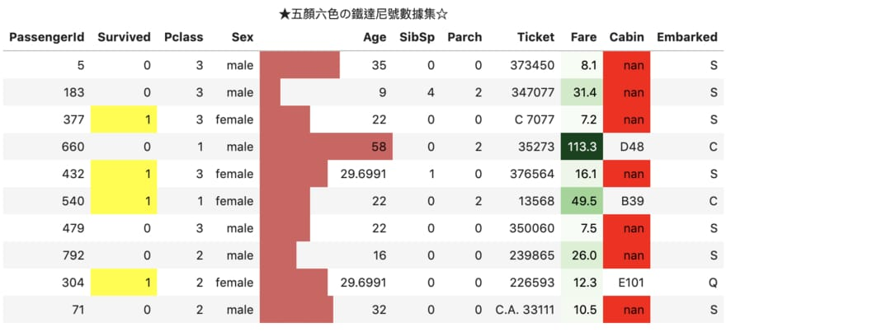
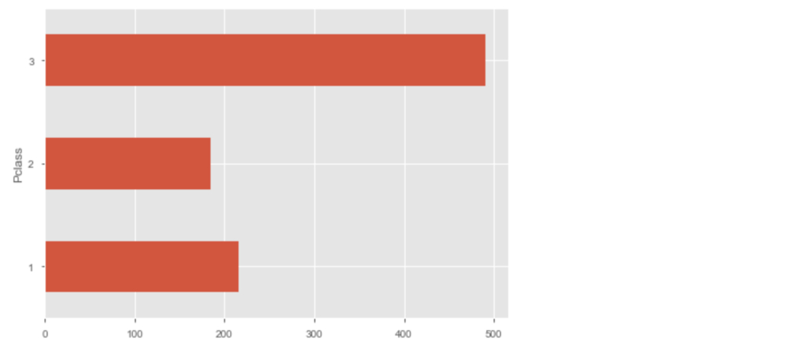
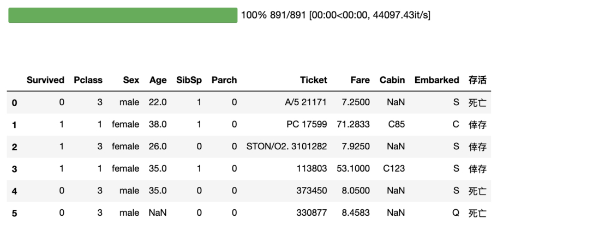
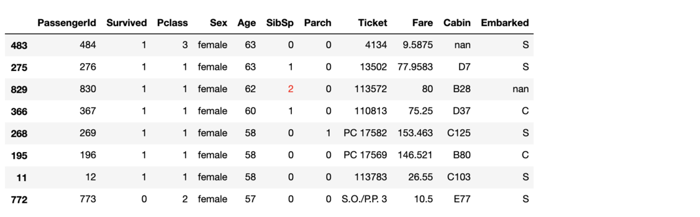

> 故学然后知不足，教然后知困。知不足，然后能自反也；知困，然后能自强也，故曰：教学相长也。
> ─ 《礼记．学记》

[pandas](https://pandas.pydata.org/)是[Python](https://www.python.org/)的一个资料分析函式库，提供如[DataFrame](https://pandas.pydata.org/pandas-docs/stable/reference/api/pandas.DataFrame.html)等十分容易操作的资料结构，是近年做数据分析时不可或需的工具之一。

虽然已经有满坑满谷的教学文章、影片或是线上课程，正是因为pandas学习资源之多，导致初学者常常不知如何踏出第一步。在这篇文章里头，我以自身作为资料科学家（**D** ata **S** cientist, DS）的工作经验，将接近40个实用的pandas技巧由浅入深地分成6大类别：

1. [建立DataFrame](https://leemeng.tw/practical-pandas-tutorial-for-aspiring-data-scientists.html#建立-DataFrame)
2. [客制化DataFrame 显示设定](https://leemeng.tw/practical-pandas-tutorial-for-aspiring-data-scientists.html#客製化-DataFrame-顯示設定_1)
3. [数据清理& 整理](https://leemeng.tw/practical-pandas-tutorial-for-aspiring-data-scientists.html#數據清理-&-整理_1)
4. [取得想要关注的数据](https://leemeng.tw/practical-pandas-tutorial-for-aspiring-data-scientists.html#取得想要關注的數據_1)
5. [基本数据处理与转换](https://leemeng.tw/practical-pandas-tutorial-for-aspiring-data-scientists.html#基本數據處理與轉換_1)
6. [简单汇总& 分析数据](https://leemeng.tw/practical-pandas-tutorial-for-aspiring-data-scientists.html#簡單匯總-&-分析數據_1)

透过有系统地呈现这些pandas技巧，我希望能让更多想要利用Python做资料分析或是想成为DS的你，能用最有效率的方式掌握核心pandas能力；同时也希望你能将自己认为实用但本文没有提到的技巧与我分享，达到开头引文所说的**教学相长**：）

如果你是使用宽萤幕浏览本文，随时可以点击左侧传送门浏览各章内容：

<video autoplay="" loop="" muted="" playsinline="" poster="https://leemeng.tw/images/pandas/toc_overview.jpg" style="box-sizing: inherit; display: block; max-width: 100%; height: auto; margin: auto; width: 880px; mix-blend-mode: initial;"></video>


除了pandas的操作技巧以外，我在最后一节：[与pandas相得益彰的实用工具](https://leemeng.tw/practical-pandas-tutorial-for-aspiring-data-scientists.html#與-pandas-相得益彰的實用工具_1)里也介绍了几个实用函式库。就算你是pandas老手，或许也能从中得到些收获。当然也非常欢迎与我分享其他厉害工具，我会更新到文章里头让更多人知道。

前言已尽，让我们开始这趟pandas旅程吧！当然，首先你得`import pandas`：

```python
import pandas as pd 
pd.__version__   
'0.24.2'
```

## 建立DataFrame 

pandas里有非常多种可以初始化一个[DataFrame](https://pandas.pydata.org/pandas-docs/stable/reference/api/pandas.DataFrame.html)的技巧。以下列出一些我觉得实用的初始化方式。

### 用Python dict建立DataFrame 

使用Python的`dict`来初始化DataFrame十分直觉。基本上`dict`里头的每一个键值（key）都对应到一个栏位名称，而其值（value）则是一个iterable，代表该栏位里头所有的数值。

```python
dic = {
    "col 1": [1, 2, 3], 
    "col 2": [10, 20, 30],
    "col 3": list('xyz'),
    "col 4": ['a', 'b', 'c'],
    "col 5": pd.Series(range(3))
}
df = pd.DataFrame(dic)
df
```

|      | col 1 | col 2 | col 3 | col 4 | col 5 |
| :--- | ----: | ----: | ----: | ----: | ----: |
| 0    |     1 |    10 |     x |     a |     0 |
| 1    |     2 |    20 |     y |     b |     1 |
| 2    |     3 |    30 |     z |     c |     2 |

在需要管理多个DataFrames时你会想要用更有意义的名字来代表它们，但在资料科学领域里只要看到`df`，每个人都会预期它是一个**D** ata **F** rame，不论是Python或是R语言的使用者。

很多时候你也会需要改变DataFrame 里的栏位名称：

```python
rename_dic = {"col 1": "x", "col 2": "10x"}
df.rename(rename_dic, axis=1)
```

|      |    x |  10x | col 3 | col 4 | col 5 |
| :--- | ---: | ---: | ----: | ----: | ----: |
| 0    |    1 |   10 |     x |     a |     0 |
| 1    |    2 |   20 |     y |     b |     1 |
| 2    |    3 |   30 |     z |     c |     2 |

这边也很直觉，就是给一个将旧栏位名对应到新栏位名的Python `dict`。值得注意的是参数`axis=1`：在pandas里大部分函式预设处理的轴为列（row）：以`axis=0`表示；而将`axis`设置为`1`则代表你想以行（column）为单位套用该函式。

你也可以用`df.columns`的方式改栏位名称：

```python
df.columns = ['x(new)', '10x(new)'] + list(df.columns[2:])
df
```

|      | x(new) | 10x(new) | col 3 | col 4 | col 5 |
| :--- | -----: | -------: | ----: | ----: | ----: |
| 0    |      1 |       10 |     x |     a |     0 |
| 1    |      2 |       20 |     y |     b |     1 |
| 2    |      3 |       30 |     z |     c |     2 |

### 使用pd.util.testing随机建立DataFrame 

当你想要随意初始化一个DataFrame并测试pandas功能时，`pd.util.testing`就显得十分好用：

```
pd . util . testing . makeDataFrame () . head ( 10 )
```

|            |         A |         B |         C |         D |
| :--------- | --------: | --------: | --------: | --------: |
| xPlIXbQqGU |  1.086581 | -0.002484 | -0.335693 |  0.226988 |
| IAFe6K8mpA | -0.547556 | -0.290935 | -0.014313 | -0.301007 |
| OoATGY0k2M |  1.017636 |  0.568835 | -0.272382 |  0.659657 |
| uRN2yGacDw | -0.662390 |  1.929820 | -1.206670 |  0.250626 |
| ElphZli9nK | -0.697235 |  0.942415 | -0.894887 |  0.701790 |
| oiEoCPCXK8 | -1.049284 | -1.019107 | -0.640271 | -0.613056 |
| NUrQFrYQw1 |  0.759355 |  0.717367 | -0.449368 |  1.889321 |
| oC9iiEBneW |  0.665412 | -0.391204 | -0.974010 |  0.248326 |
| 4hD6Eea7yF | -0.862819 |  2.092149 |  0.976645 | -0.388735 |
| 3QD5mMfstw | -0.312762 | -0.110278 |  1.162421 | -0.335144 |

`head`函式预设用来显示DataFrame中前5笔数据。要显示后面数据则可以使用`tail`函式。

你也可以用`makeMixedDataFrame`建立一个有各种资料型态的DataFrame方便测试：

```
pd . util . testing . makeMixedDataFrame ()
```

|      |    A |    B |    C |          D |
| :--- | ---: | ---: | ---: | ---------: |
| 0    |  0.0 |  0.0 | foo1 | 2009-01-01 |
| 1    |  1.0 |  1.0 | foo2 | 2009-01-02 |
| 2    |  2.0 |  0.0 | foo3 | 2009-01-05 |
| 3    |  3.0 |  1.0 | foo4 | 2009-01-06 |
| 4    |  4.0 |  0.0 | foo5 | 2009-01-07 |

其他函式如`makeMissingDataframe`及`makeTimeDataFrame`在后面的章节都还会看到。

### 将剪贴簿内容转换成DataFrame 

你可以从Excel、Google Sheet 或是网页上复制表格并将其转成DataFrame。

简单2 步骤：

- 复制其他来源的表格
- 执行 `pd.read_clipboard`

<video autoplay="" loop="" muted="" playsinline="" poster="https://leemeng.tw/images/pandas/pandas_clipboard.jpg" style="box-sizing: inherit; display: block; max-width: 100%; height: auto; margin: auto; width: 880px; mix-blend-mode: initial;"></video>


这个技巧在你想要快速将一些数据转成DataFrame 时非常方便。当然，你得考量重现性（reproducibility）。

为了让未来的自己以及他人可以重现你当下的结果，必要时记得另存新档以供后人使用：

```
df . to_csv ( "some_data.csv" )
```

### 读取线上CSV档

不限于本地档案，只要有正确的URL 以及网路连线就可以将网路上的任意CSV 档案转成DataFrame。

比方说你可以将Kaggle著名的[铁达尼号竞赛](https://www.kaggle.com/c/titanic)的CSV档案从网路上下载下来并转成DataFrame：

```
df = pd . read_csv ( 'http://bit.ly/kaggletrain' ) df . head ()  
```

|      | PassengerId | Survived | Pclass |                                              Name |    Sex |  Age | SibSp | Parch |           Ticket |    Fare | Cabin | Embarked |
| :--- | ----------: | -------: | -----: | ------------------------------------------------: | -----: | ---: | ----: | ----: | ---------------: | ------: | ----: | -------: |
| 0    |           1 |        0 |      3 |                           Braund, Mr. Owen Harris |   male | 22.0 |     1 |     0 |        A/5 21171 |  7.2500 |   NaN |        S |
| 1    |           2 |        1 |      1 | Cumings, Mrs. John Bradley (Florence Briggs Th... | female | 38.0 |     1 |     0 |         PC 17599 | 71.2833 |   C85 |        C |
| 2    |           3 |        1 |      3 |                            Heikkinen, Miss. Laina | female | 26.0 |     0 |     0 | STON/O2. 3101282 |  7.9250 |   NaN |        S |
| 3    |           4 |        1 |      1 |      Futrelle, Mrs. Jacques Heath (Lily May Peel) | female | 35.0 |     1 |     0 |           113803 | 53.1000 |  C123 |        S |
| 4    |           5 |        0 |      3 |                          Allen, Mr. William Henry |   male | 35.0 |     0 |     0 |           373450 |  8.0500 |   NaN |        S |

以下则是另个使用pandas 爬取网路上数据并作分析的真实案例。

我在之前的[Chartify教学文](https://leemeng.tw/chartify-a-simple-yet-powerful-python-data-visualization-tool-which-boost-your-productivity-as-a-data-scientist.html)中从台北市的资料开放平台爬取[A1及A2类交通事故数据](https://data.taipei/#/dataset/detail?id=2f238b4f-1b27-4085-93e9-d684ef0e2735)后做了简单汇总：

```
#你可以用类似的方式爬取任何网路上的公开数据集base_url = "https://data.taipei/api/getDatasetInfo/downloadResource?id= {} &rid= {} " _id = "2f238b4f-1b27-4085 -93e9-d684ef0e2735" rid = "ea731a84-e4a1-4523-b981-b733beddbc1f" csv_url = base_url . format ( _id , rid ) df_raw = pd . read_csv ( csv_url , encoding = 'big5' )
  
  
  
   
   

#复制一份做处理df = df_raw . copy ()
  

#计算不同区不同性别的死亡、受伤人数df [ '区序' ] = df [ '区序' ] . apply ( lambda x : '' . join ([ i for i in x if not i . isdigit () ])) df = ( df [ df [ '性别' ] . isin ([ 1 , 2 ])] . groupby ([ '区序' , '性别' ])[[ '死亡人数'
           
   
       , '受伤人数' ]] . sum () . reset_index () . sort_values ( '受伤人数' )) 
      
      
      

df [ '性别' ] = df [ '性别' ] . apply ( lambda x : '男性' if x == 1 else '女性' ) df = df . reset_index () . drop ( 'index' , axis = 1 )          
   

#显示结果display ( df_raw . head ()) display ( df . head ())
```

|      | 发生年 | 发生月 | 发生日 | 发生时 | 发生分 | 处理别 |     区序 |                      肇事地点 | 死亡人数 | 受伤人数 | 当事人序 | 车种 | 性别 | 年龄 | 受伤程度 | 4天候 | 7速限 | 8道路型态 | 9事故位置 |
| :--- | -----: | -----: | -----: | -----: | -----: | -----: | -------: | ----------------------------: | -------: | -------: | -------: | ---: | ---: | ---: | -------: | ----: | ----: | --------: | --------: |
| 0    |    107 |      3 |     29 |     15 |     54 |      2 | 01大同区 |           大同区民权西路108号 |        0 |        1 |        1 |  B03 |    2 | 41.0 |      3.0 |     8 |    50 |      14.0 |       9.0 |
| 1    |    107 |      3 |     29 |     15 |     54 |      2 | 01大同区 |           大同区民权西路108号 |        0 |        1 |        2 |  C03 |    2 | 58.0 |      2.0 |     8 |    50 |      14.0 |       9.0 |
| 2    |    107 |      1 |      7 |     17 |     42 |      2 | 01大同区 | 大同区重庆北路2段与南京西路口 |        0 |        1 |        1 |  B01 |    1 | 59.0 |      3.0 |     6 |    40 |       4.0 |       2.0 |
| 3    |    107 |      1 |      7 |     17 |     42 |      2 | 01大同区 | 大同区重庆北路3段与南京西路口 |        0 |        1 |        2 |  C03 |    1 | 18.0 |      2.0 |     6 |    40 |       4.0 |       2.0 |
| 4    |    107 |      1 |     14 |      9 |     56 |      2 | 01大同区 |   大同区承德路3段与民族西路口 |        0 |        1 |        1 |  C03 |    1 | 20.0 |      2.0 |     8 |    50 |       4.0 |       1.0 |

|      |   区序 | 性别 | 死亡人数 | 受伤人数 |
| :--- | -----: | ---: | -------: | -------: |
| 0    | 南港区 | 女性 |        2 |      799 |
| 1    | 万华区 | 女性 |        2 |     1084 |
| 2    | 松山区 | 女性 |       30 |     1146 |
| 3    | 大同区 | 女性 |        3 |     1336 |
| 4    | 士林区 | 女性 |        3 |     1660 |

有了汇总过后的DataFrame，你可以用后面[简易绘图并修改预设样式](https://leemeng.tw/practical-pandas-tutorial-for-aspiring-data-scientists.html#簡易繪圖並修改預設樣式)章节提到的pandas `plot`函式绘图。但在这边让我用[Chartify](https://leemeng.tw/chartify-a-simple-yet-powerful-python-data-visualization-tool-which-boost-your-productivity-as-a-data-scientist.html)展示结果：

```
import chartify ch = chartify . Chart ( x_axis_type = 'categorical' , y_axis_type = 'categorical' ) 
  
     
    

ch . plot . heatmap ( data_frame = df , y_column = '性别' , x_column = '区序' , color_column = '受伤人数' , text_column = '受伤人数' , color_palette = 'Reds' , text_format = ' {:,. 0f} ' )
     
     
     
     
     
     
    

( ch . set_title ( '2017年台北市各行政区交通意外受伤人数' ) . set_subtitle ( '性别分计' ) . set_source_label ( "Data.Taipei" ) . axes . set_xaxis_label ( '性别' ) . axes . set_yaxis_label ( '行政区' ) . show ( 'png' ))
 
 
 
 
 
```



过来人经验。虽然像这样利用pandas 直接从网路上下载并分析数据很方便，有时host 数据的网页与机构（尤其是政府机关）会无预期地修改他们网站，导致数据集的URL 失效（苦主）。为了最大化重现性，我还是会建议将数据载到本地备份之后，再做分析比较实在。

### 优化记忆体使用量

你可以透过`df.info`查看DataFrame当前的记忆体用量：

```
df . info ( memory_usage = "deep" )
<class 'pandas.core.frame.DataFrame' > 
RangeIndex: 891 entries, 0 to 890
Data columns (total 12 columns):
PassengerId 891 non-null int64
Survived 891 non-null int64
Pclass 891 non-null int64
Name 891 non-null object
Sex 891 non-null object
Age 714 non-null float64
SibSp 891 non-null int64
Parch 891 non-null int64
Ticket 891 non-null object
Fare 891 non-null float64
Cabin 204 non-null object
Embarked 889 non-null object
dtypes: float64(2), int64(5), object(5)
memory usage: 322.0 KB
```

从最后一列可以看出铁达尼号这个小DataFrame只占了322 KB。如果你是透过[Jupyter笔记本](https://jupyter.org/)来操作pandas，也可以考虑用[Variable Inspector](https://jupyter-contrib-nbextensions.readthedocs.io/en/latest/nbextensions/varInspector/README.html)插件来观察包含DataFrame等变数的大小：

<video autoplay="" loop="" muted="" playsinline="" poster="https://leemeng.tw/20190721_practical_pandas_tutorial_for_aspiring_data_scientists.ipynb" style="box-sizing: inherit; display: block; max-width: 100%; height: auto; margin: auto; width: 880px; mix-blend-mode: initial;"></video>

Variable Inspector


这边使用的`df`不占什么记忆体，但如果你想读入的DataFrame很大，可以只读入特定的栏位并将已知的分类型（categorical）栏位转成`category`型态以节省记忆体（在分类数目较数据量小时有效）：

```
dtypes = { "Embarked" : "category" } cols = [ 'PassengerId' , 'Name' , 'Sex' , 'Embarked' ] df = pd . read_csv ( 'http://bit.ly/kaggletrain' , dtype = dtypes , usecols = cols ) df . info ( memory_usage = "deep" )   
     
   
                  
<class 'pandas.core.frame.DataFrame' > 
RangeIndex: 891 entries, 0 to 890
Data columns (total 4 columns):
PassengerId 891 non-null int64
Name 891 non-null object
Sex 891 non-null object
Embarked 889 non-null category
dtypes: category(1), int64(1), object(2)
memory usage: 134.9 KB
```

透过减少读入的栏位数并将`object`转换成`category`栏位，读入的`df`只剩135 KB。只需刚刚的40 %记忆体用量。

另外如果你想在有限的记忆体内处理巨大CSV档案，也可以透过`chunksize`参数来限制一次读入的列数（rows）：

```
from IPython . display import display   

# chunksize=4表示一次读入4笔样本reader =
   pd . read_csv ( 'dataset/titanic-train.csv' , chunksize = 4 , usecols = cols ) #秀出前两个chunks for _ , df_partial in zip ( range ( 2 ), reader ): display ( df_partial ) 
                      

     
    
```

|      | PassengerId |                                              Name |    Sex | Embarked |
| :--- | ----------: | ------------------------------------------------: | -----: | -------: |
| 0    |           1 |                           Braund, Mr. Owen Harris |   male |        S |
| 1    |           2 | Cumings, Mrs. John Bradley (Florence Briggs Th... | female |        C |
| 2    |           3 |                            Heikkinen, Miss. Laina | female |        S |
| 3    |           4 |      Futrelle, Mrs. Jacques Heath (Lily May Peel) | female |        S |

|      | PassengerId |                           Name |  Sex | Embarked |
| :--- | ----------: | -----------------------------: | ---: | -------: |
| 4    |           5 |       Allen, Mr. William Henry | male |        S |
| 5    |           6 |               Moran, Mr. James | male |        Q |
| 6    |           7 |        McCarthy, Mr. Timothy J | male |        S |
| 7    |           8 | Palsson, Master. Gosta Leonard | male |        S |

### 读入并合并多个CSV档案成单一DataFrame 

很多时候因为企业内部ETL或是数据处理的方式（比方说[利用Airflow处理批次数据](https://leemeng.tw/a-story-about-airflow-and-data-engineering-using-how-to-use-python-to-catch-up-with-latest-comics-as-an-example.html)），相同类型的数据可能会被分成多个不同的CSV档案储存。

假设在本地端`dataset`资料夹内有2个CSV档案，分别储存铁达尼号上不同乘客的数据：

```
pd . read_csv ( "dataset/passenger1.csv" )
```

|      | PassengerId | Survived | Pclass |     Name |  Sex |  Age | SibSp | Parch | Ticket |    Fare | Cabin | Embarked |
| :--- | ----------: | -------: | -----: | -------: | ---: | ---: | ----: | ----: | -----: | ------: | ----: | -------: |
| 0    |           5 |        0 |      3 |    Allen | male | 35.0 |     0 |     0 | 373450 |  8.0500 |   NaN |        S |
| 1    |           6 |        0 |      3 |    Moran | male |  NaN |     0 |     0 | 330877 |  8.4583 |   NaN |        Q |
| 2    |           7 |        0 |      1 | McCarthy | male | 54.0 |     0 |     0 |  17463 | 51.8625 |   E46 |        S |

另外一个CSV 内容：

```
pd . read_csv ( "dataset/passenger2.csv" )
```

|      | PassengerId | Survived | Pclass |        Name |    Sex |  Age | SibSp | Parch |    Ticket |    Fare | Cabin | Embarked |
| :--- | ----------: | -------: | -----: | ----------: | -----: | ---: | ----: | ----: | --------: | ------: | ----: | -------: |
| 0    |          13 |        0 |      3 | Saundercock |   male | 20.0 |     0 |     0 | A/5. 2151 |  8.0500 |   NaN |        S |
| 1    |          14 |        0 |      3 |   Andersson |   male | 39.0 |     1 |     5 |    347082 | 31.2750 |   NaN |        S |
| 2    |          15 |        0 |      3 |     Vestrom | female | 14.0 |     0 |     0 |    350406 |  7.8542 |   NaN |        S |

注意上面2个DataFrames的内容虽然分别代表不同乘客，其格式却是一模一样。这种时候你可以使用`pd.concat`将分散在不同CSV的乘客数据合并成单一DataFrame，方便之后处理：

```
from glob import glob files = glob ( "dataset/passenger*.csv" )   
  

df = pd . concat ([ pd . read_csv ( f ) for f in files ]) df . reset_index ( drop = True )      
```

|      | PassengerId | Survived | Pclass |        Name |    Sex |  Age | SibSp | Parch |    Ticket |    Fare | Cabin | Embarked |
| :--- | ----------: | -------: | -----: | ----------: | -----: | ---: | ----: | ----: | --------: | ------: | ----: | -------: |
| 0    |           5 |        0 |      3 |       Allen |   male | 35.0 |     0 |     0 |    373450 |  8.0500 |   NaN |        S |
| 1    |           6 |        0 |      3 |       Moran |   male |  NaN |     0 |     0 |    330877 |  8.4583 |   NaN |        Q |
| 2    |           7 |        0 |      1 |    McCarthy |   male | 54.0 |     0 |     0 |     17463 | 51.8625 |   E46 |        S |
| 3    |          13 |        0 |      3 | Saundercock |   male | 20.0 |     0 |     0 | A/5. 2151 |  8.0500 |   NaN |        S |
| 4    |          14 |        0 |      3 |   Andersson |   male | 39.0 |     1 |     5 |    347082 | 31.2750 |   NaN |        S |
| 5    |          15 |        0 |      3 |     Vestrom | female | 14.0 |     0 |     0 |    350406 |  7.8542 |   NaN |        S |

你还可以使用`reset_index`函式来重置串接后的DataFrame索引。

前面说过很多pandas函式**预设**的`axis`参数为`0`，代表着以**列（row）**为单位做特定的操作。在`pd.concat`的例子中则是将2个同样格式的DataFrames依照**列**串接起来。

有时候同一笔数据的不同特征值（features）会被存在不同档案里头。以铁达尼号的数据集举例：

```
pd . read_csv ( "dataset/feature_set1.csv" )
```

|      | PassengerId | Survived | Pclass |      Name |
| :--- | ----------: | -------: | -----: | --------: |
| 0    |           1 |        0 |      3 |    Braund |
| 1    |           2 |        1 |      1 |   Cumings |
| 2    |           3 |        1 |      3 | Heikkinen |
| 3    |           4 |        1 |      1 |  Futrelle |
| 4    |           5 |        0 |      3 |     Allen |

除了乘客名称以外，其他如年龄以及性别等特征值则被存在另个CSV 里头：

```
pd . read_csv ( "dataset/feature_set2.csv" )
```

|      |    Sex |  Age | SibSp | Parch |           Ticket |    Fare | Cabin | Embarked |
| :--- | -----: | ---: | ----: | ----: | ---------------: | ------: | ----: | -------: |
| 0    |   male | 22.0 |     1 |     0 |        A/5 21171 |  7.2500 |   NaN |        S |
| 1    | female | 38.0 |     1 |     0 |         PC 17599 | 71.2833 |   C85 |        C |
| 2    | female | 26.0 |     0 |     0 | STON/O2. 3101282 |  7.9250 |   NaN |        S |
| 3    | female | 35.0 |     1 |     0 |           113803 | 53.1000 |  C123 |        S |
| 4    |   male | 35.0 |     0 |     0 |           373450 |  8.0500 |   NaN |        S |

假设这2个CSV档案里头**同列**对应到同个乘客，则你可以很轻松地用`pd.concat`函式搭配`axis=1`将不同DataFrames依照**行（column）**串接：

```
files = glob ( "dataset/feature_set*.csv" ) pd . concat ([ pd . read_csv ( f ) for f in files ], axis = 1 )  
     
```

|      | PassengerId | Survived | Pclass |      Name |    Sex |  Age | SibSp | Parch |           Ticket |    Fare | Cabin | Embarked |
| :--- | ----------: | -------: | -----: | --------: | -----: | ---: | ----: | ----: | ---------------: | ------: | ----: | -------: |
| 0    |           1 |        0 |      3 |    Braund |   male | 22.0 |     1 |     0 |        A/5 21171 |  7.2500 |   NaN |        S |
| 1    |           2 |        1 |      1 |   Cumings | female | 38.0 |     1 |     0 |         PC 17599 | 71.2833 |   C85 |        C |
| 2    |           3 |        1 |      3 | Heikkinen | female | 26.0 |     0 |     0 | STON/O2. 3101282 |  7.9250 |   NaN |        S |
| 3    |           4 |        1 |      1 |  Futrelle | female | 35.0 |     1 |     0 |           113803 | 53.1000 |  C123 |        S |
| 4    |           5 |        0 |      3 |     Allen |   male | 35.0 |     0 |     0 |           373450 |  8.0500 |   NaN |        S |

## 客制化DataFrame显示设定

虽然pandas 会尽可能地将一个DataFrame 完整且漂亮地呈现出来，有时候你还是会想要改变预设的显示方式。这节列出一些常见的使用情境。

### 完整显示所有栏位

有时候一个DataFrame 里头的栏位太多， pandas 会自动省略某些中间栏位以保持页面整洁：

```
df = pd . util . testing . makeCustomDataframe ( 5 , 25 ) df   
```



但如果你无论如何都想要显示所有栏位以方便一次查看，可以透过`pd.set_option`函式来改变`display.max_columns`设定：

```
pd . set_option ( "display.max_columns" , None ) df 
```



注意`...`消失了。另外你也可以使用`T`来转置（transpose）当前DataFrame，垂直显示所有栏位：

```
#注意转置后`head(15)`代表选择前15个栏位df . T . head ( 15 )
```



这个测试用的DataFrame栏位里头的`C`正代表着column。你可以在[pandas官方文件里查看其他常用的显示设定](https://pandas.pydata.org/pandas-docs/stable/user_guide/options.html#frequently-used-options)。

### 减少显示的栏位长度

这边你一样可以透过`pd.set_option`函式来限制铁达尼号资料集里头`Name`栏位的显示长度：

```
from IPython . display import display print ( "display.max_colwidth预设值：" , pd . get_option ( "display.max_colwidth" ))   
 
      

#使用预设设定来显示DataFrame df = pd . read_csv ( 'http://bit.ly/kaggletrain' ) display ( df . head ( 3 ))
  


print ( "注意Name栏位的长度被改变了：" ) #客制化显示（global）pd . set_option ( "display.max_colwidth" , 10 ) df . head ( 3 )

 
display . max_colwidth 预设值：50 
```

|      | PassengerId | Survived | Pclass |                                              Name |    Sex |  Age | SibSp | Parch |           Ticket |    Fare | Cabin | Embarked |
| :--- | ----------: | -------: | -----: | ------------------------------------------------: | -----: | ---: | ----: | ----: | ---------------: | ------: | ----: | -------: |
| 0    |           1 |        0 |      3 |                           Braund, Mr. Owen Harris |   male | 22.0 |     1 |     0 |        A/5 21171 |  7.2500 |   NaN |        S |
| 1    |           2 |        1 |      1 | Cumings, Mrs. John Bradley (Florence Briggs Th... | female | 38.0 |     1 |     0 |         PC 17599 | 71.2833 |   C85 |        C |
| 2    |           3 |        1 |      3 |                            Heikkinen, Miss. Laina | female | 26.0 |     0 |     0 | STON/O2. 3101282 |  7.9250 |   NaN |        S |

```
注意Name 栏位的长度被改变了：  
```

|      | PassengerId | Survived | Pclass |      Name |    Sex |  Age | SibSp | Parch |    Ticket |    Fare | Cabin | Embarked |
| :--- | ----------: | -------: | -----: | --------: | -----: | ---: | ----: | ----: | --------: | ------: | ----: | -------: |
| 0    |           1 |        0 |      3 | Braund... |   male | 22.0 |     1 |     0 | A/5 21171 |  7.2500 |   NaN |        S |
| 1    |           2 |        1 |      1 | Cuming... | female | 38.0 |     1 |     0 |  PC 17599 | 71.2833 |   C85 |        C |
| 2    |           3 |        1 |      3 | Heikki... | female | 26.0 |     0 |     0 | STON/O... |  7.9250 |   NaN |        S |

### 改变浮点数显示位数

除了栏位长度以外，你常常会想要改变浮点数（float）显示的小数点位数：

```
pd . set_option ( "display.precision" , 1 ) df . head ( 3 ) 
```

|      | PassengerId | Survived | Pclass |      Name |    Sex |  Age | SibSp | Parch |    Ticket | Fare | Cabin | Embarked |
| :--- | ----------: | -------: | -----: | --------: | -----: | ---: | ----: | ----: | --------: | ---: | ----: | -------: |
| 0    |           1 |        0 |      3 | Braund... |   male | 22.0 |     1 |     0 | A/5 21171 |  7.2 |   NaN |        S |
| 1    |           2 |        1 |      1 | Cuming... | female | 38.0 |     1 |     0 |  PC 17599 | 71.3 |   C85 |        C |
| 2    |           3 |        1 |      3 | Heikki... | female | 26.0 |     0 |     0 | STON/O... |  7.9 |   NaN |        S |

你会发现`Fare`栏位现在只显示小数点**后一位**的数值了。另外注意刚刚设定的`max_colwidth`是会被套用到所有DataFrame的。因此这个DataFrame的`Name`栏位显示的宽度还跟上个DataFrame相同：都被缩减了。

想要将所有调整过的设定初始化，可以执行：

```
pd . reset_option ( "all" )
```

其他常用的options 包含：

- `max_rows`
- `max_columns`
- `date_yearfirst`

等等。执行`pd.describe_option()`可以显示所有可供使用的options，但如果你是在Jupyter笔记本内使用pandas的话，我推荐直接在`set_option`函式的括号里输入`Shift`+ `tab`显示所有选项：

<video autoplay="" loop="" muted="" playsinline="" poster="https://leemeng.tw/20190721_practical_pandas_tutorial_for_aspiring_data_scientists.ipynb" style="box-sizing: inherit; display: block; max-width: 100%; height: auto; margin: auto; width: 880px; mix-blend-mode: initial;"></video>


### 为特定DataFrame加点样式

`pd.set_option`函式在你想要把某些显示设定套用到**所有** DataFrames时很好用。不过很多时候你会想要让不同DataFrame有不同的显示设定或样式（styling）。

比方说针对下面这个只有10笔数据的DataFrame，你想要跟上一节一样把`Fare`栏位弄成只有小数点后一位，但又不想影响到其他DataFrame或是其他栏位：

```
#随机抽样10笔数据来做styling df_sample = df . sample ( n = 10 , random_state = 9527 ) . drop ( 'Name' , axis = 1 ) df_sample . Age . fillna ( int ( df . Age . mean ()) , inplace = True ) df_sample
    
 
```

|      | PassengerId | Survived | Pclass |    Sex |  Age | SibSp | Parch |   Ticket |     Fare | Cabin | Embarked |
| :--- | ----------: | -------: | -----: | -----: | ---: | ----: | ----: | -------: | -------: | ----: | -------: |
| 4    |           5 |        0 |      3 |   male | 35.0 |     0 |     0 |   373450 |   8.0500 |   NaN |        S |
| 182  |         183 |        0 |      3 |   male |  9.0 |     4 |     2 |   347077 |  31.3875 |   NaN |        S |
| 376  |         377 |        1 |      3 | female | 22.0 |     0 |     0 |   C 7077 |   7.2500 |   NaN |        S |
| 659  |         660 |        0 |      1 |   male | 58.0 |     0 |     2 |    35273 | 113.2750 |   D48 |        C |
| 431  |         432 |        1 |      3 | female | 29.0 |     1 |     0 |   376564 |  16.1000 |   NaN |        S |
| 539  |         540 |        1 |      1 | female | 22.0 |     0 |     2 |    13568 |  49.5000 |   B39 |        C |
| 478  |         479 |        0 |      3 |   male | 22.0 |     0 |     0 |   350060 |   7.5208 |   NaN |        S |
| 791  |         792 |        0 |      2 |   male | 16.0 |     0 |     0 |   239865 |  26.0000 |   NaN |        S |
| 303  |         304 |        1 |      2 | female | 29.0 |     0 |     0 |   226593 |  12.3500 |  E101 |        Q |
| 70   |          71 |        0 |      2 |   male | 32.0 |     0 |     0 | CA 33111 |  10.5000 |   NaN |        S |

这时候你可以使用[pandas Styler](https://pandas.pydata.org/pandas-docs/stable/user_guide/style.html)底下的`format`函式来做到这件事情：

```
#一个典型chain pandas函式的例子( df_sample . style . format ( ' {:.1f} ' , subset = 'Fare' ) . set_caption ( '★五颜六色の铁达尼号数据集☆' ) . hide_index () . bar ( 'Age' , vmin = 0 ) . highlight_max ( 'Survived' ) . background_gradient ( 'Greens' , subset = 'Fare' ) . highlight_null

      
     
     
      
     
      
                          
     () )
```



如果你从来没有用过[df.style](https://pandas.pydata.org/pandas-docs/stable/user_guide/style.html)，这应该是你这辈子看过最缤纷的DataFrame。

从上而下，上述程式码对此DataFrame 做了以下styling：

- 将 `Fare`栏位的数值显示限制到小数后第一位
- 添加一个标题辅助说明
- 隐藏索引（注意最左边！）
- 将 `Age`栏位依数值大小画条状图
- 将 `Survived`最大的值highlight
- 将 `Fare`栏位依数值画绿色的colormap
- 将整个DataFrame 的空值显示为红色

`pd.DataFrame.style`会回传一个Styler。你已经看到除了`format`函式以外，还有很多其他函式可以让你为DataFrame添加样式。使用`format`函式的最大好处是你不需要用像是`round`等函式去修改**实际**数值，而只是改变**呈现结果**而已。

熟悉styling技巧能让你不需画图就能轻松与他人分享简单的分析结果，也能凸显你想让他们关注的事物。小提醒：为了让你能一次掌握常用函式，我把能加的样式都加了。实务上你应该思考[什么视觉变数是必要的](https://leemeng.tw/data-visualization-from-matplotlib-to-ggplot2.html)，而不是盲目地添加样式。

另外值得一提的是pandas 函式都会回传处理后的结果，而不是直接修改原始DataFrame。这让你可以轻松地把多个函式串（chain）成一个复杂的数据处理pipeline，但又不会影响到最原始的数据：

```
df_sample
```

|      | PassengerId | Survived | Pclass |    Sex |  Age | SibSp | Parch |   Ticket |     Fare | Cabin | Embarked |
| :--- | ----------: | -------: | -----: | -----: | ---: | ----: | ----: | -------: | -------: | ----: | -------: |
| 4    |           5 |        0 |      3 |   male | 35.0 |     0 |     0 |   373450 |   8.0500 |   NaN |        S |
| 182  |         183 |        0 |      3 |   male |  9.0 |     4 |     2 |   347077 |  31.3875 |   NaN |        S |
| 376  |         377 |        1 |      3 | female | 22.0 |     0 |     0 |   C 7077 |   7.2500 |   NaN |        S |
| 659  |         660 |        0 |      1 |   male | 58.0 |     0 |     2 |    35273 | 113.2750 |   D48 |        C |
| 431  |         432 |        1 |      3 | female | 29.0 |     1 |     0 |   376564 |  16.1000 |   NaN |        S |
| 539  |         540 |        1 |      1 | female | 22.0 |     0 |     2 |    13568 |  49.5000 |   B39 |        C |
| 478  |         479 |        0 |      3 |   male | 22.0 |     0 |     0 |   350060 |   7.5208 |   NaN |        S |
| 791  |         792 |        0 |      2 |   male | 16.0 |     0 |     0 |   239865 |  26.0000 |   NaN |        S |
| 303  |         304 |        1 |      2 | female | 29.0 |     0 |     0 |   226593 |  12.3500 |  E101 |        Q |
| 70   |          71 |        0 |      2 |   male | 32.0 |     0 |     0 | CA 33111 |  10.5000 |   NaN |        S |

瞧！原来的DataFrame还是挺淳朴的。注意`Fare`栏位里的小数点并没有因为刚刚的styling而变少，而这让你在呈现DataFrame时有最大的弹性。

## 数据清理&整理

这节列出一些十分常用的数据清理与整理技巧，如处理空值（null value）以及切割栏位。

### 处理空值

世界总是残酷，很多时候手上的DataFrame里头会有不存在的值，如底下一格格额外显眼的`NaN`：

```
df = pd . util . testing . makeMissingDataframe () . head () df  
```

|            |         A |         B |         C |         D |
| :--------- | --------: | --------: | --------: | --------: |
| 6bAs9RrtPf | -1.864693 |  0.395997 | -1.057175 |  1.261987 |
| P4pLVw54w1 |  0.817813 | -0.893529 |       NaN |       NaN |
| KkhqmjKghu |  0.182929 |  0.892841 |  1.487175 | -1.218580 |
| S4ppq42BKt |  1.113693 |  0.979332 | -0.761886 |  0.026489 |
| Mu2ryPVR0x |  0.387857 |  0.334798 |  1.321586 |       NaN |

你可以利用`fillna`函式将DataFrame里头所有不存在的值设为`0`：

```
df . fillna ( 0 ) 
```

|            |         A |         B |         C |         D |
| :--------- | --------: | --------: | --------: | --------: |
| 6bAs9RrtPf | -1.864693 |  0.395997 | -1.057175 |  1.261987 |
| P4pLVw54w1 |  0.817813 | -0.893529 |  0.000000 |  0.000000 |
| KkhqmjKghu |  0.182929 |  0.892841 |  1.487175 | -1.218580 |
| S4ppq42BKt |  1.113693 |  0.979332 | -0.761886 |  0.026489 |
| Mu2ryPVR0x |  0.387857 |  0.334798 |  1.321586 |  0.000000 |

当然，这个操作的前提是你确定在当前分析的情境下，将不存在的值视为`0`这件事情是没有问题的。

针对字串栏位，你也可以将空值设定成任何容易识别的值，让自己及他人明确了解此DataFrame 的数据品质：

```
df = pd . util . testing . makeMissingCustomDataframe ( nrows = 5 , ncols = 4 , dtype = str ) df . fillna ( "Unknown" )   
                                                 
                                                
```

| C0      | C_l0_g0 | C_l0_g1 | C_l0_g2 | C_l0_g3 |
| :------ | ------: | ------: | ------: | ------: |
| R0      |         |         |         |         |
| R_l0_g0 |    R0C0 |    R0C1 |    R0C2 |    R0C3 |
| R_l0_g1 |    R1C0 |    R1C1 |    R1C2 |    R1C3 |
| R_l0_g2 |    R2C0 |    R2C1 |    R2C2 |    R2C3 |
| R_l0_g3 |    R3C0 | Unknown |    R3C2 |    R3C3 |
| R_l0_g4 | Unknown |    R4C1 |    R4C2 |    R4C3 |

### 舍弃不需要的行列

给定一个初始DataFrame：

```
df = pd . util . testing . makeDataFrame () . head () df  
```

|            |         A |         B |         C |         D |
| :--------- | --------: | --------: | --------: | --------: |
| 87dl3rTYXR |  0.048544 |  0.133999 |  0.885555 |  1.164883 |
| DE0ptDHz2Q |  0.551378 |  0.012621 |  0.256241 |  0.197140 |
| jiWMAjniDH | -1.275694 | -1.473950 | -1.602433 | -0.286107 |
| 45lFb2QT9g |  1.348614 |  2.235074 |  1.471781 |  0.449909 |
| OOOtaUhOOp | -0.297613 | -1.332934 |  0.194135 |  0.654267 |

你可以使用`drop`函式来舍弃不需要的栏位。记得将`axis`设为1：

```
columns = [ 'B' , 'D' ] df . drop ( columns , axis = 1 )   
 
```

|            |         A |         C |
| :--------- | --------: | --------: |
| 87dl3rTYXR |  0.048544 |  0.885555 |
| DE0ptDHz2Q |  0.551378 |  0.256241 |
| jiWMAjniDH | -1.275694 | -1.602433 |
| 45lFb2QT9g |  1.348614 |  1.471781 |
| OOOtaUhOOp | -0.297613 |  0.194135 |

同理，你也可以舍弃特定列（row）：

```
df . drop ( 'OOOtaUhOOp' )
```

|            |         A |         B |         C |         D |
| :--------- | --------: | --------: | --------: | --------: |
| 87dl3rTYXR |  0.048544 |  0.133999 |  0.885555 |  1.164883 |
| DE0ptDHz2Q |  0.551378 |  0.012621 |  0.256241 |  0.197140 |
| jiWMAjniDH | -1.275694 | -1.473950 | -1.602433 | -0.286107 |
| 45lFb2QT9g |  1.348614 |  2.235074 |  1.471781 |  0.449909 |

### 重置并舍弃索引

很多时候你会想要重置一个DataFrame的索引，以方便使用`loc`或`iloc` **属性**来存取想要的数据。

给定一个DataFrame：

```
df = pd . util . testing . makeDataFrame () . head () df  
```

|            |         A |         B |         C |         D |
| :--------- | --------: | --------: | --------: | --------: |
| LI5Y0d3Ygk |  0.704950 |  0.610508 | -1.686467 |  0.165393 |
| 9EkrfcGaKh |  1.088294 | -0.947646 |  1.382226 | -1.410468 |
| Jf891pQjSh |  0.137240 |  1.490714 |  1.236335 | -0.270623 |
| Q9O2vu4Mg1 | -0.375816 |  2.308924 | -1.735557 |  1.734371 |
| z0xoUxOAWW |  1.067996 |  0.474090 | -0.492757 | -0.042121 |

你可以使用`reset_index`函式来重置此DataFrame的索引并轻松存取想要的部分：

```
df . reset_index ( inplace = True ) df . iloc [: 3 , :] #豆知识：因为iloc是属性而非函式，#因此你得使用[]而非()存取数据
 
```

|      |      index |        A |         B |         C |         D |
| :--- | ---------: | -------: | --------: | --------: | --------: |
| 0    | LI5Y0d3Ygk | 0.704950 |  0.610508 | -1.686467 |  0.165393 |
| 1    | 9EkrfcGaKh | 1.088294 | -0.947646 |  1.382226 | -1.410468 |
| 2    | Jf891pQjSh | 0.137240 |  1.490714 |  1.236335 | -0.270623 |

将函式的`inplace`参数设为`True`会让pandas直接修改`df`。一般来说pandas里的函式并不会修改原始DataFrame，这样可以保证原始数据不会受到任何函式的影响。

当你不想要原来的DataFrame `df`受到`reset_index`函式的影响，则可以将处理后的结果交给一个新DataFrame（比方说`df1`）：

```
df = pd . util . testing . makeDataFrame () . head () df1 = df . reset_index ( drop = True ) display ( df ) display ( df1 )  
  
```

|            |         A |         B |         C |         D |
| :--------- | --------: | --------: | --------: | --------: |
| fNMRqfPnw1 |  0.458255 |  1.736118 | -1.659602 |  2.325742 |
| xeIJ4tJuxW | -1.102030 |  1.321306 | -0.262345 |  0.864090 |
| RDAJlNsfDS |  1.047750 | -0.420285 |  0.757464 |  0.384514 |
| kIOVU4EU79 | -0.843373 |  0.235789 | -1.211142 |  0.656130 |
| OKuRXq4eEK | -1.340040 |  0.674713 |  0.768126 | -0.500718 |

|      |         A |         B |         C |         D |
| :--- | --------: | --------: | --------: | --------: |
| 0    |  0.458255 |  1.736118 | -1.659602 |  2.325742 |
| 1    | -1.102030 |  1.321306 | -0.262345 |  0.864090 |
| 2    |  1.047750 | -0.420285 |  0.757464 |  0.384514 |
| 3    | -0.843373 |  0.235789 | -1.211142 |  0.656130 |
| 4    | -1.340040 |  0.674713 |  0.768126 | -0.500718 |

透过这样的方式，pandas 让你可以放心地对原始数据做任何坏坏的事情而不会产生任何不好的影响。

### 将字串切割成多个栏位

在处理文本数据时，很多时候你会想要把一个字串栏位拆成多个栏位以方便后续处理。

给定一个简单DataFrame：

```
df = pd . DataFrame ({ "name" : [ "大雄" , "胖虎" ], "feature" : [ "胆小,翻花绳" , "粗鲁,演唱会" ] }) df  
       
      
```

|      | name |      feature |
| :--- | ---: | -----------: |
| 0    | 大雄 | 胆小, 翻花绳 |
| 1    | 胖虎 | 粗鲁, 演唱会 |

你可能会想把这个DataFrame的`feature`栏位分成不同栏位，这时候利用`str`将字串取出，并透过`expand=True`将字串切割的结果扩大成（expand）成一个DataFrame：

```
df [[ '性格' , '特技' ]] = df . feature . str . split ( ',' , expand = True ) df    
```

|      | name |      feature | 性格 |   特技 |
| :--- | ---: | -----------: | ---: | -----: |
| 0    | 大雄 | 胆小, 翻花绳 | 胆小 | 翻花绳 |
| 1    | 胖虎 | 粗鲁, 演唱会 | 粗鲁 | 演唱会 |

注意我们使用`df[columns] = ...`的形式将字串切割出来的2个新栏位分别指定成`性格`与`特技`。

### 将list分成多个栏位

有时候一个栏位里头的值为Python `list`：

```
df = pd . DataFrame ({ "name" : [ "大雄" , "胖虎" ], "feature" : [[ "胆小" , "翻花绳" ], [ "粗鲁" , "演唱会" ] ] }) df  
       
        
```

|      | name |        feature |
| :--- | ---: | -------------: |
| 0    | 大雄 | [胆小, 翻花绳] |
| 1    | 胖虎 | [粗鲁, 演唱会] |

这时则可以使用`tolist`函式做到跟刚刚字串切割相同的效果：

```
cols = [ '性格' , '特技' ] pd . DataFrame ( df . feature . tolist (), columns = cols )   
 
```

|      | 性格 |   特技 |
| :--- | ---: | -----: |
| 0    | 胆小 | 翻花绳 |
| 1    | 粗鲁 | 演唱会 |

你也可以使用`apply(pd.Series)`的方式达到一样的效果：

```
df . feature . apply ( pd . Series )
```

|      |    0 |      1 |
| :--- | ---: | -----: |
| 0    | 胆小 | 翻花绳 |
| 1    | 粗鲁 | 演唱会 |

遇到以Python `list`呈现栏位数据的情境不少，这些函式能让你少抓点头。

## 取得想要关注的数据

通常你会需要依照各种不同的分析情境，将整个DataFrame 里头的一部份数据取出并进一步分析。这节内容让你能够轻松取得想要关注的数据。

### 基本数据切割

在pandas 里头，切割（Slice）DataFrame 里头一部份数据出来做分析是稀松平常的事情。让我们再次以铁达尼号数据集为例：

```
df = pd . read_csv ( 'http://bit.ly/kaggletrain' ) df = df . drop ( "Name" , axis = 1 ) df . head ()  
   
```

|      | PassengerId | Survived | Pclass |    Sex |  Age | SibSp | Parch |           Ticket |    Fare | Cabin | Embarked |
| :--- | ----------: | -------: | -----: | -----: | ---: | ----: | ----: | ---------------: | ------: | ----: | -------: |
| 0    |           1 |        0 |      3 |   male | 22.0 |     1 |     0 |        A/5 21171 |  7.2500 |   NaN |        S |
| 1    |           2 |        1 |      1 | female | 38.0 |     1 |     0 |         PC 17599 | 71.2833 |   C85 |        C |
| 2    |           3 |        1 |      3 | female | 26.0 |     0 |     0 | STON/O2. 3101282 |  7.9250 |   NaN |        S |
| 3    |           4 |        1 |      1 | female | 35.0 |     1 |     0 |           113803 | 53.1000 |  C123 |        S |
| 4    |           5 |        0 |      3 |   male | 35.0 |     0 |     0 |           373450 |  8.0500 |   NaN |        S |

你可以透过`loc`以及`:`的方式轻松选取从某个起始栏位C1到结束栏位C2的所有栏位，而无需将中间的栏位一一列出：

```
df . loc [: 3 , 'Pclass' : 'Ticket' ] 
```

|      | Pclass |    Sex |  Age | SibSp | Parch |           Ticket |
| :--- | -----: | -----: | ---: | ----: | ----: | ---------------: |
| 0    |      3 |   male | 22.0 |     1 |     0 |        A/5 21171 |
| 1    |      1 | female | 38.0 |     1 |     0 |         PC 17599 |
| 2    |      3 | female | 26.0 |     0 |     0 | STON/O2. 3101282 |
| 3    |      1 | female | 35.0 |     1 |     0 |           113803 |

### 反向选取行列

透过Python常见的`[::-1]`语法，你可以轻易地改变DataFrame里头所有栏位的排列顺序：

```
df . loc [: 3 , :: - 1 ] 
```

|      | Embarked | Cabin |    Fare |           Ticket | Parch | SibSp |  Age |    Sex | Pclass | Survived | PassengerId |
| :--- | -------: | ----: | ------: | ---------------: | ----: | ----: | ---: | -----: | -----: | -------: | ----------: |
| 0    |        S |   NaN |  7.2500 |        A/5 21171 |     0 |     1 | 22.0 |   male |      3 |        0 |           1 |
| 1    |        C |   C85 | 71.2833 |         PC 17599 |     0 |     1 | 38.0 | female |      1 |        1 |           2 |
| 2    |        S |   NaN |  7.9250 | STON/O2. 3101282 |     0 |     0 | 26.0 | female |      3 |        1 |           3 |
| 3    |        S |  C123 | 53.1000 |           113803 |     0 |     1 | 35.0 | female |      1 |        1 |           4 |

同样概念也可以运用到列（row）上面。你可以将所有样本（samples）排序颠倒并选取其中N 列：

```
df . iloc [:: - 1 , : 5 ] . head () 
```

|      | PassengerId | Survived | Pclass |    Sex |  Age |
| :--- | ----------: | -------: | -----: | -----: | ---: |
| 890  |         891 |        0 |      3 |   male | 32.0 |
| 889  |         890 |        1 |      1 |   male | 26.0 |
| 888  |         889 |        0 |      3 | female |  NaN |
| 887  |         888 |        1 |      1 | female | 19.0 |
| 886  |         887 |        0 |      2 |   male | 27.0 |

注意我们同时使用`:5`来选出前5个栏位。

### 条件选取数据

在pandas 里头最实用的选取技巧大概非遮罩（masking）莫属了。遮罩让pandas 将符合特定条件的样本回传：

```
male_and_age_over_70 = ( df . Sex == 'male' ) & ( df . Age > 70 ) ( df [ male_and_age_over_70 ] . style . applymap ( lambda x : 'background-color: rgb(153, 255, 51)' , subset = pd . IndexSlice [:, 'Sex' : 'Age' ])) #跟df[(df.Sex == 'male') & (df.Age > 70)]结果相同        

    
       
               
```

|      | PassengerId | Survived | Pclass | Sex  | Age  | SibSp | Parch | Ticket   | Fare    | Cabin | Embarked |
| :--- | :---------- | :------- | :----- | :--- | :--- | :---- | :---- | :------- | :------ | :---- | :------- |
| 96   | 97          | 0        | 1      | male | 71   | 0     | 0     | PC 17754 | 34.6542 | A5    | C        |
| 116  | 117         | 0        | 3      | male | 70.5 | 0     | 0     | 370369   | 7.75    | nan   | Q        |
| 493  | 494         | 0        | 1      | male | 71   | 0     | 0     | PC 17609 | 49.5042 | nan   | C        |
| 630  | 631         | 1        | 1      | male | 80   | 0     | 0     | 27042    | 30      | A23   | S        |
| 851  | 852         | 0        | 3      | male | 74   | 0     | 0     | 347060   | 7.775   | nan   | S        |

`male_and_age_over_70`是我们定义的一个遮罩，可以把同时符合两个布林判断式（大于70岁、男性）的样本选取出来。上面注解有相同效果，但当存在多个判断式时，有个准确说明遮罩意义的变数（上例的`male_and_age_over_70`）会让你的程式码好懂一点。

另外你也可以使用`query`函式来达到跟遮罩一样的效果：

```
age = 70 df . query ( "Age > @age & Sex == 'male'" )  
```

|      | PassengerId | Survived | Pclass |  Sex |  Age | SibSp | Parch |   Ticket |    Fare | Cabin | Embarked |
| :--- | ----------: | -------: | -----: | ---: | ---: | ----: | ----: | -------: | ------: | ----: | -------: |
| 96   |          97 |        0 |      1 | male | 71.0 |     0 |     0 | PC 17754 | 34.6542 |    A5 |        C |
| 116  |         117 |        0 |      3 | male | 70.5 |     0 |     0 |   370369 |  7.7500 |   NaN |        Q |
| 493  |         494 |        0 |      1 | male | 71.0 |     0 |     0 | PC 17609 | 49.5042 |   NaN |        C |
| 630  |         631 |        1 |      1 | male | 80.0 |     0 |     0 |    27042 | 30.0000 |   A23 |        S |
| 851  |         852 |        0 |      3 | male | 74.0 |     0 |     0 |   347060 |  7.7750 |   NaN |        S |

在这个例子里头，你可以使用`@`来存取已经定义的Python变数`age`的值。

### 选择任一栏有空值的样本

一个DataFrame 里常会有多个栏位（column），而每个栏位里头都有可能包含空值。

有时候你会想把在**任一**栏位（column）出现过空值的样本（row）全部取出：

```
df [ df . isnull () . any ( axis = 1 )] . head () \
     . style . highlight_null ()
```

|      | PassengerId | Survived | Pclass | Sex    | Age  | SibSp | Parch | Ticket           | Fare   | Cabin | Embarked |
| :--- | :---------- | :------- | :----- | :----- | :--- | :---- | :---- | :--------------- | :----- | :---- | :------- |
| 0    | 1           | 0        | 3      | male   | 22   | 1     | 0     | A/5 21171        | 7.25   | nan   | S        |
| 2    | 3           | 1        | 3      | female | 26   | 0     | 0     | STON/O2. 3101282 | 7.925  | nan   | S        |
| 4    | 5           | 0        | 3      | male   | 35   | 0     | 0     | 373450           | 8.05   | nan   | S        |
| 5    | 6           | 0        | 3      | male   | nan  | 0     | 0     | 330877           | 8.4583 | nan   | Q        |
| 7    | 8           | 0        | 3      | male   | 2    | 3     | 1     | 349909           | 21.075 | nan   | S        |

这边刚好所有样本的`Cabin`栏位皆为空值。但倒数第2个样本就算其`Cabin`栏不为空值，也会因为`Age`栏为空而被选出。

### 选取或排除特定类型栏位

有时候你会想选取DataFrame里特定数据类型（字串、数值、时间型态等）的栏位，这时你可以使用`select_dtypes`函式：

```
df . select_dtypes ( include = 'number' ) . head ()
```

|      | PassengerId | Survived | Pclass |  Age | SibSp | Parch |    Fare |
| :--- | ----------: | -------: | -----: | ---: | ----: | ----: | ------: |
| 0    |           1 |        0 |      3 | 22.0 |     1 |     0 |  7.2500 |
| 1    |           2 |        1 |      1 | 38.0 |     1 |     0 | 71.2833 |
| 2    |           3 |        1 |      3 | 26.0 |     0 |     0 |  7.9250 |
| 3    |           4 |        1 |      1 | 35.0 |     1 |     0 | 53.1000 |
| 4    |           5 |        0 |      3 | 35.0 |     0 |     0 |  8.0500 |

上面我们用一行程式码就把所有数值栏位取出，尽管我们根本不知道有什么栏位。而你当然也可以利用`exclude`参数来排除特定类型的栏位：

```
#建立一个有多种数据形态的DataFrame df_mix = pd . util . testing . makeMixedDataFrame () display ( df_mix ) display ( df_mix . dtypes ) display ( df_mix . select_dtypes ( exclude = [ 'datetime64' , 'object' ]))
  


 
```

|      |    A |    B |    C |          D |
| :--- | ---: | ---: | ---: | ---------: |
| 0    |  0.0 |  0.0 | foo1 | 2009-01-01 |
| 1    |  1.0 |  1.0 | foo2 | 2009-01-02 |
| 2    |  2.0 |  0.0 | foo3 | 2009-01-05 |
| 3    |  3.0 |  1.0 | foo4 | 2009-01-06 |
| 4    |  4.0 |  0.0 | foo5 | 2009-01-07 |

```
A float64
B float64
C             object 
D datetime64 [ ns ] 
dtype : object 
```

|      |    A |    B |
| :--- | ---: | ---: |
| 0    |  0.0 |  0.0 |
| 1    |  1.0 |  1.0 |
| 2    |  2.0 |  0.0 |
| 3    |  3.0 |  1.0 |
| 4    |  4.0 |  0.0 |

pandas里的函式使用上都很直觉，你可以丢入1个包含多个元素的Python `list`或是单一`str`作为参数输入。

### 选取所有出现在list内的样本

很多时候针对某一个特定栏位，你会想要取出所有出现在一个`list`的样本。这时候你可以使用`isin`函式来做到这件事情：

```
tickets = [ "SC/Paris 2123" , "PC 17475" ] df [ df . Ticket . isin ( tickets )]   
```

|      | PassengerId | Survived | Pclass |    Sex |  Age | SibSp | Parch |        Ticket |    Fare | Cabin | Embarked |
| :--- | ----------: | -------: | -----: | -----: | ---: | ----: | ----: | ------------: | ------: | ----: | -------: |
| 43   |          44 |        1 |      2 | female |  3.0 |     1 |     2 | SC/Paris 2123 | 41.5792 |   NaN |        C |
| 608  |         609 |        1 |      2 | female | 22.0 |     1 |     2 | SC/Paris 2123 | 41.5792 |   NaN |        C |
| 685  |         686 |        0 |      2 |   male | 25.0 |     1 |     2 | SC/Paris 2123 | 41.5792 |   NaN |        C |
| 701  |         702 |        1 |      1 |   male | 35.0 |     0 |     0 |      PC 17475 | 26.2875 |   E24 |        S |

### 选取某栏位为top-k值的样本

很多时候你会想选取在某个栏位中前k大的所有样本。这时你可以先利用`value_counts`函式找出该栏位前k多的值：

```
top_k = 3 top_tickets = df . Ticket . value_counts ()[: top_k ] top_tickets . index  
  
Index ([ '347082' , '1601' , 'CA. 2343' ], dtype = 'object' )  
```

这边我们以栏位`Ticket`为例。另外你也可以使用[pandas.Series](https://pandas.pydata.org/pandas-docs/stable/reference/api/pandas.Series.html)里的`nlargest`函式取得相同结果：

```
df . Ticket . value_counts () . nlargest ( top_k ) . index
Index ([ '347082' , '1601' , 'CA. 2343' ], dtype = 'object' )  
```

接着利用上小节看过的`isin`函式就能轻松取得`Ticket`栏位值为前k大值的样本：

```
df [ df . Ticket . isin ( top_tickets . index )] . head ()
```

|      | PassengerId | Survived | Pclass |    Sex |  Age | SibSp | Parch |   Ticket |    Fare | Cabin | Embarked |
| :--- | ----------: | -------: | -----: | -----: | ---: | ----: | ----: | -------: | ------: | ----: | -------: |
| 13   |          14 |        0 |      3 |   male | 39.0 |     1 |     5 |   347082 | 31.2750 |   NaN |        S |
| 74   |          75 |        1 |      3 |   male | 32.0 |     0 |     0 |     1601 | 56.4958 |   NaN |        S |
| 119  |         120 |        0 |      3 | female |  2.0 |     4 |     2 |   347082 | 31.2750 |   NaN |        S |
| 159  |         160 |        0 |      3 |   male |  NaN |     8 |     2 | CA. 2343 | 69.5500 |   NaN |        S |
| 169  |         170 |        0 |      3 |   male | 28.0 |     0 |     0 |     1601 | 56.4958 |   NaN |        S |

### 找出符合特定字串的样本

有时你会想要对一个字串栏位做正规表示式（regular expression），取出符合某个pattern 的所有样本。

这时你可以使用`str`底下的`contains`函式：

```
df = pd . read_csv ( 'http://bit.ly/kaggletrain' ) df [ df . Name . str . contains ( "Mr\." )] . head ( 5 )  
```

|      | PassengerId | Survived | Pclass |                           Name |  Sex |  Age | SibSp | Parch |    Ticket |    Fare | Cabin | Embarked |
| :--- | ----------: | -------: | -----: | -----------------------------: | ---: | ---: | ----: | ----: | --------: | ------: | ----: | -------: |
| 0    |           1 |        0 |      3 |        Braund, Mr. Owen Harris | male | 22.0 |     1 |     0 | A/5 21171 |  7.2500 |   NaN |        S |
| 4    |           5 |        0 |      3 |       Allen, Mr. William Henry | male | 35.0 |     0 |     0 |    373450 |  8.0500 |   NaN |        S |
| 5    |           6 |        0 |      3 |               Moran, Mr. James | male |  NaN |     0 |     0 |    330877 |  8.4583 |   NaN |        Q |
| 6    |           7 |        0 |      1 |        McCarthy, Mr. Timothy J | male | 54.0 |     0 |     0 |     17463 | 51.8625 |   E46 |        S |
| 12   |          13 |        0 |      3 | Saundercock, Mr. William Henry | male | 20.0 |     0 |     0 | A/5. 2151 |  8.0500 |   NaN |        S |

这边我们将所有`Name`栏位值里包含`Mr.`的样本取出。注意`contains`函式接受的是正规表示式，因此需要将`.`转换成`\.`。

### 使用正规表示式选取数据

有时候你会想要依照一些规则来选取DataFrame 里头的值、索引或是栏位，尤其是在处理跟时间序列相关的数据：

```
df_date = pd . util . testing . makeTimeDataFrame ( freq = '7D' ) df_date . head ( 10 )  
```

|            |         A |         B |         C |         D |
| :--------- | --------: | --------: | --------: | --------: |
| 2000-01-01 | -0.143945 | -0.020783 |  1.434651 |  1.044208 |
| 2000-01-08 | -0.901508 | -1.082932 | -1.035743 |  0.334431 |
| 2000-01-15 | -1.544868 |  1.183136 | -0.913117 | -1.199199 |
| 2000-01-22 |  0.604091 | -0.233628 | -0.348109 |  1.082138 |
| 2000-01-29 |  0.062112 |  1.565870 | -0.791369 |  1.017766 |
| 2000-02-05 | -0.013661 |  1.015528 | -0.420123 | -0.513559 |
| 2000-02-12 |  0.404094 |  0.486909 | -0.815937 |  0.743381 |
| 2000-02-19 | -0.288886 |  2.560776 | -0.864528 |  0.727740 |
| 2000-02-26 |  0.975203 | -0.551452 |  0.531635 | -0.595716 |
| 2000-03-04 | -0.045714 |  0.137413 |  2.187056 |  1.164371 |

假设你想将所有索引在2000年2月内的样本取出，则可以透过`filter`函式达成这个目的：

```
df_date . filter ( regex = "2000-02.*" , axis = 0 ) 
```

|            |         A |         B |         C |         D |
| :--------- | --------: | --------: | --------: | --------: |
| 2000-02-05 | -0.013661 |  1.015528 | -0.420123 | -0.513559 |
| 2000-02-12 |  0.404094 |  0.486909 | -0.815937 |  0.743381 |
| 2000-02-19 | -0.288886 |  2.560776 | -0.864528 |  0.727740 |
| 2000-02-26 |  0.975203 | -0.551452 |  0.531635 | -0.595716 |

`filter`函式本身功能十分强大，有兴趣的读者可以[阅读官方文件进一步了解其用法](https://pandas.pydata.org/pandas-docs/stable/reference/api/pandas.DataFrame.filter.html)。

### 选取从某时间点开始的区间样本

在处理时间数据时，很多时候你会想要针对某个起始时间挑出前t 个时间点的样本。

让我们再看一次刚刚建立的DataFrame：

```
df_date . head ( 8 )
```

|            |         A |         B |         C |         D |
| :--------- | --------: | --------: | --------: | --------: |
| 2000-01-01 | -0.143945 | -0.020783 |  1.434651 |  1.044208 |
| 2000-01-08 | -0.901508 | -1.082932 | -1.035743 |  0.334431 |
| 2000-01-15 | -1.544868 |  1.183136 | -0.913117 | -1.199199 |
| 2000-01-22 |  0.604091 | -0.233628 | -0.348109 |  1.082138 |
| 2000-01-29 |  0.062112 |  1.565870 | -0.791369 |  1.017766 |
| 2000-02-05 | -0.013661 |  1.015528 | -0.420123 | -0.513559 |
| 2000-02-12 |  0.404094 |  0.486909 | -0.815937 |  0.743381 |
| 2000-02-19 | -0.288886 |  2.560776 | -0.864528 |  0.727740 |

在索引为时间型态的情况下，如果你想要把前3周的样本取出，可以使用`first`函式：

```
df_date . first ( '3W' )
```

|            |         A |         B |         C |         D |
| :--------- | --------: | --------: | --------: | --------: |
| 2000-01-01 | -0.143945 | -0.020783 |  1.434651 |  1.044208 |
| 2000-01-08 | -0.901508 | -1.082932 | -1.035743 |  0.334431 |
| 2000-01-15 | -1.544868 |  1.183136 | -0.913117 | -1.199199 |

十分方便的函式。

## 基本数据处理与转换

在了解如何选取想要的数据以后，你可以透过这节的介绍来熟悉pandas 里一些常见的数据处理方式。这章节也是我认为使用pandas 处理数据时最令人愉快的部分之一。

### 对某一轴套用相同运算

你时常会需要对DataFrame 里头的每一个栏位（纵轴）或是每一列（横轴）做相同的运算。

比方说你想将铁达尼号资料集内的`Survived`数值栏位转换成人类容易理解的字串：

```
#重新读取铁达尼号数据df_titanic = pd . read_csv ( 'http://bit.ly/kaggletrain' ) df_titanic = df_titanic . drop ( "Name" , axis = 1 )
  
   

#复制一份副本DataFrame df = df_titanic . copy () columns = df . columns . tolist ()[: 4 ]
  
  

#好戏登场new_col = '存活' columns . insert ( 1 , new_col ) #调整栏位顺序用df [ new_col ] = df . Survived . apply ( lambda x : '幸存' if x else '死亡' ) df . loc [: 5 , columns ]
  
   
        
 
```

|      | PassengerId | 存活 | Survived | Pclass |    Sex |
| :--- | ----------: | ---: | -------: | -----: | -----: |
| 0    |           1 | 死亡 |        0 |      3 |   male |
| 1    |           2 | 幸存 |        1 |      1 | female |
| 2    |           3 | 幸存 |        1 |      3 | female |
| 3    |           4 | 幸存 |        1 |      1 | female |
| 4    |           5 | 死亡 |        0 |      3 |   male |
| 5    |           6 | 死亡 |        0 |      3 |   male |

透过`apply`函式，我们把一个匿名函式`lambda`套用到整个`df.Survived`Series之上，并以此建立一个新的`存活`栏位。

值得一提的是当你需要追加新的栏位但又不想影响到原始DataFrame时，可以使用`copy`函式复制一份副本另行操作。

### 对每一个样本做自定义运算

上小节我们用`apply`函式对DataFrame里头的**某个Series**做运算并生成新栏位：

```
df [ new_col ] = df . Survived . apply ( ...  
```

不过你时常会想要把样本（row）里头的**多个**栏位一次取出做运算并产生一个新的值。这时你可以自定义一个Python function并将`apply`函式套用到整个DataFrame之上：

```
df = df_titanic . copy () display ( df . head ())  


# apply custom function可以说是pandas里最重要的技巧之一d = { 'male' : '男性' , 'female' : '女性' } def generate_desc ( row ): return f "一名{row['Age ']} 岁的{d[row['Sex']]}"
      
 
     

df [ '描述' ] = df . apply ( generate_desc , axis = 1 ) df . loc [: 4 , 'Sex' :]   
 
```

|      | PassengerId | Survived | Pclass |    Sex |  Age | SibSp | Parch |           Ticket |    Fare | Cabin | Embarked |
| :--- | ----------: | -------: | -----: | -----: | ---: | ----: | ----: | ---------------: | ------: | ----: | -------: |
| 0    |           1 |        0 |      3 |   male | 22.0 |     1 |     0 |        A/5 21171 |  7.2500 |   NaN |        S |
| 1    |           2 |        1 |      1 | female | 38.0 |     1 |     0 |         PC 17599 | 71.2833 |   C85 |        C |
| 2    |           3 |        1 |      3 | female | 26.0 |     0 |     0 | STON/O2. 3101282 |  7.9250 |   NaN |        S |
| 3    |           4 |        1 |      1 | female | 35.0 |     1 |     0 |           113803 | 53.1000 |  C123 |        S |
| 4    |           5 |        0 |      3 |   male | 35.0 |     0 |     0 |           373450 |  8.0500 |   NaN |        S |

|      |    Sex |  Age | SibSp | Parch |           Ticket |    Fare | Cabin | Embarked |              描述 |
| :--- | -----: | ---: | ----: | ----: | ---------------: | ------: | ----: | -------: | ----------------: |
| 0    |   male | 22.0 |     1 |     0 |        A/5 21171 |  7.2500 |   NaN |        S | 一名22.0 岁的男性 |
| 1    | female | 38.0 |     1 |     0 |         PC 17599 | 71.2833 |   C85 |        C | 一名38.0 岁的女性 |
| 2    | female | 26.0 |     0 |     0 | STON/O2. 3101282 |  7.9250 |   NaN |        S | 一名26.0 岁的女性 |
| 3    | female | 35.0 |     1 |     0 |           113803 | 53.1000 |  C123 |        S | 一名35.0 岁的女性 |
| 4    |   male | 35.0 |     0 |     0 |           373450 |  8.0500 |   NaN |        S | 一名35.0 岁的男性 |

此例中`apply`函式将`generate_desc`函式**个别**套用到DataFrame里头的每一个样本（row），结合`Sex`及`Age`两栏位资讯，生成新的`描述`。

当然，将`axis`设置为`0`则可以对每一个栏位分别套用自定义的Python function。

### 将连续数值转换成分类数据

有时你会想把一个连续数值（numerical）的栏位分成多个groups以方便对每个groups做统计。这时候你可以使用`pd.cut`函式：

```
df = df_titanic . copy ()  

#为了方便比较新旧栏位columns = df . columns . tolist () new_col = '年龄区间' columns . insert ( 4 , new_col )
  
  
 

#将numerical转换成categorical栏位labels = [ f '族群{i} ' for i in range ( 1 , 11 )] df [ new_col ] = pd . cut ( x = df . Age , bins = 10 , labels = labels )
       
   
                      
                     

# 可以排序切割後的 categorical 欄位
(df.sort_values(new_col, ascending=False)
   .reset_index()
   .loc[:5, columns]
)
```

|      | PassengerId | Survived | Pclass |  Sex | 年齡區間 |  Age | SibSp | Parch |   Ticket |    Fare | Cabin | Embarked |
| :--- | ----------: | -------: | -----: | ---: | -------: | ---: | ----: | ----: | -------: | ------: | ----: | -------: |
| 0    |         631 |        1 |      1 | male |  族群 10 | 80.0 |     0 |     0 |    27042 | 30.0000 |   A23 |        S |
| 1    |         852 |        0 |      3 | male |  族群 10 | 74.0 |     0 |     0 |   347060 |  7.7750 |   NaN |        S |
| 2    |          55 |        0 |      1 | male |   族群 9 | 65.0 |     0 |     1 |   113509 | 61.9792 |   B30 |        C |
| 3    |          97 |        0 |      1 | male |   族群 9 | 71.0 |     0 |     0 | PC 17754 | 34.6542 |    A5 |        C |
| 4    |         494 |        0 |      1 | male |   族群 9 | 71.0 |     0 |     0 | PC 17609 | 49.5042 |   NaN |        C |
| 5    |         117 |        0 |      3 | male |   族群 9 | 70.5 |     0 |     0 |   370369 |  7.7500 |   NaN |        Q |

如上所示，使用 `pd.cut` 函式建立出來的每個分類 `族群 X` 有大小之分，因此你可以輕易地使用 `sort_values` 函式排序樣本。

```
df[new_col].dtype
CategoricalDtype ( categories =[ '族群1' , '族群2' , '族群3' , '族群4' , '族群5' , '族群6' , '族群7' , '族群8' , '族群9' , '族群10' ], 
                 ordered = True )      
                    
```

### 将DataFrame随机切成两个子集

有时你会想将手上的DataFrame 随机切成两个独立的子集。选取其中一个子集来训练机器学习模型是一个常见的情境。

要做到这件事情有很多种方法，你可以使用[scikit-learn的`train_test_split`](https://scikit-learn.org/stable/modules/generated/sklearn.model_selection.train_test_split.html)或是numpy的`np.random.randn`，但假如你想要纯pandas解法，可以使用`sample`函式：

```
df_train = df_titanic . sample ( frac = 0.8 , random_state = 5566 ) df_test = df_titanic . drop ( df_train . index )   
  

#显示结果，无特殊操作display ( df_train . head ()) display ( df_test . head ()) print ( '各DataFrame大小：' , len ( df_titanic ), len ( df_train ), len ( df_test ))


 
        
```

|      | PassengerId | Survived | Pclass |    Sex |  Age | SibSp | Parch |  Ticket |    Fare | Cabin | Embarked |
| :--- | ----------: | -------: | -----: | -----: | ---: | ----: | ----: | ------: | ------: | ----: | -------: |
| 294  |         295 |        0 |      3 |   male | 24.0 |     0 |     0 |  349233 |  7.8958 |   NaN |        S |
| 199  |         200 |        0 |      2 | female | 24.0 |     0 |     0 |  248747 | 13.0000 |   NaN |        S |
| 864  |         865 |        0 |      2 |   male | 24.0 |     0 |     0 |  233866 | 13.0000 |   NaN |        S |
| 625  |         626 |        0 |      1 |   male | 61.0 |     0 |     0 |   36963 | 32.3208 |   D50 |        S |
| 638  |         639 |        0 |      3 | female | 41.0 |     0 |     5 | 3101295 | 39.6875 |   NaN |        S |

|      | PassengerId | Survived | Pclass |    Sex |  Age | SibSp | Parch |    Ticket |    Fare | Cabin | Embarked |
| :--- | ----------: | -------: | -----: | -----: | ---: | ----: | ----: | --------: | ------: | ----: | -------: |
| 10   |          11 |        1 |      3 | female |  4.0 |     1 |     1 |   PP 9549 | 16.7000 |    G6 |        S |
| 11   |          12 |        1 |      1 | female | 58.0 |     0 |     0 |    113783 | 26.5500 |  C103 |        S |
| 12   |          13 |        0 |      3 |   male | 20.0 |     0 |     0 | A/5. 2151 |  8.0500 |   NaN |        S |
| 14   |          15 |        0 |      3 | female | 14.0 |     0 |     0 |    350406 |  7.8542 |   NaN |        S |
| 16   |          17 |        0 |      3 |   male |  2.0 |     4 |     1 |    382652 | 29.1250 |   NaN |        Q |

```
各DataFrame 大小：891 713 178     
```

这个解法的前提是原来的DataFrame `df_titanic`里头的索引是独一无二的。另外记得设定`random_state`以方便别人重现你的结果。

### 用SQL的方式合并两个DataFrames 

很多时候你会想要将两个DataFrames 依照某个共通的栏位（键值）合并成单一DataFrame 以整合资讯。

比方说给定以下两个DataFrames：

```
df_city = pd . DataFrame ({ 'state' : [ '密苏里州' , '亚利桑那州' , '肯塔基州' , '纽约州' ], 'city' : [ '堪萨斯城' , '凤凰城' , '路易维尔' , '纽约市' ] }) df_info = pd . DataFrame ({ 'city' : [ '路易维尔' , '堪萨斯城' , '凤凰城' ], 'population' :[ 741096 , 481420 , 4039182  
        
        

  
       
       ], 'feature' : list ( 'abc' )})
     

display ( df_city ) display ( df_info )
```

|      |      state |     city |
| :--- | ---------: | -------: |
| 0    |   密苏里州 | 堪萨斯城 |
| 1    | 亚利桑那州 |   凤凰城 |
| 2    |   肯塔基州 | 路易维尔 |
| 3    |     纽约州 |   纽约市 |

|      |     city | population | feature |
| :--- | -------: | ---------: | ------: |
| 0    | 路易维尔 |     741096 |       a |
| 1    | 堪萨斯城 |     481420 |       b |
| 2    |   凤凰城 |    4039182 |       c |

DataFrame `df_city`包含了几个美国城市以及其对应的州名（state）；DataFrame `df_info`则包含城市名称以及一些数据。如果你想将这两个DataFrames合并（merge），可以使用非常方便的`merge`函式：

```
pd . merge ( left = df_city , right = df_info , how = "left" , # left outer join on = "city" , #透过此栏位合并indicator = True #显示结果中每一列的来源)
         
          
          
          
```

|      |      state |     city | population | feature |    _merge |
| :--- | ---------: | -------: | ---------: | ------: | --------: |
| 0    |   密苏里州 | 堪萨斯城 |   481420.0 |       b |      both |
| 1    | 亚利桑那州 |   凤凰城 |  4039182.0 |       c |      both |
| 2    |   肯塔基州 | 路易维尔 |   741096.0 |       a |      both |
| 3    |     纽约州 |   纽约市 |        NaN |     NaN | left_only |

没错，`merge`函式运作方式就像[SQL](https://leemeng.tw/why-you-need-to-learn-sql-as-a-data-scientist.html)一样，可以让你透过更改`how`参数来做：

- `left`：left outer join
- `right`：right outer join
- `outer`: full outer join
- `inner`： inner join

注意合并后的DataFrame的最后一列：因为是left join，就算右侧的`df_info`里头并没有纽约市的资讯，我们也能把该城市保留在`merge`后的结果。你还可以透过`indicator=True`的方式让pandas帮我们新增一个`_merge`栏位，轻松了解纽约市只存在左侧的`df_city`里。

`merge`函式强大之处在于能跟SQL一样为我们抽象化如何合并两个DataFrames的运算。如果你想要了解SQL跟Python本质上的差异，可以参考[为何资料科学家需要学习SQL](https://leemeng.tw/why-you-need-to-learn-sql-as-a-data-scientist.html)一文。

### 存取并操作每一个样本

我们前面看过，虽然一般可以直接使用[`apply`函式](https://leemeng.tw/practical-pandas-tutorial-for-aspiring-data-scientists.html#對某一軸套用相同運算)来对每个样本作运算，有时候你就是会想用for回圈的方式把每个样本取出处理。

这种时候你可以用`itertuples`函式：

```
for row in df_city . itertuples ( name = 'City' ): print ( f ' {row.city} 是{row.state} 里头的一个城市' )   
    
堪萨斯城是密苏里州里头的一个城市凤凰城是亚利桑那州里头的一个城市路易维尔是肯塔基州里头的一个城市纽约市是纽约州里头的一个城市
```

顾名思义，`itertuples`函式回传的是Python [namedtuple](https://docs.python.org/3/library/collections.html#collections.namedtuple)，也是一个你应该已经很熟悉的资料型态：

```
from collections import namedtuple   

City = namedtuple ( 'City' , [ 'Index' , 'state' , 'city' ]) c = City ( 3 , '纽约州' , '纽约市' ) c == row     
    
  
True
```

## 简单汇总&分析数据

在对数据做些基本处理以后，你会想要从手上的DataFrame 汇总或整理出一些有用的统计数据。本节介绍一些常用的数据汇总技巧。

### 取出某栏位top k的值

这你在[选取某栏位为top-k值的样本](https://leemeng.tw/practical-pandas-tutorial-for-aspiring-data-scientists.html#選取某欄位為-top-k-值的樣本)小节应该就看过了。

但因为这个使用情境实在太常出现，让我们再次尝试将铁达尼号数据集里头`Ticket`栏位最常出现的值取出：

```
df = df_titanic . copy () display ( df . head ()) display ( df . Ticket . value_counts () . head ( 5 ) . reset_index ())  
```

|      | PassengerId | Survived | Pclass |    Sex |  Age | SibSp | Parch |           Ticket |    Fare | Cabin | Embarked |
| :--- | ----------: | -------: | -----: | -----: | ---: | ----: | ----: | ---------------: | ------: | ----: | -------: |
| 0    |           1 |        0 |      3 |   male | 22.0 |     1 |     0 |        A/5 21171 |  7.2500 |   NaN |        S |
| 1    |           2 |        1 |      1 | female | 38.0 |     1 |     0 |         PC 17599 | 71.2833 |   C85 |        C |
| 2    |           3 |        1 |      3 | female | 26.0 |     0 |     0 | STON/O2. 3101282 |  7.9250 |   NaN |        S |
| 3    |           4 |        1 |      1 | female | 35.0 |     1 |     0 |           113803 | 53.1000 |  C123 |        S |
| 4    |           5 |        0 |      3 |   male | 35.0 |     0 |     0 |           373450 |  8.0500 |   NaN |        S |

|      |    index | Ticket |
| :--- | -------: | -----: |
| 0    |   347082 |      7 |
| 1    |     1601 |      7 |
| 2    | CA. 2343 |      7 |
| 3    |  3101295 |      6 |
| 4    |  CA 2144 |      6 |

`value_counts`函式预设就会把栏位里头的值依照出现频率**由高到低**排序，因此搭配`head`函式就可以把最常出现的top k值选出。

### 一行描述数值栏位

当你想要快速了解DataFrame里所有数值栏位的统计数据（最小值、最大值、平均和中位数等）时可以使用`describe`函式：

```
df . describe ()
```

|       | PassengerId |   Survived |     Pclass |        Age |      SibSp |      Parch |       Fare |
| :---- | ----------: | ---------: | ---------: | ---------: | ---------: | ---------: | ---------: |
| count |  891.000000 | 891.000000 | 891.000000 | 714.000000 | 891.000000 | 891.000000 | 891.000000 |
| mean  |  446.000000 |   0.383838 |   2.308642 |  29.699118 |   0.523008 |   0.381594 |  32.204208 |
| std   |  257.353842 |   0.486592 |   0.836071 |  14.526497 |   1.102743 |   0.806057 |  49.693429 |
| min   |    1.000000 |   0.000000 |   1.000000 |   0.420000 |   0.000000 |   0.000000 |   0.000000 |
| 25%   |  223.500000 |   0.000000 |   2.000000 |  20.125000 |   0.000000 |   0.000000 |   7.910400 |
| 50%   |  446.000000 |   0.000000 |   3.000000 |  28.000000 |   0.000000 |   0.000000 |  14.454200 |
| 75%   |  668.500000 |   1.000000 |   3.000000 |  38.000000 |   1.000000 |   0.000000 |  31.000000 |
| max   |  891.000000 |   1.000000 |   3.000000 |  80.000000 |   8.000000 |   6.000000 | 512.329200 |

你也可以用[取得想要关注的数据](https://leemeng.tw/practical-pandas-tutorial-for-aspiring-data-scientists.html#取得想要關注的數據_1)一节的技巧来选取自己关心的统计数据：

```
df . describe () . loc [[ 'mean' , 'std' ], 'Survived' : 'Age' ]  
```

|      | Survived |   Pclass |       Age |
| :--- | -------: | -------: | --------: |
| mean | 0.383838 | 2.308642 | 29.699118 |
| std  | 0.486592 | 0.836071 | 14.526497 |

### 找出栏位里所有出现过的值

针对特定栏位使用`unique`函式即可：

```
df . Sex . unique ()
array ([ 'male' , 'female' ], dtype = object ) 
```

### 分组汇总结果

很多时候你会想要把DataFrame里头的样本依照某些特性分门别类，并依此汇总各组（group）的统计数据。这种时候你可以用`groupby`函式。

让我们再次拿出铁达尼号数据集：

```
df = df_titanic . copy () df . head ()  
```

|      | PassengerId | Survived | Pclass |    Sex |  Age | SibSp | Parch |           Ticket |    Fare | Cabin | Embarked |
| :--- | ----------: | -------: | -----: | -----: | ---: | ----: | ----: | ---------------: | ------: | ----: | -------: |
| 0    |           1 |        0 |      3 |   male | 22.0 |     1 |     0 |        A/5 21171 |  7.2500 |   NaN |        S |
| 1    |           2 |        1 |      1 | female | 38.0 |     1 |     0 |         PC 17599 | 71.2833 |   C85 |        C |
| 2    |           3 |        1 |      3 | female | 26.0 |     0 |     0 | STON/O2. 3101282 |  7.9250 |   NaN |        S |
| 3    |           4 |        1 |      1 | female | 35.0 |     1 |     0 |           113803 | 53.1000 |  C123 |        S |
| 4    |           5 |        0 |      3 |   male | 35.0 |     0 |     0 |           373450 |  8.0500 |   NaN |        S |

你可以将所有乘客（列）依照它们的`Pclass`栏位值分组，并计算每组里头乘客们的平均年龄：

```
df . groupby ( "Pclass" ) . Age . mean ()
Pclass 1 38.233441 2 29.877630 3 25.140620 Name : Age , dtype : float64
    
    
    
 
```

你也可以搭配刚刚看过的`describe`函式来汇总各组的统计数据：

```
df . groupby ( "Sex" ) . Survived . describe ()
```

|        | count |     mean |      std |  min |  25% |  50% |  75% |  max |
| :----- | ----: | -------: | -------: | ---: | ---: | ---: | ---: | ---: |
| Sex    |       |          |          |      |      |      |      |      |
| female | 314.0 | 0.742038 | 0.438211 |  0.0 |  0.0 |  1.0 |  1.0 |  1.0 |
| male   | 577.0 | 0.188908 | 0.391775 |  0.0 |  0.0 |  0.0 |  0.0 |  1.0 |

你也可以依照多个栏位分组，并利用`size`函式迅速地取得各组包含的样本数：

```
df . groupby ([ "Sex" , 'Pclass' ]) . size () . unstack () 
```

| Pclass |    1 |    2 |    3 |
| :----- | ---: | ---: | ---: |
| Sex    |      |      |      |
| female |   94 |   76 |  144 |
| male   |  122 |  108 |  347 |

你也可以用`agg`函式（**agg** regate，汇总）搭配`groupby`函式来将每一组样本依照多种方式汇总：

```
df . groupby ([ "Sex" , 'Pclass' ]) . Age . agg ([ 'min' , 'max' , 'count' ])   
```

|        |        |  min |  max | count |
| :----- | :----- | ---: | ---: | ----: |
| Sex    | Pclass |      |      |       |
| female | 1      | 2.00 | 63.0 |    85 |
| 2      | 2.00   | 57.0 |   74 |       |
| 3      | 0.75   | 63.0 |  102 |       |
| male   | 1      | 0.92 | 80.0 |   101 |
| 2      | 0.67   | 70.0 |   99 |       |
| 3      | 0.42   | 74.0 |  253 |       |

透过`unstack`函式能让你产生跟`pivot_table`函式相同的结果：

```
df . groupby ([ "Sex" , 'Pclass' ]) . Age . agg ([ 'min' , 'max' , 'count' ]) . unstack ()   
```

|        |  min |  max | count |      |      |      |      |      |      |
| :----- | ---: | ---: | ----: | ---: | ---: | ---: | ---: | ---: | ---: |
| Pclass |    1 |    2 |     3 |    1 |    2 |    3 |    1 |    2 |    3 |
| Sex    |      |      |       |      |      |      |      |      |      |
| female | 2.00 | 2.00 |  0.75 | 63.0 | 57.0 | 63.0 |   85 |   74 |  102 |
| male   | 0.92 | 0.67 |  0.42 | 80.0 | 70.0 | 74.0 |  101 |   99 |  253 |

当然，你也可以直接使用`pivot_table`函式来汇总各组数据：

```
df . pivot_table ( index = 'Sex' , columns = 'Pclass' , values = 'Age' , aggfunc = [ 'min' , 'max' , 'count' ]) 
                
                
                 
```

|        |  min |  max | count |      |      |      |      |      |      |
| :----- | ---: | ---: | ----: | ---: | ---: | ---: | ---: | ---: | ---: |
| Pclass |    1 |    2 |     3 |    1 |    2 |    3 |    1 |    2 |    3 |
| Sex    |      |      |       |      |      |      |      |      |      |
| female | 2.00 | 2.00 |  0.75 | 63.0 | 57.0 | 63.0 |   85 |   74 |  102 |
| male   | 0.92 | 0.67 |  0.42 | 80.0 | 70.0 | 74.0 |  101 |   99 |  253 |

依照背景不同，每个人会有偏好的pandas 使用方式。选择对你来说最直觉又好记的方式吧！

### 结合原始数据与汇总结果

不管是上节的`groupby`搭配`agg`还是`pivot_table`，汇总结果都会以另外一个全新的DataFrame表示。

有时候你会想直接把各组汇总的结果放到原本的DataFrame里头，方便比较原始样本与汇总结果的差异。这时你可以使用`transform`函式：

```
df = df_titanic . copy () df [ 'Avg_age' ] = df . groupby ( "Sex" ) . Age . transform ( "mean" ) df [ 'Above_avg_age' ] = df . apply ( lambda x : 'yes' if x . Age > x . Avg_age else 'no' , axis = 1 ) # styling (  
  
           
                               

df . loc [: 4 , 'Sex' :] . style . highlight_max ( subset = [ 'Avg_age' ]) . applymap ( lambda x : 'background-color: rgb(153, 255, 51)' , subset = pd . IndexSlice [[ 0 , 4 ], [ 'Age' , 'Above_avg_age' ]]) ) 
 
 
    
              
```

|      | Sex    | Age  | SibSp | Parch | Ticket           | Fare    | Cabin | Embarked | Avg_age | Above_avg_age |
| :--- | :----- | :--- | :---- | :---- | :--------------- | :------ | :---- | :------- | :------ | :------------ |
| 0    | male   | 22   | 1     | 0     | A/5 21171        | 7.25    | nan   | S        | 30.7266 | no            |
| 1    | female | 38   | 1     | 0     | PC 17599         | 71.2833 | C85   | C        | 27.9157 | yes           |
| 2    | female | 26   | 0     | 0     | STON/O2. 3101282 | 7.925   | nan   | S        | 27.9157 | no            |
| 3    | female | 35   | 1     | 0     | 113803           | 53.1    | C123  | S        | 27.9157 | yes           |
| 4    | male   | 35   | 0     | 0     | 373450           | 8.05    | nan   | S        | 30.7266 | yes           |

此例将所有乘客依照性别`Sex`分组之后，计算各组的平均年龄`Age`，并利用`transform`函式将各组结果插入对应的乘客（列）里头。你会发现两名男乘客跟平均男性寿命`Avg_age`栏位相比正好一上一下，这差异则反映到`Above_avg_age`栏位里头。

### 对时间数据做汇总

给定一个跟时间相关的DataFrame：

```
df_date = pd . util . testing . makeTimeDataFrame ( freq = 'Q' ) . head ( 10 ) * 10 df_date    
```

|            |          A |          B |          C |          D |
| :--------- | ---------: | ---------: | ---------: | ---------: |
| 2000-03-31 | -20.465499 |  -5.402825 |   4.790400 |  -6.949846 |
| 2000-06-30 |  -3.573217 |   2.091491 |  12.725446 | -10.215842 |
| 2000-09-30 |  -3.377268 |   3.600146 |  13.607341 |   6.309234 |
| 2000-12-31 | -11.181567 | -16.471324 |   8.659892 |   5.619725 |
| 2001-03-31 |   7.148111 |   8.887097 |  -0.117279 |  -1.628799 |
| 2001-06-30 |   9.765045 |  -1.160198 |   4.898406 |  12.054339 |
| 2001-09-30 |  -8.067456 |  -9.746304 | -12.500050 |  -8.970445 |
| 2001-12-31 |  -3.300273 | -11.148755 | -13.194654 |  12.852938 |
| 2002-03-31 |  -6.421518 |  12.420474 |  -3.546766 |  20.694348 |
| 2002-06-30 |  11.967359 |   9.522958 |   1.557142 |  -2.778456 |

你可以利用`resample`函式来依照不同时间粒度汇总这个时间DataFrame：

```
( df_date . resample ( 'Y' ) . A . max () . reset_index () . rename ({ 'index' : 'year' }, axis = 1 ) )
 
   
```

|      |       year |         A |
| :--- | ---------: | --------: |
| 0    | 2000-12-31 | -3.377268 |
| 1    | 2001-12-31 |  9.765045 |
| 2    | 2002-12-31 | 11.967359 |

此例中将不同年份（**Y** ear）的样本分组，并从每一组的栏位`A`中选出最大值。你可以查看[官方resampling说明文件](https://pandas.pydata.org/pandas-docs/stable/user_guide/timeseries.html#resampling)来了解还有什么时间粒度可以选择（分钟、小时、月份等等）。

另外小细节是你可以利用[numpy的broadcasting运算](https://numpy.org/devdocs/user/theory.broadcasting.html)轻松地将DataFrame里的所有数值做操作（初始`df_date`时的用到的`* 10`）。

### 简易绘图并修改预设样式

在Python世界里有很多数据视觉化工具供你选择，比方说经典的[Matplotlib](https://matplotlib.org/)以及在[浅谈神经机器翻译一文](https://leemeng.tw/neural-machine-translation-with-transformer-and-tensorflow2.html)中被我拿来视觉化矩阵运算的[Seaborn](https://seaborn.pydata.org/)。你也可以使用前面看过的[Chartify](https://leemeng.tw/chartify-a-simple-yet-powerful-python-data-visualization-tool-which-boost-your-productivity-as-a-data-scientist.html)搭配pandas画出美丽图表。

但有时，你只需要pandas内建的`plot`函式就能轻松地将一个DataFrame转成统计图：

```
#用`plot`一行画图。前两行只是改变预设样式import matplotlib . pyplot as plt plt . style . use ( "ggplot" ) df . groupby ( "Pclass" ) . Survived . count () . plot ( "barh" );
   
```



我们都是视觉动物，pandas的`plot`函式让你在进行[探索型数据分析（**E** xploratory **D** ata **A** nalysis, EDA）](https://en.wikipedia.org/wiki/Exploratory_data_analysis)、试着快速了解手上数据集时十分方便。我们在[浅谈资料视觉化以及ggplot2实践](https://leemeng.tw/data-visualization-from-matplotlib-to-ggplot2.html)一文也已经探讨过类似概念：


在做EDA时只需要包含最重要且你自己能够解读的视觉变数，重点是效率（[图片来源](https://leemeng.tw/data-visualization-from-matplotlib-to-ggplot2.html)）


另外pandas底层预设使用Matplotlib绘图，而用过Matplotlib的人都知道其初始的绘图样式实在不太讨喜。你可以透过`plt.style.available`查看所有可供使用的绘图样式（style），并将喜欢的样式透过`plt.style.use()`套用到所有DataFrames的`plot`函式：

```
plt . style . available
[ 'seaborn-dark' , 'seaborn-darkgrid' , 'seaborn-ticks' , 'fivethirtyeight' , 'seaborn-whitegrid' , 'classic' , '_classic_test' , 'fast' , 'seaborn-talk' , 'seaborn- dark-palette' , 'seaborn-bright' , 'seaborn-pastel' , 'grayscale' , 'seaborn-notebook' , 'ggplot' , 'seaborn-colorblind' , 'seaborn-muted' , 'seaborn' ,'Solarize_Light2' , 'seaborn-paper' ,
 
 
 
 
 
 
 
 
 
 
 
 
 
 
 
 
 
 
 
 'bmh' , 'tableau-colorblind10' , 'seaborn-white' , 'dark_background' , 'seaborn-poster' , 'seaborn-deep' ]
 
 
 
 
 
```

## 与pandas相得益彰的实用工具

前面几个章节介绍了不少pandas 的使用技巧与操作概念，这节则介绍一些我认为十分适合跟pandas 一起搭配使用的数据工具/ 函式库。在说明每个工具的功能时，我都会使用你已经十分熟悉的铁达尼号数据集作为范例DataFrame：

```
df = df_titanic . copy () df . head ()  
```

|      | PassengerId | Survived | Pclass |    Sex |  Age | SibSp | Parch |           Ticket |    Fare | Cabin | Embarked |
| :--- | ----------: | -------: | -----: | -----: | ---: | ----: | ----: | ---------------: | ------: | ----: | -------: |
| 0    |           1 |        0 |      3 |   male | 22.0 |     1 |     0 |        A/5 21171 |  7.2500 |   NaN |        S |
| 1    |           2 |        1 |      1 | female | 38.0 |     1 |     0 |         PC 17599 | 71.2833 |   C85 |        C |
| 2    |           3 |        1 |      3 | female | 26.0 |     0 |     0 | STON/O2. 3101282 |  7.9250 |   NaN |        S |
| 3    |           4 |        1 |      1 | female | 35.0 |     1 |     0 |           113803 | 53.1000 |  C123 |        S |
| 4    |           5 |        0 |      3 |   male | 35.0 |     0 |     0 |           373450 |  8.0500 |   NaN |        S |

### [tqdm](https://github.com/tqdm/tqdm)：了解你的数据处理进度

[tqdm](https://github.com/tqdm/tqdm)是一个十分强大的Python进度条工具，且有[整合pandas](https://github.com/tqdm/tqdm#pandas-integration)。此工具可以帮助我们了解DataFrame `apply`函式的进度。回想一下我们在[对某一轴套用相同运算](https://leemeng.tw/practical-pandas-tutorial-for-aspiring-data-scientists.html#對某一軸套用相同運算)一节做的一个简单`apply`运算：

```
df [ '存活' ] = df . Survived . apply ( lambda x : '幸存' if x else '死亡' ) df . loc [: 5 , 'Survived' : '存活' ]        
 
```

|      | Survived | Pclass |    Sex |  Age | SibSp | Parch |           Ticket |    Fare | Cabin | Embarked | 存活 |
| :--- | -------: | -----: | -----: | ---: | ----: | ----: | ---------------: | ------: | ----: | -------: | ---: |
| 0    |        0 |      3 |   male | 22.0 |     1 |     0 |        A/5 21171 |  7.2500 |   NaN |        S | 死亡 |
| 1    |        1 |      1 | female | 38.0 |     1 |     0 |         PC 17599 | 71.2833 |   C85 |        C | 幸存 |
| 2    |        1 |      3 | female | 26.0 |     0 |     0 | STON/O2. 3101282 |  7.9250 |   NaN |        S | 幸存 |
| 3    |        1 |      1 | female | 35.0 |     1 |     0 |           113803 | 53.1000 |  C123 |        S | 幸存 |
| 4    |        0 |      3 |   male | 35.0 |     0 |     0 |           373450 |  8.0500 |   NaN |        S | 死亡 |
| 5    |        0 |      3 |   male |  NaN |     0 |     0 |           330877 |  8.4583 |   NaN |        Q | 死亡 |

在这个不到1,000笔的DataFrame做这样的简单运算不用一秒钟，但实务上你可能常常需要对几十万、几百万笔数据分别做复杂的运算，这时候了解执行进度就是一件非常重要的事情。首先透过[Anaconda](https://www.anaconda.com/)安装tqdm：

```
conda install - c conda - forge tqdm
```

如果你是在Juypter笔记本里执行pandas，可以用以下的方式将tqdm进度条整合到`apply`函式：

```
from tqdm import tqdm_notebook tqdm_notebook () . pandas () clear_output ()   


#只需将`apply`替换成`progress_apply` df [ '存活' ] = df . Survived . progress_apply ( lambda x : '幸存' if x else '死亡' ) df . loc [: 5 , 'Survived' : '存活' ]
        
 
```



透过使用`progress_apply`函式，我们可以得到跟使用`apply`函式一样的结果，附赠进度条。相信我，在你`apply`的函式很复杂且样本数很大时，你会很感谢有进度条的存在。你可以查看[tqdm repo](https://github.com/tqdm/tqdm)了解更多使用案例：


### [swifter](https://github.com/jmcarpenter2/swifter)：加速你的数据处理

[swifter](https://github.com/jmcarpenter2/swifter)函式库能以最有效率的方式执行`apply`函式。同样可以使用Anaconda安装：

```
conda install - c conda - forge swifter
```

接着让我建立一个有100万笔样本的DataFrame ，测试swifter与原版`apply`函式的效能差异：

```
import swifter df = pd . DataFrame ( pd . np . random . rand ( 1000000 , 1 ), columns = [ 'x' ]) 
    

% timeit - n 10 df [ 'x2' ] = df [ 'x' ]. apply ( lambda x : x ** 2 ) % timeit - n 10 df [ 'x2' ] = df [ 'x' ]. swifter . apply ( lambda x : x ** 2 )  
  
240 ms ± 5.24 ms per loop ( mean ± std . dev . of 7 runs , 10 loops each ) 5 ms ± 565 µ s per loop ( mean ± std . dev . of 7 runs , 10 loops each )  
   
```

在这个简单的平方运算中，swifter版的`apply`函式在我的mac上的效率是原始`apply`函式的48倍。而要使用swifter你也只需要加上`swifter`关键字即可，何乐而不为？

喔别担心，刚刚的tqdm 进度条仍然会继续显示：

```
df = pd . DataFrame ( pd . np . random . rand ( 100000 , 1 ), columns = [ 'x' ]) df [ 'x2' ] = df [ 'x' ] . swifter . apply ( lambda x : x * * 2 )    
    
```


鱼与熊掌两者皆得。

### [qgrid](https://github.com/quantopian/qgrid)：即时排序、筛选及编辑你的DataFrame 

[qgrid](https://github.com/quantopian/qgrid)是一个能让你在Jupyter笔记本里使用简单UI浏览并操作DataFrame的widget。一样透过Anaconda安装：

```
conda install - c tim_shawver qgrid
jupyter nbextension enable -- py -- sys - prefix widgetsnbextension 
```

实际的使用方式也非常简单：

```
import qgrid qgrid . set_grid_option ( 'maxVisibleRows' , 7 ) q = qgrid . show_grid ( df_titanic ) q 
 
  
```

<video autoplay="" loop="" muted="" playsinline="" poster="https://leemeng.tw/20190721_practical_pandas_tutorial_for_aspiring_data_scientists.ipynb" style="box-sizing: inherit; display: block; max-width: 100%; height: auto; margin: auto; width: 880px; mix-blend-mode: initial;"></video>


你可以简单浏览DataFrame 内容，也能依照栏位值筛选及排序样本，甚至编辑里头的值。

如果你想要取得当前状态的DataFrame，也能使用qgrid里头的`get_changed_df`函式：

```
#取得更改后的DataFrame df_changed = q . get_changed_df ()
  

# styling ( df_changed . iloc [: 8 , :] . style . applymap ( lambda x : 'color:red' , subset = pd . IndexSlice [ 829 , 'SibSp' ]) )
 
 
   
            
```



注意我刚刚在qgrid里头将`0`改成`2`，而这个变动被反映到新的DataFrame `df_changed`里头。

### [pandas-profiling](https://github.com/pandas-profiling/pandas-profiling)：你的一键EDA神器

废话不多说，先附上安装指令：

```
conda install - c conda - forge pandas - profiling
```

当碰到新的资料集时，你常会需要做EDA 来探索并了解手上的数据。常见的基础步骤有：

- 随机抽样DataFrame 并用肉眼观察样本
- 了解样本数有多少、各类型的变数有多少
- 了解DataFrame 里有多少空值
- 看数值栏位的分布，栏位之间的相关系数
- 看分类型栏位的有多少不同的值，分布为何

等等。这些在你熟悉本文的pandas 技巧以后都应该跟吃饭喝水一样，但很多时候就是例行公事。

这时你可以使用[pandas-profiling](https://github.com/pandas-profiling/pandas-profiling)让它自动产生简单报表，总结DataFrame里的数据性质：

```
import pandas_profiling df = df_titanic . copy () 
  

#一行报表：将想观察的DataFrame丢进去就完工了pandas_profiling . ProfileReport ( df )
```

<video autoplay="" loop="" muted="" playsinline="" poster="https://leemeng.tw/20190721_practical_pandas_tutorial_for_aspiring_data_scientists.ipynb" style="box-sizing: inherit; display: block; max-width: 100%; height: auto; margin: auto; width: 880px; mix-blend-mode: initial;"></video>


有了自动生成的数据分析报表，你不再需要自己写繁琐的程式码就能「健检」手上的数据集。这让你能对数据更快地展开domain-specific 的研究与分析，大大提升效率。

## 结语：实际运用所学

呼！本文的pandas 旅程到此告一段落啦！

我想在其他地方你应该是找不到跟本文一样啰哩八唆的pandas 教学文章了。本文虽长，但涵盖的都是我认为十分实用的pandas 使用手法，希望你有从中学到些东西，并开始自己的数据处理与分析之旅。如果你之后想要复习，可以点开页面左侧的章节传送门，测试自己还记得多少技巧。

接下来最重要的是培养你自己的pandas **肌肉记忆**：重复应用你在本文学到的东西，分析自己感兴趣的任何数据并内化这些知识。

Now it's your show time


pandas是一个非常强大的资料处理工具，本文虽长，仍无法涵盖所有东西。不过你现在已经学会作为一个资料科学家所需要的所有基础pandas手法。除了多加练习找手感以外，我能给你的最后一个建议就是在Jupyter笔记本里头多加利用`Shift`+ `tab`查看pandas函式的documentation，很多时候你会有新的发现。

如果你有任何其他pandas 技巧，也请不吝留言与我分享！我懂的技巧不多，而现在轮到你教我了：）