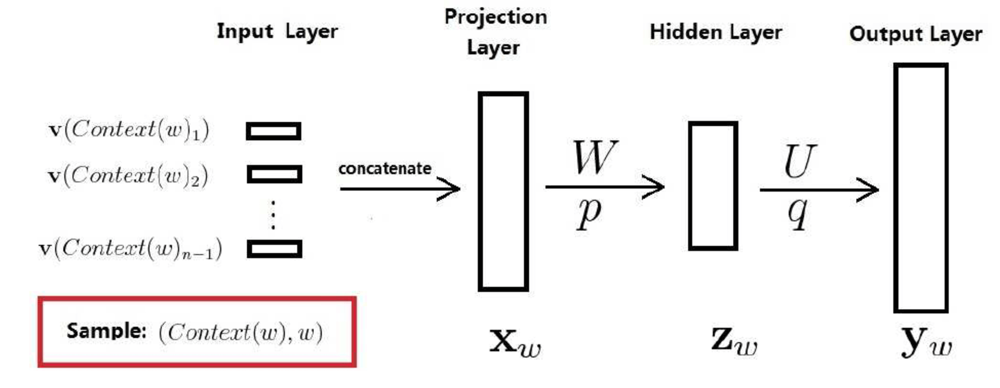
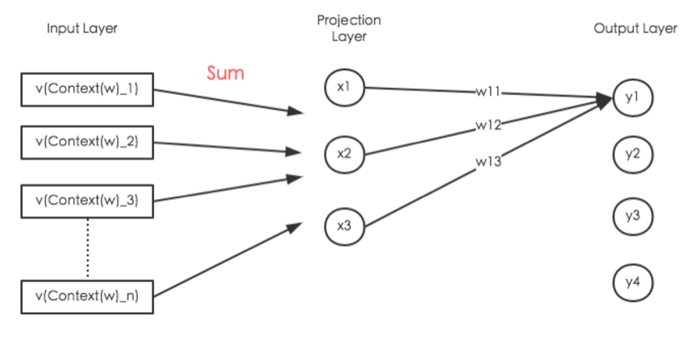
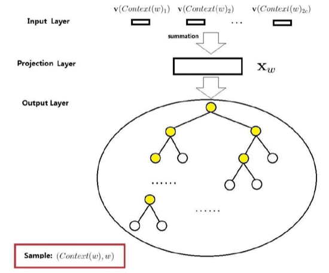
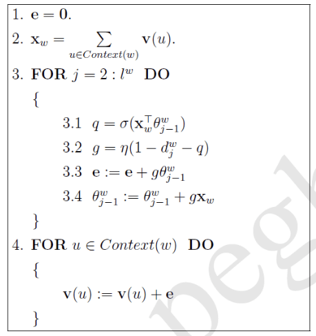
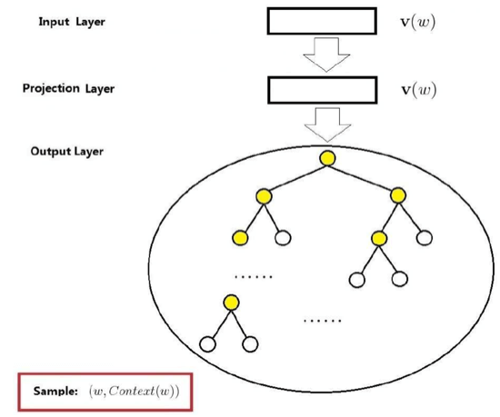
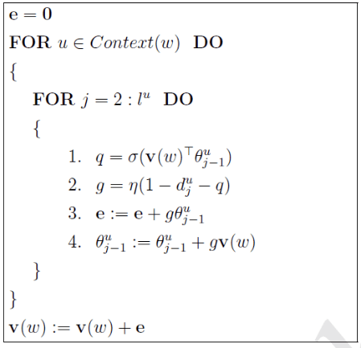
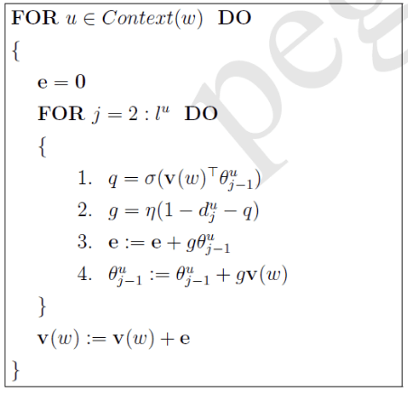
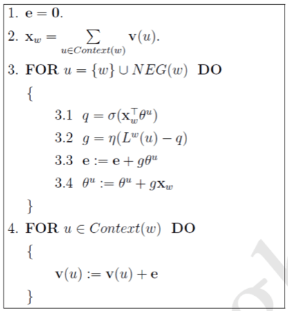
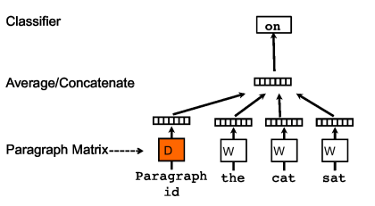
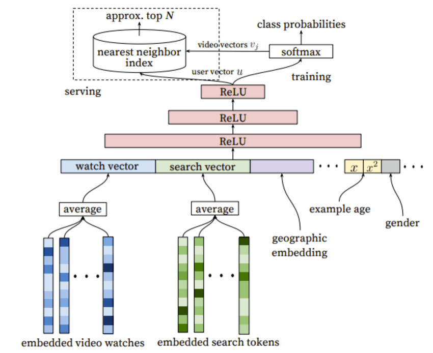

# Word2Vec-知其然知其所以然

```
Blog` `MachineLearning
```

------

> Word2vec的模型很简单，训练也很简单。但是针对为什么模型结构这么设计？为什么采用Hierarchical Softmax的框架？或是为什么采用Negative Sampling的框架？网上貌似没有一个比较好的介绍。
>
> 因此，这篇博客在介绍Word2vec原理的过程中，顺便也谈到了一些我对Word2vec模型结构的思考(在 `3【重要】Word2vec相比于神经概率语言模型的改进`)，不一定正确，欢迎互相讨论。
>
> 另外感谢peghoty大神的博客（参考资料1），对于我理解Word2vec算法起了很大的作用。本文的模型及梯度推导推导部分出自peghoty的博客。


- Word2Vec-知其然知其所以然
  - [1 介绍](https://www.zybuluo.com/Dounm/note/591752#1-介绍)
  - 2 背景知识
    - 2.1 Huffman树与Huffman编码
      - [2.1.1 Huffman树的概念](https://www.zybuluo.com/Dounm/note/591752#211-huffman树的概念)
      - [2.1.2 Huffman树的构造](https://www.zybuluo.com/Dounm/note/591752#212-huffman树的构造)
      - [2.1.3 Huffman树构造算法理解与证明](https://www.zybuluo.com/Dounm/note/591752#213-huffman树构造算法理解与证明)
      - [2.1.4 Huffman编码](https://www.zybuluo.com/Dounm/note/591752#214-huffman编码)
    - 2.2 N-gram模型
      - [2.2.1 统计语言模型](https://www.zybuluo.com/Dounm/note/591752#221-统计语言模型)
      - [2.2.2 N-gram模型](https://www.zybuluo.com/Dounm/note/591752#222-n-gram模型)
      - [2.2.3 N-gram模型的实践](https://www.zybuluo.com/Dounm/note/591752#223-n-gram模型的实践)
    - [2.3 概率模型函数化](https://www.zybuluo.com/Dounm/note/591752#23-概率模型函数化)
    - 2.4 神经概率语言模型
      - [2.4.1 词向量](https://www.zybuluo.com/Dounm/note/591752#241-词向量)
      - [2.4.2 神经概率语言模型的网络结构](https://www.zybuluo.com/Dounm/note/591752#242-神经概率语言模型的网络结构)
      - [2.4.3 神经概率语言模型的优缺点](https://www.zybuluo.com/Dounm/note/591752#243-神经概率语言模型的优缺点)
  - 3 【重要】Word2vec相比于神经概率语言模型的改进
    - [3.1 优化网络结构](https://www.zybuluo.com/Dounm/note/591752#31-优化网络结构)
    - 3.2 优化Softmax归一化
      - [3.2.1 使用Hierarchical Softmax优化](https://www.zybuluo.com/Dounm/note/591752#321-使用hierarchical-softmax优化)
      - [3.2.2 使用Negative Sampling优化](https://www.zybuluo.com/Dounm/note/591752#322-使用negative-sampling优化)
    - [3.3 总结](https://www.zybuluo.com/Dounm/note/591752#33-总结)
  - 4 基于Hierarchical Softmax的模型
    - 4.1 CBOW模型
      - [4.1.1 梯度计算](https://www.zybuluo.com/Dounm/note/591752#411-梯度计算)
      - [4.1.2 伪代码](https://www.zybuluo.com/Dounm/note/591752#412-伪代码)
    - 4.2 Skip-gram模型
      - [4.2.1 梯度计算](https://www.zybuluo.com/Dounm/note/591752#421-梯度计算)
      - [4.2.2 伪代码](https://www.zybuluo.com/Dounm/note/591752#422-伪代码)
  - 5 基于Negative Sampling的模型
    - [5.1 如何选取负样本](https://www.zybuluo.com/Dounm/note/591752#51-如何选取负样本)
    - 5.2 CBOW模型
      - [5.2.1 梯度计算](https://www.zybuluo.com/Dounm/note/591752#521-梯度计算)
      - [5.2.2 伪代码](https://www.zybuluo.com/Dounm/note/591752#522-伪代码)
    - [5.3 Skip-gram模型](https://www.zybuluo.com/Dounm/note/591752#53-skip-gram模型)
  - 6 总结
    - [6.1 残留问题](https://www.zybuluo.com/Dounm/note/591752#61-残留问题)
  - 7 X2Vec
    - [7.1 Paragraph2Vec](https://www.zybuluo.com/Dounm/note/591752#71-paragraph2vec)
    - [7.2 推荐系统中的X2Vec](https://www.zybuluo.com/Dounm/note/591752#72-推荐系统中的x2vec)
  - [7 参考资料](https://www.zybuluo.com/Dounm/note/591752#7-参考资料)


## 1 介绍

word2vec是Google于2013年推出的开源的获取词向量word2vec的工具包。它包括了一组用于word embedding的模型，这些模型通常都是用浅层（两层）神经网络训练词向量。

Word2vec的模型以大规模语料库作为输入，然后生成一个向量空间（通常为几百维）。词典中的每个词都对应了向量空间中的一个独一的向量，而且**语料库中拥有共同上下文的词映射到向量空间中的距离会更近**。

## 2 背景知识

### 2.1 Huffman树与Huffman编码

#### 2.1.1 Huffman树的概念

一些关于树的概念：

- **路径/路径长度**：一棵树上一个点到另一个节点的通路称为路径，路径上分支（边）的个数称为路径长度。路径长度通常都是针对根节点而言，因此，设根节点层数为1，则从根节点到层节点路径长度为.
- **结点的权/带权路径长度**：为树中的某个节点赋予一个值，则该值就为该节点的权。带权路径长度指的是：从根节点到该节点之间的路径长度与该节点权的乘积。
- **树的带权路径长度**：树的所有叶子节点的带权路径长度之和。
- **Huffman树（霍夫曼树/最优二叉树）**：给定n个权值作为n个叶子节点，则带权路径最小的树称为Huffman树。

#### 2.1.2 Huffman树的构造

给定个权值作为二叉树的个叶子节点，则以此构造Huffman树的算法如下所示：

1. 将看成是有棵树的森林（每棵树仅有一个节点）
2. 从森林中选择**两个根节点权值最小的树**合并，作为一棵新树的左右子树，且新树的根节点权值为其**左右子树根节点权值之和**
3. 从森林中删除被选中的两棵树，并且将新树加入森林
4. 重复2-3步，知道森林中只有一棵树为止，则该树即所求的Huffman树

注意：按照上面算法构造的Huffman树可能不只有一种构型（例如，叶子节点为1,2,3,3），但是所有的构型的Huffman树的带权路径长度都是相同的。

#### 2.1.3 Huffman树构造算法理解与证明

首先，给定叶子节点，让构造一颗二叉树（不一定是Huffman树）的话，那么唯一的算法就是：将每个节点看做一棵只有一个节点的树，然后每次找两棵树合并成一棵新的树，然后将该新树放入森林中，继续上面的步骤。

现在要构造的是『Huffman树，即最优二叉树』，那么问题在于，每一步中选择哪两颗树合并成新的树。

对于『树的带权路径长度』这个衡量标准来说，在上面所描述的构造二叉树的算法中，我们定义一个变量`sum`作为整个森林中所有树的『树的带权路径长度』之和。

我们可以将每一步看作是`sum`从0逐渐增大的过程。每次合并两棵树时，就相当于在`sum`加了一个值，该值就是被合并的两棵树的根的权值之和。到最后一步时，`sum`就是最终的Huffman树的带权路径长度。

因为算法的每一步中，我们都考虑的是树的根节点的权值，所以我们完全可以将每一步中的树都看成叶子节点，叶子节点的权值就是树根权值。这样并不会影响`sum`最终的值。

对于Huffman树而言，我们希望**让权值小的叶子节点层次更深，权值大的叶子节点层次更浅**。那么在将树看成叶子节点后，我们注意到：**在当前步中『被选中用来合并为新节点的两个节点』在『最终的二叉树』上层次必然比当前步中『未被选中的节点』的层次更深**。所以，我们只需要在当前这一步选择所有节点中权值最小的两个节点合并即可。

Huffman树构造算法的理解大概就是这样，具体的形式化证明请参见『算法导论16.3节』。

#### 2.1.4 Huffman编码

数据通信中，需要将传送的文字转换成二进制的字符串，用01的不同排列表示字符。二进制编码大致有两种方式：**等长编码**和**变长编码**。

等长编码即所有字符的编码长度相同，如果有6个字符，那么就需要3位二进制（）。由于等长编码对于所有字符的编码长度相同，因此对于一些出现频率极高的字符来说，等长编码会造成数据压缩率不高。

变长编码可以达到比等长编码好的多的压缩率，其思想就是**赋予高频词短编码，低频词长编码**。变长编码中我们只考虑『前缀编码』，即一个字符的编码不能是另一个字符编码的前缀。

因此，我们可以用字符集中的每个字符作为叶子节点生成一颗编码二叉树，为了获得传送报文的最短长度，可以将每个字符的出现频率作为字符节点的权值赋予该结点上，然后构造一棵Huffman树。利用Huffman树设计的二进制前缀编码，就被称为**Huffman编码**。

Word2vec算法也用了Huffman编码，它把训练语料中的词当成叶子节点，其在语料中出现的次数当做权值，通过构造响应的Huffman树来对每一个词进行Huffman编码。

### 2.2 N-gram模型

#### 2.2.1 统计语言模型

在自然语言处理中，统计语言模型（Statistic Language Model）是很重要的一环。简单来说，统计语言模型就是计算一个句子的概率的**概率模型**。那么什么是一个句子的概率呢？就是语料库中出现这个句子的概率。

假设表示由个词按照顺序构成的一个句子，则该句子的概率模型就是的联合概率，即

利用链式分解


其中就是**语言模型的参数**，知道这些参数，就知道了句子的出现的概率了。

问题在于**模型参数的个数太多**。假设语料库中词典的大小为，那么一维参数有个，二维参数有个，三维有个，维有个参数。如果要计算任意长度为的句子的概率，理论上就需要个参数。即使能计算出来，存储这些参数也需要很大的内存开销。

因此我们需要借助N-gram模型来简化参数。

#### 2.2.2 N-gram模型

考虑的近似计算，利用公式，有

根据大数定理，当语料库够大时


其中表示句子中从第个到第个的词构成的词串，表示词串在语料中出现的次数。

从公式 中我们看出：一个词出现的概率和它前面所有的词都相关。如果我们假设这个词只与它前面个词相关（做了阶**假设**），这样就减少了总参数的个数。

如此一来，公式就变成了如下：


因此，假设我们选取的n-gram中，那我们只需要统计1、2、3维的参数就行了，即总参数的个数变为。而且同时，对于单个参数的统计也更容易，因为统计时需要匹配的词串更短

#### 2.2.3 N-gram模型的实践

对于参数的选取，我们需要考虑到计算复杂度和模型效果两个方面。

- 计算复杂度：由于参数的个数是个，因此很明显，越大，计算复杂度越大，而且是指数级增大。
- 模型效果：理论上是越大越好，但是越大的时候，模型效果提升幅度就会越小。例如，但从3到4的效果提升可能就远比不上从2到3的效果提升。

因此，实际工作中，最多的情况是取。

此外，我们还需要考虑到**『平滑化』**的问题。因为假如词串在统计时计数为0，即，我们并不能认为，否则会导致连乘的时候，整个词串的概率都为0.

### 2.3 概率模型函数化

N-gram模型是存储下来所有可能的概率参数，然后计算时对概率进行连乘。

机器学习领域有一种较为通用的做法：**对所考虑的问题建模后，先为其构造一个目标函数进行优化，求得一组最优参数，然后用最优参数对应的模型来预测**。

因此对于N-gram模型来说，**我们不需要存储所有可能的概率参数，而是求解对问题建模后得到的目标函数的最优参数即可**（通常好的建模可以使得最优参数的个数远小于所有概率参数的个数）。

对于统计语言模型来说，我们通常构造的目标函数是『最大似然函数』。


上式的意思是：上下文为时，该词为的概率。
其中

- 是语料库(Corpus)
- 是词的上下文(Context)。对于N-gram模型来说，

实际上由于连乘可能导致概率极小，所以经常采用的是**『最大对数似然』**，即目标函数为：

将条件概率视为关于和的函数


其中是待定参数集。因此一旦对上式进行优化得到最优参数集之后，也就唯一确定。我们只需要存储最优参数集，而不需要事先计算并保存所有的概率值了。如果选取合适的方法来构造函数，可以使得中参数的个数远小于N-gram模型中参数的个数。

### 2.4 神经概率语言模型

对应2.3节，**神经概率语言模型即用『神经网络』构建『函数』**。

#### 2.4.1 词向量

首先引入一个概念『词向量』，何为词向量？即对词典中任意词，指定一个固定长度的实值向量。则即称为的词向量，是词向量的长度。

词向量有两种表现形式：

- One-hot Representation：用维度为字典长度的向量表示一个词，仅一个分量为1，其余为0。缺点是容易收到维度灾难的困扰，而且不能很好的刻画词与词之间的关系。
- Distributed Representation：每个词映射为固定长度的短向量。通过刻画两个向量之间的距离来刻画两个向量之间的相似度。

#### 2.4.2 神经概率语言模型的网络结构



其中：

- 训练样本：是语料C中的每一个词，取为其前面个词

- 投影层向量：将该训练样本的前个词的『词向量首尾相接』拼接在一起构成。长度为，即词向量长度

- 隐藏层向量

  

  

  ：

  

  

- 输出层向量

  

  

  ：维度为

  

  

  ,即词典

  

  

  中词的个数。

  

  

注意：**在对做Softmax归一化之后，的分量就表示当前词是的概率。**


对于该神经网络来说，它的参数有包括：『词向量』以及『神经网络参数』。一旦确定了这些参数，就相当于确定了『函数』的参数，也就相当于知道了参数，继而能求得整个句子的概率。

#### 2.4.3 神经概率语言模型的优缺点

相比于N-gram模型来说，神经概率语言模型有如下优点：

1. 词语与词语间的相似度可以通过词向量来体现
2. 基于词向量的模型自带『平滑化』功能，无需额外处理。因为根据公式 不可能为0。

但同样，神经概率语言模型也有缺点。主要的缺点就是**计算量太大**。各参数量级分别是：

- 投影层节点数为上下文词数量*词向量维度。上下文数量通常不超过，词向量维度在量级，
- 隐层节点数在量级，
- 输出层节点数为词典大小，在量级。

因此，对于神经概率语言模型来看，主要的计算集中在**『隐层和输出层之间的矩阵运算』**和**『输出层上的Softmax』**归一化运算。但是，考虑到语言模型对语料库中的每一个词都要进行训练，而语料库通常都有次方以上的词数，因此上面的计算是无法忍受的。

## 3 【重要】Word2vec相比于神经概率语言模型的改进

注意，前面**神经概率语言模型的目的是得到语言模型（这点和N-gram模型的目的一样），词向量只不过是次要目的（但是也可以求解出词向量）**。

但Word2vec模型主要的目的是计算出**『词向量word embedding』**，因此会导致网络结构进行一些较为奇怪的变化。通常根据什么计算出词向量呢？通常都是通过最大化，即对语言模型的概率求最大似然来得到，但这并非是固定的，具体看下面。

### 3.1 优化网络结构

前面说对于神经概率语言模型，缺点主要是计算量太大，集中在：**『隐层和输出层之间的矩阵运算』**和**『输出层上的Softmax归一化运算』**上。因此Word2vec就是针对这两点来优化神经概率语言模型的。

Word2vec的网络机构相对于神经概率语言模型简化了很多，但是正是因为模型简单，因此训练起来更加容易，就能训练更多的数据。而神经概率语言模型结构复杂，导致训练较慢，难以训练更多的数据。

首先，Word2vec选择将输入层到投影层的运算从『拼接』变成『叠加』。也就是说，投影层的节点数不再是上下文词数量*词向量维度，而就是词向量维度。

其次，针对**『隐层和输出层之间的矩阵运算』**，word2vec选择删去隐藏层。变成类似下图所示:

（Output Layer和Projection Layer之间的连线没有画完）

就网络结构而言，上图删去了Hidden Layer，而且Projection Layer也由『拼接』变成了『叠加』。同时我假设词向量维度为3维，因此Projection layer只有3个节点；词典中只有4个词，因此输出层只有4个节点，代表的就是词典中的词。

对于上图中的输出层节点而言，任意节点的计算公式如下：


注意，对于神经网络而言，我们的输入层的参数是中各个词的词向量，那么这个词向量是怎么来的呢？

其实这个词向量就是输出层和映射层之间的参数，即。对于任意输出层节点来说，它与映射层的每个节点都相连接。而映射层节点数就是词向量的维度，所以我们可以将参数是词向量维度看作是词的词向量。这样一来的话，我们训练神经网络的参数，就相当于训练了每个词的词向量，也就得到了词典中每个词的词向量。

> 我觉着这也是为什么Word2vec要把输入层到映射层的操作由『拼接』变成『叠加』的原因。2.4.2节所说的神经网络的参数包括两个：『词向量』以及『神经网络参数』。然而网络结构变成如上所述的话，**两种参数就合并为一种**，『神经网络参数』就是『词向量』，『词向量』也即是『神经网络参数』。

### 3.2 优化Softmax归一化

为了计算条件概率，我们引入Softmax来归一化：


上述式子的计算瓶颈在于分母。分母需要枚举一遍词典中所有的词，而词典中的词的数目在的量级。看起来是不多，但是要注意，我们需要对语料库中的每个词进行训练并按照公式计算，而语料库中的词的数量级通常在million甚至billion量级，这样一来的话，训练复杂度就无法接受。

因此，Word2vec提出了两种优化Softmax计算过程的方法，同样也对应着Word2vec的两种框架，即：Hieraichical Softmax和Negative Sampling。

#### 3.2.1 使用Hierarchical Softmax优化

本框架之所以叫『Hierarchical Softmax』，就是它利用了树实现了分层的Softmax，即用树形结构替代了输出层的结构。

之所以使用分层Softmax，是因为它计算起来更加的高效。如论文[[1\]](https://www.zybuluo.com/Dounm/note/591752#fn:1)中所说：

> A computationally efficient approximation of the full softmax is the hierarchical softmax.

Hierarchical softmax采用的树是二叉树。它将树上的叶子节点分配给词典里的词，而将从树根到叶子节点的路径上的每个非叶子结点都看作是二分类，路径上的二分类概率连乘的结果就是该叶子节点对应的词的概率。

一个full softmax需要一次计算所有的个词，而hierarchical softmax却只需要计算大约（即树根到该叶子节点的路径长度）个词，大大减少了计算的复杂度。

实际应用中，Hierarchical Softmax采用是Huffman树而不是其他的二叉树，这是因为Huffman树对于高频词会赋予更短的编码，使得高频词离根节点距离更近，从而使得训练速度加快。

#### 3.2.2 使用Negative Sampling优化

另一种可行的方法是。假定好的模型应该能够通过逻辑回归的方法从数据中区别出噪声。

> NCE posits that a good model should be able to differentiate data from noise by means of logistic regression.

Word2vec采用的Negative Sampling是NCE的一种简化版本，目的是为了提高训练速度以及改善所得词的质量。相比于Hierarchical Softmax，Negative Sampling不再采用Huffman树，而是采用**随机负采样**。

Negative Sampling简单理解起来的话，是这样的。
根据公式：


其中是联合构成的词向量，对应的是的词向量。

我们要最大化，就相当于最大化分子，最小化分母。因为两个向量的点积越大，约等于两个向量相似度越高（cosine相似度）。所以，我们就是尽量最大化和的相似度，尽量最小化和相似度。

即**最大化与当前词的词向量的相似度，最小化与非当前词的词向量的相似度**。

我们可以将分子的看做一个正样本，将分母的看做负样本（因为它没在训练数据中出现过）。问题在于，上面公式将词典里的所有词都看做了负样本，因此计算分母太耗时间。所以，我们使用Negative Sampling的思路，每次只从词典里随机选一些word作为当前词的负样本（称为），而不是以所有的字典里的其他词作为负样本。

> 其实在做出随机选取负样本的动作之后，我们就已经抛弃了Softmax这个函数所代表的归一化的意思了。也就代表了我们已经不再关注求解**语言模型**的问题，而只关注求解**词向量**的问题。

### 3.3 总结

总结一下上面所说的Word2vec对于经典神经网络概率语言模型的优化的话，我们发现，Word2vec大大简化了网络结构。但是同时也因为网络结构简单所带来的低计算复杂度，所以它可以在更大规模的数据集上计算出非常精确的高维词向量。

这也是值得注意的思路，我们如何权衡模型复杂度与可训练数据之间的关系。模型越复杂，可训练数据的量级越小；而模型越简单，可训练数据的量级越多。

## 4 基于Hierarchical Softmax的模型

Word2vec中的两个重要模型是：CBOW模型（Continuous Bag-of-Words Model）和Skip-gram模型（Continuous Skip-gram模型）。对于这两个模型，Word2vec给出了两套框架，分别是基于Hierarchical Softmax和Negative Sampling来设计的。本节先介绍Hierarchical Softmax框架。

### 4.1 CBOW模型

CBOW模型全名为。之所以叫是因为输入层到投影层的操作由『拼接』变成了『叠加』，对于『叠加而言』，无所谓词的顺序，所以称为词袋，模型。


上图中：

- 上下文：由前后各个词构成

- 输入层：包含个词的词向量

- 投影层：讲输入层的

  

  

  个词做『累加求和』。

  

  

- 输出层：输出层对应的是一棵Huffman树。该Huffman树以语料中出现的词为叶子节点，以各词在语料中**出现的次数当做权值**构造出来的。该树中，叶子节点总共有个（）。

对比CBOW模型结构和上面的神经概率语言模型的模型结构，区别在于：

- 输入层到投影层：CBOW是『累加』，神经概率语言是『拼接』
- 隐藏层：CBOW无隐藏层，神经概率语言有
- 输出层：CBOW是『树形结构』，神经概率语言是『线性结构』

#### 4.1.1 梯度计算

首先是如下几个符号的意思：

- ：从根节点到对应的叶子节点的路径
- ：路径上包含的节点的个数
- ：路径上对应的节点
- ：路径上的节点对应的Huffman编码，根节点不对应编码
- ：路径上的**『非叶子节点』**对应的词向量

从根节点出发到某个叶子节点的路径上，每次分支都可视为进行了一次『二分类』。默认左边（编码为0）是负类，右边（编码为1）是正类。

- 分为正类的概率：
- 分为负类的概率：

其中的即当前『非叶子结点』的对应的词向量。

所以Hierarchical Softmax的思想就是：
**对于词典中的任意词，Huffman树中必存在一条从根节点到词对应叶子节点的路径。路径上存在个分支，将每个分支看做一次二分类，每次分类就产生一个概率，讲这些概率连乘，即。**

其中


带入最大似然的公式，得


令等于如下内容：


因为要求最大似然，所以对上式采用『随机梯度上升法』。

首先对求导：

利用得


因为在的表达式中和是对称的，所以：


在对词向量进行更新时，因为表示的是中各词词向量的叠加，所以的更新也要贡献到中的每个词的词向量上去


#### 4.1.2 伪代码


注意，步骤3.3/3.4不能交换位置，应该等更新后再更新。

### 4.2 Skip-gram模型

Skip-gram模型是已知当前词，对其上下文中的词进行预测。

网络结构：

- 输入层：当前样本的中心词的词向量
- 投影层：其实没什么作用
- 输出层：类似CBOW模型，也是一颗Huffman树

#### 4.2.1 梯度计算


基于前面的思想


因此带入最大似然函数，得


令等于如下内容：


计算对的梯度：

利用得


同样由于参数与参数是对称的，所以


所以梯度更新公式如下：


#### 4.2.2 伪代码

skip-gram的伪代码如下：


但是在Word2vec的源码中，并非等中所有词都处理完后才更新为v(w)，而是每处理完中的一个词就更新一次。


## 5 基于Negative Sampling的模型

### 5.1 如何选取负样本

选取负样本需要按照一定的概率分布，Word2vec的作者们测试发现**最佳的分布是次幂的**。

啥是？来自于（即一元模型），它认为语料库中所有的词出现的概率都是互相独立的。所以就是按照在语料库中随机选择，因此高频词被选中的概率大，低频词被选中的概率小，这也很符合逻辑。

概率分布公式如下：


### 5.2 CBOW模型

CBOW模型中，我们是已知词的上下文，需要预测。

设我们已经选好了一个关于的负样本子集，并且定义了对于词典中的任意词，都有


对于一个给定的正样本，我们希望最大化

其中


#### 5.2.1 梯度计算

所以，


为什么要最大化？因为表示的是上下文为时，预测中心词为的概率；而表示的是上下文为时，预测中心词为的概率（即一个二分类）。因此最大化即相当于增大正样本的概率，同时降低负样本的概率，而这就是我们所期望的。

> 上面这段话仅仅是方便理解的作用。其实此处的代表的不再是，而是。即不再求条件概率分布，而是联合概率分布，这正是NCE的思想。
>
> 如果要形式化的证明为什么选择作为求最大似然的对象，请阅读参考资料4。

所以对于给定语料库来说，整体的优化目标即为最大化。则函数为：


令等于如下式子：


采用随机梯度上升法，计算梯度

利用得


根据对称性：


所以，对于词向量的更新为：


#### 5.2.2 伪代码



### 5.3 Skip-gram模型

思路类似，略。详细推理见参考资料1。

## 6 总结

在Word2Vec的训练过程中，每个word vectors都被要求为相邻上下文中的word的出现作预测，所以尽管我们是随机初始化Word vectors，但是这些vectors最终仍然能通过上面的预测行为捕获到word之间的语义关系，从而训练到较好的word vectors。

正如同公式所暗示的，Word2Vec尽量让具有相同上下文的word的向量相似，从而获得较好的vector representation的相似性。这种相似性有时候是线性的，例如的结果会与相似，即Word2vec可以学习到词与词之间语义上的联系。

另外，由于Word2Vec采用了非常多的方法简化网络结构，简化训练流程，导致Word2Vec可以很轻易的训练超大的训练集。据参考资料3说，一个优化后的单机实现版的Word2Vec算法可以在一天时间内训练100 bililion words。

### 6.1 残留问题

- 为什么求最大似然就可以得到较好的词向量？
- 为什么所有的二分类采用的都是逻辑回归，都是Sigmoid函数？

## 7 X2Vec

### 7.1 Paragraph2Vec

和Word2vec一样，像Sentence/Paragrah/Document都可以表示为向量，这些统称为Paragraph2vec（之所以取Paragraph是表示可长可短，长可为一个Doc，短可为一个Sentence，原理都是一样的）。

传统的求Paragraph2Vec的方法有很多，例如将一个句子/短语的所有的word的向量加起来，就可以当做句子/短语向量。而对于文档级别的来说，最经典常见的定长向量就是Bag-of-Words了。Bag-of-Words即以词典大小作为文档向量维度，然后以word出现次数作为对应元素的值。

Bag-of-Words有两个局限性：其一是丢弃了word与word之间的顺序，另一个就是忽略了word的语义关系。因此Google后来提出了Paragraph2Vec的方法（见参考资料6），大致解决了这些问题。

Paragraph2Vec的模型中，这个Paragraph Vectors的被训练出来的主要目的是用来预测paragraph中的word。其结构图如下：


相比于word2vec，训练过程中新增了paragraph id，即给每个paragraph一个唯一的id。Paragraph id也会被映射为一个向量，即paragraph vector。paragraph vector与word vector的维数虽一样，但是来自于两个不同的向量空间，之间并不能执行计算相似度之类的操作。在之后的计算里，paragraph vector和word vector累加或者连接起来，作为输出层softmax的输入，如上图所示。

训练的方法就是随机梯度下降和BP算法。随机梯度下降的每一步，我们都是从一个随机的paragraph中采样出一个定长的Context，然后计算梯度并更新。对于相同的paragraph来说，paragraph vector是共享的。这相当于每次在预测单词的概率时，都利用了整个句子的语义。

注意在预测阶段，对于一个新的paragraph，先给它一个paragraph id，然后利用原先就已经训练好的word vectors和神经网络参数，**使用梯度下降不断的训练待预测句子**。收敛之后，就得到了待预测句子的paragraph vector。

### 7.2 推荐系统中的X2Vec

Wrod2Vec的思想启发了很多人，并且在推荐系统也大有作为。在Youtube于2016公布的论文（参考8）中谈到了在他们的视频推荐系统中是如何使用Word2Vec的思想的。

Youtube的推荐系统架构分为两部分：*Candidate Generation*和*ranking*。*Candidate Generation*就是从巨量的视频库里面挑选出挑选出几百部与user最相关的视频，然后*ranking*在对这几百部进行排序，挑选出最合适的推荐给用户。

其中，*Candidate Generation*他们以前用的是矩阵分解，现在用的是如下图所示的架构。


如上图右上角所示，他们将推荐看做成了一个超大规模的多分类。分类的问题就是在给定用户和用户上下文的情况下，在视频库的百万视频中对一个观看记录进行分类，每个视频看做一类。

> We pose recommendation as extreme multiclass classification where the prediction problem becomes accurately classifing a specific video watch at time among millions of videos (classes) from a corpus based on a user and context .


公式如上面所示，其中代表了二元组的高维向量表示，代表了候选视频的向量表示。


其实上面的公式就是求了个Softmax，所以同理，也是因为Softmax分母计算复杂度太高，所以Youtube也采用了Negative Sampling和Hierarchical Softmax两种优化方法。

除此之外，就训练数据的标签Label而言，虽然Youtube有赞或踩的选项，但是他们却没有用这些作为标签，而是把用户看完一个视频当做一个正样本。这是因为显式的赞或踩不够多，而隐式的看完视频的历史记录够多，所以使用隐式反馈就可以加强一些长尾的推荐效果。

上图左上角代表的是预测。每次预测的时候，输入user vector 和video vectors ，然后选取top 最近邻作为输出。

上图最下方的输入层代表的是各种各样的X2Vec。watch vector是以用户历史观看的视频的video vector做平均得到的。而search vector则是对用户的历史搜索记录做处理，先将query处理成unigram或bigram，然后再向量化，最后取平均得到的。再右侧的就是一些其他的特征了。

这些乱七八糟的拼接起来，经过好几层全连接的RELU层，到最顶层就得到了user vector ，然后带入Softmax的公式训练，在通过梯度下降和BP算法最终将更新传递回输入层。

## 7 参考资料

1. [word2vec中的数学原理详解](http://www.cnblogs.com/peghoty/p/3857839.html)
2. Mikolov T, Chen K, Corrado G, et al. Efficient estimation of word representations in vector space[J]. arXiv preprint arXiv:1301.3781, 2013.
3. Mikolov T, Sutskever I, Chen K, et al. Distributed representations of words and phrases and their compositionality[C]//Advances in neural information processing systems. 2013: 3111-3119.
4. Goldberg Y, Levy O. word2vec Explained: deriving Mikolov et al.'s negative-sampling word-embedding method[J]. arXiv preprint arXiv:1402.3722, 2014.
5. [word2vec: negative sampling (in layman term)?](http://stackoverflow.com/questions/27860652/word2vec-negative-sampling-in-layman-term/27864657#27864657)
6. Le Q V, Mikolov T. Distributed Representations of Sentences and Documents[C]//ICML. 2014, 14: 1188-1196.
7. [语义分析的一些方法(二)](http://www.flickering.cn/ads/2015/02/语义分析的一些方法二/)
8. Covington P, Adams J, Sargin E. Deep neural networks for youtube recommendations[C]//Proceedings of the 10th ACM Conference on Recommender Systems. ACM, 2016: 191-198.