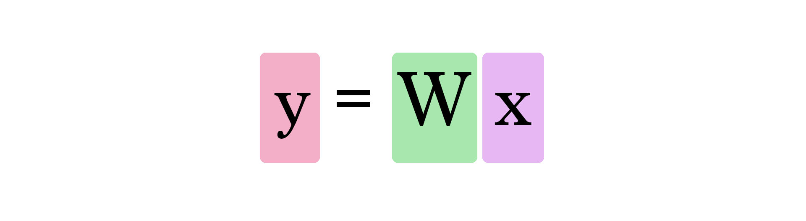
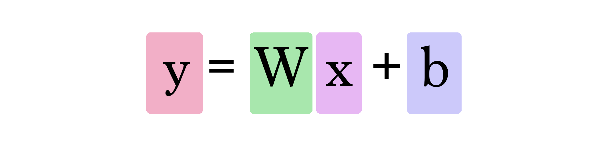

# 可视化和交互式的神经网络基础指南

**更新**：第2部分现已上线：[基本神经网络数学的可视化和交互式外观](https://jalammar.github.io/feedforward-neural-networks-visual-interactive/)

## 动机

我不是机器学习专家。我是一名经过培训的软件工程师，与AI互动很少。我一直想深入研究机器学习，但从未真正找到我的“入门”。这就是为什么当Google在2015年11月开源TensorFlow时，我感到非常兴奋，并且知道现在该开始学习了。听起来并不那么戏剧性，但对我来说，实际上感觉就像普罗米修斯从机器学习的奥林匹斯山向人类下火。在我脑海中浮现的想法是，当Google研究人员发布他们的Map Reduce论文时，大大加快了整个大数据和诸如Hadoop之类的技术领域。这次不是纸面文件，而是经过多年的发展，他们在内部使用的实际软件。

因此，我开始学习有关该主题基础知识的知识，并发现需要对该领域没有经验的人使用更温和的资源。这是我的尝试。

## 从这里开始

让我们从一个简单的例子开始。假设您正在帮助想买房子的朋友。她被引以40万元的价格买下了2000平方英尺（185米）的房屋。这是一个好价钱吗？

没有参考系很难说出来。因此，您问问在相同社区购买房屋的朋友，最后得到三个数据点：

| 面积（平方呎）（x） | 价格（y） |
| :------------------ | :-------- |
| 2,104               | 399,900   |
| 1,600               | 329,900   |
| 2,400               | 369,000   |

就个人而言，我的第一个直觉是获得每平方英尺的平均价格。即每平方英尺180美元。

欢迎使用您的第一个神经网络！现在还不是Siri级别，但是现在您知道了基本的构建块。它看起来像这样：

这样的图向您展示了网络的结构及其如何计算预测。计算从左侧的输入节点开始。输入值向右流动。它乘以权重，结果成为我们的输出。

将2,000平方英尺乘以180，就可以得到360,000美元。这就是这个级别的全部内容。计算预测是简单的乘法。但是在此之前，我们需要考虑乘以的权重。在这里，我们从平均值开始，稍后我们将研究更好的算法，这些算法可以随着获得更多输入和更复杂模型而扩展。找到重量是我们的“训练”阶段。因此，只要您听到有人“训练”神经网络，就意味着找到我们用来计算预测的权重。

这是一种预测形式。这是一个简单的预测模型，它接受输入，进行计算并给出输出（由于输出可以是连续值，因此我们所拥有的技术名称将是“回归模型”）

让我们可视化此过程（为简单起见，让我们将价格单位从1美元更改为1000美元。现在我们的权重是0.180而不是180）：

## 更努力更好更快更强

我们能否做得比根据我们的数据点的平均值估算价格更好？咱们试试吧。让我们首先定义在这种情况下变得更好的含义。如果我们将模型应用于我们拥有的三个数据点，那么它将对您的工作有多好？

相当多的黄色。黄色不好。黄色是错误。我们希望尽可能地缩小黄色。

| 面积（x） | 价格（$ 1000）（y_） | 预测（y） | y_ - y    | （y_ - y）² |
| :-------- | :------------------- | :-------- | :-------- | :---------- |
| 2,104     | 399.9                | 379       | 21        | 449         |
| 1,600     | 329.9                | 288       | 42        | 1756        |
| 2,400     | 369                  | 432       | -63       | 3969        |
|           |                      | 平均：    | **2,058** |             |

在这里，我们可以看到实际价格值，预测价格值以及它们之间的差异。然后，我们需要对这些差异进行平均，因此我们有一个数字可以告诉我们该预测模型中有多少错误。问题是，第三行的值是-63。如果要使用预测值和价格之间的差作为我们的误差度量标准，则必须处理此负值。这就是为什么我们引入额外的一列来显示误差平方，从而摆脱负值的原因之一。

现在，这是我们做得更好的定义–更好的模型就是错误更少的模型。误差被测量为数据集中每个点的误差的平均值。对于每个点，通过实际值和预测值之间的差（以2的幂为乘方）来测量[误差](http://mste.illinois.edu/patel/amar430/meansquare.html)。这称为[均方误差](http://mste.illinois.edu/patel/amar430/meansquare.html)。用它作为训练模型的指南，使其成为**损失函数**（也称为**成本函数**）。

现在，我们为更好的模型定义了量尺，让我们尝试更多的权重值并将其与我们的平均选择进行比较：

我们不能再通过改变权重来对模型进行很大的改进。但是，如果添加偏见，我们可以找到改善模型的值。

现在，我们已经将此b值添加到了行公式中，因此行可以更好地近似我们的值。在这种情况下，我们称其为“偏见”。这使我们的神经网络看起来像这样：

我们可以通过说一个具有一个输入和一个输出的神经网络（*扰流器警告：*没有隐藏层）来概括它，如下所示：

在此图中，W和b是我们在训练过程中找到的值。X是我们插入公式中的输入（在我们的示例中，以平方英尺为单位）。Y是预测价格。

现在，使用以下公式计算预测：

因此，我们的当前模型通过在以下公式中将房屋面积插入x来计算预测值：

## 训练你的龙

您如何训练我们的玩具神经网络呢？通过调整砝码和斜度拨盘最小化损失功能。您能否获得低于799的错误值？

05001,0001,5002,0002,5000100200300400

| 错误 | **799** |       |
| ---- | ------- | ----- |
|      |         |       |
| 重量 |         | 0.100 |
| 偏压 |         | 150.0 |

0.100150.0

## 自动化

恭喜您手动训练了您的第一个神经网络！让我们看看如何自动执行此培训过程。下面是另一个具有类似自动驾驶仪功能的示例。这些是GD Step按钮。他们使用一种称为“梯度下降”的算法来尝试朝着使损失函数最小化的正确权重和偏差值迈进。

05001,0001,5002,0002,5000100200300400

05010015020020,00040,00060,00080,000100,000120,000ErrorError Log

0.00.10.20.30.40100200300400WeightBiasWeight vs. Bias vs. Error

|                |             |       |
| -------------- | ----------- | ----- |
| 错误           | **134,972** |       |
| **走开，哥们** |             |       |
| 重量           |             | 0.000 |
| 偏压           |             | 0.0   |

0.0000.0

这两个新的图形可帮助您在弄乱模型的参数（权重和偏差）时跟踪误差值。跟踪错误很重要，因为培训过程就是尽可能减少此错误。

梯度下降如何知道下一步应该在哪里？结石。您会看到，知道我们要最小化的函数（我们的损失函数，即所有数据点的（y_-y）²的平均值），并且知道其中的当前输入（当前的权重和偏差），损失函数告诉我们将W和b移向哪个方向以最小化误差。

在Coursera的[机器学习](https://www.coursera.org/learn/machine-learning)课程的第一讲中，了解有关梯度下降的更多信息，以及如何使用它来计算新的权重和偏差。

## 然后有两个

房子的大小是唯一要花费多少成本的变量吗？显然还有许多其他因素。让我们添加另一个变量，看看如何调整神经网络。

假设您的朋友做了更多的研究，并找到了更多的数据点。她还找出每所房子有多少间浴室：

| 面积（平方呎）（x1） | 浴室（x2） | 价格（y） |
| :------------------- | :--------- | :-------- |
| 2,104                | 3          | 399,900   |
| 1,600                | 3          | 329,900   |
| 2,400                | 3          | 369,000   |
| 1,416                | 2          | 232,000   |
| 3,000                | 4          | 539,900   |
| 1,985                | 4          | 299,900   |
| 1,534                | 3          | 314,900   |
| 1,427                | 3          | 198,999   |
| 1,380                | 3          | 212,000   |
| 1,494                | 3          | 242,500   |

我们的带有两个变量的神经网络如下所示：

现在，我们必须找到两个权重（每个输入一个权重）和一个偏差来创建新模型。

计算Y看起来像这样：

但是我们如何找到w1和w2？这比我们只需要担心一个体重值时要棘手。拥有额外的浴室在多大程度上改变了我们预测房屋价值的方式？

努力寻找正确的权重和偏见。您将从这里开始，了解随着输入数量的增加，我们开始变得越来越复杂。我们开始失去创建简单2D形状的能力，这些能力使我们一目了然地可视化模型。取而代之的是，我们必须主要依靠调整模型参数时误差值的变化方式。

05010015020025030020,00040,00060,00080,000100,000

|         |             |       |
| ------- | ----------- | ----- |
| 错误    | **108,268** |       |
|         |             |       |
| 重量＃1 |             | 0.000 |
| 重量＃2 |             | 0.000 |
| 偏压    |             | 0.000 |

0.0000.0000.0

我们值得信赖的梯度下降再次为您提供帮助。在帮助我们找到合适的权重和偏见方面，它仍然很有价值。

## 特征

既然您已经看到了具有一个和两个功能的神经网络，那么您就可以弄清楚如何添加其他功能并使用它们来计算您的预测。权重的数量将继续增长，并且当我们添加每个功能时，我们必须对梯度下降的实现进行调整，以便它可以更新与新功能关联的新权重。

在这里需要注意的重要一点是，我们不会盲目地向网络提供有关示例的所有信息。对于提供模型的功能，我们必须有所选择。功能选择/处理是一门完整的学科，具有自己的最佳实践和注意事项。如果要查看检查数据集以选择哪些要素来提供预测模型的过程的示例，请查看 [《泰坦尼克号之旅》](https://www.kaggle.com/omarelgabry/titanic/a-journey-through-titanic)。在这本笔记本上，[Omar EL Gabry](https://twitter.com/Omar_ElGabry)讲述了他解决Kaggle泰坦尼克号挑战的过程。Kaggle提供了泰坦尼克号旅客的舱单，包括姓名，性别，年龄，机舱以及该人是否幸存下来。面临的挑战是建立一个模型，该模型可以根据一个人的其他信息预测一个人是否存活。

## 分类

让我们继续调整我们的示例。假设您的朋友给您一份房屋清单。这次，她标记了自己认为面积和浴室数量合适的浴室：

| 面积（平方呎）（x1） | 浴室（x2） | 标签（y） |
| :------------------- | :--------- | :-------- |
| 2,104                | 3          | 好        |
| 1,600                | 3          | 好        |
| 2,400                | 3          | 好        |
| 1,416                | 2          | 坏        |
| 3,000                | 4          | 坏        |
| 1,985                | 4          | 好        |
| 1,534                | 3          | 坏        |
| 1,427                | 3          | 好        |
| 1,380                | 3          | 好        |
| 1,494                | 3          | 好        |

她需要您使用它来创建一个模型，以根据房屋的大小和浴室数量来预测是否需要房屋。您将在上方使用此列表构建模型，然后她将使用该模型对许多其他房屋进行分类。此过程的另一个变化是，她还有另外10张被标记的房屋清单，但她一直在远离您。训练完模型后，该其他列表将用于评估您的模型-从而确保您的模型掌握了使她真正喜欢房屋特征的条件。

到目前为止，我们一直在研究的神经网络都在进行“回归”-它们计算并输出“连续”值（输出可以是4、100.6或2143.342343）。然而，实际上，神经网络更常用于“分类”类型的问题。在这些问题中，神经网络的输出必须来自一组离散值（或“类”），例如“好”或“差”。在实践中，这是如何实现的，我们将拥有一个模型，该模型将说75％的房子是“好”，而不是仅仅吐出“好”或“坏”。

 我在[上](https://jalammar.github.io/Supercharging-android-apps-using-tensorflow/)一篇[文章中](https://jalammar.github.io/Supercharging-android-apps-using-tensorflow/)讨论的TensorFlow应用程序是实践中分类模型的一个很好的例子。

我们可以将已经看到的网络转换为分类网络的一种方法是使它输出两个值-每个类一个（我们的类现在是“好”和“坏”）。然后，我们通过称为“ [softmax](https://rasbt.github.io/mlxtend/user_guide/classifier/SoftmaxRegression/) ” 的操作传递这些值。softmax的输出是每个类别的概率。例如，假设网络的该层输出2表示“好”，4表示“坏”，如果我们将[2，4]馈送到softmax，它将返回[0.11，0.88]作为输出。转换后的值表示网络有88％的人确定输入的值“不好”，而我们的朋友不会喜欢那所房子。

Softmax接受一个数组并输出相同长度的数组。注意，它的输出都是正数，总和为1 –在我们输出概率值时很有用。还要注意，即使4是2的两倍，它的概率不仅是2的两倍，而且是2的八倍。这是一个有用的属性，它会夸大输出差异，从而改善我们的训练过程。

|                       | 输出               |
| :-------------------- | :----------------- |
| softmax（[1]）        | [1]                |
| softmax（[1，1]）     | [0.5，0.5]         |
| softmax（[0，1]）     | [0.26，0.73]       |
| softmax（[2，4]）     | [0.11，0.88]       |
| softmax（[5，10]）    | [0.007，0.993]     |
| softmax（[-1，0，1]） | [0.09，0.24，0.66] |
| softmax（[1，2，4]）  | [0.04，0.11，0.84] |

如您在最后两行中所见，softmax扩展到任意数量的输入。因此，现在，如果我们的朋友添加了第三个标签（例如，“很好，但我必须在一个房间内进行空气过滤”），softmax就会适应这种变化。

当您更改功能数量（x1，x2，x3等）（可以是面积，浴室数量，价格，与学校/工作地点的距离等）并改变数量时，花点时间来探索网络的形状类别（y1，y2，y3等）（可能“太贵”，“超值”，“如果我airbnb很好”，“太小”）：

| 功能（x）： |      |
| ----------- | ---- |
| 类别（y）： |      |

X1X2W1,1W2,1W1,2W2,2Y1Y2+b1+b2softmax

您可以在我随本帖子创建的[笔记本中](https://github.com/jalammar/simpleTensorFlowClassificationExample/blob/master/Basic Classification Example with TensorFlow.ipynb)看到一个示例，该示例如何使用TensorFlow创建和训练该网络。

## 真正的动机

如果您到现在为止，我必须向您透露我写这篇文章的另一个动机。这篇文章旨在作为TensorFlow教程的更入门的介绍。如果您现在开始通过[MNIST For ML Beginners](https://www.tensorflow.org/versions/r0.10/tutorials/mnist/beginners/index.html)工作，并遇到以下图表：

 我写这篇文章是为了在TensorFlow入门教程中为没有机器学习经验的人准备这张图。这就是为什么我模拟了它的视觉风格。

我希望您会有所准备，并且您对该系统及其工作原理有所了解。如果要开始修改代码，请随时从入门[教程中学习，](https://www.tensorflow.org/versions/r0.10/tutorials/mnist/beginners/index.html)并教一个神经网络如何检测手写数字。

您还应该继续学习我们这里讨论的概念的理论和数学基础。现在要问的好问题包括：

- 还有哪些其他成本函数？哪个对哪个应用程序更好？
- 使用梯度下降法实际计算新权重的算法是什么？
- 在您已经了解的领域中，机器学习有哪些应用程序？通过将此法术与法术书中的其他法术混合使用，您可以运用什么新的魔法？

很棒的学习资源包括：

- 吴安德（[Andrew Ng）的](https://twitter.com/AndrewYNg) Coursera [机器学习](https://www.coursera.org/learn/machine-learning)课程。这是我开始的那个。从回归开始，然后转向分类和神经网络。
- Coursera的[机器学习神经网络，](https://www.coursera.org/learn/neural-networks)作者：[Geoffrey Hinton](https://en.wikipedia.org/wiki/Geoffrey_Hinton)。更专注于神经网络及其视觉应用。
- 斯坦福大学的[CS231n：用于视觉识别](https://www.youtube.com/watch?v=g-PvXUjD6qg&list=PLlJy-eBtNFt6EuMxFYRiNRS07MCWN5UIA)的[卷积神经网络](https://www.youtube.com/watch?v=g-PvXUjD6qg&list=PLlJy-eBtNFt6EuMxFYRiNRS07MCWN5UIA)（[作者：](https://www.youtube.com/watch?v=g-PvXUjD6qg&list=PLlJy-eBtNFt6EuMxFYRiNRS07MCWN5UIA)[Andrej Karpathy）](https://twitter.com/karpathy)。使用深度神经网络在视觉识别中看到一些高级概念和最新技术很有趣。
- 该[神经网络动物园](http://www.asimovinstitute.org/neural-network-zoo/)是一个很好的资源，以了解更多有关不同类型的神经网络。