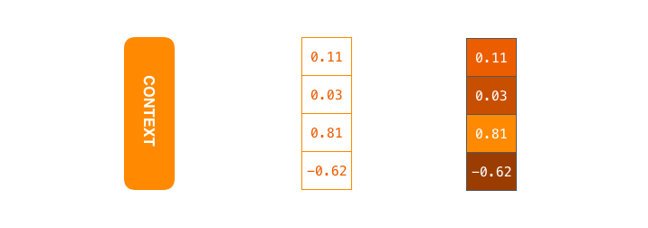
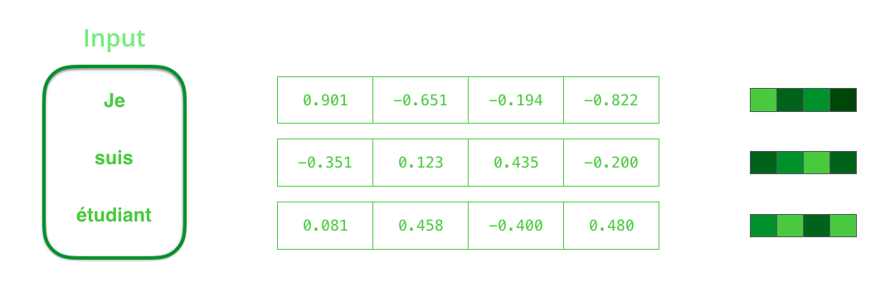

# 可视化神经机器翻译模型（注意Seq2seq模型的力学）

**5月25日更新：**新图形（RNN动画，单词嵌入图），颜色编码，在最后的注意示例中进行了详细说明。

**注意：**以下动画是视频。触摸或悬停在它们上面（如果您使用鼠标）以获取播放控件，以便在需要时可以暂停。

序列到序列模型是深度学习模型，已经在机器翻译，文本摘要和图像字幕等任务中取得了很多成功。Google Translate 于2016年底开始在生产中[使用](https://blog.google/products/translate/found-translation-more-accurate-fluent-sentences-google-translate/)这种模型。在两个开创性论文（[Sutskever等，2014](https://papers.nips.cc/paper/5346-sequence-to-sequence-learning-with-neural-networks.pdf)；[Cho等，2014](http://emnlp2014.org/papers/pdf/EMNLP2014179.pdf)）中对这些模型进行了解释。

但是，我发现，要充分理解模型以实现模型，就需要阐明一系列相互叠加的概念。我认为，如果以视觉方式表达这些想法中的一堆将更容易理解。这就是我在这篇文章中要做的。您需要对深度学习有一些先前的了解，才能阅读这篇文章。我希望它可以成为阅读上面提到的论文（以及后面的文章中链接的关注论文）的有用伴侣。

序列到序列模型是一种采用一系列项目（单词，字母，图像特征等）并输出另一个项目序列的模型。经过训练的模型将像这样工作：

<video src="./imgs/seq2seq_1.mp4" width="100%" height="auto" loop="" autoplay="" controls="" style="box-sizing: border-box; display: inline-block; vertical-align: baseline; margin: 0px; padding: 0px; border: 0px; font: inherit;"></video>
在神经机器翻译中，序列是一系列单词，一个接一个地处理。输出同样是一系列单词：

<video src="./imgs/seq2seq_2.mp4" width="100%" height="auto" loop="" autoplay="" controls="" style="box-sizing: border-box; display: inline-block; vertical-align: baseline; margin: 0px; padding: 0px; border: 0px; font: inherit;"></video>
## 在引擎盖下看

在内部，该模型由一个编码器和一个解码器组成。

的编码器处理在输入序列中的每个项目，它编译它捕捉到一个载体中的信息（称为上下文）。处理完整个输入序列后，编码器将上下文发送 给解码器，解码器开始逐项生成输出序列。

<video src="./imgs/seq2seq_3.mp4" width="100%" height="auto" loop="" autoplay="" controls="" style="box-sizing: border-box; display: inline-block; vertical-align: baseline; margin: 0px; padding: 0px; border: 0px; font: inherit;"></video>
在机器翻译的情况下也是如此。

<video src="./imgs/seq2seq_4.mp4" width="100%" height="auto" loop="" autoplay="" controls="" style="box-sizing: border-box; display: inline-block; vertical-align: baseline; margin: 0px; padding: 0px; border: 0px; font: inherit;"></video>
所述上下文 是在机器翻译的情况下的矢量（数字的阵列，基本上）。该编码器和解码器 往往都反复发作的神经网络（一定要看看路易斯·塞拉诺的[一个友好的介绍递归神经网络](https://www.youtube.com/watch?v=UNmqTiOnRfg)的前奏，以RNNs）。

 所述上下文 是浮筒的向量。在本文的稍后部分，我们将通过将明亮的颜色分配给具有较高值的单元格来使颜色可视化。

设置 模型时，可以设置上下文向量的大小。它基本上是编码器 RNN 中隐藏单元的数量。这些可视化显示了一个大小为4的向量，但在现实世界中，上下文向量的大小将为256、512或1024。

根据设计，RNN在每个时间步长都需要两个输入：一个输入（对于编码器，是输入语句中的一个单词）和一个隐藏状态。但是，该词需要用向量表示。为了将单词转换为向量，我们转向称为“ [单词嵌入](https://machinelearningmastery.com/what-are-word-embeddings/) ”算法的方法类别。这些将单词转换为向量空间，这些空间捕获了单词的很多含义/语义信息（例如，[国王-男人+女人=女王](http://p.migdal.pl/2017/01/06/king-man-woman-queen-why.html)）。

 我们需要在处理输入词之前将其转换为向量。该转换是使用[单词嵌入](https://en.wikipedia.org/wiki/Word_embedding)算法完成的。我们可以使用[预训练的嵌入，](http://ahogrammer.com/2017/01/20/the-list-of-pretrained-word-embeddings/)也可以在数据集上训练我们自己的嵌入。通常会嵌入大小为200或300的向量，为简单起见，我们将显示大小为4的向量。

现在我们已经介绍了主要的向量/张量，让我们回顾一下RNN的机制并建立一种可视语言来描述这些模型：

<video src="./imgs/seq2seq_5.mp4" width="100%" height="auto" loop="" autoplay="" controls="" style="box-sizing: border-box; display: inline-block; vertical-align: baseline; margin: 0px; padding: 0px; border: 0px; font: inherit;"></video>
RNN的下一个步骤采用第二个输入矢量和隐藏状态＃1创建该时间步骤的输出。在文章的后面，我们将使用这样的动画来描述神经机器翻译模型中的向量。

在以下可视化中，编码器或解码器的每个脉冲 都是RNN处理其输入并为该时间步生成一个输出。由于编码器和解码器 都是RNN，因此每当RNN中的一个步骤进行某些处理时，它都会 根据其输入和已看到的先前输入来更新其隐藏状态。

让我们来看看隐藏状态 的编码器。注意最后一个隐藏状态 实际上是 我们传递给解码器的上下文。

<video src="./imgs/seq2seq_6.mp4" width="100%" height="auto" loop="" autoplay="" controls="" style="box-sizing: border-box; display: inline-block; vertical-align: baseline; margin: 0px; padding: 0px; border: 0px; font: inherit;"></video>
该解码器 也维护一个隐藏的状态 ，它从一个时间步骤到下一个通行证。我们只是没有在图形中可视化它，因为我们目前正在关注模型的主要部分。

现在让我们看看另一种可视化序列到序列模型的方法。此动画将使您更容易理解描述这些模型的静态图形。这称为“展开”视图，在这里我们没有显示一个解码器，而是为每个时间步骤显示了一个副本。这样，我们可以查看每个时间步骤的输入和输出。

<video src="./imgs/seq2seq_7.mp4" width="100%" height="auto" loop="" autoplay="" controls="" style="box-sizing: border-box; display: inline-block; vertical-align: baseline; margin: 0px; padding: 0px; border: 0px; font: inherit;"></video>
## 让我们现在注意

该背景 矢量原来是为这几种模式的瓶颈。这使得模型处理长句子变得颇具挑战性。[Bahdanau等人（2014年）](https://arxiv.org/abs/1409.0473)和[Luong等人（2015年](https://arxiv.org/abs/1508.04025)）提出了一种解决方案。这些论文介绍并完善了一种称为“注意”的技术，该技术极大地提高了机器翻译系统的质量。注意使模型可以根据需要集中于输入序列的相关部分。

在时间步骤7，注意力机制使解码器 在生成英语翻译之前将注意力集中在单词“étudiant”（法语的“ student”）上。这种放大输入序列相关部分信号的能力使注意力模型比没有注意力的模型产生更好的结果。

让我们继续在这种高抽象水平上研究注意力模型。注意模型在两个主要方面与经典序列到序列模型不同：

首先，编码器将更多数据传递给解码器。相反，通过编码阶段的最后一个隐藏的状态时，编码器通过*所有*的隐藏状态 的解码器：

<video src="./imgs/seq2seq_8.mp4" width="100%" height="auto" loop="" autoplay="" controls="" style="box-sizing: border-box; display: inline-block; vertical-align: baseline; margin: 0px; padding: 0px; border: 0px; font: inherit;"></video>
其次，注意解码器 在产生其输出之前要执行额外的步骤。为了专注于与该解码时间步骤有关的输入部分，解码器 执行以下操作：

1. 查看 它接收到的一组编码器隐藏状态 –每个编码器隐藏状态 与输入句子中的某个单词最相关
2. 给每个隐藏的州 打分（让我们暂时忽略现在的评分方式）
3. 将每个隐藏状态 乘以其softmaxed分数，从而放大 具有高分数的隐藏状态，并淹没 具有低分数的隐藏状态

<video src="./imgs/seq2seq_9.mp4" width="100%" height="auto" loop="" autoplay="" controls="" style="box-sizing: border-box; display: inline-block; vertical-align: baseline; margin: 0px; padding: 0px; border: 0px; font: inherit;"></video>

计分练习是在解码器端的每个时间步完成的。

现在，让我们在以下可视化中将整个过程整合在一起，并研究注意力过程的工作方式：

1. 注意解码器RNN接受<END>令牌的嵌入，并具有初始解码器隐藏状态。
2. RNN处理其输入，生成输出和新的隐藏状态向量（h 4）。输出被丢弃。
3. 注意步骤：我们使用编码器隐藏状态和h 4向量来计算此时间步骤的上下文向量（C 4）。
4. 我们将h 4和C 4连接成一个向量。
5. 我们将此向量通过前馈神经网络（与模型联合训练）。
6. 在输出前馈神经网络的表示该时间步长的输出字。
7. 重复下一个步骤

<video src="./imgs/seq2seq_10.mp4" width="100%" height="auto" loop="" autoplay="" controls="" style="box-sizing: border-box; display: inline-block; vertical-align: baseline; margin: 0px; padding: 0px; border: 0px; font: inherit;"></video>

这是查看在每个解码步骤中我们要注意的输入句子的哪一部分的另一种方式：

<video src="./imgs/seq2seq_11.mp4" width="100%" height="auto" loop="" autoplay="" controls="" style="box-sizing: border-box; display: inline-block; vertical-align: baseline; margin: 0px; padding: 0px; border: 0px; font: inherit;"></video>
请注意，该模型不仅仅是将输出中的第一个单词与输入中的第一个单词对齐。它实际上是从培训阶段中学到的，如何在该语言对中对齐单词（在我们的示例中为法语和英语）。上面列出的注意论文提供了一个示例，说明这种机制有多精确：

 

您可以看到输出“欧洲经济区”时模型如何正确注意。在法语中，与英语相比，这些单词的顺序是相反的（“européenneéconomiquezone”）。句子中的每个其他单词的顺序相似。

如果您准备学习该实现，请务必查看TensorFlow的《[神经机器翻译（seq2seq）教程》](https://github.com/tensorflow/nmt)。

------

