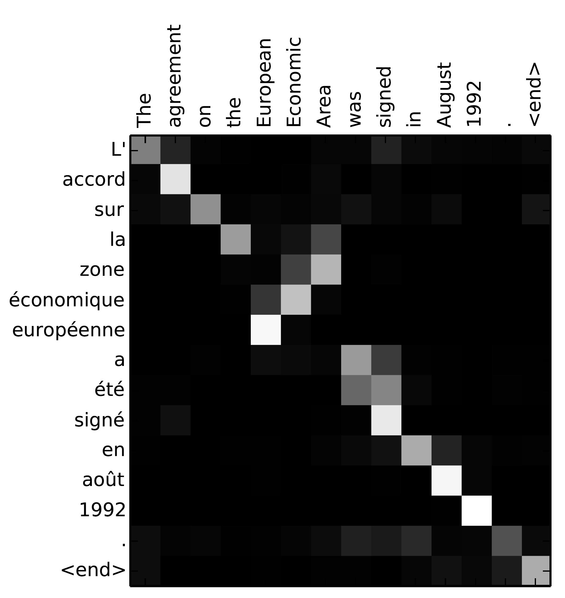

# 神经机器翻译（seq2seq）教程

*作者：Thang Luong，Eugene Brevdo，Rui Zhao（[Google Research Blogpost](https://research.googleblog.com/2017/07/building-your-own-neural-machine.html)，[Github](https://github.com/tensorflow/nmt)）*

*此版本的教程需要[TensorFlow Nightly](https://github.com/tensorflow/tensorflow/#installation)。要使用稳定的TensorFlow版本，请考虑其他分支，例如 [tf-1.4](https://github.com/tensorflow/nmt/tree/tf-1.4)。*

*如果您使用此代码库进行研究，请引用 [此内容](https://github.com/tensorflow/nmt#bibtex)。*

- [介绍](https://github.com/tensorflow/nmt#introduction)
- 基本的
  - [神经机器翻译的背景](https://github.com/tensorflow/nmt#background-on-neural-machine-translation)
  - [安装教程](https://github.com/tensorflow/nmt#installing-the-tutorial)
  - 培训– *如何建立我们的第一个NMT系统*
    - [嵌入](https://github.com/tensorflow/nmt#embedding)
    - [编码器](https://github.com/tensorflow/nmt#encoder)
    - [解码器](https://github.com/tensorflow/nmt#decoder)
    - [失利](https://github.com/tensorflow/nmt#loss)
    - [梯度计算与优化](https://github.com/tensorflow/nmt#gradient-computation--optimization)
  - [动手– *让我们训练NMT模型*](https://github.com/tensorflow/nmt#hands-on--lets-train-an-nmt-model)
  - [推论– *如何生成翻译*](https://github.com/tensorflow/nmt#inference--how-to-generate-translations)
- 中间
  - [注意机制的背景](https://github.com/tensorflow/nmt#background-on-the-attention-mechanism)
  - [注意包装API](https://github.com/tensorflow/nmt#attention-wrapper-api)
  - [动手– *建立基于注意力的NMT模型*](https://github.com/tensorflow/nmt#hands-on--building-an-attention-based-nmt-model)
- 提示与技巧
  - [建立训练图，评估图和推理图](https://github.com/tensorflow/nmt#building-training-eval-and-inference-graphs)
  - [数据输入管道](https://github.com/tensorflow/nmt#data-input-pipeline)
  - 更好的NMT模型的其他细节
    - [双向RNN](https://github.com/tensorflow/nmt#bidirectional-rnns)
    - [光束搜索](https://github.com/tensorflow/nmt#beam-search)
    - [超参数](https://github.com/tensorflow/nmt#hyperparameters)
    - [多GPU训练](https://github.com/tensorflow/nmt#multi-gpu-training)
- 基准测试
  - [IWSLT英语-越南语](https://github.com/tensorflow/nmt#iwslt-english-vietnamese)
  - [WMT德语-英语](https://github.com/tensorflow/nmt#wmt-german-english)
  - [WMT英语-德语— *完全比较*](https://github.com/tensorflow/nmt#wmt-english-german--full-comparison)
  - [标准HParams](https://github.com/tensorflow/nmt#standard-hparams)
- [其他资源](https://github.com/tensorflow/nmt#other-resources)
- [致谢](https://github.com/tensorflow/nmt#acknowledgment)
- [参考文献](https://github.com/tensorflow/nmt#references)
- [BibTex](https://github.com/tensorflow/nmt#bibtex)

## 介绍

序列到序列（seq2seq）模型（[Sutskever等，2014](https://papers.nips.cc/paper/5346-sequence-to-sequence-learning-with-neural-networks.pdf)； [Cho等，2014](http://emnlp2014.org/papers/pdf/EMNLP2014179.pdf)）在机器翻译，语音识别和文本摘要等各种任务中都取得了巨大的成功。本教程为读者提供了对seq2seq模型的全面理解，并展示了如何从头开始构建具有竞争力的seq2seq模型。我们专注于神经机器翻译（NMT）的任务，这是seq2seq模型的第一个测试平台，获得了 [巨大的成功](https://research.googleblog.com/2016/09/a-neural-network-for-machine.html)。随附的代码轻巧，高质量，可立即投入生产，并结合了最新的研究思路。我们通过以下方式实现此目标：

1. 使用最新的解码器/注意力包装器 [API](https://github.com/tensorflow/tensorflow/tree/master/tensorflow/contrib/seq2seq/python/ops)，TensorFlow 1.2数据迭代器
2. 结合我们在构建递归模型和seq2seq模型方面的专业知识
3. 提供有关建立最佳NMT模型和复制[Google的NMT（GNMT）系统的](https://research.google.com/pubs/pub45610.html)提示和技巧 。

我们认为，提供人们可以轻松复制的基准非常重要。结果，我们提供了完整的实验结果，并在以下公开可用的数据集上对我们的模型进行了预训练：

1. *小规模*：由[IWSLT评估活动](https://sites.google.com/site/iwsltevaluation2015/)提供的TED演讲的英语-越南语平行语料库（13.3万个句子对） 。
2. *大型*：[WMT评估活动](http://www.statmt.org/wmt16/translation-task.html)提供的德语-英语平行语料库（450万个句子对）。

我们首先建立有关NMT seq2seq模型的一些基础知识，并说明如何构建和训练普通NMT模型。第二部分将详细介绍如何构建具有注意机制的竞争性NMT模型。然后，我们讨论构建最佳NMT模型（速度和翻译质量）的技巧和窍门，例如TensorFlow最佳实践（分批处理，存储），双向RNN，波束搜索以及使用GNMT注意扩展到多个GPU。

## 基础

### 神经机器翻译的背景

过去，传统的基于短语的翻译系统通过将源句子分解成多个块然后逐个短语地翻译来执行其任务。这导致翻译输出出现歧义，并且与我们人类的翻译方式完全不同。我们阅读了整个原始句子，了解了其含义，然后进行了翻译。神经机器翻译（NMT）模仿了这一点！

[](https://github.com/tensorflow/nmt/blob/master/nmt/g3doc/img/encdec.jpg)
图1. **编码器-解码器体系结构** – NMT通用方法的示例。编码器将源句子转换为“含义”向量，该向量通过*解码器*传递以产生翻译。

具体来说，NMT系统首先使用*编码器*读取源句子， 以构建 [“思想”向量](https://www.theguardian.com/science/2015/may/21/google-a-step-closer-to-developing-machines-with-human-like-intelligence)，即表示句子含义的数字序列；一个*解码器*，那么，处理句子矢量以发射转换，如图1所示这通常被称为*编码器-解码器架构*。通过这种方式，NMT以传统的基于短语的方法解决了本地翻译问题：它可以捕获语言的*长期依赖关系*，例如性别协议；语法结构；等等，并产生更流畅的翻译，如 [Google Neural Machine Translation系统所示](https://research.googleblog.com/2016/09/a-neural-network-for-machine.html)。

NMT模型的确切体系结构有所不同。顺序数据的自然选择是大多数NMT模型使用的递归神经网络（RNN）。通常，RNN用于编码器和解码器。但是，RNN模型在以下方面有所不同：（a）*方向性* –单向或双向；（b）*深度* –单层或多层；（c）*类型* -通常是普通RNN，长短期记忆（LSTM）或门控循环单元（GRU）。有兴趣的读者可以在此[博客文章](http://colah.github.io/posts/2015-08-Understanding-LSTMs/)上找到有关RNN和LSTM的更多信息。

在本教程中，我们以单向且使用LSTM作为递归单元的*深层多层RNN*作为示例。我们在图2中显示了这样一个模型的示例。在此示例中，我们构建了一个模型来将源语句“我是学生”翻译成目标语句“ Je suisétudiant”。从较高的角度来看，NMT模型由两个递归神经网络组成：*编码器* RNN仅消耗输入的源单词而没有做出任何预测；*解码器*，另一方面，同时预测下一话处理目标句子。

有关更多信息，我们请读者参考[Luong（2016）](https://github.com/lmthang/thesis)。

[](https://github.com/tensorflow/nmt/blob/master/nmt/g3doc/img/seq2seq.jpg)
图2. **神经机器翻译** –通过将源语句“我是学生”翻译成目标语句“ Je suisétudiant”而提出的深度循环架构示例。此处，“ <s>”表示解码过程的开始，而“ </ s>”表示解码器停止。

### 安装教程

要安装本教程，您需要在系统上安装TensorFlow。本教程需要TensorFlow Nightly。要安装TensorFlow，请按照[此处](https://www.tensorflow.org/install/)的[安装说明进行操作](https://www.tensorflow.org/install/)。

一旦安装了TensorFlow，您可以通过运行以下命令下载本教程的源代码：

```
git clone https://github.com/tensorflow/nmt/
```

### 培训–如何建立我们的第一个NMT系统

让我们首先深入了解构建带有具体代码段的NMT模型的核心，通过它我们将更详细地解释图2。我们将数据准备和完整代码推迟到以后。这部分引用文件 [**model.py**](https://github.com/tensorflow/nmt/blob/master/nmt/model.py)。

在底层，编码器和解码器RNN接收以下输入：首先是源语句，然后是边界标记“ <s>”和目标语句，边界标记“ <s>”指示从编码模式到解码模式的转换。为了进行*培训*，我们将为系统提供以下张量，这些张量为时间主要格式，并包含单词索引：

- **encoder_inputs** [max_encoder_time，batch_size]：源输入字。
- **decoder_inputs** [max_decoder_time，batch_size]：目标输入字。
- **decoder_outputs** [max_decoder_time，batch_size]：目标输出字，这些是解码器输入，向左移动了一个时间步，并在右侧附加了一个句子结尾标记。

为了提高效率，我们一次训练多个句子（batch_size）。测试略有不同，因此我们将在后面讨论。

#### 嵌入

给定单词的分类性质，该模型必须首先查找源和目标嵌入，以检索相应的单词表示形式。为了使该*嵌入层*起作用，首先为每种语言选择一个词汇表。通常，选择词汇量V，并且仅将最频繁的V字视为唯一。所有其他单词都将转换为“未知”令牌，并且所有单词都具有相同的嵌入。嵌入权重（每种语言一组）通常在训练期间学习。

```python
# Embedding
embedding_encoder = variable_scope.get_variable(
    "embedding_encoder", [src_vocab_size, embedding_size], ...)
# Look up embedding:
#   encoder_inputs: [max_time, batch_size]
#   encoder_emb_inp: [max_time, batch_size, embedding_size]
encoder_emb_inp = embedding_ops.embedding_lookup(
    embedding_encoder, encoder_inputs)
```

同样，我们可以构建*embedding_decoder*和*coder_emb_inp*。请注意，可以选择使用诸如word2vec或Glove向量之类的预训练词表示来初始化嵌入权重。通常，如果有大量训练数据，我们可以从头开始学习这些嵌入。

#### 编码器

检索到词嵌入后，会将词嵌入作为输入馈入主网络，该主网络由两个多层RNN组成-源语言的编码器和目标语言的解码器。原则上，这两个RNN可以共享相同的权重；但是，在实践中，我们经常使用两个不同的RNN参数（在拟合大型训练数据集时，此类模型会做得更好）。该 *编码器* RNN使用零个向量为出发状态，是建立如下：

```python
# Build RNN cell
encoder_cell = tf.nn.rnn_cell.BasicLSTMCell(num_units)

# Run Dynamic RNN
#   encoder_outputs: [max_time, batch_size, num_units]
#   encoder_state: [batch_size, num_units]
encoder_outputs, encoder_state = tf.nn.dynamic_rnn(
    encoder_cell, encoder_emb_inp,
    sequence_length=source_sequence_length, time_major=True)
```

请注意，句子有不同的长度以避免浪费计算，我们通过*source_sequence_length*告诉 *dynamic_rnn*确切的源句子长度 。由于我们的输入是时间专业的，因此我们设置 *time_major = True*。在这里，我们仅构建一个单层*LSTMcoder_cell*。我们将在后面的部分中描述如何构建多层LSTM，添加辍学以及如何使用注意力。

#### 解码器

该*解码器*还需要能够访问源信息，和一个简单的方法来实现这一目标是与编码器，最后隐藏状态初始化它*encoder_state*。在图2中，我们将源单词“ student”的隐藏状态传递给解码器端。

```python
# Build RNN cell
decoder_cell = tf.nn.rnn_cell.BasicLSTMCell(num_units)
# Helper
helper = tf.contrib.seq2seq.TrainingHelper(
    decoder_emb_inp, decoder_lengths, time_major=True)
# Decoder
decoder = tf.contrib.seq2seq.BasicDecoder(
    decoder_cell, helper, encoder_state,
    output_layer=projection_layer)
# Dynamic decoding
outputs, _ = tf.contrib.seq2seq.dynamic_decode(decoder, ...)
logits = outputs.rnn_output
```

这里，该代码的核心部分是*BasicDecoder*对象，*解码器*，其接收*decoder_cell*（类似于encoder_cell），一个*辅助*，和先前 *encoder_state*作为输入。通过分离出解码器和助手，我们可以重用的代码库不同，例如，*TrainingHelper*可以与取代 *GreedyEmbeddingHelper*做贪心解码。在[helper.py中](https://github.com/tensorflow/tensorflow/blob/master/tensorflow/contrib/seq2seq/python/ops/helper.py)查看更多 [信息](https://github.com/tensorflow/tensorflow/blob/master/tensorflow/contrib/seq2seq/python/ops/helper.py)。

最后，我们没有提到*projection_layer*，它是一个密集矩阵，用于将顶部隐藏状态转换为维V的logit向量。我们在图2的顶部说明了此过程。

```python
projection_layer = layers_core.Dense(
    tgt_vocab_size, use_bias=False)
```

#### 损失

鉴于*logits*以上，我们现在已经准备好来计算我们的培训损失：

```python
crossent = tf.nn.sparse_softmax_cross_entropy_with_logits(
    labels=decoder_outputs, logits=logits)
train_loss = (tf.reduce_sum(crossent * target_weights) /
    batch_size)
```

在这里，*target_weights*是一个零一矩阵，其大小与*解码器_输出*相同 。它将目标序列长度之外的填充位置屏蔽为0。

***重要说明***：值得指出的是，我们将损失除以 *batch_size*，因此我们的超参数对于batch_size是“不变的”。有些人将损失除以（ *batch_size* * *num_time_steps*），从而淡化了短句上的错误。更巧妙的是，我们的超参数（应用于前一种方法）不能用于后一种方法。例如，如果两种方法都使用SGD且学习值为1.0，则后一种方法实际上使用的学习率要小得多（1 / *num_time_steps）*。

#### 梯度计算与优化

现在，我们定义了NMT模型的正向传递。计算反向传播过程仅需几行代码：

```python
# Calculate and clip gradients
params = tf.trainable_variables()
gradients = tf.gradients(train_loss, params)
clipped_gradients, _ = tf.clip_by_global_norm(
    gradients, max_gradient_norm)
```

训练RNN的重要步骤之一是梯度裁剪。在这里，我们遵循全球规范。最大值*max_gradient_norm*通常设置为5或1之类的值。最后一步是选择优化器。Adam优化器是常见的选择。我们还选择学习率。的值*learning_rate* 罐通常是在0.0001至0.001范围内 并且可以设置为随着训练的进行而减少。

```python
# Optimization
optimizer = tf.train.AdamOptimizer(learning_rate)
update_step = optimizer.apply_gradients(
    zip(clipped_gradients, params))
```

在我们自己的实验中，我们使用标准的SGD（tf.train.GradientDescentOptimizer）并降低了学习率计划，从而获得了更好的性能。请参阅[基准](https://github.com/tensorflow/nmt#benchmarks)。

### 动手–让我们训练NMT模型

让我们训练我们的第一个NMT模型，将越南语翻译成英语！我们代码的入口点是 [**nmt.py**](https://github.com/tensorflow/nmt/blob/master/nmt/nmt.py)。

在本练习中，我们将使用*TED演讲*的*小型并行语料库*（13.3万个培训示例）。我们在此处使用的所有数据都可以在以下[网址](https://nlp.stanford.edu/projects/nmt/)找到：[https](https://nlp.stanford.edu/projects/nmt/)： [//nlp.stanford.edu/projects/nmt/](https://nlp.stanford.edu/projects/nmt/)。我们将使用tst2012作为我们的dev数据集，并使用tst2013作为我们的测试数据集。

运行以下命令以下载用于训练NMT模型的数据：
`nmt/scripts/download_iwslt15.sh /tmp/nmt_data`

运行以下命令以开始训练：

```bash
mkdir /tmp/nmt_model
python -m nmt.nmt \
    --src=vi --tgt=en \
    --vocab_prefix=/tmp/nmt_data/vocab  \
    --train_prefix=/tmp/nmt_data/train \
    --dev_prefix=/tmp/nmt_data/tst2012  \
    --test_prefix=/tmp/nmt_data/tst2013 \
    --out_dir=/tmp/nmt_model \
    --num_train_steps=12000 \
    --steps_per_stats=100 \
    --num_layers=2 \
    --num_units=128 \
    --dropout=0.2 \
    --metrics=bleu
```

上面的命令训练了一个2层LSTM seq2seq模型，该模型具有128个暗点的隐藏单元和12个历元的嵌入。我们使用落差值为0.2（保持概率为0.8）。如果没有错误，我们将在训练时看到与以下类似的日志，且其困惑度值不断降低。

```
# First evaluation, global step 0
  eval dev: perplexity 17193.66
  eval test: perplexity 17193.27
# Start epoch 0, step 0, lr 1, Tue Apr 25 23:17:41 2017
  sample train data:
    src_reverse: </s> </s> Điều đó , dĩ nhiên , là câu chuyện trích ra từ học thuyết của Karl Marx .
    ref: That , of course , was the <unk> distilled from the theories of Karl Marx . </s> </s> </s>
  epoch 0 step 100 lr 1 step-time 0.89s wps 5.78K ppl 1568.62 bleu 0.00
  epoch 0 step 200 lr 1 step-time 0.94s wps 5.91K ppl 524.11 bleu 0.00
  epoch 0 step 300 lr 1 step-time 0.96s wps 5.80K ppl 340.05 bleu 0.00
  epoch 0 step 400 lr 1 step-time 1.02s wps 6.06K ppl 277.61 bleu 0.00
  epoch 0 step 500 lr 1 step-time 0.95s wps 5.89K ppl 205.85 bleu 0.00
```

有关更多详细信息，请参见[**train.py**](https://github.com/tensorflow/nmt/blob/master/nmt/train.py)。

我们可以在训练期间启动Tensorboard来查看模型的摘要：

```
tensorboard --port 22222 --logdir /tmp/nmt_model/
```

只需更改以下内容，就可以训练英语和越南语的反方向：
`--src=en --tgt=vi`

### 推论–如何生成翻译

在训练NMT模型时（以及训练模型之后），您可以获得以前看不见的源句子的翻译。此过程称为推断。训练和推理（*测试*）之间有明显的区别：在推理时，我们只能访问源语句，即*encoder_inputs*。有许多执行解码的方法。解码方法包括贪婪，采样和波束搜索解码。在这里，我们将讨论贪婪解码策略。

这个想法很简单，我们在图3中进行说明：

1. 我们仍然以与训练期间相同的方式对源语句进行编码，以获取*encoder_state*，并且使用该*encoder_state*初始化解码器。
2. 解码器一接收到开始符号“ <s>”（在我们的代码中称为*tgt_sos_id*），便开始解码（翻译）过程。
3. 对于解码器端的每个时间步，我们将RNN的输出视为一组logit。我们选择最可能出现的单词，即与最大logit值关联的id作为发出的单词（这是“贪婪”行为）。例如在图3中，单词“ moi”在第一解码步骤中具有最高的翻译概率。然后，我们将该单词作为下一个时间步的输入。
4. 该过程一直进行到句子结束标记“ </ s>”作为输出符号产生（在我们的代码中称为*tgt_eos_id*）。

[](https://github.com/tensorflow/nmt/blob/master/nmt/g3doc/img/greedy_dec.jpg)
图3. **贪婪解码** –受过训练的NMT模型如何使用贪婪搜索为源句“ Je suisétudiant”产生翻译的示例。

步骤3使推理与训练有所不同。推理不总是使用正确的目标词作为输入，而是使用模型预测的词。这是实现贪婪解码的代码。它与训练解码器非常相似。

```python
# Helper
helper = tf.contrib.seq2seq.GreedyEmbeddingHelper(
    embedding_decoder,
    tf.fill([batch_size], tgt_sos_id), tgt_eos_id)

# Decoder
decoder = tf.contrib.seq2seq.BasicDecoder(
    decoder_cell, helper, encoder_state,
    output_layer=projection_layer)
# Dynamic decoding
outputs, _ = tf.contrib.seq2seq.dynamic_decode(
    decoder, maximum_iterations=maximum_iterations)
translations = outputs.sample_id
```

在这里，我们使用*GreedyEmbeddingHelper*而不是*TrainingHelper*。由于我们事先不知道目标序列的长度，因此我们使用*maximum_iterations*限制翻译长度。一种试探法是将源语句长度最多解码两倍。

```python
maximum_iterations = tf.round(tf.reduce_max(source_sequence_length) * 2)
```

训练好模型后，我们现在可以创建一个推理文件并翻译一些句子：

```bash
cat > /tmp/my_infer_file.vi
# (copy and paste some sentences from /tmp/nmt_data/tst2013.vi)

python -m nmt.nmt \
    --out_dir=/tmp/nmt_model \
    --inference_input_file=/tmp/my_infer_file.vi \
    --inference_output_file=/tmp/nmt_model/output_infer

cat /tmp/nmt_model/output_infer # To view the inference as output
```

注意，只要存在训练检查点，也可以在仍在训练模型的同时运行以上命令。有关更多详细信息，请参见[**inference.py**](https://github.com/tensorflow/nmt/blob/master/nmt/inference.py)。

## 中间

通过最基本的seq2seq模型后，让我们更高级！要构建最先进的神经机器翻译系统，我们将需要更多的“秘诀”：*注意力机制*，该*机制*最初由[Bahdanau等人（2015年）提出](https://arxiv.org/abs/1409.0473)，然后由[Luong等人（2015年）提出](https://arxiv.org/abs/1508.04025)，其他。注意机制的关键思想是通过在翻译时对相关的源内容进行“关注”，从而在目标和源之间建立直接的捷径连接。注意机制的一个很好的副产品是在源句子和目标句子之间易于查看的对齐矩阵（如图4所示）。

[](https://github.com/tensorflow/nmt/blob/master/nmt/g3doc/img/attention_vis.jpg)
图4. **注意可视化** –源语句和目标语句之间对齐的示例。图像取自（Bahdanau et al。，2015）。

请记住，在香草seq2seq模型中，我们在开始解码过程时将最后一个源状态从编码器传递到解码器。这适用于中短句子；但是，对于长句子，单个固定大小的隐藏状态成为信息瓶颈。注意机制不是丢弃源RNN中计算的所有隐藏状态，而是提供一种方法，允许解码器窥视它们（将它们作为源信息的动态内存进行处理）。这样做，注意力机制改善了较长句子的翻译。如今，注意力机制已成为事实上的标准，并已成功应用于许多其他任务（包括图像标题生成，语音识别和文本摘要）。

### 注意机制的背景

现在，我们描述（Luong et al。，2015）中提出的注意力机制的实例，该机制已在多个最新系统中使用，包括开源工具包（如[OpenNMT）](http://opennmt.net/about/)和TF seq2seq API。教程。我们还将提供与注意机制其他变体的连接。

[](https://github.com/tensorflow/nmt/blob/master/nmt/g3doc/img/attention_mechanism.jpg)
图5. **注意力机制** –基于注意力的NMT系统的示例，如（Luong等，2015）所述。我们将详细介绍注意力计算的第一步。为了清楚起见，我们没有在图（2）中显示嵌入层和投影层。

如图5所示，注意力计算发生在每个解码器时间步长。它包括以下阶段：

1. 将当前目标隐藏状态与所有源状态进行比较，以得出 *注意力权重*（可以如图4所示）。
2. 基于注意力权重，我们将*上下文向量*计算为源状态的加权平均值。
3. 将上下文向量与当前目标隐藏状态组合以产生最终的*关注向量*
4. 注意力向量作为输入馈送到下一个时间步（*输入馈给*）。前三个步骤可以通过以下等式概括：

[](https://github.com/tensorflow/nmt/blob/master/nmt/g3doc/img/attention_equation_0.jpg)

在这里，该函数`score`用于将目标隐藏状态$$ h_t $$与每个源隐藏状态$$ \ overline {h} _s $$进行比较，并将结果归一化为产生的注意力权重（在源位置的分布）。评分功能有多种选择；流行的计分功能包括等式中给出的乘法和加法形式。（4）。计算完成后，注意力向量$$ a_t $$用于得出softmax logit和损失。这类似于香草seq2seq模型顶层的目标隐藏状态。该函数 `f`还可以采用其他形式。

[](https://github.com/tensorflow/nmt/blob/master/nmt/g3doc/img/attention_equation_1.jpg)

关注机制的各种实现中可以找到 [attention_wrapper.py](https://github.com/tensorflow/tensorflow/blob/master/tensorflow/contrib/seq2seq/python/ops/attention_wrapper.py)。

***注意机制中重要的是什么？***

正如以上等式所暗示的，有许多不同的注意力变体。这些变体取决于评分函数和注意力函数的形式，以及是否使用先前的状态$$ h_ {t-1} $$代替评分函数中的$$ h_t $$（最初在（Bahdanau等人，2015年）。根据经验，我们发现只有某些选择很重要。首先，需要注意的基本形式，即目标与来源之间的直接联系。其次，重要的是将注意力向量提供给下一个时间步，以使网络了解过去的注意力决策，如（Luong等人，2015）所示。最后，评分功能的选择通常会导致不同的性能。在[基准测试结果](https://github.com/tensorflow/nmt#benchmarks) 部分中查看更多信息。

### 注意包装API

在实现 [AttentionWrapper时](https://github.com/tensorflow/tensorflow/blob/master/tensorflow/contrib/seq2seq/python/ops/attention_wrapper.py)，我们从[（Weston等人，2015）的](https://arxiv.org/abs/1410.3916)*存储网络*工作中 借鉴了一些术语。本教程中介绍的注意力机制不是只读存储器，而是*只读*存储器。具体来说，将引用源隐藏状态集（或其转换后的版本，例如Luong评分风格的$$ W \ overline {h} _s $$或Bahdanau评分风格的$$ W_2 \ overline {h} _s $$）以作为*“记忆”*。在每个时间步，我们都将当前目标隐藏状态用作*“查询”*决定要读取存储器的哪一部分。通常，查询需要与对应于各个内存插槽的键进行比较。在注意力机制的上述演示中，我们碰巧使用了源隐藏状态集（或它们的转换版本，例如Bahdanau评分方式的$$ W_1h_t $$）作为“关键字”。可以从这种内存网络术语中获得启发，以引起其他形式的关注！

多亏了注意包装器，注意扩展我们的原始seq2seq代码是微不足道的。这部分是参考文件[**tention_model.py**](https://github.com/tensorflow/nmt/blob/master/nmt/attention_model.py)

首先，我们需要定义一种注意机制，例如（Luong等，2015）：

```python
# attention_states: [batch_size, max_time, num_units]
attention_states = tf.transpose(encoder_outputs, [1, 0, 2])

# Create an attention mechanism
attention_mechanism = tf.contrib.seq2seq.LuongAttention(
    num_units, attention_states,
    memory_sequence_length=source_sequence_length)
```

在上一个“ [编码器”](https://github.com/tensorflow/nmt#encoder)部分中，*encoder_outputs*是顶层所有源隐藏状态的集合，其形状为*[max_time，batch_size，num_units]*（因为我们使用*dynamic_rnn*并将*time_major*设置为 *True*以提高效率）。对于注意力机制，我们需要确保传入的“内存”是批处理主要的，因此我们需要转置 *tention_states*。我们将*source_sequence_length*传递给注意力机制，以确保正确地对注意力权重进行了归一化处理（仅在非填充位置上）。

定义了注意力机制后，我们使用*AttentionWrapper*包装解码单元：

```python
decoder_cell = tf.contrib.seq2seq.AttentionWrapper(
    decoder_cell, attention_mechanism,
    attention_layer_size=num_units)
```

其余代码与“部分[解码器”](https://github.com/tensorflow/nmt#decoder)中的代码几乎相同！

### 动手–建立基于注意力的NMT模型

要启用的关注，我们需要使用的一个`luong`，`scaled_luong`，`bahdanau` 或`normed_bahdanau`作为价值`attention`标志的训练中。该标志指定我们将要使用的注意力机制。此外，我们需要为注意力模型创建一个新目录，因此我们不会重用之前训练有素的基本NMT模型。

运行以下命令以开始训练：

```
mkdir /tmp/nmt_attention_model

python -m nmt.nmt \
    --attention=scaled_luong \
    --src=vi --tgt=en \
    --vocab_prefix=/tmp/nmt_data/vocab  \
    --train_prefix=/tmp/nmt_data/train \
    --dev_prefix=/tmp/nmt_data/tst2012  \
    --test_prefix=/tmp/nmt_data/tst2013 \
    --out_dir=/tmp/nmt_attention_model \
    --num_train_steps=12000 \
    --steps_per_stats=100 \
    --num_layers=2 \
    --num_units=128 \
    --dropout=0.2 \
    --metrics=bleu
```

训练后，我们可以对新的out_dir使用相同的推理命令进行推理：

```
python -m nmt.nmt \
    --out_dir=/tmp/nmt_attention_model \
    --inference_input_file=/tmp/my_infer_file.vi \
    --inference_output_file=/tmp/nmt_attention_model/output_infer
```

## 提示与技巧

### 建立训练图，评估图和推理图

在TensorFlow中构建机器学习模型时，通常最好构建三个单独的图：

- 训练图，其中：
  - 来自一组文件/外部输入的批处理，存储桶以及可能的子采样输入数据。
  - 包括前进和后退操作。
  - 构造优化器，并添加训练操作。
- 评估图，其中：
  - 批处理和存储桶来自一组文件/外部输入的输入数据。
  - 包括培训前瞻性操作，以及未用于培训的其他评估操作。
- 推理图，其中：
  - 可能不批量输入数据。
  - 不对样本进行子采样或存储桶输入数据。
  - 从占位符读取输入数据（可以通过*feed_dict*或从C ++ TensorFlow服务二进制文件将数据直接馈送到图形）。
  - 包括模型前向操作的子集，可能还包括用于存储session.run调用之间的状态的其他特殊输入/输出。

构建单独的图有几个好处：

- 推理图通常与其他两个图有很大不同，因此单独构建它是有意义的。
- 评估图变得更简单，因为它不再具有所有其他反向支持操作。
- 可以为每个图形分别实现数据馈送。
- 变量重用要简单得多。例如，在评估图中，无需仅仅使用Training模型已经创建了这些变量，就可以*使用reuse = True*重新打开变量作用域。因此，相同的代码可以重复使用，而无需到处散布*reuse =*参数。
- 在分布式培训中，让单独的工人进行培训，评估和推理是很平常的事。无论如何，这些都需要建立自己的图。因此，以这种方式构建系统将为您进行分布式培训做好准备。

复杂性的主要来源成为如何在单个机器设置中的三个图之间共享变量。通过为每个图形使用单独的会话来解决此问题。训练会话会定期保存检查点，评估会话和推断会话会从检查点恢复参数。下面的示例显示了两种方法之间的主要区别。

**之前：单个图中的三个模型并共享一个会话**

```python
with tf.variable_scope('root'):
  train_inputs = tf.placeholder()
  train_op, loss = BuildTrainModel(train_inputs)
  initializer = tf.global_variables_initializer()

with tf.variable_scope('root', reuse=True):
  eval_inputs = tf.placeholder()
  eval_loss = BuildEvalModel(eval_inputs)

with tf.variable_scope('root', reuse=True):
  infer_inputs = tf.placeholder()
  inference_output = BuildInferenceModel(infer_inputs)

sess = tf.Session()

sess.run(initializer)

for i in itertools.count():
  train_input_data = ...
  sess.run([loss, train_op], feed_dict={train_inputs: train_input_data})

  if i % EVAL_STEPS == 0:
    while data_to_eval:
      eval_input_data = ...
      sess.run([eval_loss], feed_dict={eval_inputs: eval_input_data})

  if i % INFER_STEPS == 0:
    sess.run(inference_output, feed_dict={infer_inputs: infer_input_data})
```

**之后：三个图形中的三个模型，三个会话共享相同的变量**

```python
train_graph = tf.Graph()
eval_graph = tf.Graph()
infer_graph = tf.Graph()

with train_graph.as_default():
  train_iterator = ...
  train_model = BuildTrainModel(train_iterator)
  initializer = tf.global_variables_initializer()

with eval_graph.as_default():
  eval_iterator = ...
  eval_model = BuildEvalModel(eval_iterator)

with infer_graph.as_default():
  infer_iterator, infer_inputs = ...
  infer_model = BuildInferenceModel(infer_iterator)

checkpoints_path = "/tmp/model/checkpoints"

train_sess = tf.Session(graph=train_graph)
eval_sess = tf.Session(graph=eval_graph)
infer_sess = tf.Session(graph=infer_graph)

train_sess.run(initializer)
train_sess.run(train_iterator.initializer)

for i in itertools.count():

  train_model.train(train_sess)

  if i % EVAL_STEPS == 0:
    checkpoint_path = train_model.saver.save(train_sess, checkpoints_path, global_step=i)
    eval_model.saver.restore(eval_sess, checkpoint_path)
    eval_sess.run(eval_iterator.initializer)
    while data_to_eval:
      eval_model.eval(eval_sess)

  if i % INFER_STEPS == 0:
    checkpoint_path = train_model.saver.save(train_sess, checkpoints_path, global_step=i)
    infer_model.saver.restore(infer_sess, checkpoint_path)
    infer_sess.run(infer_iterator.initializer, feed_dict={infer_inputs: infer_input_data})
    while data_to_infer:
      infer_model.infer(infer_sess)
```

请注意，后一种方法如何“准备好”转换为分布式版本。

新方法的另一个不同之处在于，我们使用有状态的迭代器对象，而不是 在每个*session.run*调用中使用*feed_dicts*来馈送数据（从而执行我们自己的数据批处理，存储和操作）。这些迭代器使单机设置和分布式设置中的输入管道都更加容易。我们将在下一部分中介绍新的输入数据管道（在TensorFlow 1.2中引入）。

### 数据输入管道

在TensorFlow 1.2之前的版本中，用户有两个选项可将数据馈送到TensorFlow训练和评估管道：

1. 在每次训练*session.run*调用时，直接通过*feed_dict*馈送数据。
2. 在*tf.train*（例如*tf.train.batch*）和 *tf.contrib.train中*使用排队机制。
3. 使用更高级别框架（例如*tf.contrib.learn*或 *tf.contrib.slim*（有效使用＃2））中的帮助程序。

对于不熟悉TensorFlow或需要进行异国情调的输入修改（即他们自己的minibatch队列）的用户来说，第一种方法更容易，而这只能在Python中完成。第二种和第三种方法更标准，但灵活性稍差。他们还需要启动多个python线程（队列运行器）。此外，如果使用不正确，队列可能导致死锁或不透明的错误消息。但是，队列比使用*feed_dict*效率要高得多，并且是单机和分布式训练的标准。

从TensorFlow 1.2开始，有一个新系统可用于将数据读取到TensorFlow模型中：数据集迭代器，如**tf.data** 模块中所示。数据迭代器灵活，易于推理和操作，并通过利用TensorFlow C ++运行时提供效率和多线程。

甲**数据集**可以从一批数据张量，一个文件名，或包含多个文件名一个张量来创建。一些例子：

```python
# Training dataset consists of multiple files.
train_dataset = tf.data.TextLineDataset(train_files)

# Evaluation dataset uses a single file, but we may
# point to a different file for each evaluation round.
eval_file = tf.placeholder(tf.string, shape=())
eval_dataset = tf.data.TextLineDataset(eval_file)

# For inference, feed input data to the dataset directly via feed_dict.
infer_batch = tf.placeholder(tf.string, shape=(num_infer_examples,))
infer_dataset = tf.data.Dataset.from_tensor_slices(infer_batch)
```

可以通过输入处理对所有数据集进行类似处理。这包括读取和清除数据，存储（在训练和评估的情况下），筛选和批处理。

例如，要将每个句子转换为单词字符串的向量，我们使用数据集映射转换：

```python
dataset = dataset.map(lambda string: tf.string_split([string]).values)
```

然后，我们可以将每个句子向量切换为包含向量及其动态长度的元组：

```python
dataset = dataset.map(lambda words: (words, tf.size(words))
```

最后，我们可以对每个句子进行词汇查询。给定一个查找表对象表，此映射将第一个元组元素从字符串向量转换为整数向量。

```python
dataset = dataset.map(lambda words, size: (table.lookup(words), size))
```

连接两个数据集也很容易。如果两个文件包含彼此的逐行翻译，并且每个文件都被读入其自己的数据集，则可以通过以下方式创建一个新的数据集，其中包含压缩行的元组：

```python
source_target_dataset = tf.data.Dataset.zip((source_dataset, target_dataset))
```

可变长度句子的批处理很简单。以下转换对*source_target_dataset中的**batch_size*元素进行批处理，并将源和目标向量分别*填充*为每个批次中最长的源和目标向量的长度。

```python
batched_dataset = source_target_dataset.padded_batch(
        batch_size,
        padded_shapes=((tf.TensorShape([None]),  # source vectors of unknown size
                        tf.TensorShape([])),     # size(source)
                       (tf.TensorShape([None]),  # target vectors of unknown size
                        tf.TensorShape([]))),    # size(target)
        padding_values=((src_eos_id,  # source vectors padded on the right with src_eos_id
                         0),          # size(source) -- unused
                        (tgt_eos_id,  # target vectors padded on the right with tgt_eos_id
                         0)))         # size(target) -- unused
```

从此数据集发出的值将是嵌套元组，其张量的最左维度为*batch_size*。结构将是：

- iterator [0] [0]具有分批填充的源句子矩阵。
- iterator [0] [1]具有批处理的源大小向量。
- iterator [1] [0]具有分批填充的目标句子矩阵。
- iterator [1] [1]具有批量的目标大小向量。

最后，也可以将相似大小的源语句分批存储在一起。请参阅文件 [utils / iterator_utils.py](https://github.com/tensorflow/nmt/blob/master/nmt/utils/iterator_utils.py)了解更多详细信息和完整的实现。

从数据集读取数据需要三行代码：创建迭代器，获取其值并对其进行初始化。

```python
batched_iterator = batched_dataset.make_initializable_iterator()

((source, source_lengths), (target, target_lengths)) = batched_iterator.get_next()

# At initialization time.
session.run(batched_iterator.initializer, feed_dict={...})
```

初始化迭代器后，访问源或目标张量的每个*session.run*调用都将从基础数据集中请求下一个小批量。

### 更好的NMT模型的其他细节

#### 双向RNN

编码器端的双向性通常会提供更好的性能（随着使用更多层，速度会有所下降）。在这里，我们给出一个简化的示例，说明如何构建具有单个双向层的编码器：

```python
# Construct forward and backward cells
forward_cell = tf.nn.rnn_cell.BasicLSTMCell(num_units)
backward_cell = tf.nn.rnn_cell.BasicLSTMCell(num_units)

bi_outputs, encoder_state = tf.nn.bidirectional_dynamic_rnn(
    forward_cell, backward_cell, encoder_emb_inp,
    sequence_length=source_sequence_length, time_major=True)
encoder_outputs = tf.concat(bi_outputs, -1)
```

变量*encoder_outputs*和*encoder_state*可以以相同的方式使用，如第编码器。请注意，对于多个双向层，我们需要稍微操纵编码器状态，有关更多详细信息，请参见[model.py](https://github.com/tensorflow/nmt/blob/master/nmt/model.py)，方法 *_build_bidirectional_rnn（）*。

#### 光束搜索

贪婪解码可以为我们提供相当合理的翻译质量，而波束搜索解码器可以进一步提高性能。波束搜索的想法是通过在翻译时保留少量的顶级候选词，从而更好地探索所有可能翻译的搜索空间。光束的大小称为 *光束宽度* ; 通常，例如尺寸为10的最小光束宽度就足够了。有关更多信息，请向读者介绍[Neubig（2017）的](https://arxiv.org/abs/1703.01619) 7.2.3节。这是一个如何完成波束搜索的示例：

```python
# Replicate encoder infos beam_width times
decoder_initial_state = tf.contrib.seq2seq.tile_batch(
    encoder_state, multiplier=hparams.beam_width)

# Define a beam-search decoder
decoder = tf.contrib.seq2seq.BeamSearchDecoder(
        cell=decoder_cell,
        embedding=embedding_decoder,
        start_tokens=start_tokens,
        end_token=end_token,
        initial_state=decoder_initial_state,
        beam_width=beam_width,
        output_layer=projection_layer,
        length_penalty_weight=0.0,
        coverage_penalty_weight=0.0)

# Dynamic decoding
outputs, _ = tf.contrib.seq2seq.dynamic_decode(decoder, ...)
```

请注意，使用了相同的*dynamic_decode（）* API调用，类似于Section [Decoder](https://github.com/tensorflow/nmt#decoder)。解码后，我们可以按以下方式访问翻译：

```python
translations = outputs.predicted_ids
# Make sure translations shape is [batch_size, beam_width, time]
if self.time_major:
   translations = tf.transpose(translations, perm=[1, 2, 0])
```

有关更多详细信息，请参见[model.py](https://github.com/tensorflow/nmt/blob/master/nmt/model.py)，方法*_build_decoder（）*。

#### 超参数

有几个超参数可以导致其他性能。在此，我们根据自己的经验列出一些内容[免责声明：其他人可能不会同意我们写的东西！]。

***优化器***：虽然Adam可以为“陌生”架构带来合理的结果，但是如果您可以使用SGD进行培训，那么带有计划的SGD通常会带来更好的性能。

***注意***：Bahdanau风格的注意通常需要编码器方面的双向性才能正常工作。而Luong风格的注意力在不同的环境下往往效果很好。对于本教程代码，我们建议使用Luong和Bahdanau风格的注意力的两个改进的变体： *scaled_luong*和 *normed bahdanau*。

#### 多GPU训练

训练NMT模型可能需要几天的时间。在不同的GPU上放置不同的RNN层可以提高训练速度。这是在多个GPU上创建RNN层的示例。

```python
cells = []
for i in range(num_layers):
  cells.append(tf.contrib.rnn.DeviceWrapper(
      tf.contrib.rnn.LSTMCell(num_units),
      "/gpu:%d" % (num_layers % num_gpus)))
cell = tf.contrib.rnn.MultiRNNCell(cells)
```

此外，我们需要启用中的`colocate_gradients_with_ops`选项 `tf.gradients`以并行化梯度计算。

您可能会注意到，随着GPU数量的增加，基于注意力的NMT模型的速度提升非常小。标准注意力体系结构的一个主要缺点是使用顶层（最终）的输出在每个时间步查询注意力。这意味着每个解码步骤都必须等待其上一个步骤完全完成；因此，我们无法通过简单地将RNN层放置在多个GPU上来并行化解码过程。

所述[GNMT关注架构](https://arxiv.org/pdf/1609.08144.pdf) 通过使用底（第一）层的输出到查询注意并行化解码器的计算。因此，每个解码步骤都可以在其上一步的第一层和注意力计算完成后立即开始。我们在[tf.contrib.rnn.MultiRNNCell](https://github.com/tensorflow/nmt/blob/master/nmt/gnmt_model.py)的子类*GNMTAttentionMultiCell中*实现了该体系结构 。这是一个如何使用*GNMTAttentionMultiCell*创建解码器单元的*示例*。

```python
cells = []
for i in range(num_layers):
  cells.append(tf.contrib.rnn.DeviceWrapper(
      tf.contrib.rnn.LSTMCell(num_units),
      "/gpu:%d" % (num_layers % num_gpus)))
attention_cell = cells.pop(0)
attention_cell = tf.contrib.seq2seq.AttentionWrapper(
    attention_cell,
    attention_mechanism,
    attention_layer_size=None,  # don't add an additional dense layer.
    output_attention=False,)
cell = GNMTAttentionMultiCell(attention_cell, cells)
```

## 基准测试

### IWSLT英语-越南语

火车：133K示例，vocab = vocab。（vi | en），train = train。（vi | en）dev = tst2012。（vi | en），test = tst2013。（vi | en），[下载脚本](https://github.com/tensorflow/nmt/blob/master/nmt/scripts/download_iwslt15.sh)。

***培训细节***。我们使用双向编码器（即，编码器为1个双向层）训练512个单元的2层LSTM，嵌入式dim为512。LuongAttention（scale = True）与丢包keep_prob一起使用0.8。所有参数都是统一的。我们使用SGD的学习率为1.0，如下所示：训练12K步（〜12个纪元）；在8K步之后，我们开始每1K步将学习率减半。

***结果***。

以下是2个模型（[模型1](http://download.tensorflow.org/models/nmt/envi_model_1.zip)， [模型2](http://download.tensorflow.org/models/nmt/envi_model_2.zip)）的平均结果。
我们根据BLEU分数来衡量翻译质量[（Papineni等，2002）](http://www.aclweb.org/anthology/P02-1040.pdf)。

| 系统篇                                                       | tst2012（dev） | test2013（测试） |
| ------------------------------------------------------------ | -------------- | ---------------- |
| NMT（贪婪）                                                  | 23.2           | 25.5             |
| NMT（光束= 10）                                              | 23.8           | **26.1**         |
| [（Luong＆Manning，2015年）](https://nlp.stanford.edu/pubs/luong-manning-iwslt15.pdf) | --             | 23.3             |

**训练速度**：（0.37s步进时间，15.3K WPS）上*K40m*和（0.17s步进时间，32.2K WPS）上*TitanX*。
在此，步进时间是指运行一个微型批处理（大小为128）所花费的时间。对于wps，我们在源和目标上都计算单词。

### WMT德语-英语

火车：450万个示例，vocab = vocab.bpe.32000。（de | en），train = train.tok.clean.bpe.32000。（de | en），dev = newstest2013.tok.bpe.32000。（de | en），test = newstest2015.tok.bpe.32000。（de | en）， [下载脚本](https://github.com/tensorflow/nmt/blob/master/nmt/scripts/wmt16_en_de.sh)

***培训细节***。我们的训练超参数与英语-越南语实验相似，不同之处如下。使用[ BPE](https://github.com/rsennrich/subword-nmt) （32K操作）将数据分成子字单元。我们使用双向编码器（即编码器的2个双向层）训练1024个单元的4层LSTM，嵌入式dim为1024。我们训练了350K步（〜10个历元）；在170K步之后，我们每隔17K步就将学习率减半。

***结果***。

前2行是2个模型（[模型1](http://download.tensorflow.org/models/nmt/deen_model_1.zip)， [模型2](http://download.tensorflow.org/models/nmt/deen_model_2.zip)）的平均结果。第三行的结果受到GNMT的关注（[模型](http://download.tensorflow.org/models/nmt/10122017/deen_gnmt_model_4_layer.zip)）; 训练有4个GPU。

| 系统篇                                | newstest2013（dev） | newstest2015 |
| ------------------------------------- | ------------------- | ------------ |
| NMT（贪婪）                           | 27.1                | 27.6         |
| NMT（光束= 10）                       | 28.0                | 28.9         |
| NMT + GNMT注意（光束= 10）            | 29.0                | **29.9**     |
| [WMT SOTA](http://matrix.statmt.org/) | --                  | 29.3         |

这些结果表明，我们的代码为NMT构建了强大的基准系统。
（请注意，WMT系统通常使用大量的单语数据，而我们目前没有。）

**训练速度**：标准型号在*Nvidia K40m上*为（2.1s步进，3.4K wps），在*Nvidia TitanX上*为（*0.7s*步进，8.7K wps）。 要查看GNMT引起的提速，我们*仅以K40m为*基准：

| 系统篇                | 1 gpu        | 4 GPU        | 8 GPU        |
| --------------------- | ------------ | ------------ | ------------ |
| NMT（4层）            | 2.2秒，3.4千 | 1.9秒，3.9万 | --           |
| NMT（8层）            | 3.5秒，2.0千 | --           | 2.9秒，2.4千 |
| NMT + GNMT注意（4层） | 2.6秒，2.8千 | 1.7秒，4.3K  | --           |
| NMT + GNMT注意（8层） | 4.2秒，1.7千 | --           | 1.9秒，3.8千 |

这些结果表明，如果没有GNMT的注意，使用多个GPU的收益将很小。
在GNMT的关注下，我们可以从多个gpu的速度提高50％-100％。

### WMT英语-德语—完全比较

前2行是我们关注GNMT的[模型](http://download.tensorflow.org/models/nmt/10122017/ende_gnmt_model_4_layer.zip)： [模型1（4层）](http://download.tensorflow.org/models/nmt/10122017/ende_gnmt_model_4_layer.zip)， [模型2（8层）](http://download.tensorflow.org/models/nmt/10122017/ende_gnmt_model_8_layer.zip)。

| 系统篇                                                       | newstest2014 | newstest2015 |
| ------------------------------------------------------------ | ------------ | ------------ |
| *我们的* -NMT + GNMT关注（4层）                              | 23.7         | 26.5         |
| *我们的* -NMT + GNMT关注（8层）                              | 24.4         | **27.6**     |
| [WMT SOTA](http://matrix.statmt.org/)                        | 20.6         | 24.9         |
| OpenNMT [（Klein等人，2017）](https://arxiv.org/abs/1701.02810) | 19.3         | --           |
| tf-seq2seq [（Britz等，2017）](https://arxiv.org/abs/1703.03906) | 22.2         | 25.2         |
| GNMT [（Wu et al。，2016）](https://research.google.com/pubs/pub45610.html) | **24.6**     | --           |

以上结果表明，我们的模型在类似架构的模型中具有很高的竞争力。
[请注意，OpenNMT使用较小的模型，而目前的最佳结果（截至撰写本文时）是通过Transformer网络[（Vaswani等，2017）](https://arxiv.org/abs/1706.03762)获得的28.4，该网络的体系结构明显不同。]

### 标准HParams

我们提供 [了一组标准hparams，](https://github.com/tensorflow/nmt/blob/master/nmt/standard_hparams) 用于使用预训练的检查点进行推理或训练Benchmark中使用的NMT体系结构。

我们将使用WMT16德语-英语数据，您可以通过以下命令下载数据。

```
nmt/scripts/wmt16_en_de.sh /tmp/wmt16
```

这是一个示例命令，用于加载经过预训练的GNMT WMT德语-英语检查点进行推断。

```bash
python -m nmt.nmt \
    --src=de --tgt=en \
    --ckpt=/path/to/checkpoint/translate.ckpt \
    --hparams_path=nmt/standard_hparams/wmt16_gnmt_4_layer.json \
    --out_dir=/tmp/deen_gnmt \
    --vocab_prefix=/tmp/wmt16/vocab.bpe.32000 \
    --inference_input_file=/tmp/wmt16/newstest2014.tok.bpe.32000.de \
    --inference_output_file=/tmp/deen_gnmt/output_infer \
    --inference_ref_file=/tmp/wmt16/newstest2014.tok.bpe.32000.en
```

这是训练GNMT WMT德语-英语模型的示例命令。

```bash
python -m nmt.nmt \
    --src=de --tgt=en \
    --hparams_path=nmt/standard_hparams/wmt16_gnmt_4_layer.json \
    --out_dir=/tmp/deen_gnmt \
    --vocab_prefix=/tmp/wmt16/vocab.bpe.32000 \
    --train_prefix=/tmp/wmt16/train.tok.clean.bpe.32000 \
    --dev_prefix=/tmp/wmt16/newstest2013.tok.bpe.32000 \
    --test_prefix=/tmp/wmt16/newstest2015.tok.bpe.32000
```

## 其他资源

为了更深入地阅读神经机器翻译和序列到序列模型，我们强烈推荐[Luong，Cho，Manning，（2016）提供](https://sites.google.com/site/acl16nmt/)以下材料 ： [Luong（2016）](https://github.com/lmthang/thesis) ; 和[Neubig，（2017年）](https://arxiv.org/abs/1703.01619)。

有许多用于构建seq2seq模型的工具，因此我们为每种语言选择一种：
Stanford NMT [https://nlp.stanford.edu/projects/nmt/ ](https://nlp.stanford.edu/projects/nmt/)*[Matlab]*
tf-seq2seq [https://github.com/google/ seq2seq ](https://github.com/google/seq2seq)*[TensorFlow]*
Nemantus [https://github.com/rsennrich/nematus ](https://github.com/rsennrich/nematus)*[Theano]*
OpenNMT [http://opennmt.net/ ](http://opennmt.net/)*[火炬]*
OpenNMT-py [https://github.com/OpenNMT/OpenNMT-py ](https://github.com/OpenNMT/OpenNMT-py)*[PyTorch]*

## 致谢

我们要感谢Denny Britz，Anna Goldie，Derek Murray和Cinjon Resnick所做的工作，它们为TensorFlow和seq2seq库带来了新功能。另外还要感谢Lukasz Kaiser对seq2seq代码库的初步帮助；Quoc Le提出复制GNMT的建议；吴永辉和陈志峰，了解有关GNMT系统的详细信息；以及Google Brain团队的支持和反馈！

## 参考文献

- Dzmitry Bahdanau，Kyunghyun Cho和Yoshua Bengio。2015。[通过共同学习对齐和翻译的神经机器翻译](https://arxiv.org/pdf/1409.0473.pdf)。ICLR。
- Minh-Thang Luong，Hieu Pham和Christopher D Manning。2015。[基于注意力的神经机器翻译的有效方法](https://arxiv.org/pdf/1508.04025.pdf)。EMNLP。
- Ilya Sutskever，Oriol Vinyals和Quoc V. Le。2014。[序列到序列学习与神经网络](https://papers.nips.cc/paper/5346-sequence-to-sequence-learning-with-neural-networks.pdf)。NIPS。