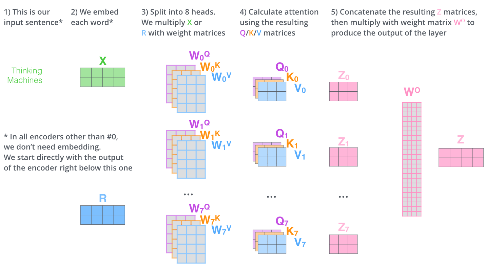

# 图解变压器

在[上](https://jalammar.github.io/visualizing-neural-machine-translation-mechanics-of-seq2seq-models-with-attention/)一篇[文章中，我们研究了注意力](https://jalammar.github.io/visualizing-neural-machine-translation-mechanics-of-seq2seq-models-with-attention/) -现代深度学习模型中无处不在的方法。注意是一个有助于提高神经机器翻译应用程序性能的概念。在本文中，我们将介绍**The Transformer**，这是一个模型，它可以引起人们的注意，以提高训练这些模型的速度。在特定任务中，变形金刚优于Google神经机器翻译模型。但是，最大的好处来自于《变形金刚》如何使其适合并行化。实际上，Google Cloud的建议是使用The Transformer作为参考模型来使用其[Cloud TPU](https://cloud.google.com/tpu/)产品。因此，让我们尝试将模型分开，看看它是如何工作的。

[注意就是你所需要的](https://arxiv.org/abs/1706.03762)提出了变压器。它的TensorFlow实现可作为[Tensor2Tensor](https://github.com/tensorflow/tensor2tensor)软件包的一部分使用。哈佛大学的NLP小组创建了一个[指南，以PyTorch实施对本文进行注释](http://nlp.seas.harvard.edu/2018/04/03/attention.html)。在本文中，我们将尝试过分简化，并逐一介绍概念，以期在不深入了解主题的情况下使人们更容易理解。

## 高级外观

让我们从将模型视为单个黑匣子开始。在机器翻译应用程序中，它将采用一种语言的句子，然后以另一种语言输出其翻译。

弹出Optimus Prime优势，我们看到了编码组件，解码组件以及它们之间的连接。

编码组件是一堆编码器（纸叠将六个编码器彼此叠放–第六个没有什么神奇之处，一个可以肯定会尝试其他设置）。解码组件是相同数量的解码器的堆栈。

编码器的结构完全相同（但它们不共享权重）。每一层都分为两个子层：

编码器的输入首先流经自我注意层，该层可以帮助编码器在对特定单词进行编码时查看输入句子中的其他单词。我们将在后面的文章中进一步关注自我关注。

自我注意层的输出被馈送到前馈神经网络。完全相同的前馈网络独立应用于每个位置。

解码器具有这两层，但是在它们之间是一个关注层，可以帮助解码器将注意力集中在输入语句的相关部分上（类似于[seq2seq模型中的](https://jalammar.github.io/visualizing-neural-machine-translation-mechanics-of-seq2seq-models-with-attention/)关注）。

## 将张量引入图片

现在我们已经看到了模型的主要组成部分，让我们开始研究各种矢量/张量以及它们在这些组件之间的流动方式，以将训练后的模型的输入转换为输出。

通常，在NLP应用程序中，我们首先使用[嵌入算法](https://medium.com/deeper-learning/glossary-of-deep-learning-word-embedding-f90c3cec34ca)将每个输入词转换为向量。

每个单词都嵌入大小为512的向量中。我们将用这些简单的框表示这些向量。

嵌入仅发生在最底部的编码器中。所有编码器共有的抽象概念是，它们会收到一个向量列表，每个向量的大小均为512。在底部编码器中将是单词嵌入，但在其他编码器中，它将是直接在下面的编码器的输出。该列表的大小是我们可以设置的超参数–基本上，这就是训练数据集中最长句子的长度。

将单词嵌入到我们的输入序列中之后，它们中的每一个都会流经编码器的两层。

在这里，我们开始看到Transformer的一个关键属性，即每个位置的单词都流经编码器中自己的路径。自我注意层中这些路径之间存在依赖性。但是，前馈层不具有这些依赖性，因此可以在流过前馈层的同时并行执行各种路径。

接下来，我们将示例切换到较短的句子，然后看一下编码器每个子层中发生的情况。

## 现在我们正在编码！

正如我们已经提到的，编码器接收向量列表作为输入。它通过将这些向量传递到“自我注意”层，然后传递到前馈神经网络，然后将输出向上发送到下一个编码器来处理此列表。

每个位置的单词都经过一个自我注意过程。然后，它们每个都通过前馈神经网络-完全相同的网络，每个向量分别流过它。

## 高水平的自我关注

不要被我扔掉“自我关注”这个词所迷惑，因为这是每个人都应该熟悉的概念。在阅读《注意就是您需要的一切》论文之前，我个人从未遇到过这个概念。让我们提一下它是如何工作的。

说下面的句子是我们要翻译的输入句子：

” `The animal didn't cross the street because it was too tired`“

这句话中的“它”指的是什么？是指街道还是动物？对人类来说，这是一个简单的问题，但对算法而言却不那么简单。

当模型处理“ it”一词时，自我关注使它可以将“ it”与“ animal”相关联。

在模型处理每个单词（输入序列中的每个位置）时，自我关注使其能够查看输入序列中的其他位置以寻找线索，从而有助于更好地对该单词进行编码。

如果您熟悉RNN，请考虑一下保持隐藏状态如何使RNN将其已处理的先前单词/向量的表示形式与正在处理的当前单词/向量进行合并。自我注意是Transformer用于将其他相关单词的“理解”烘焙到我们当前正在处理的单词中的方法。

当我们在编码器5（堆栈中的顶部编码器）中对单词“ it”进行编码时，注意力机制的一部分集中在“ The Animal”上，并将其表示的一部分烘焙到“ it”的编码中。

确保签出[Tensor2Tensor笔记本](https://colab.research.google.com/github/tensorflow/tensor2tensor/blob/master/tensor2tensor/notebooks/hello_t2t.ipynb)，您可以在其中加载Transformer模型，并使用此交互式可视化文件对其进行检查。

## 自我关注的细节

首先，让我们看一下如何使用向量计算自我注意力，然后着眼于它是如何实现的-使用矩阵。

在**第一步骤**中计算自关注的是从每个编码器的输入向量的创建三个矢量（在这种情况下，每个字的嵌入）。因此，对于每个单词，我们创建一个查询向量，一个键向量和一个值向量。通过将嵌入乘以我们在训练过程中训练的三个矩阵来创建这些向量。

请注意，这些新向量的维数小于嵌入向量的维数。它们的维数为64，而嵌入和编码器输入/输出向量的维数为512。它们不必较小，这是使多头注意力（大部分）计算保持恒定的体系结构选择。

乘以X1由WQ权重矩阵产生Q1，与该字相关联的“查询”载体。我们最终为输入句子中的每个单词创建了一个“查询”，一个“键”和一个“值”投影。

什么是“查询”，“键”和“值”向量？

它们是对计算和思考注意力有用的抽象。一旦继续阅读下面的注意力计算方式，您将几乎了解所有关于这些媒介发挥的作用的所有知识。

在**第二个步骤**中计算自注意的是，计算得分。假设我们正在计算此示例“思考”中第一个单词的自注意力。我们需要根据该单词对输入句子的每个单词评分。分数决定了当我们在某个位置对单词进行编码时，要在输入句子的其他部分上投入多少精力。

得分是通过将查询向量的点积与我们要得分的各个单词的关键字向量相乘得出的。因此，如果我们正在处理位置＃1上的单词的自注意，则第一个分数将是q1和k1的点积。第二个分数是q1和k2的点积。

的**第三和第四步骤**是由8（在造纸中使用的密钥向量的维数的平方根来划分的分数- 64。这导致具有更稳定的梯度有可能是这里其他可能的值，但是这是。默认值），然后将结果通过softmax操作传递。Softmax对分数进行归一化，因此所有分数均为正，加起来为1。

这个softmax分数决定了每个单词在这个位置要表达多少。显然，此位置的单词具有最高的softmax分数，但是有时注意与当前单词相关的另一个单词很有用。

所述**第五步骤**是由SOFTMAX得分乘以每个值向量（准备中总结起来）。直觉是保持我们要关注的单词的值完整，并淹没无关的单词（例如，将它们乘以0.001之类的小数字）。

的**第六步骤**是要总结的加权值向量。这将在此位置（对于第一个单词）产生自我注意层的输出。

这样就完成了自我注意的计算。生成的向量是我们可以发送到前馈神经网络的向量。但是，在实际实现中，此计算以矩阵形式进行，以加快处理速度。现在，让我们来看一下单词级别的计算直觉。

## 自我注意的矩阵计算

**第一步**是计算查询，键和值矩阵。为此，我们将嵌入内容打包到一个矩阵X中，然后将其乘以我们训练过的权重矩阵（WQ，WK，WV）。

X矩阵 中的每一行对应于输入句子中的一个单词。我们再次看到嵌入向量（图中的512或4个框）和q / k / v向量（图中的64或3个框）的大小差异。

**最后**，由于我们要处理矩阵，因此我们可以将步骤2到6压缩成一个公式，以计算自我注意层的输出。

矩阵形式的自注意力计算

## 多头野兽

本文通过添加一种称为“多头”注意力的机制，进一步完善了自我注意力层。这样可以通过两种方式提高关注层的性能：

1. 它扩展了模型专注于不同位置的能力。是的，在上面的示例中，z1包含所有其他编码的一点点，但是它可能由实际单词本身决定。如果我们要翻译这样的句子（例如“动物因为太累而没过马路”），这很有用，我们想知道“它”指的是哪个单词。
2. 它为关注层提供了多个“表示子空间”。接下来我们将看到，在多头关注下，我们不仅拥有一个查询组，而且拥有多组查询/键/值权重矩阵（Transformer使用八个关注头，因此每个编码器/解码器最终得到八组） 。这些集合中的每一个都是随机初始化的。然后，在训练之后，将每个集合用于将输入的嵌入（或来自较低编码器/解码器的矢量）投影到不同的表示子空间中。

在多头关注下，我们为每个头维护单独的Q / K / V权重矩阵，从而导致不同的Q / K / V矩阵。如前所述，我们将X乘以WQ / WK / WV矩阵以生成Q / K / V矩阵。

如果我们执行上面概述的相同的自注意力计算，则仅在八个不同的时间使用不同的权重矩阵，最终将得到八个不同的Z矩阵

这给我们带来了一些挑战。前馈层不期望有八个矩阵–期望有一个矩阵（每个单词一个向量）。因此，我们需要一种将这八个压缩为单个矩阵的方法。

我们该怎么做？我们合并矩阵，然后将它们乘以其他权重矩阵WO。

这就是多头自我关注的全部内容。我知道这是很多矩阵。让我尝试将它们全部放在一个视觉中，以便我们可以在一处查看它们

既然我们已经涉及到注意头，那么让我们从前面重新回顾一下示例，看看在示例句中对单词“ it”进行编码时，不同的注意头所关注的位置：

当我们对“ it”一词进行编码时，一个注意力集中在“动物”上，而另一个则集中在“累了”上-从某种意义上说，模型对单词“ it”的表示体现在某些表示上既“动物”又“累”。

但是，如果将所有注意事项添加到图片中，则可能很难解释：

## 使用位置编码表示序列的顺序

到目前为止，我们所描述的模型中缺少的一件事是一种解决输入序列中单词顺序的方法。

为了解决这个问题，转换器将矢量添加到每个输入嵌入中。这些向量遵循模型学习的特定模式，这有助于确定每个单词的位置或序列中不同单词之间的距离。直觉是，将这些值添加到嵌入中后，一旦将它们投影到Q / K / V向量中以及在点积注意期间，就可以在嵌入向量之间提供有意义的距离。

为了使模型具有单词的顺序感，我们添加了位置编码向量-位置编码向量遵循特定的模式。

如果我们假设嵌入的维数为4，则实际的位置编码应如下所示：

玩具嵌入大小为4的位置编码的真实示例

这种模式是什么样的？

在下图中，每行对应一个向量的位置编码。因此，第一行将是我们要添加到输入序列中第一个单词的嵌入的向量。每行包含512个值-每个值都在1到-1之间。我们已经对它们进行了颜色编码，从而使图案可见。

嵌入大小为512（列）的20个单词（行）的位置编码的真实示例。您会看到它看起来像是在中心向下分开的一半。这是因为左半部分的值是由一个函数（使用正弦）生成的，而右半部分的值是由另一个函数（使用余弦）生成的。然后将它们串联起来以形成每个位置编码向量。

论文中描述了位置编码的公式（第3.5节）。您可以在中看到用于生成位置编码的代码[`get_timing_signal_1d()`](https://github.com/tensorflow/tensor2tensor/blob/23bd23b9830059fbc349381b70d9429b5c40a139/tensor2tensor/layers/common_attention.py)。这不是位置编码的唯一可能方法。但是，它具有能够缩放到看不见的序列长度的优势（例如，如果我们训练有素的模型要求翻译的句子比训练集中的任何句子更长的长度）。

## 残差

在继续进行之前，我们需要提到的编码器体系结构中的一个细节是，每个编码器中的每个子层（自我关注，ffnn）在其周围都有剩余连接，然后进行[层归一化](https://arxiv.org/abs/1607.06450)步骤。

如果我们要可视化矢量和与自我关注相关的layer-norm操作，它将看起来像这样：

这也适用于解码器的子层。如果我们想到一个由2个堆叠的编码器和解码器组成的Transformer，它看起来像这样：

## 解码器端

现在我们已经涵盖了编码器方面的大多数概念，我们基本上知道了解码器的组件也如何工作。但是，让我们看一下它们如何协同工作。

编码器首先处理输入序列。然后，顶部编码器的输出转换为注意向量K和V的集合。每个解码器将在其“编码器-解码器注意”层中使用它们，这有助于解码器将注意力集中在输入序列中的适当位置：

完成编码阶段后，我们开始解码阶段。解码阶段的每个步骤都会从输出序列中输出一个元素（在这种情况下为英语翻译语句）。

以下步骤重复该过程，直到出现特殊情况为止。 到达符号表示变压器解码器已完成其输出。每个步骤的输出在下一个时间步骤中被馈送到底部解码器，并且解码器像编码器一样使其解码结果冒泡。就像我们对编码器输入所做的一样，我们在这些解码器输入中嵌入并添加位置编码以指示每个单词的位置。

解码器中的自我关注层与编码器中的自我关注层略有不同：

在解码器中，仅允许自我注意层关注输出序列中的较早位置。这是通过`-inf`在自注意力计算中的softmax步骤之前屏蔽将来的位置（将其设置为）来完成的。

“ Encoder-Decoder Attention”层的工作方式与多头自注意力类似，不同之处在于它从其下一层创建其Queries矩阵，并从编码器堆栈的输出中获取Keys和Values矩阵。

## 最终的线性层和Softmax层

解码器堆栈输出浮点向量。我们如何把它变成一个词？这就是最后的线性层，然后是Softmax层的工作。

线性层是一个简单的完全连接的神经网络，它将解码器堆栈产生的向量投影到一个更大，更大的向量中，称为对数向量。

假设我们的模型知道从训练数据集中学习的10,000个唯一的英语单词（我们模型的“输出词汇”）。这将使logits向量的宽度为10,000个单元-每个单元对应一个唯一单词的分数。这就是我们解释模型的输出以及线性层的方式。

然后，softmax层将那些分数转换为概率（全部为正，全部相加为1.0）。选择具有最高概率的单元，并生成与此时间相关联的单词作为该时间步的输出。

该图从底部开始，将产生的矢量作为解码器堆栈的输出。然后将其转换为输出字。

## 培训回顾

既然我们已经通过训练有素的Transformer涵盖了整个前向过程，那么了解训练模型的直觉将非常有用。

在训练过程中，未经训练的模型将经过完全相同的前进。但是由于我们是在标记的训练数据集上对其进行训练，因此我们可以将其输出与实际正确的输出进行比较。

为了直观地说明这一点，我们假设输出词汇表仅包含六个单词（“ a”，“ am”，“ i”，“ thanks”，“ student”和“ <eos>”（“句子结尾”的缩写）） 。

我们的模型的输出词汇表是在我们甚至开始训练之前的预处理阶段创建的。

一旦定义了输出词汇表，我们就可以使用相同宽度的向量来指示词汇表中的每个单词。这也称为单热编码。因此，例如，我们可以使用以下向量来表示单词“ am”：

示例：输出词汇表的一键编码

回顾之后，让我们讨论模型的损失函数-我们在训练阶段正在优化的度量标准，可以得出经过训练的，希望是惊人的准确模型。

## 损失函数

假设我们正在训练我们的模型。说这是我们培训阶段的第一步，我们正在以一个简单的示例对其进行培训-将“ merci”转换为“感谢”。

这意味着我们希望输出是一个表示单词“谢谢”的概率分布。但是，由于尚未对该模型进行训练，因此不太可能发生。

由于模型的参数（权重）都是随机初始化的，因此（未经训练的）模型会针对每个单元格/单词生成具有任意值的概率分布。我们可以将其与实际输出进行比较，然后使用反向传播调整所有模型的权重，以使输出更接近所需的输出。

您如何比较两个概率分布？我们简单地从另一个中减去一个。有关更多详细信息，请参阅 [交叉熵](https://colah.github.io/posts/2015-09-Visual-Information/)和[Kullback-Leibler散度](https://www.countbayesie.com/blog/2017/5/9/kullback-leibler-divergence-explained)。

但是请注意，这是一个过于简化的示例。实际上，我们将使用一个单词多于一个单词的句子。例如，输入：“ je suisétudiant”，预期输出：“我是学生”。这实际上意味着我们希望我们的模型连续输出概率分布，其中：

- 每个概率分布都由一个宽度vocab_size的向量表示（在我们的玩具示例中为6，但更实际地为3,000或10,000）
- 第一概率分布在与单词“ i”相关联的单元中具有最高概率
- 第二概率分布在与单词“ am”相关联的单元中具有最高概率
- 依此类推，直到第五个输出分布指示' ``'符号，该符号也具有与10,000个元素词汇表相关的单元格。

我们将在训练示例中针对一个样本句子针对目标概率分布进行训练。

在足够大的数据集上训练模型足够的时间后，我们希望产生的概率分布如下所示：

希望经过培训，该模型将输出我们期望的正确翻译。当然，这并不是该短语是否属于训练数据集的真正迹象（请参阅：[交叉验证](https://www.youtube.com/watch?v=TIgfjmp-4BA)）。请注意，即使不太可能是该时间步长的输出，每个位置也会获得几率–这是softmax的一个非常有用的属性，可以帮助训练过程。

现在，由于该模型一次生成一个输出，因此我们可以假设该模型正在从该概率分布中选择具有最高概率的单词，然后丢弃其余单词。这是做到这一点的一种方法（称为贪婪解码）。做到这一点的另一种方法是，坚持前两个单词（例如，“ I”和“ a”），然后在下一步中运行模型两次：一次假设第一个输出位置为单词“ I”，另一次假设第一个输出位置是单词“ a”，并且考虑到位置＃1和＃2都保留了较低的版本。我们在位置2和位置3等重复此操作。这种方法称为“光束搜索”，在我们的示例中，beam_size为2（因为我们在计算位置＃1和＃2的光束之后比较了结果），和top_beams也是两个（因为我们保留了两个单词）。这些都是您可以尝试的超参数。

## 进行变革

我希望您已经发现这是一个有用的地方，可以开始用Transformer的主要概念打破僵局。如果您想更深入一点，建议您执行以下步骤：

- 阅读《[注意就是您所需要的一切》](https://arxiv.org/abs/1706.03762)论文，Transformer博客文章（《[Transformer：一种用于语言理解的新型神经网络体系结构》](https://ai.googleblog.com/2017/08/transformer-novel-neural-network.html)）和[Tensor2Tensor公告](https://ai.googleblog.com/2017/06/accelerating-deep-learning-research.html)。
- 观看[ŁukaszKaiser的演讲](https://www.youtube.com/watch?v=rBCqOTEfxvg)，探讨模型及其细节
- 使用[Tensor2Tensor存储库中提供](https://colab.research.google.com/github/tensorflow/tensor2tensor/blob/master/tensor2tensor/notebooks/hello_t2t.ipynb)的[Jupyter Notebook](https://colab.research.google.com/github/tensorflow/tensor2tensor/blob/master/tensor2tensor/notebooks/hello_t2t.ipynb)玩
- 探索[Tensor2Tensor存储库](https://github.com/tensorflow/tensor2tensor)。

后续工作：

- [神经机器翻译的深度可分离卷积](https://arxiv.org/abs/1706.03059)
- [一种学习所有模式](https://arxiv.org/abs/1706.05137)
- [序列模型的离散自动编码器](https://arxiv.org/abs/1801.09797)
- [通过汇总长序列来生成维基百科](https://arxiv.org/abs/1801.10198)
- [图像变压器](https://arxiv.org/abs/1802.05751)
- [变压器模型的培训技巧](https://arxiv.org/abs/1804.00247)
- [具有相对位置表示的自我注意](https://arxiv.org/abs/1803.02155)
- [使用离散潜在变量的序列模型中的快速解码](https://arxiv.org/abs/1803.03382)
- [Adafactor：具有亚线性记忆成本的自适应学习率](https://arxiv.org/abs/1804.04235)

## 致谢