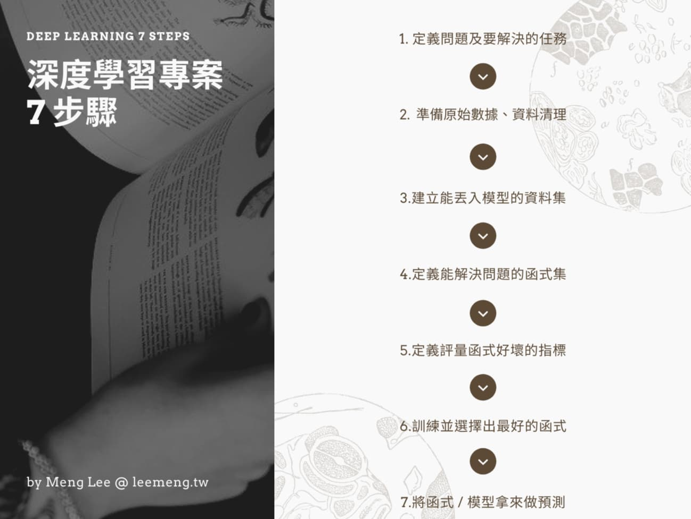
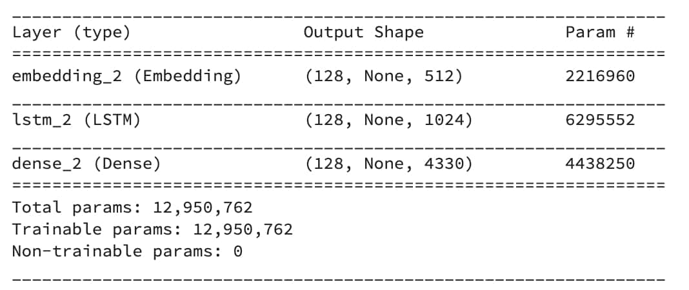
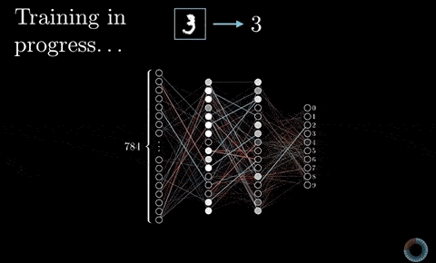
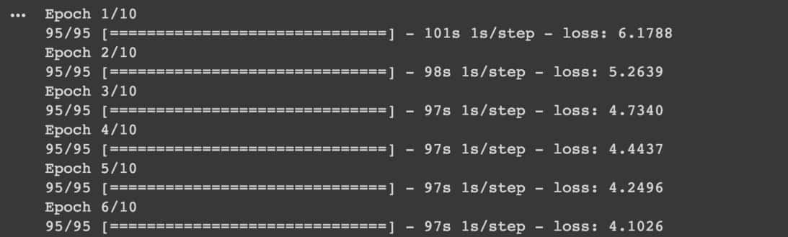
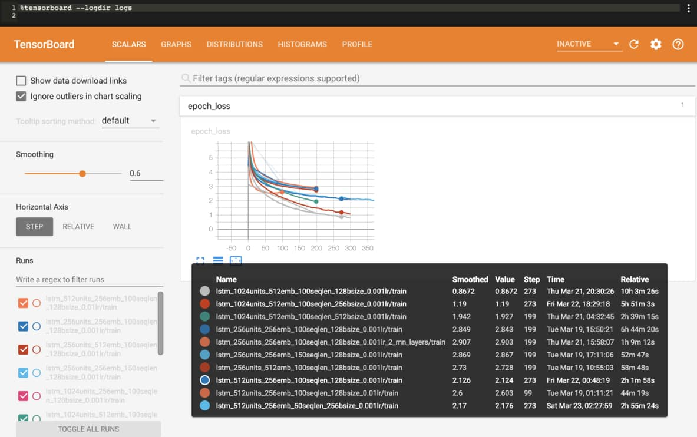
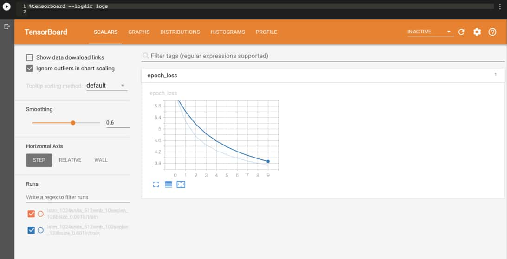
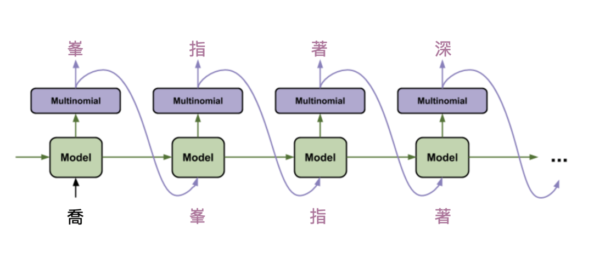
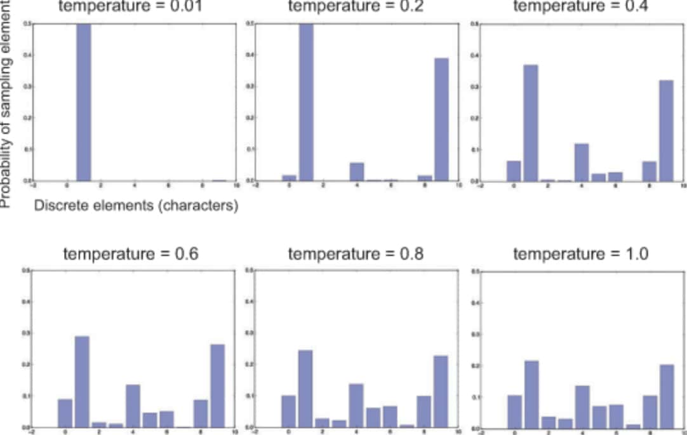

> 木婉清转头向他，背脊向着南海鳄神，低声道：「你是世上第一个见到我容貌的男子！」缓缓拉开了面幕。段誉登时全身一震，眼前所见，如新月清晖，如花树堆雪，一张脸秀丽绝俗。
> 第四回：崖高人远


[《天龙八部》](https://bit.ly/2TUycBQ)一直是我最喜欢的[金庸著作](https://zh.wikipedia.org/wiki/金庸作品)之一，最近重新翻阅，有很多新的感受。

阅读到一半我突发奇想，决定尝试用[深度学习](https://leemeng.tw/deep-learning-resources.html)以及[TensorFlow 2.0](https://www.tensorflow.org/alpha)来训练一个能够生成《天龙八部》的[循环神经网路](https://leemeng.tw/shortest-path-to-the-nlp-world-a-gentle-guide-of-natural-language-processing-and-deep-learning-for-everyone.html#有記憶的循環神經網路)。生成结果仍不完美，但我认为已经很有娱乐性质，且有时能够产生令人惊叹或是捧腹大笑的文章了。

因此我决定使用[Tensorflow.js](https://www.tensorflow.org/js)将训练出来的模型弄上线，让你也能实际看看这个AI嗑了什么药。

大理古城一隅，段誉出身之地


在demo 之后，我将以此文的AI 应用为例，用TensorFlow 2.0 带你走过深度学习专案中常见的7 个步骤：

1. [定义问题及要解决的任务](https://leemeng.tw/how-to-generate-interesting-text-with-tensorflow2-and-tensorflow-js.html#1.-定義問題及要解決的任務)
2. [准备原始数据、资料清理](https://leemeng.tw/how-to-generate-interesting-text-with-tensorflow2-and-tensorflow-js.html#2.-準備原始數據、資料清理)
3. [建立能丢入模型的资料集](https://leemeng.tw/how-to-generate-interesting-text-with-tensorflow2-and-tensorflow-js.html#3.-建立能丟入模型的資料集)
4. [定义能解决问题的函式集](https://leemeng.tw/how-to-generate-interesting-text-with-tensorflow2-and-tensorflow-js.html#4.-定義能解決問題的函式集)
5. [定义评量函式好坏的指标](https://leemeng.tw/how-to-generate-interesting-text-with-tensorflow2-and-tensorflow-js.html#5.-定義評量函式好壞的指標)
6. [训练并选择出最好的函式](https://leemeng.tw/how-to-generate-interesting-text-with-tensorflow2-and-tensorflow-js.html#6.-訓練並選擇出最好的函式)
7. [将函式/ 模型拿来做预测](https://leemeng.tw/how-to-generate-interesting-text-with-tensorflow2-and-tensorflow-js.html#7.-將函式-/-模型拿來做預測)

希望阅读本文后能让你学到点东西，从中获得些启发，并运用自己的想像力创造点新的东西。

前言够长了，让我们马上进入demo 吧！

## 生成新的天龙八部桥段

本篇使用一个十分简单的[长短期记忆RNN](https://leemeng.tw/shortest-path-to-the-nlp-world-a-gentle-guide-of-natural-language-processing-and-deep-learning-for-everyone.html#記憶力好的-LSTM-細胞)来生成文章。在多次「阅读」天龙八部之后，这个模型可以在给定一段文本的情况下，逐字产生类似天龙八部小说的文章。

比方说给定书中的一个桥段：

```
乌老大偏生要考一考慕容复，说道：「慕容公子，你瞧这不是大大的
```

你会怎么接下去？

本文的模型顺着上面的话生成的其中一次结果：

```
不算？」马夫人道：「不错，咱们非要寻死不可。」

段誉大喜，说道：「小姑娘，你待我这么好，鬼鬼祟祟，一切又不听你的话，你管什么老兄弟不相干，我去帮过彦之。」

王夫人哼了一声，说道：「这里是什么话？」段誉道：「不行！你别过来。用真蛮子，我便将这件事了，一大恶人挤在地下，立时便会毙命，那便如何是好？」
```

文章内容很ㄎ一ㄤ，惹人发笑，但用词本身很天龙八部。（至少我自己写不出这样的内容）

姑苏慕容家所在的苏州


现在马上就让我们产生一些新的桥段吧！首先将已经训练好的模型载入你的浏览器。

（建议在网速快的地方载入模型以减少等待时间，或者点击载入后先阅读[模型是怎么被训练的](https://leemeng.tw/how-to-generate-interesting-text-with-tensorflow2-and-tensorflow-js.html#模型是怎麼被訓練的)，等等再回来查看）

成功载入模型后，你将可以用它不断地产生新的桥段：

载入模型 

另外你会发现有2 个可供你调整的参数：

生成长度（字单位） 

生成温度（随机度） 

第一次可以直接使用预设值。现在点击**生成文章**来产生全新的天龙八部桥段：

生成文章 重置输入

起始句子：

生成结果：

如何？希望模型产生的结果有成功令你嘴角上扬。当初它可快把我逗死了。

现在你可以尝试几件事情：

- 点**生成文章**来让模型依据同输入产生新桥段
- 点**重置输入**来随机取得一个新的起始句子
- 增加模型生成的**文章长度**
- 调整**生成温度**来改变文章的变化性


生成温度是一个实数值，而当温度越高，模型产生出来的结果越随机、越不可预测（也就越ㄎㄧㄤ）；而温度越低，产生的结果就会越像天龙八部原文。优点是真实，但同时字词的重复性也会提升。

> 机器并没有情感，只有人类可以赋予事物意义。我们无法让机器自动找出最佳的生成温度，因为人的感觉十分主观：找出你自己觉得最适合的温度来生成文章。

如果你没有打算深入探讨技术细节，那只需要记得在这篇文章里头的模型是一个以「字」为单位的语言模型（Character-based Language Model）即可：给定一连串已经出现过的字词，模型会想办法去预测出下一个可能出现的字。


值得注意的是，我们并不单纯是拿出现机率最高的字出来当生成结果，这样太无趣了。

每次机器做预测前都会拿着一个包含大量中文字的机率分布p，在决定要吐出哪个字时，会对该机率分布p 做抽样，从中随机选出一个字。

因此就跟你在上面demo 看到的一样，就算输入的句子相同，每次模型仍然会生成完全不同的文章。

抽样的过程类似掷骰子，尽管有些结果较易出现，你还是有机会骰到豹子


因为随机抽样的关系，每次模型产生的结果基本上都是独一无二的。

如果你在生成文章的过程中得到什么有趣的虚拟桥段，都欢迎与我分享：）


本文接着将详细解说此应用是怎么被开发出来的。如果你现在没有打算阅读，可以直接跳到[结语](https://leemeng.tw/how-to-generate-interesting-text-with-tensorflow2-and-tensorflow-js.html#結語)。

## 模型是怎么被训练的

在看完demo 以后，你可能会好奇这个模型是怎么被训练出来的。

实际的开发流程大致可以分为两个部分：

- [用TensorFlow 2.0 训练一个LSTM 模型](https://www.tensorflow.org/alpha/tutorials/sequences/text_generation)
- [使用TensorFlow.js 部属该模型](https://github.com/tensorflow/tfjs-examples/tree/master/lstm-text-generation)

这些在TensorFlow 以及TensorFlow.js 的官网都有详细的教学以及程式码供你参考。

这篇文章参考了不少TensorFlow 官网（左）及TensorFlow.js 线上demo（右）的程式码


如果你也想开发一个类似的应用，阅读官方教学中你所熟悉的语言版本（Python / JavaScript）是最直接的作法：

- [TensorFlow 2.0 Alpha - Text generation with an RNN](https://www.tensorflow.org/alpha/tutorials/sequences/text_generation)
- [TensorFlow.js Example: Train LSTM to Generate Text](https://github.com/tensorflow/tfjs-examples/tree/master/lstm-text-generation)

因为官方已经有提供能在[Google Colab](https://colab.research.google.com/)上使用GPU [训练LSTM的教学笔记本](https://colab.research.google.com/github/tensorflow/docs/blob/master/site/en/r2/tutorials/sequences/text_generation.ipynb)，本文便不再另行提供。


另外，具备以下背景可以让你更轻松地阅读接下来的内容：

- 熟悉[Python](https://www.python.org/)
- 碰过[Keras](https://keras.io/)或是[TensorFlow](https://www.tensorflow.org/)
- 具备[机器学习&深度学习基础](https://leemeng.tw/deep-learning-resources.html#courses)
- 了解何谓[循环神经网路](https://leemeng.tw/shortest-path-to-the-nlp-world-a-gentle-guide-of-natural-language-processing-and-deep-learning-for-everyone.html#有記憶的循環神經網路)以及[长短期记忆](https://leemeng.tw/shortest-path-to-the-nlp-world-a-gentle-guide-of-natural-language-processing-and-deep-learning-for-everyone.html#記憶力好的-LSTM-細胞)

如果你是喜欢先把基础打好的人，可以先查阅我上面附的这些资源连结。

## TensorFlow 2.0开发

平常有在接触深度学习的读者或许都已经知道，最近TensorFlow隆重推出[2.0 Alpha预览版](https://www.tensorflow.org/alpha)，希望透过全新的API让更多人可以轻松地开发机器学习以及深度学习应用。

当初撰写本文的其中一个目的，也是想趁着这次大改版来让自己熟悉一下TensorFlow 2.0 的开发方式。

<iframe allow="accelerometer; autoplay; encrypted-media; gyroscope; picture-in-picture" allowfullscreen="" class="resp-iframe" frameborder="0" src="https://www.youtube.com/embed/TTQQiJ-mHYA" style="box-sizing: inherit; position: absolute; top: 0px; left: 0px; width: 880px; height: 495px; border: 0px;"></iframe>

TensorFlow 2.0值得关注的[更新](https://youtu.be/YzLnnGiLNRE?list=PLQY2H8rRoyvzoUYI26kHmKSJBedn3SQuB)不少，但以下几点跟一般的ML开发者最为相关：

- [tf.keras](https://www.tensorflow.org/alpha/guide/keras/overview)被视为官方高级API，强调其地位
- 方便除错的[Eager Execution](https://colab.research.google.com/github/tensorflow/docs/blob/master/site/en/guide/eager.ipynb)成为预设值
- 负责读取、处理大量数据的[tf.data](https://www.tensorflow.org/alpha/guide/data_performance) API
- 自动帮你建构计算图的[tf.function](https://youtu.be/Up9CvRLIIIw?list=PLQY2H8rRoyvzoUYI26kHmKSJBedn3SQuB)

在这篇文章里头会看到前3者。下节列出的程式码皆在[Google Colab](https://colab.research.google.com/github/tensorflow/docs/blob/master/site/en/r2/tutorials/sequences/text_generation.ipynb)上用最新版本的TensorFlow 2.0 Nightly执行。

```
pip install tf - nightly - gpu - 2.0 - preview
```

如果有GPU 则强烈建议安装GPU 版本的TF Nightly，训练速度跟CPU 版本可以差到10 倍以上。

## 深度学习专案步骤

好戏终于登场。

如同多数的深度学习专案，要训练一个以LSTM 为基础的语言模型，你大致需要走过以下几个步骤：

开发一个DL 专案时我常用的流程架构


这个流程是一个大方向，依据不同情境你可能需要做些调整来符合自己的需求，且很多步骤需要重复进行。

这篇文章会用TensorFlow 2.0 简单地带你走过所有步骤。

### 1.定义问题及要解决的任务

很明显地，在训练模型前首先得确认我们的问题（Problem）以及想要交给机器解决的任务（Task）是什么。

前面已经提过，我们的目标就是要找出一个天龙八部的语言模型（Language Model），让该模型在被喂进一段文字以后，能吐出类似天龙八部的文章。


<iframe allow="accelerometer; autoplay; encrypted-media; gyroscope; picture-in-picture" allowfullscreen="" class="resp-iframe" frameborder="0" src="https://www.youtube.com/embed/f1KUUz7v8g4?list=PLJV_el3uVTsPMxPbjeX7PicgWbY7F8wW9" style="box-sizing: inherit; position: absolute; top: 0px; left: 0px; width: 880px; height: 495px; border: 0px;"></iframe>


十分推荐李宏毅教授讲解序列生成的影片


这实际上是一个[序列生成（Sequence Generation）](https://youtu.be/f1KUUz7v8g4?list=PLJV_el3uVTsPMxPbjeX7PicgWbY7F8wW9)问题，而机器所要解决的任务也变得明确：给定一段文字单位的序列，它要能吐出下一个合理的文字单位。

这边说的文字单位（Token）可以是

- 字（Character，如剑、寺、云）
- 词（Word，如吐蕃、师弟、阿修罗）

本文则使用「字」作为一个文字单位。现在假设有一个天龙八部的句子：

```
『六脉神剑经』乃本寺镇寺之宝，大理段氏武学的至高法要。
```

这时候句子里的每个字（含标点符号）都是一个文字单位，而整个句子就构成一个文字序列。我们可以撷取一部份句子：

```
『六脉神剑经』乃本寺镇寺之宝，大理段氏武
```

接着在训练模型时要求它读入这段文字，并预测出原文里头出现的下一个字：`學`。

一旦训练完成，就能得到你开头看到的那个语言模型了。

### 2.准备原始数据、资料清理

巧妇难为无米之炊，没有数据一切免谈。


我在网路上搜集天龙八部原文，做些简单的数据清理后发现整本小说总共约含120 万个中文字，实在是一部旷世巨作。尽管因为版权问题不宜提供下载连结，你可以Google 自己有兴趣的文本。

现在假设我们把原文全部存在一个Python字串`text`里头，则部分内容可能如下：

```
#随意取出第9505到9702的中文字print ( text [ 9505 : 9702 ])
咱们见敌方人多，不得师父号令，没敢随便动手。」左子穆道：「嗯，来了多少人？」干光豪道：「大约七八十人。」左子穆嘿嘿冷笑，道：「七八十人，便想诛灭无量剑了？只怕也没这么容易。」

龚光杰道：「他们用箭射过来一封信，封皮上写得好生无礼。」说着将信呈上。

左子穆见信封上写着：「字谕左子穆」五个大字，便不接信，说道：「你拆来瞧瞧。」龚光杰道：「是！」拆开信封，抽出信笺。

那少女在段誉耳边低声道：
```

我们也可以看看整本小说里头包含多少中文字：

```
n = len ( text ) w = len ( set ( text )) print ( f "天龙八部小说共有{n} 中文字" ) print ( f "包含了{w} 个独一无二的字" )  
  
天龙八部小说共有1235431 中文字包含了4330 个独一无二的字  
  
```

相较于英文只有26 个简单字母，博大精深的中文里头有非常多汉字。


如同[写给所有人的自然语言处理与深度学习入门指南](https://leemeng.tw/shortest-path-to-the-nlp-world-a-gentle-guide-of-natural-language-processing-and-deep-learning-for-everyone.html)里头说过的，要将文本数据丢入只懂数字的神经网路，我们得先做些前处理。

具体来说，得将这些中文字对应到一个个的索引数字（Index）或是向量才行。

我们可以使用`tf.keras`里头的`Tokenizer`帮我们把整篇小说建立字典，并将同样的中文字对应到同样的索引数字：

```
import tensorflow as tf   

#初始化一个以字为单位的Tokenizer tokenizer = tf . keras \
     . preprocessing \
     . text \
     . Tokenizer ( num_words = num_words , char_level = True , filters = '' )
  
#让tokenizer读过天龙八部全文，#将每个新出现的字加入字典并将中文字转#成对应的数字索引tokenizer . fit_on_texts ( text ) text_as_int = tokenizer \
     . texts_to_sequences ([ text ])[ 0 ]

#随机选取一个片段文本方便之后做说明s_idx = 21004 e_idx = 21020 partial_indices = \
     text_as_int [ s_idx : e_idx ] partial_texts = [ tokenizer . index_word [ idx ] \
     for idx in partial_indices ]
  

#渲染结果，可忽略print ( "原本的中文字序列：" ) print () print ( partial_texts ) print () print ( "-" * 20 ) print () print ( "转换后的索引序列：" ) print () print ( partial_indices )

原本的中文字序列：

[ '司' , '空' , '玄' , '双' , '掌' , '飞' , '舞' , '，' , '逼' , '得' , '它' , '无' , '法' , '近' , '前' , '。' ]               

--------------------

转换后的索引序列：

[ 557 , 371 , 215 , 214 , 135 , 418 , 1209 , 1 , 837 , 25 , 1751 , 49 , 147 , 537 , 111 , 2 ]               
```

很明显地，现在整部天龙八部都已经被转成一个巨大的数字序列，每一个数字代表着一个独立的中文字。

我们可以换个方向再看一次：

```
人类看的中文字机器看的输入索引------------------------------ 司557 空371 玄215 双214 掌135 飞418 舞1209 ，1 逼837 得25 它1751 无49 法147 近537 前111 。2     


```

### 3.建立能丢入模型的资料集

做完基本的数据前处理以后，我们需要将`text_as_int`这个巨大的数字序列转换成神经网路容易消化的格式与大小。

```
text_as_int [: 10 ]
[ 1639 , 148 , 3 , 3 , 280 , 5 , 192 , 819 , 374 , 800 ]         
_type = type ( text_as_int ) n = len ( text_as_int ) print ( f "text_as_int是一个{_type} \n " ) print ( f "小说的序列长度：{n} \n " ) print ( "前5索引：" , text_as_int [: 5 ])  
  


 
text_as_int 是一个< class 'list' >  

小说的序列长度：1235431 

前5 索引：[ 1639 , 148 , 3 , 3 , 280 ]       
```

> 在建立资料集时，你要先能想像最终交给模型的数据长什么样子。这样能帮助你对数据做适当的转换。

依照当前机器学习任务的性质，你会需要把不同格式的数据喂给模型。

在本文的序列生成任务里头，理想的模型要能依据前文来判断出下一个中文字。因此我们要丢给模型的是一串代表某些中文字的数字序列：

```
print ( "实际丢给模型的数字序列：" ) print ( partial_indices [: - 1 ]) print () print ( "方便我们理解的文本序列：" ) print ( partial_texts [: - 1 ])
实际丢给模型的数字序列：[ 557 , 371 , 215 , 214 , 135 , 418 , 1209 , 1 , 837 , 25 , 1751 , 49 , 147 , 537 , 111 ]
              

方便我们理解的文本序列：[ '司' , '空' , '玄' , '双' , '掌' , '飞' , '舞' , '，' , '逼' , '得' , '它' , '无' , '法' , '近' , '前' ]
              
```

而模型要给我们的理想输出应该是向左位移一个字的结果：

```
print ( "实际丢给模型的数字序列：" ) print ( partial_indices [ 1 :]) print () print ( "方便我们理解的文本序列：" ) print ( partial_texts [ 1 :])
实际丢给模型的数字序列：[ 371 , 215 , 214 , 135 , 418 , 1209 , 1 , 837 , 25 , 1751 , 49 , 147 , 537 , 111 , 2 ]
              

方便我们理解的文本序列：[ '空' , '玄' , '双' , '掌' , '飞' , '舞' , '，' , '逼' , '得' , '它' , '无' , '法' , '近' , '前' , '。' ]
              
```

为什么是这样的配对？


让我们将输入序列及输出序列拿来对照看看：

```
司空玄双掌飞舞，逼得它无法近             

空玄双掌飞舞，逼得它无法近前             
```

从左看到右你会发现，一个模型如果可以给我们这样的输出，代表它：

- 看到第一个输入字`司`时可以正确输出`空`
- 在之前看过`司`，且新输入字为`空`的情况下，可以输出`玄`
- 在之前看过`司空`，且新输入字为`玄`的情况下，可以输出`雙`
- 在之前看过`司空玄雙掌飛`，且新输入字为`舞`的情况下，可以输出`，`

当一个语言模型可以做到这样的事情，就代表它已经掌握了**训练文本**（此文中为天龙八部）里头用字的统计结构，因此我们可以用它来产生新的天龙八部文章。

你现在应该也可以了解，这个语言模型是专为天龙八部的文本所诞生的。毕竟日常生活中，给你`舞`这个字，你接`，`的机率有多少呢？


为了让你加深印象，让我把序列摆直，再次列出模型的输入以及输出关系：

```
时间点输入字输入索引输出字输出索引------------------------------------- 1 司557 空371 2 空371 玄215 3 玄215 双214 4 双214 掌135 5 掌135 飞418 6 飞418 舞1209 7 舞1209 ，1 8 ，1 逼837 9 逼837 得25 10 得25 它          

                        
                        
                        
                        
                        
                        
                       
                          
                        
                        1751 11 它1751 无49 12 无49 法147 13 法147 近537 14 近537 前111
                      
                        
                       
                       
```

每一列（row）是一个时间点，而

- **输入索引**代表模型在当下时间吃进去的输入
- **输出索引**则代表我们要模型输出的结果

输入字・输出字则只是方便我们理解对照，实际上模型只吃数字。


现在我们了解一笔输入・输出该有的数据格式了。两者皆是一个固定长度的数字序列，而后者是前者往左位移一个数字的结果。

但这只是一笔数据（以下说的一笔数据，都隐含了输入序列以及对应的输出序列的2 个数字序列）。

在有GPU 的情况下，我们常常会一次丢一批（batch）数据，让GPU 可以平行运算，加快训练速度。


现在假设我们想要一个资料集，而此资料集可以一次给我们128笔长度为10的输入・输出序列，则我们可以用`tf.data`这样做：

```
#方便说明，实际上我们会用更大的值来#让模型从更长的序列预测下个中文字SEQ_LENGTH = 10 #数字序列长度BATCH_SIZE = 128 #几笔成对输入/输出

    
   

# text_as_int是一个python list #我们利用from_tensor_slices将其#转变成TensorFlow最爱的Tensor <3 characters = tf \
     . data \
     . Dataset \
     . from_tensor_slices ( text_as_int )


  
        

#将被以数字序列表示的天龙八部文本#拆成多个长度为SEQ_LENGTH (10)的序列#并将最后长度不满SEQ_LENGTH的序列舍去sequences = characters \
     . batch ( SEQ_LENGTH + 1 , drop_remainder = True )


     
           

#天龙八部全文所包含的成对输入/输出的数量steps_per_epoch = \
     len ( text_as_int ) // SEQ_LENGTH
   

#这个函式专门负责把一个序列#拆成两个序列，分别代表输入与输出# （下段有vis解释这在做什么）def build_seq_pairs ( chunk ): input_text = chunk [: - 1 ] target_text = chunk [ 1 :] return input_text , target_text


 
      
      
      

#将每个从文本撷取出来的序列套用上面#定义的函式，拆成两个数字序列#作为输入／输出序列#再将得到的所有数据随机打乱顺序#最后再一次拿出BATCH_SIZE（ 128）笔数据#作为模型一次训练步骤的所使用的资料ds = sequences \
     . map ( build_seq_pairs ) \
     . shuffle ( steps_per_epoch ) \
     . batch ( BATCH_SIZE , drop_remainder = True )


   
           
```

这段建构`tf.data.Dataset`的程式码虽然不短，但有超过一半是我写给你的注解。

事实上用`tf.data`架构一个资料集并不难，且学会以后你每次都可用类似的方式呼叫[TensorFlow Data API](https://www.tensorflow.org/guide/datasets)来处理**任何**文本数据，而不需要每次遇到新文本都从头开始写类似的功能（`batch`、`shuffle`etc）。


再次提醒，如果你想自己动手可以参考[官方用TensorFlow 2.0训练LSTM的Colab笔记本](https://colab.research.google.com/github/tensorflow/docs/blob/master/site/en/r2/tutorials/sequences/text_generation.ipynb)。

虽然我不是酷拉皮卡，但如果要把上面`build_seq_pairs`的处理具现化的话，大概就像是下面这样（假设序列长度为6）：

```
撷取的片段序列输入/输出序列------------------------------- -> 乌老大拱手还| 乌老大拱手还礼----- | -> 老大拱手还礼       

                  
                 
 
                 
                  


                 -> 星宿派人数远| 星宿派人数远较----- | -> 宿派人数远较 
                 
 
                 
                  


                 -> 过不多时，贾| 过不多时，贾老----- | -> 不多时，贾老 
                 
 
                 
                  
```

你会发现针对序列长度`SEQ_LENGTH`为6的情况，我会刻意将天龙八部文本切成长度为`SEQ_LENGTH + 1`：7的句子，再从这些句子建立出输入及输出序列。

到此为止，我们已经用`tf.data`建立出一个可以拿来训练语言模型的资料集了。


TensorFlow 2.0预设就是[Eager Execution](https://colab.research.google.com/github/tensorflow/docs/blob/master/site/en/guide/eager.ipynb)，因此你不再需要使用老朋友`tf.Session()`或是`tf.placeholder`就能非常直觉地存取数据：

```
# print是用来帮你理解tf.data.Dataset #的内容，实际上存取资料集非常简单#现在先关注下面的print结果for b_inp , b_tar in ds . take ( 1 ): print ( "起始句子的batch：" ) print ( b_inp , " \n " ) print ( "目标句子的batch：" ) print ( b_tar , " \n " ) print ( "-" * 20 , " \n " )


    
    
     
    
     
       
    
    print ( "第一个起始句子的索引序列：" ) first_i = b_inp . numpy ()[ 0 ] print ( first_i , " \n " ) print ( "第一个目标句子的索引序列：" ) first_t = b_tar . numpy ()[ 0 ] print ( first_t , " \n " ) print ( "-" * 20 , " \n " )
      
     
    
      
     
       
    
    d = tokenizer . index_word print ( "第一个起始句子的文本序列：" ) print ([ d [ i ] for i in first_i ]) print () print ( "第一个目标句子的文本序列：" ) print ([ d [ i ] for i in first_t ])  
    
        
    
    
        
起始句子的batch ：
tf . Tensor ( [[ 1440 10 12 ... 1882 15 175 ] [ 157 16 212 ... 11 206 92 ] [ 36 14 36 ... 368 384 63 ] ... [ 61 8 3 ... 11 5 219 ] [ 123 189 587 ... 65 120 51 ] [ 1 5
             
                
                 
 
                     
               
          620 ... 2 8 1272 ]], shape =( 128 , 10 ), dtype = int32 )            

目标句子的batch ：
tf . Tensor ( [[ 10 12 7 ... 15 175 99 ] [ 16 212 67 ... 206 92 1 ] [ 14 36 36 ... 384 63 2 ] ... [ 8 3 3 ... 5 219 1 ] [ 189 587 884 ... 120 51 196 ] [ 5 620
                  
                  
                   
 
                       
              
        597 ... 8 1272 1275 ]], shape =( 128 , 10 ), dtype = int32 )         

-------------------- 

第一个起始句子的索引序列：[ 1440 10 12 7 63 19 17 1882 15 175 ]
                          

第一个目标句子的索引序列：[ 10 12 7 63 19 17 1882 15 175 99 ]
                            

-------------------- 

第一个起始句子的文本序列：[ '陵' , '道' , '：' , '「' , '想' , '来' , '他' , '嫌' , '你' , '本' ]
         

第一个目标句子的文本序列：[ '道' , '：' , '「' , '想' , '来' , '他' , '嫌' , '你' , '本' , '事' ]
         
```

为了让你理解资料集回传的内容，上面用了不少`print`。但事实上这个资料集`ds`负责的就是每次吐出2个128笔数据的Tensor，分别代表输入与输出的批次数据（Batch）。

而每笔数据则包含了一个长度为10 的数字序列，代表着天龙八部里头的一段文本。

减少一些`print`，你要从资料集`ds`取得一个batch的输入／输出非常地简单：

```
for b_inp , b_tar in ds . take ( 1 ): #蒙多想去哪就去哪#想怎么存取b_iup, b_tar都可以print ( "b_inp是个Tensor：\n " ) print ( b_inp ) print ( " \ n b_tar也是个Tensor，" ) print ( "只是每个数字序列都是" "对应的输入序列往左位" "移一格的结果\n " ) print ( b_tar )    
    
    
    
    
    
    
          
          
    
b_inp 是个Tensor ： 

tf . Tensor ( [[ 2 953 1214 ... 1 52 219 ] [ 6 2 15 ... 36 189 5 ] [ 2456 1167 3142 ... 110 1186 56 ] ... [ 422 244 19 ... 2 8 46 ] [ 254 51 237 ... 123 64 27 ] [ 1561 25 55 ... 66
                
                     
          
 
                   
                
               2 3 ]], shape =( 128 , 10 ), dtype = int32 )     

b_tar 也是个Tensor ，只是每个数字序列都是对应的输入序列往左位移一格的结果 


tf . Tensor ( [[ 953 1214 41 ... 52 219 52 ] [ 2 15 189 ... 189 5 189 ] [ 1167 3142 1294 ... 1186 56 5 ] ... [ 244 19 145 ... 8 46 41 ] [ 51 237 202 ... 64 27 569 ] [ 25 55 9 ... 2
              
                  
            
 
                  
                
                   3 3 ]], shape =( 128 , 10 ), dtype = int32 )     
```

### 4.定义能解决问题的函式集

呼！我们花了不少时间在建构资料集，是时候卷起袖子将这些资料丢入模型了！


回想资料集内容，你现在应该已经很清楚我们想要模型解决的问题是什么了：丢入一个数字序列，模型要能产生包含下个时间点的数字序列，最好是跟当初的**输出**序列一模一样！

如同我们在[AI如何找出你的喵](https://demo.leemeng.tw/)里头说过的：

> 任何类型的神经网路本质上都是一个映射函数。它们会在内部进行一连串特定的数据转换步骤，想办法将给定的输入数据转换成指定的输出形式。

我们现在要做的就是定义一个神经网路架构，让这个神经网路（或称函式）帮我们把输入的数字序列转换成对应的输出序列。

我们期待这个模型具有「记忆」，能考虑以前看过的所有历史资讯，进而产生最有可能的下个中文字。

循环神经网路非常适合处理具有顺序关系的数据


而在[自然语言处理与深度学习入门指南](https://leemeng.tw/shortest-path-to-the-nlp-world-a-gentle-guide-of-natural-language-processing-and-deep-learning-for-everyone.html)我们也已经看到，循环神经网路中的LSTM模型非常适合拿来做这件事情。

因此虽然理论上你可以用任意架构的神经网路（如基本的前馈神经网路）来解决这个问题，使用LSTM（或GRU，甚至是1D CNN）是一个相对安全的起手式。

使用Keras开发深度学习模型（[图片来源](https://youtu.be/Lx3l4lOrquw?t=277)）


在TensorFlow里头，使用[Keras API](https://www.tensorflow.org/versions/r2.0/api_docs/python/tf/keras)建立一个神经网路就像是在叠叠乐，一层一层盖上去：

```
#超参数EMBEDDING_DIM = 512 RNN_UNITS = 1024
  
  

#使用keras建立一个非常简单的LSTM模型model = tf . keras . Sequential ()
  

#词嵌入层#将每个索引数字对应到一个高维空间的向量model . add ( tf . keras . layers . Embedding ( input_dim = num_words , output_dim = EMBEDDING_DIM , batch_input_shape = [ BATCH_SIZE , None ] ))


    
         
        
        
             


# LSTM层#负责将序列数据依序读入并做处理model . add ( tf . keras . layers . LSTM ( units = RNN_UNITS , return_sequences = True , stateful = True , recurrent_initializer = 'glorot_uniform' ))


    
     
     
     
    


#全连接层#负责model每个中文字出现的可能性model . add ( tf . keras . layers . Dense ( num_words ))


    
        

model . summary ()
```



这边我们建立了一个由[词嵌入层](https://www.tensorflow.org/alpha/tutorials/sequences/word_embeddings)、LSTM层以及全连接层组成的简单LSTM模型。此模型一次吃128笔长度任意的数字序列，在内部做些转换，再吐出128笔同样长度，4330维的Tensor。


如果你还记得，4330 实际上是天龙八部里头所有出现过的中文字数目。


因此

事实上我们已经把本来看似没有正解的生成问题转变成一个[监督式](https://zh.wikipedia.org/wiki/監督式學習)且有4330个[分类的问题](https://en.wikipedia.org/wiki/Statistical_classification)了。我们希望训练模型，使得其每次预测出来的字都跟正确解答（即输出序列里的字）一样。


值得一提的是，尽管这个神经网路（或称映射函数）看起来非常有希望能解决我们的序列生成问题，我们并不仅仅是建立了1个映射函数而已。事实上，我们用`tf.keras`定义了一个有接近1,300万参数的函式**集合**（Function set）。


这跟你怀疑一个资料集的特征`x`跟目标值`y`成线性关系，然后想用`a * x + b = y`的直线去fit `y`的道理是一样的。

你相信`a * x + b = y`形式的映射函数能帮你把输入`x`有效地对应到目标`y`，你只是还不知道最佳的参数组合`(a, b)`该设多少罢了。

同理，很多研究结果显示LSTM 模型能很好地处理序列数据，我们只是还不知道最适合生成天龙八部文章的参数组合是什么而已。

深度学习中我们常使用梯度下降与反向传播来从函数集合中找出最好的函数（某个特定参数组合的神经网路架构）


参数`a`以及`b`有无限多种组合，而每一组`a`与`b`的组合都对应到一个实际的**函数**。每个函数都能帮你把`x`乘上`a`倍再加上`b`去fit目标值`y`，只是每个函数的表现不一而已。而把所有可能的函数放在一起，就是所谓的函数集合。

本文的LSTM 模型架构因为参数组合无穷无尽，本身就像是一个巨大的函数空间。而我们得从里头找出能解决问题的特定函数（参数组合）


针对`a * x + b = y`这个简单例子，我们可以直接用线性代数从整个函式集合里头瞬间找出最佳的函数`f`（即最佳的`(a, b)`）。

而在深度学习领域里头，我们会透过[梯度下降（Gradient Descent）](https://zh.wikipedia.org/zh-tw/梯度下降法)以及[反向传播算法（Backpropagation）](https://www.youtube.com/watch?v=ibJpTrp5mcE)来帮我们在浩瀚无垠的函式集合（如本文中的LSTM网路架构）里头找出一个好的神经网路（某个1,300万个参数的组合）。

深度学习框架（[图片来源](https://agi.io/2018/02/09/survey-machine-learning-frameworks/)）


幸好我们后面会看到，像是[TensorFlow](https://www.tensorflow.org/)、[Pytorch](https://pytorch.org/)等深度学习框架帮我们把这件事情变得简单多了。

### 5.定义评量函式好坏的指标

有了[资料集](https://leemeng.tw/how-to-generate-interesting-text-with-tensorflow2-and-tensorflow-js.html#建立能丟入模型的資料集)以及[LSTM模型架构](https://leemeng.tw/how-to-generate-interesting-text-with-tensorflow2-and-tensorflow-js.html#定義能解決問題的函式集)以后，我们得定义一个[损失函数（Loss Function）](https://leemeng.tw/shortest-path-to-the-nlp-world-a-gentle-guide-of-natural-language-processing-and-deep-learning-for-everyone.html#決定如何衡量模型的表現)。

在监督式学习里头，一个损失函数评估某个模型产生出来的预测结果`y_pred`跟正确解答`y`之间的差距。一个好的函式／模型，要能最小化损失函数。

有了损失函数以后，我们就能让模型计算当前预测结果与正解之间的差异（Loss），据此调整模型内的参数以降低这个差异。

机器学习模型或AI 不会帮我们定义损失函数，因为只有我们能决定什么是对的，什么是错的（至少在2019 年是这样）


依照不同情境、不同机器学习任务你会需要定义不同的损失函数。

如同[前述](https://leemeng.tw/how-to-generate-interesting-text-with-tensorflow2-and-tensorflow-js.html#supervised)，其实我们要LSTM模型做的是一个分类问题（Classification Problem）：

> 给定之前看过的文字序列以及当下时间点的新输入字，从4330 个字里头预测下一个出现的字。

因此本文的问题可以被视为一个有4330个分类（字）的问题。而要定义分类问题的损失相对简单，使用[sparse_categorical_crossentropy](https://keras.io/zh/losses/#sparse_categorical_crossentropy)是个不错的选择：

```
#超参数，决定模型一次要更新的步伐有多大LEARNING_RATE = 0.001
  

#定义模型预测结果跟正确解答之间的差异#因为全连接层没使用activation func # from_logits= True def loss ( y_true , y_pred ): return tf . keras . losses \
     . sparse_categorical_crossentropy ( y_true , y_pred , from_logits = True )


  
     
          

#编译模型，使用Adam Optimizer来最小化#刚刚定义的损失函数model . compile ( optimizer = tf . keras \
         . optimizers . Adam ( learning_rate = LEARNING_RATE ), loss = loss )


    
         
    
```

`model.compile`让我们告诉模型在训练的时候该使用什么[优化器（optimizers）](https://www.tensorflow.org/versions/r2.0/api_docs/python/tf/optimizers)来最小化刚刚定义的[损失函数](https://www.tensorflow.org/versions/r2.0/api_docs/python/tf/losses)。

完成这个步骤以后，我们就能开始训练模型了。

### 6.训练并选择出最好的函式

在完成前5个步骤以后，训练一个Keras模型本身是一件非常简单的事情，只需要呼叫`model.fit`：

```
EPOCHS = 10 #决定看几篇天龙八部文本history = model . fit ( ds , #前面使用tf.data建构的资料集epochs = EPOCHS )   
  
     
    
```

Keras 模型在训练时就会不断吐出结果供你参考


但很多时候你需要跑很多次`fit`。

一般来说，你事先并不知道要训练多少个epochs 模型才会收敛，当然也不知道怎么样的超参数会表现最好。


大多时候，你会想要不断地验证脑中的点子、调整超参数、训练新模型，并再次依照实验结果尝试新点子。

这时候TensorFlow的视觉化工具[TensorBoard](https://www.tensorflow.org/tensorboard)就是你最好的朋友之一：

利用TensorBoard 记录下实验结果，方便记录自己做了什么实验，什么work 什么不work


TensorFlow 2.0新增了[JupyterNotebook的Extension](https://github.com/tensorflow/tensorboard/blob/master/docs/r2/tensorboard_in_notebooks.ipynb)，让你可以直接在笔记本或是[Google Colab](https://colab.research.google.com/github/tensorflow/tensorboard/blob/master/docs/r2/tensorboard_in_notebooks.ipynb)上边训练模型边查看结果。

跟以往使用TensorBoard一样，你需要为Keras模型增加一个[TensorBoard Callback](https://www.tensorflow.org/versions/r2.0/api_docs/python/tf/keras/callbacks/TensorBoard)：

```
callbacks = [ tf . keras . callbacks \
         . TensorBoard ( "logs" ), #你可以加入其他callbacks如# ModelCheckpoint, # EarlyStopping ]  
    
    
    
    


history = model . fit ( ds , epochs = EPOCHS , callbacks = callbacks )  
    
     
    
```

接着在训练开始之后（之前也行）载入Extension 并执行TensorBoard 即可：

```
% load_ext tensorboard . notebook
 % tensorboard -- logdir logs 
```



除了确保模型有一直努力在降低损失函数以外，我们也可以观察模型在训练过程中生成的文章内容。比方说给定一个句子：

```
乔峰指着深谷，
```

模型在完全没有训练的情况下生成的结果为：

```
乔峰指着深谷，铄淆孤癸抑私砖簧麦笠簸殡胆稼匿声罪殖省膻臆启殖》斥酒燥弄咪蔷鬃冲瞩理蝗验吞柢舌滴漂捡毛等凳磁槃鞭烂辣讳辉母犊杨拜携戛婉额虐延久锋帜悬质迸饬南轨忸莹娘档面奖逍菌包怖续败倨冻赭弹暖颧衽剂街榻装货啕畿驿吴
```


这模型并没有中邪。只不过模型中1,300 万个参数的值完全随机，你可不能期待模型能做什么有意义的数据处理。

而在模型看了20 遍天龙八部以后产生的结果：

```
乔峰指着深谷，说道：「我不知道，不是你的好人，你就是你的好。」木婉清道：「他……你……我……我……师父是谁？」

段正淳道：「王姑娘，你还是不是？」段誉道：「你说过的话，他……我……你……你……」

那女郎道：「嗯
```

结果差强人意，「你我他」后面只会加一大堆点点点。

但如果你仔细观察，其实也已经有不少值得注意的地方：

- 模型已经知道怎么产生正确的人名
- 知道`道`后面要接冒号以及上括号
- 知道有上括号时后面应该要有下括号
- 知道要适时加入换行

这其实已经是不小的成就了！

而在看过100 遍天龙八部以后产生的结果：

```
乔峰指着深谷，往前走去。

段誉见到这等惨状，心下大惊，当即伸手去抚摸她的头发，心想：「我想叫你滚出去！」一面说，一面擤了些鼻涕抛下。

那大汉挣扎着要站起身来，只见一条大汉身披兽皮，眼前青光闪闪，双手乱舞
```

`擤了些鼻涕拋下` 很不段誉，但我还是笑了。

文章本身顺畅很多，而且内容也丰富不少。另外用字也挺天龙八部的。


你应该也已经注意到，句子之间没有太大的故事关联性。而这边带出一个很重要的概念：

> 这个语言模型只能学会天龙八部里头字与字之间的统计关系，而无法理解金庸的世界观。

因此不要期待模型每次都能产生什么深具含义的结果。

尽管还不完美，到此为止我们手上已经有训练过的模型了。让我们拿它来产生新的文本了吧！

### 7.将函式/模型拿来做预测

大部分你在深度学习专案里头训练出来的模型可以直接拿来做预测。

不过因为循环神经网路传递状态的方式，一旦建好模型，`BATCH_SIZE`就不能做变动了。但在实际生成文章时，我们需要让`BATCH_SIZE`等于1。

因此在这边我们会重新建立一个一模一样的LSTM模型架构，将其`BATCH_SIZE`设为1后读取之前训练时储存的参数权重：

```
#跟训练时一样的超参数，#只差在BATCH_SIZE为1 EMBEDDING_DIM = 512 RNN_UNITS = 1024 BATCH_SIZE = 1

  
  
  

#专门用来做生成的模型infer_model = tf . keras . Sequential ()
  

#词嵌入层infer_model . add ( tf . keras . layers . Embedding ( input_dim = num_words , output_dim = EMBEDDING_DIM , batch_input_shape = [ BATCH_SIZE , None ] ))

    
         
        
        
             


# LSTM层infer_model . add ( tf . keras . layers . LSTM ( units = RNN_UNITS , return_sequences = True , stateful = True ))

    
     
     
    


#全连接层infer_model . add ( tf . keras . layers . Dense ( num_words ))

    
        

#读入之前训练时储存下来的权重infer_model . load_weights ( ckpt_path ) infer_model . build ( tf . TensorShape ([ 1 , None ]))


     
```

除了[读取权重](https://www.tensorflow.org/alpha/tutorials/sequences/text_generation#restore_the_latest_checkpoint)，这段程式码对你来说应该已经十分眼熟。有了`infer_model`以后，接着我们要做的就是：

- 将起始文本丢入模型
- 抽样得到新的中文字
- 将新得到的字再丢入模型
- 重复上述步骤

而实际预测的流程大概就长这个样子：

重复抽样取得新的中文字（[图片来源](https://www.tensorflow.org/alpha/tutorials/sequences/text_generation#the_prediction_loop)）


如同我们在[生成新的天龙八部桥段](https://leemeng.tw/how-to-generate-interesting-text-with-tensorflow2-and-tensorflow-js.html#生成新的天龍八部橋段)所看到的，依照你设定的**生成长度**，我们需要重复上述步骤数次。

而要执行一次的抽样也并没有非常困难：

```
#代表「乔」的索引seed_indices = [ 234 ]
   

#增加batch维度丢入模型取得预测结果后#再度降维，拿掉batch维度input = tf . expand_dims ( seed_indices , axis = 0 ) predictions = infer_model ( input ) predictions = tf . squeeze ( predictions , 0 )

  
     
  
  
     

#利用生成温度影响抽样结果predictions /= temperature
  

#从4330个分类值中做抽样#取得这个时间点模型生成的中文字sampled_indices = tf . random \
     . categorical ( predictions , num_samples = 1 )

  
         
```

抽样的程式码为了方便解说有稍作删减，如果你要实际动手跑看看，请参考官方的[Text generation with an RNN](https://www.tensorflow.org/alpha/tutorials/sequences/text_generation)。

这边我想要你看到的重点是如何利用**生成温度** `temperature`的概念来影响最后的抽样结果。

如同demo 时说明的：

> 生成温度是一个实数值，而当温度越高，模型产生出来的结果越随机、越不可预测

模型的输出为一个4330 维度的Tensor，而其中的每一维都对应到一个中文字。维度值越大即代表该字被选到的机会越大。

而当我们把整个分布`predictions`除以一个固定值`temperature`时，越大的值被缩减的程度越大，进而让各维度之间的绝对差异变小，使得原来容易被选到的字被抽到的机会变小，少出现的字被选到的机会稍微提升。

温度越高，分布会变得越平滑，罕见字被选到的机会上升，生成结果越随机（[图片来源](https://www.manning.com/books/deep-learning-with-python)）


这就是为何我们会想手动调整生成温度的原因。

## 如何使用TensorFlow.js跑模型并生成文章

虽然本文以天龙八部为例，事实上你已经了解如何使用TensorFlow 2.0 来架构出一个能产生任意文本的LSTM 模型了。

一般而言，只要你把刚刚生成文本的Keras 模型储存下来，接着就可以在任何机器或云端平台（如GCP、AWS）上进行生成：

```
infer_model . save ( "model.h5" )
```

最近适逢[TensorFlow.js](https://js.tensorflow.org/)推出[1.0.0版本](https://github.com/tensorflow/tfjs/releases/tag/v1.0.0)，我决定尝试使用[tfjs-converter](https://github.com/tensorflow/tfjs-converter)将Keras模型转换成TensorFlow.js能够运行的格式：

```
tensorflowjs_converter \ -- input_format = keras \ 
    model . h5 \ 
    tfjs_model_folder
    
```

转换完成后会得到tfjs 的模型，接着只要把它放到伺服器或是Github 上就能在任何静态网页上载入模型：

```
model = tf . loadLayersModel ( "url" ); const output = model . predict ( input );  
   
```

我们在[由浅入深的深度学习资源整理](https://leemeng.tw/deep-learning-resources.html#tensorflow.js)就曾介绍过[TensorFlow.js](https://js.tensorflow.org/)，他们有很多有趣的[Demos](https://www.tensorflow.org/js/demos/)，想要在浏览器上实作AI应用的你可以去了解一下。

使用TensorFlow.js 好处在于：

- 隐私有保障。使用者上传、输入的内容不会被上传到伺服器
- 开发者不需租借伺服器或是建置API 端点，无部署成本

当你能把模型读入浏览器以后，只要将我们刚刚在前面介绍过的Python逻辑利用[TensorFlow.js API](https://js.tensorflow.org/api/latest/)实现即可。

熟悉JavaScript的你甚至还可以[直接在浏览器上训练类似本文的LSTM模型并生成文章](https://github.com/tensorflow/tfjs-examples/tree/master/lstm-text-generation)。

## 结语

感谢你花费那么多时间阅读本文！

回顾一下，我们在文中谈了非常多的东西：

- 如何利用深度学习7 步骤开发AI 应用
  1. 定义问题及要解决的任务
  2. 准备原始数据、资料清理
  3. 建立能丢入模型的资料集
  4. 定义能解决问题的函式集
  5. 定义评量函式好坏的指标
  6. 训练并选择出最好的函式
  7. 将函式/ 模型拿来做预测
- 了解如何利用深度学习解决序列生成任务
- 熟悉TensorFlow 2.0 的重要功能
  - tf.keras
  - tf.data
  - TensorBoard

我们也看到你可以如何运用[tfjs-converter](https://github.com/tensorflow/tfjs-converter)将Python与JavaScript这两个世界结合起来，建立可以给任何人在任何装置上执行的AI应用。

除了可以被用来解决「被动」的分类、回归问题，近年深度学习在「主动」的[生成任务](https://zh.wikipedia.org/wiki/生成模型)上也展现了卓越的成果。广为人知的应用有Google的[DeepDream](https://en.wikipedia.org/wiki/DeepDream)、神经风格转换以及最近[NVIDIA将涂鸦转成风景照](https://blogs.nvidia.com/blog/2019/03/18/gaugan-photorealistic-landscapes-nvidia-research/)的例子。

GauGAN能帮助一般人绘出美丽图片，也能让艺术家更快将点子实现出来（[图片来源](https://blogs.nvidia.com/blog/2019/03/18/gaugan-photorealistic-landscapes-nvidia-research/)）


就像本文的天龙八部生成，尽管还未臻完美，让机器自动生成全新、没人看过的事物一直是人类追求的梦想之一。但这些人工智慧（**A** rtifical **I** ntelligence）的研究并不是一味地追求如何**取代**人类智慧；反之，AI更像是**增强**我们的智慧（**A** ugmented **I** ntelligence）：

> 最好的AI 是为了让我们的生活充满更多智慧，而非取代我们的智慧。AI 能扩充我们对世界的想像，让我们看到更多不同的可能性。

我在[直观理解GPT-2语言模型并生成金庸武侠小说](https://leemeng.tw/gpt2-language-model-generate-chinese-jing-yong-novels.html)一文使用整整14部金庸小说来训练模型


能一路听我碎碎念到这里，代表你对AI以及深度学习的应用是抱持着很大的兴趣的。希望在此之后你能运用本文学到的知识与技术，实践你的疯狂点子并分享给我知道。另外，如果你有兴趣了解如何使用更进阶、更强大的语言模型来生成比LSTM还厉害的金庸小说，可以参考另篇文章：[直观理解GPT-2语言模型并生成金庸武侠小说](https://leemeng.tw/gpt2-language-model-generate-chinese-jing-yong-novels.html)。

就这样啦！现在我得回去看还没看完的天龙八部了。