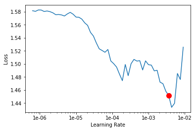
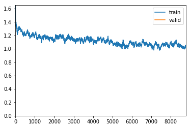
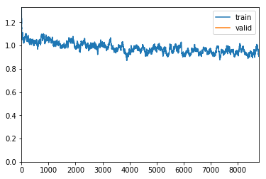
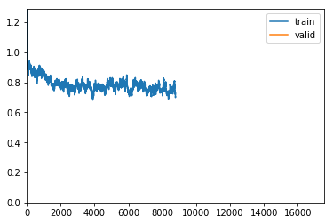

# Fastai with HuggingFace 🤗Transformers (BERT, RoBERTa, XLNet, XLM, DistilBERT)


注意：此实现是中型文章[“带有🤗Transformers（BERT，RoBERTa，XLNet，XLM，DistilBERT）的Fastai”的补充](https://medium.com/p/fastai-with-transformers-bert-roberta-xlnet-xlm-distilbert-4f41ee18ecb2?source=email-29c8f5cf1dc4--writer.postDistributed&sk=119c3e5d748b2827af3ea863faae6376)。

# 简介：NLP中的转移学习故事

在2018年初，Jeremy Howard（fast.ai的共同创始人）和Sebastian Ruder推出了[用于文本分类](https://medium.com/r/?url=https%3A%2F%2Farxiv.org%2Fpdf%2F1801.06146.pdf)的[通用语言模型微调](https://medium.com/r/?url=https%3A%2F%2Farxiv.org%2Fpdf%2F1801.06146.pdf)（ULMFiT）方法。ULMFiT是应用于NLP 的第一种**转移学习**方法。结果，除了明显胜过许多最先进的任务外，它还允许仅用100个带标签的示例来匹配等同于使用100倍以上数据训练的模型的性能。

我第一次听说ULMFiT是在Jeremy Howard提供的[fast.ai课程中](https://course.fast.ai/videos/?lesson=4)。由于`fastai`库的原因，他演示了用几行代码实现完整的ULMFit方法是多么容易。在他的演示中，他使用了在Wikitext-103上进行预训练的AWD-LSTM神经网络，并迅速获得了最新技术成果。他还解释了关键技术（也已在ULMFiT中进行了演示），以微调“ **区分学习率”**，“ **逐步解冻”**或“ **倾斜三角学习率”等模型**。

自从引入ULMFiT之后，**Transfer Learning**在NLP中变得非常流行，但是Google（BERT，Transformer-XL，XLNet），Facebook（RoBERTa，XLM）甚至OpenAI（GPT，GPT-2）都开始对其模型进行预训练。在很大的语料库上。这次，他们都没有使用AWD-LSTM神经网络，而是都使用了基于Transformer的更强大的体系结构（请[注意，这是您所需要的全部](https://arxiv.org/abs/1706.03762)）。

尽管这些模型功能强大，但是`fastai`请不要将所有模型都集成在一起。幸运的是，[HuggingFace🤗](https://huggingface.co/)创建了众所周知的[变压器库](https://github.com/huggingface/transformers)。该库以前称为`pytorch-transformers`or `pytorch-pretrained-bert`，它汇集了40多种经过预训练的最新NLP模型（BERT，GPT-2，RoBERTa，CTRL…）。该实现提供了有趣的其他实用程序，例如令牌生成器，优化器或调度程序。

该`transformers`库可以是自给自足的，但是将其合并到`fastai`库中可以提供与功能强大的fastai工具兼容的更简单的实现，例如**区分学习率**，**逐步解冻**或**倾斜的三角形学习率**。这里的目的是让任何人（无论是专家还是非专家）都可以轻松获得最新结果，并“再次使NLP不再酷炫”。

值得注意的是，已经在以下方面演示了HuggingFace `transformers`库的集成`fastai`：

- Keita Kurita的文章[“使用Fast AI精炼BERT的教程”](https://mlexplained.com/2019/05/13/a-tutorial-to-fine-tuning-bert-with-fast-ai/)使`pytorch_pretrained_bert`图书馆与兼容`fastai`。
- Dev Sharma的文章[将RoBERTa与Fastai一起用于NLP](https://medium.com/analytics-vidhya/using-roberta-with-fastai-for-nlp-7ed3fed21f6c)，这使`pytorch_transformers`库与兼容`fastai`。

尽管这些文章的质量很高，但其演示的某些部分不再与的最新版本兼容`transformers`。

# 🛠 fast将变压器与Fastai集成以进行多类分类

在开始实施之前，请注意可以以多种不同方式完成`transformers`内部集成`fastai`。因此，我决定提供最通用，最灵活的简单解决方案。更准确地说，我尝试在两个库中进行最少的修改，同时使其与最大数量的转换器体系结构兼容。

请注意，除了本“笔记本”和“ [中型”文章外](https://medium.com/p/fastai-with-transformers-bert-roberta-xlnet-xlm-distilbert-4f41ee18ecb2?source=email-29c8f5cf1dc4--writer.postDistributed&sk=119c3e5d748b2827af3ea863faae6376)，我还在GitHub上提供了另一个版本（TODO添加链接）。

## 图书馆安装

在开始实施之前，您需要安装`fastai`和`transformers`库。为此，只需按照[此处](https://github.com/fastai/fastai/blob/master/README.md#installation)和[此处](https://github.com/huggingface/transformers#installation)的说明进行操作。

在Kaggle中，该`fastai`库已安装。因此，您只需要安装`transformers`：

In [1]:

```python
%%bash
pip install -q transformers
```

In [2]:

```python
import numpy as np # linear algebra
import pandas as pd # data processing, CSV file I/O (e.g. pd.read_csv)
from pathlib import Path 

import os

import torch
import torch.optim as optim

import random 

# fastai
from fastai import *
from fastai.text import *
from fastai.callbacks import *

# transformers
from transformers import PreTrainedModel, PreTrainedTokenizer, PretrainedConfig

from transformers import BertForSequenceClassification, BertTokenizer, BertConfig
from transformers import RobertaForSequenceClassification, RobertaTokenizer, RobertaConfig
from transformers import XLNetForSequenceClassification, XLNetTokenizer, XLNetConfig
from transformers import XLMForSequenceClassification, XLMTokenizer, XLMConfig
from transformers import DistilBertForSequenceClassification, DistilBertTokenizer, DistilBertConfig
```

fastai和Transformers库的当前版本分别为1.0.58和2.5.1。

In [3]:

```python
import fastai
import transformers
print('fastai version :', fastai.__version__)
print('transformers version :', transformers.__version__)
fastai version : 1.0.58
transformers version : 2.5.1
```

## 🎬 task示例任务

选择的任务是“ [电影评论”](https://www.kaggle.com/c/sentiment-analysis-on-movie-reviews/overview)上的多类文本分类。

对于每个文本电影评论，模型必须预测情感的标签。我们评估模型输出的分类精度。情感标签是：

- 0→负
- 1→有点消极
- 2→中立
- 3→有点积极
- 4→正

数据被加载到`DataFrame`using中`pandas`。

In [4]:

```python
for dirname, _, filenames in os.walk('/kaggle/input'):
    for filename in filenames:
        print(os.path.join(dirname, filename))
/kaggle/input/sentiment-analysis-on-movie-reviews/test.tsv.zip
/kaggle/input/sentiment-analysis-on-movie-reviews/train.tsv.zip
/kaggle/input/sentiment-analysis-on-movie-reviews/sampleSubmission.csv
```

In [5]:

```python
DATA_ROOT = Path("..") / "/kaggle/input/sentiment-analysis-on-movie-reviews"
train = pd.read_csv(DATA_ROOT / 'train.tsv.zip', sep="\t")
test = pd.read_csv(DATA_ROOT / 'test.tsv.zip', sep="\t")
print(train.shape,test.shape)
train.head()
```

```
(156060, 4) (66292, 3)
```

Out[5]:

|      | PhraseId | SentenceId | Phrase                                            | Sentiment |
| :--- | :------- | :--------- | :------------------------------------------------ | :-------- |
| 0    | 1        | 1          | A series of escapades demonstrating the adage ... | 1         |
| 1    | 2        | 1          | A series of escapades demonstrating the adage ... | 2         |
| 2    | 3        | 1          | A series                                          | 2         |
| 3    | 4        | 1          | A                                                 | 2         |
| 4    | 5        | 1          | series                                            | 2         |

值得注意的是，在数据集中没有单独的电影评论，而是从上下文中取出并分成较小部分的短语，每个部分都有指定的情感标签。

## 主变压器类

在中`transformers`，每种模型架构都与3种主要类型的类别相关联：

- 一个**模型类**到加载/存储特定预系模型。
- 一个**标记生成器类**预先处理的数据并使其与特定型号兼容。
- 一个**配置类，**用于加载/存储特定模型的配置。

例如，如果你想使用BERT架构进行文本分类，你可以使用[`BertForSequenceClassification`](https://huggingface.co/transformers/model_doc/bert.html#bertforsequenceclassification)的**模型类**，[`BertTokenizer`](https://huggingface.co/transformers/model_doc/bert.html#berttokenizer)用于**标记生成器类**，并[`BertConfig`](https://huggingface.co/transformers/model_doc/bert.html#bertconfig)为**配置类**。

为了在类之间轻松切换（每个类都与特定的模型类型相关），我创建了一个字典，该字典允许通过仅指定正确的模型类型名称来加载正确的类。

In [6]:

```python
MODEL_CLASSES = {
    'bert': (BertForSequenceClassification, BertTokenizer, BertConfig),
    'xlnet': (XLNetForSequenceClassification, XLNetTokenizer, XLNetConfig),
    'xlm': (XLMForSequenceClassification, XLMTokenizer, XLMConfig),
    'roberta': (RobertaForSequenceClassification, RobertaTokenizer, RobertaConfig),
    'distilbert': (DistilBertForSequenceClassification, DistilBertTokenizer, DistilBertConfig)
}
```

稍后您将看到，这些类共享一个通用的类方法`from_pretrained(pretrained_model_name, ...)`。在我们的例子中，参数`pretrained_model_name`是一个字符串，带有要加载的预训练模型/令牌/配置的快捷方式名称，例如`'bert-base-uncased'`。我们可以在[此处](https://huggingface.co/transformers/pretrained_models.html#pretrained-models)的变压器文档中找到所有快捷方式名称。

In [7]:

```python
# Parameters
seed = 42
use_fp16 = False
bs = 16

model_type = 'roberta'
pretrained_model_name = 'roberta-base'

# model_type = 'bert'
# pretrained_model_name='bert-base-uncased'

# model_type = 'distilbert'
# pretrained_model_name = 'distilbert-base-uncased'

#model_type = 'xlm'
#pretrained_model_name = 'xlm-clm-enfr-1024'

# model_type = 'xlnet'
# pretrained_model_name = 'xlnet-base-cased'
```

In [8]:

```python
model_class, tokenizer_class, config_class = MODEL_CLASSES[model_type]
```

打印与所使用的`pretrained_model_name`（快捷方式名称）相对应的可用值`model_type`。

In [9]:

```python
model_class.pretrained_model_archive_map.keys()
```

Out[9]:

```python
dict_keys(['roberta-base', 'roberta-large', 'roberta-large-mnli', 'distilroberta-base', 'roberta-base-openai-detector', 'roberta-large-openai-detector'])
```

值得注意的是，在这种情况下，我们`transformers`仅将库用于多类文本分类任务。因此，本教程仅集成了已实现序列分类模型的转换器体系结构。这些模型类型是：

- BERT（来自Google）
- XLNet（来自Google / CMU）
- XLM（来自Facebook）
- RoBERTa（来自Facebook）
- DistilBERT（来自HuggingFace）

但是，如果您想走得更远-通过实现另一种类型的模型或NLP任务-本教程仍然是一个很好的入门。

## 实用功能

设置种子以生成随机数的功能。

In [10]:

```python
def seed_all(seed_value):
    random.seed(seed_value) # Python
    np.random.seed(seed_value) # cpu vars
    torch.manual_seed(seed_value) # cpu  vars
    
    if torch.cuda.is_available(): 
        torch.cuda.manual_seed(seed_value)
        torch.cuda.manual_seed_all(seed_value) # gpu vars
        torch.backends.cudnn.deterministic = True  #needed
        torch.backends.cudnn.benchmark = False
```

In [11]:

```python
seed_all(seed)
```

## 数据预处理

为了匹配预训练，我们必须将模型输入序列格式化为特定格式。为此，您必须先**标记化**然后正确**数字**化文本。这里的困难在于，我们将进行微调的每个预训练模型都需要 与预训练部分中使用的预处理完全相同的特定预处理（  **标记化**和**数字****化**）。幸运的是，**tokenizer类**从中`transformers`提供了与每个预先训练的模型相对应的正确的预处理工具。

在该`fastai`库中，创建时会自动完成数据预处理`DataBunch`。正如您将在`DataBunch`实现中看到的那样，**令牌化器**和**数字****化**器以以下格式在处理器参数中传递：

```python
processor = [TokenizeProcessor(tokenizer=tokenizer,...), NumericalizeProcessor(vocab=vocab,...)]
```

首先，让我们分析一下如何将`transformers` **标记**器集成到`TokenizeProcessor`函数中。

### 自订分词器

这部分可能会造成一些混乱，因为许多类相互包裹并且名称相似。继续，如果我们仔细地看一下`fastai`实现，我们注意到：

1. 该[`TokenizeProcessor`对象](https://docs.fast.ai/text.data.html#TokenizeProcessor)将`tokenizer`一个`Tokenizer`对象作为参数。
2. 该[`Tokenizer`对象](https://docs.fast.ai/text.transform.html#Tokenizer)将`tok_func`一个`BaseTokenizer`对象作为参数。
3. 该[`BaseTokenizer`对象](https://docs.fast.ai/text.transform.html#BaseTokenizer)实现`tokenizer(t:str) → List[str]`接受文本`t`并返回其令牌列表的功能。

因此，我们可以简单地创建一个`TransformersBaseTokenizer`继承`BaseTokenizer`并覆盖新`tokenizer`函数的新类。

In [12]:

```python
class TransformersBaseTokenizer(BaseTokenizer):
    """Wrapper around PreTrainedTokenizer to be compatible with fast.ai"""
    def __init__(self, pretrained_tokenizer: PreTrainedTokenizer, model_type = 'bert', **kwargs):
        self._pretrained_tokenizer = pretrained_tokenizer
        self.max_seq_len = pretrained_tokenizer.max_len
        self.model_type = model_type

    def __call__(self, *args, **kwargs): 
        return self

    def tokenizer(self, t:str) -> List[str]:
        """Limits the maximum sequence length and add the spesial tokens"""
        CLS = self._pretrained_tokenizer.cls_token
        SEP = self._pretrained_tokenizer.sep_token
        if self.model_type in ['roberta']:
            tokens = self._pretrained_tokenizer.tokenize(t, add_prefix_space=True)[:self.max_seq_len - 2]
            tokens = [CLS] + tokens + [SEP]
        else:
            tokens = self._pretrained_tokenizer.tokenize(t)[:self.max_seq_len - 2]
            if self.model_type in ['xlnet']:
                tokens = tokens + [SEP] +  [CLS]
            else:
                tokens = [CLS] + tokens + [SEP]
        return tokens
```

In [13]:

```python
transformer_tokenizer = tokenizer_class.from_pretrained(pretrained_model_name)
transformer_base_tokenizer = TransformersBaseTokenizer(pretrained_tokenizer = transformer_tokenizer, model_type = model_type)
fastai_tokenizer = Tokenizer(tok_func = transformer_base_tokenizer, pre_rules=[], post_rules=[])
```

Downloading: 100%

899k/899k [00:01<00:00, 709kB/s]

Downloading: 100%

456k/456k [00:00<00:00, 1.37MB/s]

在此实现中，请注意以下三点：

1. 由于我们不使用RNN，因此必须将序列长度限制为模型输入大小。
2. 大多数模型需要在序列的开头和结尾放置特殊的令牌。
3. 诸如RoBERTa之类的某些模型需要空格来开始输入字符串。对于这些模型，应使用`add_prefix_space`设置为来调用编码方法`True`。

在下面，您可以找到本教程中使用的5种模型类型的每个预处理要求的简历。您还可以在每个模型部分的[HuggingFace文档](https://huggingface.co/transformers/)中找到此信息。

```
bert:       [CLS] + tokens + [SEP] + padding

roberta:    [CLS] + prefix_space + tokens + [SEP] + padding

distilbert: [CLS] + tokens + [SEP] + padding

xlm:        [CLS] + tokens + [SEP] + padding

xlnet:      padding + tokens + [SEP] + [CLS]
```

值得注意的是，我们没有在实现的这一部分中添加填充。稍后我们将看到，`fastai`在创建时自动对其进行管理`DataBunch`。

### 自定义数字化器

在`fastai`，[`NumericalizeProcessor`对象](https://docs.fast.ai/text.data.html#NumericalizeProcessor)采用作为`vocab`参数一个[`Vocab`对象](https://docs.fast.ai/text.transform.html#Vocab)。通过此分析，我们提出了两种适配Fastai数字化器的方法：

1. 您可以像[Dev Sharma的文章](https://medium.com/analytics-vidhya/using-roberta-with-fastai-for-nlp-7ed3fed21f6c)（第*1*节*。设置*令牌生成器）中所述，检索令牌列表并创建一个`Vocab`对象。
2. 创建一个新的类`TransformersVocab`，从继承`Vocab`和覆盖`numericalize`和`textify`功能。

即使第一个解决方案似乎更简单，`Transformers`也无法为所有模型提供一种简单的方法来检索其代币列表。因此，我实现了第二种解决方案，该解决方案针对每种模型类型运行。它由使用的功能的`convert_tokens_to_ids`和`convert_ids_to_tokens`分别在`numericalize`和`textify`。

In [14]:

```python
class TransformersVocab(Vocab):
    def __init__(self, tokenizer: PreTrainedTokenizer):
        super(TransformersVocab, self).__init__(itos = [])
        self.tokenizer = tokenizer
    
    def numericalize(self, t:Collection[str]) -> List[int]:
        "Convert a list of tokens `t` to their ids."
        return self.tokenizer.convert_tokens_to_ids(t)
        #return self.tokenizer.encode(t)

    def textify(self, nums:Collection[int], sep=' ') -> List[str]:
        "Convert a list of `nums` to their tokens."
        nums = np.array(nums).tolist()
        return sep.join(self.tokenizer.convert_ids_to_tokens(nums)) if sep is not None else self.tokenizer.convert_ids_to_tokens(nums)
    
    def __getstate__(self):
        return {'itos':self.itos, 'tokenizer':self.tokenizer}

    def __setstate__(self, state:dict):
        self.itos = state['itos']
        self.tokenizer = state['tokenizer']
        self.stoi = collections.defaultdict(int,{v:k for k,v in enumerate(self.itos)})
```

注：该功能`__gestate__`并`__setstate__`允许职能[出口](https://docs.fast.ai/basic_train.html#Learner.export)和[load_learner](https://docs.fast.ai/basic_train.html#load_learner)工作正确地`TransformersVocab`。

### 定制处理器

现在我们有了自定义**标记器**和**数字化器**，我们可以创建自定义**处理器**。请注意，我们正在传递`include_bos = False`和`include_eos = False`选项。这是因为`fastai`默认情况下会添加自己的特殊令牌，这会干扰我们的自定义令牌生成器添加的`[CLS]`和`[SEP]`令牌。

In [15]:

```python
transformer_vocab =  TransformersVocab(tokenizer = transformer_tokenizer)
numericalize_processor = NumericalizeProcessor(vocab=transformer_vocab)

tokenize_processor = TokenizeProcessor(tokenizer=fastai_tokenizer, include_bos=False, include_eos=False)

transformer_processor = [tokenize_processor, numericalize_processor]
```

## 设置数据绑定

对于创建DataBunch，您必须注意将Processor参数设置为新的自定义处理器，`transformer_processor`并正确管理填充。

如HuggingFace文档中所述，BERT，RoBERTa，XLM和DistilBERT是具有绝对位置嵌入的模型，因此通常建议在右侧而不是左侧填充输入。对于XLNET，这是一个具有相对位置嵌入的模型，因此，您可以在右侧或左侧填充输入。

In [16]:

```python
pad_first = bool(model_type in ['xlnet'])
pad_idx = transformer_tokenizer.pad_token_id
```

In [17]:

```python
tokens = transformer_tokenizer.tokenize('Salut c est moi, Hello it s me')
print(tokens)
ids = transformer_tokenizer.convert_tokens_to_ids(tokens)
print(ids)
transformer_tokenizer.convert_ids_to_tokens(ids)
['Sal', 'ut', 'Ġc', 'Ġest', 'Ġmo', 'i', ',', 'ĠHello', 'Ġit', 'Ġs', 'Ġme']
[18111, 1182, 740, 3304, 7458, 118, 6, 20920, 24, 579, 162]
```

Out[17]:

```
['Sal', 'ut', 'Ġc', 'Ġest', 'Ġmo', 'i', ',', 'ĠHello', 'Ġit', 'Ġs', 'Ġme']
```

创建DataBunch有多种方法，在我们的实现中，我们使用[数据块API](https://docs.fast.ai/data_block.html#The-data-block-API)，它提供了更大的灵活性。

In [18]:

```python
databunch = (TextList.from_df(train, cols='Phrase', processor=transformer_processor)
             .split_by_rand_pct(0.1,seed=seed)
             .label_from_df(cols= 'Sentiment')
             .add_test(test)
             .databunch(bs=bs, pad_first=pad_first, pad_idx=pad_idx))
```

检查批处理和令牌生成器：

In [19]:

```python
print('[CLS] token :', transformer_tokenizer.cls_token)
print('[SEP] token :', transformer_tokenizer.sep_token)
print('[PAD] token :', transformer_tokenizer.pad_token)
databunch.show_batch()

```
```
[CLS] token : <s>
[SEP] token : </s>
[PAD] token : <pad>
    
| text                                                         | target |
| :----------------------------------------------------------- | :----- |
| <s> Ġ- L RB - ĠCity Ġ- RR B - Ġreminds Ġus Ġhow Ġrealistically Ġnuanced Ġa ĠRobert ĠDe ĠN iro Ġperformance Ġcan Ġbe Ġwhen Ġhe Ġis Ġnot Ġmore Ġluc r atively Ġengaged Ġin Ġthe Ġshameless Ġself - car ic ature Ġof Ġ` ĠAnaly ze ĠThis Ġ' Ġ- L RB - Ġ1999 Ġ- RR B - Ġand Ġ` ĠAnaly ze ĠThat Ġ, Ġ' Ġpromised Ġ- L RB - Ġor Ġthreatened Ġ- | 3      |
| <s> ĠThe Ġreal Ġtriumph s Ġin ĠIg by Ġcome Ġfrom ĠPhilippe Ġ, Ġwho Ġmakes ĠOliver Ġfar Ġmore Ġinteresting Ġthan Ġthe Ġcharacter Ġ' s Ġlines Ġwould Ġsuggest Ġ, Ġand ĠSar andon Ġ, Ġwho Ġcould Ġn 't Ġbe Ġbetter Ġas Ġa Ġcruel Ġbut Ġweird ly Ġlik able ĠWAS P Ġmat ron Ġ. </s> | 3      |
| <s> ĠParker Ġshould Ġbe Ġcomm ended Ġfor Ġtaking Ġa Ġfresh Ġapproach Ġto Ġfamiliar Ġmaterial Ġ, Ġbut Ġhis Ġdetermination Ġto Ġremain Ġtrue Ġto Ġthe Ġoriginal Ġtext Ġleads Ġhim Ġto Ġadopt Ġa Ġsomewhat Ġman nered Ġtone Ġ... Ġthat Ġultimately Ġdull s Ġthe Ġhuman Ġtragedy Ġat Ġthe Ġstory Ġ' s Ġcore </s> | 2      |
| <s> ĠIt Ġ' s Ġa Ġlong Ġway Ġfrom ĠOrwell Ġ' s Ġdark Ġ, Ġintelligent Ġwarning Ġcry Ġ- L RB - Ġ1984 Ġ- RR B - Ġto Ġthe Ġempty Ġstud Ġknock about Ġof ĠEqu ilibrium Ġ, Ġand Ġwhat Ġonce Ġwas Ġconviction Ġis Ġnow Ġaffect ation Ġ. </s> | 1      |
| <s> ĠA Ġdifferent Ġand Ġemotionally Ġreserved Ġtype Ġof Ġsurvival Ġstory Ġ-- Ġa Ġfilm Ġless Ġabout Ġref ract ing Ġall Ġof ĠWorld ĠWar ĠII Ġthrough Ġthe Ġspecific Ġconditions Ġof Ġone Ġman Ġ, Ġand Ġmore Ġabout Ġthat Ġman Ġlost Ġin Ġits Ġmidst Ġ. </s> | 3      |
```

检查批处理和数字化器：

In [20]:

```python
print('[CLS] id :', transformer_tokenizer.cls_token_id)
print('[SEP] id :', transformer_tokenizer.sep_token_id)
print('[PAD] id :', pad_idx)
test_one_batch = databunch.one_batch()[0]
print('Batch shape : ',test_one_batch.shape)
print(test_one_batch)

```
```
[CLS] id : 0
[SEP] id : 2
[PAD] id : 1
Batch shape :  torch.Size([16, 79])
tensor([[    0,   111,   574,  ...,    76,   479,     2],
        [    0,    33,     7,  ...,     1,     1,     1],
        [    0,   318,    47,  ...,     1,     1,     1],
        ...,
        [    0,     5,  2156,  ...,     1,     1,     1],
        [    0,    33, 30291,  ...,     1,     1,     1],
        [    0, 45518, 10730,  ...,     1,     1,     1]])
```
    
### 定制模型

如所提到的[在这里](https://github.com/huggingface/transformers#models-always-output-tuples)，每一个模型的正向方法总是输出一个`tuple`具有取决于模型中的各种元件和配置参数。在我们的情况下，我们只希望访问logits。访问它们的一种方法是创建自定义模型。

In [21]:

```python
# defining our model architecture 
class CustomTransformerModel(nn.Module):
    def __init__(self, transformer_model: PreTrainedModel):
        super(CustomTransformerModel,self).__init__()
        self.transformer = transformer_model
        
    def forward(self, input_ids, attention_mask=None):
        
        # attention_mask
        # Mask to avoid performing attention on padding token indices.
        # Mask values selected in ``[0, 1]``:
        # ``1`` for tokens that are NOT MASKED, ``0`` for MASKED tokens.
        attention_mask = (input_ids!=pad_idx).type(input_ids.type()) 
        
        logits = self.transformer(input_ids,
                                  attention_mask = attention_mask)[0]   
        return logits
```

为了使我们的变压器适应多类分类，在加载预训练模型之前，我们需要精确标记的数量。为此，您可以修改config实例，也可以像[Keita Kurita的文章](https://mlexplained.com/2019/05/13/a-tutorial-to-fine-tuning-bert-with-fast-ai/)（部分：*Initialize the Learner*）中的`num_labels`参数那样进行修改。

In [22]:

```python
config = config_class.from_pretrained(pretrained_model_name)
config.num_labels = 5
config.use_bfloat16 = use_fp16
print(config)
```

Downloading: 100%

524/524 [00:00<00:00, 881B/s]

```python
RobertaConfig {
  "architectures": [
    "RobertaForMaskedLM"
  ],
  "attention_probs_dropout_prob": 0.1,
  "bos_token_id": null,
  "do_sample": false,
  "eos_token_ids": null,
  "finetuning_task": null,
  "hidden_act": "gelu",
  "hidden_dropout_prob": 0.1,
  "hidden_size": 768,
  "id2label": {
    "0": "LABEL_0",
    "1": "LABEL_1"
  },
  "initializer_range": 0.02,
  "intermediate_size": 3072,
  "is_decoder": false,
  "label2id": {
    "LABEL_0": 0,
    "LABEL_1": 1
  },
  "layer_norm_eps": 1e-05,
  "length_penalty": 1.0,
  "max_length": 20,
  "max_position_embeddings": 514,
  "model_type": "roberta",
  "num_attention_heads": 12,
  "num_beams": 1,
  "num_hidden_layers": 12,
  "num_labels": 5,
  "num_return_sequences": 1,
  "output_attentions": false,
  "output_hidden_states": false,
  "output_past": true,
  "pad_token_id": null,
  "pruned_heads": {},
  "repetition_penalty": 1.0,
  "temperature": 1.0,
  "top_k": 50,
  "top_p": 1.0,
  "torchscript": false,
  "type_vocab_size": 1,
  "use_bfloat16": false,
  "vocab_size": 50265
}
```

In [23]:

```python
transformer_model = model_class.from_pretrained(pretrained_model_name, config = config)
# transformer_model = model_class.from_pretrained(pretrained_model_name, num_labels = 5)

custom_transformer_model = CustomTransformerModel(transformer_model = transformer_model)
```

Downloading: 100%

501M/501M [00:13<00:00, 36.2MB/s]

## 学习者：自定义优化器/自定义指标

在中`pytorch-transformers`，HuggingFace实现了两个特定的优化器-BertAdam和OpenAIAdam-已由单个AdamW优化器代替。该优化器与Pytorch Adam优化器Api相匹配，因此，将其集成到中变得很简单`fastai`。值得注意的是，要重现BertAdam的特定行为，必须设置`correct_bias = False`。

In [24]:

```python
from fastai.callbacks import *
from transformers import AdamW
from functools import partial

CustomAdamW = partial(AdamW, correct_bias=False)

learner = Learner(databunch, 
                  custom_transformer_model, 
                  opt_func = CustomAdamW, 
                  metrics=[accuracy, error_rate])

# Show graph of learner stats and metrics after each epoch.
learner.callbacks.append(ShowGraph(learner))

# Put learn in FP16 precision mode. --> Seems to not working
if use_fp16: learner = learner.to_fp16()
```

## 区分性微调和逐步解冻（可选）

要使用**判别层训练**和**逐步解冻**，`fastai`提供了一种工具，该工具可以将结构模型“拆分”为组。的指令来执行“拆分”是fastai文档中描述[这里](https://docs.fast.ai/basic_train.html#Discriminative-layer-training)。

不幸的是，模型架构差异太大，无法创建可以以方便的方式“拆分”所有模型类型的独特通用函数。因此，您将必须为每个不同的模型体系结构实现自定义“拆分”。

例如，如果我们使用RobBERTa模型，并且通过观察他的体系结构`print(learner.model)`。

In [25]:

```python
print(learner.model)
```
```
CustomTransformerModel(
  (transformer): RobertaForSequenceClassification(
    (roberta): RobertaModel(
      (embeddings): RobertaEmbeddings(
        (word_embeddings): Embedding(50265, 768, padding_idx=1)
        (position_embeddings): Embedding(514, 768, padding_idx=1)
        (token_type_embeddings): Embedding(1, 768)
        (LayerNorm): LayerNorm((768,), eps=1e-05, elementwise_affine=True)
        (dropout): Dropout(p=0.1, inplace=False)
      )
      (encoder): BertEncoder(
        (layer): ModuleList(
          (0): BertLayer(
            (attention): BertAttention(
              (self): BertSelfAttention(
                (query): Linear(in_features=768, out_features=768, bias=True)
                (key): Linear(in_features=768, out_features=768, bias=True)
                (value): Linear(in_features=768, out_features=768, bias=True)
                (dropout): Dropout(p=0.1, inplace=False)
              )
              (output): BertSelfOutput(
                (dense): Linear(in_features=768, out_features=768, bias=True)
                (LayerNorm): LayerNorm((768,), eps=1e-05, elementwise_affine=True)
                (dropout): Dropout(p=0.1, inplace=False)
              )
            )
            (intermediate): BertIntermediate(
              (dense): Linear(in_features=768, out_features=3072, bias=True)
            )
            (output): BertOutput(
              (dense): Linear(in_features=3072, out_features=768, bias=True)
              (LayerNorm): LayerNorm((768,), eps=1e-05, elementwise_affine=True)
              (dropout): Dropout(p=0.1, inplace=False)
            )
          )
          (1): BertLayer(
            (attention): BertAttention(
              (self): BertSelfAttention(
                (query): Linear(in_features=768, out_features=768, bias=True)
                (key): Linear(in_features=768, out_features=768, bias=True)
                (value): Linear(in_features=768, out_features=768, bias=True)
                (dropout): Dropout(p=0.1, inplace=False)
              )
              (output): BertSelfOutput(
                (dense): Linear(in_features=768, out_features=768, bias=True)
                (LayerNorm): LayerNorm((768,), eps=1e-05, elementwise_affine=True)
                (dropout): Dropout(p=0.1, inplace=False)
              )
            )
            (intermediate): BertIntermediate(
              (dense): Linear(in_features=768, out_features=3072, bias=True)
            )
            (output): BertOutput(
              (dense): Linear(in_features=3072, out_features=768, bias=True)
              (LayerNorm): LayerNorm((768,), eps=1e-05, elementwise_affine=True)
              (dropout): Dropout(p=0.1, inplace=False)
            )
          )
          (2): BertLayer(
            (attention): BertAttention(
              (self): BertSelfAttention(
                (query): Linear(in_features=768, out_features=768, bias=True)
                (key): Linear(in_features=768, out_features=768, bias=True)
                (value): Linear(in_features=768, out_features=768, bias=True)
                (dropout): Dropout(p=0.1, inplace=False)
              )
              (output): BertSelfOutput(
                (dense): Linear(in_features=768, out_features=768, bias=True)
                (LayerNorm): LayerNorm((768,), eps=1e-05, elementwise_affine=True)
                (dropout): Dropout(p=0.1, inplace=False)
              )
            )
            (intermediate): BertIntermediate(
              (dense): Linear(in_features=768, out_features=3072, bias=True)
            )
            (output): BertOutput(
              (dense): Linear(in_features=3072, out_features=768, bias=True)
              (LayerNorm): LayerNorm((768,), eps=1e-05, elementwise_affine=True)
              (dropout): Dropout(p=0.1, inplace=False)
            )
          )
          (3): BertLayer(
            (attention): BertAttention(
              (self): BertSelfAttention(
                (query): Linear(in_features=768, out_features=768, bias=True)
                (key): Linear(in_features=768, out_features=768, bias=True)
                (value): Linear(in_features=768, out_features=768, bias=True)
                (dropout): Dropout(p=0.1, inplace=False)
              )
              (output): BertSelfOutput(
                (dense): Linear(in_features=768, out_features=768, bias=True)
                (LayerNorm): LayerNorm((768,), eps=1e-05, elementwise_affine=True)
                (dropout): Dropout(p=0.1, inplace=False)
              )
            )
            (intermediate): BertIntermediate(
              (dense): Linear(in_features=768, out_features=3072, bias=True)
            )
            (output): BertOutput(
              (dense): Linear(in_features=3072, out_features=768, bias=True)
              (LayerNorm): LayerNorm((768,), eps=1e-05, elementwise_affine=True)
              (dropout): Dropout(p=0.1, inplace=False)
            )
          )
          (4): BertLayer(
            (attention): BertAttention(
              (self): BertSelfAttention(
                (query): Linear(in_features=768, out_features=768, bias=True)
                (key): Linear(in_features=768, out_features=768, bias=True)
                (value): Linear(in_features=768, out_features=768, bias=True)
                (dropout): Dropout(p=0.1, inplace=False)
              )
              (output): BertSelfOutput(
                (dense): Linear(in_features=768, out_features=768, bias=True)
                (LayerNorm): LayerNorm((768,), eps=1e-05, elementwise_affine=True)
                (dropout): Dropout(p=0.1, inplace=False)
              )
            )
            (intermediate): BertIntermediate(
              (dense): Linear(in_features=768, out_features=3072, bias=True)
            )
            (output): BertOutput(
              (dense): Linear(in_features=3072, out_features=768, bias=True)
              (LayerNorm): LayerNorm((768,), eps=1e-05, elementwise_affine=True)
              (dropout): Dropout(p=0.1, inplace=False)
            )
          )
          (5): BertLayer(
            (attention): BertAttention(
              (self): BertSelfAttention(
                (query): Linear(in_features=768, out_features=768, bias=True)
                (key): Linear(in_features=768, out_features=768, bias=True)
                (value): Linear(in_features=768, out_features=768, bias=True)
                (dropout): Dropout(p=0.1, inplace=False)
              )
              (output): BertSelfOutput(
                (dense): Linear(in_features=768, out_features=768, bias=True)
                (LayerNorm): LayerNorm((768,), eps=1e-05, elementwise_affine=True)
                (dropout): Dropout(p=0.1, inplace=False)
              )
            )
            (intermediate): BertIntermediate(
              (dense): Linear(in_features=768, out_features=3072, bias=True)
            )
            (output): BertOutput(
              (dense): Linear(in_features=3072, out_features=768, bias=True)
              (LayerNorm): LayerNorm((768,), eps=1e-05, elementwise_affine=True)
              (dropout): Dropout(p=0.1, inplace=False)
            )
          )
          (6): BertLayer(
            (attention): BertAttention(
              (self): BertSelfAttention(
                (query): Linear(in_features=768, out_features=768, bias=True)
                (key): Linear(in_features=768, out_features=768, bias=True)
                (value): Linear(in_features=768, out_features=768, bias=True)
                (dropout): Dropout(p=0.1, inplace=False)
              )
              (output): BertSelfOutput(
                (dense): Linear(in_features=768, out_features=768, bias=True)
                (LayerNorm): LayerNorm((768,), eps=1e-05, elementwise_affine=True)
                (dropout): Dropout(p=0.1, inplace=False)
              )
            )
            (intermediate): BertIntermediate(
              (dense): Linear(in_features=768, out_features=3072, bias=True)
            )
            (output): BertOutput(
              (dense): Linear(in_features=3072, out_features=768, bias=True)
              (LayerNorm): LayerNorm((768,), eps=1e-05, elementwise_affine=True)
              (dropout): Dropout(p=0.1, inplace=False)
            )
          )
          (7): BertLayer(
            (attention): BertAttention(
              (self): BertSelfAttention(
                (query): Linear(in_features=768, out_features=768, bias=True)
                (key): Linear(in_features=768, out_features=768, bias=True)
                (value): Linear(in_features=768, out_features=768, bias=True)
                (dropout): Dropout(p=0.1, inplace=False)
              )
              (output): BertSelfOutput(
                (dense): Linear(in_features=768, out_features=768, bias=True)
                (LayerNorm): LayerNorm((768,), eps=1e-05, elementwise_affine=True)
                (dropout): Dropout(p=0.1, inplace=False)
              )
            )
            (intermediate): BertIntermediate(
              (dense): Linear(in_features=768, out_features=3072, bias=True)
            )
            (output): BertOutput(
              (dense): Linear(in_features=3072, out_features=768, bias=True)
              (LayerNorm): LayerNorm((768,), eps=1e-05, elementwise_affine=True)
              (dropout): Dropout(p=0.1, inplace=False)
            )
          )
          (8): BertLayer(
            (attention): BertAttention(
              (self): BertSelfAttention(
                (query): Linear(in_features=768, out_features=768, bias=True)
                (key): Linear(in_features=768, out_features=768, bias=True)
                (value): Linear(in_features=768, out_features=768, bias=True)
                (dropout): Dropout(p=0.1, inplace=False)
              )
              (output): BertSelfOutput(
                (dense): Linear(in_features=768, out_features=768, bias=True)
                (LayerNorm): LayerNorm((768,), eps=1e-05, elementwise_affine=True)
                (dropout): Dropout(p=0.1, inplace=False)
              )
            )
            (intermediate): BertIntermediate(
              (dense): Linear(in_features=768, out_features=3072, bias=True)
            )
            (output): BertOutput(
              (dense): Linear(in_features=3072, out_features=768, bias=True)
              (LayerNorm): LayerNorm((768,), eps=1e-05, elementwise_affine=True)
              (dropout): Dropout(p=0.1, inplace=False)
            )
          )
          (9): BertLayer(
            (attention): BertAttention(
              (self): BertSelfAttention(
                (query): Linear(in_features=768, out_features=768, bias=True)
                (key): Linear(in_features=768, out_features=768, bias=True)
                (value): Linear(in_features=768, out_features=768, bias=True)
                (dropout): Dropout(p=0.1, inplace=False)
              )
              (output): BertSelfOutput(
                (dense): Linear(in_features=768, out_features=768, bias=True)
                (LayerNorm): LayerNorm((768,), eps=1e-05, elementwise_affine=True)
                (dropout): Dropout(p=0.1, inplace=False)
              )
            )
            (intermediate): BertIntermediate(
              (dense): Linear(in_features=768, out_features=3072, bias=True)
            )
            (output): BertOutput(
              (dense): Linear(in_features=3072, out_features=768, bias=True)
              (LayerNorm): LayerNorm((768,), eps=1e-05, elementwise_affine=True)
              (dropout): Dropout(p=0.1, inplace=False)
            )
          )
          (10): BertLayer(
            (attention): BertAttention(
              (self): BertSelfAttention(
                (query): Linear(in_features=768, out_features=768, bias=True)
                (key): Linear(in_features=768, out_features=768, bias=True)
                (value): Linear(in_features=768, out_features=768, bias=True)
                (dropout): Dropout(p=0.1, inplace=False)
              )
              (output): BertSelfOutput(
                (dense): Linear(in_features=768, out_features=768, bias=True)
                (LayerNorm): LayerNorm((768,), eps=1e-05, elementwise_affine=True)
                (dropout): Dropout(p=0.1, inplace=False)
              )
            )
            (intermediate): BertIntermediate(
              (dense): Linear(in_features=768, out_features=3072, bias=True)
            )
            (output): BertOutput(
              (dense): Linear(in_features=3072, out_features=768, bias=True)
              (LayerNorm): LayerNorm((768,), eps=1e-05, elementwise_affine=True)
              (dropout): Dropout(p=0.1, inplace=False)
            )
          )
          (11): BertLayer(
            (attention): BertAttention(
              (self): BertSelfAttention(
                (query): Linear(in_features=768, out_features=768, bias=True)
                (key): Linear(in_features=768, out_features=768, bias=True)
                (value): Linear(in_features=768, out_features=768, bias=True)
                (dropout): Dropout(p=0.1, inplace=False)
              )
              (output): BertSelfOutput(
                (dense): Linear(in_features=768, out_features=768, bias=True)
                (LayerNorm): LayerNorm((768,), eps=1e-05, elementwise_affine=True)
                (dropout): Dropout(p=0.1, inplace=False)
              )
            )
            (intermediate): BertIntermediate(
              (dense): Linear(in_features=768, out_features=3072, bias=True)
            )
            (output): BertOutput(
              (dense): Linear(in_features=3072, out_features=768, bias=True)
              (LayerNorm): LayerNorm((768,), eps=1e-05, elementwise_affine=True)
              (dropout): Dropout(p=0.1, inplace=False)
            )
          )
        )
      )
      (pooler): BertPooler(
        (dense): Linear(in_features=768, out_features=768, bias=True)
        (activation): Tanh()
      )
    )
    (classifier): RobertaClassificationHead(
      (dense): Linear(in_features=768, out_features=768, bias=True)
      (dropout): Dropout(p=0.1, inplace=False)
      (out_proj): Linear(in_features=768, out_features=5, bias=True)
    )
  )
)
```

我们可以决定将模型分为14个块：

- 1嵌入
- 12变压器
- 1个分类器

在这种情况下，我们可以按以下方式拆分模型：

In [26]:

```python
# For DistilBERT
# list_layers = [learner.model.transformer.distilbert.embeddings,
#                learner.model.transformer.distilbert.transformer.layer[0],
#                learner.model.transformer.distilbert.transformer.layer[1],
#                learner.model.transformer.distilbert.transformer.layer[2],
#                learner.model.transformer.distilbert.transformer.layer[3],
#                learner.model.transformer.distilbert.transformer.layer[4],
#                learner.model.transformer.distilbert.transformer.layer[5],
#                learner.model.transformer.pre_classifier]

# For xlnet-base-cased
# list_layers = [learner.model.transformer.transformer.word_embedding,
#               learner.model.transformer.transformer.layer[0],
#               learner.model.transformer.transformer.layer[1],
#               learner.model.transformer.transformer.layer[2],
#               learner.model.transformer.transformer.layer[3],
#               learner.model.transformer.transformer.layer[4],
#               learner.model.transformer.transformer.layer[5],
#               learner.model.transformer.transformer.layer[6],
#               learner.model.transformer.transformer.layer[7],
#               learner.model.transformer.transformer.layer[8],
#               learner.model.transformer.transformer.layer[9],
#               learner.model.transformer.transformer.layer[10],
#               learner.model.transformer.transformer.layer[11],
#               learner.model.transformer.sequence_summary]

# For roberta-base
list_layers = [learner.model.transformer.roberta.embeddings,
              learner.model.transformer.roberta.encoder.layer[0],
              learner.model.transformer.roberta.encoder.layer[1],
              learner.model.transformer.roberta.encoder.layer[2],
              learner.model.transformer.roberta.encoder.layer[3],
              learner.model.transformer.roberta.encoder.layer[4],
              learner.model.transformer.roberta.encoder.layer[5],
              learner.model.transformer.roberta.encoder.layer[6],
              learner.model.transformer.roberta.encoder.layer[7],
              learner.model.transformer.roberta.encoder.layer[8],
              learner.model.transformer.roberta.encoder.layer[9],
              learner.model.transformer.roberta.encoder.layer[10],
              learner.model.transformer.roberta.encoder.layer[11],
              learner.model.transformer.roberta.pooler]
```

Check groups :

In [27]:

```python
learner.split(list_layers)
num_groups = len(learner.layer_groups)
print('Learner split in',num_groups,'groups')
print(learner.layer_groups)
```
```
Learner split in 14 groups
[Sequential(
  (0): Embedding(50265, 768, padding_idx=1)
  (1): Embedding(514, 768, padding_idx=1)
  (2): Embedding(1, 768)
  (3): LayerNorm((768,), eps=1e-05, elementwise_affine=True)
  (4): Dropout(p=0.1, inplace=False)
), Sequential(
  (0): Linear(in_features=768, out_features=768, bias=True)
  (1): Linear(in_features=768, out_features=768, bias=True)
  (2): Linear(in_features=768, out_features=768, bias=True)
  (3): Dropout(p=0.1, inplace=False)
  (4): Linear(in_features=768, out_features=768, bias=True)
  (5): LayerNorm((768,), eps=1e-05, elementwise_affine=True)
  (6): Dropout(p=0.1, inplace=False)
  (7): Linear(in_features=768, out_features=3072, bias=True)
  (8): Linear(in_features=3072, out_features=768, bias=True)
  (9): LayerNorm((768,), eps=1e-05, elementwise_affine=True)
  (10): Dropout(p=0.1, inplace=False)
), Sequential(
  (0): Linear(in_features=768, out_features=768, bias=True)
  (1): Linear(in_features=768, out_features=768, bias=True)
  (2): Linear(in_features=768, out_features=768, bias=True)
  (3): Dropout(p=0.1, inplace=False)
  (4): Linear(in_features=768, out_features=768, bias=True)
  (5): LayerNorm((768,), eps=1e-05, elementwise_affine=True)
  (6): Dropout(p=0.1, inplace=False)
  (7): Linear(in_features=768, out_features=3072, bias=True)
  (8): Linear(in_features=3072, out_features=768, bias=True)
  (9): LayerNorm((768,), eps=1e-05, elementwise_affine=True)
  (10): Dropout(p=0.1, inplace=False)
), Sequential(
  (0): Linear(in_features=768, out_features=768, bias=True)
  (1): Linear(in_features=768, out_features=768, bias=True)
  (2): Linear(in_features=768, out_features=768, bias=True)
  (3): Dropout(p=0.1, inplace=False)
  (4): Linear(in_features=768, out_features=768, bias=True)
  (5): LayerNorm((768,), eps=1e-05, elementwise_affine=True)
  (6): Dropout(p=0.1, inplace=False)
  (7): Linear(in_features=768, out_features=3072, bias=True)
  (8): Linear(in_features=3072, out_features=768, bias=True)
  (9): LayerNorm((768,), eps=1e-05, elementwise_affine=True)
  (10): Dropout(p=0.1, inplace=False)
), Sequential(
  (0): Linear(in_features=768, out_features=768, bias=True)
  (1): Linear(in_features=768, out_features=768, bias=True)
  (2): Linear(in_features=768, out_features=768, bias=True)
  (3): Dropout(p=0.1, inplace=False)
  (4): Linear(in_features=768, out_features=768, bias=True)
  (5): LayerNorm((768,), eps=1e-05, elementwise_affine=True)
  (6): Dropout(p=0.1, inplace=False)
  (7): Linear(in_features=768, out_features=3072, bias=True)
  (8): Linear(in_features=3072, out_features=768, bias=True)
  (9): LayerNorm((768,), eps=1e-05, elementwise_affine=True)
  (10): Dropout(p=0.1, inplace=False)
), Sequential(
  (0): Linear(in_features=768, out_features=768, bias=True)
  (1): Linear(in_features=768, out_features=768, bias=True)
  (2): Linear(in_features=768, out_features=768, bias=True)
  (3): Dropout(p=0.1, inplace=False)
  (4): Linear(in_features=768, out_features=768, bias=True)
  (5): LayerNorm((768,), eps=1e-05, elementwise_affine=True)
  (6): Dropout(p=0.1, inplace=False)
  (7): Linear(in_features=768, out_features=3072, bias=True)
  (8): Linear(in_features=3072, out_features=768, bias=True)
  (9): LayerNorm((768,), eps=1e-05, elementwise_affine=True)
  (10): Dropout(p=0.1, inplace=False)
), Sequential(
  (0): Linear(in_features=768, out_features=768, bias=True)
  (1): Linear(in_features=768, out_features=768, bias=True)
  (2): Linear(in_features=768, out_features=768, bias=True)
  (3): Dropout(p=0.1, inplace=False)
  (4): Linear(in_features=768, out_features=768, bias=True)
  (5): LayerNorm((768,), eps=1e-05, elementwise_affine=True)
  (6): Dropout(p=0.1, inplace=False)
  (7): Linear(in_features=768, out_features=3072, bias=True)
  (8): Linear(in_features=3072, out_features=768, bias=True)
  (9): LayerNorm((768,), eps=1e-05, elementwise_affine=True)
  (10): Dropout(p=0.1, inplace=False)
), Sequential(
  (0): Linear(in_features=768, out_features=768, bias=True)
  (1): Linear(in_features=768, out_features=768, bias=True)
  (2): Linear(in_features=768, out_features=768, bias=True)
  (3): Dropout(p=0.1, inplace=False)
  (4): Linear(in_features=768, out_features=768, bias=True)
  (5): LayerNorm((768,), eps=1e-05, elementwise_affine=True)
  (6): Dropout(p=0.1, inplace=False)
  (7): Linear(in_features=768, out_features=3072, bias=True)
  (8): Linear(in_features=3072, out_features=768, bias=True)
  (9): LayerNorm((768,), eps=1e-05, elementwise_affine=True)
  (10): Dropout(p=0.1, inplace=False)
), Sequential(
  (0): Linear(in_features=768, out_features=768, bias=True)
  (1): Linear(in_features=768, out_features=768, bias=True)
  (2): Linear(in_features=768, out_features=768, bias=True)
  (3): Dropout(p=0.1, inplace=False)
  (4): Linear(in_features=768, out_features=768, bias=True)
  (5): LayerNorm((768,), eps=1e-05, elementwise_affine=True)
  (6): Dropout(p=0.1, inplace=False)
  (7): Linear(in_features=768, out_features=3072, bias=True)
  (8): Linear(in_features=3072, out_features=768, bias=True)
  (9): LayerNorm((768,), eps=1e-05, elementwise_affine=True)
  (10): Dropout(p=0.1, inplace=False)
), Sequential(
  (0): Linear(in_features=768, out_features=768, bias=True)
  (1): Linear(in_features=768, out_features=768, bias=True)
  (2): Linear(in_features=768, out_features=768, bias=True)
  (3): Dropout(p=0.1, inplace=False)
  (4): Linear(in_features=768, out_features=768, bias=True)
  (5): LayerNorm((768,), eps=1e-05, elementwise_affine=True)
  (6): Dropout(p=0.1, inplace=False)
  (7): Linear(in_features=768, out_features=3072, bias=True)
  (8): Linear(in_features=3072, out_features=768, bias=True)
  (9): LayerNorm((768,), eps=1e-05, elementwise_affine=True)
  (10): Dropout(p=0.1, inplace=False)
), Sequential(
  (0): Linear(in_features=768, out_features=768, bias=True)
  (1): Linear(in_features=768, out_features=768, bias=True)
  (2): Linear(in_features=768, out_features=768, bias=True)
  (3): Dropout(p=0.1, inplace=False)
  (4): Linear(in_features=768, out_features=768, bias=True)
  (5): LayerNorm((768,), eps=1e-05, elementwise_affine=True)
  (6): Dropout(p=0.1, inplace=False)
  (7): Linear(in_features=768, out_features=3072, bias=True)
  (8): Linear(in_features=3072, out_features=768, bias=True)
  (9): LayerNorm((768,), eps=1e-05, elementwise_affine=True)
  (10): Dropout(p=0.1, inplace=False)
), Sequential(
  (0): Linear(in_features=768, out_features=768, bias=True)
  (1): Linear(in_features=768, out_features=768, bias=True)
  (2): Linear(in_features=768, out_features=768, bias=True)
  (3): Dropout(p=0.1, inplace=False)
  (4): Linear(in_features=768, out_features=768, bias=True)
  (5): LayerNorm((768,), eps=1e-05, elementwise_affine=True)
  (6): Dropout(p=0.1, inplace=False)
  (7): Linear(in_features=768, out_features=3072, bias=True)
  (8): Linear(in_features=3072, out_features=768, bias=True)
  (9): LayerNorm((768,), eps=1e-05, elementwise_affine=True)
  (10): Dropout(p=0.1, inplace=False)
), Sequential(
  (0): Linear(in_features=768, out_features=768, bias=True)
  (1): Linear(in_features=768, out_features=768, bias=True)
  (2): Linear(in_features=768, out_features=768, bias=True)
  (3): Dropout(p=0.1, inplace=False)
  (4): Linear(in_features=768, out_features=768, bias=True)
  (5): LayerNorm((768,), eps=1e-05, elementwise_affine=True)
  (6): Dropout(p=0.1, inplace=False)
  (7): Linear(in_features=768, out_features=3072, bias=True)
  (8): Linear(in_features=3072, out_features=768, bias=True)
  (9): LayerNorm((768,), eps=1e-05, elementwise_affine=True)
  (10): Dropout(p=0.1, inplace=False)
), Sequential(
  (0): Linear(in_features=768, out_features=768, bias=True)
  (1): Tanh()
  (2): Linear(in_features=768, out_features=768, bias=True)
  (3): Dropout(p=0.1, inplace=False)
  (4): Linear(in_features=768, out_features=5, bias=True)
)]
```

Note that I didn't found any document that has studied the influence of **Discriminative Fine-tuning** and **Gradual unfreezing** or even **Slanted Triangular Learning Rates** with transformers. Therefore, using these tools does not guarantee better results. If you found any interesting documents, please let us know in the comment.

## 训练

现在，我们终于可以使用所有fastai内置功能来训练我们的模型了。像ULMFiT方法一样，我们将使用“ **倾斜三角学习率”**，**“区分学习率”**并**逐渐解冻模型**。

In [28]:

```python
learner.save('untrain')
```

In [29]:

```python
seed_all(seed)
learner.load('untrain');
```

因此，我们首先冻结除分类器之外的所有组：

In [30]:

```python
learner.freeze_to(-1)
```

We check which layer are trainable.

In [31]:

```python
learner.summary()
```

Out[31]:

```
CustomTransformerModel
======================================================================
Layer (type)         Output Shape         Param #    Trainable 
======================================================================
Embedding            [79, 768]            38,603,520 False     
______________________________________________________________________
Embedding            [79, 768]            394,752    False     
______________________________________________________________________
Embedding            [79, 768]            768        False     
______________________________________________________________________
LayerNorm            [79, 768]            1,536      False     
______________________________________________________________________
Dropout              [79, 768]            0          False     
______________________________________________________________________
Linear               [79, 768]            590,592    False     
______________________________________________________________________
Linear               [79, 768]            590,592    False     
______________________________________________________________________
Linear               [79, 768]            590,592    False     
______________________________________________________________________
Dropout              [12, 79, 79]         0          False     
______________________________________________________________________
Linear               [79, 768]            590,592    False     
______________________________________________________________________
LayerNorm            [79, 768]            1,536      False     
______________________________________________________________________
Dropout              [79, 768]            0          False     
______________________________________________________________________
Linear               [79, 3072]           2,362,368  False     
______________________________________________________________________
Linear               [79, 768]            2,360,064  False     
______________________________________________________________________
LayerNorm            [79, 768]            1,536      False     
______________________________________________________________________
Dropout              [79, 768]            0          False     
______________________________________________________________________
Linear               [79, 768]            590,592    False     
______________________________________________________________________
Linear               [79, 768]            590,592    False     
______________________________________________________________________
Linear               [79, 768]            590,592    False     
______________________________________________________________________
Dropout              [12, 79, 79]         0          False     
______________________________________________________________________
Linear               [79, 768]            590,592    False     
______________________________________________________________________
LayerNorm            [79, 768]            1,536      False     
______________________________________________________________________
Dropout              [79, 768]            0          False     
______________________________________________________________________
Linear               [79, 3072]           2,362,368  False     
______________________________________________________________________
Linear               [79, 768]            2,360,064  False     
______________________________________________________________________
LayerNorm            [79, 768]            1,536      False     
______________________________________________________________________
Dropout              [79, 768]            0          False     
______________________________________________________________________
Linear               [79, 768]            590,592    False     
______________________________________________________________________
Linear               [79, 768]            590,592    False     
______________________________________________________________________
Linear               [79, 768]            590,592    False     
______________________________________________________________________
Dropout              [12, 79, 79]         0          False     
______________________________________________________________________
Linear               [79, 768]            590,592    False     
______________________________________________________________________
LayerNorm            [79, 768]            1,536      False     
______________________________________________________________________
Dropout              [79, 768]            0          False     
______________________________________________________________________
Linear               [79, 3072]           2,362,368  False     
______________________________________________________________________
Linear               [79, 768]            2,360,064  False     
______________________________________________________________________
LayerNorm            [79, 768]            1,536      False     
______________________________________________________________________
Dropout              [79, 768]            0          False     
______________________________________________________________________
Linear               [79, 768]            590,592    False     
______________________________________________________________________
Linear               [79, 768]            590,592    False     
______________________________________________________________________
Linear               [79, 768]            590,592    False     
______________________________________________________________________
Dropout              [12, 79, 79]         0          False     
______________________________________________________________________
Linear               [79, 768]            590,592    False     
______________________________________________________________________
LayerNorm            [79, 768]            1,536      False     
______________________________________________________________________
Dropout              [79, 768]            0          False     
______________________________________________________________________
Linear               [79, 3072]           2,362,368  False     
______________________________________________________________________
Linear               [79, 768]            2,360,064  False     
______________________________________________________________________
LayerNorm            [79, 768]            1,536      False     
______________________________________________________________________
Dropout              [79, 768]            0          False     
______________________________________________________________________
Linear               [79, 768]            590,592    False     
______________________________________________________________________
Linear               [79, 768]            590,592    False     
______________________________________________________________________
Linear               [79, 768]            590,592    False     
______________________________________________________________________
Dropout              [12, 79, 79]         0          False     
______________________________________________________________________
Linear               [79, 768]            590,592    False     
______________________________________________________________________
LayerNorm            [79, 768]            1,536      False     
______________________________________________________________________
Dropout              [79, 768]            0          False     
______________________________________________________________________
Linear               [79, 3072]           2,362,368  False     
______________________________________________________________________
Linear               [79, 768]            2,360,064  False     
______________________________________________________________________
LayerNorm            [79, 768]            1,536      False     
______________________________________________________________________
Dropout              [79, 768]            0          False     
______________________________________________________________________
Linear               [79, 768]            590,592    False     
______________________________________________________________________
Linear               [79, 768]            590,592    False     
______________________________________________________________________
Linear               [79, 768]            590,592    False     
______________________________________________________________________
Dropout              [12, 79, 79]         0          False     
______________________________________________________________________
Linear               [79, 768]            590,592    False     
______________________________________________________________________
LayerNorm            [79, 768]            1,536      False     
______________________________________________________________________
Dropout              [79, 768]            0          False     
______________________________________________________________________
Linear               [79, 3072]           2,362,368  False     
______________________________________________________________________
Linear               [79, 768]            2,360,064  False     
______________________________________________________________________
LayerNorm            [79, 768]            1,536      False     
______________________________________________________________________
Dropout              [79, 768]            0          False     
______________________________________________________________________
Linear               [79, 768]            590,592    False     
______________________________________________________________________
Linear               [79, 768]            590,592    False     
______________________________________________________________________
Linear               [79, 768]            590,592    False     
______________________________________________________________________
Dropout              [12, 79, 79]         0          False     
______________________________________________________________________
Linear               [79, 768]            590,592    False     
______________________________________________________________________
LayerNorm            [79, 768]            1,536      False     
______________________________________________________________________
Dropout              [79, 768]            0          False     
______________________________________________________________________
Linear               [79, 3072]           2,362,368  False     
______________________________________________________________________
Linear               [79, 768]            2,360,064  False     
______________________________________________________________________
LayerNorm            [79, 768]            1,536      False     
______________________________________________________________________
Dropout              [79, 768]            0          False     
______________________________________________________________________
Linear               [79, 768]            590,592    False     
______________________________________________________________________
Linear               [79, 768]            590,592    False     
______________________________________________________________________
Linear               [79, 768]            590,592    False     
______________________________________________________________________
Dropout              [12, 79, 79]         0          False     
______________________________________________________________________
Linear               [79, 768]            590,592    False     
______________________________________________________________________
LayerNorm            [79, 768]            1,536      False     
______________________________________________________________________
Dropout              [79, 768]            0          False     
______________________________________________________________________
Linear               [79, 3072]           2,362,368  False     
______________________________________________________________________
Linear               [79, 768]            2,360,064  False     
______________________________________________________________________
LayerNorm            [79, 768]            1,536      False     
______________________________________________________________________
Dropout              [79, 768]            0          False     
______________________________________________________________________
Linear               [79, 768]            590,592    False     
______________________________________________________________________
Linear               [79, 768]            590,592    False     
______________________________________________________________________
Linear               [79, 768]            590,592    False     
______________________________________________________________________
Dropout              [12, 79, 79]         0          False     
______________________________________________________________________
Linear               [79, 768]            590,592    False     
______________________________________________________________________
LayerNorm            [79, 768]            1,536      False     
______________________________________________________________________
Dropout              [79, 768]            0          False     
______________________________________________________________________
Linear               [79, 3072]           2,362,368  False     
______________________________________________________________________
Linear               [79, 768]            2,360,064  False     
______________________________________________________________________
LayerNorm            [79, 768]            1,536      False     
______________________________________________________________________
Dropout              [79, 768]            0          False     
______________________________________________________________________
Linear               [79, 768]            590,592    False     
______________________________________________________________________
Linear               [79, 768]            590,592    False     
______________________________________________________________________
Linear               [79, 768]            590,592    False     
______________________________________________________________________
Dropout              [12, 79, 79]         0          False     
______________________________________________________________________
Linear               [79, 768]            590,592    False     
______________________________________________________________________
LayerNorm            [79, 768]            1,536      False     
______________________________________________________________________
Dropout              [79, 768]            0          False     
______________________________________________________________________
Linear               [79, 3072]           2,362,368  False     
______________________________________________________________________
Linear               [79, 768]            2,360,064  False     
______________________________________________________________________
LayerNorm            [79, 768]            1,536      False     
______________________________________________________________________
Dropout              [79, 768]            0          False     
______________________________________________________________________
Linear               [79, 768]            590,592    False     
______________________________________________________________________
Linear               [79, 768]            590,592    False     
______________________________________________________________________
Linear               [79, 768]            590,592    False     
______________________________________________________________________
Dropout              [12, 79, 79]         0          False     
______________________________________________________________________
Linear               [79, 768]            590,592    False     
______________________________________________________________________
LayerNorm            [79, 768]            1,536      False     
______________________________________________________________________
Dropout              [79, 768]            0          False     
______________________________________________________________________
Linear               [79, 3072]           2,362,368  False     
______________________________________________________________________
Linear               [79, 768]            2,360,064  False     
______________________________________________________________________
LayerNorm            [79, 768]            1,536      False     
______________________________________________________________________
Dropout              [79, 768]            0          False     
______________________________________________________________________
Linear               [79, 768]            590,592    False     
______________________________________________________________________
Linear               [79, 768]            590,592    False     
______________________________________________________________________
Linear               [79, 768]            590,592    False     
______________________________________________________________________
Dropout              [12, 79, 79]         0          False     
______________________________________________________________________
Linear               [79, 768]            590,592    False     
______________________________________________________________________
LayerNorm            [79, 768]            1,536      False     
______________________________________________________________________
Dropout              [79, 768]            0          False     
______________________________________________________________________
Linear               [79, 3072]           2,362,368  False     
______________________________________________________________________
Linear               [79, 768]            2,360,064  False     
______________________________________________________________________
LayerNorm            [79, 768]            1,536      False     
______________________________________________________________________
Dropout              [79, 768]            0          False     
______________________________________________________________________
Linear               [768]                590,592    True      
______________________________________________________________________
Tanh                 [768]                0          False     
______________________________________________________________________
Linear               [768]                590,592    True      
______________________________________________________________________
Dropout              [768]                0          False     
______________________________________________________________________
Linear               [5]                  3,845      True      
______________________________________________________________________

Total params: 125,240,069
Total trainable params: 1,185,029
Total non-trainable params: 124,055,040
Optimized with 'transformers.optimization.AdamW', correct_bias=False
Using true weight decay as discussed in https://www.fast.ai/2018/07/02/adam-weight-decay/ 
Loss function : FlattenedLoss
======================================================================
Callbacks functions applied 
    ShowGraph
```

对于**倾斜三角学习率，**您必须使用该函数`one_cycle`。有关更多信息，请在[此处](https://docs.fast.ai/callbacks.one_cycle.html)查看fastai文档。

要使用我们，`one_cycle`我们需要一个最佳的学习率。我们可以使用学习率查找器来找到该学习率，可以使用来调用`lr_find`。

In [32]:

```python
learner.lr_find()
LR Finder is complete, type {learner_name}.recorder.plot() to see the graph.
```

In [33]:

```python
learner.recorder.plot(skip_end=10,suggestion=True)
Min numerical gradient: 3.63E-03
Min loss divided by 10: 4.37E-04
```



我们将在最小值之前选择一个值，该值仍会改善。在这里2x10 ^ -3似乎是一个很好的值。

接下来，我们将`fit_one_cycle`选择的学习率用作最大学习率。

In [34]:

```python
learner.fit_one_cycle(1,max_lr=2e-03,moms=(0.8,0.7))
```

| epoch | train_loss | valid_loss | accuracy | error_rate | time  |
| :---- | :--------- | :--------- | :------- | :--------- | :---- |
| 0     | 1.012145   | 0.986139   | 0.600538 | 0.399462   | 03:47 |



In [35]:

```python
learner.save('first_cycle')
```

In [36]:

```python
seed_all(seed)
learner.load('first_cycle');
```

然后，我们解冻第二层图层并重复操作。

In [37]:

```python
learner.freeze_to(-2)
```

In [38]:

```python
lr = 1e-5
```

请注意，我们使用切片为每个小组创建单独的学习率。

In [39]:

```python
learner.fit_one_cycle(1, max_lr=slice(lr*0.95**num_groups, lr), moms=(0.8, 0.9))
```

| epoch | train_loss | valid_loss | accuracy | error_rate | time  |
| :---- | :--------- | :--------- | :------- | :--------- | :---- |
| 0     | 0.927349   | 0.900878   | 0.636935 | 0.363065   | 04:21 |



In [40]:

```python
learner.save('second_cycle')
```

In [41]:

```python
seed_all(seed)
learner.load('second_cycle');
```

In [42]:

```python
learner.freeze_to(-3)
```

In [43]:

```python
learner.fit_one_cycle(1, max_lr=slice(lr*0.95**num_groups, lr), moms=(0.8, 0.9))
```

| epoch | train_loss | valid_loss | accuracy | error_rate | time  |
| :---- | :--------- | :--------- | :------- | :--------- | :---- |
| 0     | 0.894050   | 0.870450   | 0.648917 | 0.351083   | 04:54 |


In [44]:

```python
learner.save('third_cycle')
```

In [45]:

```python
seed_all(seed)
learner.load('third_cycle');
```

在这里，我们解冻所有组。

In [46]:

```python
learner.unfreeze()
```

In [47]:

```python
learner.fit_one_cycle(2, max_lr=slice(lr*0.95**num_groups, lr), moms=(0.8, 0.9))
```

 50.00% [1/2 11:27<11:27]

| epoch | train_loss | valid_loss | accuracy | error_rate | time  |
| :---- | :--------- | :--------- | :------- | :--------- | :---- |
| 0     | 0.704150   | 0.710882   | 0.702230 | 0.297770   | 11:26 |


 97.03% [8517/8778 11:05<00:20 0.7110]



现在，您可以通过以下方式预测示例：

In [48]:

```python
learner.predict('This is the best movie of 2020')
```

Out[48]:

```
(Category 4,
 tensor(4),
 tensor([8.4167e-06, 1.0881e-05, 1.2710e-04, 2.3995e-02, 9.7586e-01]))
```

In [49]:

```python
learner.predict('This is the worst movie of 2020')
```

Out[49]:

```
(Category 0,
 tensor(0),
 tensor([9.6016e-01, 3.8789e-02, 9.0164e-04, 6.7663e-05, 8.4127e-05]))
```

## 导出 Learner

为了导出和加载Learner，您可以执行以下操作：

In [50]:

```python
learner.export(file = 'transformer.pkl');
```
```
/opt/conda/lib/python3.6/site-packages/torch/serialization.py:292: UserWarning: Couldn't retrieve source code for container of type CrossEntropyLoss. It won't be checked for correctness upon loading.
  "type " + obj.__name__ + ". It won't be checked "
/opt/conda/lib/python3.6/site-packages/torch/serialization.py:292: UserWarning: Couldn't retrieve source code for container of type CustomTransformerModel. It won't be checked for correctness upon loading.
  "type " + obj.__name__ + ". It won't be checked "
/opt/conda/lib/python3.6/site-packages/torch/serialization.py:292: UserWarning: Couldn't retrieve source code for container of type RobertaForSequenceClassification. It won't be checked for correctness upon loading.
  "type " + obj.__name__ + ". It won't be checked "
/opt/conda/lib/python3.6/site-packages/torch/serialization.py:292: UserWarning: Couldn't retrieve source code for container of type RobertaModel. It won't be checked for correctness upon loading.
  "type " + obj.__name__ + ". It won't be checked "
/opt/conda/lib/python3.6/site-packages/torch/serialization.py:292: UserWarning: Couldn't retrieve source code for container of type RobertaEmbeddings. It won't be checked for correctness upon loading.
  "type " + obj.__name__ + ". It won't be checked "
/opt/conda/lib/python3.6/site-packages/torch/serialization.py:292: UserWarning: Couldn't retrieve source code for container of type Embedding. It won't be checked for correctness upon loading.
  "type " + obj.__name__ + ". It won't be checked "
/opt/conda/lib/python3.6/site-packages/torch/serialization.py:292: UserWarning: Couldn't retrieve source code for container of type LayerNorm. It won't be checked for correctness upon loading.
  "type " + obj.__name__ + ". It won't be checked "
/opt/conda/lib/python3.6/site-packages/torch/serialization.py:292: UserWarning: Couldn't retrieve source code for container of type Dropout. It won't be checked for correctness upon loading.
  "type " + obj.__name__ + ". It won't be checked "
/opt/conda/lib/python3.6/site-packages/torch/serialization.py:292: UserWarning: Couldn't retrieve source code for container of type BertEncoder. It won't be checked for correctness upon loading.
  "type " + obj.__name__ + ". It won't be checked "
/opt/conda/lib/python3.6/site-packages/torch/serialization.py:292: UserWarning: Couldn't retrieve source code for container of type ModuleList. It won't be checked for correctness upon loading.
  "type " + obj.__name__ + ". It won't be checked "
/opt/conda/lib/python3.6/site-packages/torch/serialization.py:292: UserWarning: Couldn't retrieve source code for container of type BertLayer. It won't be checked for correctness upon loading.
  "type " + obj.__name__ + ". It won't be checked "
/opt/conda/lib/python3.6/site-packages/torch/serialization.py:292: UserWarning: Couldn't retrieve source code for container of type BertAttention. It won't be checked for correctness upon loading.
  "type " + obj.__name__ + ". It won't be checked "
/opt/conda/lib/python3.6/site-packages/torch/serialization.py:292: UserWarning: Couldn't retrieve source code for container of type BertSelfAttention. It won't be checked for correctness upon loading.
  "type " + obj.__name__ + ". It won't be checked "
/opt/conda/lib/python3.6/site-packages/torch/serialization.py:292: UserWarning: Couldn't retrieve source code for container of type Linear. It won't be checked for correctness upon loading.
  "type " + obj.__name__ + ". It won't be checked "
/opt/conda/lib/python3.6/site-packages/torch/serialization.py:292: UserWarning: Couldn't retrieve source code for container of type BertSelfOutput. It won't be checked for correctness upon loading.
  "type " + obj.__name__ + ". It won't be checked "
/opt/conda/lib/python3.6/site-packages/torch/serialization.py:292: UserWarning: Couldn't retrieve source code for container of type BertIntermediate. It won't be checked for correctness upon loading.
  "type " + obj.__name__ + ". It won't be checked "
/opt/conda/lib/python3.6/site-packages/torch/serialization.py:292: UserWarning: Couldn't retrieve source code for container of type BertOutput. It won't be checked for correctness upon loading.
  "type " + obj.__name__ + ". It won't be checked "
/opt/conda/lib/python3.6/site-packages/torch/serialization.py:292: UserWarning: Couldn't retrieve source code for container of type BertPooler. It won't be checked for correctness upon loading.
  "type " + obj.__name__ + ". It won't be checked "
/opt/conda/lib/python3.6/site-packages/torch/serialization.py:292: UserWarning: Couldn't retrieve source code for container of type Tanh. It won't be checked for correctness upon loading.
  "type " + obj.__name__ + ". It won't be checked "
/opt/conda/lib/python3.6/site-packages/torch/serialization.py:292: UserWarning: Couldn't retrieve source code for container of type RobertaClassificationHead. It won't be checked for correctness upon loading.
  "type " + obj.__name__ + ". It won't be checked "
```

In [51]:

```python
path = '/kaggle/working'
export_learner = load_learner(path, file = 'transformer.pkl')
```

如前所述[在这里](https://docs.fast.ai/basic_train.html#load_learner)，你必须要小心，每一个自定义类-喜欢`TransformersVocab`-在执行之前，首先定义`load_learner`。

In [52]:

```python
export_learner.predict('This is the worst movie of 2020')
```

Out[52]:

```
(Category 0,
 tensor(0),
 tensor([9.6016e-01, 3.8789e-02, 9.0164e-04, 6.7663e-05, 8.4127e-05]))
```

## 建立预测

现在已经对模型进行了训练，我们希望从测试数据集中生成预测。

正如Keita Kurita的[文章中](https://mlexplained.com/2019/05/13/a-tutorial-to-fine-tuning-bert-with-fast-ai/)所指定的那样，由于该函数`get_preds`默认情况下不会按顺序返回元素，因此您必须将元素按其正确顺序进行排序。

In [53]:

```python
def get_preds_as_nparray(ds_type) -> np.ndarray:
    """
    the get_preds method does not yield the elements in order by default
    we borrow the code from the RNNLearner to resort the elements into their correct order
    """
    preds = learner.get_preds(ds_type)[0].detach().cpu().numpy()
    sampler = [i for i in databunch.dl(ds_type).sampler]
    reverse_sampler = np.argsort(sampler)
    return preds[reverse_sampler, :]

test_preds = get_preds_as_nparray(DatasetType.Test)
```

In [54]:

```python
sample_submission = pd.read_csv(DATA_ROOT / 'sampleSubmission.csv')
sample_submission['Sentiment'] = np.argmax(test_preds,axis=1)
sample_submission.to_csv("predictions.csv", index=False)
```

We check the order.

In [55]:

```python
test.head()
```

Out[55]:

|      | PhraseId | SentenceId | Phrase                                            |
| :--- | :------- | :--------- | :------------------------------------------------ |
| 0    | 156061   | 8545       | An intermittently pleasing but mostly routine ... |
| 1    | 156062   | 8545       | An intermittently pleasing but mostly routine ... |
| 2    | 156063   | 8545       | An                                                |
| 3    | 156064   | 8545       | intermittently pleasing but mostly routine effort |
| 4    | 156065   | 8545       | intermittently pleasing but mostly routine        |

In [56]:

```python
sample_submission.head()
```

Out[56]:

|      | PhraseId | Sentiment |
| :--- | :------- | :-------- |
| 0    | 156061   | 2         |
| 1    | 156062   | 2         |
| 2    | 156063   | 2         |
| 3    | 156064   | 2         |
| 4    | 156065   | 2         |

In [57]:

```python
from IPython.display import HTML

def create_download_link(title = "Download CSV file", filename = "data.csv"):  
    html = '<a href={filename}>{title}</a>'
    html = html.format(title=title,filename=filename)
    return HTML(html)

# create a link to download the dataframe which was saved with .to_csv method
create_download_link(filename='predictions.csv')
```

Out[57]:

[下载CSV文件](https://www.kaggleusercontent.com/kf/29225219/eyJhbGciOiJkaXIiLCJlbmMiOiJBMTI4Q0JDLUhTMjU2In0..TNdM0JsHJ7LRosHkxiyEqQ.UiPA4oGYtkl-lKB0MIYe3vL0RALRYBH4m8uGG4Cnqh_p8rmjAMKP5wouPGL50PYdfXKuy9uR0DpyRFDISjOgcT5wer2sVnPJozsZrFRMZZk13isRLh92GColPwfXnNEslVRAnpvfULX5v4R_nQE6ASHY0_9J05bsculpyo2Nxn4.pPmrfJgvhblkD7-Z_TfHrg/predictions.csv)

现在我们可以将预测提交给Kaggle！在我们的示例中，没有过多地使用参数，我们得到0.70059的得分，这使我们进入了排行榜的第五位！

# 结论

在此笔记本中，我将说明如何将`transformers`库与受欢迎的`fastai`库结合在一起。它旨在使您了解在哪里查找和修改两个库，以使它们一起工作。可能地，它允许您使用**倾斜的三角学习率**，**区分学习率**，甚至**逐渐解冻**。因此，您甚至无需调整参数，就可以快速获得最新的结果。

今年，变压器成为NLP的重要工具。因此，我认为预训练的变压器架构将很快集成到fastai的未来版本中。同时，本教程是一个很好的入门。

我希望您喜欢这篇第一篇文章，并发现它很有用。感谢您的阅读，不要犹豫，提出问题或建议。