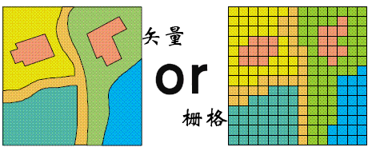
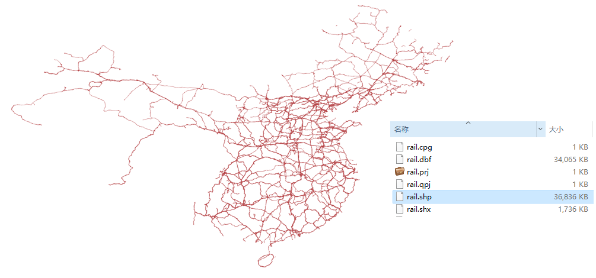
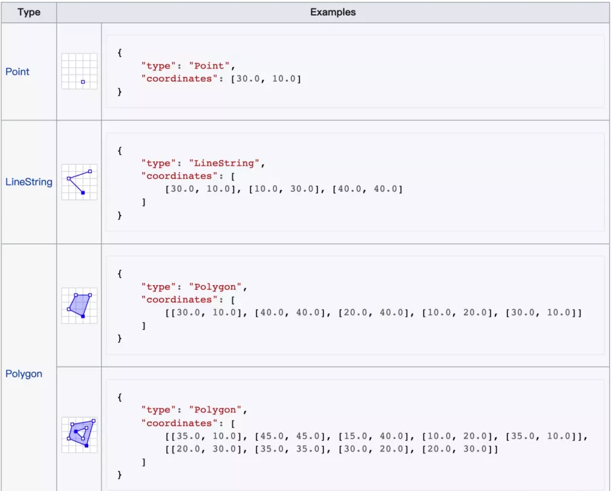
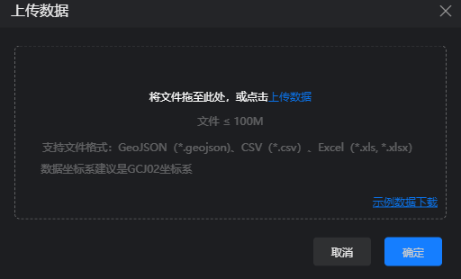
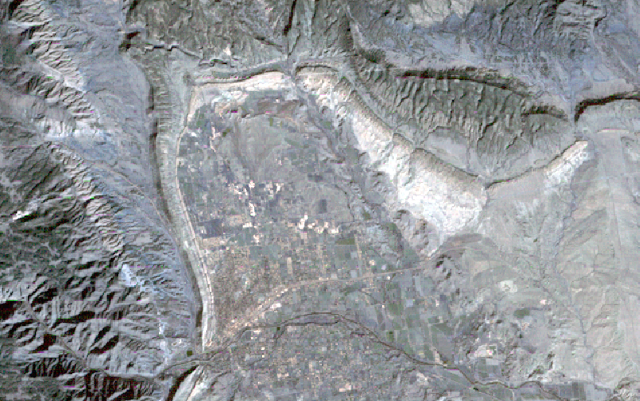
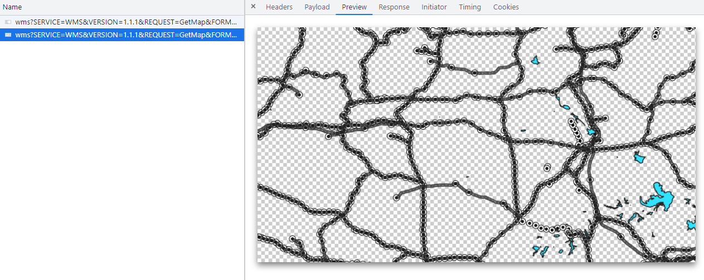
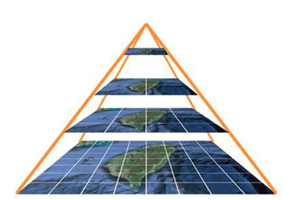
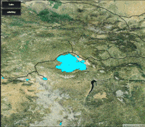
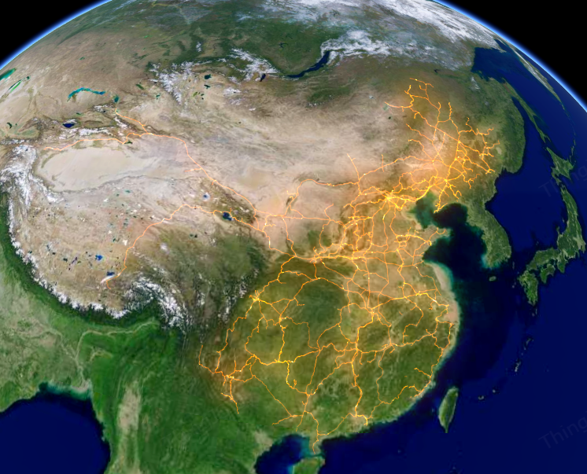

# 【森城市】GIS数据漫谈（一）矢量数据与栅格数据

近期有小伙伴提出一些关于GIS数据的问题：

**问题1：** 水系图能否上传到森地图中使用？目前导出的水系图支持的格式类型有：xml、cpg、shx、shp、sbx、prj、sbn、dbf。  
**问题2：** 自己建模区域做了正射影像，可以当做瓦片的一部分传入到地图中吗？以上问题都是与GIS数据相关的问题，要想解决这些问题首先需要弄明白什么是GIS？GIS数据格式区别是什么？

## 什么是GIS？   
**地理信息系统（Geographic Information System或 Geo－Information system，GIS）** 有时又称为“地学信息系统”。它是一种特定的十分重要的空间信息系统。它是在计算机硬、软件系统支持下，对整个或部分地球表层（包括大气层）空间中的有关地理分布数据进行采集、储存、管理、运算、分析、显示和描述的技术系统。

现代人类的行为和位置息息相关，不管是收发快递还是餐饮外卖都离不开位置信息。**GIS**是一门综合性学科，结合地理学与地图学以及遥感和计算机科学，广泛地应用在不同的领域。帮助我们更好地利用空间数据与其他行业技术结合，进行强大的辅助决策及管理应用。

### 矢量数据与栅格数据

GIS数据有很多种分类方式，其中最基本的一种分类方式也是我们经常接触到的按数据结构（或者说数据模型）可以把GIS数据分为 
**矢量数据** 和 **栅格数据** 。

**矢量数据**  
   **定义：** 以 x、y 坐标或坐标串表示的空间点、线、面等图形数据及其相联系的有关属性数据的总称。  
   **描述：** 对于点实体，矢量结构中只记录其在特定坐标系下的坐标和属性代码；对于线实体，用一系列坐标对的连线表示；对于面实体，即多边形，用一系列封闭的坐标对连线表示。矢量模式有利于描述一些离散特征，但对连续变化的特征，例如土壤、地形、矿山等不太适用。  
**栅格数据**  
   **定义：**  栅格数据结构是利用规则格网划分地理空间，形成地理覆盖层。每个空间对象根据地理位置映射到相应的地理格网中，每个格网记录所包含的空间对象的标识或类型。  
   **描述：**  栅格结构是最简单最直接的空间数据结构，它以规则的阵列来表示空间地物或现象分布的数据组织，组织中的每个数据表示地物或现象的非几何属性特点。栅格数据中，点用一个栅格单元表示；线用沿线走向的一组相邻栅格单元标识，每个栅格单元最多只有两个相邻单元在线上；面用记有区域属性的相邻栅格单元的集合表示，每个栅格单元可有多于两个的相邻单元同属一个区域。

### 矢量、栅格数据文件

**矢量数据文件**  

矢量数据文件主要常见的数据格式有：ShapeFile、GeoJSON、TopoJSON、WKB/WKT（Well-known text）、KML/KMZ。其中在实际项目里最常见的GIS矢量数据文件格式是 ShapeFile 和 GeoJSON。

**ShapeFile**  ShapeFile（也简写成shp）是一组文件的集合，如下图铁路线数据就是由众多不同后缀的文件组成。优势为兼容性好、应用广泛，但从数据共享、传输的角度来说无法满足互联网时代网络传输共享数据的需求，所以后来才有了GeoJSON文件格式。

**GeoJSON**  GeoJSON 是用 JSON 的语法表达和存储地理数据，对于Web应用来说，GeoJSON是应用最广的数据格式了。GeoJSON支持下面几何类型：点、线、面、多点、多线、多面和几何集合。

可以看出，GeoJSON里是用点、线、面来表示地理对象，并且空间数据（或者说几何字段）Geometry里都是存的相应点、线、面的坐标。这就是矢量数据的特征，即用点、线、面来表示地理对象的几何特征。

问题1的解决方法是：森城市支持GeoJSON数据上传，所以只需要将 Shapefile 文件转换为 GeoJSON 文件后再上传至森城市即可使用。

**栅格数据文件**  

对大家而言，常见的GIS栅格数据是遥感影像（卫星影像/卫星照片），更广义的各种航拍的影像（照片）都是栅格数据。GIS中一些遥感应用的数据或空间分析、计算结果数据一般也都会以栅格数据的形式提供，栅格数据的大小根据数据空间范围和分辨率正成正比。简单说范围越大，分辨率越高，数据量就越大。

所以一般不会直接把这些数据上传到Web端处理，而是利用GIS软件或其他工具将数据制作成地图瓦片（切片）后发布成地图服务，再供Web前端应用展示。

问题二的解决方法是：将正射影像制作成地图瓦片（切片）发布成地图服务后，再配置地图瓦片服务地址使用。

工具推荐

**森城市：**  一键生成3D城市，内置多种模板，自由编辑• 森城市支持不同类型城市数据的插入和自动融合，并提供友好而强大的场景编辑能力和性能处理能力，**无需具备GIS、建模等专业技能**，就可以轻松DIY自己的酷炫城市三维场景。• 森城市具备开放的**城市场景输出****能力**，无需担心场景后续使用的兼容问题。

## (二） 空间数据库与地图服务  

在上篇“GIS数据漫谈（一）”中简单介绍了GIS数据中矢量数据和栅格数据的概念，以及常见的GIS数据文件类型。这篇漫谈中我们继续讲讲地图服务。

### 空间数据库  
GIS的发展史是跟随IT技术的发展史进展的，比如前面提到的各种矢量数据、栅格数据的文件都属于空间数据。由于地理数据本身的大数据属性，一个城市地理信息系统的数据量可能达几十GB，
如果考虑影像数据的存储，可能达几百个GB。地理信息系统的海量数据，带来了系统运转、数据组织与储存、网络传输等一系列技术困难，自然也给数据管理增加了难度。  
为了更好的管理GIS数据便发展出了空间数据库，随着技术的发展很多主流数据库基本上都支持空间数据扩展，比如MySQL、Oracle、PostGIS等。

### 地图服务
有了空间数据库管理GIS数据，怎么去对接这些数据呢？总不能一个个去导GeoJSON吧。OGC【开放地理空间信息联盟 （Open Geospatial Consortium-OGC）】
为上面讲过的数据源设计了一些服务比如WMS、WMTS、WFS 等等。  

在GIS的Web应用中，无论原始数据存在文件里也好，还是存在数据库里也好，都可以利用这些标准的地图服务在网络中通过http(s)协议进行访问共享。
一般GIS大厂的Server产品或开源的GIS Server（比如 GeoServer）都支持发布这些地图服务。  

#### WMS（Web Map Service）  
该服务的最主要能力就是将GIS数据（无论原始数据是矢量数据还是栅格数据）发布成“图片”。即根据客户端请求参数（主要是bbox范围），服务器端返回相应的“图片”。
WMS常用的三种操作：  
- GetMap：根据请求参数，返回一个图片
- GetFeatureinfo：根据请求参数里的坐标，返回查询到的对象属性信息 
- GetCapabilities：返回服务的元数据   
将“站点”、“铁路”、“湖泊”数据发布成WMS服务，则可以通过WMS服务根据bbox范围请求相应数据渲染后的地图图片。绝大部分的地图应用前端库对WMS服务都有相应图层支持。  

WMS 有时又被称为“动态”地图服务，服务器会从客户端发出请求的参数（比如图层名称、BBox范围内）去数据库或文件中检索查询相应范围的数据，然后再根据配置的样式渲染成图片，最终返回给客户端。
如果客户端请求频发或并发请求高，地图图层包含的数据量又非常庞大、配置的样式复杂时，服务端承担的负载就会增大。因此，后来又发展出了地图瓦片缓存机制。简单说就是按一定的规则把“渲染”后的地图图片存放在服务器上，当客户端再次调用时服务端就直接返回“缓存”的图片，不用再次“动态”渲染，所以就有了地图瓦片服务。

#### 地图瓦片服务  

地图瓦片指将一定范围内的地图按照一定的尺寸和格式，按缩放级别或者比例尺，切成若干行和列的正方形栅格图片，对切片后的正方形栅格图片被形象的称为瓦片（tile）。
瓦片地图金字塔模型是一种多分辨率层次模型，从瓦片金字塔的底层到顶层，分辨率越来越低，但表示的地理范围不变。
  

  
Google 地图采用的 Web Mecator 投影和瓦片分级切割方案，也成为目前互联网地图事实上的标准。

#### WMTS（Web Map Tile Service）

WMTS是一种OGC定义的地图瓦片服务标准，WMTS 是 OGC 提出的缓存技术标准，即在服务器端缓存被切割成一定大小瓦片的地图，对客户端只提供这些预先定义好的单个瓦片的服务，将更多的数据处理操作如图层叠加等放在客户端，从而缓解 GIS 服务器端数据处理的压力。

与之对应的还有Google Tile、 OSGeo 的 TMS（Tile Map Service）等等，虽然各个规范有所不同，但基本上都可以在uearth API中尝试使用 TileLayer 加载这些地图瓦片服务。

##### 如何在低代码加载使用这些数据？  
可以将湖泊、铁路等数据利用GeoServer分别发布成为WMTS和TMS地图服务，在低代码ThingJS在线开发利用 uearth API 的 TileLayer 进行加载。

无论是WMS服务还是地图瓦片（切片）服务，最终调用的都是“图片”而不是数据本身。虽然浏览器几乎没有渲染的压力，但是样式不够灵活，
只能在低代码ThingJS中调整整体图片的效果，不方便效果调整（如果调整了服务端的地图样式配置又需要重新切片）。所以又有了WFS服务来直接的提供对矢量数据的操作。

#### WFS（Web Feature Service）  

WFS为客户端提供了操作矢量数据的能力，除了返回查询数据外，还提供了新增、修改、删除数据的标准接口。意思是所看到的是要素是矢量图形，而不是一张图片。
矢量图形和图片要素的区别是不会随着放大程度的改变而失真，矢量要素方便交互和编辑、修改形状等。
##### 如何在低代码加载使用这些数据？
利用 GeoServer 将数据（如铁路）发布成WFS服务直接在前端进行查询，返回结果后（一般为geojson格式），用 ThingJS/uearth 相关 API 进行绘制。

