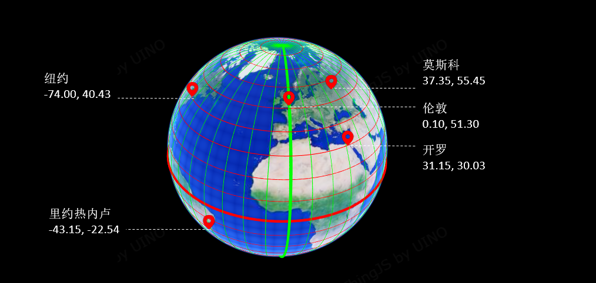
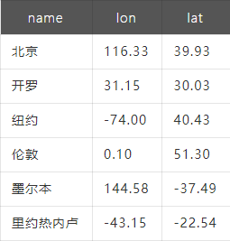

# 【森城市】GIS数据漫谈（三）— 认识经纬度  

**摘要** : 经纬度赤道把地球分为了北半球和南半球，与赤道平行的线就是纬线。赤道是最大的纬圈，由此向北或向南，纬圈半径递减。赤道纬度为 0°，
由赤道向两级各分为90°。北半球的称为北纬，南半球的称为南纬。经线为连接南北 ... 

## 经纬度  

赤道把地球分为了北半球和南半球，与赤道平行的线就是纬线。赤道是最大的纬圈，由此向北或向南，纬圈半径递减。赤道纬度为 0°，由赤道向两级各分为90°。  
  
北半球的称为北纬，南半球的称为南纬。经线为连接南北两极并且与纬线垂直相交的半圆。经线的起始线最初并不统一，1884年，国际本初子午线会议
（International Meridian Conference）在美国华盛顿召开。会议确定以穿过当时的英国伦敦格林尼治天文台的经线为本初子午线，即 0°经线。
以本初子午线为参照，向东和向西各分180°，称为东经和西经。  
我们可以通过经纬度来表示某个对象在地球表面的位置，比如：北京位于北纬39度56分、东经116度20分。  

经度和纬度一般用 度-分-秒（DMS）或 十进制度数 表示（DD），比如：
北纬39度56分（39°56′N）=39.93°N（39+56/60）

东经116度20分（116°20′E）=116.33°E（116+20/60）
在计算机的输入和存储中，一般都用十进制度表示，并且有正负号。经度值在本初子午线以东为正，以西为负。纬度值以北半球为正，南半球为负，比如：

 

地理学上东西半球分界线并不是本初子午线，而是东经160度和与其相对的西经20度所组成的经线圈。  

在实际应用中经纬度哪个在前哪个在后没有统一的标准，比如：在腾讯地图的网站上拾取的坐标，是纬度在前，经度在后。在我们 ThingJS API 
里如果是以数组的形式输入经纬度，则顺序为 [经度,纬度]。经度、纬度在软件系统的各种字段中经常简写为 lon、lat 或 lng、lat，如下图：

认识经纬度是成功的第一步，那问题来了：为什么有时候经纬度填对了结果还和底图（瓦片图）对不上？为什么有时候项目里的数据看着不像是经纬度？
我们下期揭秘。  

## 工具推荐

森城市：一键生成3D城市，内置多种模板，自由编辑
- 森城市支持不同类型城市数据的插入和自动融合，并提供友好而强大的场景编辑能力和性能处理能力，无需具备GIS、建模等专业技能，就可以轻松DIY自己的酷炫城市三维场景。
- 森城市具备开放的城市场景输出能力，无需担心场景后续使用的兼容问题。

低代码ThingJS：低代码灵活开发数字孪生可视化应用  
- 低代码ThingJS提供了丰富的3D开发API、完善的开发文档和视频教程，熟悉基础的JavaScript前端知识即可上手数字孪生3D可视化应用开发。
- 低代码ThingJS是纯H5的WebGL架构，可在各类主流网页浏览器中自如运行，包括可在移动端直接访问运行。
- 低代码ThingJS提供全生命周期的开发组件，大大提升数字孪生可视化项目开发效率。