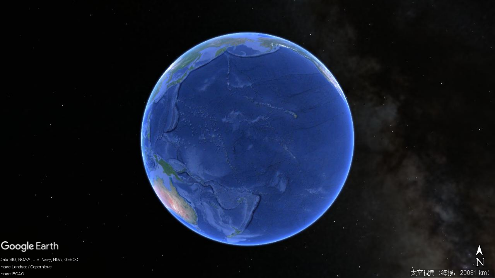
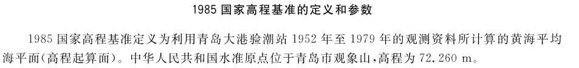
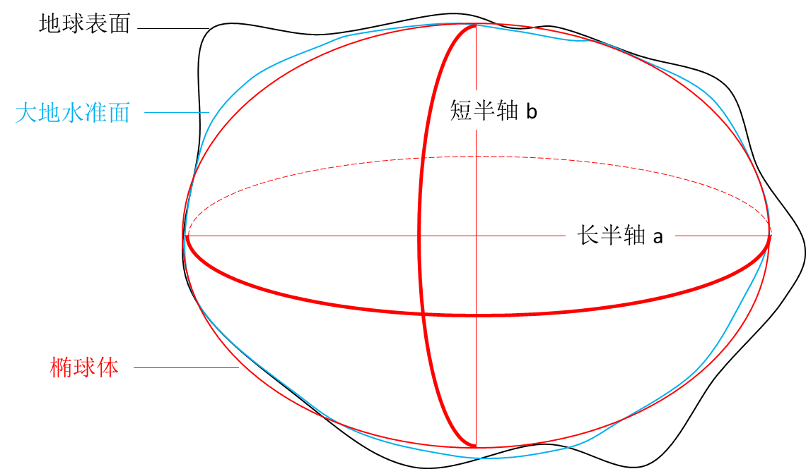
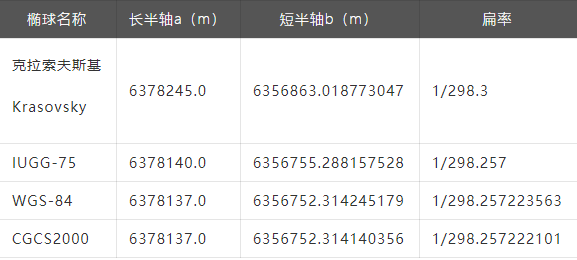
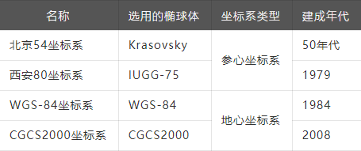
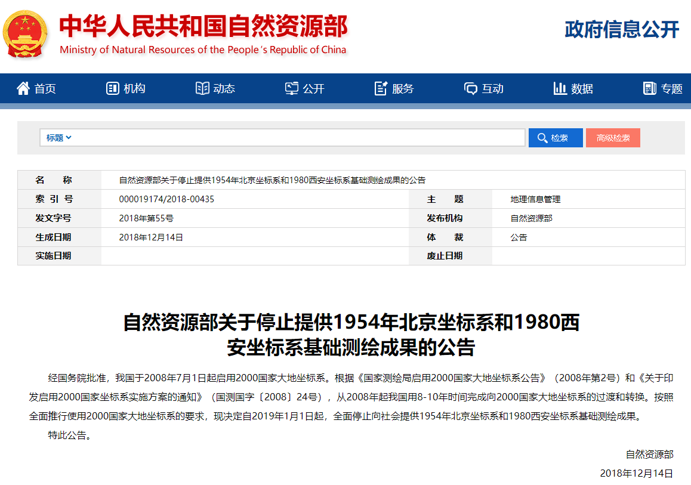

# GIS数据漫谈（四）— 坐标系统  

**摘要:**  
坐标系统地球表面并不是一个标准的正球体，根据2020年的测量成果，珠穆朗玛峰高程为8848.86m，而地球上最深的海沟——马里亚纳海沟深度为11034 m。
两者相差了将近 20 km！由于地球的自然表面凹凸不平，形态复杂，显 ...  

## 坐标系统

  地球表面并不是一个标准的正球体，根据2020年的测量成果，珠穆朗玛峰高程为8848.86m，而地球上最深的海沟——马里亚纳海沟深度为11034 m。
两者相差了将近 20 km！由于地球的自然表面凹凸不平，形态复杂，显然不能作为测量的基准面。  
所以人们开始寻求一种与地球自然表面接近的规则曲面来代替不规则的地球表面。地球表面积中海洋面积约占71%，陆地面积仅占29%。
  
  于是利用水准面表示地球的物理表面，简单说就是假设有一个静止的海水面（一个无波浪、无潮汐、无水流、无大气压变化，处于流体平衡状态的静止海平面），
向陆地延伸形成的一个封闭曲面来表示地球的物理表面。  

  现实中海水面会受潮汐影响不断变化，所以人们在海滨设立验潮站，通过长期观测，求出海水面的平均高度。通过平均高度的这个水准面称为大地水准面，
又称高程基准面。我国现在规定的高程基准面为1985高程基准 。  
  
  
参考：国家大地测量基本技术规定  GB 22021-2008

  大地水准面忽略地面上的凹凸不平，但地球内部质量分布的不均匀，大地水准面仍是起伏不平的。虽然非常接近一个规则椭球体，但并不是完全规则，没有办法用数学模型定义和表达。
于是人们又进一步假设用一个旋转椭球体的表面来逼近大地水准面，又称地球椭球体。旋转椭球体是一个椭圆围绕其短轴旋转而形成的形体，其长半轴a（赤道半径）
大于短半轴b（极半径）。扁率f=(a-b)/a。  

  
  不同的历史时期，不同的国家和地区，根据相应的资料推算出不同大小的椭球体来近似的代表大地水准面。
我国不同时期使用过的地球椭球体列表如下：

  
有了椭球体，就可以在椭球体的基础上建立坐标系来表达地面上某点的位置。但此时还有一个问题：针对不同的区域，用一个椭球体去“贴合”的时候必然会出现有的地方“贴合”的好，
有的地方“贴合”的不好，因此还需要一个大地基准面来确定椭球体的“位置”和“姿态”。  

大地基准面包含两类：  
- 地心基准面：由卫星数据得到，使用地球的质心作为原点 ，对全球范围进行最佳拟合。  
- 区域基准面：特定区域内与地球表面吻合，大地原点是参考椭球与大地水准面相切的点。
  
参心坐标系和地心坐标系的区别：  
- 参心坐标系：指经过定位与定向后，地球椭球体的中心不与地球质心重合而是接近地球质心，是区域性（局部范围）的坐标系 。  
- 地心坐标系：指经过定位与定向后，地球椭球体的中心与地球质心重合，是全球性的坐标系 。

上面从地球的自然表面——>大地水准面——>地球椭球体——>大地基准面的过程可以看做对地球的“逐级逼近”。随着测绘科学与技术的发展，我国不同时期使用过的大地坐标系如下列表：
  
  
  
目前，我国已全面推行使用2000国家大地坐标系【China Geodetic Coordinate System 2000】（即 CGCS2000坐标系）。  
  

所以如果某个地方的经纬度坐标为[116.56,39.97]，并不代表能在地图上准确的标注出他所描述的位置，因为在不同的坐标系下采集同一个地点得到的数据是不一样的。
所以，要想在地图上准确的标注出某个地点的位置，除了知道坐标值外，还需要知道这个坐标值什么坐标系下采集生产的。  
  
在GIS领域一般会把坐标系分为地理坐标系（Geographic Coordinate Systems）和投影坐标系（Projected Coordinate Systems）。
如果还要定义某点的高程（可以简单理解为海拔）严格意义上来说还需要高程坐标系，有时也称垂直坐标系（Vertical Coordinate Systems）。

