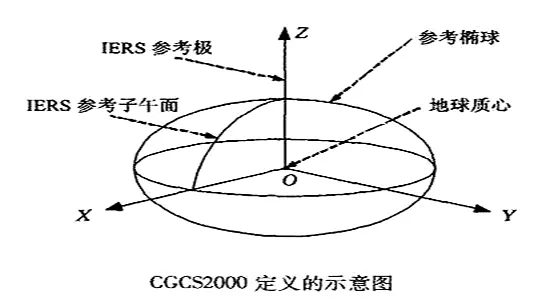
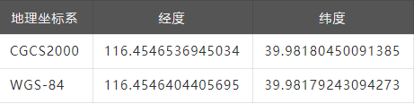
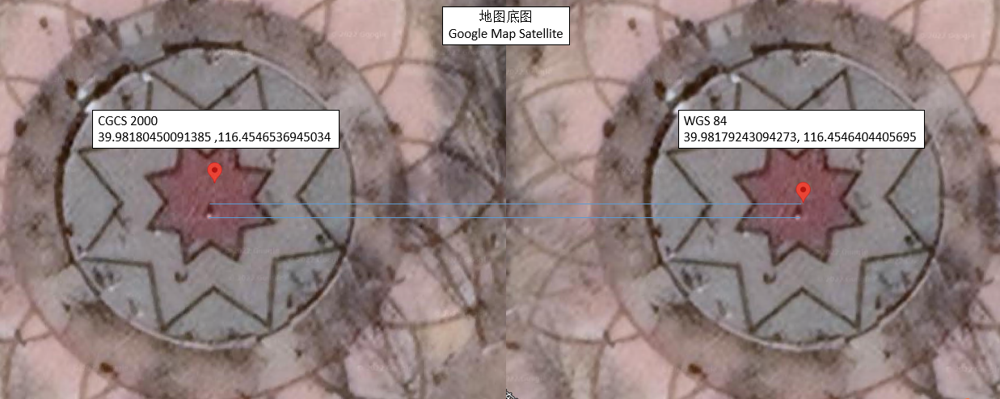
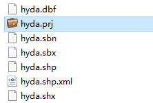
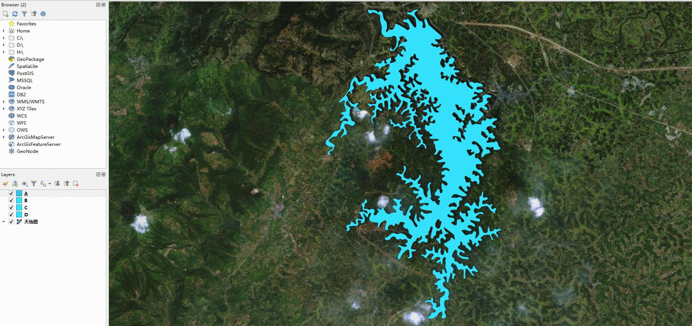
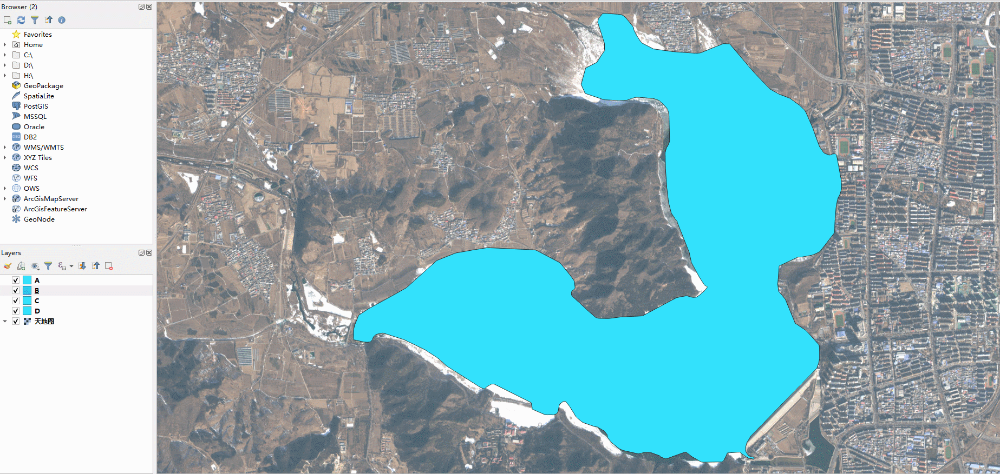
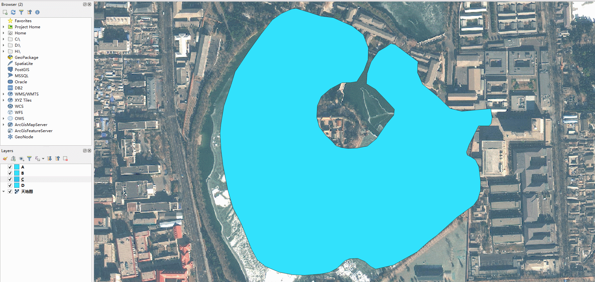
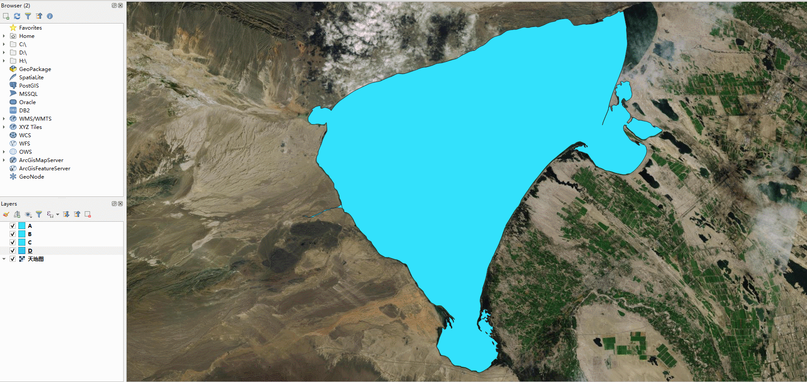
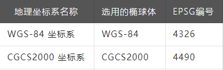
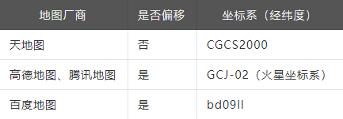

# GIS数据漫谈（五）— 地理坐标系统   

**摘要:**  
地理坐标系统（GCS）地理坐标系通过角度测量单位（Unit）、本初子午线（PRIMEM）和基准面（DATUM）来进行定义。地理坐标系下的坐标值为经纬度，所以有时也叫经纬度坐标系。
CGCS2000，2000国家大地坐标系。我们很多时 ...  
  
## 地理坐标系统（GCS）

地理坐标系通过角度测量单位（Unit）、本初子午线（PRIMEM）和基准面（DATUM）来进行定义。地理坐标系下的坐标值为经纬度，所以有时也叫经纬度坐标系。  

CGCS2000，2000国家大地坐标系。我们很多时候直接用WGS84的坐标来代替CGCS2000坐标。因为CGCS2000的定义与WGS84实质一样，采用的参考椭球非常接近。
扁率差异引起椭球面上的纬度和高度变化最大达0.1mm。当前测量精度范围内，可以忽略这点差异。  
  

下面我们就来做两个小实验，来观察一下CGCS2000地理坐标系下的经纬度坐标。  
### 实验一  
CGCS2000坐标系下获取的经纬度和WGS84坐标系下获取的经纬度差距大吗？假设在Google Map上以卫星底图为参考拾取的坐标是 WGS-84 的。
由于天地图的坐标系统是CGCS2000的，在天地图上拾取一个点的经纬度来观察。  
  
对比看一下：
  

把CGCS2000的经纬度 39.98180450091385 ,116.4546536945034  在Google Map 上“标注一下”，两者对比如下：
  
  

差距不是很大，所以在一般的应用中（定位精度要求不高，差个1m左右无所谓）可忽略 CGCS2000 和 WGS-84 坐标系的区别 。  
但在高德地图不同，因为高德地图采用的是 GCJ-02 坐标系（腾讯地图同理），又称火星坐标系 ，它是一种对经纬度数据的加密算法，即加入随机的偏差。  
### 实验二
从天地图（全国地理信息资源目录服务系统）下载几个区域 1:25w 的矢量数据来进行观察。各分幅的原始数据下载下来的各个图层是 Shapefile 文件。
先看看 Shapefile 文件中的 .prj 文件（.prj文件中定义了该数据的坐标系）。
  

选取四个不同地方的水系面数据进行对比，先把这四个面数据叠加在天地图的卫星底图上。这里用的是QGIS，通过 XYZ Tiles图层加载的天地图卫星底图，再把shp文件叠加加载。
  
  
  
  

第三个地图有些偏移，坐标位置的偏移有可能是原始数据本身的原因。比如由于区域的特殊性，公开的矢量数据本身就在原始测绘数据的基础上进行了偏移，降低精度。有些时候，第三方的瓦片数据在不同层级（比例尺）下本身也没有处理成“一致”。
总结：
### 1.两个常用地理坐标系
  

  
我国已全面推行使用2000国家大地坐标系。在定位精度不高的应用中（相差1m无所谓的情况下），可认为 CGCS2000 与 WGS-84 没有区别。
### 2.各互联网地图，各自使用的坐标系根据国家法律法规规定进行了偏移处理
  

  
### 3.经纬度坐标叠加到地图底图上偏移
- （1）一般情况下是由于经纬度的坐标系和地图底图的坐标系不匹配导致。这种情况，可以通过经纬度坐标转换的方式处理。
- （2）如果在同一坐标系下还出现偏移，可能是原始数据的问题。