# GIS数据漫谈（六）— 投影坐标系统

**摘要:**  
投影坐标系统（PCS）地球近似为一个“椭球体”，在不考虑高程的情况下其实经纬度坐标就是描述了某点在球面的位置。在没有电脑、没有数字化地图的时代最实用的是纸质地图，
但纸质地图是平面的，要把地“球”展开到地 ...  

## 投影坐标系统（PCS）
  
地球近似为一个“椭球体”，在不考虑高程的情况下其实经纬度坐标就是描述了某点在球面的位置。在没有电脑、没有数字化地图的时代最实用的是纸质地图，但纸质地图是平面的，
要把地“球”展开到地图的“平面“上（把地球在一张纸上“画”出来）就需要投影（Projection）。
  
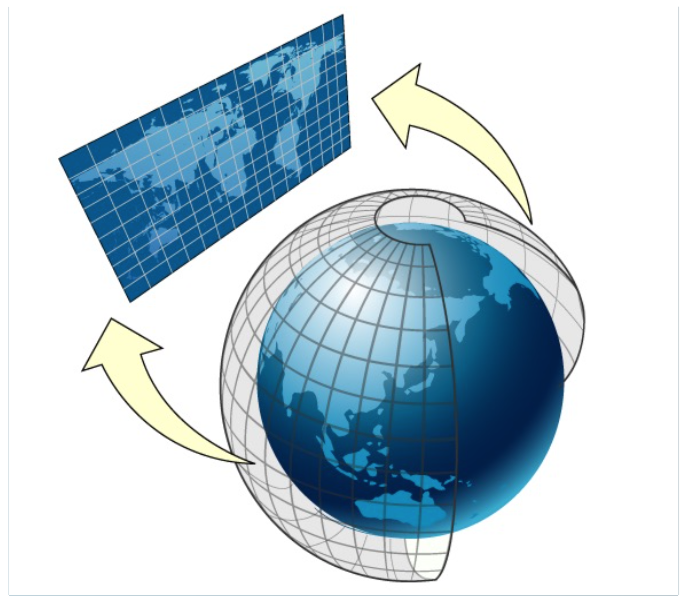
  
地“球”被投影到“平面”后，还有一个最实际的功能就是便于测量。因为投影后的坐标都是在直角平面坐标系下的坐标了（单位一般为米）。比如计算两点间的距离，直接用勾股定理即可。
  
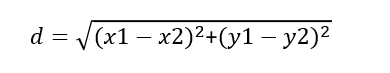
  
已知球面上两点经纬度也是可以计算距离的，准确说是大圆（GreatCircle）距离，后面我们还会提到一般采用 Haversine 公式。
  
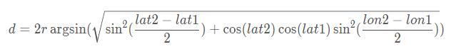
  
有了基本的概念后，我们来看看目前互联网地图最为常用的投影Web墨卡托投影。  

#### Web墨卡托投影
墨卡托投影（Mercator）由荷兰地图学家墨卡托 （Gerardus Mercator） 于 1569 年提出。15世纪正是大航海时代的（又称地理大发现）开端，
墨卡托投影的创立最初目的就是用于量算航向方位，为海上航行提供保障。 墨卡托投影是正轴等角圆柱投影。
  
假设地球被套在一个圆柱中，赤道与圆柱相切，然后在地球中心放一盏灯，把球面上的图形投影到圆柱体上，再把圆柱体展开，就形成以一幅墨卡托投影的世界地图。
  
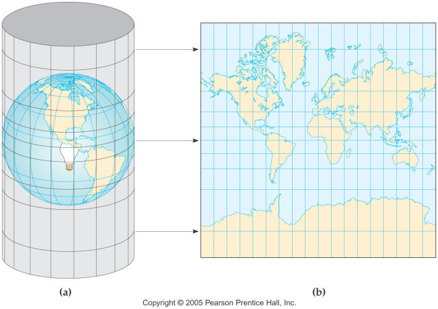
  
Google基于墨卡托投影设计了 Web墨卡托投影 （Web Mercator）。

首先，将基于椭球体的墨卡托投影简化为“正球体”，半球取WGS84椭球体的长半轴 6378137 m。其次，由于墨卡托圆柱投影的方式必然导致当纬度φ接近两极，即90°时，
投影后平面坐标的Y值趋向于无穷大。但沿赤道展开的X轴的范围是固定的，即 [-πr,πr] = [-20037508.342789244,20037508.342789244]  。  
  
为了让投影后的平面能正好在一个正方形内表示，即让投影后的Y轴范围也是[-20037508.342789244,20037508.342789244]，反算出纬度的限制范围约为：[-85.06,85.06]。
  
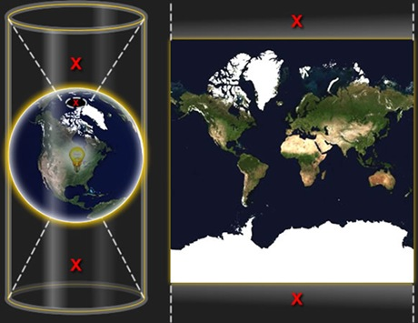  
  
这样全世界可以在一个正方形里面刚好放下，也为地图切片的四叉树分割和计算提供了便利。但由于Web墨卡托投影是将原本基于椭球体的墨卡托投影“简化”为了“正球体”。
因此，Web墨卡托投影又叫伪墨卡托投影（Pseudo Mercator）、球面投影（Spherical Mercator）。也因为正球体的简化，
导致Web墨卡托并非和标准的墨卡托投影一样保持严格的等角（Conformal），而是近似等角。  
那等角到底是什么意思呢？比如下图中已知莫斯科、广州两点的经纬度。
  
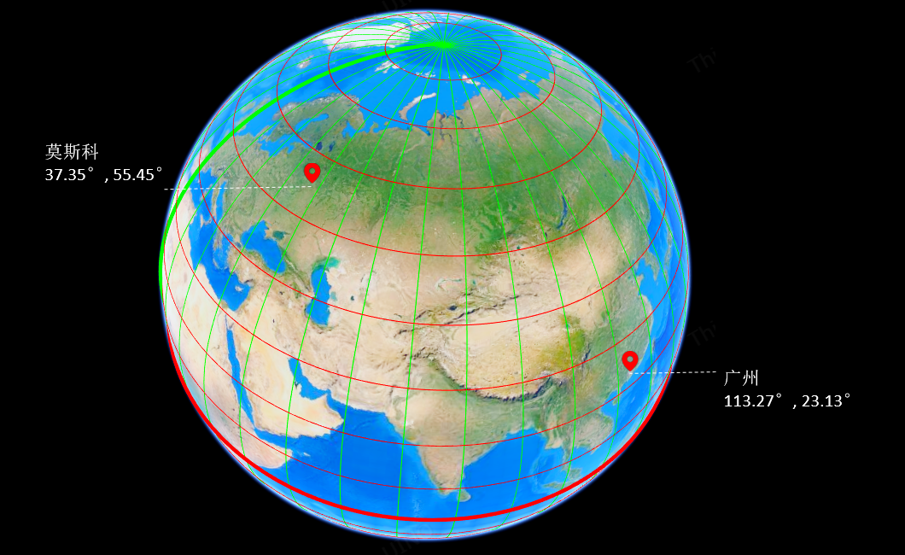
  
用Web墨卡托投影在平面后（ PS：ThingJS API 提供了经纬度转Web墨卡托投影的方法，有兴趣可以自己试试）。
  
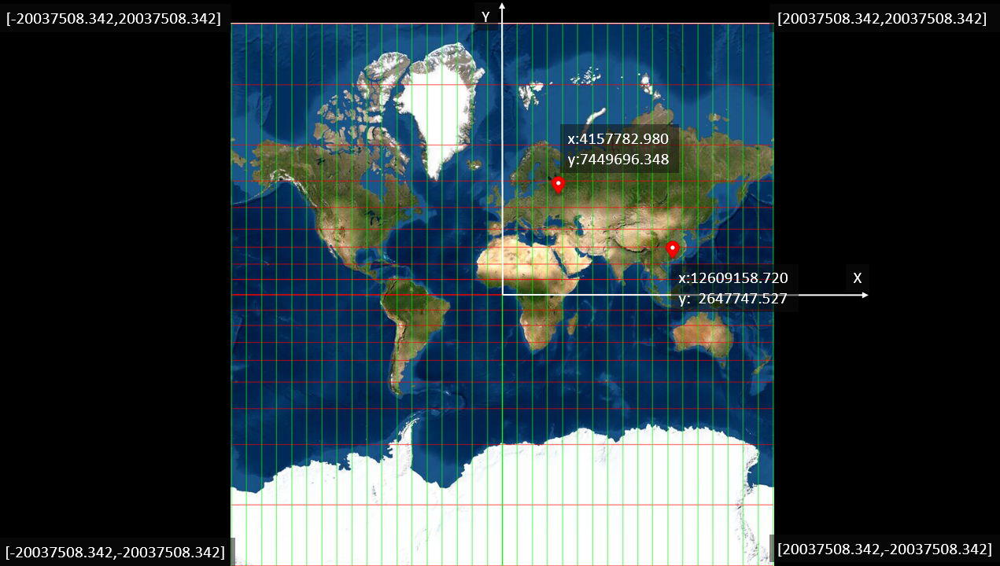  

在地“球”上过莫斯科和广州两点以大圆圆弧连接，如下图黄线。这条大圆（Greate Circle）即为球面上两点的最短距离。
  
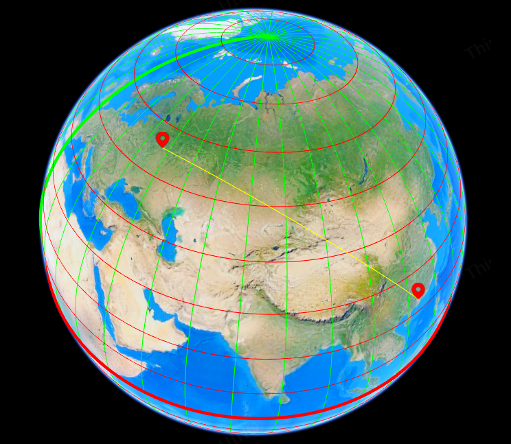  
  
那我们在墨卡托投影的平面上连接投影后两点得到的直线（如下图蓝线）又是什么呢？
  
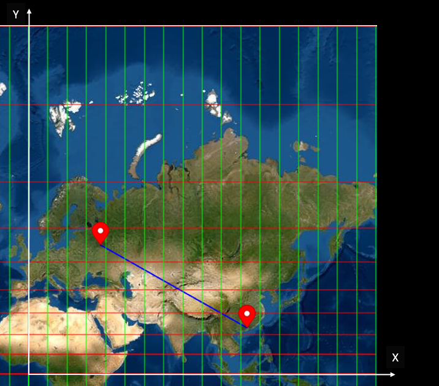  
  
这条蓝线与各个经线（绿色）的夹角是不变的，在这个例子中约为119.6°。这条线就叫做等角航线（rhumb line）也称恒向线，
即地球上两点之间与经线处处保持角度相等（等方位）的曲线。
  
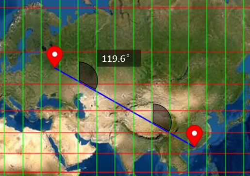  
  
把大圆航线和等角航线再在地球和墨卡托投影平面上对比观察，尤其观察他们与经线（绿色）的夹角。
  
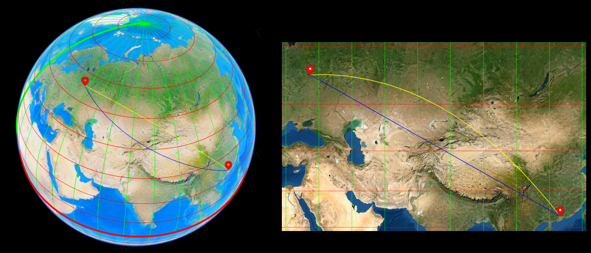
  
可以发现：投影面上两条方向线所夹角度与球面上对应的两条方向线所夹的角度相等。这正是等角（Conformal）的意义。换句话说，
球面上的一个图形轮廓经过墨卡托投影后对于局部而言只是“原样放大”了，形状没有变化。因此等角投影也称为正形投影。  
还可以看到，墨卡托投影虽然能保持等角不变，但投影后的面积变化很大，尤其纬度越高的地区。最典型的就是格陵兰岛，在墨卡托投影上看几乎和非洲大陆的面积差不多了。
而真实情况却是：非洲面积约是3020万平方千米，格陵兰岛面积约是217万平方千米；非洲的面积约是格陵兰岛的14倍。  
  
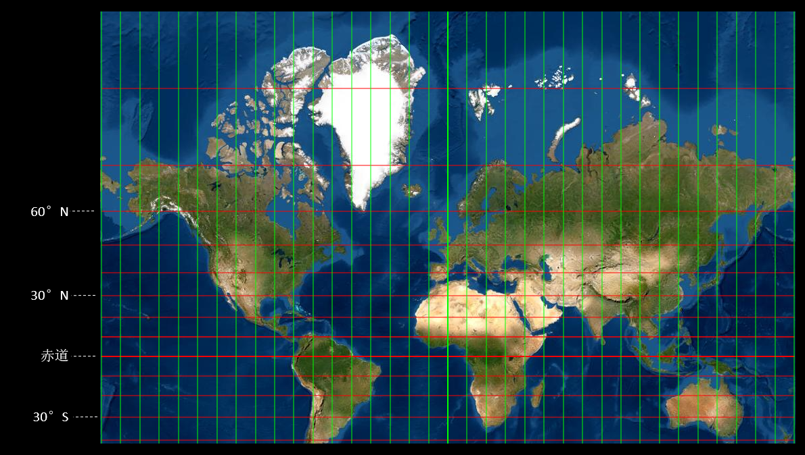
  
这就引出了地图投影的一类分类体系，即按投影变形的性质，地图投影可分为： 
#### （1）等角投影
   投影面上两条方向线所夹角度与球面上对应的两条方向线所夹的角度相等。
#### （2）等积投影    
球面上的面状图形轮廓经投影后，仍保持面积不变。
#### （3）任意投影
既不等角也不等积，角度、面积、长度三种变形同时存在。在任意投影中，比较常见的一种是等距投影。
所谓等距投影，并不是说这类投影不存在长度变形，而是沿某一特定方向的距离，经过投影之后保持不变。
  
正所谓鱼和熊掌不可兼得，没有既能保持等角又能保持等积的地图投影，需要根据实际的需求和应用情况进行取舍。
  
除了Web墨卡托投影外，在实际工程应用中还可能遇到什么类型的地图投影呢？比如在天地图（全国地理信息资源目录服务系统）中还可以查到高斯-克吕格投影的数据。
  
#### 高斯-克吕格（Gauss-Kruger）投影
德国大地测量学家克吕格（Johannes Kruger，1857-1928年）于1912年对投影公式加以补充，故名高斯-克吕格投影。高斯-克吕格投影是一种“等角横切圆柱投影”。  
我们可以假设用一个椭圆柱横向套在地球椭球外，并与某一子午线相切（此子午线称为中央子午线或中央经线）。椭圆柱的中心轴位于地球椭球的赤道上，按照高斯-克吕格投影所规定的条件：  
- 1.中央经线和赤道投影后为互相垂直的直线，且为投影的对称轴。
- 2.投影具有等角性质。
- 3.中央经线投影后保持长度不变。

将中央经线两侧一定经差范围内的经纬线（投影带）投影到椭圆柱面上，并将此椭圆柱面展开为平面，即得高斯-克吕格投影。
  
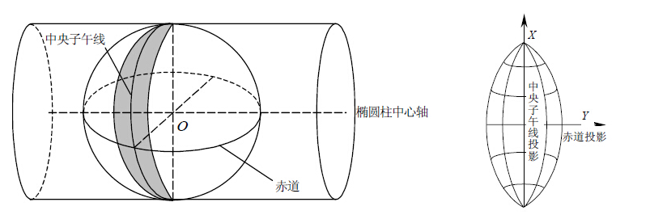
  
高斯-克吕格投影的经纬线变形规律：  
- 1.中央经线上没有任何变形。  
- 2.在同一条纬线上，离中央经线越远，变形越大，最大值位于投影带的边缘。  
- 3.在同一条经线上（除中央经线），纬度越低，变形越大，变形最大值位于赤道上。  

为了控制变形，在实际应用中将高斯-克吕格投影进行分带处理，即将地球椭球按一定间隔的经差（6°或3°）划分为若干相互不重叠的投影带，各带分别投影。
6°带从格林尼治0°经线起算，每隔6°为一个投影带，全球划分为60个投影带。3°带从东经1°30′的经线开始，每隔3°为一个投影带，全球划分为120个投影带。
  
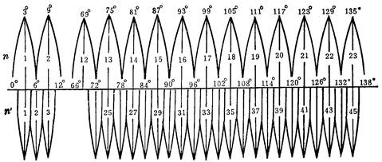 
  
前面提到投影坐标系统（Projected Coordinate System）是建立在某个地理坐标系统上的（Geographic Coordinate System）。
即：投影坐标系统（米）= 地理坐标系统（经纬度）+投影算法（数学函数）。

由于高斯-克里格投影是分带的，所以每个分带就是一个唯一的高斯-克吕格投影坐标系。如下图在同一个地理坐标系（CGCS2000）下，不同分带的高斯-克吕格投影。
  
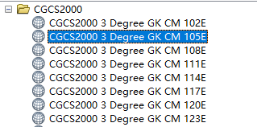
  
同时，相同的分带在不同的地理坐标系下也是一个唯一的高斯-克吕格投影坐标系。如下图同一分带（比如3°带的105°中央经线），不同地理坐标系下的高斯-克吕格投影。  
  
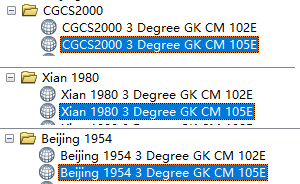  
  
这种分带的思想在地图投影中除了高斯-克吕格投影外还有很多，比如：UTM投影（universal transverse Mercator projection，通用横轴墨卡托投影）。
它和高斯-克吕格投影很相似，UTM投影将高斯克吕格的切圆柱优化成了割圆柱，即：横轴等角割圆柱投影。

圆柱割地球于两条等高圈上，投影后这两条割线上没有变形，中央经线的长度比为0.9996。
  
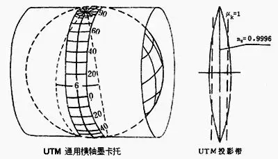  
  
这种分带投影的思想也是一种“化整为零”、“分而治之”的思路，把全局的“变形”通过区域的划分在局部得到优化，提高了投影的精度。

#### 兰伯特（Lambert）投影 
兰伯特（Lambert）投影在双标准纬线下是“等角正轴割圆锥投影”，由德国数学家兰伯特（J.H.Lambert）在1772年拟定。

假想用一个圆锥正割于球面两条标准纬线，应用等角条件将地球面投影到圆锥面上，然后沿圆锥一条母线剪开，展开即为兰伯特投影平面。
  
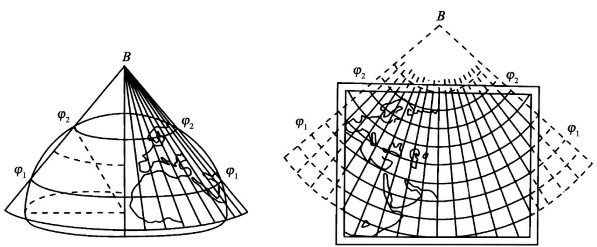
  
对于具体区域中央经线和两条标准纬线的参数也根据各地区实际情况确定。与兰伯特（Lambert）投影同一族的还有一种投影类型——阿尔伯斯（Alberts）投影。
不过阿尔伯斯（Alberts）投影是一种正轴等面积割圆锥投影。

