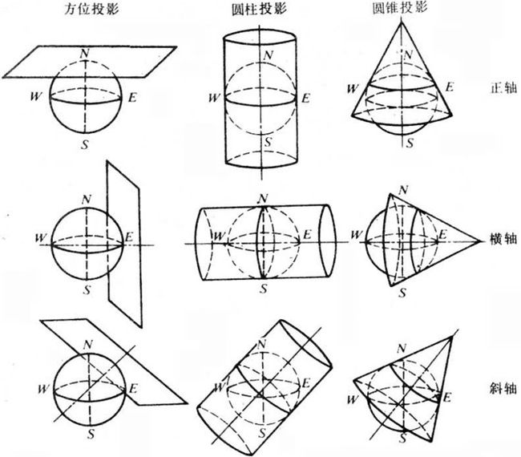
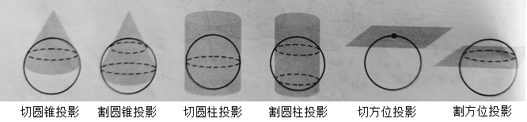
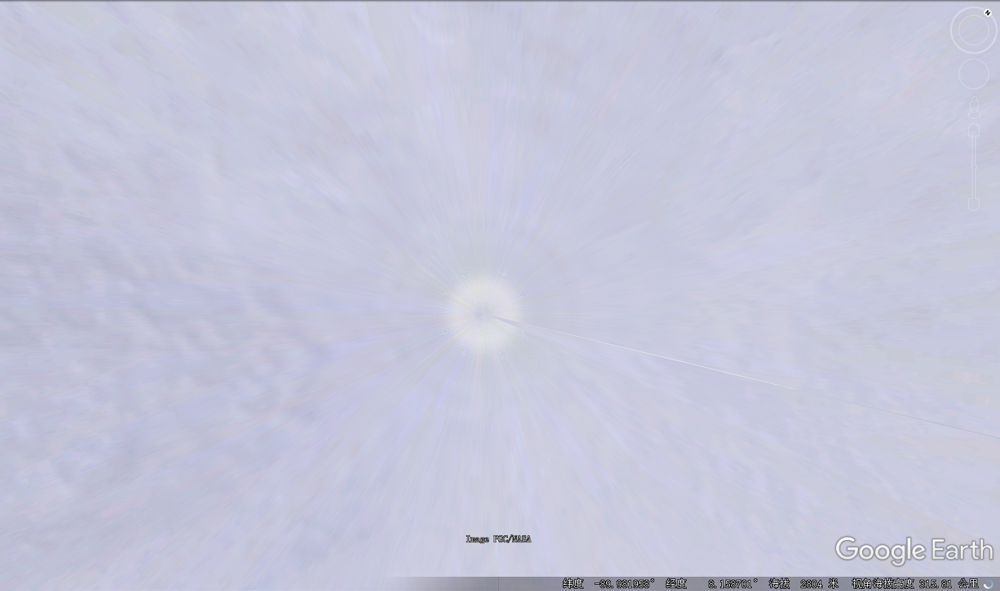
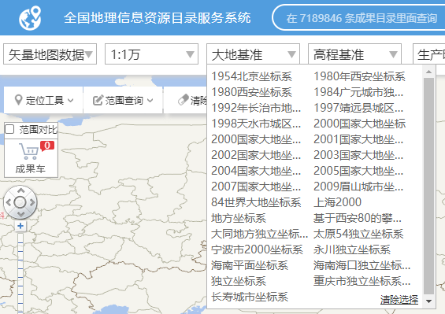
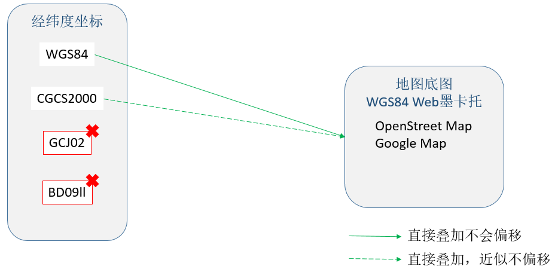
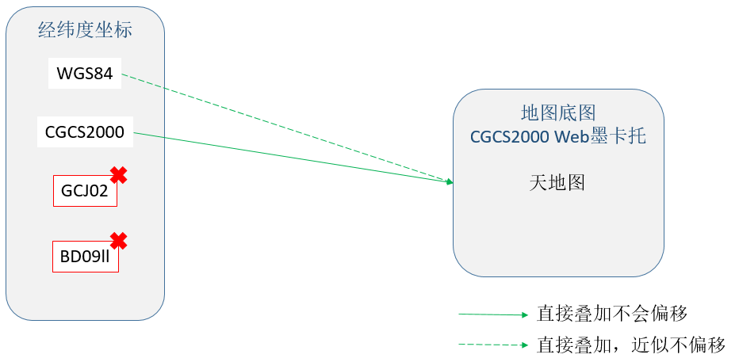
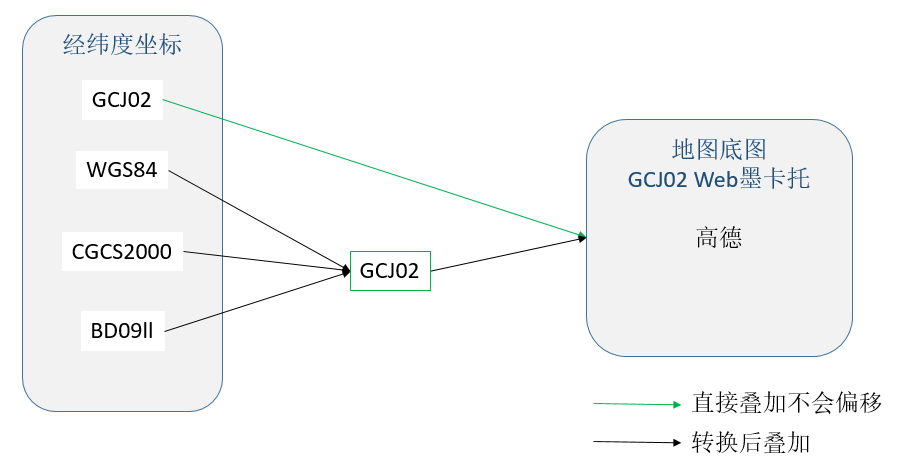

# GIS数据漫谈（七）— 地图投影杂谈

前面了解过Web墨卡托、高斯-克吕格、UTM投影是圆柱投影；兰伯特、阿尔伯斯投影是圆锥投影。
根据投影变形的性质，地图投影可分为等角投影/等积投影/任意投影。还有另一种常见的地图投影分类的维度。

#### 1. 按投影面几何形状、投影面与球面的相对位置关系分类。 
  

#### 2. 按投影面和球面的空间逻辑关系分类。  

 
  
当然，世界上的地图投影远远不止文章里提到的。比如前面讲了Web墨卡托投影将纬度限制在了[-85.06,85.06]。你去看任何“地球”，包括Google Earth，
南北极其实都是仅仅是用了边缘瓦片图的像素采样“拉”过去的，南极大陆尤为明显。

  
  
所以要去南极看企鹅用Google Earth/Map 就不行了，如果要制作南北极的地图就需要用到前面说的方位投影。正值炎炎夏日，正好来一幅南极地图消暑降温。
  
《国家基本比例尺地图测绘基本技术规定》 中提到：1:500，1:1 000，1:2 000 国家基本比例尺地图确有必要时，可采用依法批准的独立坐标系。
比如北京市就于2022年1月1日启用了“北京2000坐标系”，在天地图（全国地理信息资源目录服务系统）里还能看到很多独立坐标系。
  

  
什么项目可能用到投影坐标系的数据呢？比如城市规划设计、工程施工（修桥、修路、修水库）都可能会用到投影坐标系数据。
因为这些项目的应用多和测量计算（长度、面积、角度）、空间分析有关。前面说过由于投影后是平面坐标方便在地图上做量算，并且出于投影后精度的考虑，
基本上是高斯-克吕格分带投影，或者是地方独立的坐标系。
  
### 总结  
关于经纬度的矢量数据叠加在地图底图（瓦片）图层上偏移的问题，需要先确定地图底图（瓦片）是什么，再谈矢量数据的经纬度坐标系是否匹配。
  
地图瓦片的代表分别为：
- Openstreet/Google Map —代表 标准的WGS84 Web墨卡托
- 天地图—代表 CGCS2000 Web墨卡托
- 高德地图—代表 GCJ02 Web墨卡托
  
矢量（点、线、面）的经纬度数据为：
- WGS84
- CGCS2000 
- GCJ02 
- BD09ll
  
第一种情况：将四种坐标系下的经纬度叠加到 WGS84 Web墨卡托底图上。
  

  
第二种情况：将四种坐标系下的经纬度叠加到 CGCS2000 Web墨卡托底图上。
  
  
  
第三种情况：将四种坐标系下的经纬度叠加到 GCJ02 Web墨卡托底图上。
  

  