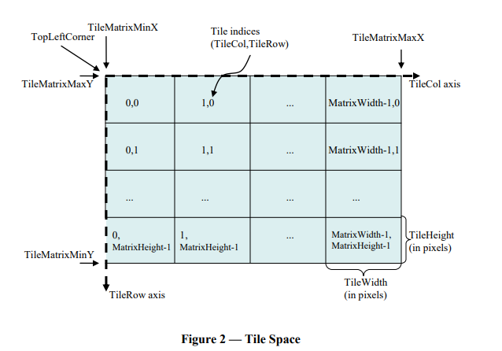

# GIS数据漫谈（八）— 地图瓦片（切片）服务

在之前的内容中我们已经学习了什么是矢量数据、什么是栅格数据，什么是地图服务。在地图服务中，提到了地图瓦片（切片）服务，
经常有小伙伴问：你们支持什么标准/规则/类型的地图瓦片（切片）服务？
  
我们今天就来详细分析一下这个问题。

## 森城市发布的地图瓦片服务

首先，基于森城市发布的地图瓦片服务肯定是支持的。
森城市瓦片服务发布支持下列三种方式：
- Linux下使用Docker部署后发布(需安装Docker应用容器引擎);
- Linux下直接部署发布(不需安装Docker);
- Windows或Mac下直接部署发布。
  

  
## 常见的互联网在线地图
  
低代码ThingJS 支持常见的互联网在线地图瓦片服务（百度地图除外）。由于百度地图坐标系的坐标原点的特殊性，目前不支持百度地图作为地理底图。
如果坐标数据来自于百度地图，数据上传时选择百度坐标系，可以与其他的地理底图进行匹配。
  

  
低代码在线开发中有修改地图底图的官方示例可供参考。
  

  
## ArcGIS地图服务（MapServer）

### 案例 -- ArcGIS

熟悉 ArcGIS 的朋友可以看出，在上面的低代码官方示例互联网地图中就有用 ArcGIS Server发布的地图服务（MapServer）。
  

  
在ThingJS在线开发来观察一个访问ArcGIS发布MapServer的例子，代码如下：  
  
```
    var app = new THING.App();
    app.background = [0, 0, 0];  // 设置地图背景为黑色THING.Utils.dynamicLoad(['https://www.thingjs.com/uearth/uearth.min.js'], function () {    // 创建一个地图
        var map = app.create({        type: 'Map'
        });    var url = 'https://services.arcgisonline.com/arcgis/rest/services/World_Topo_Map/MapServer/tile/{z}/{y}/{x}';    // 创建一个瓦片图层
        var tileLayer1 = app.create({        type: 'TileLayer',        id: 'tileLayer1',
            url,
        });    // 将瓦片图添加到地图中
        map.addLayer(tileLayer1);
    ​
    });
```

一般来说，可以通过ArcGIS服务的地址来查看该服务的“元数据”，“元数据”即空间数据的数据，是描述空间数据及相关资料的信息，便于查询和使用有关的数据，比如：
  
  
  
这里面的数据信息就不一一介绍了，挑几个比较重要的讲讲。

#### 1.Spatial Reference：空间坐标系
比如上图中 102100（3857）代表什么呢？代表该地图服务所发布的地图瓦片（切片）投影类型是Web墨卡托投影，也叫 (Pseudo-Mercator)
伪墨卡托投影或球面墨卡托（Spherical Mercator）。
  
Web墨卡托投影是一种投影坐标系（Projected Coordinate System），也叫做平面坐标系，在投影坐标系下的坐标单位为米（metre）。
  
#### 2.Tile Info：瓦片（切片）信息

一般包含单张切片的图片尺寸（Height/Width）、格式（Format）等信息，还包括瓦片的层级数（Levels of Detail），然后就是具体每个层级的分辨率、比例尺。
  
  
  
把Level 0、Level 1的瓦片（切片）图拼一拼，可以看出在Web墨卡托投影坐标系下的地图瓦片（切片）的索引组织规律：Z 表示缩放层级，XY 的原点在左上角，X 从左向右，Y 从上向下。
  

  
讲了这么多相信你已经对上面低代码ThingJS官方示例中的这几行url有了进一步的理解。


最主流的地图瓦片（切片）服务有两种：
- 1.OGC标准的 WMTS 地图瓦片服务
- 2.OSGeo标准的 TMS 地图瓦片服务

## WMTS地图服务

### 案例 - WMTS
  
再次回到ArcGIS的服务地址。

  
  
可以发现这里有个WMTS。这就说明ArcGIS也能发布WMTS地图服务。
  
那低代码能不能加载WMTS地图服务呢？当然可以！

代码如下：
```
    var app = new THING.App();
    app.background = [0, 0, 0];THING.Utils.dynamicLoad(['https://www.thingjs.com/uearth/uearth.min.js'], function () {    // 新建一个地图
        var map = app.create({        type: 'Map'
        });    var url = 'https://services.arcgisonline.com/arcgis/rest/services/World_Topo_Map/MapServer/WMTS/tile/1.0.0/World_Topo_Map/default/default028mm/{z}/{y}/{x}.jpg';    // 新建一个瓦片图层
        var tileLayer1 = app.create({        type: 'TileLayer',        id: 'tileLayer1',
            url,
        });
        map.addLayer(tileLayer1);
    });
```
  

  
怎样知道这个WMTS的请求地址是什么呢？我们可以打开看看这个WMTS地图服务的“元数据”（Metadata）。
在Layer中找到它对应的地图服务的URL"模版"（template）。
  

  
能够这和uearth里加载瓦片地图的url地址很像。只是uearth里可能是{x}、{y}、{z}，但这里面又好像不太一样{Style}、{TileMatrixSet}、
{TileMatrix}、{TileRow}、{TileCol}，“名字”不一样。  
其实{}就是个“占位符”，那具体里面怎么填呢？
  
我们就来做“填空题”，从WMTS标准的定义来看 TileCol 其实就代表瓦片的X索引，TileRow 其实就代表瓦片的Y索引。
  
  
  
那我们就先替换这俩：
```
  https://services.arcgisonline.com/arcgis/rest/services/World_Topo_Map/MapServer/WMTS/tile/1.0.0/World_Topo_Map/{Style}/{TileMatrixSet}/{TileMatrix}/{y}/{x}.jpg
```
还剩下 {Style}、{TileMatrixSet}、{TileMatrix} 该填什么呢？{Style}是这个地图服务的样式的“占位符”，还是在Layer中找，可能有一个，也可能有多个。
在这个例子里找到只有一个 default 的样式。
  
 
  
所以又可以填上一个空了：
```
  https://services.arcgisonline.com/arcgis/rest/services/World_Topo_Map/MapServer/WMTS/tile/1.0.0/World_Topo_Map/default/{TileMatrixSet}/{TileMatrix}/{y}/{x}.jpg
```
然后再去找 TileMatrixSet ，发现有两个：
  

  
可以简单理解为每个 TileMatrixSet 定义了一种切片方案 ，然后再去对应的 TileMatrixSet 里去找具体的参数信息。Identifier 定义了切片方案的 ID，
SupportedCRS 定义了切片方案的空间坐标系（注意这个示例中的两个 TileMatrixSet 都是Web墨卡托投影坐标系），TileMatrix 定义了各级别切片的细节，
比如级别ID、比例尺除数、原点（左上角）坐标、单张瓦片的尺寸等等。
  
比如示例中  default028mm  这个 TileMatrixSet 定义了0-23级切片的具体细节。
  

  
GoogleMapsCompatible  这个 TileMatrixSet 定义了0-18级切片的具体细节。


所以就可以替换了，因此对于这个具体例子来说，这里有两个url可用。
```
https://services.arcgisonline.com/arcgis/rest/services/World_Topo_Map/MapServer/WMTS/tile/1.0.0/World_Topo_Map/default/default028mm/{z}/{y}/{x}.jpg

https://services.arcgisonline.com/arcgis/rest/services/World_Topo_Map/MapServer/WMTS/tile/1.0.0/World_Topo_Map/default/GoogleMapsCompatible/{z}/{y}/{x}.jpg

```
对于这个例子而言，由于两个url对应的TileMatrixSet区别不大，所以我们在ThingJS在线开发随便用哪个都行。

在WMTS标准中，获取瓦片图（GetTile）。除了用上面RESTful的方式请求服务地址外，还可以用KVP的方式来请求（key-value pair即以键-值对作为参数）。
也可以在地图服务的“元数据”中找到。
  

  
具体需要请求参数的如下：
  

  
例如：
```
 https://services.arcgisonline.com/arcgis/rest/services/World_Topo_Map/MapServer/WMTS/tile/1.0.0/World_Topo_Map/default/default028mm/{z}/{y}/{x}.jpg
```
等价于：
```
https://services.arcgisonline.com/arcgis/rest/services/World_Topo_Map/MapServer/WMTS?Service=WMTS&Request=GetTile&Version=1.0.0&Layer=World_Topo_Map&Style=default&Format=jpg&TileMatrixSet=default028mm&TileMatrix={z}&TileRow={y}&TileCol={x}

```
所以在 低代码中给瓦片图层（TileLayer）设置的 url 是用RESTful的风格，还是用KVP的风格，一般来说都行。
  
代码如下：
```
    var app = new THING.App();
    app.background = [0, 0, 0];THING.Utils.dynamicLoad(['https://www.thingjs.com/uearth/uearth.min.js'], function () {    var map = app.create({        type: 'Map'
        });    var url = 'https://services.arcgisonline.com/arcgis/rest/services/World_Topo_Map/MapServer/WMTS?Service=WMTS&Request=GetTile&Version=1.0.0&Layer=World_Topo_Map&Style=default&Format=jpg&TileMatrixSet=default028mm&TileMatrix={z}&TileRow={y}&TileCol={x}';    var tileLayer1 = app.create({        type: 'TileLayer',        id: 'tileLayer1',
            url,
        });
        map.addLayer(tileLayer1);
    });

```

  
  
当然具体还得看WTMS的“元数据”中，GetTile 提供了哪些访问方式比如下面就只提供了KVP的方式。
  

  

## TMS地图服务  
  
在OGC发布WMTS标准之前，更早一些的一种地图瓦片标准是OSGeo发布的 TMS 标准。它与WMTS标准最大的不同就是瓦片索引的组织方式。

前面我们看到了 WMTS是：  

Z 表示缩放层级，XY 的原点在左上角，X 从左向右，Y 从上向下。
  

  
而 TMS是：
Z 表示缩放层级，XY 的原点在左下角，X 从左向右，Y 从下向上。
  
  
  
以Web墨卡托投影的TMS服务具体举例就是：
  
  
  
可见TMS切片的Y轴正好与WMTS的Y轴“相反”。因此在API 中，之前用 {y} 的“占位符”就要变成 {reverseY}。
  

  
在 QGIS 中加载 XYZTiles 如果是 TMS 标准的瓦片也是用的 {-y} 作为“占位符”。

### 案例 - TMS 
以用GeoServer发布的TMS服务为例，同样可以查看他的元数据。这里面还是关注坐标系信息，同样需要是Web墨卡托投影坐标系。
  

  
然后就可以根据 TileSet 中的信息拼出 url。
```
http://10.100.42.51:8080/geoserver/gwc/service/tms/1.0.0/myTest:simpleWorld@EPSG:900913@png/{z}/{x}/{reverseY}.png
```
在 ThingJS 在线开发中加载，代码如下：
```
    var app = new THING.App();
    app.background = [0, 0, 0];THING.Utils.dynamicLoad(['https://www.thingjs.com/uearth/uearth.min.js'], function () {    // 新建一个地图
        var map = app.create({        type: 'Map'
        });    var url = 'http://10.100.42.51:8080/geoserver/gwc/service/tms/1.0.0/myTest:simpleWorld@EPSG:900913@png/{z}/{x}/{reverseY}.png';    // 新建一个瓦片图层
        var tileLayer1 = app.create({        type: 'TileLayer',        id: 'tileLayer1',
            url,
        });
        map.addLayer(tileLayer1);
    });

```  

  
## XYZ瓦片

观察一下在低代码API中给瓦片图层设置的url，可以发现长相有些类似，都是{x} 、{y} 、{z} 作为“占位符”去替换实际请求的瓦片地址。
```
http://webst01.is.autonavi.com/appmaptile?style=6&x={x}&y={y}&z={z}
http://a.tile.thunderforest.com/cycle/{z}/{x}/{y}.png
http://services.arcgisonline.com/arcgis/rest/services/World_Imagery/MapServer/WMTS/tile/1.0.0/World_Imagery/default/GoogleMapsCompatible/{z}/{y}/{x}.jpg
https://services.arcgisonline.com/arcgis/rest/services/World_Topo_Map/MapServer/WMTS?Service=WMTS&Request=GetTile&Version=1.0.0&Layer=World_Topo_Map&Style=default&Format=jpg&TileMatrixSet=default028mm&TileMatrix={z}&TileRow={y}&TileCol={x}

```
所以又把这种形式的 url 叫做 XYZ 瓦片（切片），如果用过QGIS的话可以尝试在QGIS中通过 XYZ Tiles 加载。
  

  
比如有时候我们看到一个url不知道它是哪种“标准”的地图服务，但能用类似的XYZ这种形式表达，那么也可以去试一试它能否加载。
例如：
```
http://support.supermap.com:8090/iserver/services/maps/rest/maps/World/zxyTileImage.png?z={z}&x={x}&y={y}
```
  


再比如 MapBox 的 Raster Tiles。


### 瓦片索引规则
那是不是所有XYZ形式的都可以加载呢？答案是：不是的。比如，百度的瓦片也是XYZ，但它的 XY 原点在经度为0纬度为0的位置，X 从左向右，Y 从下向上。所以百度的瓦片不能加载。
  

  
那什么样的可以加载呢？
如果从XYZ瓦片的索引组织规则来看，以下几种类别的可以加载：  

#### 谷歌XYZ
Z 表示缩放层级，XY 的原点在左上角，X 从左向右，Y 从上向下，且瓦片的坐标系为Web墨卡托投影坐标系。
  

  
在实际应用中通过url进行访问的时候，有时候需要注意xyz的顺序，比如前面看到的ArcGIS 发布的 MapServer是{z}/{y}/{x}。
而 OSM（OpenStreetMap）的则是{z}/{x}/{y}。
  

  
所以这种在API里给TileLayer设置url的形式可能为：
```
……/{z}/{y}/{x}[.Format]
……/{z}/{x}/{y}[.Format]

```

### TMS  
前面已经提到了 ，Z 表示缩放层级，XY 的原点在左下角，X 从左向右，Y 从下向上。
  

  
那么这种在uearth里给TileLayer设置url的形式基本为：
```
  ……/{z}/{x}/{reverseY}[.Format]
```

项目中可能遇到的一种情况就是有时候用XXX下载软件下了瓦片图，比如下图：
下载标准TMS瓦片，也选择了正确的坐标投影。
  

  
下载下来的切片直接当“静态图片资源”，随便用个Web服务器发布（Nginx、Apache、Tomcat、IIS……）。
  

  
比如就用个Tomcat扔进去，在低代码中也可以加载。
  

  
那有人可能会问，那如果下面的我选其他的行不行呢？
  

  
比如：ArcGIS Server 瓦片、ArcGIS Bundle 紧凑型瓦片。答案是，不一定。准确说是如果把下载下来的瓦片图直接当做“静态资源”访问的话不可以。  
因为直接下载下来的资源未必是按照XYZ的形式组织文件目录和文件（夹）名的，瓦片文件类型也未必是图片类型。比如，ArcGIS Server 瓦片下载下来的文件目录结构如下：
  

  
ArcGIS Bundle 紧凑型瓦片下载下来的文件目录结构如下：
  

  
这种情况下就需要有能把他们转成能通过谷歌XYZ或 TMS瓦片索引规则的url进行访问的服务。


