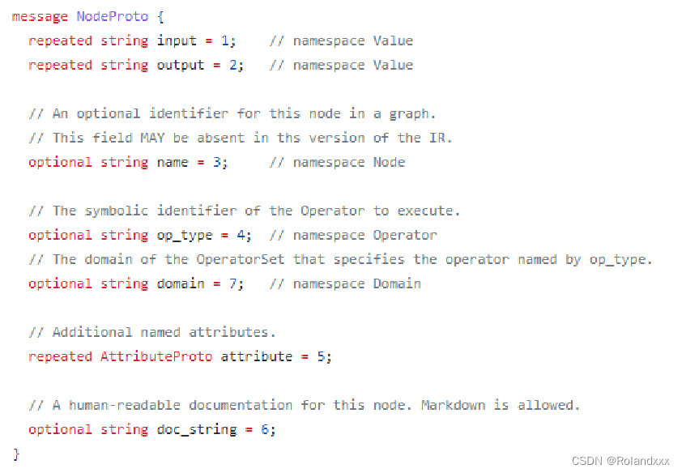
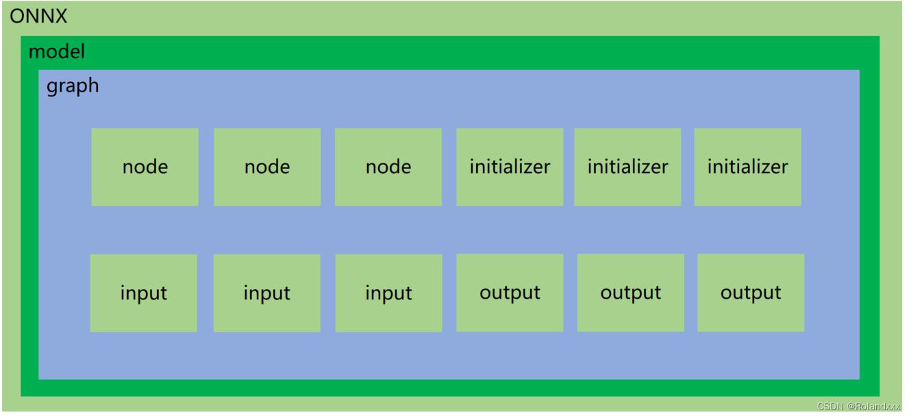

## onnx文件及其结构、正确导出onnx、onnx读取、onnx创建、onnx修改、onnx解析器

### 一.onnx基本概念 
1、ONNX文件就是使用Protobuf序列化过后储存的二进制文件。什么是Protobuf？Protobuf是用来结构化数据的一种库，常用的结构化数据的库有JSON或XML，
 但他们的缺陷就是解析和反解析时速度慢，Protobuf的提出则解决了这个问题。那么什么是结构化数据呢？   
 结构化数据存储格式不限于二进制，可以是文本、二进制或混合的形式，如JSON和XML都属于结构化数据存储格式，
  结构化数据存储格式通常定义了数据的结构、类型、布局和编码方式，以确保数据可以按照一定的规则进行存储和检索）    
2、protoc(编译生成好的二进制文件）作为Protobuf提供的编译器，对onnx-ml.proto（ .proto 文件用于定义数据的数据结构, 一般在系统的环境包路径下可以找到）
   进行编译，得到onnx-ml.pb.h和onnx-ml.pb.cc或onnx_ml_pb2.py  
3、然后用onnx-ml.pb.cc和代码来操作onnx模型文件，如onnx.load()，实现增删改
4、具体来说：onnx-ml.proto这个文件是描述onnx文件如何组成的（即定义了具体的结构化数据存储格式），具有什么结构，它是操作onnx经常参照的东西，
  但是这个.proto文件（里面是用的protobuf语法）只是一个中间表示文件，不具备任何能力，即并不面向存储和传输（序列化，反序列化，读写）。
  所以我们需要用protoc编译.proto文件，是将 .proto 文件编译成不同语言的实现, 得到cc和py文件这两个接口文件，在c++语言中就可以调用cc文件，
  在python中就可以调用编译生成的这个py文件来对.proto文件中定义的数据进行读写操作，这样不同语言中的数据就可以和自定义的结构化数据格式的数据进行交互！
protobuf提供了一种轻便高效的结构化数据存储格式，可以用于结构化数据的串行化（或者说序列化），它很适合作为数据存储或者交换格式，
对于onnx来说，onnx这个二进制文件的保存格式就是 protobuf对应的结构化数据格式。通过把onnx-ml.proto这个文件交给protoc，
protoc是Protobuf提供的编译程序（protoc --help可查看protoc工具的具体用法），把它编译成对应的cc和py文件，作为接口文件，
编译得到的这两个文件的作用就是分别在c++语言环境下和python语言环境下把二进制文件（onnx文件）反序列化成c++的类或者python的类，
这样之后，我们就可以很轻松地实现增删改除了！。
所以拿到cc或py这两个文件就可以直接操作onnx（指调用onnx.load和onnx.helper中的各种make函数,这些函数应该又会调用生成的cc或者py接口文件），实现各种增删改。

ONNX的proto文件：https://github.com/onnx/onnx/blob/main/onnx/onnx-ml.proto

### 二. onnx-ml.proto  
打开onnx-ml.proto这个文件，里面的内容就如下图所示。那我们怎么去读懂这个文件呢？不要被这个东西吓到了。下图的NodeProto就表示表示onnx中有节点类型叫node。NodeProto里面有input，就表示node有input属性，是repeated，即重复类型，是数组，repeated就表示数组。他有output属性，是repeated，即重复类型，也是数组。他有name属性是string类型

对于repeated是数组，对于optional无视他。对于input = 1，后面的数字是id，其实每个属性都有特定的id，这些id不能冲突，所以我们不用关心id是怎么来的。我们只关心是否数组，类型是什么。举个例子，下面图中第一行的input就是数组类型，我们在数组里取值就要用索引，数组里存的元素就是string类型。



### 三. ONNX结构  
ONNX的opset_import表示算子库版本。打开ONNX模型，我们发现里面是这么个结构。ONNX下面是个model，model底下会挂一个graph，graph底下会挂node，initializer，input，output这些节点。

node就表示算子，比如conv，relu，linear这些，都在node里面储存。每一个node里面也有input和output，这里的input和output是表示节点的输入和输出，不要把这个input和output和下面的搞混了，下面表示的是整个模型的输入和输出！node里还有name和op_type，name表示节点名字，可以随便取。但op_type对应的是算子类型，不能随便乱改。node的attribute里储存的就是算子的padding，kernel shape，stride等。
initializer节点储存的是weight，也就是模型的权重和偏置等张量，比如conv算子的weight和bias就是在initializer里储存的。
input是来标记这个onnx哪些节点是input，即输入是什么，会有对应的名称，shape，数据类型，是表示整个网络的输入！
output就用来说明这个onnx的输出是哪些，是表示整个网络的输出！
特殊：Constant是属于model.graph.node，op_type：Constant，所以Constant相当于就被看做一个算子，例如对于anchorgrid这种（它的shape是(bs,N,H,W,2)，N指有N种size的anchor，第4维度的2为wh，具体就是输出的每个特征图的每个像素点都会对应N个anchor box）的常量tensor数据，通常会储存在model.graph.node中，op_type就是Constant，该类型节点在netron中可视化时不会显示出来
model：表示整个onnx的模型，包含图结构和解析器格式、opset版本、导出程序类型，这里的model是指 model=onnx.load(“demo.onnx”)。
model.graph：表示图结构，通常是我们netron看到的主要结构
model.graph.node：表示图中的所有节点，数组，例如conv、bn等节点就是在这里的，通过input、output表示节点之间的连接关系
model.graph.initializer：权重类的数据大都储存在这里
model.graph.input：整个模型的输入储存在这里，表明哪个节点是输入节点，shape是多少
model.graph.output：整个模型的输出储存在这里，表明哪个节点是输出节点，shape是多少



### 四. 如何正确导出onnx
对于任何用到shape、size返回值的参数时，避免直接使用tensor.size的返回值, 例如：tensor.view(tensor.size(0), -1)这操作就用到了.size。我们应该加上int进行对带xx.size或xx.shape的项进行强制转换，tensor.view(int(tensor.size(0)), -1)，这样就可以断开对xx这个张量的跟踪trace，不然由于跟踪的存在，.size操作和.shape操作就会带出很多节点，如shape节点（其实就对应代码里的.shape），gather节点，unsqueeze节点等，多出的这些不必要的节点会带来更多的额外计算和消耗更多的内存空间，而且这些多出的节点不一定能被很好地支持。什么是断开跟踪？ 断开跟踪的意思就是把取决于输入的中间结果变成常量（tensor也属于常量）！
对于nn.Upsample或nn.functional.interpolate函数，使用scale_factor指定倍率，而不是使用size参数指定大小。
对于输入来说，reshape、view操作时，-1的指定请放到batch维度。其他维度可以计算出来即可。batch维度禁止指定为大于-1的明确数字。这是因为在onnx中，-1表示自动计算，而batch维度的大小是不确定的，所以应该使用-1，这对于 batch 维度是有意义的，因为在训练和推断过程中，batch 维度通常是不确定的，而其他维度是固定的。
torch.onnx.export指定dynamic_axes参数时，只指定batch维度，禁止其他维度动态，这个禁止是指最好不要。
使用opset_version=11，当然只要不低于11问题都不大。
避免使用inplace操作，例如y[…, 0:2] = y[…, 0:2] * 2 - 0.5，inplace运算操作会直接在旧内存上进行更改，而并不会另外开辟一个新内存进行运算结果的存放。因为inplace操作会带来一个scatter的算子，这个算子是不被支持的，并且也还会带来很多节点。
尽量少的出现5个维度，例如ShuffleNet Module，可以考虑合并wh避免出现5维。
尽量把让后处理部分在onnx模型中实现，降低后处理复杂度。所以在导出成onnx模型时，我们一般会再自己重写一个精简版的mypredict.py文件，把前处理，模型推理，后处理都拎出来使得推理的代码看着非常简洁，这样首先方便我们将后处理放到模型里面去，再导出onnx。然后就是当onnx导出成功后，通过这个mypredict.py这个精简版代码让我们清楚整个推理流程后，接着下一步利用tensorRT把onnx编译生成engine，然后在C++上进行推理，这里的推理指的是：前处理+模型推理（模型推理是指生成的engine交给tensorRT去做前向传播）+后处理，所以前处理和后处理是和tensorRT无关的。这时C++的前后处理代码就可以直接仿照着mypredict.py这个python版本再写一遍就好了，就会方便了许多。比如说yolov5的后处理中，要借助anchor要做一些乘加的操作，如果我们单独分开在后处理中去做的话，你就会发现你既要准备一个模型，还得专门储存这个模型的anchor的信息，这样代码的复杂度就很高，后处理的逻辑就会非常麻烦。所以把后处理的逻辑尽量得放在模型里面，使得它的tensor很简单通过decode就能实现。然后自己做的后处理性能可能还不够高，如果放到onnx里，tensorRT顺便还能帮你加速一下。很多时候我们onnx已经导出来了，这个时候我还想去实现onnx后处理的增加，这个时候该怎么做呢？ 有两种做法，一种是直接用onnx这个包去操作onnx文件，去增加一些节点是没有问题的，但这个难度系数比较高。第二种做法是可以用pytorch去实现后处理逻辑的代码，把这个后处理专门导出一个onnx，然后再把这个onnx合并到原来的onnx上，这也是实际上我们针对复杂任务专门定制的一个做法。
掌握了这些，就可以保证后面各种情况的顺利了
这些做法的必要性体现在，简化过程的复杂度，去掉一些不必要的节点，比如gather、shape类的节点，这些节点去除了适应性比较好，因为毕竟大家对这种东西的支持都不太好。很多时候，部分不这么改看似也是可以但是需求复杂后，依旧存在各类问题。按照说的这么修改，基本总能成。做了这些，就不需要使用onnx-simplifer了

pytorch.onnx.export使用示例，用了一个dummy_input作为模型的输入，通过变量名可以发现这是表示假输入，所以dummy_input的值可以随便设置，只要shape满足就行：
pytorch.onnx.export方法参数详解 

```python
import torch
import torch.nn as nn
import torch.nn.functional as F
import torch.onnx
import os

class Model(torch.nn.Module):
    def __init__(self):
        super().__init__()

        self.conv = nn.Conv2d(1, 1, 3, padding=1)
        self.relu = nn.ReLU()
        self.conv.weight.data.fill_(1)
        self.conv.bias.data.fill_(0)
    
    def forward(self, x):
        x = self.conv(x)
        x = self.relu(x)
        return x

# 这个包对应opset11的导出代码，如果想修改导出的细节，可以在这里修改代码
# import torch.onnx.symbolic_opset11
print("对应opset文件夹代码在这里：", os.path.dirname(torch.onnx.__file__))

model = Model()

#dummy如果改成torch.zeros(8, 1, 3, 3)，对生成的onnx图是没有影响的
dummy = torch.zeros(1, 1, 3, 3)

#生成的onnx图的conv算子的bias为1，这是由输出通道数决定的，因为输出通道为1
torch.onnx.export(
    model, 

    # 这里的args，是指输入给model的参数，需要传递tuple，因此用括号
    (dummy,), 

    # 储存的文件路径
    "demo_xx.onnx",  

    # 打印详细信息
    verbose=True, 

    # 为输入和输出节点指定名称，方便后面查看或者操作
    input_names=["image"], 
    output_names=["output"], 

    # 这里的opset，指，各类算子以何种方式导出，对应于symbolic_opset11
    opset_version=11, 

    # 表示他有batch、height、width3个维度是动态的，在onnx中给其赋值为-1
    # 通常，我们只设置batch为动态，其他的避免动态
    dynamic_axes={
        "image": {0: "batch", 2: "height", 3: "width"},
        "output": {0: "batch", 2: "height", 3: "width"},
    }
)

print("Done.!")

```

```python
import onnx
import onnx.helper as helper
import numpy as np

model = onnx.load("demo.onnx")

#打印信息
print("==============node信息")
# print(helper.printable_graph(model.graph))
print(model)

conv_weight = model.graph.initializer[0]
conv_bias = model.graph.initializer[1]

#initializer里有dims这个属性是可以通过打印model看到的
#打印输出的是1，dims在onnx-ml.proto文件中是repeated类型的，即数组类型，所以要用索引去取！
print(conv_weight.dims[0])
#取node节点的第一个元素
print("xxxxx",model.graph.node[0])

# 数据是以protobuf的格式存储的，因此当中的数值会以bytes的类型保存，通过np.frombuffer方法还原成类型为float32的ndarray
print(f"===================={conv_weight.name}==========================")
print(conv_weight.name, np.frombuffer(conv_weight.raw_data, dtype=np.float32))

print(f"===================={conv_bias.name}==========================")
print(conv_bias.name, np.frombuffer(conv_bias.raw_data, dtype=np.float32))

```
### 五.onnx创建(其实就是相当于填值）
```python
import onnx # pip install onnx>=1.10.2
import onnx.helper as helper
import numpy as np

# https://github.com/onnx/onnx/blob/v1.2.1/onnx/onnx-ml.proto

nodes = [
    helper.make_node(
        name="Conv_0",   # 节点名字，不要和op_type搞混了
        op_type="Conv",  # 节点的算子类型, 比如'Conv'、'Relu'、'Add'这类，详细可以参考onnx给出的算子列表
        inputs=["image", "conv.weight", "conv.bias"],  # 各个输入的名字，结点的输入包含：输入和算子的权重。必有输入X和权重W，偏置B可以作为可选。
        outputs=["3"],  
        pads=[1, 1, 1, 1], # 其他字符串为节点的属性，attributes在官网被明确的给出了，标注了default的属性具备默认值。
        group=1,
        dilations=[1, 1],
        kernel_shape=[3, 3],
        strides=[1, 1]
    ),
    helper.make_node(
        name="ReLU_1",
        op_type="Relu",
        inputs=["3"],
        outputs=["output"]
    )
]

initializer = [
    helper.make_tensor(
        name="conv.weight",
        data_type=helper.TensorProto.DataType.FLOAT,
        dims=[1, 1, 3, 3],
        vals=np.array([1.0, 1.0, 1.0, 1.0, 1.0, 1.0, 1.0, 1.0, 1.0], dtype=np.float32).tobytes(),
        raw=True
    ),
    helper.make_tensor(
        name="conv.bias",
        data_type=helper.TensorProto.DataType.FLOAT,
        dims=[1],
        vals=np.array([0.0], dtype=np.float32).tobytes(),
        raw=True
    )
]

inputs = [
    helper.make_value_info(
        name="image",
        type_proto=helper.make_tensor_type_proto(
            elem_type=helper.TensorProto.DataType.FLOAT,
            shape=["batch", 1, 3, 3]
        )
    )
]

outputs = [
    helper.make_value_info(
        name="output",
        type_proto=helper.make_tensor_type_proto(
            elem_type=helper.TensorProto.DataType.FLOAT,
            shape=["batch", 1, 3, 3]
        )
    )
]

graph = helper.make_graph(
    name="mymodel",
    inputs=inputs,
    outputs=outputs,
    nodes=nodes,
    initializer=initializer
)

# 如果名字不是ai.onnx，netron解析就不是太一样了
opset = [
    helper.make_operatorsetid("ai.onnx", 11)
]

# producer主要是保持和pytorch一致
model = helper.make_model(graph, opset_imports=opset, producer_name="pytorch", producer_version="1.9")
onnx.save_model(model, "my.onnx")

print(model)
print("Done.!")

```
### 六.onnx修改(把预处理添加到onnx中）
```python
import onnx
import onnx.helper as helper
import numpy as np

model = onnx.load("demo.onnx")

# 可以取出权重
conv_weight = model.graph.initializer[0]
conv_bias = model.graph.initializer[1]
# 修改权重
conv_weight.raw_data = np.arange(9, dtype=np.float32).tobytes()

#自己创建新的节点
newitem = helper.make_node(...)#省略具体细节，用的时候直接查这个函数用法

#把旧的item节点替换成新的newitem节点，省略了item的来源，但只要知道item的类型是node就行了
#主要是为了强调替换节点是用CopyFrom这个函数，它是protobuf的一个函数，具体细节可以查下protobuf的官方文档，在message里
item.CopyFrom(newitem)

#删除节点,用remove函数
#注意的是删除节点后，要把原节点的输入节点和原节点的输出节点接上去
model.graph.node.remove(newitem)

#将onnx的动态batch改为静态
input = model.graph.input[0]
print(type(input))#<class 'onnx.onnx_ml_pb2.ValueInfoProto'>

#因为发现input的类型是ValueInfoProto，所以我们用make_tensor_value_info函数来构建一个同样类型的东西，但唯一不同的就是用的是静态batch
new_input = helper.make_tensor_value_info(input.name,1,[1,3,640,640])#1表示类型，用的是枚举类型，具体对应哪个可以查看1的type，然后去.proto文件里找。[1,3,640,640]是shape，因为第一维度不再是字符串，所以是静态batch
#用新节点替换掉旧节点就实现了把动态batch改为静态的操作
model.graph.input[0].CopyFrom(new_input)


#把预处理作为新节点添加进onnx文件
import torch
class Preprocess(torch.nn.Module):
	def __init__(self):
		super().__init__()
		#self.mean和self.std写在init里是为了让它变成一个确定的东西。如果放到forward函数里，导onnx时就会生成出多的节点
		self.mean = torch.rand(1,1,1,3)
		self.std = torch.rand(1,1,1,3)
	def forward(self,x):
		#输入： x = B × H × W × C   Uint8
		#输出： y = B × C × H × W   Float32 减去均值除以标准差
		x = x.float()#转换成float32，不然默认会变成float64，float64就太慢了
		x = (x/255.0 - mean) / std
		x = x.permute(0,3,1,2)
		return x
pre = Preprocess()
#(torch.zeros(1,640,640,3,dtype=torch.uint8),)输入用元组表示，这里表示只有一个输入
torch.onnx.export(
	pre,(torch.zeros(1,640,640,3,dtype=torch.uint8),),"preprocess.onnx"
	)
#在拿到preprocess.onnx文件后，就把它读进来，和原来的onnx对接起来，这样就完成了把预处理加到原来的onnx里了
pre_onnx = onnx.load("preprocess.onnx")
#接下来把预处理作为新节点添加进原onnx文件的具体步骤
#1. 先把pre_onnx的所有节点以及输入输出名称都加上前缀，因为可能和需要合并的onnx文件造成名称冲突
#2. 先把原onnx中的image为输入的节点，修改为pre_onnx的输出节点
#3. 把pre_onnx的node全部放到原onnx文件的node中，这是因为pre_onnx.onnx只用到了node，所以只需要把node加到原onnx文件中的node里去，但如果pre_onnx.onnx里除了node还有initializer，这时也得把initializer加到原onnx文件中的node里去。
#4. 把pre_onnx的输入名称作为原onnx文件的input名称
#第一步
for n in pre_onnx.graph.node:
	n.name = f"pre/{n.name}" #加前缀,输出类似为pre/Div_4
	for i in range(len(n.input)：
		n.input[i] = f"pre/{n.input[i]}"
	for i in range(len(n.output)：
		n.output[i] = f"pre/{n.output[i]}"	

#第二步
for n in model.graph.node:
	if n.name == "Conv_0":
		n.input[0] = "pre/" + pre_onnx.graph.output[0].name
#第三步
for n in pre_onnx.graph.node:
	model.graph.node.append(n)
#第四步
input_name = "pre/" + pre_onnx.graph.input[0].name
model.graph.input[0].CopyFrom(pre_onnx.graph.input[0])
model.graph.input[0].name = input_name	
	
# 修改权重后储存成新的onnx，不然不生效
onnx.save_model(model, "demo.change.onnx")
print("Done.!")

```

### 七.ONNX解析器
onnx解析器用处就是通过解析onnx文件生成对应tensorRT能看懂的模型（即转换为tensorRT的C++接口定义的模型）。

onnx解析器有两个选项，libnvonnxparser.so或者https://github.com/onnx/onnx-tensorrt（源代码）。使用源代码的目的，是为了更好的进行自定义封装，简化插件开发或者模型编译的过程，更加具有定制化，遇到问题可以调试。
